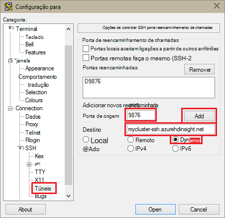
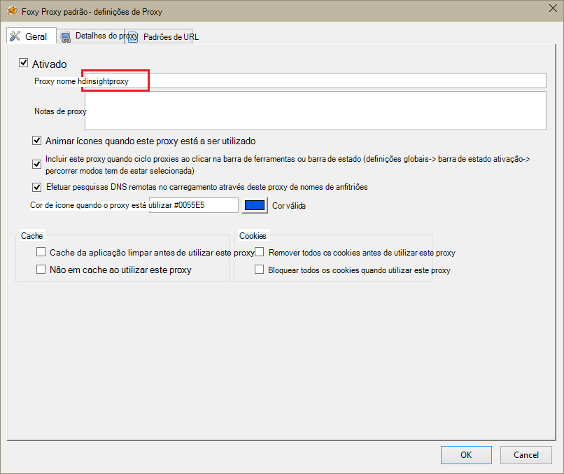
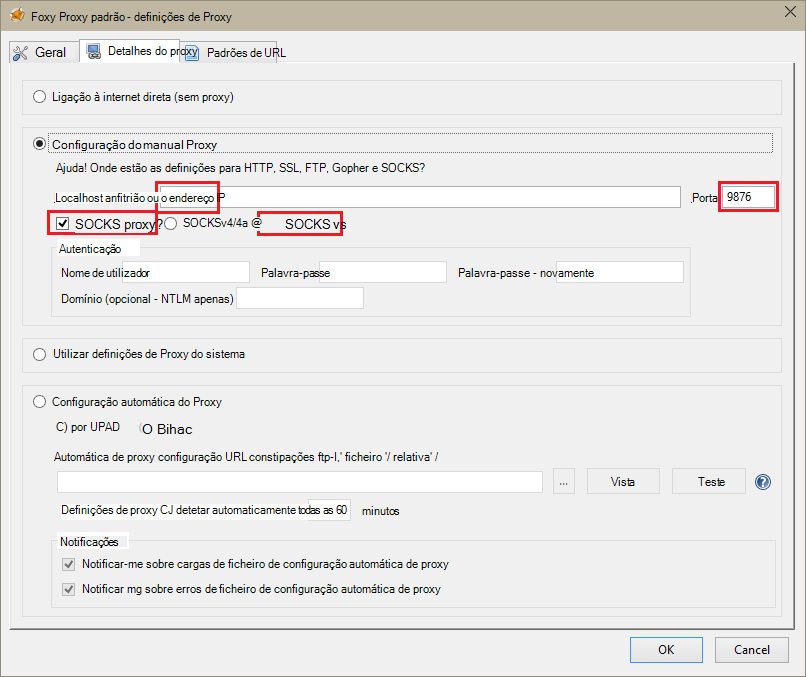
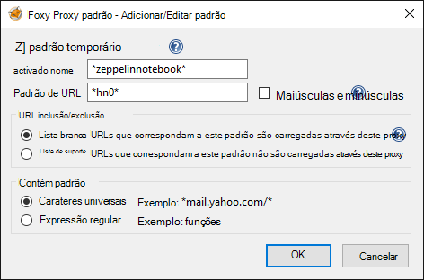
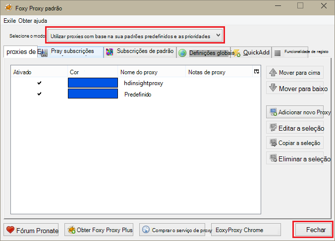

<properties 
    pageTitle="Instalar o blocos de notas Zeppelin para cluster de motores de Apache no HDInsight Linux | Microsoft Azure" 
    description="Instruções passo a passo sobre como instalar e utilizar blocos de notas Zeppelin com clusters de motores no HDInsight Linux." 
    services="hdinsight" 
    documentationCenter="" 
    authors="nitinme" 
    manager="jhubbard" 
    editor="cgronlun"/>

<tags 
    ms.service="hdinsight" 
    ms.workload="big-data" 
    ms.tgt_pltfrm="na" 
    ms.devlang="na" 
    ms.topic="article" 
    ms.date="10/28/2016" 
    ms.author="nitinme"/>

# Instalar o blocos de notas Zeppelin para cluster de motores de Apache no HDInsight Linux

Saiba como instalar o blocos de notas Zeppelin em motores de Apache clusters e como utilizar os blocos de notas Zeppelin para executar motores tarefas.

> [AZURE.IMPORTANT] Blocos de notas Zeppelin estão agora disponíveis por predefinição com clusters de motores. Não precisa de explicitamente instalá-los num cluster de motores deixem. Para mais informações, consulte [utilizar Zeppelin blocos de notas com Apache motores cluster no HDInsight Linux](hdinsight-apache-spark-zeppelin-notebook.md). 

**Pré-requisitos:**

* Antes de começar este tutorial, tem de ter uma subscrição do Azure. Consulte o artigo [obter Azure versão de avaliação gratuita](https://azure.microsoft.com/documentation/videos/get-azure-free-trial-for-testing-hadoop-in-hdinsight/).
* Um cluster de motores de Apache. Para obter instruções, consulte o artigo [Criar motores de Apache clusters no Azure HDInsight](hdinsight-apache-spark-jupyter-spark-sql.md).
* Um cliente SSH. Para as distribuições Linux e Unix ou Macintosh OS X, a `ssh` comando é fornecido com o sistema operativo. Para o Windows, recomendamos que [betumes](http://www.chiark.greenend.org.uk/~sgtatham/putty/download.html)

    > [AZURE.NOTE] Se pretende utilizar um cliente SSH de `ssh` ou betumes, consulte a documentação para o seu cliente sobre como estabelecer um túnel SSH.

* Um browser que pode ser configurado para utilizar um proxy de SOCKS

* __(opcional)__: um plug-in como [FoxyProxy](http://getfoxyproxy.org/,) que podem ser aplicadas regras que apenas encaminhar pedidos específicos através do túnel.

    > [AZURE.WARNING] Sem um plug-in como FoxyProxy, todos os pedidos feitos através do browser podem ser encaminhados através do túnel. Isto pode resultar em mais lento carregamento das páginas web no seu browser.

## Instalar o Zeppelin num cluster motores

Pode instalar o Zeppelin num cluster de motores utilizando a ação de script. Acção de script utiliza scripts personalizados para instalar componentes num cluster que não estão disponíveis por predefinição. Pode utilizar o script personalizado para instalar Zeppelin a partir do Portal do Azure, utilizando o HDInsight .NET SDK ou ao utilizar o Azure PowerShell. Pode utilizar o script para instalar Zeppelin quer como parte da criação do cluster ou depois do cluster está a trabalhar. Ligações nas secções abaixo fornecem as instruções sobre como fazê-lo. 

### Utilizar o Portal do Azure

Para obter instruções sobre como utilizar o Portal do Azure para executar a ação de script instalar Zeppelin, consulte o artigo [Personalizar HDInsight clusters utilizando Script ação](hdinsight-hadoop-customize-cluster-linux.md#use-a-script-action-from-the-azure-portal). Terá de fazer algumas alterações para as instruções no artigo.

* Tem de utilizar o script para instalar Zeppelin. O script personalizado para instalar o Zeppelin num cluster motores no HDInsight está disponível as ligações seguintes:
    * Para os motores 1.6.0 clusters-`https://hdiconfigactions.blob.core.windows.net/linuxincubatorzeppelinv01/install-zeppelin-spark160-v01.sh`
    * Para os motores 1.5.2 clusters-`https://hdiconfigactions.blob.core.windows.net/linuxincubatorzeppelinv01/install-zeppelin-spark151-v01.sh`

* Tem de executar a ação de script apenas na headnode.

* O script não é necessário quaisquer parâmetros. 

### Utilizar o HDInsight .NET SDK

Para obter instruções sobre como utilizar HDInsight .NET SDK para executar a ação de script instalar Zeppelin, consulte o artigo [Personalizar HDInsight clusters utilizando Script ação](hdinsight-hadoop-customize-cluster-linux.md#use-a-script-action-from-the-hdinsight-net-sdk). Terá de fazer algumas alterações para as instruções no artigo.

* Tem de utilizar o script para instalar Zeppelin. O script personalizado para instalar o Zeppelin num cluster motores no HDInsight está disponível as ligações seguintes:
    * Para os motores 1.6.0 clusters-`https://hdiconfigactions.blob.core.windows.net/linuxincubatorzeppelinv01/install-zeppelin-spark160-v01.sh`
    * Para os motores 1.5.2 clusters-`https://hdiconfigactions.blob.core.windows.net/linuxincubatorzeppelinv01/install-zeppelin-spark151-v01.sh`

* O script não é necessário quaisquer parâmetros. 

* Defina o tipo de cluster que estiver a criar para motores.

### Utilizar o Azure PowerShell

Utilize o fragmento de PowerShell que se segue para criar um cluster de motores HDInsight Linux com Zeppelin instalado. Dependendo da versão de cluster de motores tiver, tem de atualizar o fragmento de PowerShell abaixo para incluir a ligação para o script personalizado correspondente. 

* Para os motores 1.6.0 clusters-`https://hdiconfigactions.blob.core.windows.net/linuxincubatorzeppelinv01/install-zeppelin-spark160-v01.sh`
* Para os motores 1.5.2 clusters-`https://hdiconfigactions.blob.core.windows.net/linuxincubatorzeppelinv01/install-zeppelin-spark151-v01.sh`

[AZURE.INCLUDE [upgrade-powershell](../../includes/hdinsight-use-latest-powershell.md)]

    Login-AzureRMAccount
    
    # PROVIDE VALUES FOR THE VARIABLES
    $clusterAdminUsername="admin"
    $clusterAdminPassword="<<password>>"
    $clusterSshUsername="adminssh"
    $clusterSshPassword="<<password>>"
    $clusterName="<<clustername>>"
    $clusterContainerName=$clusterName
    $resourceGroupName="<<resourceGroupName>>"
    $location="<<region>>"
    $storage1Name="<<storagename>>"
    $storage1Key="<<storagekey>>"
    $subscriptionId="<<subscriptionId>>"
    
    Select-AzureRmSubscription -SubscriptionId $subscriptionId
    
    $passwordAsSecureString=ConvertTo-SecureString $clusterAdminPassword -AsPlainText -Force
    $clusterCredential=New-Object System.Management.Automation.PSCredential ($clusterAdminUsername, $passwordAsSecureString)
    $passwordAsSecureString=ConvertTo-SecureString $clusterSshPassword -AsPlainText -Force
    $clusterSshCredential=New-Object System.Management.Automation.PSCredential ($clusterSshUsername, $passwordAsSecureString)
    
    $azureHDInsightConfigs= New-AzureRmHDInsightClusterConfig -ClusterType Spark
    $azureHDInsightConfigs.DefaultStorageAccountKey = $storage1Key
    $azureHDInsightConfigs.DefaultStorageAccountName = "$storage1Name.blob.core.windows.net"
    
    Add-AzureRMHDInsightScriptAction -Config $azureHDInsightConfigs -Name "Install Zeppelin" -NodeType HeadNode -Parameters "void" -Uri "https://hdiconfigactions.blob.core.windows.net/linuxincubatorzeppelinv01/install-zeppelin-spark151-v01.sh"
    
    New-AzureRMHDInsightCluster -Config $azureHDInsightConfigs -OSType Linux -HeadNodeSize "Standard_D12" -WorkerNodeSize "Standard_D12" -ClusterSizeInNodes 2 -Location $location -ResourceGroupName $resourceGroupName -ClusterName $clusterName -HttpCredential $clusterCredential -DefaultStorageContainer $clusterContainerName -SshCredential $clusterSshCredential -Version "3.3"
 
## Configurar o SSH túnel para aceder a um bloco de notas Zeppelin

Irá utilizar SSH túneis para aceder a blocos de notas Zeppelin em execução num cluster de motores no HDInsight Linux. Os passos abaixo demonstram como criar um SSH túnel utilizando ssh linha de comandos (Linux) e betumes (Windows).

### Criar um túnel utilizando o comando SSH (Linux)

Utilize o seguinte comando para criar um SSH túnel utilizando o `ssh` comando. Substituir o __nome de utilizador__ com um utilizador SSH para o seu cluster HDInsight e, substitua o __nome de cluster__ com o nome do seu cluster HDInsight

    ssh -C2qTnNf -D 9876 USERNAME@CLUSTERNAME-ssh.azurehdinsight.net

Esta ação cria uma ligação que encaminha o tráfego para porta local 9876 ao cluster em SSH. As opções são:

* **D 9876** - a porta local que irá encaminhar o tráfego através do túnel.

* **C** - comprimir todos os dados, porque o tráfego da web é principalmente texto.

* **2** - forçar SSH para experimentar o protocolo apenas versão 2.

* **as perguntas** - sossegada, modo.

* **T** - desativar pseudo tty de alocação, uma vez que recomendamos apenas o utilizador reencaminha uma porta.

* **n** - impedir a leitura do STDIN, uma vez que recomendamos apenas o utilizador reencaminha uma porta.

* **N** - não pode executar um comando remoto, uma vez que recomendamos apenas o utilizador reencaminha uma porta.

* **f** - executado em segundo plano.

Se tiver configurado o cluster com uma chave SSH, poderá ter de utilizar o `-i` parâmetro e especifique o caminho para a chave privada de SSH.

Assim que termina o comando, o tráfego enviado à porta 9876 no computador local será encaminhada sobre Secure Sockets Layer (SSL) ao cluster head nó e parecer originar aí.

### Criar um túnel utilizando betumes (Windows)

Utilize os passos seguintes para criar um túnel SSH utilizando betumes.

1. Abra betumes e introduza as suas informações de ligação. Se não estiver familiarizado com betumes, consulte o artigo [Utilizar SSH com baseado em Linux Hadoop no HDInsight a partir do Windows](hdinsight-hadoop-linux-use-ssh-windows.md) para obter informações sobre como utilizá-la com HDInsight.

2. Na secção de **categoria** à esquerda da caixa de diálogo, expanda a **ligação**, expanda **SSH**e, em seguida, selecione **túneis**.

3. Forneça as seguintes informações no formulário de **Opções de reencaminhamento de portas SSH de controlar** :

    * **Porta de origem** - a porta no cliente que pretende reencaminhar. Por exemplo, **9876**.

    * Endereço de **destino** - o SSH para o cluster baseado em Linux HDInsight. Por exemplo, **mycluster ssh.azurehdinsight.net**.

    * **Dinâmico** - permite dinâmico SOCKS proxy encaminhamento.

    

4. Clique em **Adicionar** para adicionar as definições e, em seguida, clique em **Abrir** para abrir uma ligação de SSH.

5. Quando lhe for pedido, inicie sessão no servidor. Isto irá estabelecer uma sessão SSH e ativar o túnel.

### Utilizar o túnel a partir do browser

> [AZURE.NOTE] Os passos nesta secção utilizam o browser FireFox, tal como está livre disponível para sistemas Linux, Unix, Macintosh OS X e Windows. Outros modernos browsers como o Google Chrome, Microsoft Edge ou Apple Safari deverão funcionar bem; No entanto, o plug-in de FoxyProxy utilizado em alguns passos poderá não estar disponível para todos os browsers.

1. Configure o browser para utilizar **localhost:9876** como um proxy de **SOCKS v5** . Eis o aspeto das definições do Firefox. Se utilizou uma porta diferente 9876, altere a porta para daquele que utilizou:

    

    > [AZURE.NOTE] Selecionar **DNS remoto** resolverá pedidos de sistema de nomes de domínio (DNS) utilizando o cluster HDInsight. Se esta é não selecionada, DNS serão localmente resolvido.

2. Certifique-se de que o tráfego está a ser encaminhado através do túnel por vising site, como [http://www.whatismyip.com/](http://www.whatismyip.com/) com as definições de proxy ativado ou desativado no Firefox. Enquanto as definições estão ativadas, o endereço IP será para uma máquina no Centro de dados do Microsoft Azure.

### Extensões do browser

Enquanto a configurar o browser para utilizar o túnel () funciona, normalmente não queira encaminhar todo o tráfego através do túnel. Extensões de browser tal como [FoxyProxy](http://getfoxyproxy.org/) suportam para pedidos de URL de correspondência de padrões (FoxyProxy padrão ou Plus apenas), para que apenas os pedidos de URL específicos serão enviados através do túnel.

Se tiver instalado FoxyProxy padrão, utilize os passos seguintes configurá-lo para reencaminhar apenas o tráfego para HDInsight sobre o túnel.

1. Abra a extensão de FoxyProxy no seu browser. Por exemplo, no Firefox, selecione o ícone de FoxyProxy ao lado do campo endereço.

    

2. Selecione **Adicionar novo Proxy**, selecione o separador **Geral** e, em seguida, introduza um nome de proxy de **HDInsightProxy**.

    

3. Selecione o separador de **Detalhes do Proxy** e preencher os seguintes campos:

    * **Anfitrião ou o endereço IP** - este é localhost, uma vez que estamos a utilizar um túnel SSH no computador local.

    * **Porta** - esta é a porta que utilizou para o túnel SSH.

    * **SOCKS proxy** - Selecione esta opção para ativar o browser para utilizar o túnel como um proxy.

    * **SOCKS v5** - Selecione esta opção para configurar a versão necessária para o proxy.

    

4. Selecione o separador de **Padrões de URL** e, em seguida, selecione **Adicionar novo padrão**. Utilize o seguinte procedimento para definir o padrão e, em seguida, clique em **OK**:

    * **Nome do padrão** - **zeppelinnotebook** - este é apenas um nome amigável para o padrão.

    * **Padrão de URL** - **\*hn0** * - Isto define um padrão que corresponda ao nome de domínio completamente qualificado interna do ponto final onde estão alojados os blocos de notas Zeppelin. Porque os blocos de notas Zeppelin só estão disponíveis em headnode0 do cluster e o ponto final é normalmente `http://hn0-<string>.internal.cloudapp.net`, utilizando o padrão * *hn0** seria Certifique-se de que o pedido é redirecionado para o ponto final Zeppelin.

        

4. Clique em **OK** para adicionar o proxy e fechar **As definições de Proxy**.

5. Na parte superior da caixa de diálogo FoxyProxy, alterar **O modo de selecionar** para **os proxies de utilização com base na sua padrões predefinidos e as prioridades**e, em seguida, clique em **Fechar**.

    

Depois de seguir estes passos, apenas os pedidos de URLs que contenham a cadeia __hn0__ vai ser encaminhados através do túnel SSL. 

## Aceder ao bloco de notas Zeppelin

Assim que tiver SSH túnel configuração, pode utilizar os seguintes passos para aceder ao bloco de notas Zeppelin no cluster motores ao seguir os passos abaixo. Nesta secção, irá ver como executar % sql e declarações de ramo %.

1. A partir do web browser, abra o ponto final do seguinte:

        http://hn0-myspar:9995

    * **hn0** indica headnode0
    * **myspar** é as primeiro seis letras do nome de cluster motores.
    * **9995** é a porta onde o bloco de notas Zeppelin está acessível.

2. Crie um novo bloco de notas. A partir do painel de cabeçalho, clique em **Bloco de notas**e, em seguida, clique em **Criar nova nota**.

    ![Criar um novo bloco de notas Zeppelin] (./media/hdinsight-apache-spark-use-zeppelin-notebook/hdispark.createnewnote.png "Criar um novo bloco de notas Zeppelin")

    Na mesma página, no cabeçalho do **Bloco de notas** , deverá ver um novo bloco de notas com o nome começando **XXXXXXXXX de nota**. Clique em novo bloco de notas.

3. Na página web para o novo bloco de notas, clique no título e alterar o nome do bloco de notas se pretender. Prima ENTER para guardar a alteração de nome. Além disso, certifique-se de que o cabeçalho do bloco de notas mostra um Estado de **ligado** no canto superior direito.

    ![Estado do bloco de notas Zeppelin] (./media/hdinsight-apache-spark-use-zeppelin-notebook/hdispark.newnote.connected.png "Estado do bloco de notas Zeppelin")

### Executar instruções SQL

4. Carregar os dados de exemplo para uma tabela temporária. Quando cria um cluster de motores no HDInsight, o ficheiro de dados de exemplo, **hvac.csv**, é copiado para a conta de armazenamento associado em **\HdiSamples\SensorSampleData\hvac**.

    No parágrafo vazio que é criado por predefinição no novo bloco de notas, cole o seguinte fragmento.

        // Create an RDD using the default Spark context, sc
        val hvacText = sc.textFile("wasbs:///HdiSamples/HdiSamples/SensorSampleData/hvac/HVAC.csv")
        
        // Define a schema
        case class Hvac(date: String, time: String, targettemp: Integer, actualtemp: Integer, buildingID: String)
        
        // Map the values in the .csv file to the schema
        val hvac = hvacText.map(s => s.split(",")).filter(s => s(0) != "Date").map(
            s => Hvac(s(0), 
                    s(1),
                    s(2).toInt,
                    s(3).toInt,
                    s(6)
            )
        ).toDF()
        
        // Register as a temporary table called "hvac"
        hvac.registerTempTable("hvac")
        
    Prima **SHIFT + ENTER** ou clique no botão **Reproduzir** para o parágrafo executar o fragmento. O estado no canto direito do parágrafo deve progresso a partir do pronto, pendente, a trabalhar RAPIDAMENTE para terminado. O resultado é apresentado na parte inferior do mesmo parágrafo. A captura de ecrã tem o seguinte aspeto:

    ![Criar uma tabela a partir de dados não processados temporária] (./media/hdinsight-apache-spark-use-zeppelin-notebook/hdispark.note.loaddDataintotable.png "Criar uma tabela a partir de dados não processados temporária")

    Também pode fornecer um título para cada parágrafo. A partir do canto direito, clique no ícone **Definições** e, em seguida, clique em **Mostrar título**.

5. Pode agora executar instruções SQL de motores na tabela **AVAC** . Cole a seguinte consulta um novo parágrafo. A consulta obtém o ID do edifício e a diferença entre o destino e temperaturas reais para cada criar numa determinada data. Prima **SHIFT + ENTER**.

        %sql
        select buildingID, (targettemp - actualtemp) as temp_diff, date 
        from hvac
        where date = "6/1/13" 

    A instrução de **sql de %** no início indica o bloco de notas para utilizar o intérprete motores SQL. Pode observe as intérpretes definidos a partir do separador **interpretação** no cabeçalho do bloco de notas.

    A seguinte captura de ecrã mostra o resultado.

    ![Executar uma instrução de SQL motores utilizando o bloco de notas] (./media/hdinsight-apache-spark-use-zeppelin-notebook/hdispark.note.sparksqlquery1.png "Executar uma instrução de SQL motores utilizando o bloco de notas")

     Para alternar entre diferentes representações para o mesmo resultado, clique em Opções de visualização (realçadas no retângulo). Clique em **Definições** para escolher que consitutes a chave e os valores no resultado. A captura de ecrã acima utiliza **buildingID** como a tecla e a média dos **temp_diff** como o valor.

    
6. Também pode executar declarações de SQL motores utilizar variáveis de consulta. O fragmento de seguinte mostra como definir uma variável, **Temp**, na consulta com os valores possíveis que pretende de consulta com. Quando executar a consulta pela primeira vez, é preenchida automaticamente uma seta de lista pendente com os valores especificados para a variável.

        %sql
        select buildingID, date, targettemp, (targettemp - actualtemp) as temp_diff
        from hvac
        where targettemp > "${Temp = 65,65|75|85}" 

    Cole este fragmento de um parágrafo novo e prima **SHIFT + ENTER**. A seguinte captura de ecrã mostra o resultado.

    ![Executar uma instrução de SQL motores utilizando o bloco de notas] (./media/hdinsight-apache-spark-use-zeppelin-notebook/hdispark.note.sparksqlquery2.png "Executar uma instrução de SQL motores utilizando o bloco de notas")

    Para consultas subsequentes, pode selecionar um novo valor a partir do menu pendente e execute novamente a consulta. Clique em **Definições** para escolher que consitutes a chave e os valores no resultado. A captura de ecrã acima utiliza **buildingID** como chave, a média dos **temp_diff** como o valor e **targettemp** como o grupo.

7. Reinicie o intérprete motores SQL para sair da aplicação. Clique no separador de **interpretação** na parte superior e para o intérprete motores, clique em **reiniciar**.

    ![Reinicie o intepreter Zeppelin] (./media/hdinsight-apache-spark-use-zeppelin-notebook/hdispark.zeppelin.restart.interpreter.png "Reinicie o intepreter Zeppelin")

### Executar declarações de ramo

1. A partir do bloco de notas Zeppelin, clique no botão de **interpretação** .

    ![Ramo de actualização de interpretação] (./media/hdinsight-apache-spark-use-zeppelin-notebook/zeppelin-update-hive-interpreter-1.png "Ramo de actualização de interpretação")

2. Para interpretação **ramo** , clique em **Editar**.

    ![Ramo de actualização de interpretação] (./media/hdinsight-apache-spark-use-zeppelin-notebook/zeppelin-update-hive-interpreter-2.png "Ramo de actualização de interpretação")

    Atualize as seguintes propriedades.

    * Definir **default.password** para a palavra-passe que especificou para o utilizador admin durante a criação do cluster de motores de HDInsight.
    * Definir **default.url** `jdbc:hive2://<spark_cluster_name>.azurehdinsight.net:443/default;ssl=true?hive.server2.transport.mode=http;hive.server2.thrift.http.path=/hive2`. Substituir ** \<spark_cluster_name >** com o nome do seu cluster de motores.
    * Defina **default.user** para o nome do utilizador ao administrador que especificou ao criar o cluster. Por exemplo, o *administrador*.

3. Clique em **Guardar** e quando lhe for pedido para reiniciar o intérprete ramo, clique em **OK**.

4. Criar um novo bloco de notas e executar a seguinte instrução para todas as tabelas de ramo no cluster de lista.

        %hive
        SHOW TABLES

    Por predefinição, um cluster de HDInsight tem uma tabela de exemplo denominada **hivesampletable** , para que deverá ver o resultado seguinte.

    ![Ramo de registo de saída] (./media/hdinsight-apache-spark-use-zeppelin-notebook/zeppelin-update-hive-interpreter-3.png "Ramo de registo de saída")

5. Execute a seguinte instrução para a lista de registos na tabela.

        %hive
        SELECT * FROM hivesampletable LIMIT 5

    Deverá um resultado semelhante ao seguinte.

    ![Ramo de registo de saída] (./media/hdinsight-apache-spark-use-zeppelin-notebook/zeppelin-update-hive-interpreter-4.png "Ramo de registo de saída")

## Consulte também

* [Descrição geral: Apache motores no Azure HDInsight](hdinsight-apache-spark-overview.md)

### Cenários

* [Motores com BI: efetuar uma análise de dados interativos utilizando motores no HDInsight com ferramentas de BI](hdinsight-apache-spark-use-bi-tools.md)

* [Motores com máquina formação: utilizar motores no HDInsight para analisar temperatura edifício utilizando dados de AVAC](hdinsight-apache-spark-ipython-notebook-machine-learning.md)

* [Motores com máquina formação: utilizar motores no HDInsight para prever resultados da inspeção de alimentação](hdinsight-apache-spark-machine-learning-mllib-ipython.md)

* [Transmissão de motores: Motores de utilização no HDInsight para criar aplicações de transmissão em tempo real](hdinsight-apache-spark-eventhub-streaming.md)

* [Análise de registo de Web site utilizando motores no HDInsight](hdinsight-apache-spark-custom-library-website-log-analysis.md)

### Criar e executar as aplicações

* [Criar uma aplicação autónoma Scala](hdinsight-apache-spark-create-standalone-application.md)

* [Executar tarefas remotamente num cluster de motores utilizando Lívio](hdinsight-apache-spark-livy-rest-interface.md)

### Ferramentas e extensões

* [Utilize o plug-in do HDInsight ferramentas para obter IntelliJ IDEIA para criar e submeter motores Scala aplicações](hdinsight-apache-spark-intellij-tool-plugin.md)

* [Utilizar o plug-in do HDInsight ferramentas para obter IntelliJ IDEIA para depurar as aplicações de motores remotamente](hdinsight-apache-spark-intellij-tool-plugin-debug-jobs-remotely.md)

* [Kernels disponíveis para o bloco de notas Jupyter num cluster de motores para HDInsight](hdinsight-apache-spark-jupyter-notebook-kernels.md)

* [Utilizar os pacotes externos com Jupyter blocos de notas](hdinsight-apache-spark-jupyter-notebook-use-external-packages.md)

* [Instalar Jupyter no seu computador e ligar a um cluster de motores de HDInsight](hdinsight-apache-spark-jupyter-notebook-install-locally.md)

### Adicionar e utilizar recursos

* [Gerir os recursos para o cluster de motores de Apache no Azure HDInsight](hdinsight-apache-spark-resource-manager.md)

* [Controlar e depuração tarefas em execução num cluster de motores de Apache HDInsight](hdinsight-apache-spark-job-debugging.md)

[hdinsight-versions]: hdinsight-component-versioning.md
[hdinsight-upload-data]: hdinsight-upload-data.md
[hdinsight-storage]: hdinsight-hadoop-use-blob-storage.md

[azure-purchase-options]: http://azure.microsoft.com/pricing/purchase-options/
[azure-member-offers]: http://azure.microsoft.com/pricing/member-offers/
[azure-free-trial]: http://azure.microsoft.com/pricing/free-trial/
[azure-management-portal]: https://manage.windowsazure.com/
[azure-create-storageaccount]: storage-create-storage-account.md 

