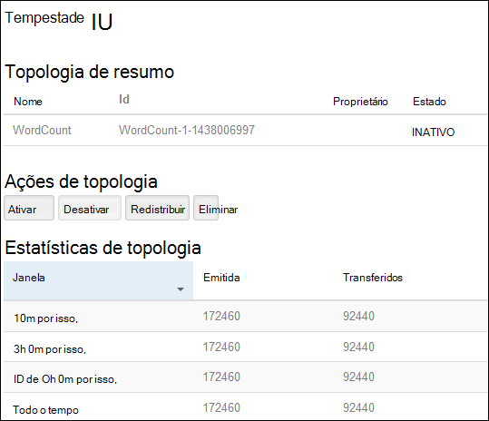
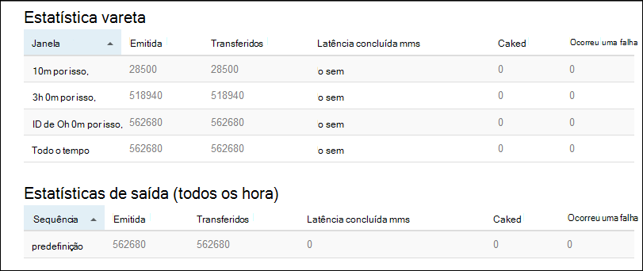

<properties
    pageTitle="Tutorial Apache tempestade: introdução ao baseado em Linux tempestade no HDInsight | Microsoft Azure"
    description="Introdução ao utilizar Apache tempestade e as amostras tempestade Starter num baseado em Linux HDInsight a análise de dados grande. Saiba como utilizar tempestade para processar dados em tempo real."
    keywords="tempestade Apache, tutorial de tempestade apache, a análise de dados grande, starter tempestade"
    services="hdinsight"
    documentationCenter=""
    authors="Blackmist"
    manager="jhubbard"
    editor="cgronlun"/>

<tags
   ms.service="hdinsight"
   ms.devlang="java"
   ms.topic="get-started-article"
   ms.tgt_pltfrm="na"
   ms.workload="big-data"
   ms.date="10/12/2016"
   ms.author="larryfr"/>

# Tutorial Apache tempestade: começar a trabalhar com os exemplos de tempestade Starter para análise de dados grande no HDInsight

Apache tempestade é um sistema de cálculo dimensionáveis, tolerância a falhas, distribuído, em tempo real para processamento sequências de dados. Com tempestade no Azure HDInsight, pode criar um cluster de tempestade baseado na nuvem que efetua a análise de dados grande em tempo real.

> [AZURE.NOTE] Os passos neste artigo criam um cluster de baseado em Linux HDInsight. Para obter os passos criar um tempestade baseados no Windows num cluster de HDInsight, consulte o artigo [tutorial Apache tempestade: começar a trabalhar com a amostra de tempestade Starter com a análise de dados no HDInsight](hdinsight-apache-storm-tutorial-get-started.md)

## Pré-requisitos

[AZURE.INCLUDE [delete-cluster-warning](../../includes/hdinsight-delete-cluster-warning.md)]

Tem de ter o seguinte procedimento para concluir este tutorial Apache tempestade com êxito:

- **Azure uma subscrição**. Consulte o artigo [obter Azure versão de avaliação gratuita](https://azure.microsoft.com/documentation/videos/get-azure-free-trial-for-testing-hadoop-in-hdinsight/).

- **Familiaridade com SSH e SCP**. Para obter mais informações sobre como utilizar SSH e SCP com HDInsight, consulte o seguinte:

    - **Clientes Linux, Unix ou OS X**: consulte o artigo [Utilizar SSH com baseado em Linux Hadoop no HDInsight Linux, OS X ou Unix](hdinsight-hadoop-linux-use-ssh-unix.md)

    - **Os clientes do Windows**: consulte o artigo [Utilizar SSH com baseado em Linux Hadoop no HDInsight a partir do Windows](hdinsight-hadoop-linux-use-ssh-windows.md)

### Requisitos de controlo de acesso

[AZURE.INCLUDE [access-control](../../includes/hdinsight-access-control-requirements.md)]

## Criar um cluster de tempestade

Nesta secção, cria um cluster de versão 3,2 HDInsight (tempestade versão 0.9.3) utilizando um modelo de Gestor de recursos do Azure. Para obter informações sobre HDInsight versões e os respetivos SLA, consulte o artigo [o controlo de versões do HDInsight componente](hdinsight-component-versioning.md). Para outros métodos de criação de cluster, consulte o artigo [Criar HDInsight clusters](hdinsight-hadoop-provision-linux-clusters.md).

1. Clique na imagem seguinte para abrir o modelo no portal do Azure.         

    
    
    O modelo está localizado no contentor de BLOBs público, *https://hditutorialdata.blob.core.windows.net/armtemplates/create-linux-based-storm-cluster-in-hdinsight.json*. 
   
2. A partir do pá parâmetros, introduza o seguinte:

    - **Nome de cluster**: introduza um nome para o cluster de Hadoop que irá criar.
    - **Nome de início de sessão do cluster e palavra-passe**: O nome de início de sessão predefinido é administrador.
    - **SSH nome de utilizador e palavra-passe**.
    
    Fórum anote estes valores.  Terá-las mais tarde no tutorial.

    > [AZURE.NOTE] SSH é utilizada para aceder ao cluster de HDInsight utilizando uma linha de comandos remotamente. O nome de utilizador e palavra-passe que utiliza aqui é utilizado quando se liga ao cluster através de SSH. Além disso, o nome de utilizador SSH tem de ser exclusivo, à medida que cria uma conta de utilizador em todos os nós de cluster de HDInsight. A seguinte é alguns dos nomes de conta reservados para ser utilizado pelos serviços num cluster e não pode ser utilizado como o nome de utilizador SSH:
    >
    > raiz, hdiuser, tempestade, hbase, ubuntu, zookeeper, hdfs, fio, mapred, hbase, ramo, oozie, falcon, sqoop, admin, tez, hcat, hdinsight zookeeper.

    > Para obter mais informações sobre como utilizar SSH com HDInsight, consulte um dos seguintes artigos:

    > * [Utilizar SSH com baseado em Linux Hadoop no HDInsight Linux, Unix ou OS X](hdinsight-hadoop-linux-use-ssh-unix.md)
    > * [Utilizar SSH com baseado em Linux Hadoop no HDInsight a partir do Windows](hdinsight-hadoop-linux-use-ssh-windows.md)

    
3. clique em **OK** para guardar os parâmetros.

4. pá **implementação personalizada** , clique em caixa de lista pendente do **grupo de recursos** e, em seguida, clique em **Novo** para criar um novo grupo de recursos. O grupo de recursos é um contentor que agrupa cluster, a conta de armazenamento dependentes e outro recurso ligado.

5. clique **termos Legal**e, em seguida, clique em **Criar**.

6. clique em **Criar**. Irá ver um novo mosaico intitulado Submitting implementação para implementação do modelo. Bastam sobre cerca de 20 minutos para criar cluster e a base de dados SQL.

##Executar uma amostra de tempestade Starter no HDInsight

Os exemplos de [tempestade starter](https://github.com/apache/storm/tree/master/examples/storm-starter) estão incluídos no HDInsight cluster. Nos passos seguintes, será executado o exemplo WordCount.

1. Ligar ao cluster HDInsight utilizando SSH:

        ssh USERNAME@CLUSTERNAME-ssh.azurehdinsight.net
        
    Se utilizou uma palavra-passe para proteger a sua conta de utilizador SSH, vai ser-lhe para introduzi-lo. Se utilizou uma chave pública, poderá ter de utilizar o `-i` parâmetro para especificar a chave privada correspondente. Por exemplo, `ssh -i ~/.ssh/id_rsa USERNAME@CLUSTERNAME-ssh.azurehdinsight.net`.
        
    Para obter mais informações sobre como utilizar SSH com baseado em Linux HDInsight, consulte os artigos seguintes:
    
    * [Utilizar SSH com baseado em Linux Hadoop no HDInsight Linux, Unix ou OS X](hdinsight-hadoop-linux-use-ssh-unix.md)

    * [Utilizar SSH com baseado em Linux Hadoop no HDInsight a partir do Windows](hdinsight-hadoop-linux-use-ssh-windows)

2. Utilize o seguinte comando para iniciar uma topologia de exemplo:

        storm jar /usr/hdp/current/storm-client/contrib/storm-starter/storm-starter-topologies-*.jar storm.starter.WordCountTopology wordcount
        
    > [AZURE.NOTE] O `*` parte do nome do ficheiro é utilizado para corresponder o número da versão, que altera como HDInsight é atualizado.

    Isto irá iniciar a topologia de WordCount de exemplo no cluster, com um nome amigável da 'wordcount'. Aleatoriamente gerar frases e contar a ocorrência de cada palavra na frases.

    > [AZURE.NOTE] Ao submeter topologia ao cluster, primeiro tem de copiar o ficheiro para caixa que contém o cluster antes de utilizar o `storm` comando. Isto pode ser feito utilizando o `scp` comando a partir do cliente onde o ficheiro existe. Por exemplo,`scp FILENAME.jar USERNAME@CLUSTERNAME-ssh.azurehdinsight.net:FILENAME.jar`
    >
    > O exemplo WordCount e outros exemplos de starter tempestade, já sejam encontram incluídos no seu cluster no `/usr/hdp/current/storm-client/contrib/storm-starter/`.

##Monitorizar a topologia

IU de tempestade fornece uma interface web para trabalhar com a executar o topologias e está incluída no seu cluster HDInsight.

Utilize os passos seguintes para monitorizar a topologia de utilizar a IU tempestade:

1. Abra um browser para https://CLUSTERNAME.azurehdinsight.net/stormui, onde o __nome de cluster__ é o nome do seu cluster. Isto vai abrir a IU tempestade.

    > [AZURE.NOTE] Se pedido para fornecer um nome de utilizador e palavra-passe, introduza o administrador de cluster (admin) e palavra-passe que utilizou quando criar o cluster.

2. Em **topologia de resumo**, selecione a entrada de **wordcount** na coluna **nome** . Isto vai mostrar mais informações acerca da topologia.

    

    Esta página fornece as seguintes informações:

    * **Estatísticas de topologia** - informação básica sobre o desempenho de topologia organizadas em vez que o windows.

        > [AZURE.NOTE] Seleccionar uma janela de tempo específico altera a janela de tempo para informações apresentadas nas outras secções da página.

    * **Spouts** - informação básica sobre spouts, incluindo o último erro devolvido por cada vareta.

    * **Bolts** - informação básica sobre parafusos.

    * **Topologia de configuração** - informações detalhadas sobre a configuração da topologia.

    Esta página também fornece as ações que podem ser retiradas na topologia da:

    * **Ativar** - processamento de currículos de uma topologia desativado.

    * **Desativar** - interrompe uma topologia em execução.

    * **Redistribuir** - ajusta paralelismo da topologia. Deverá redistribuir topologias em execução depois de ter mudado o número de nós no cluster. Esta opção permite-a topologia de modo a ajustar paralelismo para o Adquirente na íntegra para o número maior/diminuiu de nós do cluster. Para mais informações, consulte o artigo [Compreender paralelismo de uma topologia de tempestade](http://storm.apache.org/documentation/Understanding-the-parallelism-of-a-Storm-topology.html).

    * **Eliminar** - termina uma topologia de tempestade após o limite de tempo especificado.

3. A partir desta página, selecione uma entrada a partir da secção **Spouts** ou **Bolts** . Isto vai mostrar informações sobre o componente selecionado.

    

    Esta página apresenta as seguintes informações:

    * **Estatística vareta/raio** - informação básica sobre o desempenho de componente organizadas em vez que o windows.

        > [AZURE.NOTE] Seleccionar uma janela de tempo específico altera a janela de tempo para informações apresentadas nas outras secções da página.

    * **Estatísticas de entrada** (parafuso apenas) - obter informações sobre componentes produzir dados média consumidos pelo raio.

    * **Estatísticas de saída** - obter informações sobre dados emitidos por este raio.

    * **Testamenteiros** - obter informações sobre como instâncias deste componente.

    * **Erros** - produzidos por este componente de erros.

4. Quando visualizar os detalhes de uma vareta ou raio, selecione uma entrada da coluna **porta** na secção **testamenteiros** para ver detalhes de uma instância específica do componente.

        2015-01-27 14:18:02 b.s.d.task [INFO] Emitting: split default ["with"]
        2015-01-27 14:18:02 b.s.d.task [INFO] Emitting: split default ["nature"]
        2015-01-27 14:18:02 b.s.d.executor [INFO] Processing received message source: split:21, stream: default, id: {}, [snow]
        2015-01-27 14:18:02 b.s.d.task [INFO] Emitting: count default [snow, 747293]
        2015-01-27 14:18:02 b.s.d.executor [INFO] Processing received message source: split:21, stream: default, id: {}, [white]
        2015-01-27 14:18:02 b.s.d.task [INFO] Emitting: count default [white, 747293]
        2015-01-27 14:18:02 b.s.d.executor [INFO] Processing received message source: split:21, stream: default, id: {}, [seven]
        2015-01-27 14:18:02 b.s.d.task [INFO] Emitting: count default [seven, 1493957]

    A partir deste tipo de dados, pode ver que a de word **sete** Ocorreu 1493957 vezes. Esse é o número de vezes sido encontrou desde que foi iniciada esta topologia.

##Parar a topologia

Regressar à página de **topologia de resumo** para a topologia de contagem de palavras e, em seguida, selecione o botão **Eliminar** a partir da secção de **ações de topologia** . Quando lhe for pedido, introduza 10 para os segundos a aguardar antes de parar a topologia. Depois do período de tempo de espera, a topologia já não irá aparecer quando visita a secção **Tempestade IU** do dashboard.

##Eliminar o cluster

[AZURE.INCLUDE [delete-cluster-warning](../../includes/hdinsight-delete-cluster-warning.md)]

##Próximos passos

Neste tutorial Apache tempestade, utilizou o Starter tempestade para saber como criar uma tempestade num cluster de HDInsight e utilizar o Dashboard tempestade para implementar, monitorizar e gerir topologias tempestade. Em seguida, saiba como [topologias com base em desenvolver Java utilizando Maven](hdinsight-storm-develop-java-topology.md).

Se já estiver familiarizado com topologias Java baseado em desenvolvimento e pretende implementar uma topologia existente ao HDInsight, consulte o artigo [Implementar e gerir topologias Apache tempestade no HDInsight](hdinsight-storm-deploy-monitor-topology-linux.md).

Se for um programador .NET, pode criar c# ou híbrido c# / topologias Java utilizando o Visual Studio. Para mais informações, consulte o artigo [desenvolver c# topologias para Apache tempestade no HDInsight com Hadoop ferramentas para o Visual Studio](hdinsight-storm-develop-csharp-visual-studio-topology.md).

Por exemplo topologias que podem ser utilizadas com tempestade no HDInsight, consulte os exemplos seguintes:

    * [Topologias de exemplo para tempestade no HDInsight](hdinsight-storm-example-topology.md)

[apachestorm]: https://storm.incubator.apache.org
[stormdocs]: http://storm.incubator.apache.org/documentation/Documentation.html
[stormstarter]: https://github.com/apache/storm/tree/master/examples/storm-starter
[stormjavadocs]: https://storm.incubator.apache.org/apidocs/
[azureportal]: https://manage.windowsazure.com/
[hdinsight-provision]: hdinsight-provision-clusters.md
[preview-portal]: https://portal.azure.com/
