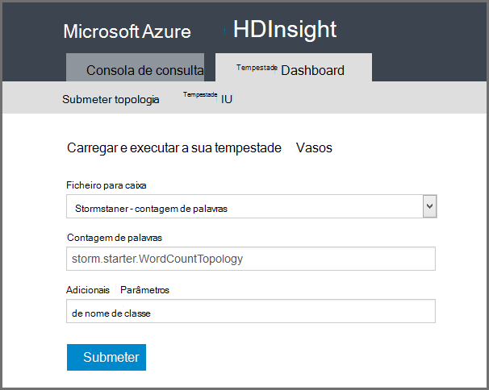

<properties
    pageTitle="Tutorial Apache tempestade: introdução ao tempestade | Microsoft Azure"
    description="Introdução ao utilizar Apache tempestade e as amostras tempestade Starter num HDInsight a análise de dados grande. Saiba como utilizar tempestade para processar dados em tempo real."
    keywords="tempestade Apache, tutorial de tempestade apache, a análise de dados grande, starter tempestade"
    services="hdinsight"
    documentationCenter=""
    authors="Blackmist"
    manager="jhubbard"
    editor="cgronlun"
    tags="azure-portal"/>

<tags
   ms.service="hdinsight"
   ms.devlang="java"
   ms.topic="article"
   ms.tgt_pltfrm="na"
   ms.workload="big-data"
   ms.date="09/07/2016"
   ms.author="larryfr"/>

# Tutorial Apache tempestade: começar a trabalhar com os exemplos de tempestade Starter para análise de dados grande no HDInsight

Apache tempestade é um sistema de cálculo dimensionáveis, tolerância a falhas, distribuído, em tempo real para processamento sequências de dados. Com tempestade no Microsoft Azure HDInsight, pode criar um cluster de tempestade baseado na nuvem que efetua a análise de dados grande em tempo real. 

> [AZURE.NOTE] Os passos neste artigo criam um cluster de HDInsight baseados no Windows. Para obter os passos criar um tempestade baseado em Linux num cluster de HDInsight, consulte o artigo [tutorial Apache tempestade: começar a trabalhar com a amostra de tempestade Starter com a análise de dados no HDInsight](hdinsight-apache-storm-tutorial-get-started-linux.md)

## Pré-requisitos

[AZURE.INCLUDE [delete-cluster-warning](../../includes/hdinsight-delete-cluster-warning.md)]

Tem de ter o seguinte procedimento para concluir este tutorial Apache tempestade com êxito:

- **Azure uma subscrição**. Consulte o artigo [obter Azure versão de avaliação gratuita](https://azure.microsoft.com/documentation/videos/get-azure-free-trial-for-testing-hadoop-in-hdinsight/).

### Requisitos de controlo de acesso

[AZURE.INCLUDE [access-control](../../includes/hdinsight-access-control-requirements.md)]

## Criar um cluster de tempestade

Tempestade no HDInsight utiliza armazenamento de Blobs do Azure para armazenar ficheiros de registo e topologias submetidas para cluster. Utilize os passos seguintes para criar uma conta de armazenamento Azure para utilização com o seu cluster:

1. Inicie sessão no [Portal do Azure][preview-portal].

2. Selecione **Novo**, selecione __A análise de dados__e, em seguida, selecione __HDInsight__.

    

3. Introduza um __nome de Cluster__. Se estiver disponível, é apresentada uma marca de verificação verde ao lado do __Nome do Cluster__ .

4. Se tiver mais do que uma subscrição, selecione a entrada de __subscrição__ para selecionar a subscrição Azure que será utilizada para o cluster.

5.  Utilize __Seleccione o tipo de Cluster__ para selecionar um cluster de __tempestade__ . Selecione o __sistema operativo__Windows. Para __Cluster camada__, selecione padrão. Por fim, utilize o botão selecionar para guardar estas definições.

    

5. Para o __Grupo de recursos__, pode experimentá-na lista pendente para ver uma lista de grupos de recursos existentes e, em seguida, selecione aquela para criar o cluster no. Ou pode selecionar __Novo__ e, em seguida, introduza o nome do novo grupo de recursos. É apresentada uma marca de verificação verde para indicar se o nome do novo grupo está disponível.

6. Selecione __as credenciais__e, em seguida, introduza um __Nome de utilizador do Cluster de início de sessão__ e a __Palavra-passe de início de sessão do Cluster__. Por fim, utilize a __Selecionar__ para definir as credenciais. Ambiente de trabalho remoto não será utilizada neste documento, pelo que pode deixar-desativado.

    

6. Para a __Origem de dados__, pode selecionar a entrada para escolher uma origem de dados existente ou crie um novo.

    

    Atualmente pode selecionar uma conta de armazenamento Azure como origem de dados para um cluster de HDInsight. Utilize o seguinte procedimento para compreender as entradas em pá a __Origem de dados__ .

    - __Método de seleção__: defina esta opção para __a partir de todas as subscrições__ para ativar a navegação de contas de armazenamento na suas subscrições. Se pretender introduzir o __Nome de armazenamento__ e a __Tecla de acesso__ de uma conta de armazenamento existente, defina a __Tecla de acesso__ .

    - __Criar novo__: Utilize esta opção para criar uma nova conta de armazenamento. Utilize o campo que aparece para introduzir o nome da conta de armazenamento. Uma marca de verificação verde aparece se o nome está disponível.

    - __Selecione contentor predefinido__: Utilize esta opção para introduzir o nome do contentor predefinido a utilizar para o cluster. Embora possa introduzir quaisquer nomes aqui, recomendamos que utilize o mesmo nome como cluster de modo a que pode facilmente reconhecer que é utilizado o contentor para este cluster específico.

    - __Localização__: A região geográfica que será a conta de armazenamento está no ou será criada na.

        > [AZURE.IMPORTANT] Também é selecionar a localização para a origem de dados predefinido define a localização do HDInsight cluster. A origem de dados cluster e predefinido têm de estar localizada na mesma região.

    - __Selecione__: Utilize esta opção para guardar a configuração de origem de dados.

7. Selecione __Nó preços camadas__ para apresentar informações sobre os nós que serão criados para este cluster. Por predefinição, o número de nós de trabalho está definido para __4__. Defina esta opção para __1__, tal como isto é suficiente para este tutorial e reduz o custo do cluster. O custo estimado do cluster é apresentado na parte inferior deste pá.

    

    Utilize a __Selecionar__ para guardar as informações de __Nó preços camadas__ .

8. Selecione __configuração opcional__. Este pá permite-lhe selecione a versão de computação, bem como configurar outras definições opcionais, como aderir a uma __Rede Virtual__.

    

9. Certifique-se de que __Afixar Startboard__ está selecionada e, em seguida, selecione __Criar__. Isto cria cluster e adiciona um mosaico para o mesmo para Startboard do seu portal Azure. O ícone indica que o cluster é aprovisionamento e alterações para apresentar o ícone de HDInsight uma vez aprovisionamento foi concluída.

  	| Enquanto aprovisionamento | Aprovisionamento concluído |
  	| ------------------ | --------------------- |
  	|  |  |

    > [AZURE.NOTE] Bastam algum tempo para a cluster criado, normalmente cerca de 15 minutos. Utilize o mosaico na Startboard ou a entrada de __notificações__ no lado esquerdo da página, para verificar o processo de aprovisionamento.

## Executar uma amostra de tempestade Starter no HDInsight

Neste tutorial Apache tempestade apresenta-lhe análises de dados grande com os exemplos de tempestade Starter no GitHub.

Cada tempestade num cluster de HDInsight é fornecido com o Dashboard tempestade, que podem ser utilizados para carregar e executar topologias tempestade no cluster. Cada cluster também inclui topologias de exemplo que podem ser executadas diretamente a partir do Dashboard de tempestade.

### Ligar para o dashboard

O dashboard está localizado em **https://&lt;nome de cluster >.azurehdinsight.net//**, onde o **nome de cluster** é o nome do cluster. Também pode encontrar uma ligação para o dashboard ao selecionar o cluster a partir do Startboard e selecionar a ligação de __Dashboard__ no topo da pá.

> [AZURE.NOTE] Quando ligar para o dashboard, lhe for pedido para introduzir um nome de utilizador e palavra-passe. Este é o nome de administrador (**admin**) e a palavra-passe utilizada quando criou o cluster.

Assim que o Dashboard tempestade tem carregada, irá ver o formulário de **Topologia submeter** .

O formulário de **Topologia submeter** pode ser utilizado para carregar e executar .jar ficheiros que contêm topologias tempestade. Também inclui várias amostras básicas que são fornecidas com o cluster.

### Executar a amostra de contagem de palavras a partir do projeto tempestade Starter na GitHub

Os exemplos fornecidos com o cluster incluem várias variações de uma topologia de contagem de word. Estes exemplos incluem uma **spout** que aleatoriamente emite frases e **bolts** que dividir cada frase em palavras individuais, em seguida, contar o número de vezes ocorreu cada palavra. Estes exemplos são de [amostras tempestade Starter](https://github.com/apache/storm/tree/master/examples/storm-starter), que fazem parte da Apache tempestade.

Execute os seguintes passos para executar uma amostra de tempestade Starter:

1. Selecione **StormStarter - WordCount** a partir do menu pendente **Jar ficheiro** . Isto preenche os campos **Nome de classe** e **Parâmetros adicionais** com os parâmetros para que este exemplo.

    

    * **Nome de classe** - a classe no ficheiro .jar que apresente a topologia.
    * **Parâmetros adicionais** - quaisquer parâmetros de uma ferramenta necessária à topologia. Neste exemplo, o campo é utilizado para fornecer um nome amigável para a topologia submetido.

2. Clique em **Submeter**. Após um momento, o campo de **resultado** mostra o comando utilizado para apresentar a tarefa, bem como os resultados do comando. O campo de **erro** apresenta todos os erros que ocorrem em submeter a topologia.

    

    > [AZURE.NOTE] Os resultados não indicar que a topologia terminou - **uma tempestade topologia, uma vez iniciada, será executado até parar a mesma.** A topologia de contagem de palavras gera frases aleatórios e mantém uma contagem do número de vezes que encontrar cada palavra até pará-lo.

### Monitorizar a topologia

IU de tempestade podem ser utilizado para monitorizar a topologia.

1. Selecione **Tempestade IU** na parte superior do Dashboard de tempestade. Isto apresenta informações de resumo para cluster e todos os topologias em execução.

    

    Na página acima, pode ver a hora que a topologia foi ativa, bem como o número de trabalhadores, testamenteiros e tarefas a ser utilizadas.

    > [AZURE.NOTE] A coluna **nome** contém o nome amigável anteriormente fornecido através do campo de **Parâmetros adicionais** .

4. Em **topologia de resumo**, selecione a entrada de **wordcount** na coluna **nome** . Esta ação apresentará mais informações acerca da topologia.

    

    Esta página fornece as seguintes informações:

    * **Estatísticas de topologia** - informação básica sobre o desempenho de topologia organizadas em vez que o windows.

        > [AZURE.NOTE] Seleccionar uma janela de tempo específico altera a janela de tempo para informações apresentadas nas outras secções da página.

    * **Spouts** - informação básica sobre spouts, incluindo o último erro devolvido por cada vareta.

    * **Bolts** - informação básica sobre parafusos.

    * **Topologia de configuração** - informações detalhadas sobre a configuração da topologia.

    Esta página também fornece as ações que podem ser retiradas na topologia da:

    * **Ativar** - processamento de currículos de uma topologia desativado.

    * **Desativar** - interrompe uma topologia em execução.

    * **Redistribuir** - ajusta paralelismo da topologia. Deverá redistribuir topologias em execução depois de ter mudado o número de nós no cluster. Esta opção permite-a topologia de modo a ajustar paralelismo para o Adquirente na íntegra para o número maior/diminuiu de nós do cluster. Para mais informações, consulte o artigo [Compreender paralelismo de uma topologia de tempestade](http://storm.apache.org/documentation/Understanding-the-parallelism-of-a-Storm-topology.html).

    * **Eliminar** - termina uma topologia de tempestade após o limite de tempo especificado.

5. A partir desta página, selecione uma entrada a partir da secção **Spouts** ou **Bolts** . Isto apresenta informações sobre o componente selecionado.

    

    Esta página apresenta as seguintes informações:

    * **Estatística vareta/raio** - informação básica sobre o desempenho de componente organizadas em vez que o windows.

        > [AZURE.NOTE] Seleccionar uma janela de tempo específico altera a janela de tempo para informações apresentadas nas outras secções da página.

    * **Estatísticas de entrada** (parafuso apenas) - obter informações sobre componentes produzir dados média consumidos pelo raio.

    * **Estatísticas de saída** - obter informações sobre dados emitidos por este raio.

    * **Testamenteiros** - obter informações sobre como instâncias deste componente.

    * **Erros** - produzidos por este componente de erros.

5. Quando visualizar os detalhes de uma vareta ou raio, selecione uma entrada da coluna **porta** na secção **testamenteiros** para ver detalhes de uma instância específica do componente.

        2015-01-27 14:18:02 b.s.d.task [INFO] Emitting: split default ["with"]
        2015-01-27 14:18:02 b.s.d.task [INFO] Emitting: split default ["nature"]
        2015-01-27 14:18:02 b.s.d.executor [INFO] Processing received message source: split:21, stream: default, id: {}, [snow]
        2015-01-27 14:18:02 b.s.d.task [INFO] Emitting: count default [snow, 747293]
        2015-01-27 14:18:02 b.s.d.executor [INFO] Processing received message source: split:21, stream: default, id: {}, [white]
        2015-01-27 14:18:02 b.s.d.task [INFO] Emitting: count default [white, 747293]
        2015-01-27 14:18:02 b.s.d.executor [INFO] Processing received message source: split:21, stream: default, id: {}, [seven]
        2015-01-27 14:18:02 b.s.d.task [INFO] Emitting: count default [seven, 1493957]

    A partir destes dados, pode ver que a de word **sete** Ocorreu 1,493,957 vezes. Esse é o número de vezes sido encontrou desde que foi iniciada esta topologia.

### Parar a topologia

Regressar à página de **topologia de resumo** para a topologia de contagem de palavras e, em seguida, selecione **Eliminar** a secção **topologia acções** . Quando lhe for pedido, introduza 10 para os segundos a aguardar antes de parar a topologia. Depois do período de tempo de espera, a topologia deixa de aparecer quando visita a secção **Tempestade IU** do dashboard.

##Eliminar o cluster

[AZURE.INCLUDE [delete-cluster-warning](../../includes/hdinsight-delete-cluster-warning.md)]

## Resumo

Neste tutorial Apache tempestade, utilizou o Starter tempestade para saber como criar uma tempestade num cluster de HDInsight e utilizar o Dashboard tempestade para implementar, monitorizar e gerir topologias tempestade.

## Próximos passos

* **Ferramentas de HDInsight para Visual Studio** - ferramentas HDInsight permite-lhe utilizar o Visual Studio para submeter, monitorizar e gerir topologias tempestade semelhantes ao Dashboard tempestade mencionado anteriormente. HDInsight ferramentas também fornece a capacidade de criar topologias c# tempestade e inclui topologias de exemplo que pode implementar e executar no seu cluster.

    Para mais informações, consulte o artigo [Introdução ao utilizar as ferramentas de HDInsight para Visual Studio](hdinsight-hadoop-visual-studio-tools-get-started.md).

* **Ficheiros de exemplo** - cluster de HDInsight tempestade fornece vários exemplos no diretório **%STORM_HOME%\contrib** . Cada exemplo deve conter o seguinte:

    * O código de origem - por exemplo, tempestade-starter-0.9.1.2.1.5.0-2057-sources.jar

    * A Java de documentos - por exemplo, tempestade-starter-0.9.1.2.1.5.0-2057-javadoc.jar

    * O exemplo - por exemplo, storm-starter-0.9.1.2.1.5.0-2057-jar-with-dependencies.jar

    Utilize o comando 'para caixa' para extrair o código de origem ou documentos Java. Por exemplo, ' tempestade de - xvf para caixa-starter-0.9.1.2.1.5.0.2057-javadoc.jar'.

    > [AZURE.NOTE] Documentos do Java consistem em páginas Web. Assim que extraídos, utilize o browser para ver o ficheiro **Index** .

    Para aceder a estes exemplos, tem de ativar o ambiente de trabalho remoto para tempestade num cluster de HDInsight e, em seguida, copie os ficheiros da **%STORM_HOME%\contrib**.

* O documento seguinte contém uma lista dos outros exemplos que podem ser utilizados com tempestade no HDInsight:

    * [Topologias de exemplo para tempestade no HDInsight](hdinsight-storm-example-topology.md)

[apachestorm]: https://storm.incubator.apache.org
[stormdocs]: http://storm.incubator.apache.org/documentation/Documentation.html
[stormstarter]: https://github.com/apache/storm/tree/master/examples/storm-starter
[stormjavadocs]: https://storm.incubator.apache.org/apidocs/
[azureportal]: https://manage.windowsazure.com/
[hdinsight-provision]: hdinsight-provision-clusters.md
[preview-portal]: https://portal.azure.com/
