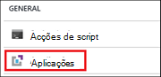
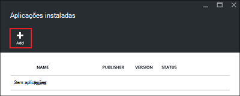
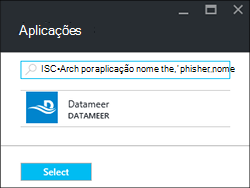
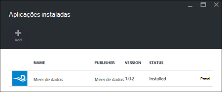

<properties
    pageTitle="Instalar aplicações do Hadoop em HDInsight | Microsoft Azure"
    description="Saiba como instalar aplicações do HDInsight em aplicações de HDInsight."
    services="hdinsight"
    documentationCenter=""
    authors="mumian"
    manager="jhubbard"
    editor="cgronlun"
    tags="azure-portal"/>

<tags
    ms.service="hdinsight"
    ms.devlang="na"
    ms.topic="hero-article"
    ms.tgt_pltfrm="na"
    ms.workload="big-data"
    ms.date="09/14/2016"
    ms.author="jgao"/>

# Instalar aplicações HDInsight

Uma aplicação do HDInsight é uma aplicação que os utilizadores podem instalar num cluster baseado em Linux HDInsight. Estas aplicações podem ser desenvolvidas pela Microsoft, fornecedores de software independentes (ISV) ou por si. Neste artigo, irá obter informações sobre como instalar uma aplicação publicada. Para instalar a sua própria aplicação, consulte o artigo [instalar aplicações personalizadas de HDInsight](hdinsight-apps-install-custom-applications.md). 

Neste momento não existe uma aplicação publicada:

- **Datameer**: [Datameer](http://www.datameer.com/documentation/display/DAS50/Home?ls=Partners&lsd=Microsoft&c=Partners&cd=Microsoft) oferece analistas de uma forma interativa para detetar, analisar e visualizar os resultados no Big Data. Extrair em origens de dados adicionais facilmente para descobrir novas relações e obter as respostas que precisa rapidamente.

>[AZURE.NOTE] Datameer está atualmente só é suportado em clusters de versão 3,2 do Azure HDInsight.

As instruções fornecidas neste artigo utilizam o portal do Azure. Também pode exportar o modelo de Gestor de recursos do Azure a partir do portal ou obter uma cópia do modelo de Gestor de recursos a partir de fornecedores e utilizar o PowerShell do Azure e Azure clip para implementar o modelo.  Consulte o artigo [baseado em criar Linux Hadoop clusters no HDInsight utilizar modelos de Gestor de recursos](hdinsight-hadoop-create-linux-clusters-arm-templates.md).

## Pré-requisitos

Se pretender instalar aplicações do HDInsight num cluster HDInsight existente, tem de ter um cluster de HDInsight. Para criar uma, consulte o artigo [criar clusters](hdinsight-hadoop-linux-tutorial-get-started.md#create-cluster). Também pode instalar aplicações HDInsight quando cria um cluster de HDInsight.

## Instalar aplicações a clusters existentes

O procedimento que se segue mostra-lhe como instalar aplicações HDInsight a um cluster de HDInsight existente.

**Para instalar uma aplicação de HDInsight**

1. Inicie sessão no [portal do Azure](https://portal.azure.com).
2. Clique em **Clusters de HDInsight** no menu à esquerda.  Se não VI-lo, clique em **Procurar**e, em seguida, clique em **Clusters de HDInsight**.
3. Clique num cluster de HDInsight.  Se não tiver uma, terá de criar um primeiro.  consulte o artigo [criar clusters](hdinsight-hadoop-linux-tutorial-get-started.md#create-cluster).
4. Pá **Definições** , clique em **aplicações** na categoria **Geral** . A **Aplicações instaladas** pá enumera todas as aplicações instaladas. 

    

5. Clique em **Adicionar** a partir do menu pá. 

    

    Deverá ver uma lista de aplicações HDInsight existentes.

    

6. Clique das aplicações, aceite os termos legais e, em seguida, clique em **Selecionar**.

Pode ver o estado da instalação a partir do portais notificações (clique no ícone de campainha na parte superior do portal). Após a aplicação está instalada a aplicação serão apresentados na pá aplicações instaladas.

## Instalar aplicações durante a criação do cluster

Tem a opção para instalar as aplicações do HDInsight quando cria um cluster. Durante o processo, HDInsight aplicações estão instaladas depois do cluster é criado e encontra no Estado em execução. O procedimento que se segue mostra-lhe como instalar aplicações HDInsight quando cria um cluster.

**Para instalar uma aplicação de HDInsight**

1. Inicie sessão no [portal do Azure](https://portal.azure.com).
2. Clique em **Novo**, clique em **dados + Analytics**e, em seguida, clique em **HDInsight**.
3. Introduza o **Nome do Cluster**: este nome deve ser globalmente exclusivo.
4. Clique em **subscrição** para selecionar a subscrição Azure que será utilizada para o cluster.
5. Clique em **Seleccionar cluster tipo**e, em seguida, selecione:

    - **Tipo de cluster**: Se não sabe o que escolher, selecione **Hadoop**. É o tipo de cluster mais popular.
    - **Sistema operativo**: selecione **Linux**.
    - **Versão**: utilizar a versão predefinida se não sabe o que escolher. Para mais informações, consulte o artigo [versões de cluster HDInsight](hdinsight-component-versioning.md).
    - **Cluster camada**: Azure HDInsight fornece as ofertas de nuvem grande dados em duas categorias: camada padrão e camada de Premium. Para mais informações, consulte o artigo [camadas Cluster](hdinsight-hadoop-provision-linux-clusters.md#cluster-tiers).
6. Clique em **aplicações**, clique das aplicações do publicados e, em seguida, clique em **Selecionar**.
6. Clique em **credenciais** e, em seguida, introduza uma palavra-passe para o utilizador admin. Também tem de introduzir um **Nome de utilizador SSH** e uma **palavra-passe** ou **Chave pública**, que será utilizada para autenticar o utilizador SSH. Utilizar uma chave pública é a abordagem recomendada. Clique em **Seleccionar** na parte inferior para guardar a configuração de credenciais.
8. Clique em **Origem de dados**, selecione uma da conta de armazenamento existente ou crie uma nova conta de armazenamento para ser utilizado como a conta de armazenamento predefinida para o cluster.
9. Clique em **Grupo de recursos** para selecionar um grupo de recursos existente ou clique em **Novo** para criar um novo grupo de recursos

10. No pá **Novo HDInsight Cluster** , certifique-se de que o **Pin para Startboard** está selecionada e, em seguida, clique em **Criar**. 

## Listar aplicações HDInsight instaladas e as propriedades

O portal apresenta uma lista das aplicações do HDInsight instaladas para um cluster e as propriedades de cada aplicação instalada.

**Propriedades de aplicação e apresentação da HDInsight lista**

1. Inicie sessão no [portal do Azure](https://portal.azure.com).
2. Clique em **Clusters de HDInsight** no menu à esquerda.  Se não VI-lo, clique em **Procurar**e, em seguida, clique em **Clusters de HDInsight**.
3. Clique num cluster de HDInsight.
4. Pá **Definições** , clique em **aplicações** na categoria **Geral** . O pá de aplicações instaladas enumera todas as aplicações instaladas. 

    

5. Clique das aplicações instaladas para mostrar a propriedade. Listas de pá propriedades:

    - Nome da aplicação: nome da aplicação.
    - Estado: Estado da aplicação. 
    - Página Web: O URL da aplicação web que tenham implementado para o nó do limite, se existir um. A credencial é o mesmo que as credenciais do utilizador HTTP que configurou para o cluster.
    - Ponto final de HTTP: A credencial é o mesmo que as credenciais do utilizador HTTP que configurou para o cluster. 
    - Ponto final SSH: pode utilizar [SSH](hdinsight-hadoop-linux-use-ssh-unix.md) para ligar para o nó do limite. As credenciais SSH são o mesmo que as credenciais do utilizador SSH que configurou para o cluster.

6. Para eliminar uma aplicação, com o botão direito da aplicação e, em seguida, clique em **Eliminar** no menu de contexto.

## Ligar para o nó do limite

Pode ligar para o nó do limite com HTTP e SSH. Podem encontrar as informações de ponto final a partir do [portal](#list-installed-hdinsight-apps-and-properties). Para mais informações sobre como utilizar SSH, consulte o artigo [Utilizar SSH com baseado em Linux Hadoop no HDInsight Linux, Unix, ou OS X](hdinsight-hadoop-linux-use-ssh-unix.md). 

As credenciais de ponto final HTTP são as credenciais de utilizador HTTP tiver configurado para HDInsight cluster; as credenciais de ponto final SSH são as credenciais SSH que configurou para o cluster HDInsight.

## Resolução de problemas

Consulte o artigo [resolver problemas com a instalação](hdinsight-apps-install-custom-applications.md#troubleshoot-the-installation).

## Próximos passos

- [Instalar aplicações personalizadas de HDInsight](hdinsight-apps-install-custom-applications.md): Saiba como implementar uma aplicação de HDInsight barra publicada ao HDInsight.
- [HDInsight publicar aplicações](hdinsight-apps-publish-applications.md): Saiba como publicar HDInsight aplicações personalizadas ao Azure Marketplace.
- [MSDN: instalar uma aplicação de HDInsight](https://msdn.microsoft.com/library/mt706515.aspx): Saiba como definir HDInsight aplicações.
- [Baseado em Personalizar Linux HDInsight clusters utilizando Script acção](hdinsight-hadoop-customize-cluster-linux.md): Saiba como utilizar a ação de Script para instalar as aplicações adicionais.
- [Baseado em criar Linux Hadoop clusters no HDInsight utilizar modelos de Gestor de recursos](hdinsight-hadoop-create-linux-clusters-arm-templates.md): Saiba como ligar a modelos de Gestor de recursos para criar clusters de HDInsight.
- [Utilizar nós de limite vazia no HDInsight](hdinsight-apps-use-edge-node.md): Saiba como utilizar um nó limite vazia para aceder ao HDInsight cluster, testar HDInsight aplicações e alojamento HDInsight aplicações.

