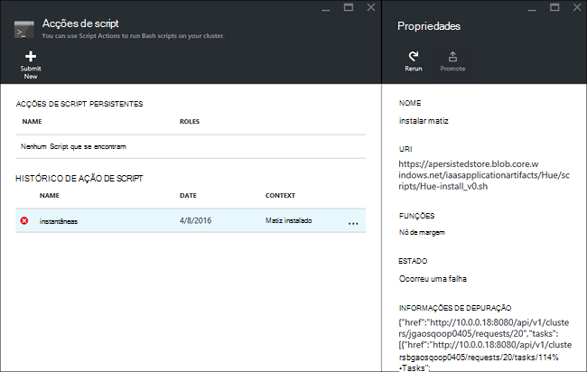

<properties
    pageTitle="Instalar aplicações do Hadoop em HDInsight | Microsoft Azure"
    description="Saiba como instalar aplicações do HDInsight em aplicações de HDInsight."
    services="hdinsight"
    documentationCenter=""
    authors="mumian"
    manager="jhubbard"
    editor="cgronlun"
    tags="azure-portal"/>

<tags
    ms.service="hdinsight"
    ms.devlang="na"
    ms.topic="hero-article"
    ms.tgt_pltfrm="na"
    ms.workload="big-data"
    ms.date="09/14/2016"
    ms.author="jgao"/>

# Instalar aplicações HDInsight personalizadas

Uma aplicação do HDInsight é uma aplicação que os utilizadores podem instalar num cluster baseado em Linux HDInsight.  Estas aplicações podem ser desenvolvidas pela Microsoft, fornecedores de software independentes (ISV) ou por si. Este artigo vai aprender a instalar uma aplicação de HDInsight que não foi publicada ao portal do Azure no HDInsight. A aplicação que irá instalar é [matiz](http://gethue.com/). 

Outros artigos relacionados com:

- [HDInsight instalar aplicações](hdinsight-apps-install-applications.md): Saiba como instalar uma aplicação do HDInsight a sua clusters.
- [HDInsight publicar aplicações](hdinsight-apps-publish-applications.md): Saiba como publicar HDInsight aplicações personalizadas ao Azure Marketplace.
- [MSDN: instalar uma aplicação de HDInsight](https://msdn.microsoft.com/library/mt706515.aspx): Saiba como definir HDInsight aplicações.

 
## Pré-requisitos

Se pretender instalar aplicações do HDInsight num cluster HDInsight existente, tem de ter um cluster de HDInsight. Para criar uma, consulte o artigo [criar clusters](hdinsight-hadoop-linux-tutorial-get-started.md#create-cluster). Também pode instalar aplicações HDInsight quando cria um cluster de HDInsight.

## Instalar aplicações HDInsight

Aplicações de HDInsight podem ser instaladas quando cria um cluster de ou para um cluster de HDInsight existente. Para definir o Gestor de recursos do Azure modelos, consulte o artigo [MSDN: instalar uma aplicação de HDInsight](https://msdn.microsoft.com/library/mt706515.aspx).

Os ficheiros necessários para implementar esta aplicação (matiz):

- [azuredeploy.JSON](https://github.com/hdinsight/Iaas-Applications/blob/master/Hue/azuredeploy.json): modelo do Gestor de recursos para instalar a aplicação de HDInsight. Consulte o artigo [MSDN: instalar uma aplicação de HDInsight](https://msdn.microsoft.com/library/mt706515.aspx) para desenvolver o seu próprio modelo de Gestor de recursos.
- [matiz install_v0.sh](https://github.com/hdinsight/Iaas-Applications/blob/master/Hue/scripts/Hue-install_v0.sh): ação o Script a ser designada pelo modelo de Gestor de recursos para configurar o nó do limite. 
- [matiz binaries.tgz](https://hdiconfigactions.blob.core.windows.net/linuxhueconfigactionv01/hue-binaries-14-04.tgz): O ficheiro binário matiz a ser chamado a partir de hui install_v0.sh. 
- [matiz binários-14 04.tgz](https://hdiconfigactions.blob.core.windows.net/linuxhueconfigactionv01/hue-binaries-14-04.tgz): O ficheiro binário matiz a ser chamado a partir de hui install_v0.sh. 
- [webwasb tomcat.tar.gz](https://hdiconfigactions.blob.core.windows.net/linuxhueconfigactionv01/webwasb-tomcat.tar.gz): uma aplicação de web de exemplo (Tomcat) a ser chamada a partir de hui install_v0.sh.

**Para instalar a matiz a um cluster de HDInsight existente**

1. Clique na imagem seguinte para iniciar sessão no Azure e abra o modelo de Gestor de recursos no Portal do Azure. 

    

    Este botão abre um modelo de Gestor de recursos no portal do Azure.  O modelo de Gestor de recursos está localizado em [https://github.com/hdinsight/Iaas-Applications/tree/master/Hue](https://github.com/hdinsight/Iaas-Applications/tree/master/Hue).  Para saber como escrever este modelo de Gestor de recursos, consulte o artigo [MSDN: instalar uma aplicação de HDInsight](https://msdn.microsoft.com/library/mt706515.aspx).
    
2. A partir do pá **parâmetros** , introduza o seguinte:

    - **Nome de cluster**: introduza o nome do cluster de onde pretende instalar a aplicação. Este cluster tem de ser um cluster existente.
    
3. Clique em **OK** para guardar os parâmetros.
4. A partir da pá **implementação personalizada** , introduza o **grupo de recursos**.  O grupo de recursos é um contentor que agrupa cluster, a conta de armazenamento dependentes e outros recursos. É necessário para utilizar o mesmo grupo de recursos como cluster.
5. Clique em **termos Legal**e, em seguida, clique em **Criar**.
6. Verifique a caixa de verificação **Afixar ao dashboard** está selecionada e, em seguida, clique em **Criar**. Pode ver o estado da instalação a partir do mosaico afixado à dashboard de portal e a notificação de portal (clique no ícone de campainha na parte superior do portal).  Demora cerca de 10 minutos para instalar a aplicação.

**Para instalar a matiz ao criar um cluster de**

1. Clique na imagem seguinte para iniciar sessão no Azure e abra o modelo de Gestor de recursos no Portal do Azure. 

    

    Este botão abre um modelo de Gestor de recursos no portal do Azure.  O modelo de Gestor de recursos está localizado em [https://hditutorialdata.blob.core.windows.net/hdinsightapps/create-linux-based-hadoop-cluster-in-hdinsight.json](https://hditutorialdata.blob.core.windows.net/hdinsightapps/create-linux-based-hadoop-cluster-in-hdinsight.json).  Para saber como escrever este modelo de Gestor de recursos, consulte o artigo [MSDN: instalar uma aplicação de HDInsight](https://msdn.microsoft.com/library/mt706515.aspx).

2. Siga as instruções para criar cluster e instalar matiz. Para mais informações sobre como criar HDInsight clusters, consulte o artigo [clusters de baseado em criar Linux Hadoop HDInsight](hdinsight-hadoop-provision-linux-clusters.md).

Para além do portal do Azure, também pode utilizar [O PowerShell Azure](hdinsight-hadoop-create-linux-clusters-arm-templates.md#deploy-with-powershell) e [Azure clip](hdinsight-hadoop-create-linux-clusters-arm-templates.md#deploy-with-azure-cli) para ligar a modelos de Gestor de recursos.

## Validar a instalação

Pode verificar o estado de aplicação no portal do Azure para validar a instalação da aplicação. Além disso, pode também validar todos HTTP pontos finais veio o conforme esperado e a página Web se existir um:

**Para abrir o portal de matiz**

1. Inicie sessão no [portal do Azure](https://portal.azure.com).
2. Clique em **Clusters de HDInsight** no menu à esquerda.  Se não VI-lo, clique em **Procurar**e, em seguida, clique em **Clusters de HDInsight**.
3. Clique no cluster onde instalou a aplicação.
4. Pá **Definições** , clique em **aplicações** na categoria **Geral** . Deve ver **matiz** listados na pá **Aplicações instaladas** .
5. Clique em **matiz** , a partir da lista para as propriedades da lista.  
6. Clique na ligação da página Web para validar o Web site; Abra o ponto final de HTTP num browser para validar web matiz IU, abra o ponto final SSH utilizando [betumes](hdinsight-hadoop-linux-use-ssh-windows.md) ou outros [clientes SSH](hdinsight-hadoop-linux-use-ssh-unix.md).
 
## Resolver problemas de instalação

Pode verificar o estado de instalação da aplicação de notificação de portal (clique no ícone de campainha na parte superior do portal). 

Se tiver falhado uma instalação de aplicação, pode ver as mensagens de erro e depurar informações a partir de 3 localizações:

- : HDInsight erro geral as informações sobre aplicações.

    Abrir o cluster a partir do portal e clique em aplicações a partir do pá definições:

    

- Acção de script HDInsight: se a mensagem de erro as aplicações HDInsight indica uma falha de ação de script, mais detalhes sobre a falha de script serão apresentadas no painel de ações de script.

    Clique em ação de Script de pá as definições. Histórico de ação de script mostra as mensagens de erro

    
    
- IU da Ambari Web: Se o script de instalação tiver sido a causa da falha, utilize Ambari Web IU para verificar registos completos sobre os scripts de instalação.

    Para mais informações, consulte o artigo [resolução de problemas](hdinsight-hadoop-customize-cluster-linux.md#troubleshooting).

## Remover as aplicações do HDInsight

Existem várias formas de eliminar aplicações de HDInsight.

### Utilizar o portal

**Para remover uma aplicação através do portal**

1. Inicie sessão no [portal do Azure](https://portal.azure.com).
2. Clique em **Clusters de HDInsight** no menu à esquerda.  Se não VI-lo, clique em **Procurar**e, em seguida, clique em **Clusters de HDInsight**.
3. Clique no cluster onde instalou a aplicação.
4. Pá **Definições** , clique em **aplicações** na categoria **Geral** . Deverá ver uma lista da aplicação instalada. Para este tutorial, **matiz** listados na pá **Aplicações instaladas** .
5. Botão direito do rato na aplicação que pretende remover e, em seguida, clique em **Eliminar**.
6. Clique em **Sim** para confirmar.

A partir do portal, também pode eliminar o cluster ou eliminar o grupo de recursos que contém a aplicação.

### Utilizar o Azure PowerShell

Utilizar o Azure PowerShell, pode eliminar o cluster ou eliminar o grupo de recursos. Consulte o artigo [Eliminar clusters utilizando o Azure PowerShell](hdinsight-administer-use-powershell.md#delete-clusters).

### Utilizar o clip Azure

Utilizar o Azure clip, pode eliminar o cluster ou eliminar o grupo de recursos. Consulte o artigo [Eliminar clusters utilizando o clip do Azure](hdinsight-administer-use-command-line.md#delete-clusters).

## Próximos passos

- [MSDN: instalar uma aplicação de HDInsight](https://msdn.microsoft.com/library/mt706515.aspx): obter informações sobre como desenvolver modelos de Gestor de recursos para implementar HDInsight aplicações.
- [HDInsight instalar aplicações](hdinsight-apps-install-applications.md): Saiba como instalar uma aplicação do HDInsight a sua clusters.
- [HDInsight publicar aplicações](hdinsight-apps-publish-applications.md): Saiba como publicar HDInsight aplicações personalizadas ao Azure Marketplace.
- [Baseado em Personalizar Linux HDInsight clusters utilizando Script acção](hdinsight-hadoop-customize-cluster-linux.md): Saiba como utilizar a ação de Script para instalar as aplicações adicionais.
- [Baseado em criar Linux Hadoop clusters no HDInsight utilizar modelos de Gestor de recursos](hdinsight-hadoop-create-linux-clusters-arm-templates.md): Saiba como ligar a modelos de Gestor de recursos para criar clusters de HDInsight.
- [Utilizar nós de limite vazia no HDInsight](hdinsight-apps-use-edge-node.md): Saiba como utilizar um nó limite vazia para aceder ao HDInsight cluster, testar HDInsight aplicações e alojamento HDInsight aplicações.
