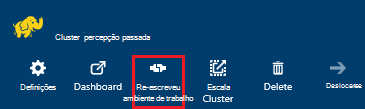
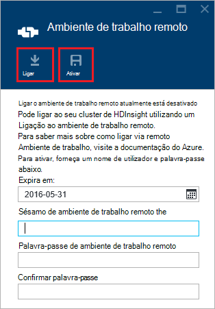
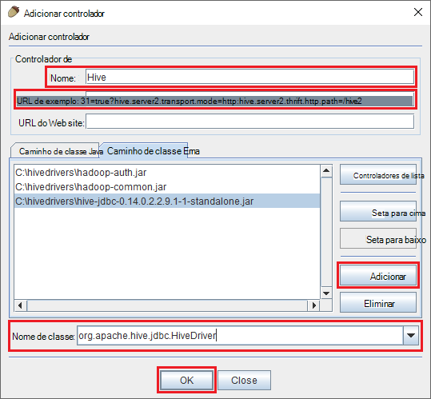
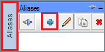
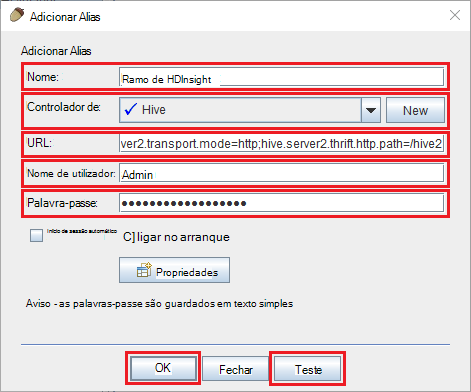
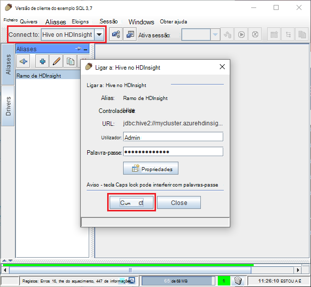
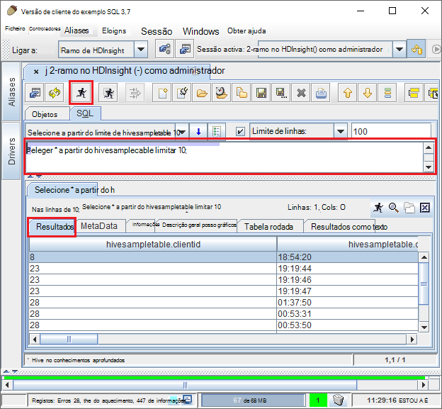

<properties
 pageTitle="Utilizar o JDBC para consultar ramo no Azure HDInsight"
 description="Saiba como utilizar JDBC para ligar a ramo no Azure HDInsight e remotamente executar consultas de dados armazenados na nuvem."
 services="hdinsight"
 documentationCenter=""
 authors="Blackmist"
 manager="jhubbard"
 editor="cgronlun"
    tags="azure-portal"/>

<tags
 ms.service="hdinsight"
 ms.devlang="java"
 ms.topic="article"
 ms.tgt_pltfrm="na"
 ms.workload="big-data"
 ms.date="08/23/2016"
 ms.author="larryfr"/>

#Ligar a ramo no Azure HDInsight a utilizar o controlador de Hive JDBC

[AZURE.INCLUDE [ODBC-JDBC-selector](../../includes/hdinsight-selector-odbc-jdbc.md)]

Este documento, vai aprender a utilizar JDBC a partir de uma aplicação Java para submeter remotamente ramo consultas a um cluster de HDInsight. Irá obter informações sobre como ligar a partir do cliente do exemplo SQL e como ligar através de programação do Java.

Para mais informações sobre a Interface de JDBC Hive, consulte o artigo [HiveJDBCInterface](https://cwiki.apache.org/confluence/display/Hive/HiveJDBCInterface).

##Pré-requisitos

Para concluir os passos neste artigo, terá o seguinte procedimento:

* Um Hadoop num cluster de HDInsight. Em baseado em Linux ou baseados no Windows clusters irão funcionar.

* [Exemplo SQL](http://squirrel-sql.sourceforge.net/). Exemplo é uma aplicação de cliente JDBC.

Para criar e executar a aplicação de Java exemplo ligada a partir deste artigo, terá o seguinte.

* O [Java programador Kit (JDK) versão 7](https://www.oracle.com/technetwork/java/javase/downloads/jdk7-downloads-1880260.html) ou superior.

* [Apache Maven](https://maven.apache.org). Maven é um projeto construir sistema para projetos Java que é utilizado pelo project associada este artigo.

##Cadeia de ligação

Ligações de JDBC a um cluster de HDInsight no Azure feitas 443 superior e o tráfego é protegido utilizando SSL. O gateway público que clusters sentar atrás redireciona o tráfego para a porta que é realmente escutar HiveServer2. Por isso, uma cadeia de ligação típica gostaria de ter o seguinte procedimento:

    jdbc:hive2://CLUSTERNAME.azurehdinsight.net:443/default;ssl=true?hive.server2.transport.mode=http;hive.server2.thrift.http.path=/hive2

Substitua o __nome de cluster__ com o nome do seu cluster HDInsight.

##Autenticação

Quando estabelecer a ligação, tem de utilizar o nome de administrador do HDInsight cluster e a palavra-passe para autenticar para o gateway cluster. Ao ligar a partir dos clientes JDBC como SQL de exemplo, tem de introduzir o nome de administrador e a palavra-passe nas definições de cliente.

A partir de uma aplicação de Java, tem de utilizar o nome e palavra-passe ao estabelecer uma ligação. Por exemplo, o seguinte código de Java é aberta uma nova ligação utilizando a cadeia de ligação, o nome de administrador e a palavra-passe:

    DriverManager.getConnection(connectionString,clusterAdmin,clusterPassword);

##Ligar-se com o cliente de SQL de exemplo

Exemplo SQL é um cliente JDBC que pode ser utilizado para remotamente executar consultas de ramo com o seu cluster HDInsight. Os seguintes passos partem do pressuposto de que já tem instalado o SQL de exemplo e irá guiá-lo através de transferir e configurar os controladores para ramo.

1. Copie os controladores Hive JDBC a partir do seu cluster HDInsight.

    * Para __baseado em Linux HDInsight__, utilize os passos seguintes para transferir os ficheiros para caixa necessários.

        1. Crie um novo directório irá conter os ficheiros. Por exemplo, `mkdir hivedriver`.

        2. A partir de uma linha de comandos, festa, PowerShell ou outra linha de comandos, altere directórios para o novo directório e utilize os seguintes comandos para copiar os ficheiros de HDInsight cluster.

                scp USERNAME@CLUSTERNAME:/usr/hdp/current/hive-client/lib/hive-jdbc*standalone.jar .
                scp USERNAME@CLUSTERNAME:/usr/hdp/current/hadoop-client/hadoop-common.jar .
                scp USERNAME@CLUSTERNAME:/usr/hdp/current/hadoop-client/hadoop-auth.jar .

            Substitua o nome de conta de utilizador SSH para o cluster __nome de utilizador__ . Substitua o __nome de cluster__ com o nome do cluster HDInsight.

            > [AZURE.NOTE] Em ambientes do Windows, terá de utilizar o utilitário PSCP em vez de scp. Pode transferi-la a partir do [http://www.chiark.greenend.org.uk/~sgtatham/putty/download.html](http://www.chiark.greenend.org.uk/~sgtatham/putty/download.html).

    * Para __HDInsight baseados no Windows__, utilize os passos seguintes para transferir os ficheiros para caixa.

        1. A partir do portal do Azure, selecione o seu cluster HDInsight e, em seguida, selecione o ícone de __Ambiente de trabalho remoto__ .

            

        2. No pá ambiente de trabalho remoto, utilize o botão de __Ligar__ para ligar ao cluster. Se não estiver ativado o ambiente de trabalho remoto, utilize o formulário para fornecer um nome de utilizador e palavra-passe, em seguida, selecione __Ativar__ para activar o ambiente de trabalho remoto para cluster.

            

            Após selecionar __Ligar__, um ficheiro. rdp será transferido. Utilize este ficheiro para iniciar o cliente de ambiente de trabalho remoto. Quando lhe for pedido, utilize o nome de utilizador e palavra-passe introduzida para acesso de ambiente de trabalho remoto.

        3. Quando estiver ligado, copie os seguintes ficheiros da sessão de ambiente de trabalho remoto para o seu computador local. Colocá-los num local diretório chamado `hivedriver`.

            * C:\apps\dist\hive-0.14.0.2.2.9.1-7\lib\hive-JDBC-0.14.0.2.2.9.1-7-Standalone.JAR
            * C:\apps\dist\hadoop-2.6.0.2.2.9.1-7\share\hadoop\common\hadoop-Common-2.6.0.2.2.9.1-7.JAR
            * C:\apps\dist\hadoop-2.6.0.2.2.9.1-7\share\hadoop\common\lib\hadoop-auth-2.6.0.2.2.9.1-7.JAR

            > [AZURE.NOTE] Os números de versão incluídos nas caminhos e nomes de ficheiro podem ser diferentes para o seu cluster.

        4. Desliga a sessão de ambiente de trabalho remoto quando tiver acabado de cópia dos ficheiros.

3. Inicie a aplicação de SQL de exemplo. A partir da esquerda da janela, selecione __controladores__.

    

4. Os ícones na parte superior da caixa de diálogo __controladores__ de, selecione o __+__ ícone para criar um novo controlador.

    

5. Na caixa de diálogo Adicionar controladores, adicione as seguintes informações.

    * __Nome__: Hive
    * __URL de exemplo__: jdbc:hive2://localhost:443/default;ssl=true?hive.server2.transport.mode=http;hive.server2.thrift.http.path=/hive2
    * __Caminho de classe extra__: Utilize o botão Adicionar para adicionar os ficheiros para caixa transferido anteriormente
    * __Nome de classe__: org.apache.hive.jdbc.HiveDriver

    

    Clique em __OK__ para guardar estas definições.

6. No lado esquerdo da janela do exemplo SQL, selecione __Aliases__. Em seguida, clique na __+__ ícone para criar um novo alias de ligação.

    

7. Utilize os seguintes valores para a caixa de diálogo __Adicionar Alias__ .

    * __Nome__: Hive no HDInsight
    * __Controlador__: utilize no menu pendente para selecionar o controlador de __ramo__
    * __URL__: jdbc:hive2://CLUSTERNAME.azurehdinsight.net:443/default;ssl=true?hive.server2.transport.mode=http;hive.server2.thrift.http.path=/hive2

        Substitua o __nome de cluster__ com o nome do seu cluster HDInsight.

    * __Nome de utilizador__: O nome de conta de início de sessão cluster para o seu cluster HDInsight. A predefinição é `admin`.
    * __Palavra-passe__: A palavra-passe para a conta de início de sessão cluster. Esta é uma palavra-passe que forneceu quando criar o cluster HDInsight.

    

    Utilize o botão de __teste__ para verificar se a ligação funciona. Quando __ligar a: Hive no HDInsight__ é apresentada a caixa de diálogo, selecione __Ligar__ ao executar o teste. Se o teste ser bem sucedida, irá ver uma caixa de diálogo __ligação efetuada com êxito__ .

    Utilize o botão __Ok__ na parte inferior da caixa de diálogo __Adicionar Alias__ para guardar o alias de ligação.

8. O __ligar a__ lista pendente na parte superior do exemplo SQL, selecione __Hive no HDInsight__. Quando lhe for pedido, selecione __Ligar__.

    

9. Quando estiver ligado, introduza a seguinte consulta na caixa de diálogo de consulta SQL e, em seguida, selecione o ícone de __Executar__ . A área de resultados deve mostrar os resultados da consulta.

        select * from hivesampletable limit 10;

    

##Ligar a partir de um exemplo de aplicação Java

Um exemplo de utilizar um cliente Java a consulta ramo HDInsight está disponível em [https://github.com/Azure-Samples/hdinsight-java-hive-jdbc](https://github.com/Azure-Samples/hdinsight-java-hive-jdbc). Siga as instruções no repositório para criar e executar a amostra.

##Resolução de problemas

### Erro inesperado ao tentar abrir uma ligação de SQL.

__Sintomas__: quando ligar a um cluster de HDInsight que é a versão 3.3 ou 3.4, poderá receber um erro que ocorreu um erro inesperado. O rastreio da pilha para este erro vai começar com as linhas seguintes:

    java.util.concurrent.ExecutionException: java.lang.RuntimeException: java.lang.NoSuchMethodError: org.apache.commons.codec.binary.Base64.<init>(I)V
    at java.util.concurrent.FutureTas...(FutureTask.java:122)
    at java.util.concurrent.FutureTask.get(FutureTask.java:206)

__Problema__: Este erro é causado por um erro de correspondência na versão do ficheiro commons codec.jar utilizado pelo exemplo e a uma ferramenta necessária aos componentes de Hive JDBC transferidos a partir de HDInsight cluster.

__Resolução__: para corrigir este erro, utilize os passos seguintes.

1. Transferir o ficheiro de para caixa commons codec a partir do seu cluster HDInsight.

        scp USERNAME@CLUSTERNAME:/usr/hdp/current/hive-client/lib/commons-codec*.jar ./commons-codec.jar

2. Exemplo de sair e, em seguida, aceda ao diretório onde exemplo estiver instalado no seu sistema. No directório de exemplo, na `lib` diretório, substituir o codec.jar commons existente com o um transferidas a partir de HDInsight cluster.

3. Reinicie o exemplo. O erro já não deve ocorrer quando se liga ao ramo de HDInsight.

##Próximos passos

Agora que aprendeu como utilizar JDBC para trabalhar com ramo, utilize as ligações seguintes para explorar outras formas de trabalhar com Azure HDInsight.

* [Carregar dados ao HDInsight](hdinsight-upload-data.md)
* [Utilizar ramo com HDInsight](hdinsight-use-hive.md)
* [Utilizar porco com HDInsight](hdinsight-use-pig.md)
* [Utilizar tarefas de MapReduce com HDInsight](hdinsight-use-mapreduce.md)
