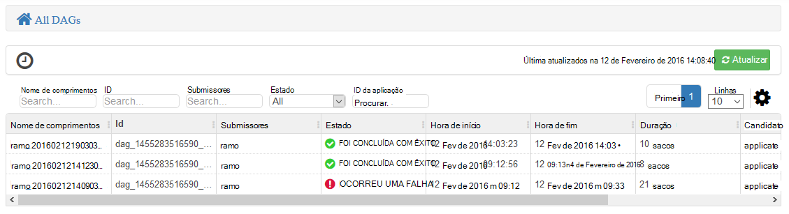

<properties
pageTitle="Utilizar a vista de Tez Ambari com HDInsight | Azure"
description="Saiba como utilizar a vista de Ambari Tez depurar Tez tarefas no HDInsight."
services="hdinsight"
documentationCenter=""
authors="Blackmist"
manager="jhubbard"
editor="cgronlun"/>

<tags
ms.service="hdinsight"
ms.devlang="na"
ms.topic="article"
ms.tgt_pltfrm="na"
ms.workload="big-data"
ms.date="10/04/2016"
ms.author="larryfr"/>

# Utilizar as vistas de Ambari para depurar Tez tarefas no HDInsight

IU do Web de Ambari para HDInsight contém uma vista de Tez que pode ser utilizada para compreender e depurar tarefas que utilizam Tez como o motor de execução. A vista de Tez permite-lhe visualizar a tarefa como um gráfico de itens ligadas, pormenorizar cada item e obter estatísticas e informações de registo.

> [AZURE.NOTE] As informações neste documento são específicas a clusters baseado em Linux HDInsight. Para obter informações sobre depuração de tarefas de Tez utilizando HDInsight baseados no Windows, consulte o artigo [utilizar a IU Tez depurar Tez tarefas no HDInsight baseados no Windows](hdinsight-debug-tez-ui.md).

## Pré-requisitos

* Um cluster de baseado em Linux HDInsight. Para obter passos sobre como criar um novo cluster, consulte o artigo [começar a utilizar o HDInsight baseado em Linux](hdinsight-hadoop-linux-tutorial-get-started.md).

* Um moderna browser que suporte HTML5.

## Noções sobre Tez

Tez é um quadro extensible para processamento de dados nas Hadoop que fornece velocidades maiores que o processamento de MapReduce tradicional. Para clusters baseado em Linux HDInsight, é o motor predefinido para ramo.

Quando o trabalho é submetido para Tez, cria um direcionado incluindo Graph (Comprimentos) que descreva a ordem de execução das ações uma ferramenta necessária à tarefa. Ações individuais chamam vértices e executar um elemento do projecto global. A execução do real do trabalho descrito por um vértice chama-se uma tarefa e pode ser distribuída ao longo de vários nós no cluster.

### Noções sobre a vista de Tez

A vista de Tez fornece informações sobre processos que estiver a executar o ou se tiver anteriormente executou utilizando Tez. Permite-lhe ver Comprimentos gerado pelo Tez, como é distribuído ao longo clusters, contadores como memória utilizada pelo tarefas e vértices e informações de erro. Ele pode oferecer informações úteis nos cenários seguintes:

* A monitorização de execução longa processos, ver o progresso de mapa e reduzir a tarefas.

* Analisar dados de históricos para processos com êxito ou sem saber como processamento pode ser melhorado ou a razão pela qual falhou.

## Gerar um Comprimentos

A vista de Tez só irá conter dados se uma tarefa que utiliza o motor de Tez atualmente em execução, ou se tiver sido executada no passado. Consultas de ramo simples, normalmente, podem ser resolvidas sem utilizar Tez, no entanto mais complexas consultas que efetuar a filtragem, agrupamento, ordenação, as associações, etc., normalmente, requerem Tez.

Utilize os passos seguintes para executar uma consulta de ramo executará utilizando Tez.

1. Num browser, navegue para https://CLUSTERNAME.azurehdinsight.net, onde o __nome de cluster__ é o nome do seu cluster HDInsight.

2. A partir do menu na parte superior da página, selecione o ícone de __vistas__ . Este aspeto de uma série de quadrados. Na lista pendente que aparece, selecione __Hive vista__. 

    

3. Quando o ramo ver cargas, cole o seguinte para o Editor de consultas e, em seguida, clique em __Executar__.

        select market, state, country from hivesampletable where deviceplatform='Android' group by market, country, state;
    
    Assim que a tarefa estiver concluída, deverá ver o resultado apresentado na secção __Resultados do processo de consulta__ . Os resultados deverão ser semelhantes ao seguinte
    
        market  state       country
        en-GB   Hessen      Germany
        en-GB   Kingston    Jamaica
        
4. Selecione o separador de __registo__ . Irá ver informações semelhantes ao seguinte:
    
        INFO : Session is already open
        INFO :

        INFO : Status: Running (Executing on YARN cluster with App id application_1454546500517_0063)

    Guarde o valor de __id da aplicação__ , este será utilizada na secção seguinte.

## Utilizar a vista de Tez

1. A partir do menu na parte superior da página, selecione o ícone de __vistas__ . Na lista pendente que aparece, selecione __vista Tez__.

    

2. Quando a vista de Tez carrega, irá ver uma lista de DAGs que estão atualmente em execução, ou ter sido executou no cluster. A vista predefinida inclui o nome comprimentos, Id, Submissores, estado, hora de início, hora de fim, duração, ID da aplicação e fila de espera. Podem ser adicionadas mais colunas utilizando o ícone de engrenagem à direita da página.

    

3. Se tiver apenas uma entrada, será para a consulta que executou na secção anterior. Se tiver várias entradas, pode procurar introduzindo o ID da aplicação no campo __ID da aplicação__ e, em seguida, prima a tecla enter.

4. Selecione o __Nome de comprimentos__. Isto vai mostrar informações sobre os Comprimentos e a opção para transferir um postal de ficheiros JSON que contêm informações sobre os Comprimentos.

    

5. Acima os __Detalhes de Comprimentos__ estão várias ligações que podem ser utilizadas para apresentar informações sobre os Comprimentos.

    * __Comprimentos contadores__ apresenta informações sobre os contadores para este Comprimentos.
    
    * __Vista gráfica__ apresenta uma representação deste Comprimentos gráfica.
    
    * __Todos os vértices__ apresenta uma lista dos vértices neste Comprimentos.
    
    * __Todas as tarefas__ apresenta uma lista de tarefas para todos os vértices neste Comprimentos.
    
    * __Todos os TaskAttempts__ apresenta informações sobre as tentativas para executar tarefas para este Comprimentos.
    
    > [AZURE.NOTE] Se deslocar a coluna de visualização para vértices, tarefas e TaskAttempts, repare que existem hiperligações para ver __contadores__ e __visualizar ou transferir os registos__ para cada linha.

    Se Ocorreu uma falha com a tarefa, os detalhes de Comprimentos irá exibir um Estado de falhou, juntamente com ligações para informações sobre a tarefa falha. Informações de diagnóstico serão apresentadas sob os detalhes de Comprimentos.
    
    

7. Selecione a __vista de gráfica__. Isto apresenta uma representação gráfica dos Comprimentos. Pode colocar o cursor do rato sobre cada vértice na vista para apresentar informações acerca do mesmo.

    

8. Clicar num vértice irá carregar os __Detalhes de vértice__ para esse item. Clique no vértice a __1 de mapa__ para apresentar detalhes para este item.

    

9. Tenha em atenção que tem agora ligações na parte superior da página que estão relacionados com vértices e tarefas.

    > [AZURE.NOTE] Também pode chegar a esta página aceder novamente ao __Comprimentos detalhes__, selecionando o __Vértice detalhes__e, em seguida, selecionando o vértice __mapa 1__ .

    * __Vértice contadores__ apresenta informações de contador para este vértice.
    
    * __Tarefas__ apresenta as tarefas para este vértice.
    
    * __Tarefa tentativas__ apresenta informações sobre tentativas para executar tarefas para este vértice.
    
    * __Origens e sumidouros__ apresenta origens de dados e afunde para este vértice.

    > [AZURE.NOTE] Como com o menu anterior, pode deslocar a coluna de visualização para tarefas, tentativas de tarefa, fontes e Sinks__ Mostrar ligações para mais informações para cada item.

10. Selecione __tarefas__e, em seguida, selecione o item com o nome __00_000000__. Isto vai mostrar __Detalhes da tarefa__ para esta tarefa. A partir deste ecrã, pode ver __Contadores de tarefa__ e __Tentativas de tarefa__.

    

## Próximos passos

Agora que aprendeu como utilizar a vista de Tez, saiba mais sobre [Utilizar Hive no HDInsight](hdinsight-use-hive.md).

Para obter informações técnicas mais detalhadas sobre Tez, consulte a [página de Tez em Hortonworks](http://hortonworks.com/hadoop/tez/).

Para mais informações sobre como utilizar Ambari com HDInsight, consulte o artigo [Gerir HDInsight clusters utilizando a IU da Web de Ambari](hdinsight-hadoop-manage-ambari.md)
