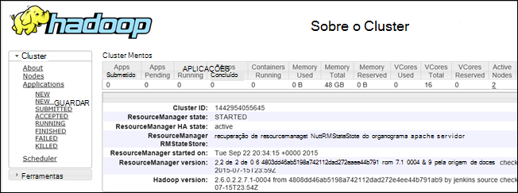

<properties
    pageTitle="Depurar Hadoop no HDInsight: ver registos de início e interpretar a mensagens de erro | Microsoft Azure"
    description="Saiba mais sobre as mensagens de erro que poderá receber quando administrar HDInsight através do PowerShell e os passos que pode tomar para recuperar."
    services="hdinsight"
    tags="azure-portal"
    editor="cgronlun"
    manager="jhubbard"
    authors="mumian"
    documentationCenter=""/>

<tags
    ms.service="hdinsight"
    ms.workload="big-data"
    ms.tgt_pltfrm="na"
    ms.devlang="na"
    ms.topic="article"
    ms.date="09/02/2016"
    ms.author="jgao"/>

# Analisar HDInsight registos

Cada cluster Hadoop no Azure HDInsight tem uma conta de armazenamento Azure utilizada como o sistema de ficheiro predefinido. A conta de armazenamento é referida como conta predefinida armazenamento. Cluster utiliza o armazenamento de tabela do Azure e o armazenamento de BLOBs a conta de armazenamento predefinida para armazenar os seus registos.  Para saber qual a conta de armazenamento predefinida para o seu cluster, consulte o artigo [Gerir Hadoop clusters no HDInsight](hdinsight-administer-use-management-portal.md#find-the-default-storage-account). Mantém os registos na conta de armazenamento, mesmo depois do cluster é eliminado.

##Registos de escrita às tabelas do Azure

Os registos escritos Azure tabelas fornecem um nível de visão o que se passa com um cluster de HDInsight.

Quando cria um cluster de HDInsight, 6 tabelas são criadas automaticamente para com base em Linux clusters no armazenamento de tabela predefinido:

- hdinsightagentlog
- syslog
- daemonlog
- hadoopservicelog
- ambariserverlog
- ambariagentlog

3 tabelas são criadas para clusters baseados no Windows:

- Setuplog: registo de eventos/exceções encontrado em aprovisionamento/configurar de HDInsight clusters.
- hadoopinstalllog: registo de eventos/exceções encontrada ao instalar o Hadoop no cluster. Esta tabela pode ser úteis depuração de problemas relacionados com a clusters criados com parâmetros personalizados.
- hadoopservicelog: registo de eventos/exceções efetuado por todos os serviços de Hadoop. Esta tabela pode ser úteis depuração de problemas relacionados com falhas da tarefa em HDInsight clusters.

Os nomes de ficheiro de tabela são **u<ClusterName>DDMonYYYYatHHMMSSsss<TableName>**.

Estas tabelas contém os seguintes campos:

- ClusterDnsName
- NomeDoComponente foi
- EventTimestamp
- Anfitrião
- MALoggingHash
- Mensagem
- N
- PreciseTimeStamp
- Função
- RowIndex
- Inquilino
- DATA/HORA
- TraceLevel

### Ferramentas para aceder os registos

Existem várias ferramentas disponíveis para aceder aos dados nestas tabelas:

-  Visual Studio
-  Explorador de armazenamento Azure
-  Power Query para Excel

#### Utilizar o Power Query para Excel

Power Query pode ser instalado a partir do [www.microsoft.com/en-us/download/details.aspx?id=39379]( http://www.microsoft.com/en-us/download/details.aspx?id=39379). Ver a página de transferência para os requisitos de sistema

**Para utilizar o Power Query para abrir e analisar o registo de serviço**

1. Abrir o **Microsoft Excel**.
2. No menu do **Power Query** , clique na **Partir do Azure**e, em seguida, clique na **partir do Microsoft Azure tabela armazenamento**.
 
    
3. Introduza o nome de conta de armazenamento. Isto pode ser o nome abreviado ou o FQDN.
4. Introduza a chave de conta de armazenamento. Deverá ver uma lista de tabelas:

    
5. Botão direito do rato na tabela hadoopservicelog no painel **navegador** e selecione **Editar**. Deve ver 4 colunas. Opcionalmente, elimine as colunas **Partição chave**, **Tecla de linha**e **carimbo** selecionando-os, em seguida, clicar em **Remover colunas** a partir das opções no Friso.
6. Clique no ícone de expansão na coluna conteúdo para escolher as colunas que pretende importar para a folha de cálculo do Excel. Para esta demonstração que escolhi TraceLevel e NomeDoComponente foi: pode dar-me algumas informações básicas no qual componentes tinham problemas.

    
7. Clique em **OK** para importar os dados.
8. Selecione as colunas **TraceLevel**, função e **NomeDoComponente foi** e, em seguida, clique em **Agrupar por** controlo no Friso.
9. Clique em **OK** na caixa de diálogo Agrupar por
10. Clique em** aplicar e fechar**.
 
Agora pode utilizar o Excel para filtrar e ordenar conforme necessário. Obviamente, poderá querer incluir outras colunas (por exemplo, mensagem) para poder desagregar problemas quando ocorrem, mas selecionar e a agrupar as colunas descritas acima fornecem uma imagem decente do que se passa com os serviços de Hadoop. A mesma ideia pode ser aplicada às tabelas setuplog e hadoopinstalllog.

#### Utilizar o Visual Studio

**Para utilizar o Visual Studio**

1. Abrir o Visual Studio.
2. A partir do menu **Ver** , clique em **Explorador da nuvem**. Ou clique simplesmente **CTRL +\, CTRL + X**.
3. A partir do **Explorador de nuvem**, selecione **Tipos de recursos**.  A opção de disponível é **Grupos de recursos**.
4. Expanda **Contas de armazenamento**, a conta de armazenamento predefinida para o seu cluster e, em seguida, **tabelas**.
5. Faça duplo clique **hadoopservicelog**.
6. Adicione um filtro. Por exemplo:
    
        TraceLevel eq 'ERROR'

    

    Para obter mais informações acerca da construção de filtros, consulte [Construir cadeias de filtro para o Estruturador da tabela](../vs-azure-tools-table-designer-construct-filter-strings.md).
 
##Registos de escrita ao armazenamento de Blobs do Azure

[Os registos escritos Azure tabelas](#log-written-to-azure-tables) fornecem um nível de visão o que se passa com um cluster de HDInsight. No entanto, estas tabelas não fornecem registos de nível de tarefa, o que podem ser útil nas aprofundar o nível de mais problemas quando ocorrem. Para fornecer este nível de detalhe seguinte, clusters de HDInsight são configurados para escrever os registos de tarefa à sua conta de armazenamento de BLOBs para qualquer tarefa que é apresentada através de Templeton. Praticamente, isto significa que trabalhos submetidos utilizando os cmdlets do PowerShell do Microsoft Azure ou APIs de submissão de tarefa .NET, não submetidas através de RDP/comandos-linha acesso ao cluster de tarefas. 

Para ver os registos, consulte o artigo [aplicação do Access FIO inicia sessão baseado em Linux HDInsight](hdinsight-hadoop-access-yarn-app-logs-linux.md).

Para mais informações sobre registos da aplicação, consulte o artigo [Simplifying gestão de registos de utilizador e acesso em FIO](http://hortonworks.com/blog/simplifying-user-logs-management-and-access-in-yarn/).
 
 
## Ver registos cluster de estado de funcionamento e de projeto

###Aceder à IU Hadoop

A partir do Portal do Azure, clique num nome de cluster HDInsight para abrir o pá cluster. Pá cluster, clique em **Dashboard**.

Quando lhe for pedido, introduza as credenciais de administrador de cluster. Na consola de consulta que se abre, clique em **Hadoop IU**.

###Aceder a fio IU

A partir do Portal do Azure, clique num nome de cluster HDInsight para abrir o pá cluster. Pá cluster, clique em **Dashboard**. Quando lhe for pedido, introduza as credenciais de administrador de cluster. Na consola de consulta que se abre, clique em **FIO IU**.

Pode utilizar a IU FIO para fazer o seguinte:

* **Obter o estado de cluster**. A partir do painel da esquerda, expanda **Cluster**e clique em **Acerca**de. Este apresentar cluster detalhes de estado como total atribuído memória, núcleos utilizados, estado do Gestor de recursos cluster, cluster versão, etc.

    

* **Obter o estado de nó**. A partir do painel da esquerda, expanda **Cluster**e clique em **nós**. Lista todos os nós o endereço HTTP de cada nó cluster recursos atribuídos a cada nó, etc.

* **Estado da tarefa monitor**. A partir do painel da esquerda, expanda **Cluster**e, em seguida, clique em **aplicações** para listar todas as tarefas no cluster. Se quiser ver tarefas num estado específico (tal como nova, submetido, a trabalhar rapidamente, etc.), clique na ligação adequada em **aplicações**. Pode clicar ainda mais o nome da tarefa para saber mais sobre a tarefa, incluindo a saída, registos de início, etc.

###Aceder a IU HBase

A partir do Portal do Azure, clique num nome de cluster HDInsight HBase para abrir o pá cluster. Pá cluster, clique em **Dashboard**. Quando lhe for pedido, introduza as credenciais de administrador de cluster. Na consola de consulta que se abre, clique em **HBase IU**.

## Códigos de erro HDInsight

São fornecidas as mensagens de erro listadas nesta secção para ajudar os utilizadores de Hadoop no Azure HDInsight compreender as possíveis condições de erro que podem encontrar quando administrar o serviço através do PowerShell do Azure e para informá-los-sobre os passos que podem ser encaminhados para recuperar do erro.

Algumas destas mensagens de erro podem também ser vistas no Portal do Azure quando for utilizado para gerir os HDInsight clusters. Outras mensagens de erro que poderá encontrar, mas existem menos granular devido os constrangimentos nas ações reparação possíveis neste contexto. Outras mensagens de erro são fornecidas em contextos onde a mitigação é óbvia. 

### AtleastOneSqlMetastoreMustBeProvided
- **Descrição**: forneça detalhes de base de dados Azure SQL para componente de pelo menos uma para poder utilizar definições personalizadas para metastores ramo e Oozie.
- **Mitigação**: O utilizador tem de fornecer um metastore SQL Azure válido e tente novamente o pedido.  

### AzureRegionNotSupported
- **Descrição**: não foi possível criar cluster na região *nameOfYourRegion*. Utilize uma região HDInsight válida e volte a tentar pedido.
- **Mitigação**: cliente deve criar da região de cluster atualmente a suporta: Sudeste asiático, Europa Ocidental, Europa Norte, Leste dos EUA ou ocidental dos EUA.  

### ClusterContainerRecordNotFound
- **Descrição**: O servidor não foi possível localizar o registo de cluster pedida.  
- **Mitigação**: Repetir a operação.

### ClusterDnsNameInvalidReservedWord
- **Descrição**: Cluster DNS nome *yourDnsName* é inválido. Certifique-se de nome começa e termina com alfanumérico e só podem conter '-' caráter especial  
- **Mitigação**: Certifique-se de que tiver utilizado um nome válido de DNS para o seu cluster que é iniciado e termina com alfanuméricos e contém sem especiais carateres que não o travessão '-' e, em seguida, repita a operação.

### ClusterNameUnavailable
- **Descrição**: Cluster nome *yourClusterName* não está disponível. Escolha outro nome.  
- **Mitigação**: O utilizador deve especificar um nome de cluster que seja exclusivo e não existirem e volte a tentar. Se o utilizador estiver a utilizar o Portal, a IU informa-las se um nome de cluster já está a ser utilizado durante os passos de criar.

### ClusterPasswordInvalid
- **Descrição**: palavra-passe Cluster é inválido. Palavra-passe tem de ter pelo menos de 10 carateres e tem de conter pelo menos um número, maiúscula, minúscula e caráter especial sem espaços e não deve conter o nome de utilizador como parte do mesmo.  
- **Mitigação**: forneça uma palavra-passe de cluster válido e repita a operação.

### ClusterUserNameInvalid
- **Descrição**: Cluster nome de utilizador é inválido. Certifique-se de nome de utilizador não contêm carateres especiais ou espaços.  
- **Mitigação**: fornecer um nome de utilizador cluster válido e repita a operação.

### ClusterUserNameInvalidReservedWord
- **Descrição**: Cluster DNS nome *yourDnsClusterName* é inválido. Certifique-se de nome começa e termina com alfanumérico e só podem conter '-' caráter especial  
- **Mitigação**: fornecer um nome de utilizador de cluster DNS válido e repita a operação.

### ContainerNameMisMatchWithDnsName
- **Descrição**: nome do contentor no URI *yourcontainerURI* e DNS nome *yourDnsName* no corpo do pedido tem de ser igual.  
- **Mitigação**: Certifique-se de que o contentor nome e o seu nome DNS são os mesmos e repita a operação.

### DataNodeDefinitionNotFound
- **Descrição**: configuração cluster inválido. Não é possível localizar quaisquer definições de nó de dados no tamanho nó.  
- **Mitigação**: Repetir a operação.

### DeploymentDeletionFailure
- **Descrição**: a eliminação de implementação falhou para o Cluster  
- **Mitigação**: Repetir a operação de eliminação.

### DnsMappingNotFound
- **Descrição**: erro de configuração do serviço. Informações de mapeamento de DNS necessárias não foi encontradas.  
- **Mitigação**: Eliminar cluster e criar um novo cluster.

### DuplicateClusterContainerRequest
- **Descrição**: duplicar tentativa de criação de contentor de cluster. Registo existe para *nameOfYourContainer* , mas não correspondam a Etags.
- **Mitigação**: atribua um nome exclusivo para o contentor e repita a operação de criar.

### DuplicateClusterInHostedService
- **Descrição**: serviço alojado *nameOfYourHostedService* já contenha um cluster. Um serviço alojado não pode conter vários clusters  
- **Mitigação**: cluster noutro serviço alojada do anfitrião.

### FailureToUpdateDeploymentStatus
- **Descrição**: O servidor não foi possível actualizar o estado da implementação cluster.  
- **Mitigação**: Repetir a operação. Se isto acontece várias vezes, contacte o CSS.

### HdiRestoreClusterAltered
- **Descrição**: Cluster *yourClusterName* foi eliminado como parte da manutenção. Recrie o cluster.
- **Mitigação**: recrie o cluster.

### HeadNodeConfigNotFound
- **Descrição**: configuração cluster inválido. Configuração de nó de cabeça necessário não encontrada em tamanhos de nó.
- **Mitigação**: Repetir a operação.

### HostedServiceCreationFailure
- **Descrição**: não é possível criar serviço alojado *nameOfYourHostedService*. Volte a tentar pedido.  
- **Mitigação**: repetir o pedido.

### HostedServiceHasProductionDeployment
- **Descrição**: serviço alojado *nameOfYourHostedService* já tem uma implementação de produção. Um serviço alojado não pode conter várias implementações de produção. Repetir o pedido com um nome de cluster diferente.
- **Mitigação**: Utilize um nome de cluster diferente e volte a tentar o pedido.

### HostedServiceNotFound
- **Descrição**: alojado serviço *nameOfYourHostedService* para cluster não foi possível encontrar.  
- **Mitigação**: se o cluster estiver no estado de erro, eliminá-la e, em seguida, tente novamente.

### HostedServiceWithNoDeployment
- **Descrição**: serviço alojado *nameOfYourHostedService* tem sem implementação associada.  
- **Mitigação**: se o cluster estiver no estado de erro, eliminá-la e, em seguida, tente novamente.

### InsufficientResourcesCores
- **Descrição**: O SubscriptionId *yourSubscriptionId* não tem tarolos para a esquerda para criar cluster *yourClusterName*. Obrigatório: *resourcesRequired*, disponível: *resourcesAvailable*.  
- **Mitigação**: libertar recursos na sua subscrição ou aumentar os recursos disponíveis para a subscrição e tente criar cluster novamente.

### InsufficientResourcesHostedServices
- **Descrição**: ID da subscrição *yourSubscriptionId* não tem quota para um novo HostedService Criar cluster *yourClusterName*.  
- **Mitigação**: libertar recursos na sua subscrição ou aumentar os recursos disponíveis para a subscrição e tente criar cluster novamente.

### InternalErrorRetryRequest
- **Descrição**: O servidor encontrou um erro interno. Volte a tentar pedido.  
- **Mitigação**: repetir o pedido.

### InvalidAzureStorageLocation
- **Descrição**: de localização de armazenamento Azure *dataRegionName* não é uma localização válida. Certifique-se que a região está correta e tente novamente pedido.
- **Mitigação**: selecione uma localização de armazenamento que suporte HDInsight, verifique se o seu cluster está localizado cocriação e repita a operação.

### InvalidNodeSizeForDataNode
- **Descrição**: tamanho da memória virtual inválido para os nós de dados. Tamanho da 'Memória de virtual grandes' só é suportado para todos os nós de dados.  
- **Mitigação**: Especifique o tamanho de nó suportados para o nó de dados e repita a operação.

### InvalidNodeSizeForHeadNode
- **Descrição**: tamanho da memória virtual inválido para o nó cabeça. Tamanho da 'Memória de virtual ExtraLarge' só é suportado para nó cabeça.  
- **Mitigação**: Especifique o tamanho de nó suportados para o nó cabeça e repita a operação

### InvalidRightsForDeploymentDeletion
- **Descrição**: ID da subscrição *yourSubscriptionId* a ser utilizado não tem permissões suficientes para executar a operação de eliminação para cluster *yourClusterName*.  
- **Mitigação**: se o cluster estiver no estado de erro, largue-a e, em seguida, tente novamente.  

### InvalidStorageAccountBlobContainerName
- **Descrição**: armazenamento externo conta blob contentor nome *yourContainerName* é inválido. Certifique-se de nome começa por uma letra e contém apenas letras em minúsculas, números e travessão.  
- **Mitigação**: Especifique um nome de contentor de Blobs do armazenamento válida conta e repita a operação.

### InvalidStorageAccountConfigurationSecretKey
- **Descrição**: configuração de conta de armazenamento externo *yourStorageAccountName* é necessário ter secretas detalhes chave para ser definir.  
- **Mitigação**: Especifique uma chave secreta válida para a conta de armazenamento e repita a operação.

### InvalidVersionHeaderFormat
- **Descrição**: versão cabeçalho *yourVersionHeader* não está no formato válido de aaaa-mm-dd.  
- **Mitigação**: especificar um formato válido para o cabeçalho da versão e repetir o pedido.

### MoreThanOneHeadNode
- **Descrição**: configuração cluster inválido. Localizar mais do que uma configuração de cabeça nó.  
- **Mitigação**: Editar a configuração, de modo que onloy um nó cabeça for especificado.

### OperationTimedOutRetryRequest
- **Descrição**: não foi possível concluir a operação dentro do prazo permitido ou o número máximo de tentativas tentativas possível. Volte a tentar pedido.  
- **Mitigação**: repetir o pedido.

### ParameterNullOrEmpty
- **Descrição**: parâmetro *yourParameterName* não podem ser nulo ou vazio.  
- **Mitigação**: especificar um valor válido para o parâmetro.

### PreClusterCreationValidationFailure
- **Descrição**: uma ou mais das entradas de pedido de criação de cluster não não válido. Certifique-se os valores de entrada estão corretos e tente novamente pedido.  
- **Mitigação**: Certifique-se os valores de entrada estão corretos e tente novamente pedido.

### RegionCapabilityNotAvailable
- **Descrição**: capacidade de região não está disponível para região *yourRegionName* e o ID da subscrição *yourSubscriptionId*.  
- **Mitigação**: Especifique uma região que suporta HDInsight clusters. As regiões publicamente suportadas são: Sudeste asiático, Europa Ocidental, Europa Norte, Leste dos EUA ou ocidental dos EUA.

### StorageAccountNotColocated
- **Descrição**: de conta de armazenamento *yourStorageAccountName* está na região *currentRegionName*. Deve ser igual ao de região de cluster *yourClusterRegionName*.  
- **Mitigação**: Especifique uma conta de armazenamento na mesma região que seu cluster está no ou se os seus dados já estiverem na conta de armazenamento, crie um novo cluster na mesma região como a conta de armazenamento existente. Se estiver a utilizar o Portal, a IU informa-los deste problema com antecedência.

### SubscriptionIdNotActive
- **Descrição**: dado ID da subscrição *yourSubscriptionId* não esteja ativa.  
- **Mitigação**: ativar novamente a sua subscrição ou obtenha uma nova subscrição válida.

### SubscriptionIdNotFound
- **Descrição**: não foi possível localizar o ID da subscrição *yourSubscriptionId* .  
- **Mitigação**: Verifique se o seu ID da subscrição é válido e repita a operação.

### UnableToResolveDNS
- **Descrição**: não é possível resolver DNS *yourDnsUrl*. Certifique-se de que o URL totalmente qualificado para o ponto final blob é fornecido.  
- **Mitigação**: fornecer um URL de BLOBs válida. O URL tem de ser completamente válido, incluindo começando por *http://* e termine em *.com*.

### UnableToVerifyLocationOfResource
- **Descrição**: não é possível verificar a localização do recurso *yourDnsUrl*. Certifique-se de que o URL totalmente qualificado para o ponto final blob é fornecido.  
- **Mitigação**: fornecer um URL de BLOBs válida. O URL tem de ser completamente válido, incluindo começando por *http://* e termine em *.com*.

### VersionCapabilityNotAvailable
- **Descrição**: capacidade de versão não está disponível para a versão *specifiedVersion* e o ID da subscrição *yourSubscriptionId*.  
- **Mitigação**: escolher uma versão que está disponível e repita a operação.

### VersionNotSupported
- **Descrição**: versão *specifiedVersion* não suportadas.
- **Mitigação**: escolher uma versão que é suportada e repita a operação.

### VersionNotSupportedInRegion
- **Descrição**: versão *specifiedVersion* não está disponível no Azure região *specifiedRegion*.  
- **Mitigação**: escolher uma versão que é suportada na região especificada e repita a operação.

### WasbAccountConfigNotFound
- **Descrição**: configuração cluster inválido. Configuração da conta de necessária WASB não encontrada na contas externas.  
- **Mitigação**: Certifique-se de que a conta existe e está corretamente especificado na configuração e repita a operação.

## Próximos passos

- [Utilizar as vistas de Ambari para depurar Tez tarefas no HDInsight](hdinsight-debug-ambari-tez-view.md)
- [Ativar as informações de estado da pilha para serviços de Hadoop no baseado em Linux HDInsight](hdinsight-hadoop-collect-debug-heap-dump-linux.md)
- [Gerir HDInsight clusters utilizando a IU da Web de Ambari](hdinsight-hadoop-manage-ambari.md)
