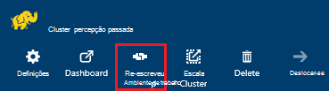
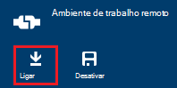
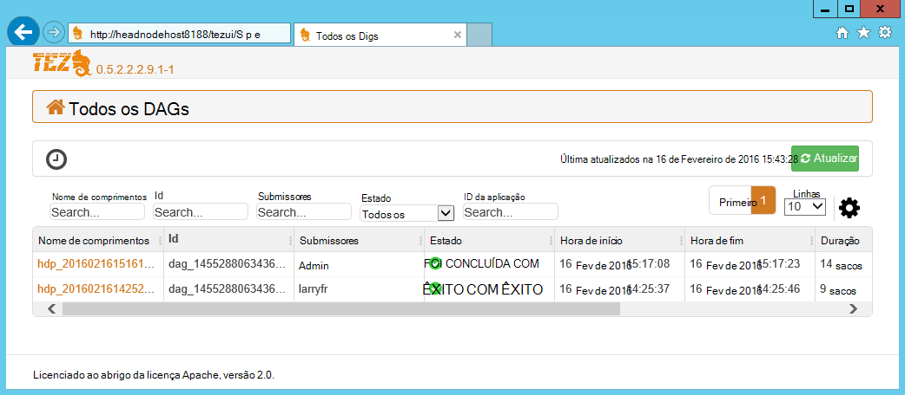
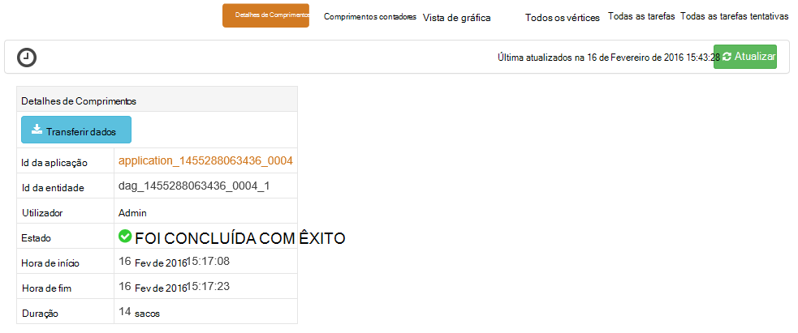
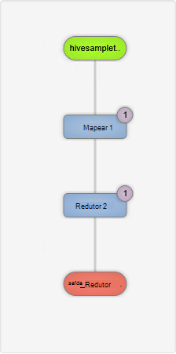
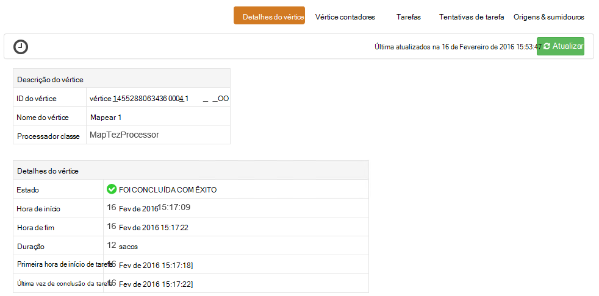
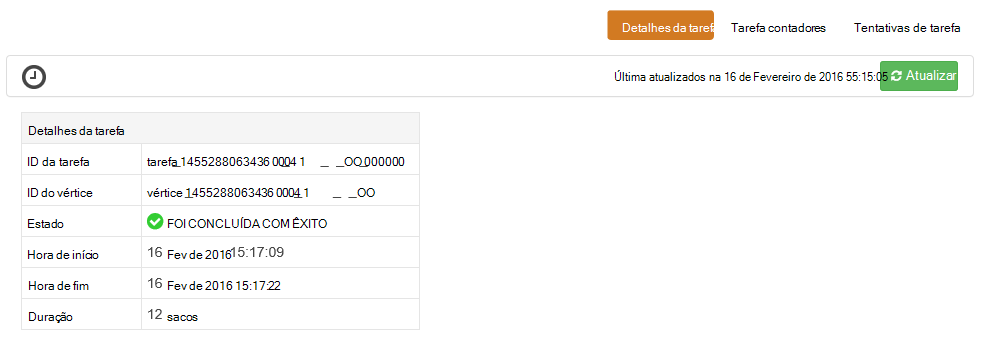

<properties
pageTitle="Utilizar Tez IU com HDInsight baseados no Windows | Azure"
description="Saiba como utilizar a IU Tez depurar Tez tarefas no baseados no Windows HDInsight HDInsight."
services="hdinsight"
documentationCenter=""
authors="Blackmist"
manager="jhubbard"
editor="cgronlun"/>

<tags
ms.service="hdinsight"
ms.devlang="na"
ms.topic="article"
ms.tgt_pltfrm="na"
ms.workload="big-data"
ms.date="10/04/2016"
ms.author="larryfr"/>

# Utilizar a IU Tez para depurar Tez tarefas no HDInsight baseados no Windows

A UI Tez é uma página web que podem ser utilizados para compreender e depurar tarefas que utilizam Tez como o motor de execução em clusters HDInsight baseados no Windows. IU de Tez permite-lhe visualizar a tarefa como um gráfico de itens ligadas, pormenorizar cada item e obter estatísticas e informações de registo.

> [AZURE.NOTE] As informações neste documento são específicas a clusters HDInsight baseados no Windows. Para obter informações sobre a visualização e depuração Tez no baseado em Linux HDInsight, consulte o artigo [Utilize Ambari vistas para depurar Tez tarefas no HDInsight](hdinsight-debug-ambari-tez-view.md).

## Pré-requisitos

* Um cluster de HDInsight baseados no Windows. Para obter passos sobre como criar um novo cluster, consulte o artigo [começar a utilizar o HDInsight baseados no Windows](hdinsight-hadoop-tutorial-get-started-windows.md).

    > [AZURE.IMPORTANT] IU de Tez só está disponível em clusters baseados no Windows HDInsight criados após 8 de Fevereiro de 2016.

* Um cliente de ambiente de trabalho remoto baseados no Windows.

## Noções sobre Tez

Tez é um quadro extensible para processamento de dados nas Hadoop que fornece velocidades maiores que o processamento de MapReduce tradicional. Para clusters HDInsight baseados no Windows, é um motor opcional que pode ativar para ramo utilizando o comando seguinte como parte da sua consulta ramo:

    set hive.execution.engine=tez;

Quando o trabalho é submetido para Tez, cria um direcionado incluindo Graph (Comprimentos) que descreva a ordem de execução das ações uma ferramenta necessária à tarefa. Ações individuais chamam vértices e executar um elemento do projecto global. A execução do real do trabalho descrito por um vértice chama-se uma tarefa e pode ser distribuída ao longo de vários nós no cluster.

### Noções sobre a IU Tez

IU de Tez é que uma página web fornece informações sobre processos que estiver a executar o ou se tiver anteriormente executou utilizando Tez. Permite-lhe ver Comprimentos gerado pelo Tez, como é distribuído ao longo clusters, contadores como memória utilizada pelo tarefas e vértices e informações de erro. Ele pode oferecer informações úteis nos cenários seguintes:

* A monitorização de execução longa processos, ver o progresso de mapa e reduzir a tarefas.

* Analisar dados de históricos para processos com êxito ou sem saber como processamento pode ser melhorado ou a razão pela qual falhou.

## Gerar um Comprimentos

IU de Tez só irá conter dados se uma tarefa que utiliza o motor de Tez atualmente em execução, ou se tiver sido executada no passado. Consultas de ramo simples, normalmente, podem ser resolvidas sem utilizar Tez, no entanto mais complexas consultas que efetuar a filtragem, agrupamento, ordenação, as associações, etc., normalmente, requerem Tez.

Utilize os passos seguintes para executar uma consulta de ramo executará utilizando Tez.

1. Num browser, navegue para https://CLUSTERNAME.azurehdinsight.net, onde o __nome de cluster__ é o nome do seu cluster HDInsight.

2. A partir do menu na parte superior da página, selecione o __Editor de ramo de registo__. Isto vai mostrar uma página com a seguinte consulta de exemplo.

        Select * from hivesampletable

    Apagar a consulta de exemplo e substituí-lo com o seguinte.

        set hive.execution.engine=tez;
        select market, state, country from hivesampletable where deviceplatform='Android' group by market, country, state;

3. Selecione o botão __Submeter__ . A secção da __Sessão de tarefas__ na parte inferior da página irá apresentar o estado da consulta. Assim que o estado muda para __concluído__, selecione a ligação de __Ver detalhes__ para ver os resultados. A __Tarefa de saída__ deverá ser semelhante ao seguinte:
        
        en-GB   Hessen      Germany
        en-GB   Kingston    Jamaica
        en-GB   Nairobi Area    Kenya

## Utilizar a IU Tez

> [AZURE.NOTE] IU de Tez só está disponível a partir do ambiente de trabalho de nós do cluster de cabeça para que tem de utilizar o ambiente de trabalho remoto para ligar aos nós de cabeça.

1. A partir do [Azure portal](https://portal.azure.com), selecione o seu cluster HDInsight. Na parte superior do pá HDInsight, selecione o ícone de __Ambiente de trabalho remoto__ . Esta ação irá apresentar a pá de ambiente de trabalho remoto

    

2. Pá ambiente de trabalho remoto, selecione __Ligar__ ao ligar para o nó do cabeça cluster. Quando lhe for pedido, utilize o nome de utilizador do ambiente de trabalho remoto cluster e a palavra-passe para autenticar a ligação.

    

    > [AZURE.NOTE] Se não tiver ativado conectividade de ambiente de trabalho remoto, fornecer um nome de utilizador, palavra-passe e data de expiração, em seguida, selecione __Ativar__ para ativar o ambiente de trabalho remoto. Depois de ter sido ativada, utilize os passos anteriores para ligar.

3. Quando estiver ligado, abra o Internet Explorer no ambiente de trabalho remoto, selecione o ícone de engrenagem no canto superior direito do browser e, em seguida, selecione __Definições de vista de compatibilidade__.

4. A partir da parte inferior das __Definições de vista de compatibilidade__, desmarque a caixa de verificação para __apresentar sites__ da intranet na vista de compatibilidade e __Utilize o Microsoft compatibilidade listas__e, em seguida, selecione __Fechar__.

5. No Internet Explorer, navegue para tezui/http://headnodehost:8188 / #/. Esta ação irá apresentar a IU Tez

    

    Quando carrega IU Tez, irá ver uma lista de DAGs que estão atualmente em execução, ou ter sido executou no cluster. A vista predefinida inclui o nome comprimentos, Id, Submissores, estado, hora de início, hora de fim, duração, ID da aplicação e fila de espera. Podem ser adicionadas mais colunas utilizando o ícone de engrenagem à direita da página.

    Se tiver apenas uma entrada, será para a consulta que executou na secção anterior. Se tiver várias entradas, pode procurar introduzindo critérios de pesquisa nos campos acima os DAGs, em seguida, prima __Enter__.

4. Selecione o __Nome de comprimentos__ para a entrada de Comprimentos mais recente. Isto vai mostrar informações sobre os Comprimentos e a opção para transferir um postal de ficheiros JSON que contêm informações sobre os Comprimentos.

    

5. Acima os __Detalhes de Comprimentos__ estão várias ligações que podem ser utilizadas para apresentar informações sobre os Comprimentos.

    * __Comprimentos contadores__ apresenta informações sobre os contadores para este Comprimentos.
    
    * __Vista gráfica__ apresenta uma representação deste Comprimentos gráfica.
    
    * __Todos os vértices__ apresenta uma lista dos vértices neste Comprimentos.
    
    * __Todas as tarefas__ apresenta uma lista de tarefas para todos os vértices neste Comprimentos.
    
    * __Todos os TaskAttempts__ apresenta informações sobre as tentativas para executar tarefas para este Comprimentos.
    
    > [AZURE.NOTE] Se deslocar a coluna de visualização para vértices, tarefas e TaskAttempts, repare que existem hiperligações para ver __contadores__ e __visualizar ou transferir os registos__ para cada linha.

    Se Ocorreu uma falha com a tarefa, os detalhes de Comprimentos irá exibir um Estado de falhou, juntamente com ligações para informações sobre a tarefa falha. Informações de diagnóstico serão apresentadas sob os detalhes de Comprimentos.

7. Selecione a __vista de gráfica__. Isto apresenta uma representação gráfica dos Comprimentos. Pode colocar o cursor do rato sobre cada vértice na vista para apresentar informações acerca do mesmo.

    

8. Clicar num vértice irá carregar os __Detalhes de vértice__ para esse item. Clique no vértice a __1 de mapa__ para apresentar detalhes para este item. Selecione __Confirmar__ para confirmar a navegação.

    

9. Tenha em atenção que tem agora ligações na parte superior da página que estão relacionados com vértices e tarefas.

    > [AZURE.NOTE] Também pode chegar a esta página aceder novamente ao __Comprimentos detalhes__, selecionando o __Vértice detalhes__e, em seguida, selecionando o vértice __mapa 1__ .

    * __Vértice contadores__ apresenta informações de contador para este vértice.
    
    * __Tarefas__ apresenta as tarefas para este vértice.
    
    * __Tarefa tentativas__ apresenta informações sobre tentativas para executar tarefas para este vértice.
    
    * __Origens e sumidouros__ apresenta origens de dados e afunde para este vértice.

    > [AZURE.NOTE] Como com o menu anterior, pode deslocar a coluna de visualização para tarefas, tentativas de tarefa, fontes e Sinks__ Mostrar ligações para mais informações para cada item.

10. Selecione __tarefas__e, em seguida, selecione o item com o nome __00_000000__. Isto vai mostrar __Detalhes da tarefa__ para esta tarefa. A partir deste ecrã, pode ver __Contadores de tarefa__ e __Tentativas de tarefa__.

    

## Próximos passos

Agora que aprendeu como utilizar a vista de Tez, saiba mais sobre [Utilizar Hive no HDInsight](hdinsight-use-hive.md).

Para obter informações técnicas mais detalhadas sobre Tez, consulte a [página de Tez em Hortonworks](http://hortonworks.com/hadoop/tez/).
