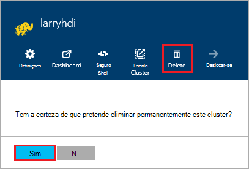

<properties
pageTitle="Como eliminar um cluster de HDInsight | Azure"
description="Obter informações sobre as várias formas que pode eliminar um cluster de HDInsight."
services="hdinsight"
documentationCenter=""
authors="Blackmist"
manager="jhubbard"
editor="cgronlun"/>

<tags
ms.service="hdinsight"
ms.devlang="na"
ms.topic="article"
ms.tgt_pltfrm="na"
ms.workload="big-data"
ms.date="10/28/2016"
ms.author="larryfr"/>

#Como eliminar um cluster de HDInsight

Cluster de HDInsight faturação é iniciado assim que um cluster de é criado e deixa de quando o cluster é eliminado e é proporcional por minuto, deverá eliminar sempre seu cluster quando já não se encontra em utilização. Este documento, vai aprender eliminar um cluster através do Portal do Azure, PowerShell do Azure e o clip do Azure.

> [AZURE.IMPORTANT] Eliminar um cluster de HDInsight não elimina o (s) de armazenamento do Windows Azure associado ao cluster. Esta opção permite-lhe preservar e reutilizar quaisquer dados armazenados pelo cluster.

##Portal do Azure

1. Inicie sessão no [portal do Azure](https://portal.azure.com) e selecione o seu cluster HDInsight. Se o seu cluster HDInsight não é afixado ao dashboard, pode procurá-la por nome de campo de pesquisa (ícone de Lupa), no lado direito da barra de navegação.

    

2. Assim que a pá abre-se para o cluster, selecione o ícone __Eliminar__ . Quando lhe for pedido, selecione __Sim__ para eliminar o cluster.

    

##Azure PowerShell

A partir de uma linha de comandos do PowerShell, utilize o seguinte comando para eliminar o cluster:

    Remove-AzureRmHDInsightCluster -ClusterName CLUSTERNAME

Substitua o __nome de cluster__ com o nome do seu cluster HDInsight.

##Clip Azure

A partir de uma linha de comandos, utilize o seguinte procedimento para eliminar o cluster:

    azure hdinsight cluster delete CLUSTERNAME
    
Substitua o __nome de cluster__ com o nome do seu cluster HDInsight.
