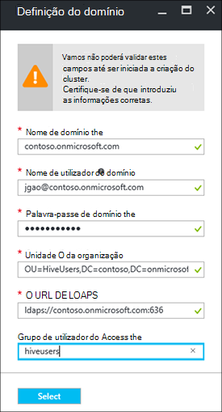

<properties
    pageTitle="Configurar domínio HDInsight clusters | Microsoft Azure"
    description="Saiba como instalar e configurar o domínio HDInsight clusters"
    services="hdinsight"
    documentationCenter=""
    authors="saurinsh"
    manager="jhubbard"
    editor="cgronlun"
    tags=""/>

<tags
    ms.service="hdinsight"
    ms.devlang="na"
    ms.topic="article"
    ms.tgt_pltfrm="na"
    ms.workload="big-data"
    ms.date="10/26/2016"
    ms.author="saurinsh"/>

# Configurar domínio HDInsight clusters (pré-visualização)

Saiba como configurar um cluster de Azure HDInsight com o Azure Active Directory (Azure AD) e [Apache Ranger](http://hortonworks.com/apache/ranger/) para tirar partido de autenticação forte e políticas de acesso baseado em funções avançada de controlo (RBCA).  HDInsight façam parte de um domínio apenas pode ser configurada no clusters baseados em Linux. Para mais informações, consulte o artigo [clusters de apresentar domínio HDInsight](hdinsight-domain-joined-introduction.md).

Este artigo é o primeiro tutorial de uma série:

- Crie um cluster de HDInsight ligado ao Azure AD (através da capacidade de Azure Directory Domain Services) com Ranger Apache ativado.
- Criar e aplicar políticas de ramo através de Apache Ranger e permitir que os utilizadores (por exemplo, cientistas dados) ligar à ramo utilizar ferramentas baseadas em ODBC, por exemplo, Excel, etc de quadro. Microsoft está a trabalhar sobre como adicionar outras das cargas de trabalho, tais como HBase, motores e tempestade, ao domínio HDInsight mais rapidamente.

Um exemplo da topologia de final será apresentada da seguinte forma:

Uma vez que Azure AD atualmente suporta apenas redes virtuais Clássicos (VNets) e baseado em Linux HDInsight clusters de suporte apenas de Gestor de recursos do Azure baseados VNets, HDInsight Azure AD integração requer dois VNets e um efectuado entre elas. Para as informações de comparação entre os modelos de duas implementação, consulte o artigo [Gestor de recursos do Azure vs. implementação clássica: compreender os modelos de implementação e o estado dos seus recursos](../resource-manager-deployment-model.md). As duas VNets tem de ser na mesma região como o Azure AD DS.

Nomes de serviço Azure tem de ser exclusivos global. Os seguintes nomes são utilizados neste tutorial. Contoso é o nome fictício. Tem de substituir *contoso* com um nome diferente ao percorrer o tutorial. 
    
**Nomes de:**

|Propriedade|Valor|
|--------|-----|
| Azure AD VNet|contosoaadvnet|
| Máquina Virtual do Azure AD (VM)|contosoaadadmin. Este VM é utilizada para configurar a unidade de organização e inverter zona de DNS.|
| Diretório do Azure AD|contosoaaddirectory|
| Nome de domínio do Azure AD|Contoso (contoso.onmicrosoft.com)|
| HDInsight VNet|contosohdivnet|
| Grupo de recursos HDInsight VNet|contosohdirg|
| HDInsight cluster|contosohdicluster|

Neste tutorial fornece os passos para configurar um cluster de HDInsight façam parte de um domínio. Cada secção tem ligações para outros artigos com obter mais informações.

## Pré-requisito:

- Familiarizar-se com os [Serviços de domínio do Azure AD](https://azure.microsoft.com/services/active-directory-ds/) respetiva estrutura [preços](https://azure.microsoft.com/pricing/details/active-directory-ds/) .
- Certifique-se de que a sua subscrição é whitelisted para esta pré-visualização do público. Pode fazê-lo ao enviar um e-mail para hdipreview@microsoft.com com o seu ID de subscrição.
- Um certificado SSL assinada por uma autoridade de assinatura para o seu domínio. É necessário o certificado ao configurar LDAP seguro. Certificados autoassinados não podem ser utilizados.

## Procedimentos

1. Crie um VNet clássica Azure para sua Azure AD.  
2. Criar e configurar o Azure AD e Azure AD DS.
3. Adicione uma VM a VNet clássica para a criação de unidade organizacional. 
4. Crie uma unidade organizacional para o Azure AD DS.
5. Crie um HDInsight VNet no modo de gestão de recursos Azure.
6. Programa de configuração zonas inverter DNS para o Azure AD DS.
6. Ponto a ponto as duas VNets.
7. Crie um cluster de HDInsight.

> [AZURE.NOTE] Neste tutorial assume que não tem uma Azure AD. Se tiver uma, pode ignorar a parte no passo 2.
    
## Criar um VNet clássica Azure

Nesta secção, crie uma VNet clássica através do portal Azure. Na secção seguinte, ativar o Azure AD DS para sua Azure AD na VNet clássica. Para mais informações sobre como o procedimento seguinte e utilizar outros métodos de criação de VNet, consulte o artigo [criar uma rede virtual (clássica) utilizando o portal do Azure](../virtual-network/virtual-networks-create-vnet-classic-portal.md).

**Para criar um VNet clássico**

1. Inicie sessão no [portal do Azure](https://portal.azure.com). 
2. Clique em **Novo** > **funcionamento em rede** > **Rede Virtual**.
3. Em **Selecione um modelo de implementação**, selecione **clássica**e, em seguida, clique em **Criar**.
4. Introduza ou selecione os seguintes valores:

    - **Nome**: contosoaadvnet
    - **Espaço de endereços**: 10.1.0.0/16
    - **Nome de sub-rede**: Sub-rede1
    - **Intervalo de endereços de sub-rede**: 10.1.0.0/24
    - **Subscrição**: (selecione uma subscrição utilizada para criar este VNet.)
    - **ResourceGroup**:
    - **Localização**: (selecione uma região para o seu cluster HDInsight.)

        > [AZURE.IMPORTANT] Tem de escolher uma localização que suporte Azure AD DS. Para mais informações, consulte o artigo [produtos disponíveis por região](https://azure.microsoft.com/en-us/regions/services/). 
        >
        > O VNet clássica e o VNet de grupo de recursos tem de ser na mesma região como o Azure AD DS.

5. Clique em **Criar** para criar o VNet.

## Criar e configurar o Azure AD DS para o seu Azure AD

Nesta secção, irá:

1. Crie um Azure AD.
2. Crie utilizadores do Azure AD. Estes utilizadores são os utilizadores do domínio. Utilize o primeiro utilizador para configurar o cluster HDInsight com o Azure AD.  Os outros duas utilizadores são opcionais para este tutorial. Que irão ser utilizadas em [Hive configurar políticas para clusters HDInsight façam parte de um domínio](hdinsight-domain-joined-run-hive.md) quando configurar políticas de Apache Ranger.
3. Criar um grupo de administradores de CC AAD e adicionar o utilizador do Azure AD para o grupo. Utilize este utilizador para criar a unidade organizacional.
4. Ative serviços de domínio do Azure AD (Azure AD DS) para o Azure AD.
7. Configure LDAPS para Azure AD. O LDAP Lightweight Directory Access Protocol () é utilizada para ler e escrever para Azure AD.

Se preferir utilizar um Azure AD existente, pode ignorar os passos 1 e 2.

**Para criar um Azure AD**

1. A partir do [Azure portal clássico](https://manage.windowsazure.com), clique em **Novo** > **Serviços de aplicação** > **Do Active Directory** > **diretório** > **Criar personalizado**. 
3. Introduza ou selecione os seguintes valores:

    - **Nome**: contosoaaddirectory
    - **Nome de domínio**: contoso.  Este nome deve ser globalmente exclusivo.
    - **País ou região**: selecione o seu país ou região.
4. Clique em **concluído**.

**Criar um utilizador do Azure AD**

1. A partir do [Azure portal clássico](https://manage.windowsazure.com), clique em **Do Active Directory** -> **contosoaaddirectory**. 
3. Clique em **utilizadores** a partir do menu superior.
4. Clique em **Adicionar utilizador**.
4. Introduza o **Nome de utilizador**e, em seguida, clique em **seguinte**. 
5. Configurar perfis de utilizador **Função**, selecione **Administrador Global**; e, em seguida, clique em **seguinte**.  A função de Administrador Global é necessário para criar unidades organizacionais.
6. Clique em **Criar** para obter uma palavra-passe temporária.
7. Criar uma cópia da palavra-passe e, em seguida, clique em **Concluir**. Mais tarde neste tutorial, irá utilizar este utilizador de administrador global para iniciar sessão administrador VM para criar uma unidade de organização e configurar o DNS inverso.

Siga o mesmo procedimento para criar duas mais utilizadores com a função de **utilizador** , hiveuser1 e hiveuser2. Os utilizadores que se seguem serão utilizados no [ramo de configurar políticas para clusters HDInsight façam parte de um domínio](hdinsight-domain-joined-run-hive.md).

**Para criar o grupo dos administradores de CC AAD e adicionar um utilizador do Azure AD**

1. A partir do [Azure portal clássico](https://manage.windowsazure.com), clique em **Do Active Directory** > **contosoaaddirectory**. 
3. A partir do menu superior, clique em **grupos** .
4. Clique em **Adicionar um grupo** ou **Adicionar grupo**.
5. Introduza ou selecione os seguintes valores:

    - **Nome**: AAD CC administradores.  Não altere o nome do grupo.
    - **Tipo de grupo**: segurança.
6. Clique em **concluído**.
7. Clique em **AAD CC administradores** para abrir o grupo.
8. Clique em **Adicionar membros**.
9. Selecione o primeiro utilizador que criou no passo anterior e, em seguida, clique em **Concluir**.
10. Repita os mesmos passos para criar outro grupo designado **HiveUsers**e adicionar os dois ramo de utilizadores ao grupo.

Para mais informações, consulte o artigo [Serviços de domínio do Azure AD (pré-visualização) - criar grupo ' AAD CC administradores '](../active-directory-domain-services/active-directory-ds-getting-started.md).

**Para ativar o Azure AD DS para o seu Azure AD**

1. A partir do [Azure portal clássico](https://manage.windowsazure.com), clique em **Do Active Directory** > **contosoaaddirectory**. 
3. Clique em **Configurar** a partir do menu superior.
4. Desloque para baixo para **Serviços de domínio**e defina os seguintes valores:

    - **Ativar serviços de domínio para este diretório**: Sim.
    - **Nome de domínio DNS dos serviços de domínio**: esta opção mostra o nome DNS predefinido do directório Azure. Por exemplo, contoso.onmicrosoft.com.
    - **Serviços de domínio de ligar para esta rede virtual**: selecione a rede virtual clássica que criou anteriormente, ou seja, **contosoaadvnet**.
    
6. Clique em **Guardar** a partir da parte inferior da página. Irá ver **pendente …** junto a **Ativar serviços de domínio para este diretório**.  
7. Aguarde até **pendente …** desaparecer, e o **Endereço IP** obtém povoada. Irão obter povoados dois endereços IP. Estes são os endereços IP os controladores de domínio aprovisionados pelos serviços de domínio. Cada endereço IP estarão visível depois do controlador de domínio correspondente está aprovisionada e pronto. Anote os dois endereços IP. Irá necessitá-las mais tarde.

Para mais informações, consulte o artigo [Azure AD dos serviços de domínio (pré-visualização) - ativar o Azure AD Domain Services](../active-directory-domain-services/active-directory-ds-getting-started-enableaadds.md).

**Para sincronizar a palavra-passe**

Se utiliza o seu próprio domínio, tem de sincronizar a palavra-passe. Consulte o artigo [Ativar a sincronização de palavra-passe para serviços de domínio do Azure AD para um Azure apenas na nuvem diretório de AD](../active-directory-domain-services/active-directory-ds-getting-started-password-sync.md).

**Para configurar LDAPS para o Azure AD**

1. Obter um certificado SSL assinada por uma autoridade de assinatura para o seu domínio. Certificados autoassinados não podem ser utilizados. Se não conseguir obter um certificado SSL, consulte comunique hdipreview@microsoft.com para uma exceção.
1. A partir do [Azure portal clássico](https://manage.windowsazure.com), clique em **Do Active Directory** > **contosoaaddirectory**. 
3. Clique em **Configurar** a partir do menu superior.
4. Desloque-se aos **Serviços de domínio**.
5. Clique em **Configurar certificado**.
6. Siga as instruções para especificar o ficheiro de certificado e a palavra-passe. Irá ver **pendente …** junto a **Ativar serviços de domínio para este diretório**.  
7. Aguarde até **pendente …** desaparecer, e **Seguro certificado LDAP** tem povoada.  Isto pode demorar até 10 minutos ou mais.
 
>[AZURE.NOTE] Se algumas tarefas em segundo plano estão a ser executadas no Azure AD DS, poderá ver um erro ao carregar certificado - <i>aí é uma operação a ser executada deste inquilino. Tente novamente mais tarde</i>.  No caso de ocorrerem este erro, tente novamente após algum tempo. O segundo IP de controlador de domínio poderá demorar até 3 horas a ser aprovisionado.

Para mais informações, consulte o artigo [Configurar seguro LDAP (LDAPS) para um domínio de serviços de domínio do Azure AD geridos](../active-directory-domain-services/active-directory-ds-admin-guide-configure-secure-ldap.md).

## Configurar uma unidade organizacional e inverter DNS

Nesta secção, adicione uma máquina virtual para o AD VNet Azure e instale as ferramentas administrativas este VM para que possa configurar uma unidade organizacional e inverter DNS. Pesquisa inversa de DNS é necessária para a autenticação Kerberos.

**Para criar uma máquina virtual sessão na rede virtual**

1. A partir do [Azure portal clássico](https://manage.windowsazure.com), clique em **Novo** > **Calcular** > **Máquina Virtual** > **a partir da Galeria**.
3. Selecione uma imagem e, em seguida, clique em **seguinte**.  Se não souber qual o monitor a utilizar, selecione a predefinição, **O Centro de dados do Windows Server 2012 R2**.
4. Introduza ou selecione os seguintes valores:

    - Nome da máquina virtual: **contosoaadadmin**
    - Camadas: **básicas**
    - Novo nome de utilizador: (Introduza um nome de utilizador)
    - Palavra-passe: (Introduza uma palavra-passe)
    
    Tenha em atenção o nome de utilizador e a palavra-passe é administrador do local.
    
5. Clique em **seguinte**
6. Na **Rede região/Virtual**, selecione a nova rede virtual que criou no último passo (contosoaadvnet) e, em seguida, clique em **seguinte**.
7. Clique em **concluído**.

**Para RDP para a VM**

1. A partir do [Azure portal clássico](https://manage.windowsazure.com), clique em **máquinas virtuais** > **contosoaadadmin**.
3. A partir do menu superior, clique em **Dashboard** .
4. Clique em **Ligar** a partir da parte inferior da página.
5. Siga a instrução e utilizar a administração local nome de utilizador e palavra-passe para ligar.

**Para participar VM para o domínio do Azure AD**

1. Sessão RDP, clique em **Iniciar**e, em seguida, clique em **Gestor de servidor**.
2. Clique em **Local Server** no menu à esquerda.
3. Grupo de trabalho, clique em **grupo de trabalho**.
4. Clique em **Alterar**.
5. Clique em **domínio**, introduza **contoso.onmicrosoft.com**e, em seguida, clique em **OK**.
6. Introduza as credenciais de utilizador do domínio e, em seguida, clique em **OK**.
7. Clique em **OK**.
8. Clique em **OK** para aceitar reiniciar o computador.
9. Clique em **Fechar**.
10. Clique em **reiniciar agora**.

Para mais informações, consulte o artigo [participar uma máquina de virtual do Windows Server para um domínio gerido](../active-directory-domain-services/active-directory-ds-admin-guide-join-windows-vm.md).

**Instalar ferramentas de administração do Active Directory e DNS**

1. RDP para **contosoaadadmin** utilizando a conta de utilizador do Azure AD.
2. Clique em **Iniciar**e, em seguida, clique em **Gestor de servidor**.
3. No menu à esquerda, clique em **Dashboard** .
4. Clique em **Gerir**e, em seguida, clique em **Adicionar funções e funcionalidades**.
5. Clique em **seguinte**.
6. Selecione **instalação baseado em funções ou funcionalidade baseada**e, em seguida, clique em **seguinte**.
7. Selecione a máquina virtual atual do conjunto de servidor e clique em **seguinte**.
8. Clique em **seguinte** para ignorar funções.
9. Expanda as **Ferramentas de administração do servidor remoto**, expanda as **Ferramentas de administração do papel**, selecione **AD DS e ferramentas do AD LDS** e **Ferramentas do servidor DNS**e, em seguida, clique em **seguinte**. 
10. Clique em **seguinte**
10. Clique em **instalar**.

Para mais informações, consulte o artigo [instalar o Active Directory ferramentas de administração na máquina virtual](../active-directory-domain-services/active-directory-ds-admin-guide-administer-domain.md#task-2---install-active-directory-administration-tools-on-the-virtual-machine).

**Para configurar o DNS inversa**

1. RDP para contosoaadadmin utilizando a conta de utilizador do Azure AD.
2. Clique em **Iniciar**, clique em **Ferramentas administrativas**e, em seguida, clique em **DNS**. 
3. Clique em **não** para ignorar adicionar ContosoAADAdmin.
4. Selecione **o computador seguinte**, introduza o endereço IP do primeiro servidor DNS que configurou anteriormente e, em seguida, clique em **OK**.  Deve ver QUE CC/DNS é adicionado à painel do lado esquerdo.
3. Expanda o servidor DNS/CC, com o botão direito **Zonas de pesquisa inversa**e, em seguida, clique em **Nova zona**. É aberto o Assistente de zona de novo.
4. Clique em **seguinte**.
5. Selecione a **zona principal**e, em seguida, clique em **seguinte**.
6. Selecione **todos os servidores DNS em controladores de domínio neste domínio**e, em seguida, clique em **seguinte**.
6. Selecione **IPv4 inverter zona de pesquisa**e, em seguida, clique em **seguinte**.
7. Em **ID da rede**, introduza o prefixo para o intervalo de rede HDInsight VNET e, em seguida, clique em **seguinte**. Irá criar a HDInsight VNet na secção seguinte.
8. Clique em **seguinte**.
9. Clique em **seguinte**.
10. Clique em **Concluir**.

A unidade de organização que criar seguinte será utilizada quando criar o cluster HDInsight. Os utilizadores de sistema do Hadoop e contas de computador serão colocadas neste or.

**Crie uma unidade organizacional (OU) um domínio gerido de serviços de domínio do Azure AD**

1. RDP para **contosoaadadmin** através da conta do domínio que está no grupo **AAD CC administradores** .
2. Clique em **Iniciar**, clique em **Ferramentas administrativas**e, em seguida, clique em **Centro de administração do Active Directory**.
5. Clique no nome de domínio no painel esquerdo. Por exemplo, contoso.
6. Clique em **Novo** sob o nome de domínio no painel de **tarefas** e, em seguida, clique em **Unidade organizacional**.
7. Introduza um nome, por exemplo **HDInsightOU**e, em seguida, clique em **OK**. 

Para mais informações, consulte o artigo [criar uma unidade organizacional (OU) num domínio serviços de domínio do Azure AD geridos](../active-directory-domain-services/active-directory-ds-admin-guide-create-ou.md).

## Criar um VNet Gestor de recursos para HDInsight cluster

Nesta secção, irá criar um VNet de Gestor de recursos do Azure que será utilizada para o cluster HDInsight. Para mais informações sobre como criar VNET Azure através de outros métodos, consulte o artigo [criar uma rede virtual](../virtual-network/virtual-networks-create-vnet-arm-pportal.md)

Depois de criar o VNet, irá configurar VNet o Gestor de recursos para utilizar os servidores DNS da mesma, tal como o AD VNet Azure. Se seguiu os passos neste tutorial, para criar o VNet clássica e Azure AD, os servidores DNS são 10.1.0.4 e 10.1.0.5.

**Para criar um VNet Gestor de recursos**

1. Inicie sessão no [portal do Azure](https://portal.azure.com).
2. Clique em **Novo**, **de rede**e, em seguida, **da rede Virtual**. 
3. Em **Selecione um modelo de implementação**, selecione **O Gestor de recursos**e, em seguida, clique em **Criar**.
4. Escreva ou selecione os seguintes valores:

    - **Nome**: contosohdivnet
    - **Espaço de endereços**: 10.2.0.0/16. Certifique-se de que não é possível sobrepor o intervalo de endereços com o intervalo de endereço IP do VNet clássica.
    - **Nome de sub-rede**: Sub-rede1
    - **Intervalo de endereços de sub-rede**: 10.2.0.0/24
    - **Subscrição**: (selecione a sua subscrição do Azure.)
    - **Grupo de recursos**: contosohdirg
    - **Localização**: (selecione na mesma localização como o Azure AD VNet, ou seja, contosoaadvnet.)

5. Clique em **Criar**.

**Para configurar o DNS para o VNet Gestor de recursos**

1. A partir do [Azure portal](https://portal.azure.com), clique em **mais serviços** -> **redes virtuais**. Certifique-se para não clique em **redes virtuais (clássicos)**.
2. Clique em **contosohdivnet**.
4. Clique em **servidores DNS** a partir do lado esquerdo da pá novo.
6. Clique em **Personalizar**e, em seguida, introduza os seguinte valores:

    - 10.1.0.4
    - 10.1.0.5

    Tem de corresponder estes endereços IP do servidor DNS para os servidores DNS no Azure AD VNet (VNet clássico).
7. Clique em **Guardar**.

## Peer o Azure AD VNet e o HDInsight VNet

**-A-ponto a VNet duas**

1. Inicie sessão no [portal do Azure](https://portal.azure.com).
2. Clique em **mais serviços** no menu à esquerda.
3. Clique em **redes Virtual**. Não clique em **redes virtuais (clássicos)**.
4. Clique em **contosohdivnet**.  Este é o HDInsight VNet.
5. Clique em **Peerings** no menu à esquerda da pá.
6. Clique em **Adicionar** a partir do menu superior. Abre-se a pá **Adicionar efectuado** .
7. Num pá **Adicionar efectuado** , configurar ou selecione os seguintes valores:

    - **Nome**: ContosoAADHDIVNetPeering
    - **Modelo de implementação de rede virtual**: clássico
    - **Subscrição**: selecione o nome da sua subscrição utilizado para o vnet clássico (Azure AD).
    - **Rede virtual**: contosoaadvnet.
    - **Permitir o acesso de rede virtual**: (verificação)
    - **Permitir o tráfego de reencaminhadas**: (verificação). Deixe as outras duas caixas de verificação desmarcada.

8. Clique em **OK**.

## Criar HDInsight cluster

Nesta secção, crie um cluster de baseado em Linux Hadoop HDInsight utilizando o Azure portal ou o [modelo de Gestor de recursos do Azure](../resource-group-template-deploy.md). Para outros métodos de criação de cluster e Noções sobre as definições, consulte o artigo [Criar HDInsight clusters](hdinsight-hadoop-provision-linux-clusters.md). Para obter mais informações sobre como utilizar o Gestor de recursos modelo para criar Hadoop clusters no HDInsight, consulte o artigo [clusters de criar Hadoop HDInsight utilizar modelos de Gestor de recursos](hdinsight-hadoop-create-windows-clusters-arm-templates.md)

**Para criar um cluster de domínio HDInsight utilizando o portal do Azure**

1. Inicie sessão no [portal do Azure](https://portal.azure.com).
2. Clique em **Novo**, **Intelligence + analytics**e, em seguida, **HDInsight**.
3. A partir do pá **cluster de novo HDInsight** , introduza ou selecione os seguintes valores:

    - **Nome do cluster**: introduza um novo nome de cluster para o cluster HDInsight façam parte de um domínio.
    - **Subscrição**: selecione uma subscrição do Azure utilizada para criar este cluster.
    - **Configuração do cluster**:

        - **Tipo de cluster**: Hadoop. HDInsight façam parte de um domínio está atualmente apenas suportado no Hadoop clusters.
        - **Sistema operativo**: Linux.  HDInsight façam parte de um domínio só é suportada em clusters baseado em Linux HDInsight.
        - **Versão**: Hadoop 2.7.3 (HDI 3.5). Domínio HDInsight só é suportada numa versão de cluster HDInsight 3.5.
        - **Tipo de cluster**: PREMIUM

        Clique em **Selecionar** para guardar as alterações.

    - **Credenciais**: configurar as credenciais do utilizador cluster e o utilizador SSH.
    - **Origem de dados**: criar uma nova conta de armazenamento ou utilizar uma conta existente do armazenamento como a conta de armazenamento predefinida para o cluster HDInsight. A localização tem de ser igual as duas VNets.  A localização também é a localização do HDInsight cluster.
    - **Preços**: selecione o número de nós de trabalho do seu cluster de.
    - **Configurações avançadas**: 

        - **Participar de domínio e Vnet/sub-rede**: 

            - **Definições de domínio**: 

                - **Nome de domínio**: contoso.onmicrosoft.com
                - **Nome de utilizador do domínio**: introduza um nome de utilizador do domínio. Este domínio tem de ter os seguintes privilégios: participar máquinas para o domínio e colocá-las na unidade de organização tiver configurado numa versão anterior; Criar principais de serviço dentro da unidade de organização que tiver configurado numa versão anterior; Crie entradas de DNS inversa. Este utilizador domínio irão tornar-se o administrador deste cluster de HDInsight façam parte de um domínio.
                - **Palavra-passe domínio**: introduza a palavra-passe de utilizador do domínio.
                - **Unidade da organização**: introduza o nome distinto do que or configurou anteriormente. Por exemplo: or = HDInsightOU, Cc = contoso, Cc = onmicrosoft, CC = com
                - **LDAPS URL**: ldaps://contoso.onmicrosoft.com:636
                - **Grupo de utilizador do Access**: Especifique a segurança cujos utilizadores wan para sincronizar com o cluster de grupo. Por exemplo, HiveUsers.

                Clique em **Selecionar** para guardar as alterações.

                
            - **Rede virtual**: contosohdivnet
            - **Sub-rede**: Sub-rede1

            Clique em **Selecionar** para guardar as alterações.       
        Clique em **Selecionar** para guardar as alterações.
    - **Grupo de recursos**: selecione o grupo de recursos utilizado para o HDInsight VNet (contosohdirg).

4. Clique em **Criar**.  

Outra opção para criar cluster HDInsight façam parte de um domínio é utilizar o modelo de gestão de recursos do Azure. O procedimento que se segue mostra-lhe como:

**Para criar um cluster de domínio HDInsight através de um modelo de gestão de recursos**

1. Clique na imagem seguinte para abrir um modelo de Gestor de recursos no portal do Azure. O modelo de Gestor de recursos está localizado num contentor blob público. 

    

2. A partir da pá **parâmetros** , introduza os seguintes valores:

    - **Subscrição**: (selecione a sua subscrição do Azure).
    - **Grupo de recursos**: clique em **utilizar existente**, e especifique o grupo de recursos mesmo se tiver sido a utilizar.  Por exemplo contosohdirg. 
    - **Localização**: Especifique uma localização de grupo de recursos.
    - **Nome do cluster**: introduza um nome para o cluster de Hadoop que irá criar. Por exemplo contosohdicluster.
    - **Cluster tipo**: selecione um tipo de cluster.  O valor predefinido é **hadoop**.
    - **Localização**: selecione uma localização para o cluster.  A conta de armazenamento predefinida utiliza a mesma localização.
    - **Contagem de cluster trabalhador nós**: selecione o número de nós de trabalho.
    - **Nome de início de sessão do cluster e palavra-passe**: O nome de início de sessão predefinido é **administrador**.
    - **SSH nome de utilizador e palavra-passe**: O nome de utilizador predefinido é **sshuser**.  Pode alterá-lo. 
    - **Id de rede virtual**: /subscriptions/&lt;SubscriptionID > /resourceGroups/&lt;ResourceGroupName > /providers/Microsoft.Network/virtualNetworks/&lt;VNetName >
    - **Virtual sub-rede de rede**: /subscriptions/&lt;SubscriptionID > /resourceGroups/&lt;ResourceGroupName > /providers/Microsoft.Network/virtualNetworks/&lt;VNetName >/sub-redes/Sub-rede1
    - **Nome de domínio**: contoso.onmicrosoft.com
    - **Organização unidade DN**: or = HDInsightOU, Cc = contoso, Cc = onmicrosoft, CC = com
    - **Cluster utilizadores grupo D Ns**: "\"CN = HiveUsers, or = AADDC utilizadores, Cc =<DomainName>, Cc = onmicrosoft, CC = com\""
    - **LDAPUrls**: ["ldaps://contoso.onmicrosoft.com:636"]
    - **DomainAdminUserName**: (introduza o nome de utilizador de administração de domínio)
    - **DomainAdminPassword**: (introduza a palavra-passe de utilizador do administrador de domínio)
    - **Posso concordar com os termos e condições indicadas acima**: (verificação)
    - **Afixar ao dashboard**: (verificação)

6. Clique em **comprar**. Irá ver um novo mosaico intitulado **implementação implementar o modelo**. Bastam sobre cerca de 20 minutos para criar um cluster. Quando o cluster estiver criado, pode clicar na pá cluster no portal para o abrir.

Depois de concluir o tutorial, poderá pretender eliminar o cluster. Com HDInsight, os dados são armazenados no armazenamento do Windows Azure, para que pode eliminar com segurança um cluster quando já não for utilizado. Também são cobradas para um cluster de HDInsight, mesmo quando não está em utilização. Uma vez que os encargos para o cluster são mais do número de vezes que os encargos de armazenamento, faz sentido económico para eliminar clusters quando não estejam em utilização. Para obter instruções de eliminar um cluster, consulte o artigo [Gerir Hadoop clusters no HDInsight utilizando o portal do Azure](hdinsight-administer-use-management-portal.md#delete-clusters).

## Próximos passos

- Para configurar políticas de ramo e executar consultas de ramo, consulte o artigo [Configurar Hive políticas para clusters HDInsight façam parte de um domínio](hdinsight-domain-joined-run-hive.md).
- Para executar consultas de ramo utilizando SSH em clusters HDInsight façam parte de um domínio, consulte o artigo [Utilizar SSH com baseado em Linux Hadoop no HDInsight Linux, Unix, ou OS X](hdinsight-hadoop-linux-use-ssh-unix.md#connect-to-a-domain-joined-hdinsight-cluster).
