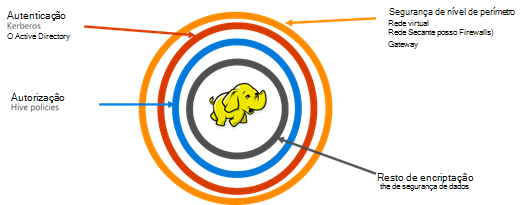

<properties
    pageTitle="Seguro descrição geral de HDInsight | Microsoft Azure"
    description="Saiba mais..."
    services="hdinsight"
    documentationCenter=""
    authors="saurinsh"
    manager="jhubbard"
    editor="cgronlun"
    tags="azure-portal"/>

<tags
    ms.service="hdinsight"
    ms.devlang="na"
    ms.topic="hero-article"
    ms.tgt_pltfrm="na"
    ms.workload="big-data"
    ms.date="10/24/2016"
    ms.author="saurinsh"/>

# Apresentar clusters HDInsight associado ao domínio (pré-visualização)

Azure HDInsight até hoje suportado apenas um único utilizador local administrador. Para mais pequenas equipas de aplicação ou departamentos trabalhou isto grandes. Como Hadoop baseado das cargas de trabalho adquiridas mais popularidade no sector da empresa, a necessidade de capacidades de classe de empresa como active directory baseado autenticação, suporte para vários utilizadores e o controlo de acesso baseado em funções ficou importância. Utilizar clusters HDInsight façam parte de um domínio, pode criar um cluster de HDInsight associado a um domínio do Active Directory, configurar uma lista de empregados a partir da empresa que pode autenticar através do Azure Active Directory para iniciar sessão no HDInsight cluster. Qualquer pessoa fora da empresa não pode iniciar sessão ou aceder ao cluster HDInsight. O administrador da empresa pode configurar o controlo de acesso baseado em funções para ramo de segurança utilizando [Apache Ranger](http://hortonworks.com/apache/ranger/), assim restringir o acesso a dados para apenas, tanto quanto necessário. Por fim, o administrador pode auditar o acesso a dados pelos empregados e eventuais alterações concluídas para políticas de controlo de acesso, permitindo assim um elevado grau de governação dos seus recursos da empresa.

[AZURE.NOTE]> Novas funcionalidades descritas nesta pré-visualização só estão disponíveis em clusters de baseado em Linux HDInsight para ramo de carga de trabalho. As outras cargas de trabalho, tais como HBase, motores, tempestade e Kafka, irão estar ativadas em versões futuras. 

## Benefícios

Segurança da empresa contém quatro montantes grandes – segurança de perímetro, autenticação, autorização e encriptação.

.

### Segurança de perímetro

Segurança de perímetro no HDInsight é obtida através de redes virtuais e serviço de Gateway. Hoje em dia, um administrador de empresa pode criar um cluster de HDInsight dentro de uma rede virtual e utilizar grupos de segurança de rede (regras de firewall de entrada ou saída) para restringir o acesso à rede virtual. Poderão apenas os endereços IP definidos em regras de entrada de firewall comunicar com o cluster HDInsight, fornecendo, por conseguinte, a segurança de perímetro. Outra camada de segurança de perímetro é obtida a utilizar o serviço de Gateway. O Gateway é o serviço que age como primeira linha de defesa para qualquer pedido a receber para HDInsight cluster. Aceita o pedido, valida-lo e apenas, em seguida, permite que o pedido passar para os outros nós num cluster, fornecer, por conseguinte, a segurança de perímetro para outros nós de nome e dados no cluster.

### Autenticação

Com este público pré-visualização, um administrador de empresa pode aprovisionar um cluster de HDInsight façam parte de um domínio, numa [rede virtual](https://azure.microsoft.com/services/virtual-network/). Os nós do HDInsight cluster serão ser associados ao domínio gerido da empresa. Isso é obtido através da utilização do [Azure Active Directory Domain Services](https://technet.microsoft.com/library/cc770946.aspx). Todos os nós no cluster são associados a um domínio que gere a empresa. Com este programa de configuração, os empregados da empresa podem iniciar sessão para os nós de cluster com as suas credenciais de domínio. Estes também podem utilizar as respetivas credenciais de domínio para autenticar com outros pontos finais aprovados como matiz, Ambari vistas, ODBC, JDBC, PowerShell e REST APIs para interagir com o cluster. O administrador tem controlo total sobre limitar o número de utilizadores interagir com o cluster através destes pontos finais.

### Autorização

Prática recomendada seguida a maior parte das empresas é que não cada empregado tem acesso a todos os recursos da empresa. Da mesma forma, neste lançamento, o administrador pode definir políticas de controlo de acesso baseado em funções para os recursos de cluster. Por exemplo, o administrador pode configurar [Apache Ranger](http://hortonworks.com/apache/ranger/) para definir políticas de controlo de acesso para ramo. Esta funcionalidade assegura que os funcionários será possível aceder à apenas como quantidade de dados que precisam de ser efetuada com êxito no seu emprego. Acesso ao cluster SSH também é restrito apenas para o administrador.

### Auditoria

Juntamente com os recursos de cluster HDInsight a proteger a partir de utilizadores não autorizados e proteger os dados, é necessário para controlar o acesso não autorizado ou não intencional dos recursos de auditoria de todo o acesso para os recursos de cluster e os dados. Com esta pré-visualização, o administrador pode ver e todo o acesso de um relatório para os recursos de cluster HDInsight e os dados. O administrador pode também ver e comunicar todas as alterações às políticas de controlo de acesso concluídas no pontos finais de Ranger Apache suportados. Um cluster de domínio HDInsight utiliza Apache Ranger IU familiares para procurar registos de auditoria. No back-end, Ranger utiliza [Apache Solr]( http://hortonworks.com/apache/solr/) para armazenar e procurar os registos.

### Encriptação

Proteger dados é importante para segurança organizacional da reunião e requisitos de conformidade e juntamente com restringir o acesso a dados de funcionários não autorizados,-deve também ser protegido ao encriptá-la. Ambos os arquivos de dados para clusters, Azure armazenamento Blob e armazenamento de Lake de dados do Windows Azure HDInsight suportam transparente lado do servidor [encriptação de dados](../storage/storage-service-encryption.md) em repouso. Seguro HDInsight clusters de forma totalmente integrada funcionam com este encriptação do lado do servidor de dados na capacidade de descanso.

## Próximos passos

- Para configurar um cluster de HDInsight façam parte de um domínio, consulte [configurar o domínio HDInsight clusters](hdinsight-domain-joined-configure.md).
- Para gerir clusters de domínio HDInsight, consulte o artigo [clusters associadas Manage Domain HDInsight](hdinsight-domain-joined-manage.md).
- Para configurar políticas de ramo e executar consultas de ramo, consulte o artigo [Configurar Hive políticas para clusters HDInsight façam parte de um domínio](hdinsight-domain-joined-run-hive.md).
- Para executar consultas de ramo utilizando SSH em clusters HDInsight façam parte de um domínio, consulte o artigo [Utilizar SSH com baseado em Linux Hadoop no HDInsight Linux, Unix, ou OS X](hdinsight-hadoop-linux-use-ssh-unix.md#connect-to-a-domain-joined-hdinsight-cluster).