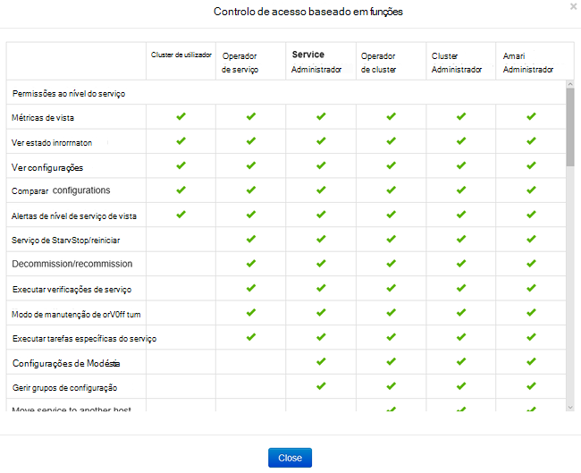
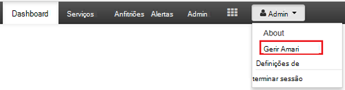
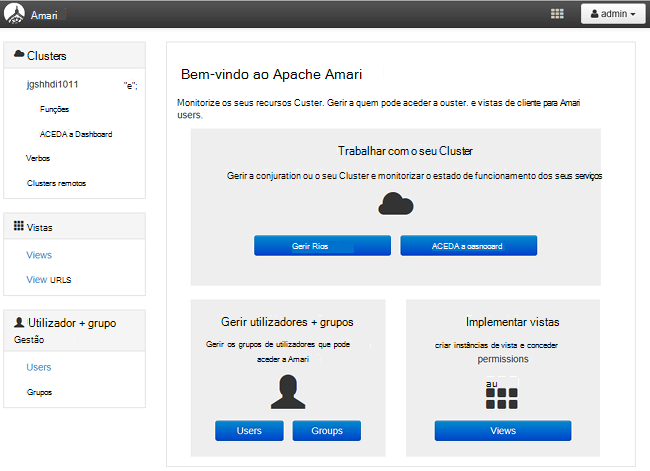
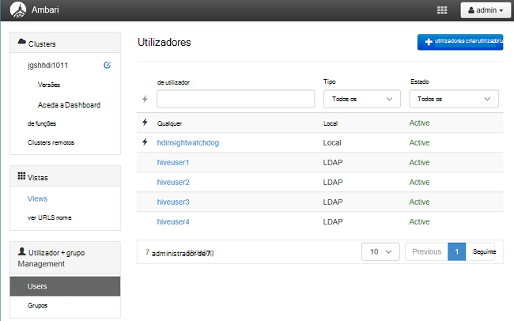
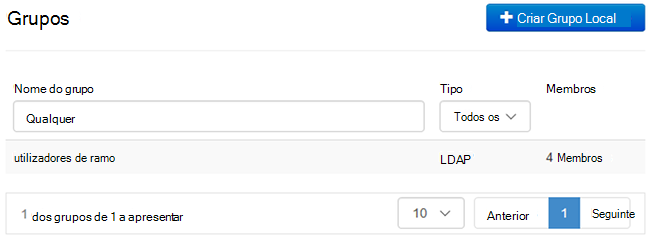
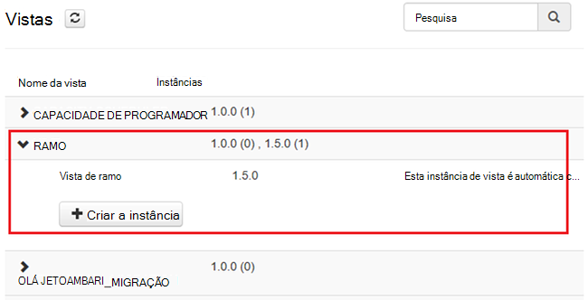
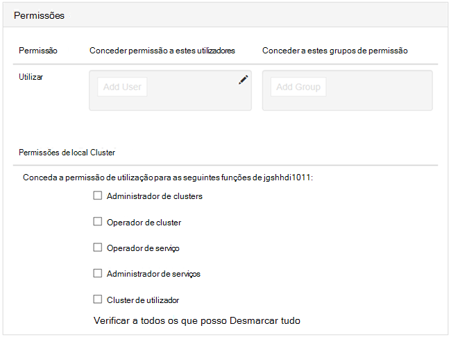

<properties
    pageTitle="Gerir clusters de domínio HDInsight | Microsoft Azure"
    description="Saiba como gerir clusters HDInsight façam parte de um domínio"
    services="hdinsight"
    documentationCenter=""
    authors="saurinsh"
    manager="jhubbard"
    editor="cgronlun"
    tags=""/>

<tags
    ms.service="hdinsight"
    ms.devlang="na"
    ms.topic="article"
    ms.tgt_pltfrm="na"
    ms.workload="big-data"
    ms.date="10/25/2016"
    ms.author="saurinsh"/>

# Gerir clusters HDInsight associado ao domínio (pré-visualização)

Obter informações sobre os utilizadores e funções no HDInsight façam parte de um domínio e sobre como gerir clusters de HDInsight façam parte de um domínio.

## Utilizadores de clusters HDInsight façam parte de um domínio

Um cluster de HDInsight que não é associado ao domínio tem duas contas de utilizador que são criadas durante a criação de cluster:

- **Administrador de Ambari**: esta conta também é conhecido como *Hadoop* ou *HTTP utilizador*. Esta conta pode ser utilizada para iniciar sessão no Ambari na https://&lt;nome de cluster >. azurehdinsight.net. Também pode ser utilizado para executar consultas em vistas Ambari, executar tarefas através de ferramentas externas (ou seja, PowerShell, Templeton, Visual Studio) e autenticar com as ferramentas de BI (ou seja, Excel, obter ou quadro) e um controlador Hive ODBC.

- **SSH utilizador**: esta conta pode ser utilizada com SSH e executar sudo comandos. Tiver privilégios de raiz para a VMs Linux.

Um cluster de HDInsight façam parte de um domínio tem três novos utilizadores para além do administrador de Ambari e SSH utilizador.

- **Administrador de Ranger**: esta conta é a conta de administrador Apache Ranger local. Não é um utilizador de domínio do active directory. Esta conta pode ser utilizada para configurar políticas e fazer outros administradores de utilizadores ou administradores delegados (para que os utilizadores podem gerir políticas de). Por predefinição, o nome de utilizador é *administrador* e a palavra-passe é igual a palavra-passe de administrador do Ambari. A palavra-passe pode ser atualizada a partir da página de definições no Ranger.

- **Utilizador de domínio de administrador de cluster**: esta conta é um utilizador de domínio do active directory designado como o administrador de cluster Hadoop, incluindo Ambari e Ranger. Tem de fornecer as credenciais deste utilizador durante a criação de cluster. Este utilizador tem os seguintes privilégios:

    - Participe em máquinas para o domínio e colocá-los dentro da OU que especificar durante a criação de cluster.
    - Crie principais de serviço dentro da OU que especificar durante a criação de cluster. 
    - Crie entradas de DNS inversa.

    Tenha em atenção que os outros utilizadores do AD também tem estes privilégios. 

    Existem alguns pontos finais dentro do cluster (por exemplo, Templeton) que não são geridos pelo Ranger e, consequentemente, não são seguras. Estes pontos finais estão bloqueados para baixo para todos os utilizadores, exceto o utilizador cluster do domínio de administrador. 

- **Normal**: durante a criação de cluster, pode fornecer vários grupos do active directory. Os utilizadores nestes grupos serão sincronizados para Ranger e Ambari. Estes utilizadores são os utilizadores do domínio e terão acesso às apenas gerido Ranger pontos finais (por exemplo, Hiveserver2). Todas as políticas RBAC e auditoria vai ser aplicáveis a estes utilizadores.

## Funções de clusters HDInsight façam parte de um domínio

Domínio HDInsight tem as seguintes funções:

- Administrador de clusters
- Operador de cluster
- Administrador de serviços
- Operador de serviço
- Cluster de utilizador

**Para ver as permissões destas funções**

1. Abra a gestão de Ambari IU.  Consulte o artigo [Abrir a gestão de Ambari IU](#open-the-ambari-management-ui).
2. No menu à esquerda, clique em **funções**.
3. Clique no ponto de interrogação azul para ver as permissões:

    

## Abra a gestão de Ambari IU

1. Inicie sessão no [portal do Azure](https://portal.azure.com).
2. Abra o seu cluster HDInsight numa pá. Consulte [clusters de lista e a apresentação](hdinsight-administer-use-management-portal.md#list-and-show-clusters).
3. Clique em **Dashboard** a partir do menu superior para abrir Ambari.
4. Inicie sessão no Ambari utilizando o cluster administrador domínio nome de utilizador e palavra-passe.
5. Clique no menu pendente de **administrador** a partir do canto superior direito e, em seguida, clique em **Gerir Ambari**.

    

    IU de aspeto:

    

## Listar os utilizadores do domínio sincronizados a partir do Active Directory

1. Abra a gestão de Ambari IU.  Consulte o artigo [Abrir a gestão de Ambari IU](#open-the-ambari-management-ui).
2. No menu à esquerda, clique em **utilizadores**. Deverá ver todos os utilizadores sincronizados a partir do Active Directory para HDInsight cluster.

    

## Listar os grupos de domínio sincronizados a partir do Active Directory

1. Abra a gestão de Ambari IU.  Consulte o artigo [Abrir a gestão de Ambari IU](#open-the-ambari-management-ui).
2. No menu à esquerda, clique em **grupos**. Deverá ver todos os grupos sincronizados a partir do Active Directory para HDInsight cluster.

    

## Configurar permissões Hive vistas

1. Abra a gestão de Ambari IU.  Consulte o artigo [Abrir a gestão de Ambari IU](#open-the-ambari-management-ui).
2. No menu à esquerda, clique em **vistas**.
3. Clique em **HIVE** para mostrar os detalhes.

    

4. Clique na ligação **Ver Hive** para configurar vistas Hive.
5. Desloque para baixo para a secção **permissões** .

    

6. Clique em **Adicionar utilizador** ou **Grupo adicionar**e, em seguida, especifique os utilizadores ou grupos que podem utilizar as vistas do ramo de registo. 

## Configurar utilizadores para as funções

 Para ver uma lista de funções e as respetivas permissões, consulte [funções de domínio HDInsight clusters](#roles-of-domain---joined-hdinsight-clusters).

1. Abra a gestão de Ambari IU.  Consulte o artigo [Abrir a gestão de Ambari IU](#open-the-ambari-management-ui).
2. No menu à esquerda, clique em **funções**.
3. Clique em **Adicionar utilizador** ou **Grupo de adicionar** para atribuir utilizadores e grupos para diferentes funções.
 
## Próximos passos

- Para configurar um cluster de HDInsight façam parte de um domínio, consulte [configurar o domínio HDInsight clusters](hdinsight-domain-joined-configure.md).
- Para configurar políticas de ramo e executar consultas de ramo, consulte o artigo [Configurar Hive políticas para clusters HDInsight façam parte de um domínio](hdinsight-domain-joined-run-hive.md).
- Para executar consultas de ramo utilizando SSH em clusters HDInsight façam parte de um domínio, consulte o artigo [Utilizar SSH com baseado em Linux Hadoop no HDInsight Linux, Unix, ou OS X](hdinsight-hadoop-linux-use-ssh-unix.md#connect-to-a-domain-joined-hdinsight-cluster).
