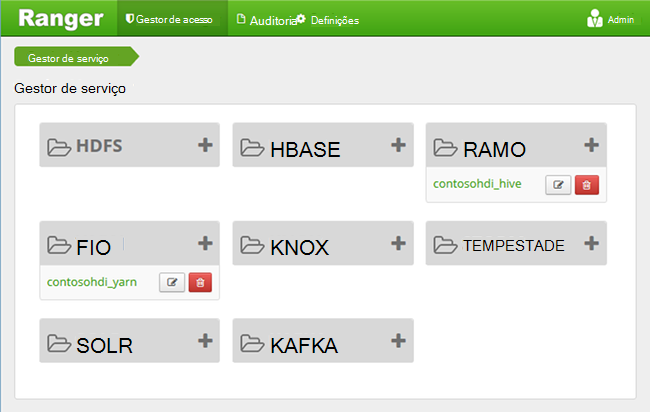
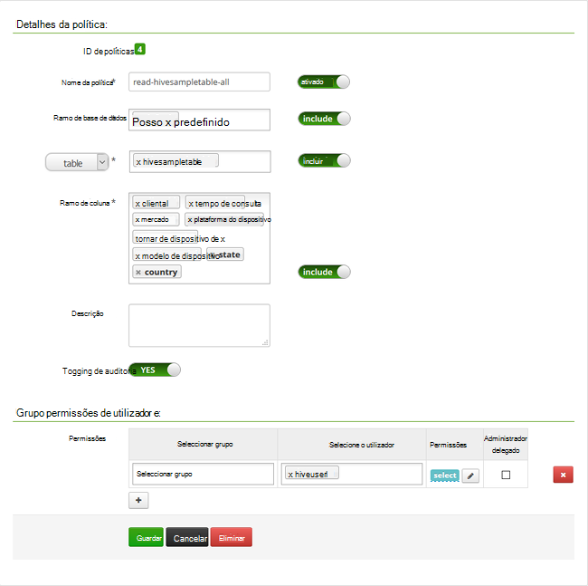

<properties
    pageTitle="Configurar políticas de ramo de no domínio HDInsight | Microsoft Azure"
    description="Saiba mais..."
    services="hdinsight"
    documentationCenter=""
    authors="saurinsh"
    manager="jhubbard"
    editor="cgronlun"
    tags="azure-portal"/>

<tags
    ms.service="hdinsight"
    ms.devlang="na"
    ms.topic="hero-article"
    ms.tgt_pltfrm="na"
    ms.workload="big-data"
    ms.date="10/25/2016"
    ms.author="saurinsh"/>

# Configurar políticas de ramo de no domínio HDInsight (pré-visualização)

Saiba como configurar políticas de Apache Ranger para ramo. Neste artigo, criar duas Ranger políticas para restringir o acesso ao hivesampletable. O hivesampletable vem com HDInsight clusters. Depois de ter configurado as políticas, que utilizar controlador do Excel e ODBC para ligar a tabelas do ramo do HDInsight.

## Pré-requisitos

- Um cluster de domínio HDInsight. Consulte [configurar o domínio HDInsight clusters](hdinsight-domain-joined-configure.md).
- Uma estação de trabalho com o Office 2016, Office 2013 Professional Plus, Office 365 Pro Plus, Excel 2013 autónomo ou Office 2010 Professional Plus.

## Ligar a Apache Ranger administração IU

**Para ligar à Ranger administração IU**

1. A partir de um browser, ligue-se ao Ranger administração IU. O URL é https://&lt;nome de cluster >.azurehdinsight.net/Ranger/. 

    >[AZURE.NOTE] Ranger utiliza credenciais diferentes Hadoop cluster. Para impedir que browsers utilizando credenciais em cache de Hadoop, utilize a nova janela do inprivate browser para ligar à IU do administrador de Ranger.
4. Inicie sessão com a cluster administrador domínio nome de utilizador e palavra-passe:

    

    Atualmente, Ranger só funciona com fios e ramo.

## Criar utilizadores do domínio

[Configurar o domínio HDInsight clusters](hdinsight-domain-joined-configure.md#create-and-configure-azure-ad-ds-for-your-azure-ad), criou hiveruser1 e hiveuser2. Irá utilizar a conta de duas utilizador neste tutorial.

## Criar políticas de Ranger

Nesta secção, irá criar duas Ranger políticas para aceder a hivesampletable. Dar permissão select no conjunto diferente de colunas. Ambos os utilizadores foram criados numa [clusters de configurar o domínio HDInsight](hdinsight-domain-joined-configure.md#create-and-configure-azure-ad-ds-for-your-azure-ad).  Na secção seguinte, pode testar as duas políticas no Excel.

**Para criar políticas de Ranger**

1. Abra Ranger IU de administrador. Consulte o artigo [ligar a Apache Ranger administração IU](#connect-to-apache-ranager-admin-ui).
2. Clique em ** &lt;nome de cluster > _hive**, em **Hive**. Deve ver duas pré-configurar políticas.
3. Clique em **Adicionar nova política**e, em seguida, introduza os seguinte valores:

    - Nome da política: tudo de hivesampletable de leitura
    - Ramo de base de dados: predefinido
    - tabela: hivesampletable
    - Ramo de coluna: *
    - Selecione o utilizador: hiveuser1
    - Permissões: selecione

    .

    >[AZURE.NOTE] Se um utilizador de domínio não está preenchido na selecione do utilizador, aguarde alguns minutos para que Ranger sincronizar com AAD.

4. Clique em **Adicionar** para guardar a política.
5. Repita os dois últimos passos para criar outra política com as seguintes propriedades:

    - Nome da política: leitura-hivesampletable-devicemake
    - Ramo de base de dados: predefinido
    - tabela: hivesampletable
    - Ramo de coluna: clientid, devicemake
    - Selecione o utilizador: hiveuser2
    - Permissões: selecione

## Criar a origem de dados Hive ODBC

Podem encontrar as instruções na [origem de dados ODBC de ramo de criar](hdinsight-connect-excel-hive-odbc-driver.md).  

    Propriedade|Descrição
    ---|---
    Nome da origem de dados|Dê um nome para a sua origem de dados
    Anfitrião|Introduza &lt;HDInsightClusterName >. azurehdinsight.net. Por exemplo, myHDICluster.azurehdinsight.net
    Porta|Utilize <strong>443</strong>. (Esta porta ter sido alterada a partir do 563 para 443.)
    Base de dados|Utilize a <strong>predefinição</strong>.
    Tipo de servidor de ramo|Selecione <strong>Hive servidor 2</strong>
    Mecanismo|Selecione o <strong>Serviço do Azure HDInsight</strong>
    Caminho de HTTP|Deixe em branco.
    Nome de utilizador|Introduza hiveuser1@contoso158.onmicrosoft.com. Se for diferente, atualize o nome de domínio.
    Palavra-passe|Introduza a palavra-passe para hiveuser1.
    </table>

Certifique-se clicar em **Testar** antes de guardar a origem de dados.

##Importar dados para o Excel do HDInsight

Na secção última, ter configurado duas políticas.  hiveuser1 tem a permissão select em todas as colunas e hiveuser2 tem a permissão select duas colunas. Nesta secção, representar os dois utilizadores para importar dados para o Excel.

1. Abra um livro novo ou existente no Excel.
2. No separador **dados** , clique em **De outras origens de dados**e, em seguida, clique em **a partir do Assistente de ligação de dados** para iniciar o **Assistente de ligação de dados**.

    ! [Assistente de ligação de dados aberta] [img-hdi simbahiveodbc.excel.dataconnection]

3. Selecione **ODBC DSN** como origem de dados e, em seguida, clique em **seguinte**.
4. A partir de origens de dados ODBC, selecione o nome da origem de dados que criou no passo anterior e, em seguida, clique em **seguinte**.
5. Volte a introduzir a palavra-passe para o cluster no Assistente de e, em seguida, clique em **OK**. Aguarde que a caixa de diálogo **Seleccionar base de dados e tabela** abrir. Isto pode demorar alguns segundos.
8. Selecione **hivesampletable**e, em seguida, clique em **seguinte**. 
8. Clique em **Concluir**.
9. Na caixa de diálogo **Importar dados** , pode alterar ou especificar a consulta. Para fazê-lo, clique em **Propriedades**. Isto pode demorar alguns segundos. 
10. Clique no separador **definição** . O comando texto é:

        SELECT * FROM "HIVE"."default"."hivesampletable"

    Por políticas de Ranger definiu, hiveuser1 tem permissão select todas as colunas.  Por isso, esta consulta funciona com credenciais do hiveuser1, mas esta consulta não não funciona com credenciais do hiveuser2.

    ! [Propriedades de ligação] [img-hdi-simbahiveodbc-excel-connectionproperties]

11. Clique em **OK** para fechar a caixa de diálogo Propriedades da ligação.
12. Clique em **OK** para fechar a caixa de diálogo **Importar dados** .  
13. Reintroduzir a palavra-passe para hiveuser1 e, em seguida, clique em **OK**. Bastam alguns segundos antes dos dados são importados para o Excel. Quando concluir, deve verá 11 colunas de dados.

Para testar a política segunda (leitura-hivesampletable-devicemake) que criou na última secção

1. Adicione uma nova folha no Excel.
2. Siga o procedimento último para importar os dados.  A única alteração que irá efetuar é utilizar credenciais do hiveuser2 em vez do hiveuser1. Isto irá falhar porque hiveuser2 apenas tem permissão para ver duas colunas. Deve obter o erro seguinte:

        [Microsoft][HiveODBC] (35) Error from Hive: error code: '40000' error message: 'Error while compiling statement: FAILED: HiveAccessControlException Permission denied: user [hiveuser2] does not have [SELECT] privilege on [default/hivesampletable/clientid,country ...]'.

3. Siga o mesmo procedimento para importar dados. Desta vez, utilizar credenciais do hiveuser2 e também modificar a instrução select a partir de:

        SELECT * FROM "HIVE"."default"."hivesampletable"

    a:

        SELECT clientid, devicemake FROM "HIVE"."default"."hivesampletable"

    Quando concluir, deve verá duas colunas de dados importados.

## Próximos passos

- Para configurar um cluster de HDInsight façam parte de um domínio, consulte [configurar o domínio HDInsight clusters](hdinsight-domain-joined-configure.md).
- Para gerir clusters de domínio HDInsight, consulte o artigo [clusters associadas Manage Domain HDInsight](hdinsight-domain-joined-manage.md).
- Para executar consultas de ramo utilizando SSH em clusters HDInsight façam parte de um domínio, consulte o artigo [Utilizar SSH com baseado em Linux Hadoop no HDInsight Linux, Unix, ou OS X](hdinsight-hadoop-linux-use-ssh-unix.md#connect-to-a-domain-joined-hdinsight-cluster).
- Para estabelecer ligação ramo utilizando Hive JDBC, consulte o artigo [ligar ao ramo no Azure HDInsight a utilizar o controlador de Hive JDBC](hdinsight-connect-hive-jdbc-driver.md)
- Para estabelecer ligação Excel ao Hadoop utilizando Hive ODBC, consulte o artigo [Ligar o Excel ao Hadoop com a unidade de Microsoft Hive ODBC](hdinsight-connect-excel-hive-odbc-driver.md)
- Para estabelecer ligação Excel ao Hadoop através do Power Query, consulte o artigo [Ligar o Excel ao Hadoop utilizando o Power Query](hdinsight-connect-excel-power-query.md)