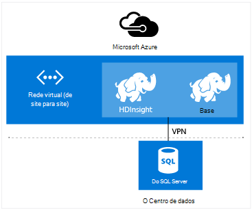

<properties
    pageTitle="Expandir HDInsight com a rede Virtual | Microsoft Azure"  
    description="Saiba como utilizar a rede Virtual Azure para ligar HDInsight a outros recursos de nuvem, recursos ou no seu centro de dados"
    services="hdinsight"
    documentationCenter=""
    authors="Blackmist"
    manager="jhubbard"
    editor="cgronlun"/>

<tags
   ms.service="hdinsight"
   ms.devlang="na"
   ms.topic="article"
   ms.tgt_pltfrm="na"
   ms.workload="big-data"
   ms.date="10/21/2016"
   ms.author="larryfr"/>


#<a name="extend-hdinsight-capabilities-by-using-azure-virtual-network"></a>Expandir HDInsight capacidades ao utilizar a rede Virtual do Azure

Azure rede Virtual permite-lhe expandir as soluções do Hadoop para incorporar recursos no local, como SQL Server, combinar múltiplos tipos de cluster HDInsight ou criar redes privadas seguros entre recursos na nuvem.

[AZURE.INCLUDE [upgrade-powershell](../../includes/hdinsight-use-latest-powershell-and-cli.md)]


##<a id="whatis"></a>O que é o Azure Virtual rede?

[Rede Virtual Azure](https://azure.microsoft.com/documentation/services/virtual-network/) permite-lhe criar uma rede segura, persistente que contém os recursos que necessita para a sua solução. Uma rede virtual permite-lhe:

* Ligue-se na nuvem recursos em conjunto numa rede privada (só de nuvem).

    

    Utilizar a rede Virtual para ligar Azure serviços com o Azure HDInsight permite os cenários seguintes:

    * **Serviços de invocar HDInsight ou tarefas** a partir do Azure Web sites ou serviços em execução em máquinas virtuais do Azure.

    * **Transferir os dados diretamente** entre HDInsight e base de dados do SQL Azure, SQL Server ou outra solução de armazenamento de dados em execução numa máquina virtual.

    * **Combinar múltiplos HDInsight servidores** numa única solução. HDInsight clusters está disponível uma variedade de tipos de, que correspondem à carga de trabalho ou tecnologia cluster está optimizado para. Não existe nenhum método suportado para criar um cluster que combina vários tipos de, tais como tempestade e HBase num cluster de um. Utilizar uma rede virtual permite que múltiplos clusters diretamente comunicar com os outros.

* Ligue os recursos da nuvem à sua rede do Centro de dados locais (site para o site ou site de ponto) utilizando uma rede privada virtual (VPN).

    Configuração do site para o site permite-lhe ligar vários recursos a partir do seu centro de dados à rede virtual Azure utilizando um hardware VPN ou o serviço de encaminhamento e acesso remoto.

    

    Configuração do ponto-para-site permite-lhe ligar um recurso específico à rede virtual Azure utilizando o software VPN.

    

    Utilização de rede Virtual para criar uma ligação na nuvem e o seu centro de dados permite cenários semelhantes à configuração apenas na nuvem. Mas em vez de estar limitado a trabalhar com recursos na nuvem, também pode trabalhar com recursos no seu centro de dados.

    * **Transferir os dados diretamente** entre HDInsight e o seu centro de dados. Um exemplo está a utilizar Sqoop para transferir dados de ou do SQL Server ou ao ler dados gerados por uma aplicação da linha de negócio (LOB).

    * **Serviços de invocar HDInsight ou tarefas** a partir de uma aplicação do LOB. Um exemplo está a utilizar HBase Java APIs para armazenar e obter dados a partir de um cluster de HDInsight HBase.

Para mais informações sobre as funcionalidades, benefícios e capacidades de rede Virtual, consulte o artigo [Descrição geral de rede Virtual Azure](../virtual-network/virtual-networks-overview.md).

> [AZURE.NOTE] Tem de criar a rede Virtual Azure antes de aprovisionar um cluster de HDInsight. Para mais informações, consulte o artigo [tarefas de configuração de rede Virtual](https://azure.microsoft.com/documentation/services/virtual-network/).

## <a name="virtual-network-requirements"></a>Requisitos de rede virtuais

> [AZURE.IMPORTANT] A criação de um cluster de HDInsight numa rede Virtual requer configurações de rede Virtual específicas, são descritas nesta secção.

###<a name="location-based-virtual-networks"></a>Baseado na localização redes virtuais

Azure HDInsight suporta apenas baseadas na localização virtuais redes e atualmente não funciona com redes virtuais com base num grupo de afinidade.

###<a name="classic-or-v2-virtual-network"></a>Rede Virtual Classic ou v2

Clusters baseados no Windows requerem uma rede Virtual clássico, enquanto clusters baseados em Linux requerem uma rede Virtual do Azure Gestor de recursos. Se não tiver o tipo de rede correto, não será utilizável quando criar o cluster.

Se tiver recursos numa rede Virtual que não é utilizado pelo cluster que planeia sobre como criar, pode criar uma nova rede Virtual que pode ser utilizada pelo cluster e ligá-lo à rede Virtual incompatíveis estão incluídos. Em seguida, pode criar cluster na versão de rede, é necessário, e -poderão para aceder aos recursos na outra rede uma vez que as duas são associadas. Para mais informações sobre como ligar clássico e novo redes virtuais, consulte o artigo [VNets clássico de para ligar para o novo VNets](../vpn-gateway/vpn-gateway-connect-different-deployment-models-portal.md).

###<a name="custom-dns"></a>Personalizar DNS

Ao criar uma rede virtual, Azure fornece resolução do nome predefinido para Azure serviços como o HDInsight que são instalados na rede. No entanto, poderá ter utilizar o seu próprio sistema de nomes de domínio (DNS) para situações tal como cruzada resolução do nome de domínio de rede. Por exemplo, quando comunicar entre serviços localizados em dois associadas redes virtuais. HDInsight suporta tanto a resolução do nome Azure predefinida, bem como DNS personalizados quando utilizado com rede Virtual Azure.

Para obter mais informações sobre como utilizar o seu servidor de DNS com a rede Virtual Azure, consulte a secção de __resolução de nomes utilizando o seu servidor de DNS__ do documento de [Resolução de nomes para VMs e instâncias de função](../virtual-network/virtual-networks-name-resolution-for-vms-and-role-instances.md#name-resolution-using-your-own-dns-server) .

###<a name="secured-virtual-networks"></a>Redes Virtual seguras

O serviço de HDInsight é um serviço gerido e requer o acesso à Internet durante o aprovisionamento e durante a execução. Esta será por esse Azure pode monitorizar o estado de funcionamento do cluster, iniciar activação pós-falha de recursos de cluster, altere o número de nós nos cluster através de operações de dimensionamento e outras tarefas de gestão.

Se precisar de instalar HDInsight para uma rede Virtual seguro, têm de permitir acesso de entrada ao longo de porta 443 para os seguintes endereços IP, que permitem Azure gerir o cluster HDInsight.

* 168.61.49.99
* 23.99.5.239
* 168.61.48.131
* 138.91.141.162

Permissão do acesso entrado da porta 443 para estes endereços permite-lhe instalar com êxito HDInsight para uma rede virtual segura.

> [AZURE.IMPORTANT] HDInsight não suporta restringir o tráfego de saída, apenas o tráfego de entrada. Quando definir regras de grupo de segurança de rede para a sub-rede que contém HDInsight, utilize apenas as regras de entrada.

Os exemplos seguintes demonstram como criar um novo grupo de segurança de rede que permite que os endereços necessários e aplica-se o grupo de segurança para uma sub-rede na rede da sua Virtual. Estes passos partem do pressuposto de que já tiver criado uma rede Virtual e sub-rede que pretende instalar o HDInsight para.

__Utilizar o Azure PowerShell__

    $vnetName = "Replace with your virtual network name"
    $resourceGroupName = "Replace with the resource group the virtual network is in"
    $subnetName = "Replace with the name of the subnet that HDInsight will be installed into"
    # Get the Virtual Network object
    $vnet = Get-AzureRmVirtualNetwork `
        -Name $vnetName `
        -ResourceGroupName $resourceGroupName
    # Get the region the Virtual network is in.
    $location = $vnet.Location
    # Get the subnet object
    $subnet = $vnet.Subnets | Where-Object Name -eq $subnetName
    # Create a new Network Security Group.
    # And add exemptions for the HDInsight health and management services.
    $nsg = New-AzureRmNetworkSecurityGroup `
        -Name "hdisecure" `
        -ResourceGroupName $resourceGroupName `
        -Location $location `
        | Add-AzureRmNetworkSecurityRuleConfig `
            -name "hdirule1" `
            -Description "HDI health and management address 168.61.49.99" `
            -Protocol "*" `
            -SourcePortRange "*" `
            -DestinationPortRange "443" `
            -SourceAddressPrefix "168.61.49.99" `
            -DestinationAddressPrefix "VirtualNetwork" `
            -Access Allow `
            -Priority 300 `
            -Direction Inbound `
        | Add-AzureRmNetworkSecurityRuleConfig `
            -Name "hdirule2" `
            -Description "HDI health and management 23.99.5.239" `
            -Protocol "*" `
            -SourcePortRange "*" `
            -DestinationPortRange "443" `
            -SourceAddressPrefix "23.99.5.239" `
            -DestinationAddressPrefix "VirtualNetwork" `
            -Access Allow `
            -Priority 301 `
            -Direction Inbound `
        | Add-AzureRmNetworkSecurityRuleConfig `
            -Name "hdirule3" `
            -Description "HDI health and management 168.61.48.131" `
            -Protocol "*" `
            -SourcePortRange "*" `
            -DestinationPortRange "443" `
            -SourceAddressPrefix "168.61.48.131" `
            -DestinationAddressPrefix "VirtualNetwork" `
            -Access Allow `
            -Priority 302 `
            -Direction Inbound `
        | Add-AzureRmNetworkSecurityRuleConfig `
            -Name "hdirule4" `
            -Description "HDI health and management 138.91.141.162" `
            -Protocol "*" `
            -SourcePortRange "*" `
            -DestinationPortRange "443" `
            -SourceAddressPrefix "138.91.141.162" `
            -DestinationAddressPrefix "VirtualNetwork" `
            -Access Allow `
            -Priority 303 `
            -Direction Inbound
    # Set the changes to the security group
    Set-AzureRmNetworkSecurityGroup -NetworkSecurityGroup $nsg
    # Apply the NSG to the subnet
    Set-AzureRmVirtualNetworkSubnetConfig `
        -VirtualNetwork $vnet `
        -Name $subnetName `
        -AddressPrefix $subnet.AddressPrefix `
        -NetworkSecurityGroupId $nsg

__Utilizar o clip Azure__

1. Utilize o seguinte comando para criar um novo grupo de segurança de rede com o nome `hdisecure`. Substitua o grupo de recursos que contém a rede Virtual do Azure e a localização (região), que foi criado o grupo __RESOURCEGROUPNAME__ e a __localização__ .

        azure network nsg create RESOURCEGROUPNAME hdisecure LOCATION
    
    Assim que o grupo for criado, receberá informações sobre o novo grupo. Procure uma linha semelhante ao seguinte e guarde a `/subscriptions/GUID/resourceGroups/RESOURCEGROUPNAME/providers/Microsoft.Network/networkSecurityGroups/hdisecure` informações. Será utilizada num passo posterior.
    
        data:    Id                              : /subscriptions/GUID/resourceGroups/RESOURCEGROUPNAME/providers/Microsoft.Network/networkSecurityGroups/hdisecure

2. Utilize o seguinte para adicionar regras para o novo grupo de segurança de rede que permitir a comunicação de entrada na porta 443 do serviço de gestão e de estado de funcionamento do Azure HDInsight. Substitua o nome do grupo de recursos que contém a rede Virtual Azure __RESOURCEGROUPNAME__ .

        azure network nsg rule create RESOURCEGROUPNAME hdisecure hdirule1 -p "*" -o "*" -u "443" -f "168.61.49.99" -e "VirtualNetwork" -c "Allow" -y 300 -r "Inbound"
        azure network nsg rule create RESOURCEGROUPNAME hdisecure hdirule2 -p "*" -o "*" -u "443" -f "23.99.5.239" -e "VirtualNetwork" -c "Allow" -y 301 -r "Inbound"
        azure network nsg rule create RESOURCEGROUPNAME hdisecure hdirule3 -p "*" -o "*" -u "443" -f "168.61.48.131" -e "VirtualNetwork" -c "Allow" -y 302 -r "Inbound"
        azure network nsg rule create RESOURCEGROUPNAME hdisecure hdirule4 -p "*" -o "*" -u "443" -f "138.91.141.162" -e "VirtualNetwork" -c "Allow" -y 303 -r "Inbound"

3. Quando as regras tenham sido criadas, utilize o seguinte procedimento para aplicar o novo grupo de segurança de rede para uma sub-rede. Substitua o nome do grupo de recursos que contém a rede Virtual Azure __RESOURCEGROUPNAME__ . Substitua __VNETNAME__ e __SUBNETNAME__ com o nome da rede Virtual Azure e de sub-rede que irá utilizar ao instalar o HDInsight.

        azure network vnet subnet set RESOURCEGROUPNAME VNETNAME SUBNETNAME -w "/subscriptions/GUID/resourceGroups/RESOURCEGROUPNAME/providers/Microsoft.Network/networkSecurityGroups/hdisecure"
    
    Assim que este comando for concluída, pode instalar com êxito HDInsight sessão na rede Virtual segura na sub-rede utilizada nestes passos.

> [AZURE.IMPORTANT] Utilizar o acima passos apenas abrir acesso ao HDInsight gestão e de estado de funcionamento do serviço na nuvem Azure. Esta opção permite-lhe instalar com êxito um cluster de HDInsight para sub-rede, no entanto, o acesso ao cluster HDInsight a partir de fora da rede Virtual está bloqueado por predefinição. Terá de adicionar regras de grupo de segurança de rede adicionais se pretender ativar o acesso a partir de fora da rede Virtual.
>
> Por exemplo, para permitir o acesso SSH da internet, terá adicionar uma regra semelhante ao seguinte: 
>
> * Azure PowerShell-```Add-AzureRmNetworkSecurityRuleConfig -Name "SSSH" -Description "SSH" -Protocol "*" -SourcePortRange "*" -DestinationPortRange "22" -SourceAddressPrefix "*" -DestinationAddressPrefix "VirtualNetwork" -Access Allow -Priority 304 -Direction Inbound```
> * Clip Azure-```azure network nsg rule create RESOURCEGROUPNAME hdisecure hdirule4 -p "*" -o "*" -u "22" -f "*" -e "VirtualNetwork" -c "Allow" -y 304 -r "Inbound"```

Para mais informações sobre os grupos de segurança de rede, consulte o artigo [Descrição geral de grupos de segurança de rede](../virtual-network/virtual-networks-nsg.md). Para obter informações sobre como controlar o encaminhamento numa rede Virtual Azure, consulte o artigo [rotas de definidos pelo utilizador e IP reencaminhamento de chamadas](../virtual-network/virtual-networks-udr-overview.md).

##<a id="tasks"></a>Tarefas e informações

Esta secção contém informações sobre tarefas comuns e informações que poderá ter ao utilizar o HDInsight com uma rede virtual.

###<a name="determine-the-fqdn"></a>Determinar o FQDN

HDInsight cluster será atribuído um nome de domínio completamente qualificado (FQDN) específico para a interface de rede Virtual. Este é o endereço que deve utilizar quando se liga ao cluster a partir de outros recursos da rede virtual. Para determinar o FQDN, utilize o seguinte procedimento para o URL para o serviço de gestão de Ambari de consulta:

    https://<clustername>.azurehdinsight.net/ambari/api/v1/clusters/<clustername>.azurehdinsight.net/services/<servicename>/components/<componentname>

> [AZURE.NOTE] Para mais informações sobre como utilizar Ambari com HDInsight, consulte o artigo [clusters de Monitor Hadoop HDInsight utilizar a API Ambari](hdinsight-monitor-use-ambari-api.md).

Tem de especificar o nome do cluster e um serviço e um componente em execução num cluster, tal como o Gestor de recursos FIO.

> [AZURE.NOTE] Os dados devolvidos são um documento de JavaScript objeto notação (JSON) que contém muitas informações sobre o componente. Para extrair apenas o FQDN, deve utilizar um analisador JSON para obter o `host_components[0].HostRoles.host_name` valor.

Por exemplo, para devolver o FQDN a partir de um cluster de HDInsight Hadoop, pode utilizar um dos seguintes métodos para obter os dados para o Gestor de recursos FIO:

* [Azure PowerShell](../powershell-install-configure.md)

        $ClusterDnsName = <clustername>
        $Username = <cluster admin username>
        $Password = <cluster admin password>
        $DnsSuffix = ".azurehdinsight.net"
        $ClusterFQDN = $ClusterDnsName + $DnsSuffix

        $webclient = new-object System.Net.WebClient
        $webclient.Credentials = new-object System.Net.NetworkCredential($Username, $Password)

        $Url = "https://" + $ClusterFQDN + "/ambari/api/v1/clusters/" + $ClusterFQDN + "/services/yarn/     components/resourcemanager"
        $Response = $webclient.DownloadString($Url)
        $JsonObject = $Response | ConvertFrom-Json
        $FQDN = $JsonObject.host_components[0].HostRoles.host_name
        Write-host $FQDN

* [cURL](http://curl.haxx.se/) e [jq](http://stedolan.github.io/jq/)

        curl -G -u <username>:<password> https://<clustername>.azurehdinsight.net/ambari/api/v1/clusters/<clustername>.azurehdinsight.net/services/yarn/components/resourcemanager | jq .host_components[0].HostRoles.host_name

###<a name="connecting-to-hbase"></a>Ligar-se ao HBase

Para ligar a HBase remotamente ao utilizar a API Java, tem de determinar os endereços de quórum ZooKeeper para o cluster HBase e especificá-lo na sua aplicação.

Para obter o ZooKeeper endereço quórum, utilize um dos seguintes métodos para consultar o serviço de gestão de Ambari:

* [Azure PowerShell](../powershell-install-configure.md)

        $ClusterDnsName = <clustername>
        $Username = <cluster admin username>
        $Password = <cluster admin password>
        $DnsSuffix = ".azurehdinsight.net"
        $ClusterFQDN = $ClusterDnsName + $DnsSuffix

        $webclient = new-object System.Net.WebClient
        $webclient.Credentials = new-object System.Net.NetworkCredential($Username, $Password)

        $Url = "https://" + $ClusterFQDN + "/ambari/api/v1/clusters/" + $ClusterFQDN + "/configurations?type=hbase-site&tag=default&fields=items/properties/hbase.zookeeper.quorum"
        $Response = $webclient.DownloadString($Url)
        $JsonObject = $Response | ConvertFrom-Json
        Write-host $JsonObject.items[0].properties.'hbase.zookeeper.quorum'

* [cURL](http://curl.haxx.se/) e [jq](http://stedolan.github.io/jq/)

        curl -G -u <username>:<password> "https://<clustername>.azurehdinsight.net/ambari/api/v1/clusters/<clustername>.azurehdinsight.net/configurations?type=hbase-site&tag=default&fields=items/properties/hbase.zookeeper.quorum" | jq .items[0].properties[]

> [AZURE.NOTE] Para mais informações sobre como utilizar Ambari com HDInsight, consulte o artigo [clusters de Monitor Hadoop HDInsight utilizar a API Ambari](hdinsight-monitor-use-ambari-api.md).

Assim que tiver as informações de quórum, utilizá-lo na sua aplicação de cliente.

Por exemplo, para uma aplicação de Java que utiliza a API do HBase, teria adicionar um ficheiro de **hbase site.xml** ao projeto e especificar as informações de quórum no ficheiro da seguinte forma:

```
<configuration>
  <property>
    <name>hbase.cluster.distributed</name>
    <value>true</value>
  </property>
  <property>
    <name>hbase.zookeeper.quorum</name>
    <value>zookeeper0.address,zookeeper1.address,zookeeper2.address</value>
  </property>
  <property>
    <name>hbase.zookeeper.property.clientPort</name>
    <value>2181</value>
  </property>
</configuration>
```

###<a name="verify-network-connectivity"></a>Verificar a conectividade de rede

Alguns serviços, como SQL Server, podem limitar as ligações de rede. Isto irá impedir HDInsight de trabalhar com êxito com estes serviços.

Se encontrar problemas ao aceder a um serviço do HDInsight, consulte a documentação do serviço para se certificar de que com permissão para aceder à rede. Também pode verificar o acesso de rede através da criação de uma máquina virtual Azure na mesma rede virtual e utilizar utilitários de cliente para confirmar que a máquina virtual pode ligar-se ao serviço através da rede virtual.

##<a id="nextsteps"></a>Próximos passos

Os exemplos seguintes demonstram como utilizar HDInsight com rede Virtual Azure:

* [Analisar dados de sensor com tempestade e HBase no HDInsight](hdinsight-storm-sensor-data-analysis.md) - demonstra como configurar um cluster tempestade e HBase na rede virtual, bem como para remotamente escrever dados HBase a partir do tempestade.

* [Aprovisionar Hadoop clusters no HDInsight](hdinsight-hadoop-provision-linux-clusters.md) - fornece informações sobre aprovisionamento clusters de Hadoop, incluindo informações sobre como utilizar a rede Virtual Azure.

* [Utilizar Sqoop com Hadoop no HDInsight](hdinsight-use-sqoop-mac-linux.md) - fornece informações sobre como utilizar Sqoop para transferir dados com o SQL Server através de uma rede virtual.

Para saber mais sobre as redes virtuais Azure, consulte o artigo [Descrição geral de rede Virtual Azure](../virtual-network/virtual-networks-overview.md).
