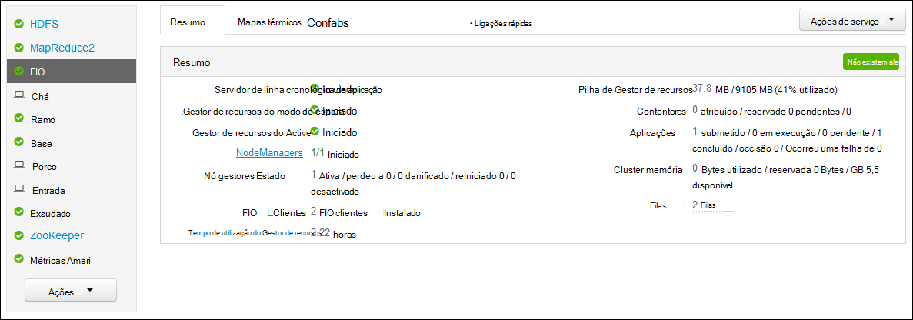
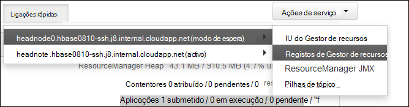

<properties
    pageTitle="Aplicação do Access Hadoop FIO inicia sessão baseado em Linux HDInsight | Microsoft Azure"
    description="Saiba como aceder a registos da aplicação FIO num cluster baseado em Linux HDInsight (Hadoop) utilizando a linha de comandos e num browser."
    services="hdinsight"
    documentationCenter=""
    tags="azure-portal"
    authors="Blackmist" 
    manager="jhubbard"
    editor="cgronlun"/>

<tags
    ms.service="hdinsight"
    ms.workload="big-data"
    ms.tgt_pltfrm="na"
    ms.devlang="na"
    ms.topic="article"
    ms.date="10/21/2016"
    ms.author="larryfr"/>

# Aplicação do Access FIO inicia sessão baseado em Linux HDInsight 

Este documento explica como pode aceder aos registos para as aplicações de FIO (ainda outro recurso Negotiator) que tem terminado num cluster Hadoop no Azure HDInsight.

> [AZURE.NOTE] As informações neste documento são específicas a clusters baseado em Linux HDInsight. Para informações sobre clusters baseados no Windows, consulte o artigo [aplicação do Access FIO inicia sessão HDInsight baseados no Windows](hdinsight-hadoop-access-yarn-app-logs.md)

## Pré-requisitos

* Um cluster de baseado em Linux HDInsight.

* Tem de [criar um túnel SSH](hdinsight-linux-ambari-ssh-tunnel.md) antes de poder aceder web ResourceManager registos IU.

## Servidor de linha cronológica FIO

O [Servidor de linha cronológica FIO](http://hadoop.apache.org/docs/r2.4.0/hadoop-yarn/hadoop-yarn-site/TimelineServer.html) fornece informações genéricas aplicações concluídas, bem como informações de aplicação específica framework através de dois interfaces diferentes. Especificamente:

* Armazenamento e a obtenção de aplicação genérica obter informações sobre HDInsight clusters foi ativado com a versão 3.1.1.374 ou superior.
* O componente de informações da aplicação framework específica da linha cronológica do servidor não está atualmente disponível em HDInsight clusters.

Informações gerais sobre aplicações incluem os seguintes tipos de dados:

* O ID da aplicação, um identificador exclusivo de uma aplicação
* O utilizador que iniciou a aplicação
* Obter informações sobre como tentativas efetuadas para concluir a aplicação
* Os contentores utilizados por qualquer tentativa de aplicação determinado

## Registos e FIO aplicações

FIO suporta vários modelos de programação (MapReduce a ser uma delas) por desacoplamento gestão de recursos a partir do agendamento/monitorização de aplicações. Isto é feito através de um global *ResourceManager* (RM), por-trabalhador-nó *NodeManagers* (NMs) e por aplicação *ApplicationMasters* (MGA). O AM por aplicação negocia recursos (CPU, memória, disco, rede) para executar a aplicação com o RM. O RM funciona com o NMs para conceder estes recursos, o que são concedidos como *contentores*. O AM é responsável para controlar o progresso de contentores atribuído à mesma pela RM. Uma aplicação poderá necessitar de muitos contentores dependendo da natureza da aplicação.

Além disso, cada aplicação pode consistir várias *tentativas de aplicação* para poder concluir em presença causa uma falha ou devido a perda de comunicação entre AM e um RM. Por conseguinte, contentores são concedidas a uma tentativa de específica de uma aplicação. Em sentido, um contentor fornece o contexto da unidade básica do trabalho executado por uma aplicação de FIO e todo o trabalho que é concluído dentro do contexto de um contentor é executado no nó trabalho único no qual tenha sido atribuído o contentor. Consulte [FIO conceitos] [ YARN-concepts] para referência ainda mais.

Registos de aplicação (e os registos de contentor associado) são críticos no depurar problemáticas Hadoop aplicações. FIO fornece uma boa estrutura para recolher, Agregar e armazenar registos da aplicação com o [Registo de agregação] [ log-aggregation] funcionalidade. A funcionalidade de registo agregação torna aceder a registos da aplicação mais determinista, tal como agrega registos através de todos os contentores num nó de trabalho e armazena-los como um agregado ficheiro de registo por nó de trabalho no sistema de ficheiros predefinido após a conclusão de uma aplicação. A aplicação poderá utilizar centenas ou milhares de contentores, mas os registos de todos os membros em contentores executar num nó trabalho único irão agregados sempre para um único ficheiro, que resulta num ficheiro de registo por nó trabalhador utilizado pela sua aplicação. Agregação de registo está ativada por predefinição nos HDInsight clusters (versão 3.0 e acima), e podem ser encontrados registos agregados no contentor predefinido do seu cluster na seguinte localização:

    wasbs:///app-logs/<user>/logs/<applicationId>

Nessa localização, o *utilizador* é o nome do utilizador que iniciou a aplicação e *applicationId* é o identificador exclusivo de uma aplicação como atribuído pela RM FIO.

Os registos agregados não são diretamente legíveis, à medida que são escritas um [TFile][T-file], [formato binário] [ binary-format] indexado pelo contentor. Tem de utilizar as ferramentas de clip ou FIO ResourceManager registos para ver estes registos como texto simples para aplicações ou contentores de interesse. 

##Ferramentas de FIO clip

Para poder utilizar as ferramentas de FIO clip, tem primeiro de ligar ao cluster HDInsight utilizando SSH. Utilize um dos seguintes documentos para obter informações sobre como utilizar SSH com HDInsight:

- [Utilizar SSH com baseado em Linux Hadoop no HDInsight Linux, Unix ou OS X](hdinsight-hadoop-linux-use-ssh-unix.md)

- [Utilizar SSH com baseado em Linux Hadoop no HDInsight a partir do Windows](hdinsight-hadoop-linux-use-ssh-windows.md)
    
É possível visualizar estes registos como texto simples, executando um dos seguintes comandos:

    yarn logs -applicationId <applicationId> -appOwner <user-who-started-the-application>
    yarn logs -applicationId <applicationId> -appOwner <user-who-started-the-application> -containerId <containerId> -nodeAddress <worker-node-address>
    
Tem de especificar o &lt;applicationId >, &lt;utilizador quem-iniciado-aplicações >, &lt;IDContentor >, e e endereço de nó ltworker > informações quando estes comandos a ser executado.

##FIO ResourceManager IU

O FIO ResourceManager da UI é executada na headnode cluster e pode ser acedido através da web Ambari IU; No entanto, tem primeiro, [crie um túnel SSH](hdinsight-linux-ambari-ssh-tunnel.md) antes de poder aceder a IU ResourceManager.

Depois de ter criado um túnel SSH, utilize os passos seguintes para ver os registos de FIO:

1. No seu browser, navegue para https://CLUSTERNAME.azurehdinsight.net. Substitua o nome de cluster com o nome do seu cluster HDInsight.

2. Na lista de serviços no lado esquerdo, selecione __FIO__.

    

3. Na lista pendente __Ligações rápidas__ , selecione um de nós de cabeça cluster e, em seguida, selecione __ResourceManager registo__.

    
    
    Será apresentada com uma lista de ligações para FIO registos.

[YARN-timeline-server]:http://hadoop.apache.org/docs/r2.4.0/hadoop-yarn/hadoop-yarn-site/TimelineServer.html
[log-aggregation]:http://hortonworks.com/blog/simplifying-user-logs-management-and-access-in-yarn/
[T-file]:https://issues.apache.org/jira/secure/attachment/12396286/TFile%20Specification%2020081217.pdf
[binary-format]:https://issues.apache.org/jira/browse/HADOOP-3315
[YARN-concepts]:http://hortonworks.com/blog/apache-hadoop-yarn-concepts-and-applications/
