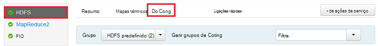
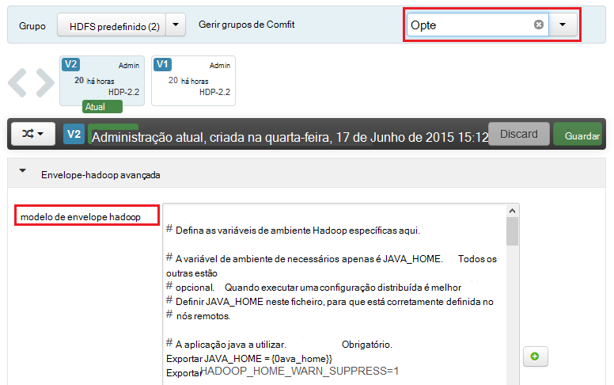
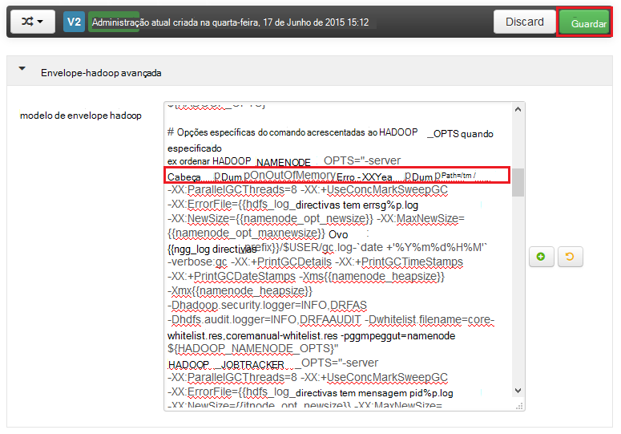
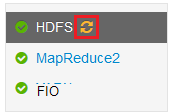
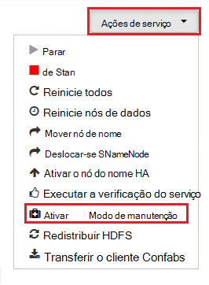

<properties
    pageTitle="Ativar as informações de estado da pilha para serviços de Hadoop no HDInsight | Microsoft Azure"
    description="Ative as informações de estado da pilha para serviços de Hadoop de baseado em Linux HDInsight clusters para depurar e análise."
    services="hdinsight"
    documentationCenter=""
    authors="Blackmist"
    manager="jhubbard"
    editor="cgronlun"
    tags="azure-portal"/>

<tags
    ms.service="hdinsight"
    ms.workload="big-data"
    ms.tgt_pltfrm="na"
    ms.devlang="na"
    ms.topic="article"
    ms.date="09/27/2016"
    ms.author="larryfr"/>

#Ativar as informações de estado da pilha para serviços de Hadoop no HDInsight baseado em Linux (pré-visualização)

[AZURE.INCLUDE [heapdump-selector](../../includes/hdinsight-selector-heap-dump.md)]

Informações de estado da pilha de conter um instantâneo da memória a aplicação, incluindo os valores de variáveis ao tempo a informação que foi criada. Para que sejam muito útil para diagnosticar os problemas que ocorrem em tempo de execução.

> [AZURE.NOTE] As informações neste artigo só se aplica ao baseado em Linux HDInsight. Para obter informações sobre HDInsight baseados no Windows, consulte o artigo [Ativar informações de estado da pilha para serviços de Hadoop no HDInsight baseados no Windows](hdinsight-hadoop-collect-debug-heap-dumps.md)

## Serviços

Pode ativar a pilha informações de estado para os seguintes serviços:

*  **hcatalog** - tempelton
*  **ramo** - hiveserver2, metastore, derbyserver
*  **mapreduce** - jobhistoryserver
*  **fio** - resourcemanager, nodemanager, timelineserver
*  **hdfs** - datanode, secondarynamenode, namenode

Também pode ativar pilha informações de estado para o mapa e reduzir os processos executou por HDInsight.

## Noções sobre pilha de cópia da configuração

Informações de estado da pilha estão ativados para prisma opções (por vezes conhecido como opte, parâmetros ou) para o JVM quando um serviço é iniciado. Para a maioria dos serviços de Hadoop, pode fazê-lo, alterando o script de shell utilizado para iniciar o serviço.

Em cada script, existe uma exportação para ** \* \_OPTS**, que contém as opções de passado para o JVM. Por exemplo, no script **hadoop env.sh** , a linha que começa com `export HADOOP_NAMENODE_OPTS=` contém as opções para o serviço de NameNode.

Mapear e reduzir processos são ligeiramente diferentes, tal como estes são um processo subordinado do serviço MapReduce. Cada mapa ou reduzir processo é executado num contentor subordinado e não existem duas entradas que contêm as opções de JVM para estes. Ambos contém na **mapred site.xml**:

* **mapreduce.Admin.Map.child.Java.opts**
* **mapreduce.Admin.reduce.child.Java.opts**

> [AZURE.NOTE] Recomendamos que utilize Ambari para modificar os scripts e de definições de mapred site.xml, tal como Ambari processará replicação alterações em nós do cluster. Consulte a secção [Utilizar Ambari](#using-ambari) para obter passos específicos.

###Ativar as informações de estado da área de dados dinâmicos

A opção seguinte permite informações de estado da pilha quando ocorre um OutOfMemoryError:

    -XX:+HeapDumpOnOutOfMemoryError

O **+** indica que esta opção está ativada. A predefinição é desativada.

> [AZURE.WARNING] Informações de estado da pilha não estão activadas para serviços de Hadoop no HDInsight por predefinição, tal como os ficheiros de informação podem ser grandes. Se ativá-los para resolução de problemas, não se esqueça de desativá-las assim que tiver reproduzida o problema e reuniu os ficheiros de informação.

###Informação de localização

A localização predefinida para o ficheiro de informação é o directório de trabalho atual. Pode controlar onde o ficheiro está armazenado utilizando a opção seguinte:

    -XX:HeapDumpPath=/path

Por exemplo, utilizando `-XX:HeapDumpPath=/tmp` originará copia a ser armazenado no diretório /tmp.

###Scripts

Também pode accionar um script quando ocorre um **OutOfMemoryError** . Por exemplo, acionar uma notificação para que saiba que ocorreu o erro. Este processo é controlado através da opção seguinte:

    -XX:OnOutOfMemoryError=/path/to/script

> [AZURE.NOTE] Uma vez que Hadoop um sistema distribuído, qualquer script utilizado deve ser colocado em todos os nós num cluster de que o serviço é executada no.
>
> O script tem também ser numa localização que esteja acessível através da conta, o serviço é executado como e, tem de fornecer executar permissões. Por exemplo, poderá pretender armazenar os scripts `/usr/local/bin` e utilizar `chmod go+rx /usr/local/bin/filename.sh` para conceder a leitura e permissões de execução.

##Utilizar Ambari

Para modificar a configuração de um serviço, utilize os passos seguintes:

1. Abra a web Ambari da IU para o seu cluster. O URL será https://YOURCLUSTERNAME.azurehdinsight.net.

    Quando lhe for pedido, autenticar o site com o nome da conta HTTP (predefinido: administrador,) e palavra-passe para o seu cluster.

    > [AZURE.NOTE] Poderá ser-lhe uma segunda vez por Ambari o nome de utilizador e palavra-passe. Se Sim, basta volte a introduzir o mesmo nome de conta e a palavra-passe

2. Utilizar a lista de à esquerda, selecione a área de serviço que pretende modificar. Por exemplo, **HDFS**. Na área centro, selecione o separador **Configs** .

    

3. Utilizar a entrada **filtrar...** , introduza **opte**. Isto irá filtrar a lista de itens de configuração para apenas os que contém este texto e é uma forma rápida de localizar o script de shell ou **modelo** que podem ser utilizados para definir estas opções.

    

4. Localizar o ** \* \_OPTS** entrada para o serviço que pretende ativar informações de estado da pilha para e adicione as opções que pretende ativar. Na seguinte imagem, adicionei `-XX:+HeapDumpOnOutOfMemoryError -XX:HeapDumpPath=/tmp/` para o **HADOOP\_NAMENODE\_OPTS** entrada:

    

    > [AZURE.NOTE] Quando pilha activação regista para o mapa ou reduzir processo subordinado, será em vez disso, procure a campos etiquetados **mapreduce.admin.map.child.java.opts** e **mapreduce.admin.reduce.child.java.opts**.

    Utilize o botão **Guardar** para guardar as alterações. Terá autorização para introduzir uma nota breve que descrevem as alterações.

5. Assim que as alterações foram aplicadas, o ícone **Reinício requerido** irá aparecer ao lado de um ou mais serviços.

    

6. Selecione cada serviço que precisa de reiniciar o computador e utilizar o botão **Ações de serviço** para **Ativar no modo de manutenção**. Isto impede que alertas a ser geradas a partir deste serviço quando tem de ser reiniciado.

    

7. Uma vez ativou o modo de manutenção, utilize o botão **reinicie** o serviço para **Reiniciar a afetado todos os**

    

    > [AZURE.NOTE] as entradas do botão **reiniciar** podem ser diferentes para outros serviços.

8. Depois de tem sido reiniciados os serviços, utilize o botão de **Ações de serviço** para **Ativar desactivar modo de manutenção**. Este Ambari para retomar a monitorização de alertas para o serviço.
