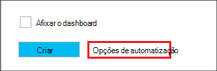

<properties
   pageTitle="Criar baseado em Linux Hadoop clusters no HDInsight utilizar modelos de Gestor de recursos do Azure | Microsoft Azure"
    description="Saiba como criar clusters para utilizar o Gestor de recursos do Azure Azure modelos do Azure HDInsight."
   services="hdinsight"
   documentationCenter=""
   tags="azure-portal"
   authors="mumian"
   manager="jhubbard"
   editor="cgronlun"/>

<tags
   ms.service="hdinsight"
   ms.devlang="na"
   ms.topic="article"
   ms.tgt_pltfrm="na"
   ms.workload="big-data"
   ms.date="09/02/2016"
   ms.author="jgao"/>

# Criar baseado em Linux Hadoop clusters no HDInsight utilizar modelos de Gestor de recursos do Azure

[AZURE.INCLUDE [selector](../../includes/hdinsight-selector-create-clusters.md)]

Saiba como criar clusters HDInsight utilizar modelos do Azure recurso Manager(ARM). Para mais informações, consulte o artigo [Implementar uma aplicação com o modelo de Gestor de recursos do Azure](../resource-group-template-deploy.md). Para outras criação do cluster ferramentas e funcionalidades, clique em Selecionar o separador na parte superior desta página ou consulte [métodos de criação de Cluster](hdinsight-provision-clusters.md#cluster-creation-methods).

##Pré-requisitos:

[AZURE.INCLUDE [delete-cluster-warning](../../includes/hdinsight-delete-cluster-warning.md)]

Antes de começar as instruções neste artigo, tem de ter o seguinte procedimento:

- [Subscrição azure](https://azure.microsoft.com/documentation/videos/get-azure-free-trial-for-testing-hadoop-in-hdinsight/).
- Clip Azure PowerShell e/ou Azure

    [AZURE.INCLUDE [use-latest-version](../../includes/hdinsight-use-latest-powershell-and-cli.md)]

### Requisitos de controlo de acesso

[AZURE.INCLUDE [access-control](../../includes/hdinsight-access-control-requirements.md)]

## Modelos de Gestor de recursos

Modelo de Gestor de recursos torna mais fácil para criar HDInsight clusters, os respetivos recursos dependentes (tal como a conta de armazenamento predefinida) e outros recursos (como Azure a base de dados de SQL para utilizar Apache Sqoop) para a sua aplicação numa operação de única e coordenada. No modelo, tem de definir os recursos que são necessários para a aplicação e especificar parâmetros de implementação para valores para diferentes ambientes de entrada. O modelo é composta por JSON e expressões que pode utilizar para construir valores para a sua implementação.

Um modelo de Gestor de recursos para criar um cluster de HDInsight e a conta de armazenamento do Windows Azure dependente pode ser encontrado no [Anexo-A](#appx-a-arm-template). Utilize em diferentes plataformas [VSCode](https://code.visualstudio.com/#alt-downloads) com a [extensão do Gestor de recursos](https://marketplace.visualstudio.com/items?itemName=msazurermtools.azurerm-vscode-tools) ou num editor de texto para guardar o modelo para um ficheiro no seu estação de trabalho. Vai aprender ligar o modelo utilizando métodos diferentes.

Para obter mais informações sobre o modelo de Gestor de recursos, consulte o artigo

- [Modelos de autor do Gestor de recursos do Azure](../resource-group-authoring-templates.md)
- [Implementar uma aplicação com o modelo de Gestor de recursos do Azure](../resource-group-template-deploy.md)

Para saber o esquema JSON para determinados elementos, pode seguir o seguinte procedimento:

1. Abra o [Azure portal](https://porta.azure.com) para criar um cluster de HDInsight.  Consulte o artigo [baseado em criar Linux clusters de HDInsight através do portal Azure](hdinsight-hadoop-create-linux-clusters-portal.md).
2. Configure os elementos necessários e os elementos que precisa de esquema de JSON.
3. Antes de clicar em **Criar**, clique em **Opções de automatização** conforme apresentado na captura de ecrã seguinte:

    

    O portal cria um modelo de Gestor de recursos com base nas suas configurações.
## Implementar com PowerShell

O procedimento seguinte cria cluster de baseado em Linux HDInsight.

**Para implementar um cluster utilizando o modelo de Gestor de recursos**

1. Guarde o ficheiro json no [anexo A](#appx-a-arm-template) sua estação de trabalho. Em PowerShell script, o nome do ficheiro é *C:\HDITutorials-ARM\hdinsight-arm-template.json*.
2. Defina parâmetros e variáveis caso seja necessário.
3. Execute o modelo utilizando o seguinte script do PowerShell:

        ####################################
        # Set these variables
        ####################################
        #region - used for creating Azure service names
        $nameToken = "<Enter an Alias>" 
        $templateFile = "C:\HDITutorials-ARM\hdinsight-arm-template.json"
        #endregion

        ####################################
        # Service names and varialbes
        ####################################
        #region - service names
        $namePrefix = $nameToken.ToLower() + (Get-Date -Format "MMdd")

        $resourceGroupName = $namePrefix + "rg"
        $hdinsightClusterName = $namePrefix + "hdi"
        $defaultStorageAccountName = $namePrefix + "store"
        $defaultBlobContainerName = $hdinsightClusterName

        $location = "East US 2"

        $armDeploymentName = $namePrefix
        #endregion

        ####################################
        # Connect to Azure
        ####################################
        #region - Connect to Azure subscription
        Write-Host "`nConnecting to your Azure subscription ..." -ForegroundColor Green
        try{Get-AzureRmContext}
        catch{Login-AzureRmAccount}
        #endregion

        # Create a resource group
        New-AzureRmResourceGroup -Name $resourceGroupName -Location $Location

        # Create cluster and the dependent storage accounge
        $parameters = @{clusterName="$hdinsightClusterName"}

        New-AzureRmResourceGroupDeployment `
            -Name $armDeploymentName `
            -ResourceGroupName $resourceGroupName `
            -TemplateFile $templateFile `
            -TemplateParameterObject $parameters

        # List cluster
        Get-AzureRmHDInsightCluster -ResourceGroupName $resourceGroupName -ClusterName $hdinsightClusterName 

    O script do PowerShell configura apenas o nome do cluster. O nome de conta de armazenamento é codificado no modelo. Ser-lhe-á pedido para introduzir o utilizador palavra-passe cluster (o nome de utilizador predefinido é *administrador*); e o utilizador SSH palavra-passe (o nome de utilizador SSH predefinido é *sshuser*).  
    
Para mais informações, consulte o artigo [Implementar com PowerShell](../resource-group-template-deploy.md#deploy-with-powershell).

## Implementar com clip Azure

O exemplo seguinte cria um cluster e sua conta de armazenamento dependentes e contentor ao contactar um modelo de Gestor de recursos:

    azure login
    azure config mode arm
    azure group create -n hdi1229rg -l "East US"
    azure group deployment create --resource-group "hdi1229rg" --name "hdi1229" --template-file "C:\HDITutorials-ARM\hdinsight-arm-template.json"
    
Vai ser-lhe para introduzir o nome do cluster, palavra-passe a cluster do utilizador (o nome de utilizador predefinido é *administrador*) e o utilizador SSH palavra-passe (o nome de utilizador SSH predefinido é *sshuser*). Para fornecer parâmetros na linha:

    azure group deployment create --resource-group "hdi1229rg" --name "hdi1229" --template-file "c:\Tutorials\HDInsightARM\create-linux-based-hadoop-cluster-in-hdinsight.json" --parameters '{\"clusterName\":{\"value\":\"hdi1229\"},\"clusterLoginPassword\":{\"value\":\"Pass@word1\"},\"sshPassword\":{\"value\":\"Pass@word1\"}}'

## Implementar com a REST API

Consulte o artigo [Implementar com a API REST](../resource-group-template-deploy.md#deploy-with-the-rest-api).

## Implementar com o Visual Studio

Com o Visual Studio, pode criar um projeto de grupo de recursos e implemente-o Azure através da interface de utilizador. Selecionar o tipo de recursos para incluir no seu projeto e os recursos são automaticamente adicionados ao modelo de Gestor de recursos. O project fornece também um script PowerShell para implementar o modelo.

Para obter uma introdução à utilização do Visual Studio com grupos de recursos, consulte [criar e implementar a grupos de recursos Azure através do Visual Studio](../vs-azure-tools-resource-groups-deployment-projects-create-deploy.md).

##Próximos passos
Neste artigo, aprendeu várias formas para criar um cluster de HDInsight. Para saber mais, consulte os artigos seguintes:

- Para obter um exemplo de implementação do recursos através da biblioteca de cliente .NET, consulte o artigo [Implementar recursos utilizar bibliotecas .NET e um modelo](../virtual-machines/virtual-machines-windows-csharp-template.md).
- Para um exemplo aprofundado de implementar uma aplicação, consulte o artigo [aprovisionar e implementar microservices seja previsível no Azure](../app-service-web/app-service-deploy-complex-application-predictably.md).
- Para obter orientações sobre como implementar a solução para diferentes ambientes, consulte o artigo [desenvolvimento e ambientes de teste no Microsoft Azure](../solution-dev-test-environments.md).
- Para saber mais sobre as secções do modelo de Gestor de recursos do Azure, consulte o artigo [modelos de criação](../resource-group-authoring-templates.md).
- Para obter uma lista das funções que pode utilizar um modelo de Gestor de recursos do Azure, consulte [funções de modelo](../resource-group-template-functions.md).

##Modelo de Gestor de recursos AppX-r:

O modelo de Gestor de recursos do Azure seguinte cria um cluster de baseado em Linux Hadoop com a conta de armazenamento Azure dependentes. 

> [AZURE.NOTE] O exemplo inclui informações de configuração para ramo metastore e Oozie metastore.  Remover a secção ou configurar a secção antes de utilizar o modelo.

    {
    "$schema": "https://schema.management.azure.com/schemas/2015-01-01/deploymentTemplate.json#",
    "contentVersion": "1.0.0.0",
    "parameters": {
        "clusterName": {
        "type": "string",
        "metadata": {
            "description": "The name of the HDInsight cluster to create."
        }
        },
        "clusterLoginUserName": {
        "type": "string",
        "defaultValue": "admin",
        "metadata": {
            "description": "These credentials can be used to submit jobs to the cluster and to log into cluster dashboards."
        }
        },
        "clusterLoginPassword": {
        "type": "securestring",
        "metadata": {
            "description": "The password must be at least 10 characters in length and must contain at least one digit, one non-alphanumeric character, and one upper or lower case letter."
        }
        },
        "sshUserName": {
        "type": "string",
        "defaultValue": "sshuser",
        "metadata": {
            "description": "These credentials can be used to remotely access the cluster."
        }
        },
        "sshPassword": {
        "type": "securestring",
        "metadata": {
            "description": "The password must be at least 10 characters in length and must contain at least one digit, one non-alphanumeric character, and one upper or lower case letter."
        }
        },
        "location": {
        "type": "string",
        "defaultValue": "East US",
        "allowedValues": [
            "East US",
            "East US 2",
            "North Central US",
            "South Central US",
            "West US",
            "North Europe",
            "West Europe",
            "East Asia",
            "Southeast Asia",
            "Japan East",
            "Japan West",
            "Australia East",
            "Australia Southeast"
        ],
        "metadata": {
            "description": "The location where all azure resources will be deployed."
        }
        },
        "clusterType": {
        "type": "string",
        "defaultValue": "hadoop",
        "allowedValues": [
            "hadoop",
            "hbase",
            "storm",
            "spark"
        ],
        "metadata": {
            "description": "The type of the HDInsight cluster to create."
        }
        },
        "clusterWorkerNodeCount": {
        "type": "int",
        "defaultValue": 2,
        "metadata": {
            "description": "The number of nodes in the HDInsight cluster."
        }
        }
    },
    "variables": {
        "defaultApiVersion": "2015-05-01-preview",
        "clusterApiVersion": "2015-03-01-preview",
        "clusterStorageAccountName": "[concat(parameters('clusterName'),'store')]"
    },
    "resources": [
        {
        "name": "[variables('clusterStorageAccountName')]",
        "type": "Microsoft.Storage/storageAccounts",
        "location": "[parameters('location')]",
        "apiVersion": "[variables('defaultApiVersion')]",
        "dependsOn": [ ],
        "tags": { },
        "properties": {
            "accountType": "Standard_LRS"
        }
        },
        {
        "name": "[parameters('clusterName')]",
        "type": "Microsoft.HDInsight/clusters",
        "location": "[parameters('location')]",
        "apiVersion": "[variables('clusterApiVersion')]",
        "dependsOn": [ "[concat('Microsoft.Storage/storageAccounts/',variables('clusterStorageAccountName'))]" ],
        "tags": {

        },
        "properties": {
            "clusterVersion": "3.4",
            "osType": "Linux",
            "tier": "standard",
            "clusterDefinition": {
            "kind": "[parameters('clusterType')]",
            "configurations": {
                "gateway": {
                "restAuthCredential.isEnabled": true,
                "restAuthCredential.username": "[parameters('clusterLoginUserName')]",
                "restAuthCredential.password": "[parameters('clusterLoginPassword')]"
                },
                "hive-site": {
                    "javax.jdo.option.ConnectionDriverName": "com.microsoft.sqlserver.jdbc.SQLServerDriver",
                    "javax.jdo.option.ConnectionURL": "jdbc:sqlserver://myadla0901dbserver.database.windows.net;database=myhive20160901;encrypt=true;trustServerCertificate=true;create=false;loginTimeout=300",
                    "javax.jdo.option.ConnectionUserName": "johndole",
                    "javax.jdo.option.ConnectionPassword": "myPassword$"
                },
                "hive-env": {
                    "hive_database": "Existing MSSQL Server database with SQL authentication",
                    "hive_database_name": "myhive20160901",
                    "hive_database_type": "mssql",
                    "hive_existing_mssql_server_database": "myhive20160901",
                    "hive_existing_mssql_server_host": "myadla0901dbserver.database.windows.net",
                    "hive_hostname": "myadla0901dbserver.database.windows.net"
                },
                "oozie-site": {
                    "oozie.service.JPAService.jdbc.driver": "com.microsoft.sqlserver.jdbc.SQLServerDriver",
                    "oozie.service.JPAService.jdbc.url": "jdbc:sqlserver://myadla0901dbserver.database.windows.net;database=myhive20160901;encrypt=true;trustServerCertificate=true;create=false;loginTimeout=300",
                    "oozie.service.JPAService.jdbc.username": "johndole",
                    "oozie.service.JPAService.jdbc.password": "myPassword$",
                    "oozie.db.schema.name": "oozie"
                },
                "oozie-env": {
                    "oozie_database": "Existing MSSQL Server database with SQL authentication",
                    "oozie_database_name": "myhive20160901",
                    "oozie_database_type": "mssql",
                    "oozie_existing_mssql_server_database": "myhive20160901",
                    "oozie_existing_mssql_server_host": "myadla0901dbserver.database.windows.net",
                    "oozie_hostname": "myadla0901dbserver.database.windows.net"
                }            
            }
            },
            "storageProfile": {
            "storageaccounts": [
                {
                "name": "[concat(variables('clusterStorageAccountName'),'.blob.core.windows.net')]",
                "isDefault": true,
                "container": "[parameters('clusterName')]",
                "key": "[listKeys(resourceId('Microsoft.Storage/storageAccounts', variables('clusterStorageAccountName')), variables('defaultApiVersion')).key1]"
                }
            ]
            },
            "computeProfile": {
            "roles": [
                {
                "name": "headnode",
                "targetInstanceCount": "2",
                "hardwareProfile": {
                    "vmSize": "Standard_D3"
                },
                "osProfile": {
                    "linuxOperatingSystemProfile": {
                    "username": "[parameters('sshUserName')]",
                    "password": "[parameters('sshPassword')]"
                    }
                }
                },
                {
                "name": "workernode",
                "targetInstanceCount": "[parameters('clusterWorkerNodeCount')]",
                "hardwareProfile": {
                    "vmSize": "Standard_D3"
                },
                "osProfile": {
                    "linuxOperatingSystemProfile": {
                    "username": "[parameters('sshUserName')]",
                    "password": "[parameters('sshPassword')]"
                    }
                }
                }
            ]
            }
        }
        }
    ],
    "outputs": {
        "cluster": {
        "type": "object",
        "value": "[reference(resourceId('Microsoft.HDInsight/clusters',parameters('clusterName')))]"
        }
    }
    }
