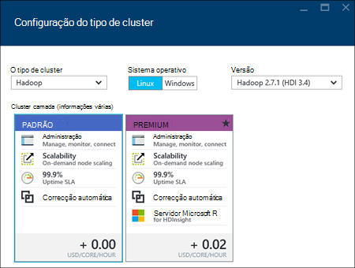
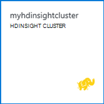

<properties
    pageTitle="Criar clusters Hadoop, HBase, tempestade ou motores no Linux no HDInsight através do portal | Microsoft Azure"
    description="Saiba como criar clusters Hadoop, HBase, tempestade ou motores no Linux para HDInsight utilizando um browser e o portal do Azure pré-visualização."
    services="hdinsight"
    documentationCenter=""
    authors="nitinme"
    manager="jhubbard"
    editor="cgronlun"
    tags="azure-portal"/>

<tags
    ms.service="hdinsight"
    ms.devlang="na"
    ms.topic="article"
    ms.tgt_pltfrm="na"
    ms.workload="big-data"
    ms.date="10/05/2016"
    ms.author="nitinme"/>

#Criar clusters baseados em Linux no HDInsight através do portal Azure

[AZURE.INCLUDE [selector](../../includes/hdinsight-selector-create-clusters.md)]

O portal Azure é uma ferramenta de gestão de baseada na web para serviços e recursos alojados na nuvem Microsoft Azure. Este artigo vai aprender a criar clusters baseado em Linux HDInsight através do portal.

## Pré-requisitos

[AZURE.INCLUDE [delete-cluster-warning](../../includes/hdinsight-delete-cluster-warning.md)]

- **Azure uma subscrição**. Consulte o artigo [obter Azure versão de avaliação gratuita](https://azure.microsoft.com/documentation/videos/get-azure-free-trial-for-testing-hadoop-in-hdinsight/).
- __Um browser web moderno__. Portal do Azure utiliza em HTML5 e Javascript e poderá não funcionar corretamente nos browsers em mais antigos.

### Requisitos de controlo de acesso

[AZURE.INCLUDE [access-control](../../includes/hdinsight-access-control-requirements.md)]

##Criar clusters

Portal do Azure expõe a maioria das propriedades cluster. Utilizar o Gestor de recursos do Azure modelo, pode ocultar muitas detalhes. Para mais informações, consulte o artigo [baseado em criar Linux Hadoop clusters no HDInsight utilizar modelos de Gestor de recursos do Azure](hdinsight-hadoop-create-linux-clusters-arm-templates.md).

1. Inicie sessão no [portal do Azure](https://portal.azure.com).

2. Clique em **Novo**, clique em **Análise de dados**e, em seguida, clique em **HDInsight**.

    ![Criar um novo cluster no portal do Azure] (./media/hdinsight-hadoop-create-linux-cluster-portal/HDI.CreateCluster.1.png "Criar um novo cluster no portal do Azure")
3. Introduza o **Nome do Cluster**: este nome deve ser globalmente exclusivo.
4. Clique em **Seleccionar cluster tipo**e, em seguida, selecione:

    - **Tipo de cluster**: Se não sabe o que escolher, selecione **Hadoop**. É o tipo de cluster mais popular.

        > [AZURE.IMPORTANT] HDInsight clusters está disponível uma variedade de tipos de, que correspondem à carga de trabalho ou tecnologia cluster está optimizado para. Não existe nenhum método suportado para criar um cluster que combina vários tipos de, tais como tempestade e HBase num cluster de um. 

    - **Sistema operativo**: selecione **Linux**.
    - **Versão**: utilizar a versão predefinida se não sabe o que escolher. Para mais informações, consulte o artigo [versões de cluster HDInsight](hdinsight-component-versioning.md).
    - **Cluster camada**: Azure HDInsight fornece as ofertas de nuvem grande dados em duas categorias: camada padrão e camada de Premium. Para mais informações, consulte o artigo [camadas Cluster](hdinsight-hadoop-provision-linux-clusters.md#cluster-tiers).
    
    

4. Clique em **subscrição** para selecionar a subscrição Azure que será utilizada para o cluster.

5. Clique em **Grupo de recursos** para selecionar um grupo de recursos existente ou clique em **Novo** para criar um novo grupo de recursos

    > [AZURE.NOTE] Esta entrada predefinido de um dos seus grupos de recursos existente, caso exista alguma disponível.

6. Clique em **credenciais** e, em seguida, introduza uma palavra-passe para o utilizador admin. Também tem de introduzir um **Nome de utilizador SSH** e uma **palavra-passe** ou **Chave pública**, que será utilizada para autenticar o utilizador SSH. Utilizar uma chave pública é a abordagem recomendada. Clique em **Seleccionar** na parte inferior para guardar a configuração de credenciais.

    ![Credenciais de cluster de fornecer] (./media/hdinsight-hadoop-create-linux-cluster-portal/HDI.CreateCluster.3.png "Credenciais de cluster de fornecer")

    Para obter mais informações sobre como utilizar SSH com HDInsight, consulte um dos seguintes artigos:

    * [Utilizar SSH com baseado em Linux Hadoop no HDInsight Linux, Unix ou OS X](hdinsight-hadoop-linux-use-ssh-unix.md)
    * [Utilizar SSH com baseado em Linux Hadoop no HDInsight a partir do Windows](hdinsight-hadoop-linux-use-ssh-windows.md)

7. Clique em **Origem de dados** para escolher uma origem de dados existente para o cluster ou crie um novo.

    ![Pá da origem de dados] (./media/hdinsight-hadoop-create-linux-cluster-portal/HDI.CreateCluster.4.png "Configuração da origem de dados de fornecer")

    Atualmente pode selecionar uma conta de armazenamento do Azure como origem de dados para um cluster de HDInsight. Utilize o seguinte procedimento para compreender as entradas em pá a **Origem de dados** .

    - **Método de seleção**: defina esta opção para **a partir de todas as subscrições** para ativar a navegação de contas de armazenamento de todas as subscrições. Defina esta opção para **Tecla de acesso** se pretender introduzir o **Nome de armazenamento** e a **Tecla de acesso** de uma conta de armazenamento existente.

    - **Selecione conta de armazenamento / nova**: clique em **Selecione a conta de armazenamento** para procurar e selecione uma conta de armazenamento existente que pretende associar ao cluster. Em alternativa, clique em **Novo** para criar uma nova conta de armazenamento. Utilize o campo que aparece para introduzir o nome da conta de armazenamento. Uma marca de verificação verde será apresentado se o nome está disponível.

    - **Selecione contentor predefinido**: Utilize esta opção para introduzir o nome do contentor predefinido a utilizar para o cluster. Embora possa introduzir quaisquer nomes aqui, recomendamos que utilize o mesmo nome como cluster de modo a que pode facilmente reconhecer que é utilizado o contentor para este cluster específico.

    - **Localização**: A região geográfica que a conta de armazenamento está no ou, será criada na.

        > [AZURE.IMPORTANT] Selecionar a localização para a origem de dados predefinido será também definir a localização do HDInsight cluster. A origem de dados cluster e predefinido têm de estar localizada na mesma região.
        
    - **Cluster AAD identidade**: configurando-lo, se o cluster acessível para as lojas Azure dados Lake com base na configuração AAD.

    Clique em **Selecionar** para guardar a configuração de origem de dados.

8. Clique em **Camadas de preços de nó** para apresentar informações sobre os nós que serão criados para este cluster. Defina o número de nós de trabalho que precisa para cluster. O custo estimado do cluster será apresentado no prazo de pá.

    ![Pá de camadas comparar nó] (./media/hdinsight-hadoop-create-linux-cluster-portal/HDI.CreateCluster.5.png "Número de especificar de nós cluster")
    
    > [AZURE.IMPORTANT] Se planeia mais de 32 nós de trabalho, na criação de cluster ou por dimensionamento cluster após a criação, tem de selecionar um tamanho de cabeça nó com, pelo menos, 8 núcleos e 14GB de ram.
    >
    > Para mais informações sobre tamanhos de nó e custos associados, consulte o artigo [HDInsight preços](https://azure.microsoft.com/pricing/details/hdinsight/).

    Clique em **Selecionar** para guardar a configuração de preços de nó.

9. Clique em **Configuração opcional** para selecionar a versão de cluster, bem como configurar outras definições opcionais, como aderir a uma **Rede Virtual**, a configurar uma **Externos Metastore** guardar os dados para ramo e Oozie, utilizar as ações de Script para personalizar um cluster de instalar componentes personalizados ou utilizar contas de armazenamento adicional com o cluster.

    * **Rede virtual**: selecione uma rede virtual Azure e a sub-rede se pretende colocar o cluster para uma rede virtual.  

        ![Virtual pá de rede] (./media/hdinsight-hadoop-create-linux-cluster-portal/HDI.CreateCluster.6.png "Especificar detalhes de rede virtual")

        Para obter informações sobre como utilizar HDInsight com uma rede Virtual, incluindo os requisitos de configuração específicas para a rede Virtual, consulte o artigo [funcionalidades de expandir HDInsight ao utilizar uma rede Virtual Azure](hdinsight-extend-hadoop-virtual-network.md).

    * Clique em **Metastores externos** para especificar a base de dados do SQL que pretende utilizar para guardar ramo e Oozie metadados associados ao cluster.
    
        > [AZURE.NOTE] Configuração de Metastore não está disponível para os tipos de cluster HBase.

        ![Pá de metastores personalizada] (./media/hdinsight-hadoop-create-linux-cluster-portal/HDI.CreateCluster.7.png "Especificar externos metastores")

        Para **utilizar um existente DB do SQL para ramo de** metadados, clique em **Sim**, selecione uma base de dados do SQL e, em seguida, fornecer o nome de utilizador/palavra-passe para a base de dados. Repita estes passos se pretender **utilizar um existente DB do SQL para Oozie metadados**. Clique em **Seleccionar** até que estiver a voltar a pá **Configuração opcional** .

        >[AZURE.NOTE] A base de dados do Azure SQL utilizado para o metastore têm de permitir conectividade com outros serviços do Azure, incluindo Azure HDInsight. No dashboard de base de dados Azure SQL, no lado direito, clique no nome de servidor. Este é o servidor no qual a instância de base de dados SQL está a ser executado. Uma vez que está na vista server, clique em **Configurar**e, em seguida, para **Dos serviços do Azure**, clique em **Sim**e, em seguida, clique em **Guardar**.

        &nbsp;

        > [AZURE.IMPORTANT] Ao criar um metastore, não utilize um nome de base de dados que contenha traços ou hífenes, tal como isto pode fazer com que o processo de criação de cluster falha.

    * **Acções de script** se pretender utilizar um script personalizado para personalizar um cluster, como o cluster está a ser criado. Para mais informações sobre as acções de script, consulte o artigo [Personalizar HDInsight clusters utilizando Script ação](hdinsight-hadoop-customize-cluster-linux.md). No pá Script ações fornecem detalhes conforme apresentado na captura de ecrã.

        ![Pá de ação de script] (./media/hdinsight-hadoop-create-linux-cluster-portal/HDI.CreateCluster.8.png "Acção de script de especificar")

    * Clique em **Contas ligadas de armazenamento** para especificar as contas de armazenamento adicional para associar o cluster. No pá **Azure armazenamento teclas** , clique em **Adicionar uma chave de armazenamento**e, em seguida, selecione uma conta de armazenamento existente ou crie uma nova conta.

        ![Pá de armazenamento adicional] (./media/hdinsight-hadoop-create-linux-cluster-portal/HDI.CreateCluster.9.png "Contas de armazenamento adicional de especificar")

        Também pode adicionar contas de armazenamento adicional após a criação de um cluster.  Consulte [clusters baseado em Personalizar Linux HDInsight utilizando a ação de Script](hdinsight-hadoop-customize-cluster-linux.md).

        Clique em **Seleccionar** até que estiver a voltar a pá **cluster de novo HDInsight** .
        
        Para além da conta de armazenamento de BLOBs, também pode ligar Azure dados Lake stores. A configuração pode estar a configurar AAD de origem de dados onde configurado a conta de armazenamento predefinida e contentor predefinido.

10. No pá **Novo HDInsight Cluster** , certifique-se de que o **Pin para Startboard** está selecionada e, em seguida, clique em **Criar**. Isto irá criar o cluster e adicionar um mosaico para o mesmo para Startboard do seu portal Azure. O ícone irá indicar que o cluster é aprovisionamento e irá alterar para mostrar o ícone de HDInsight assim que aprovisionamento terminar.

  	| Enquanto aprovisionamento | Aprovisionamento concluído |
  	| ------------------ | --------------------- |
  	|  |  |

    > [AZURE.NOTE] Irá demorar algum tempo para a cluster criado, normalmente cerca de 15 minutos. Utilize o mosaico na Startboard ou a entrada de **notificações** no lado esquerdo da página para verificar o processo de aprovisionamento.

11. Assim que o processo de criação for concluída, clique no mosaico para o cluster de Startboard para iniciar a pá cluster. O pá cluster fornece informações essenciais sobre o cluster tal como o nome, o grupo de recursos que pertence, a localização, o sistema operativo, o URL para o cluster dashboard, etc.

    ![Pá cluster] (./media/hdinsight-hadoop-create-linux-cluster-portal/HDI.Cluster.Blade.png "Propriedades do cluster")

    Utilize o seguinte para compreender os ícones na parte superior deste pá e, na secção de **Essentials** :

    * **Definições** e **Todas as definições**: apresenta o pá **Definições** para o cluster, que permite-lhe aceder a informações detalhadas da configuração para o cluster.

    * **Dashboard**, **Cluster de Dashboard**e **URL**: estas são todas as formas de aceder ao dashboard de cluster, que é um portal de Web para executar tarefas no cluster.

    * **Shell seguro**: informações necessárias para aceder ao cluster utilizando SSH.

    * **Eliminar**: elimina o cluster HDInsight.

    * **Guia de introdução** (): apresenta as informações que irão ajudar a começar a utilizar o HDInsight.

    * **Utilizadores** (): permite-lhe definir permissões para a _Gestão de portal_ deste cluster para outros utilizadores na sua subscrição do Azure.

        > [AZURE.IMPORTANT] Este _apenas_ afeta o acesso e as permissões para este cluster no portal do Azure e não tem efeito no quem pode ligar ao ou submeter tarefas ao HDInsight cluster.

    * **Etiquetas** (): etiquetas permite-lhe definir pares valor/chave para definir uma taxonomia personalizada dos seus serviços na nuvem. Por exemplo, poderá criar uma chave de __projeto__com o nome e, em seguida, utilize um valor em comum para todos os serviços associados a um projecto específico.

##Personalizar clusters

- Consulte o artigo [Personalizar HDInsight clusters utilizando o arranque](hdinsight-hadoop-customize-cluster-bootstrap.md).
- Consulte [clusters baseado em Personalizar Linux HDInsight utilizando a ação de Script](hdinsight-hadoop-customize-cluster-linux.md).

##Eliminar o cluster

[AZURE.INCLUDE [delete-cluster-warning](../../includes/hdinsight-delete-cluster-warning.md)]

##Próximos passos

Agora que criou com êxito um cluster de HDInsight, utilize o seguinte para saber como trabalhar com o seu cluster:

###Hadoop clusters

* [Utilizar ramo com HDInsight](hdinsight-use-hive.md)
* [Utilizar porco com HDInsight](hdinsight-use-pig.md)
* [Utilizar MapReduce com HDInsight](hdinsight-use-mapreduce.md)

###HBase clusters

* [Introdução ao HBase no HDInsight](hdinsight-hbase-tutorial-get-started-linux.md)
* [Desenvolver aplicações de Java para HBase no HDInsight](hdinsight-hbase-build-java-maven-linux.md)

###Clusters tempestade

* [Desenvolver topologias Java para tempestade no HDInsight](hdinsight-storm-develop-java-topology.md)
* [Utilizar componentes de Python tempestade no HDInsight](hdinsight-storm-develop-python-topology.md)
* [Implementar e monitorizar topologias com tempestade no HDInsight](hdinsight-storm-deploy-monitor-topology-linux.md)

###Motores clusters

* [Criar uma aplicação autónoma Scala](hdinsight-apache-spark-create-standalone-application.md)
* [Executar tarefas remotamente num cluster de motores utilizando Lívio](hdinsight-apache-spark-livy-rest-interface.md)
* [Motores com BI: efetuar uma análise de dados interativos utilizando motores no HDInsight com ferramentas de BI](hdinsight-apache-spark-use-bi-tools.md)
* [Motores com máquina formação: utilizar motores no HDInsight para prever resultados da inspeção de alimentação](hdinsight-apache-spark-machine-learning-mllib-ipython.md)
* [Transmissão de motores: Motores de utilização no HDInsight para criar aplicações de transmissão em tempo real](hdinsight-apache-spark-eventhub-streaming.md)
