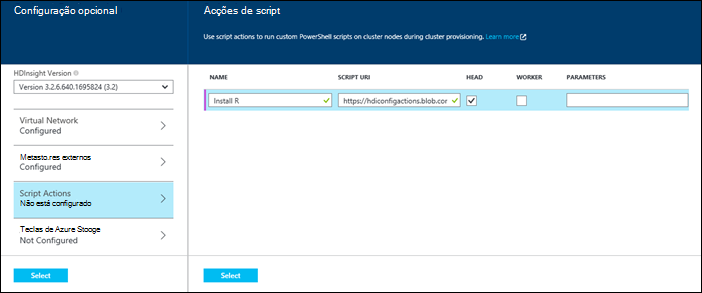
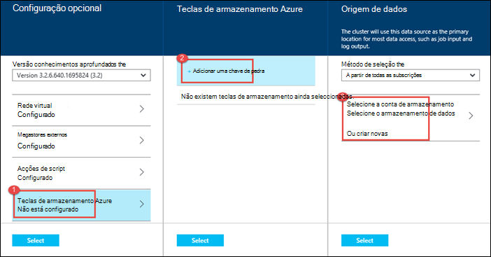

<properties
   pageTitle="Criar Hadoop clusters no HDInsight | Microsoft Azure"
    description="Saiba como criar clusters para Azure HDInsight, utilizando o Portal do Azure."
   services="hdinsight"
   documentationCenter=""
   tags="azure-portal"
   authors="mumian"
   manager="jhubbard"
   editor="cgronlun"/>

<tags
   ms.service="hdinsight"
   ms.devlang="na"
   ms.topic="article"
   ms.tgt_pltfrm="na"
   ms.workload="big-data"
   ms.date="09/02/2016"
   ms.author="jgao"/>

# Criar clusters baseados no Windows Hadoop no HDInsight utilizando o Portal do Azure

[AZURE.INCLUDE [selector](../../includes/hdinsight-selector-create-clusters.md)]

Saiba como criar um cluster de Hadoop no HDInsight através do Portal do Azure. Do Microsoft [Azure portal](../azure-portal-overview.md) é um local central onde pode aprovisionar e gerir os seus recursos Azure. Azure Portal é uma das ferramentas que pode utilizar para criar em baseado em Linux ou baseados no Windows cluster Hadoop no HDInsight. Para outras criação do cluster ferramentas e funcionalidades, clique em Selecionar o separador na parte superior desta página ou consulte [métodos de criação de Cluster](hdinsight-provision-clusters.md#cluster-creation-methods).

##Pré-requisitos:

[AZURE.INCLUDE [delete-cluster-warning](../../includes/hdinsight-delete-cluster-warning.md)]

Antes de começar as instruções neste artigo, tem de ter o seguinte procedimento:

- Uma subscrição do Azure. Consulte o artigo [obter Azure versão de avaliação gratuita](https://azure.microsoft.com/documentation/videos/get-azure-free-trial-for-testing-hadoop-in-hdinsight/).

### Requisitos de controlo de acesso

[AZURE.INCLUDE [access-control](../../includes/hdinsight-access-control-requirements.md)]

## Criar clusters

**Para criar um cluster de HDInsight**

1. Inicie sessão no [Portal do Azure](https://portal.azure.com).
2. Clique em **Novo**, clique em **Análise de dados**e, em seguida, clique em **HDInsight**.

    ![Criar um novo cluster no Portal do Azure] (./media/hdinsight-provision-clusters/HDI.CreateCluster.1.png "Criar um novo cluster no Portal do Azure")

3. Escreva ou selecione os seguintes valores:

    * **Nome do cluster**: introduza um nome para o cluster. Uma marca de verificação verde aparecerá ao lado do nome de cluster se o nome está disponível.

    * **Cluster tipo**: selecione **Hadoop**. Outras opções inclue **HBase**, **tempestade**e **motores**.

        > [AZURE.IMPORTANT] HDInsight clusters está disponível uma variedade de tipos de, que correspondem à carga de trabalho ou tecnologia cluster está optimizado para. Não existe nenhum método suportado para criar um cluster que combina vários tipos de, tais como tempestade e HBase num cluster de um.

    * **Sistema operativo de cluster**: selecione **Windows**. Para criar um cluster de Linux base, selecione **Linux**.
    * **Versão**: ver [versões HDInsight](hdinsight-component-versioning.md).
    * **Subscrição**: selecione a subscrição Azure que será utilizada para criar este cluster.
    * **Grupo de recursos**: selecione um existente ou crie um novo grupo de recursos. Esta entrada predefinido de um dos seus grupos de recursos existente, caso exista alguma disponível.
    * **Credenciais**: configurar o nome de utilizador e a palavra-passe para o utilizador Hadoop (utilizador HTTP). Se ativar o ambiente de trabalho remoto para o cluster, terá de configurar o nome de utilizador de ambiente de trabalho remoto utilizador e palavra-passe e uma data de expiração de conta. Clique em **Seleccionar** na parte inferior para guardar as alterações.

        ![Credenciais de cluster de fornecer] (./media/hdinsight-provision-clusters/HDI.CreateCluster.3.png "Credenciais de cluster de fornecer")

    * **Origem de dados**: criar um novo ou selecione uma conta de armazenamento do Windows Azure existente para ser utilizado como o sistema de ficheiro predefinido para o cluster.

        ![Pá da origem de dados] (./media/hdinsight-provision-clusters/HDI.CreateCluster.4.png "Configuração da origem de dados de fornecer")

        * **Método de seleção**: defina esta opção para **a partir de todas as subscrições** para ativar a navegação de contas de armazenamento de todas as subscrições. Defina esta opção para **Tecla de acesso** se pretender introduzir o **Nome de armazenamento** e a **Tecla de acesso** de uma conta de armazenamento existente.
        * **Selecione conta de armazenamento / criar novas**: clique em **Selecione a conta de armazenamento** para procurar e selecione uma conta de armazenamento existente que pretende associar ao cluster. Em alternativa, clique em **Criar novo** para criar uma nova conta de armazenamento. Utilize o campo que aparece para introduzir o nome da conta de armazenamento. Uma marca de verificação verde será apresentado se o nome está disponível.
        * **Selecione contentor predefinido**: Utilize esta opção para introduzir o nome do contentor predefinido a utilizar para o cluster. Embora possa introduzir quaisquer nomes aqui, recomendamos que utilize o mesmo nome como cluster de modo a que pode facilmente reconhecer que é utilizado o contentor para este cluster específico.
        * **Localização**: A região geográfica que a conta de armazenamento está no ou, será criada na. Esta localização vai determinar a localização de cluster.  Ao cluster e a sua conta de armazenamento predefinida cocriação terá de localizar no Centro de dados Azure do mesmo.
    
    * **Camadas de preços de nó**: defina o número de nós de trabalho que precisa para cluster. O custo estimado do cluster será apresentado no prazo de pá.
  

        ![Pá de camadas comparar nó] (./media/hdinsight-provision-clusters/HDI.CreateCluster.5.png "Número de especificar de nós cluster")

    * **Configuração opcional** para selecionar a versão de cluster, bem como configurar outras definições opcionais, como aderir a uma **Rede Virtual**, a configurar uma **Metastore externos** para armazenarem os dados para ramo e Oozie, utilizar as ações de Script para personalizar um cluster de instalar componentes personalizados ou utilizar contas de armazenamento adicional com o cluster.

    * **Versão HDInsight**: selecione a versão que pretende utilizar para o cluster. Para mais informações, consulte o artigo [versões de cluster HDInsight](hdinsight-component-versioning.md).
    * **Rede virtual**: selecione uma rede virtual Azure e a sub-rede se pretende colocar o cluster para uma rede virtual.  

        ![Virtual pá de rede] (./media/hdinsight-provision-clusters/HDI.CreateCluster.6.png "Especificar detalhes de rede virtual")

        Para obter informações sobre como utilizar HDInsight com uma rede Virtual, incluindo os requisitos de configuração específicas para a rede Virtual, consulte o artigo [Expandir HDInsight capbilities ao utilizar uma rede Virtual Azure](hdinsight-extend-hadoop-virtual-network.md).
  

        
    * **Metastores externos**: Especifique uma base de dados do Azure SQL para armazenar metadados ramo e Oozie associado ao cluster.
 
        > [AZURE.NOTE] Configuração de Metastore não está disponível para os tipos de cluster HBase.

    ![Pá de metastores personalizada] (./media/hdinsight-provision-clusters/HDI.CreateCluster.7.png "Especificar externos metastores")

    Para **utilizar um existente DB do SQL para ramo de** metadados, clique em **Sim**, selecione uma base de dados do SQL e, em seguida, fornecer o nome de utilizador/palavra-passe para a base de dados. Repita estes passos se pretender **utilizar um existente DB do SQL para Oozie metadados**. Clique em **Seleccionar** até que estiver a voltar a pá **Configuração opcional** .

    >[AZURE.NOTE] A base de dados do Azure SQL utilizado para o metastore têm de permitir conectividade com outros serviços do Azure, incluindo Azure HDInsight. No dashboard de base de dados Azure SQL, no lado direito, clique no nome de servidor. Este é o servidor no qual a instância de base de dados SQL está a ser executado. Uma vez que está na vista server, clique em **Configurar**e, em seguida, para **Dos serviços do Azure**, clique em **Sim**e, em seguida, clique em **Guardar**.

            &nbsp;

            > [AZURE.IMPORTANT] Ao criar um metastore, não utilize um nome de base de dados que contenha traços ou hífenes, tal como isto pode fazer com que o processo de criação de cluster falha.
        
        * **Script Actions** if you want to use a custom script to customize a cluster, as the cluster is being created. For more information about script actions, see [Customize HDInsight clusters using Script Action](hdinsight-hadoop-customize-cluster.md). On the Script Actions blade provide the details as shown in the screen capture.
    

            

        * **Azure Storage Keys**: Specify additional storage accounts to associate with the cluster. In the **Azure Storage Keys** blade, click **Add a storage key**, and then select an existing storage account or create a new account.
    

            

4. Clique em **Criar**. Selecionar o **Pin para Startboard** irá adicionar um mosaico para cluster Startboard do seu Portal. O ícone irá indicar que o cluster está a ser criado e irá alterar para mostrar o ícone de HDInsight assim que concluiu a criação.
    
    Irá demorar algum tempo para a cluster criado, normalmente cerca de 15 minutos. Utilize o mosaico na Startboard ou a entrada de **notificações** no lado esquerdo da página para verificar o processo de aprovisionamento.
    

5. Assim que a criação for concluída, clique no mosaico para o cluster de Startboard para iniciar a pá cluster. O pá cluster fornece informações essenciais sobre o cluster tal como o nome, o grupo de recursos que pertence, a localização, o sistema operativo, o URL para o cluster dashboard, etc.

    ![Pá cluster] (./media/hdinsight-provision-clusters/HDI.Cluster.Blade.png "Propriedades do cluster")

    Utilize o seguinte para compreender os ícones na parte superior deste pá e, na secção de **Essentials** :

    * **Definições** e **Todas as definições**: apresenta o pá **Definições** para o cluster, que permite-lhe aceder a informações detalhadas da configuração para o cluster.
    * **Dashboard**, **Cluster de Dashboard**e **URL**: estas são todas as formas de aceder ao dashboard de cluster, que é um portal de Web para executar tarefas no cluster.
    * **Ambiente de trabalho remoto**: permite-lhe para ativar/desativar ambiente de trabalho remoto os nós de cluster.
    * **Cluster de escala**: permite-lhe alterar o número de nós de trabalho para este cluster.
    * **Eliminar**: elimina o cluster HDInsight.
    * **Guia de introdução** (): apresenta as informações que irão ajudar a começar a utilizar o HDInsight.
    * **Utilizadores** (): permite-lhe definir permissões para a _Gestão de portal_ deste cluster para outros utilizadores na sua subscrição do Azure.
    

        > [AZURE.IMPORTANT] Este _apenas_ afeta o acesso e as permissões para este cluster no Portal e não tem efeito no quem pode ligar ao ou submeter tarefas ao HDInsight cluster.
        
    * **Etiquetas** (): etiquetas permite-lhe definir pares valor/chave para definir uma taxonomia personalizada dos seus serviços na nuvem. Por exemplo, poderá criar uma chave de __projeto__com o nome e, em seguida, utilize um valor em comum para todos os serviços associados a um projecto específico.

##Personalizar clusters

- Consulte o artigo [Personalizar HDInsight clusters utilizando o arranque](hdinsight-hadoop-customize-cluster-bootstrap.md).
- Consulte [clusters baseados no Windows personalizar HDInsight utilizando a ação de Script](hdinsight-hadoop-customize-cluster.md).

##Próximos passos
Neste artigo, aprendeu várias formas para criar um cluster de HDInsight. Para saber mais, consulte os artigos seguintes:

* [Introdução ao Azure HDInsight](hdinsight-hadoop-linux-tutorial-get-started.md) - Saiba como começar a trabalhar com o seu cluster HDInsight
* [Submeter Hadoop através de programação de tarefas](hdinsight-submit-hadoop-jobs-programmatically.md) - Saiba como através de programação submeter tarefas para HDInsight
* [Gerir clusters de Hadoop HDInsight utilizando o Portal do Azure](hdinsight-administer-use-management-portal.md)

