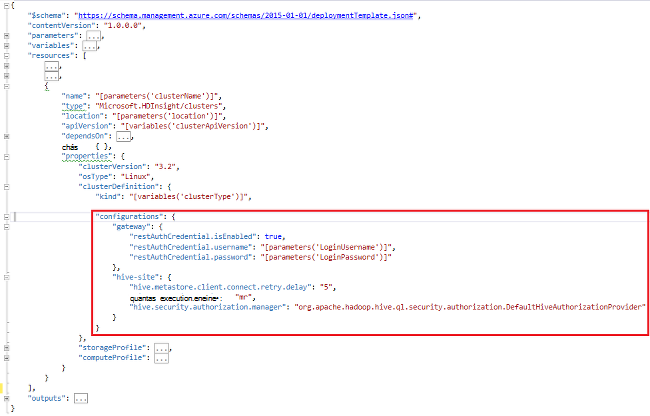

<properties
    pageTitle="Personalizar Clusters HDInsight utilizando arranque | Microsoft Azure"
    description="Saiba como personalizar clusters HDInsight com o arranque."
    services="hdinsight"
    documentationCenter=""
    authors="mumian"
    manager="jhubbard"
    editor="cgronlun"
    tags="azure-portal"/>

<tags
    ms.service="hdinsight"
    ms.workload="big-data"
    ms.tgt_pltfrm="na"
    ms.devlang="na"
    ms.topic="article"
    ms.date="09/02/2016"
    ms.author="jgao"/>

# Personalizar clusters HDInsight com o arranque

Por vezes, pretende configurar os ficheiros de configuração que incluem:

- clusterIdentity.xml
- Core site.xml
- gateway.XML
- hbase env.xml
- hbase site.xml
- hdfs site.xml
- ramo env.xml
- ramo site.xml
- mapred site
- oozie site.xml
- oozie env.xml
- tempestade site.xml
- tez site.xml
- webhcat site.xml
- fio site.xml

Os clusters não consegue reter as alterações devido a funcionalidades novamente. Para mais informações sobre novamente imagens, consulte [Função instância reinicia vencimento a actualizações SO](http://blogs.msdn.com/b/kwill/archive/2012/09/19/role-instance-restarts-due-to-os-upgrades.aspx). Para manter as alterações através do tempo de vida dos clusters, pode utilizar a personalização de cluster HDInsight durante o processo de criação. Este é o caminho recomendado para alterar as configurações de um cluster e persistirem através destes eventos do Azure reimage reinicie reiniciar. Estas alterações de configuração são aplicadas antes do início do serviço, para que os serviços de utilizador não tem de ser reiniciados. 

Existem 3 métodos para utilizar o arranque:

- Utilizar o Azure PowerShell

    [AZURE.INCLUDE [upgrade-powershell](../../includes/hdinsight-use-latest-powershell.md)]
    
- Utilizar SDK do .NET
- Utilizar o modelo de Gestor de recursos do Azure

Para obter informações sobre como instalar componentes adicionais HDInsight cluster durante a hora de criação, consulte:

- [Personalizar clusters HDInsight utilizando Script ação (Linux)](hdinsight-hadoop-customize-cluster-linux.md)
- [Personalizar clusters HDInsight utilizando Script ação (Windows)](hdinsight-hadoop-customize-cluster.md)

## Utilizar o Azure PowerShell

O código seguinte do PowerShell personaliza uma configuração ramo:

    # hive-site.xml configuration
    $hiveConfigValues = @{ "hive.metastore.client.socket.timeout"="90" }
    
    $config = New-AzureRmHDInsightClusterConfig `
        | Set-AzureRmHDInsightDefaultStorage `
            -StorageAccountName "$defaultStorageAccountName.blob.core.windows.net" `
            -StorageAccountKey $defaultStorageAccountKey `
        | Add-AzureRmHDInsightConfigValues `
            -HiveSite $hiveConfigValues 
    
    New-AzureRmHDInsightCluster `
        -ResourceGroupName $existingResourceGroupName `
        -ClusterName $clusterName `
        -Location $location `
        -ClusterSizeInNodes $clusterSizeInNodes `
        -ClusterType Hadoop `
        -OSType Windows `
        -Version "3.2" `
        -HttpCredential $httpCredential `
        -Config $config 

Um PowerShell script de trabalho concluído pode ser encontrado no [Anexo-A](#hdinsight-hadoop-customize-cluster-bootstrap.md/appx-a:-powershell-sample).

**Para verificar a alteração:**

1. Inicie sessão no [portal do Azure](https://portal.azure.com).
2. No painel esquerdo, clique em **Procurar**e, em seguida, clique em **Clusters de HDInsight**.
3. Clique no cluster que acabou de criar utilizando o script PowerShell.
4. Clique em **Dashboard** na parte superior da pá para abrir a IU Ambari.
5. Clique em **Hive** no menu à esquerda.
6. Clique em **HiveServer2** de **Resumo**.
7. Clique no separador **Configs** .
8. Clique em **Hive** no menu à esquerda.
9. Clique no separador **Avançadas** .
10. Desloque para baixo e, em seguida, expanda **Avançadas ramo de sites**.
11. Procure **hive.metastore.client.socket.timeout** na secção.

Alguns exemplos mais sobre a personalização de outros ficheiros de configuração:

    # hdfs-site.xml configuration
    $HdfsConfigValues = @{ "dfs.blocksize"="64m" } #default is 128MB in HDI 3.0 and 256MB in HDI 2.1

    # core-site.xml configuration
    $CoreConfigValues = @{ "ipc.client.connect.max.retries"="60" } #default 50

    # mapred-site.xml configuration
    $MapRedConfigValues = @{ "mapreduce.task.timeout"="1200000" } #default 600000

    # oozie-site.xml configuration
    $OozieConfigValues = @{ "oozie.service.coord.normal.default.timeout"="150" }  # default 120

Para mais informações, consulte o artigo blogue de Azim Uddin intitulado [criação do personalizar HDInsight Cluster](http://blogs.msdn.com/b/bigdatasupport/archive/2014/04/15/customizing-hdinsight-cluster-provisioning-via-powershell-and-net-sdk.aspx).

## Utilizar SDK do .NET

Consulte o artigo [baseado em criar Linux clusters de HDInsight utilizando o SDK .NET](hdinsight-hadoop-create-linux-clusters-dotnet-sdk.md#use-bootstrap).

## Modelo de utilizar o Gestor de recursos

Pode utilizar o arranque no modelo de Gestor de recursos:

    "configurations": {
        …
        "hive-site": {
            "hive.metastore.client.connect.retry.delay": "5",
            "hive.execution.engine": "mr",
            "hive.security.authorization.manager": "org.apache.hadoop.hive.ql.security.authorization.DefaultHiveAuthorizationProvider"
        }
    }

## Consulte também

- [Criar Hadoop clusters no HDInsight] [ hdinsight-provision-cluster] fornece instruções sobre como criar um cluster de HDInsight ao utilizar outras opções personalizadas.
- [Desenvolver scripts de acção de Script para HDInsight][hdinsight-write-script]
- [Instalar e utilizar motores no HDInsight clusters][hdinsight-install-spark]
- [Instalar e utilizar R no HDInsight clusters][hdinsight-install-r]
- [Instalar e utilizar clusters de Solr no HDInsight](hdinsight-hadoop-solr-install.md).
- [Instalar e utilizar clusters de Giraph no HDInsight](hdinsight-hadoop-giraph-install.md).

[hdinsight-install-spark]: hdinsight-hadoop-spark-install.md
[hdinsight-install-r]: hdinsight-hadoop-r-scripts.md
[hdinsight-write-script]: hdinsight-hadoop-script-actions.md
[hdinsight-provision-cluster]: hdinsight-provision-clusters.md
[powershell-install-configure]: powershell-install-configure.md

[img-hdi-cluster-states]: ./media/hdinsight-hadoop-customize-cluster/HDI-Cluster-state.png "Fases durante a criação de cluster"

## Exemplo de PowerShell AppX-r:

Este script do PowerShell cria um cluster de HDInsight e personaliza uma definição de ramo:

    ####################################
    # Set these variables
    ####################################
    #region - used for creating Azure service names
    $nameToken = "<ENTER AN ALIAS>" 
    #endregion

    #region - cluster user accounts
    $httpUserName = "admin"  #HDInsight cluster username
    $httpPassword = "<ENTER A PASSWORD>" #"<Enter a Password>"

    $sshUserName = "sshuser" #HDInsight ssh user name
    $sshPassword = "<ENTER A PASSWORD>" #"<Enter a Password>"
    #endregion

    ####################################
    # Service names and varialbes
    ####################################
    #region - service names
    $namePrefix = $nameToken.ToLower() + (Get-Date -Format "MMdd")

    $resourceGroupName = $namePrefix + "rg"
    $hdinsightClusterName = $namePrefix + "hdi"
    $defaultStorageAccountName = $namePrefix + "store"
    $defaultBlobContainerName = $hdinsightClusterName

    $location = "East US 2"
    #endregion

    # Treat all errors as terminating
    $ErrorActionPreference = "Stop"

    ####################################
    # Connect to Azure
    ####################################
    #region - Connect to Azure subscription
    Write-Host "`nConnecting to your Azure subscription ..." -ForegroundColor Green
    try{Get-AzureRmContext}
    catch{Login-AzureRmAccount}
    #endregion

    #region - Create an HDInsight cluster
    ####################################
    # Create dependent components
    ####################################
    Write-Host "Creating a resource group ..." -ForegroundColor Green
    New-AzureRmResourceGroup `
        -Name  $resourceGroupName `
        -Location $location

    Write-Host "Creating the default storage account and default blob container ..."  -ForegroundColor Green
    New-AzureRmStorageAccount `
        -ResourceGroupName $resourceGroupName `
        -Name $defaultStorageAccountName `
        -Location $location `
        -Type Standard_GRS

    $defaultStorageAccountKey = (Get-AzureRmStorageAccountKey `
                                    -ResourceGroupName $resourceGroupName `
                                    -Name $defaultStorageAccountName)[0].Value
    $defaultStorageContext = New-AzureStorageContext `
                                    -StorageAccountName $defaultStorageAccountName `
                                    -StorageAccountKey $defaultStorageAccountKey
    New-AzureStorageContainer `
        -Name $defaultBlobContainerName `
        -Context $defaultStorageContext #use the cluster name as the container name

    ####################################
    # Create a configuration object
    ####################################
    $hiveConfigValues = @{ "hive.metastore.client.socket.timeout"="90" }
        
    $config = New-AzureRmHDInsightClusterConfig `
        | Set-AzureRmHDInsightDefaultStorage `
            -StorageAccountName "$defaultStorageAccountName.blob.core.windows.net" `
            -StorageAccountKey $defaultStorageAccountKey `
        | Add-AzureRmHDInsightConfigValues `
            -HiveSite $hiveConfigValues 

    ####################################
    # Create an HDInsight cluster
    ####################################
    $httpPW = ConvertTo-SecureString -String $httpPassword -AsPlainText -Force
    $httpCredential = New-Object System.Management.Automation.PSCredential($httpUserName,$httpPW)

    $sshPW = ConvertTo-SecureString -String $sshPassword -AsPlainText -Force
    $sshCredential = New-Object System.Management.Automation.PSCredential($sshUserName,$sshPW)

    New-AzureRmHDInsightCluster `
        -ResourceGroupName $resourceGroupName `
        -ClusterName $hdinsightClusterName `
        -Location $location `
        -ClusterSizeInNodes 1 `
        -ClusterType Hadoop `
        -OSType Linux `
        -Version "3.2" `
        -HttpCredential $httpCredential `
        -SshCredential $sshCredential `
        -Config $config

    ####################################
    # Verify the cluster
    ####################################
    Get-AzureRmHDInsightCluster -ClusterName $hdinsightClusterName

    #endregion
