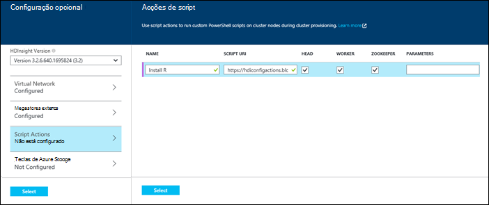
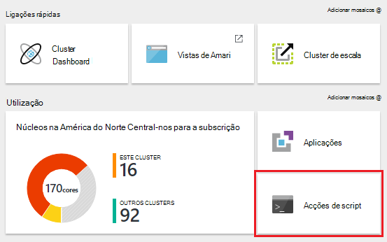
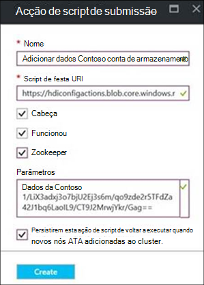
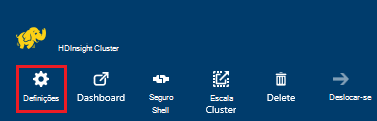
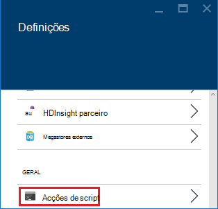
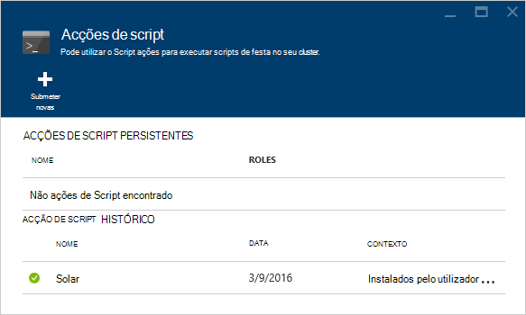
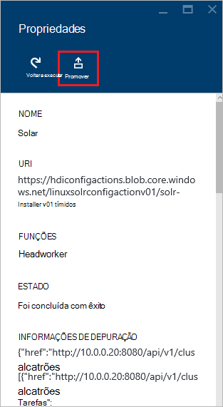
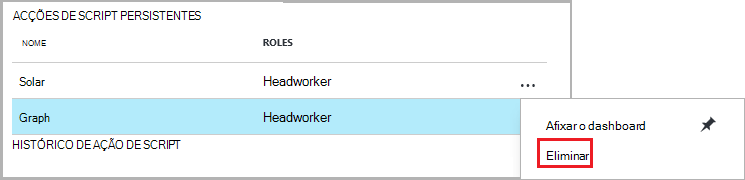
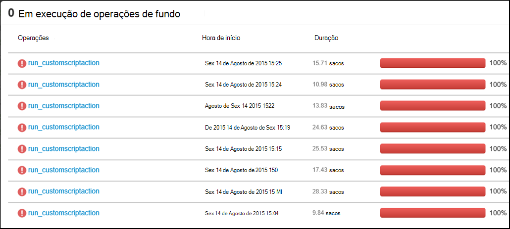
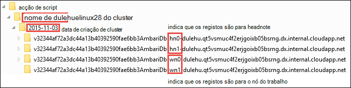

<properties
    pageTitle="Personalizar clusters HDInsight utilizar ações de script | Microsoft Azure"
    description="Saiba como adicionar componentes personalizados a clusters baseado em Linux HDInsight utilizar ações de Script. Acções de script são festa scripts que em nós de cluster e pode ser utilizada para personalizar a configuração do cluster ou adicionar serviços adicionais e os utilitários como matiz, Solr ou R."
    services="hdinsight"
    documentationCenter=""
    authors="Blackmist"
    manager="jhubbard"
    editor="cgronlun"
    tags="azure-portal"/>

<tags
    ms.service="hdinsight"
    ms.workload="big-data"
    ms.tgt_pltfrm="na"
    ms.devlang="na"
    ms.topic="article"
    ms.date="09/06/2016"
    ms.author="larryfr"/>

# Personalizar com base em Linux HDInsight clusters utilizando a ação de Script

HDInsight fornece uma opção de configuração denominada **Acção de Script** que invocar scripts personalizados que personalizar cluster. Estes scripts podem ser utilizados durante a criação de cluster ou num cluster já em execução e são utilizadas para instalar componentes adicionais ou alterar as definições de configuração.

> [AZURE.NOTE] A capacidade de utilizar as ações de script num cluster já em execução só está disponível para clusters baseado em Linux HDInsight. Para obter informações sobre como utilizar ações de script com clusters baseados no Windows, consulte o artigo [Personalizar HDInsight clusters utilizando Script ação (Windows)](hdinsight-hadoop-customize-cluster.md).

Acções de script também podem ser publicadas Azure Marketplace como uma aplicação de HDInsight. Alguns dos exemplos neste documento mostram como pode instalar uma aplicação do HDInsight utilizando os comandos da ação de script do PowerShell e o .NET SDK. Para mais informações sobre aplicações HDInsight, consulte o artigo [HDInsight publicar aplicações para o Azure Marketplace](hdinsight-apps-publish-applications.md). 

## Compreender as ações de Script

Uma ação de Script é simplesmente uma festa executou o script que fornece um URL para e parâmetros para e, em seguida, é em nós de cluster HDInsight. Seguem-se características e funcionalidades das ações de script.

* Deve ser armazenado num URI que está acessível a partir do cluster HDInsight. Seguem-se possíveis locais de armazenamento:

    * Uma conta de armazenamento de BLOBs que pode estar ligada o armazenamento principal ou adicionais conta para o cluster HDInsight. Uma vez que HDInsight é concedido acesso a ambos um destes tipos de contas de armazenamento durante a criação de cluster, estes fornecem uma forma de utilizar uma ação de script de que não sejam público.
    
    * Um URI publicamente legível como um BLOBs do Azure, GitHub, OneDrive, Dropbox, etc.
    
    Para obter exemplos do URI scripts armazenados no contentor de BLOBs (publicamente legível), consulte a secção de [scripts de ação de script de exemplo](#example-script-action-scripts) .

* Pode ser restringido para __Executar apenas determinados tipos de nó__, por exemplo cabeça nós ou nós de trabalho.

    > [AZURE.NOTE] Quando utilizado com HDInsight Premium, pode especificar que o script deve ser utilizado no nó do limite.

* Pode ser __persistentes__ ou __ad hoc__.

    Os scripts __Persisted__ são scripts que são aplicados a nós de trabalho e serão executado automaticamente num novos nós criada quando um cluster de dimensionamento.

    Um script persistente também poderá aplicar alterações a outro tipo de nó, tal como um nó cabeça, mas a partir de uma perspetiva de funcionalidade o único motivo para persistirem um script é por isso aplica-se ao novos nós de trabalho criados quando está dimensionado um cluster de saída.

    > [AZURE.IMPORTANT] Acções de script persistentes tem de ter um nome exclusivo.

    Não são permanentes __ad hoc__ scripts; No entanto, pode subsequentemente promover um script do ad hoc para um script persistente ou despromover um script persistente para um script do ad hoc.

    > [AZURE.IMPORTANT] Ações de script utilizadas durante a criação do cluster são automaticamente permanentes.
    >
    > Scripts que não estão falhas persistentes, mesmo se especificamente a indicar que deve ser.

* Pode aceitar __parâmetros__ são utilizadas pelo script durante a execução.

* São ficou com __privilégios de nível de raiz__ em nós de cluster.

* Podem ser utilizados através do __Azure portal__, __Azure PowerShell__, __Azure clip__ou __HDInsight.NET SDK__

    [AZURE.INCLUDE [upgrade-powershell](../../includes/hdinsight-use-latest-powershell-cli-and-dotnet-sdk.md)]

Para o ajudar a compreensão de scripts de que foram aplicados a um cluster de e para determinar que o ID de scripts para promoção ou despromoção, cluster mantém um histórico de todos os scripts que tenham sido ficou.

> [AZURE.IMPORTANT] Não existe nenhuma forma automática para anular as alterações efetuadas por uma acção de script. Se precisar de inverter os efeitos de um script, tem perceber quais as alterações efectuadas e manualmente invertê-las (ou fornecer uma ação de script inverte-los.)

### Acção de script do processo de criação de cluster

Ações de script utilizadas durante a criação do cluster são um pouco diferentes script ações executou num cluster existente:

* O script é __automaticamente persistentes__.

* Uma __Falha__ no script pode fazer com que o processo de criação de cluster falha.

O diagrama seguinte ilustra quando acção de Script é executada durante o processo de criação:

![Personalização de cluster HDInsight e as fases durante a criação de cluster][img-hdi-cluster-states]

O script é ficou enquanto está a ser configurada HDInsight. Nesta fase, o script é executado em paralelo em todos os nós especificado no cluster e é executado com privilégios de raiz em nós.

> [AZURE.NOTE] Uma vez que o script é executada com privilégios de nível de raiz em nós de cluster, pode executar operações como parar e iniciar serviços, incluindo serviços relacionados com Hadoop. Se deixar de serviços, certifique-se de que o serviço de Ambari e outros serviços relacionados com Hadoop estão a trabalhar antes do script estiver concluída. Estes serviços são necessários para com êxito determinar a saúde e o estado do cluster enquanto está a ser criado-lo.

Durante a criação de cluster, pode especificar várias acções de script que são chamadas pela ordem em que foram especificados.

> [AZURE.IMPORTANT] Acções de script tem de concluir dentro de 60 minutos, ou irão tempo limite. Durante o aprovisionamento de cluster, o script é executado em simultâneo com outros processos de instalação e configuração. Concorrência em relação a recursos, tais como a largura de banda de CPU, hora ou de rede pode causar o script para demorar mais tempo a conclusão de que faz no seu ambiente de desenvolvimento.
>
> Para minimizar o tempo que demora a executar o script, evite tarefas, como transferir e compilar aplicações a partir de origem. Em vez disso, previamente compilar a aplicação e armazenar o ficheiro binário no armazenamento de Blobs do Azure para que podem ser transferido rapidamente ao cluster.

###Acção de script num cluster em execução

Ao contrário de script ações utilizadas durante a criação do cluster, uma falha num script executou num cluster já em execução não automaticamente provocar cluster alterar para um Estado de falhado. Assim que um script for concluída, o cluster deve devolver a um Estado "executar".

> [AZURE.IMPORTANT] Isto significa que o seu cluster em execução é imune para scripts fazer coisas incorretas. Por exemplo, um script foi possível eliminar ficheiros necessários pelo cluster, alterar configuração para que os serviços falharem, etc.
>
> Ações de scripts executar com privilégios de raiz, pelo que deve certificar-se de que compreender o que significa um script antes de a aplicar ao seu cluster.

Quando aplicar um script para um cluster, o estado de cluster irá alterar de __Executar__ para __aceite__, em seguida, __configuração do HDInsight__e finalmente novamente para __Executar__ scripts com êxito. O estado de script tem sessão iniciado no histórico de ação de script e pode utilizar este para determinar se o script foi concluída com êxito ou falha. Por exemplo, o `Get-AzureRmHDInsightScriptActionHistory` cmdlet do PowerShell pode ser utilizado para ver o estado de um script. Irá devolver informações semelhante ao seguinte:

    ScriptExecutionId : 635918532516474303
    StartTime         : 2/23/2016 7:40:55 PM
    EndTime           : 2/23/2016 7:41:05 PM
    Status            : Succeeded

> [AZURE.NOTE] Se tiver alterado a palavra-passe de utilizador (admin) de cluster depois do cluster foi criado, isto pode causar script executou ações relativamente a este cluster falha. Se tiver as ações de script persistentes que nós de trabalho de destino, estes poderão falhar quando adiciona nós ao cluster através de redimensionar operações.

## Scripts de acção de Script de exemplo

Scripts de ação de script podem ser utilizados a partir do portal do Azure, Azure PowerShell, Azure clip ou o .NET SDK HDInsight. HDInsight fornece scripts para instalar os seguintes componentes em HDInsight clusters:

Nome | Script
----- | -----
**Adicionar uma conta de armazenamento do Windows Azure** | https://hdiconfigactions.blob.Core.Windows.NET/linuxaddstorageaccountv01/Add-Storage-Account-v01.SH. Consulte o artigo [aplicar uma ação de Script para um cluster em execução](#apply-a-script-action-to-a-running-cluster).
**Instalar matiz** | https://hdiconfigactions.blob.Core.Windows.NET/linuxhueconfigactionv02/Install-hue-uber-v02.SH. Consulte o artigo [instalar e utilizar clusters de matiz no HDInsight](hdinsight-hadoop-hue-linux.md).
**Instalar R** | https://hdiconfigactions.blob.Core.Windows.NET/linuxrconfigactionv01/r-Installer-v01.SH. Consulte o artigo [instalar e utilizar R sobre clusters de HDInsight](hdinsight-hadoop-r-scripts-linux.md).
**Instalar Solr** | https://hdiconfigactions.blob.Core.Windows.NET/linuxsolrconfigactionv01/solr-Installer-v01.SH. Consulte o artigo [instalar e utilizar clusters de Solr no HDInsight](hdinsight-hadoop-solr-install-linux.md).
**Instalar Giraph** | https://hdiconfigactions.blob.Core.Windows.NET/linuxgiraphconfigactionv01/giraph-Installer-v01.SH. Consulte o artigo [instalar e utilizar clusters de Giraph no HDInsight](hdinsight-hadoop-giraph-install-linux.md).
| **Carregar previamente ramo de bibliotecas** | https://hdiconfigactions.blob.Core.Windows.NET/linuxsetupcustomhivelibsv01/Setup-customhivelibs-v01.SH. Consulte o artigo [Adicionar Hive bibliotecas em HDInsight clusters](hdinsight-hadoop-add-hive-libraries.md) |

## Utilizar uma ação de Script durante a criação de cluster

Esta secção fornece exemplos sobre as diferentes maneiras de que utilizar ações de script ao criar um cluster de HDInsight - a partir do portal do Azure, utilizando um modelo de Gestor de recursos do Azure, utilizar os cmdlets do PowerShell e o .NET SDK a utilizar.

### Utilizar uma ação de Script durante a criação de cluster a partir do portal do Azure

1. Começar a criar um cluster, tal como descrito em [clusters de criar Hadoop HDInsight](hdinsight-provision-clusters.md#portal).

2. Em __Configuração opcional__, para pá **Script ações** , clique em **Adicionar ação de script** para fornecer detalhes sobre a ação de script, conforme apresentado abaixo:

    

  	| Propriedade | Valor |
  	| -------- | ----- |
  	| Nome | Especifique um nome para a ação de script. |
  	| Script URI | Especifique o URI para o script que é chamado para personalizar o cluster. |
  	| Cabeça/trabalho | Especifique os nós (**cabeça**, **trabalho**ou **ZooKeeper**) no qual o script de personalização é executado. |
  	| Parâmetros | Especifique os parâmetros, se necessário pelo script. |

    Prima ENTER para adicionar mais do que uma ação de script para instalar vários componentes no cluster.

3. Clique em **Selecionar** para a configuração de guardar e continuar com a criação de cluster.

### Utilizar uma ação de Script a partir de modelos de Gestor de recursos do Azure

Nesta secção, utilizamos Gestor de recursos do Azure modelos para criar um cluster de HDInsight e também utilizar uma ação de script para instalar componentes personalizados (R, neste exemplo) no cluster. Esta secção fornece um modelo de exemplo para criar um cluster utilizando a ação de script.

> [AZURE.NOTE] Os passos nesta secção demonstram criar um cluster de utilizar uma ação de script. Para obter um exemplo de criação de um cluster de um modelo com uma aplicação do HDInsight, consulte o artigo [instalar aplicações personalizadas de HDInsight](hdinsight-apps-install-custom-applications.md).

#### Antes de começar

* Para obter informações sobre como configurar uma estação de trabalho para executar os cmdlets do HDInsight Powershell, consulte o artigo [instalar e configurar o Azure PowerShell](../powershell-install-configure.md).
* Para obter instruções sobre como criar modelos, consulte o artigo [modelos de criação de Gestor de recursos do Azure](../resource-group-authoring-templates.md).
* Se não tiver anteriormente utilizado Azure PowerShell com o Gestor de recursos, consulte o artigo [Utilizar o PowerShell Azure com o Gestor de recursos do Azure](../powershell-azure-resource-manager.md).

#### Criar clusters de utilizar a ação de Script

1. Copie o seguinte modelo para uma localização no seu computador. Este modelo instala Giraph na headnodes assim como nós de trabalho no cluster. Também pode verificar se o modelo JSON é válido. Cole o conteúdo do modelo [JSONLint](http://jsonlint.com/), uma ferramenta de validação JSON online.

            {
            "$schema": "http://schema.management.azure.com/schemas/2015-01-01/deploymentTemplate.json#",
            "contentVersion": "1.0.0.0",
            "parameters": {
                "clusterLocation": {
                    "type": "string",
                    "defaultValue": "West US",
                    "allowedValues": [ "West US" ]
                },
                "clusterName": {
                    "type": "string"
                },
                "clusterUserName": {
                    "type": "string",
                    "defaultValue": "admin"
                },
                "clusterUserPassword": {
                    "type": "securestring"
                },
                "sshUserName": {
                    "type": "string",
                    "defaultValue": "username"
                },
                "sshPassword": {
                    "type": "securestring"
                },
                "clusterStorageAccountName": {
                    "type": "string"
                },
                "clusterStorageAccountResourceGroup": {
                    "type": "string"
                },
                "clusterStorageType": {
                    "type": "string",
                    "defaultValue": "Standard_LRS",
                    "allowedValues": [
                        "Standard_LRS",
                        "Standard_GRS",
                        "Standard_ZRS"
                    ]
                },
                "clusterStorageAccountContainer": {
                    "type": "string"
                },
                "clusterHeadNodeCount": {
                    "type": "int",
                    "defaultValue": 1
                },
                "clusterWorkerNodeCount": {
                    "type": "int",
                    "defaultValue": 2
                }
            },
            "variables": {
            },
            "resources": [
                {
                    "name": "[parameters('clusterStorageAccountName')]",
                    "type": "Microsoft.Storage/storageAccounts",
                    "location": "[parameters('clusterLocation')]",
                    "apiVersion": "2015-05-01-preview",
                    "dependsOn": [ ],
                    "tags": { },
                    "properties": {
                        "accountType": "[parameters('clusterStorageType')]"
                    }
                },
                {
                    "name": "[parameters('clusterName')]",
                    "type": "Microsoft.HDInsight/clusters",
                    "location": "[parameters('clusterLocation')]",
                    "apiVersion": "2015-03-01-preview",
                    "dependsOn": [
                        "[concat('Microsoft.Storage/storageAccounts/', parameters('clusterStorageAccountName'))]"
                    ],
                    "tags": { },
                    "properties": {
                        "clusterVersion": "3.2",
                        "osType": "Linux",
                        "clusterDefinition": {
                            "kind": "hadoop",
                            "configurations": {
                                "gateway": {
                                    "restAuthCredential.isEnabled": true,
                                    "restAuthCredential.username": "[parameters('clusterUserName')]",
                                    "restAuthCredential.password": "[parameters('clusterUserPassword')]"
                                }
                            }
                        },
                        "storageProfile": {
                            "storageaccounts": [
                                {
                                    "name": "[concat(parameters('clusterStorageAccountName'),'.blob.core.windows.net')]",
                                    "isDefault": true,
                                    "container": "[parameters('clusterStorageAccountContainer')]",
                                    "key": "[listKeys(resourceId('Microsoft.Storage/storageAccounts', parameters('clusterStorageAccountName')), '2015-05-01-preview').key1]"
                                }
                            ]
                        },
                        "computeProfile": {
                            "roles": [
                                {
                                    "name": "headnode",
                                    "targetInstanceCount": "[parameters('clusterHeadNodeCount')]",
                                    "hardwareProfile": {
                                        "vmSize": "Large"
                                    },
                                    "osProfile": {
                                        "linuxOperatingSystemProfile": {
                                            "username": "[parameters('sshUserName')]",
                                            "password": "[parameters('sshPassword')]"
                                        }
                                    },
                                    "scriptActions": [
                                        {
                                            "name": "installGiraph",
                                            "uri": "https://hdiconfigactions.blob.core.windows.net/linuxgiraphconfigactionv01/giraph-installer-v01.sh",
                                            "parameters": ""
                                        }
                                    ]
                                },
                                {
                                    "name": "workernode",
                                    "targetInstanceCount": "[parameters('clusterWorkerNodeCount')]",
                                    "hardwareProfile": {
                                        "vmSize": "Large"
                                    },
                                    "osProfile": {
                                        "linuxOperatingSystemProfile": {
                                            "username": "[parameters('sshUserName')]",
                                            "password": "[parameters('sshPassword')]"
                                        }
                                    },
                                    "scriptActions": [
                                        {
                                            "name": "installR",
                                            "uri": "https://hdiconfigactions.blob.core.windows.net/linuxrconfigactionv01/r-installer-v01.sh",
                                            "parameters": ""
                                        }
                                    ]
                                }
                            ]
                        }
                    }
                }
            ],
            "outputs": {
                "cluster":{
                    "type" : "object",
                    "value" : "[reference(resourceId('Microsoft.HDInsight/clusters',parameters('clusterName')))]"
                }
            }
        }

2. Inicie o PowerShell do Azure e início de sessão para a sua conta Azure. Depois de fornecer as suas credenciais, o comando devolve informações sobre a sua conta.

        Add-AzureRmAccount

        Id                             Type       ...
        --                             ----
        someone@example.com            User       ...

3. Se tem múltiplas subscrições, fornece o id da subscrição que pretende utilizar para implementação.

        Select-AzureRmSubscription -SubscriptionID <YourSubscriptionId>

    > [AZURE.NOTE] Pode utilizar `Get-AzureRmSubscription` para obter uma lista de todas as subscrições associada à sua conta, que inclui o Id da subscrição para cada um deles.

5. Se não tiver um grupo de recursos existente, crie um novo grupo de recursos. Fornece o nome do grupo de recursos e da localização que precisa para a sua solução. É devolvido um resumo do novo grupo de recursos.

        New-AzureRmResourceGroup -Name myresourcegroup -Location "West US"

        ResourceGroupName : myresourcegroup
        Location          : westus
        ProvisioningState : Succeeded
        Tags              :
        Permissions       :
                            Actions  NotActions
                            =======  ==========
                            *
        ResourceId        : /subscriptions/######/resourceGroups/ExampleResourceGroup

6. Para criar uma nova implementação do seu grupo de recursos, execute o comando **Novo AzureRmResourceGroupDeployment** e forneça os parâmetros necessários. Os parâmetros irão incluir um nome para a sua implementação, o nome do seu grupo de recursos e o caminho ou URL para o modelo que criou. Se o modelo exigir quaisquer parâmetros, tem de passar também esses parâmetros. Neste caso, a ação de script instalar R num cluster não requer quaisquer parâmetros.

        New-AzureRmResourceGroupDeployment -Name mydeployment -ResourceGroupName myresourcegroup -TemplateFile <PathOrLinkToTemplate>

    Vai ser-lhe para fornecer valores para os parâmetros definidos no modelo.

7. Quando o grupo de recursos ter sido implementado, irá ver um resumo da implementação.

          DeploymentName    : mydeployment
          ResourceGroupName : myresourcegroup
          ProvisioningState : Succeeded
          Timestamp         : 8/17/2015 7:00:27 PM
          Mode              : Incremental
          ...

8. Se a sua implementação falhar, pode utilizar os seguintes cmdlets para obter informações sobre as falhas.

        Get-AzureRmResourceGroupDeployment -ResourceGroupName myresourcegroup -ProvisioningState Failed

### Utilizar uma ação de Script durante a criação de cluster a partir do Azure PowerShell

Nesta secção, utilizamos o cmdlet [Adicionar AzureRmHDInsightScriptAction](https://msdn.microsoft.com/library/mt603527.aspx) para invocar scripts ao utilizar a ação de Script para personalizar um cluster de. Antes de continuar, certifique-se de ter instalado e configurado o Azure PowerShell. Para obter informações sobre como configurar uma estação de trabalho para executar os cmdlets do HDInsight PowerShell, consulte o artigo [instalar e configurar o Azure PowerShell](../powershell-install-configure.md).

Execute os seguintes passos:

1. Abrir a consola do PowerShell do Azure e utilize o seguinte procedimento para iniciar sessão na sua subscrição do Azure e declarar algumas variáveis PowerShell:

        # LOGIN TO ZURE
        Login-AzureRmAccount

        # PROVIDE VALUES FOR THESE VARIABLES
        $subscriptionId = "<SubscriptionId>"        # ID of the Azure subscription
        $clusterName = "<HDInsightClusterName>"         # HDInsight cluster name
        $storageAccountName = "<StorageAccountName>"    # Azure storage account that hosts the default container
        $storageAccountKey = "<StorageAccountKey>"      # Key for the storage account
        $containerName = $clusterName
        $location = "<MicrosoftDataCenter>"             # Location of the HDInsight cluster. It must be in the same data center as the storage account.
        $clusterNodes = <ClusterSizeInNumbers>          # The number of nodes in the HDInsight cluster.
        $resourceGroupName = "<ResourceGroupName>"      # The resource group that the HDInsight cluster will be created in

2. Especifique os valores de configuração (como nós do cluster) e o armazenamento de predefinido para ser utilizado.

        # SPECIFY THE CONFIGURATION OPTIONS
        Select-AzureRmSubscription -SubscriptionId $subscriptionId
        $config = New-AzureRmHDInsightClusterConfig
        $config.DefaultStorageAccountName="$storageAccountName.blob.core.windows.net"
        $config.DefaultStorageAccountKey=$storageAccountKey

3. Utilize o cmdlet **Adicionar AzureRmHDInsightScriptAction** para invocar o script. O exemplo seguinte utiliza um script que instala Giraph num cluster:

        # INVOKE THE SCRIPT USING THE SCRIPT ACTION FOR HEADNODE AND WORKERNODE
        $config = Add-AzureRmHDInsightScriptAction -Config $config -Name "Install Giraph"  -NodeType HeadNode -Uri https://hdiconfigactions.blob.core.windows.net/linuxgiraphconfigactionv01/giraph-installer-v01.sh
        $config = Add-AzureRmHDInsightScriptAction -Config $config -Name "Install Giraph"  -NodeType WorkerNode -Uri https://hdiconfigactions.blob.core.windows.net/linuxgiraphconfigactionv01/giraph-installer-v01.sh

    O cmdlet **Adicionar AzureRmHDInsightScriptAction** utiliza os seguintes parâmetros:

  	| Parâmetro | Definição |
  	| --------- | ---------- |
  	| Configuração | Objecto de configuração para que script são adicionadas informações de ação. |
  	| Nome | Nome da ação script. |
  	| Tipo de nó | Especifica o nó no qual o script de personalização é executado. Os valores válidos são **HeadNode** (para instalar o nó cabeça), **WorkerNode** (para instalar em todos os nós de dados), ou **ZookeeperNode** (para instalar o nó zookeeper). |
  	| Parâmetros | Parâmetros de uma ferramenta necessária ao script. |
  	| URI | Especifica o URI para o script que é executado. |

4. Defina o utilizador de administração/HTTPS para o cluster:

        $httpCreds = get-credential

    Quando lhe for pedido, introduza 'admin' como o nome e uma palavra-passe.

5. Defina as credenciais SSH:

        $sshCreds = get-credential

    Quando lhe for pedido, introduza o nome de utilizador SSH e palavra-passe. Se pretender seguro a conta SSH com um certificado em vez de uma palavra-passe, utilize uma palavra-passe em branco e defina `$sshPublicKey` para o conteúdo da chave pública certificado que pretende utilizar. Por exemplo:

        $sshPublicKey = Get-Content .\path\to\public.key -Raw

4. Por fim, crie o cluster:

        New-AzureRmHDInsightCluster -config $config -clustername $clusterName -DefaultStorageContainer $containerName -Location $location -ResourceGroupName $resourceGroupName -ClusterSizeInNodes $clusterNodes -HttpCredential $httpCreds -SshCredential $sshCreds -OSType Linux

    Se estiver a utilizar uma chave pública para proteger a sua conta SSH, também tem de especificar `-SshPublicKey $sshPublicKey` como um parâmetro.

Pode demorar alguns minutos antes do cluster é criado.

### Utilizar uma ação de Script durante a criação de cluster a partir do HDInsight .NET SDK

O HDInsight .NET SDK fornece bibliotecas do cliente que o torna mais fácil de trabalhar com HDInsight a partir de uma aplicação do .NET. Para uma amostra de código, consulte o artigo [baseado em criar Linux clusters de HDInsight utilizando o SDK .NET](hdinsight-hadoop-create-linux-clusters-dotnet-sdk.md#use-script-action).

## Aplicar uma acção de Script para um cluster em execução

Esta secção oferece exemplos sobre as diferentes formas que pode aplicar acções de script para um cluster de HDInsight a execução; a partir do portal do Azure, utilizando os cmdlets do PowerShell, utilizar o clip de Azure em diferentes plataformas e utilizar o .NET SDK. A ação de script persistentes utilizada nesta secção adiciona uma conta existente do armazenamento Azure a um cluster em execução. Também pode utilizar outras ações de script, consulte [scripts de exemplo de Script de ação](#example-script-action-scripts).

### Aplicar uma acção de Script para um cluster de execução a partir do portal do Azure

1. A partir do [Azure portal](https://portal.azure.com), selecione o seu cluster HDInsight.

2. A partir do pá de cluster HDInsight, selecione o mosaico de __Ações de Script__ .

    

    > [AZURE.NOTE] Pode também selecionar __todas as definições__ e, em seguida, selecione __Ações de Script__ pá as definições.

4. Na parte superior do pá Script ações, selecione __Submeter nova__.

    

5. A partir da pá adicionar ação de Script, introduza as seguintes informações.

    * __Nome__: O nome amigável para utilizar esta ação de Script. Neste exemplo, `Add Storage account`.
    * __URI de SCRIPT__: URI de para o script. Neste exemplo,`https://hdiconfigactions.blob.core.windows.net/linuxaddstorageaccountv01/add-storage-account-v01.sh`
    * __HEAD__, __trabalhador__e __Zookeeper__: verificar os nós que este script deve ser aplicada. Neste exemplo, são verificadas Head, trabalhador e Zookeeper.
    * __Parâmetros__: se o script aceita parâmetros, introduzi-los aqui. Neste exemplo, introduza o nome da conta de armazenamento e a chave de conta de armazenamento:

        

        Na captura de ecrã, `contosodata` é uma conta de armazenamento do Windows Azure existente, a segunda linha é a chave de conta de armazenamento.
    * __PERSISTED__: selecione esta entrada, se pretender manter o script, de modo que será aplicado a novos nós de trabalho quando dimensionar o cluster.

6. Por fim, utilize o botão __Criar__ para aplicar o script ao cluster.

### Aplicar uma acção de Script para um cluster de execução do PowerShell do Azure

Antes de continuar, certifique-se de ter instalado e configurado o Azure PowerShell. Para obter informações sobre como configurar uma estação de trabalho para executar os cmdlets do HDInsight PowerShell, consulte o artigo [instalar e configurar o Azure PowerShell](../powershell-install-configure.md).

1. Abrir a consola do PowerShell do Azure e utilize o seguinte procedimento para iniciar sessão na sua subscrição do Azure e declarar algumas variáveis PowerShell:

        # LOGIN TO ZURE
        Login-AzureRmAccount

        # PROVIDE VALUES FOR THESE VARIABLES
        $clusterName = "<HDInsightClusterName>"         # HDInsight cluster name
        $saName = "<ScriptActionName>"                  # Name of the script action
        $saURI = "<URI to the script>"                  # The URI where the script is located
        $nodeTypes = "headnode", "workernode"
        
    > [AZURE.NOTE] Se utilizar um cluster de HDInsight Premium, pode utilizar um tipo de nó de `"edgenode"` para executar o script no nó do limite.

2. Utilize o seguinte comando para aplicar o script ao cluster:

        Submit-AzureRmHDInsightScriptAction -ClusterName $clusterName -Name $saName -Uri $saURI -NodeTypes $nodeTypes -PersistOnSuccess

    Assim que a tarefa estiver concluída, deverá receber informações semelhantes ao seguinte:

        OperationState  : Succeeded
        ErrorMessage    :
        Name            : Giraph
        Uri             : https://hdiconfigactions.blob.core.windows.net/linuxgiraphconfigactionv01/giraph-installer-v01.sh
        Parameters      :
        NodeTypes       : {HeadNode, WorkerNode}

### Aplicar uma acção de Script para um cluster de execução do clip do Azure

Antes de continuar, certifique-se de ter instalado e configurado o clip do Azure. Para mais informações, consulte o artigo [instalar o clip do Azure](../xplat-cli-install.md).

    [AZURE.INCLUDE [use-latest-version](../../includes/hdinsight-use-latest-cli.md)] 

1. Abra uma sessão de shell, terminal, linha de comandos ou outros da linha de comandos para o seu sistema e utilize o seguinte comando para mudar para modo de Gestor de recursos do Azure.

        azure config mode arm

2. Utilize o seguinte procedimento para autenticar à sua subscrição do Azure.

        azure login

3. Utilize o seguinte comando para aplicar uma ação de script para um cluster em execução

        azure hdinsight script-action create <clustername> -g <resourcegroupname> -n <scriptname> -u <scriptURI> -t <nodetypes>

    Se omitir parâmetros para este comando, vai ser-lhe para os mesmos. Se o script especificar com `-u` aceita parâmetros, pode especificá-las utilizando o `-p` parâmetro.

    Válido __nodetypes__ são __headnode__, __workernode__e __zookeeper__. Se o script deve ser aplicado a vários tipos de nó, especifique os tipos separados por um ';'. Por exemplo, `-n headnode;workernode`.

    Para manter o script, adicione o `--persistOnSuccess`. Também pode manter o script numa data posterior utilizando `azure hdinsight script-action persisted set`.
    
    Assim que a tarefa estiver concluída, receberá saída semelhante ao seguinte.
    
        info:    Executing command hdinsight script-action create
        + Executing Script Action on HDInsight cluster
        data:    Operation Info
        data:    ---------------
        data:    Operation status:
        data:    Operation ID:  b707b10e-e633-45c0-baa9-8aed3d348c13
        info:    hdinsight script-action create command OK

### Aplicar uma acção de Script para um cluster em execução utilizando REST API

Consulte o artigo [Executar ações de Script num cluster em execução](https://msdn.microsoft.com/library/azure/mt668441.aspx).
### Aplicar uma acção de Script para um cluster de execução do HDInsight .NET SDK

Para obter um exemplo de utilização de .NET SDK para aplicar scripts para um cluster, consulte o artigo [https://github.com/Azure-Samples/hdinsight-dotnet-script-action](https://github.com/Azure-Samples/hdinsight-dotnet-script-action).

## Ver histórico, promover e despromover acções de Script

### Utilizar o portal do Azure

1. A partir do [Azure portal](https://portal.azure.com), selecione o seu cluster HDInsight.

2. Pá de cluster HDInsight, selecione __Definições__.

    

3. Pá definições, selecione __Ações de Script__.

    

4. É apresentada uma lista dos scripts persistentes, bem como um histórico das scripts aplicados ao cluster no pá Script ações. A captura de ecrã abaixo, pode ver que Solr script tiver sido executado neste cluster, mas que tenham sido persistentes não ações de script.

    

5. Selecionar um script do histórico de irá apresentar a pá propriedades para este script. Na parte superior da pá, pode voltar a executar o script ou promovê-lo.

    

6. Também pode utilizar __…__ à direita de entradas no pá ações de Script para efetuar ações, tais como execute novamente, persistirem ou (para ações persistentes,) eliminar.

    

### Utilizar o Azure PowerShell

| Utilize o seguinte … | Para... |
| ----- | ----- |
| Get-AzureRmHDInsightPersistedScriptAction | Obter informações sobre acções de script persistentes |
| Get-AzureRmHDInsightScriptActionHistory | Obter um histórico das ações de script aplicada à cluster ou detalhes de um script específico |
| Definir AzureRmHDInsightPersistedScriptAction | Promove uma ação de script ad hoc para uma acção de script persistentes |
| Remover AzureRmHDInsightPersistedScriptAction | Despromove uma acção de script persistentes para uma ação ad hoc |

> [AZURE.IMPORTANT] Utilizar `Remove-AzureRmHDInsightPersistedScriptAction` não não anular as ações realizadas por um script, só remove o sinalizador persistente para que não irão ser executou o script no novo trabalhador nós adicionados ao cluster.

O script de exemplo seguinte demonstra a utilizar os cmdlets para promover, em seguida, despromover um script.

    # Get a history of scripts
    Get-AzureRmHDInsightScriptActionHistory -ClusterName mycluster

    # From the list, we want to get information on a specific script
    Get-AzureRmHDInsightScriptActionHistory -ClusterName mycluster -ScriptExecutionId 635920937765978529

    # Promote this to a persisted script
    # Note: the script must have a unique name to be promoted
    # if the name is not unique, you will receive an error
    Set-AzureRmHDInsightPersistedScriptAction -ClusterName mycluster -ScriptExecutionId 635920937765978529

    # Demote the script back to ad hoc
    # Note that demotion uses the unique script name instead of
    # execution ID.
    Remove-AzureRmHDInsightPersistedScriptAction -ClusterName mycluster -Name "Install Giraph"

### Utilizar o clip Azure

| Utilize o seguinte … | Para... |
| ----- | ----- |
| `azure hdinsight script-action persisted list <clustername>` | Obter uma lista de acções de script persistentes |
| `azure hdinsight script-action persisted show <clustername> <scriptname>` | Obter informações sobre uma ação de script persistentes específico |
| `azure hdinsight script-action history list <clustername>` | Obter um histórico das ações de script aplicados ao cluster |
| `azure hdinsight script-action history show <clustername> <scriptname>` | Obter informações sobre uma ação de script específico |
| `azure hdinsight script action persisted set <clustername> <scriptexecutionid>` | Promove uma ação de script ad hoc para uma acção de script persistentes |
| `azure hdinsight script-action persisted delete <clustername> <scriptname>` | Despromove uma acção de script persistentes para uma ação ad hoc |

> [AZURE.IMPORTANT] Utilizar `azure hdinsight script-action persisted delete` não não anular as ações realizadas por um script, só remove o sinalizador persistente para que não irão ser executou o script no novo trabalhador nós adicionados ao cluster.

### Utilizar o HDInsight .NET SDK

Para obter um exemplo de utilização de .NET SDK para obter o histórico de script de um cluster, promover ou despromover scripts, consulte o artigo [https://github.com/Azure-Samples/hdinsight-dotnet-script-action](https://github.com/Azure-Samples/hdinsight-dotnet-script-action).

> [AZURE.NOTE] Este exemplo também demonstra como instalar uma aplicação de HDInsight utilizando o .NET SDK.

## Resolução de problemas

Pode utilizar Ambari web da IU para ver as informações que tem sessão iniciadas por ações de script. Se o script foi utilizado durante a criação de cluster e criação do cluster falhada devido a um erro no script, os registos também estão disponíveis na conta de armazenamento predefinido associada ao cluster. Esta secção fornece informações sobre como obter os registos com ambas as seguintes opções.

### Utilizar a Web Ambari IU

1. No seu browser, navegue para https://CLUSTERNAME.azurehdinsight.net. Substitua o nome de cluster com o nome do seu cluster HDInsight.

    Quando lhe for pedido, introduza o nome de conta de administrador (admin) e palavra-passe para o cluster. Poderá ter de introduzir as credenciais de administrador num formulário web novamente.

2. A partir da barra na parte superior da página, selecione a entrada de __ops__ . Isto vai mostrar uma lista de operações atuais e anteriores sobre cluster através de Ambari.

    

3. Localizar as entradas que tenham __executar\_customscriptaction__ na coluna __Operations__ . Estes são criados quando são executou as ações de Script.

    

    Selecione esta entrada e desagregação nas ligações para ver os resultados STDOUT e STDERR gerados quando o script foi executou no cluster.

### Registos de acesso a conta de armazenamento predefinida

Se a criação de cluster falhou devido a um erro na ação de script, os registos de ação de script ainda podem ser acedidos diretamente a partir da conta de armazenamento de predefinido associada ao cluster.

* Os registos de armazenamento estão disponíveis no `\STORAGE_ACOCUNT_NAME\DEFAULT_CONTAINER_NAME\custom-scriptaction-logs\CLUSTER_NAME\DATE`.

    

    Em isto, os registos de início estão organizados em separado para headnode, workernode e nós zookeeper. Alguns exemplos são:
    * **Headnode** - `<uniqueidentifier>AmbariDb-hn0-<generated_value>.cloudapp.net`
    * **Nó de trabalho** - `<uniqueidentifier>AmbariDb-wn0-<generated_value>.cloudapp.net`
    * **Nó zookeeper** - `<uniqueidentifier>AmbariDb-zk0-<generated_value>.cloudapp.net`

* Todos os stdout e stderr correspondente do anfitrião do é carregado para a conta de armazenamento. Existe um **saída -\*. txt** e **erros -\*. txt** por cada ação de script. O ficheiro de exportação-*. txt contém informações sobre o URI do script que tem de executar no anfitrião do. Por exemplo

        'Start downloading script locally: ', u'https://hdiconfigactions.blob.core.windows.net/linuxrconfigactionv01/r-installer-v01.sh'

* É possível criar repetidamente um cluster de ação de script com o mesmo nome. Neste caso, é possível distinguir os registos relevantes com base no nome da pasta de data. Por exemplo, a estrutura de pastas para um cluster (mycluster) criado no datas diferentes serão:
    * `\STORAGE_ACOCUNT_NAME\DEFAULT_CONTAINER_NAME\custom-scriptaction-logs\mycluster\2015-10-04`
    * `\STORAGE_ACOCUNT_NAME\DEFAULT_CONTAINER_NAME\custom-scriptaction-logs\mycluster\2015-10-05`

* Se criar um cluster de ação de script com o mesmo nome no mesmo dia, pode utilizar o prefixo exclusivo para identificar os ficheiros de registo relevantes.

* Se criar um cluster no fim do dia, é possível que os ficheiros de registo abrangem através de dois dias. Nestes casos, verá duas pastas de data diferente para o mesmo cluster.

* Carregar ficheiros de registo para o contentor predefinido pode demorar até 5 minutos, especialmente para clusters de grandes dimensões. Por isso, se pretender aceder os registos, não deve imediatamente Eliminar cluster se uma acção de script falhar.

## Suporte para o software de abrir origem utilizado em HDInsight clusters

O serviço do Microsoft Azure HDInsight é uma plataforma flexível que permite-lhe criar aplicações de grande dados na nuvem utilizando um ecossistema de tecnologias de abrir origem à volta Hadoop. Microsoft Azure fornece um nível de suporte geral para abrir origem tecnologias, conforme descrito na secção **Âmbito de suporte** do [Web site do Azure suporte FAQ](https://azure.microsoft.com/support/faq/). O serviço de HDInsight fornece um nível adicional de suporte para alguns dos componentes, conforme descrito abaixo.

Existem dois tipos de componentes de abrir origem que estão disponíveis no serviço HDInsight:

- **Componentes incorporados** - estes componentes pré-instalado em HDInsight clusters e fornecer-lhe funcionalidades principais do cluster. Por exemplo, FIO ResourceManager, o idioma de consulta ramo (HiveQL) e a biblioteca Mahout pertencem a esta categoria. Uma lista completa de componentes de cluster está disponível no [quais são as novidades nas versões cluster Hadoop fornecidas pela HDInsight?](hdinsight-component-versioning.md).

- **Componentes de personalizada** -, como um utilizador do cluster, pode instalar ou utilizar na sua carga de trabalho qualquer componente criado por si ou disponível na Comunidade.

> [AZURE.WARNING] Componentes fornecidos com o cluster HDInsight são totalmente suportadas e o Microsoft Support irá ajudar a identificar e resolver problemas relacionados com a estes componentes.
>
> Componentes personalizados recebem faremos suporte para o ajudar a resolver ainda mais o problema. Isto poderá resultar em resolver o problema ou pedir-lhe para participar canais disponíveis para as tecnologias de abrir origem onde se encontram conhecimentos abrangente para essa tecnologia. Por exemplo, existem muitos sites de Comunidade que podem ser utilizados, tal como: [Fórum MSDN para HDInsight](https://social.msdn.microsoft.com/Forums/azure/en-US/home?forum=hdinsight), [http://stackoverflow.com](http://stackoverflow.com). Também projetos Apache tem sites de projeto no [http://apache.org](http://apache.org), por exemplo: [Hadoop](http://hadoop.apache.org/).

O serviço de HDInsight fornece várias formas de utilizar componentes personalizados. Independentemente de como um componente é utilizado ou instalado no cluster, aplica-se ao mesmo nível de suporte. Segue-se uma lista das formas mais comuns que componentes personalizados podem ser utilizados em HDInsight clusters:

1. Submissão de tarefa - Hadoop ou outros tipos de tarefas que pode executar ou utilizam componentes personalizados pode ser apresentado ao cluster.

2. Personalização de cluster - durante a criação de cluster, pode especificar definições adicionais e componentes personalizados que serão instaladas em nós de cluster.

3. Amostras - para populares componentes personalizados, Microsoft e outras pessoas podem fornecem exemplos de como estes componentes podem ser utilizados em HDInsight clusters. Estes exemplos são fornecidos sem suporte.

##Resolução de problemas

###Histórico não mostra utilizados durante a criação do cluster de scripts

Se o seu cluster foi criado antes de 15 de Março de 2016, não poderá ver uma entrada no histórico de acção de Script para qualquer scripts utilizado durante a criação do cluster. No entanto, se redimensionar cluster após 15 de Março de 2016, os scripts utilizar durante a criação de cluster aparecerão no histórico à medida que são aplicadas a novos nós no cluster como parte da operação de redimensionamento.

Existem duas exceções:

* Se o seu cluster foi criado antes de 1. º de Setembro de 2015. Este é quando acções de Script foram introduzidas, pelo que qualquer cluster criado antes da data de poderá não ter utilizadas acções de Script para a criação de cluster de.

* Se tiver utilizado várias acções de Script durante a criação do cluster e tiver utilizado o mesmo nome para vários scripts, ou o mesmo nome, mesmo URI, mas diferentes parâmetros scripts vários. Nestes casos, vai receber a seguinte mensagem de erro.

    Não existem novas acções de script podem ser executadas neste cluster devido a nomes de script em conflito no scripts existentes. Nomes de script fornecidos na cluster criar tem de ser exclusivo tudo. Redimensionar ainda serão executados scripts existentes.

## Próximos passos

Consulte o seguinte para obter informações e exemplos sobre como criar e a utilização de scripts para personalizar um cluster de:

- [Desenvolver scripts de acção de Script para HDInsight](hdinsight-hadoop-script-actions-linux.md)
- [Instalar e utilizar Solr no HDInsight clusters](hdinsight-hadoop-solr-install-linux.md)
- [Instalar e utilizar Giraph no HDInsight clusters](hdinsight-hadoop-giraph-install-linux.md)

[img-hdi-cluster-states]: ./media/hdinsight-hadoop-customize-cluster-linux/HDI-Cluster-state.png "Fases durante a criação de cluster"
