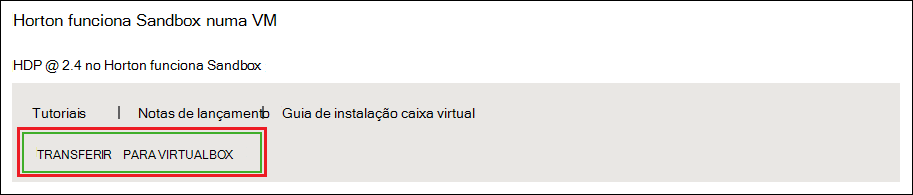
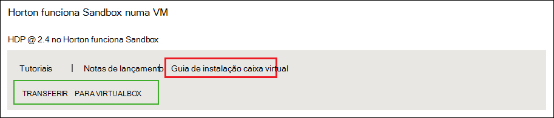
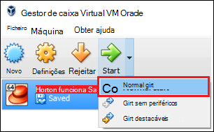

<properties
    pageTitle="Utilizar uma sandbox Hadoop para saber mais sobre Hadoop | Microsoft Azure"
    description="Para começar a aprender sobre como utilizar o ecossistema Hadoop, pode configurar uma sandbox Hadoop a partir do Hortonworks numa máquina virtual Azure. "
    keywords="emulador hadoop, hadoop sandbox"
    editor="cgronlun"
    manager="jhubbard"
    services="hdinsight"
    authors="nitinme"
    documentationCenter=""
    tags="azure-portal"/>

<tags
    ms.service="hdinsight"
    ms.workload="big-data"
    ms.tgt_pltfrm="na"
    ms.devlang="na"
    ms.topic="article"
    ms.date="08/24/2016"
    ms.author="nitinme"/>

# Começar a trabalhar no ecossistema Hadoop com uma sandbox Hadoop numa máquina virtual

Saiba como instalar o sandbox Hadoop a partir de Hortonworks numa máquina virtual para saber mais sobre o ecossistema Hadoop. O sandbox fornece um ambiente de desenvolvimento local para saber mais sobre Hadoop, distribuído ficheiro Hadoop sistema (HDFS) e submissão de tarefa.

## Pré-requisitos

* [Oracle VirtualBox](https://www.virtualbox.org/)

Assim que estiver familiarizado com Hadoop, pode começar a utilizar Hadoop no Azure através da criação de um cluster de HDInsight. Para mais informações sobre como começar, consulte o artigo [Introdução ao Hadoop no HDInsight](hdinsight-hadoop-linux-tutorial-get-started.md).

## Transfira e instale a máquina virtual

1. [Http://hortonworks.com/downloads/#sandbox](http://hortonworks.com/downloads/#sandbox), selecione o item de __Transferir para VIRTUALBOX__ para HDP 2.4 no Hortonworks Sandbox. Será pedido para registar com Hortonworks antes de começa a transferência.

    

2. A partir da mesma página web, selecione o __Guia de instalar VirtualBox__ para HDP 2.4 no Hortonworks Sandbox. Isto irá transferir um PDF que contém as instruções de instalação para a máquina virtual.

    

## Iniciar a máquina virtual

1. Iniciar VirtualBox, selecionar o Hortonworks Sandbox, selecione __Iniciar__e, em seguida, __Começar a Normal__.

    

2. Assim que a máquina virtual terminar o processo de arranque, será apresentada a instruções de início de sessão. Abra um browser e navegue para o URL apresentado (normalmente http://127.0.0.1:8888).

## Definir as palavras-passe

1. A partir do passo __começar__ da página Hortonworks Sandbox, selecione __Opções avançadas de visualização__. Utilize as informações nesta página para iniciar sessão sandbox utilizando SSH. Utilize o nome e palavra-passe fornecida.

    > [AZURE.NOTE] Se não tiver um cliente SSH instalado, pode utilizar o SSH baseada na web fornecido pela máquina virtual na __http://localhost:4200 /__.

    A primeira vez que liga através do SSH, vai ser-lhe para alterar a palavra-passe da conta de raiz. Introduza uma nova palavra-passe, que irão ser utilizada quando iniciar sessão utilizando SSH no futuro.

2. Assim que iniciar sessão, introduza o seguinte comando:

        ambari-admin-password-reset
    
    Quando lhe for pedido, forneça uma palavra-passe da conta de administrador Ambari. Isto vai ser utilizado quando acede a IU da Web de Ambari.

## Utilize o comando de ramo

1. A partir de uma ligação de SSH para o sandbox, utilize o seguinte comando para iniciar a shell de ramo:

        hive

2. Após ter começado a shell de, utilize o seguinte para ver as tabelas que são fornecidas com o sandbox:

        show tables;

3. Utilize o seguinte para obter as linhas de 10 a `sample_07` tabela:

        select * from sample_07 limit 10;

## Próximos passos

* [Saiba como utilizar o Visual Studio com a Hortonworks Sandbox](hdinsight-hadoop-emulator-visual-studio.md)
* [Os cabos de Sandbox a Hortonworks de formação](http://hortonworks.com/hadoop-tutorial/learning-the-ropes-of-the-hortonworks-sandbox/)
* [Tutorial Hadoop - introdução ao HDP](http://hortonworks.com/hadoop-tutorial/hello-world-an-introduction-to-hadoop-hcatalog-hive-and-pig/)