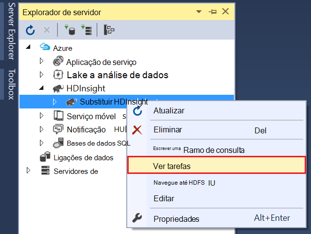

<properties
pageTitle="Utilize as ferramentas de Lake de dados do Microsoft Azure para Visual Studio com a Sandbox Hortonworks | Microsoft Azure"
description="Saiba como utilizar as ferramentas do Azure dados Lake para VIsual Studio com a sandbox Hortonworks (executar numa VM local). Com estas ferramentas, pode criar e executar tarefas ramo e porco em sandbox e vista de saída de tarefa e histórico."
services="hdinsight"
documentationCenter=""
authors="Blackmist"
manager="paulettm"
editor="cgronlun"/>

<tags
ms.service="hdinsight"
ms.devlang="na"
ms.topic="article"
ms.tgt_pltfrm="na"
ms.workload="big-data"
ms.date="08/26/2016"
ms.author="larryfr"/>

# Utilize as ferramentas de Lake do Azure dados para o Visual Studio com a Sandbox Hortonworks

As ferramentas de Azure dados Lake para Visual Studio incluem ferramentas para trabalhar com genéricos clusters de Hadoop, para além de ferramentas para trabalhar com o Azure dados Lake e HDInsight. Este artigo fornece os passos necessários para utilizar as ferramentas do Azure dados Lake com a Hortonworks Sandbox a ser executada numa máquina virtual local.

Utilizar o Hortonworks Sandbox permite-lhe trabalhar com Hadoop localmente no seu ambiente de desenvolvimento. Assim que tiver desenvolvido uma solução e pretende implementá-lo à escala, em seguida, pode mover a um cluster de HDInsight.

## Pré-requisitos

* O Hortonworks Sandbox a ser executada numa máquina virtual no seu ambiente de desenvolvimento. Este documento foi escrito e testado com sandbox a ser executada em VirtualBox Oracle, que foi configurado utilizando as informações no documento [começar no ecossistema Hadoop](hdinsight-hadoop-emulator-get-started.md) .

* Visual Studio 2013 ou qualquer edição de 2015.

* O [SDK do Azure para .NET](https://azure.microsoft.com/downloads/) 2.7.1 ou superior

* [Dados Azure Lake ferramentas para o Visual Studio](https://www.microsoft.com/download/details.aspx?id=49504)

## Configurar as palavras-passe para o sandbox

Certifique-se de que a Hortonworks Sandbox está em execução, em seguida, siga os passos em [começar no ecossistema Hadoop](hdinsight-hadoop-emulator-get-started.md#set-passwords) para configurar a palavra-passe para o SSH `root` conta e o Ambari `admin` conta. Estas palavras-passe será utilizada quando se liga à sandbox do Visual Studio.

## Ligar as ferramentas para o sandbox

1. Abrir o Visual Studio e selecione a __vista__, em seguida, __Server Explorer__.

2. __Server Explorer__, clique com o botão direito do rato na entrada de __HDInsight__ e, em seguida, selecione __ligar ao emulador HDInsight__.

    

3. Caixa de diálogo __ligar ao emulador HDInsight__ , introduza a palavra-passe que configurou para Ambari.

    

    Selecione __seguinte__ para continuar.

4. Utilizar o campo da __palavra-passe__ para introduzir a palavra-passe tiver configurado para o `root` conta. Deixe os outros campos com o valor predefinido.

    

    Selecione __seguinte__ para continuar.

5. Aguarde para validação dos serviços para concluir. Em alguns casos, validação poderá falhar e pedir-lhe para atualizar a configuração. Quando isto acontece, selecione o botão __Atualizar__ e aguarde que a configuração e a verificação do serviço concluir.

    

    > [AZURE.NOTE] O processo de atualização utiliza Ambari para modificar a configuração de Hortonworks Sandbox para o que é esperado às ferramentas do Azure dados Lake para Visual Studio.

    Quando tiver concluído a validação, selecione __Concluir__ para concluir a configuração.

    

    > [AZURE.NOTE] Dependendo da velocidade do seu ambiente de desenvolvimento e na quantidade de memória atribuída à máquina virtual, pode demorar alguns minutos para configurar e validar os serviços.

Depois de seguir estes passos, tem agora uma entrada de "HDInsight local cluster" no Explorador do servidor na secção HDInsight.

## Escrever uma consulta de ramo

Ramo fornece um idioma de consulta SQL gosto (HiveQL), para trabalhar com dados estruturados. Utilize os passos seguintes para saber como executar consultas ad-hoc contra o cluster local.

1. No __Explorador do servidor__, com o botão direito na entrada para o local cluster que adicionou anteriormente e, em seguida, selecione __escrever uma consulta de ramo__.

    

    Este procedimento abre uma nova janela de consulta que permite-lhe rapidamente escreva para cima e submeter uma consulta para o cluster local.

2. Na janela de nova consulta, introduza o seguinte:

        select count(*) from sample_08;
    
    A partir do topo da janela da consulta, certifique-se de que a configuração para o cluster local está seleccionado e, em seguida, selecione __Submeter__. Deixe os outros valores (__lote__ e nome de servidor,) os valores predefinidos.

    

    Tenha em atenção que também pode utilizar o menu pendente junto __Submeter__ para selecionar __Avançadas__. Esta ação abre uma caixa de diálogo que lhe fornecem opções adicionais ao submeter a tarefa.

    

3. Assim que submeter a consulta, irão aparecer o estado da tarefa. Este procedimento fornece informações sobre a tarefa esta é processada por Hadoop. A entrada de __Estado da tarefa__ fornece o estado atual da tarefa. O estado será atualizado periodicamente ou pode utilizar o ícone de atualizar para atualizar manualmente o estado.

    

    Assim que o __Estado da tarefa__ é alterado para __terminada__, é apresentada uma direcionado incluindo Graph (Comprimentos). Este exemplo descreve o caminho de execução que foi determinado pelo Tez (o execução motor predefinido para ramo no local cluster.) 
    
    > [AZURE.NOTE] Tez também é a predefinição quando utilizar clusters baseado em Linux HDInsight. Não é a predefinição no baseados no Windows HDInsight; para utilizá-lo aí, tem de adicionar a linha `set hive.execution.engine = tez;` para o início da sua consulta ramo. 

    Utilize a ligação de __Saída de tarefa__ para ver o resultado. Neste caso, é __823__; o número de linhas na tabela sample_08. Pode ver informações de diagnóstico sobre a tarefa utilizando as ligações de __Registo de projecto__ e __Transferir o registo de FIO__ .

4. Também pode executar tarefas de ramo de forma interativa alterando o __lote de__ campo para __interativo__e, em seguida, selecione __Executar__. 

    

    Isto transmite em fluxo o registo de saída gerado durante o processamento para a janela de __Saída HiveServer2__ .
    
    > [AZURE.NOTE] Este é as mesmas informações que está disponíveis a partir de ligação de __Registo de projecto__ depois de uma tarefa foi concluída.

    

## Criar um projeto de ramo

Também pode criar um projeto que contém vários ramo de scripts. Isto é útil quando tiver relacionadas scripts que tem de manter juntas ou manter utilizando um sistemas de controlo de versão.

1. No Visual Studio, selecione o __ficheiro__, __Nova__e then__Project__.

2. A partir da lista de projetos, expanda __modelos__, __Lake de dados do Azure__ e, em seguida, selecione __ramo (HDInsight)__. A partir da lista de modelos, selecione __Ramo de exemplo__. Introduza um nome e localização, em seguida, clique __em OK__.

    

O projecto __Ramo de exemplo__ contém dois scripts, __WebLogAnalysis.hql__ e __SensorDataAnalysis.hql__. Pode submeter estes com o botão __Submeter__ mesmo na parte superior da janela.

## Criar um projeto porco

Enquanto ramo fornece um idioma de SQL gosto para trabalhar com dados estruturados, porco fornece um idioma (porco Latim), que permite-lhe desenvolver um pipeline de transformações que são aplicados para os seus dados. Utilize os passos seguintes para utilizar porco com o cluster local.

1. Abrir o Visual Studio e selecione o __ficheiro__, __Novo__e, em seguida, __Project__. A partir da lista de projetos, expanda __modelos__, __Azure dados Lake__e, em seguida, selecione __porco (HDInsight)__. A partir da lista de modelos, selecione a __Aplicação de porco__. Introduza um nome, localização e, em seguida, clique __em OK__.

    

2. Como o conteúdo do ficheiro __script.pig__ que foi criado com este projeto, introduza o seguinte.

        a = LOAD '/demo/data/Website/Website-Logs' AS (
            log_id:int, 
            ip_address:chararray, 
            date:chararray, 
            time:chararray, 
            landing_page:chararray, 
            source:chararray);
        b = FILTER a BY (log_id > 100);
        c = GROUP b BY ip_address;
        DUMP c;

    Apesar de porco utiliza um idioma diferente que ramo, como executar as tarefas é consistente entre ambos os idiomas através do botão para __Submeter__ . Selecionar a lista pendente para baixo junto ao __Submeter__ é apresentada uma caixa de diálogo submeter avançadas para porco.

    
    
3. O estado da tarefa e o resultado também é apresentado o mesmo como uma ramo de consulta.

    

## Ver tarefas

Ferramentas de Lake dados Azure também lhe permitem para facilmente ver informações acerca das tarefas que foram executou no Hadoop. Utilize os passos seguintes para ver as tarefas que foram executou no local cluster.

1. A partir do __Explorador do servidor__, com o botão direito no local cluster e, em seguida, selecione __Ver tarefas__. Isto vai mostrar uma lista de tarefas que foram submetidas para cluster.

    

2. Na lista de tarefas, selecione um para ver os detalhes de tarefa.

    

    As informações apresentadas são semelhantes ao que vê depois de executar uma consulta ramo ou porco, completa com ligações para ver os resultados e registar informações.

3. Também pode modificar e submeta novamente a tarefa a partir daqui.

## Ver ramo de bases de dados

1. No __Explorador do servidor__, expanda a entrada de __HDInsight local cluster__ e, em seguida, expanda __Hive bases de dados__. Isto revela as bases de dados __predefinido__ e __xademo__ no local cluster. Expandir uma base de dados, são as tabelas da base de dados.

    

2. Expandir uma tabela apresenta as colunas dessa tabela. Pode com o botão direito numa tabela e selecione __Linhas de 100 principais de vista__ para ver rapidamente os dados.

    

### Propriedades da base de dados e tabela

É provavelmente, reparou que pode selecionar para visualizar as __Propriedades__ de uma base de dados ou uma tabela. Isto vai mostrar detalhes para o item selecionado na janela de propriedades.

### Criar uma tabela

Para criar uma nova tabela, com o botão direito numa base de dados e, em seguida, selecione __Create Table__.

Em seguida, pode criar a tabela utilizando um formulário. Pode ver o HiveQL bruto que será utilizada para criar a tabela na parte inferior desta página.

## Próximos passos

* [Cabos de Sandbox a Hortonworks de formação](http://hortonworks.com/hadoop-tutorial/learning-the-ropes-of-the-hortonworks-sandbox/)
* [Tutorial Hadoop - introdução ao HDP](http://hortonworks.com/hadoop-tutorial/hello-world-an-introduction-to-hadoop-hcatalog-hive-and-pig/)