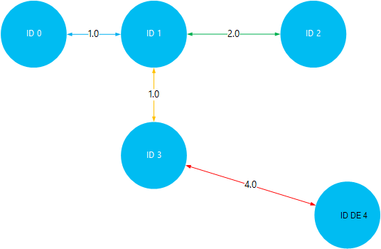

<properties
    pageTitle="Instalar e utilizar Giraph no HDInsight baseado em Linux (Hadoop) | Microsoft Azure"
    description="Saiba como instalar Giraph no clusters baseado em Linux HDInsight utilizar ações de Script. Acções de script permitem-lhe personalizar o cluster durante a criação, ao alterar a configuração do cluster ou instalar utilitários e serviços."
    services="hdinsight"
    documentationCenter=""
    authors="Blackmist"
    manager="jhubbard"
    editor="cgronlun"
    tags="azure-portal"/>

<tags
    ms.service="hdinsight"
    ms.workload="big-data"
    ms.tgt_pltfrm="na"
    ms.devlang="na"
    ms.topic="article"
    ms.date="10/17/2016"
    ms.author="larryfr"/>

# Instale Giraph no clusters HDInsight Hadoop e utilizar Giraph para processar gráficos em grande escala

Pode instalar o Giraph em qualquer tipo de cluster no Hadoop no Azure HDInsight ao utilizar a **Ação de Script** para personalizar um cluster de.

Este tópico vai aprender a instalar Giraph ao utilizar a ação de Script. Assim que tiver instalado Giraph, também irá Saiba como utilizar Giraph para as aplicações mais típicas, que está a processar gráficos em grande escala.

> [AZURE.NOTE] As informações neste artigo são específicas a clusters baseado em Linux HDInsight. Para obter informações sobre como trabalhar com clusters baseados no Windows, consulte o artigo [Instalar Giraph sobre clusters de HDInsight Hadoop (Windows)](hdinsight-hadoop-giraph-install.md)

## O que é Giraph?

[Apache Giraph](http://giraph.apache.org/) permite-lhe executar graph processamento utilizando Hadoop e podem ser utilizados com Azure HDInsight. Gráficos do modelo de relações entre objetos, tais como as ligações entre routers numa rede grandes, como na Internet ou relações entre as pessoas em redes sociais (por vezes designado por um gráfico de rede social). Processamento de Graph permite-lhe para motivo sobre as relações entre objetos num gráfico, tais como:

- Identificar amigos potenciais com base no seu relações atuais.
- Identificar a rota mais curta entre dois computadores numa rede.
- Calcular a classificação de página de páginas Web.

> [AZURE.WARNING] Componentes fornecidos com o cluster HDInsight são totalmente suportadas e o Microsoft Support irá ajudar a identificar e resolver problemas relacionados com a estes componentes.
>
> Componentes personalizados, tal como Giraph, recebem faremos suporte para o ajudar a resolver ainda mais o problema. Isto poderá resultar em resolver o problema ou pedir-lhe para participar canais disponíveis para as tecnologias de abrir origem onde se encontram conhecimentos abrangente para essa tecnologia. Por exemplo, existem muitos sites de Comunidade que podem ser utilizados, tal como: [Fórum MSDN para HDInsight](https://social.msdn.microsoft.com/Forums/azure/en-US/home?forum=hdinsight), [http://stackoverflow.com](http://stackoverflow.com). Também projetos Apache tem sites de projeto no [http://apache.org](http://apache.org), por exemplo: [Hadoop](http://hadoop.apache.org/).

##O que faz o script

Este script efetua as seguintes ações:

* Instalações Giraph para`/usr/hdp/current/giraph`
* Cópias de `giraph-examples.jar` ficheiro ao armazenamento de predefinido (WASB) para o seu cluster:`/example/jars/giraph-examples.jar`

## Instalar Giraph utilizar ações de Script

Um exemplo de script para instalar Giraph num HDInsight cluster está disponível na seguinte localização.

    https://hdiconfigactions.blob.core.windows.net/linuxgiraphconfigactionv01/giraph-installer-v01.sh

Esta secção fornece instruções sobre como utilizar o script de exemplo ao criar o cluster utilizando o Portal do Azure. 

> [AZURE.NOTE] Azure PowerShell, o clip do Azure, o HDInsight .NET SDK ou Gestor de recursos do Azure modelos podem também ser utilizados para aplicar acções de script. Também pode aplicar acções de script para já executado clusters. Para mais informações, consulte o artigo [Personalizar HDInsight clusters com ações de Script](hdinsight-hadoop-customize-cluster-linux.md).

1. Começar a criar um cluster utilizando os passos em [clusters baseado em criar Linux HDInsight](hdinsight-hadoop-create-linux-clusters-portal.md), mas não concluir a criação.

2. No pá **Configuração opcional** , selecione **Ações de Script**e forneça as informações abaixo:

    * __Nome__: introduza um nome amigável para a ação de script.
    * __URI de SCRIPT__: https://hdiconfigactions.blob.core.windows.net/linuxgiraphconfigactionv01/giraph-installer-v01.sh
    * __HEAD__: selecione esta opção
    * __TRABALHADOR__: deixe este desmarcada
    * __ZOOKEEPER__: deixe este desmarcada
    * __Parâmetros__: deixe este campo em branco

3. Na parte inferior das **Ações de Script**, utilize o botão **Selecionar** para guardar a configuração. Por fim, utilize o botão **Selecione** na parte inferior da pá a **Configuração opcional** para guardar as informações de configuração opcional.

4. Continue a criar o cluster, tal como descrito em [clusters baseado em criar Linux HDInsight](hdinsight-hadoop-create-linux-clusters-portal.md).

## Como posso utilizar Giraph no HDInsight?

Assim que o cluster terminar de criar, utilize os seguintes passos para executar o exemplo SimpleShortestPathsComputation incluído com o Giraph. Isto implementa a implementação de <a href = "http://people.apache.org/~edwardyoon/documents/pregel.pdf">Pregel</a> básico para encontrar o caminho mais curto entre objetos num gráfico.

1. Ligar ao cluster HDInsight utilizando SSH:

        ssh USERNAME@CLUSTERNAME-ssh.azurehdinsight.net

    Para obter mais informações sobre como utilizar SSH com HDInsight, consulte o seguinte:

    * [Utilizar SSH com baseado em Linux Hadoop no HDInsight Linux, Unix ou OS X](hdinsight-hadoop-linux-use-ssh-unix.md)

    * [Utilizar SSH com baseado em Linux Hadoop no HDInsight a partir do Windows](hdinsight-hadoop-linux-use-ssh-windows.md)

1. Utilize o seguinte para criar um novo ficheiro chamado __tiny_graph.txt__:

        nano tiny_graph.txt

    Utilize o seguinte como o conteúdo deste ficheiro:

        [0,0,[[1,1],[3,3]]]
        [1,0,[[0,1],[2,2],[3,1]]]
        [2,0,[[1,2],[4,4]]]
        [3,0,[[0,3],[1,1],[4,4]]]
        [4,0,[[3,4],[2,4]]]

    Estes dados descreve uma relação entre objetos num gráfico direccionado, utilizando o formato [origem\_id, origem\_valor, [[destino\_id], [limite\_valor];...]]. Cada linha representa uma relação entre uma **origem\_id** objeto e um ou mais **destino\_id** objetos. O **limite\_valor** (ou de espessura) pode ser considerado como a intensidade ou distância da ligação entre **source_id** e **destino\_id**.

    Desenhado saída, e utilizar o valor (ou a espessura) como a distância entre objetos, os dados acima poderá ser semelhante a:

    

2. Para guardar o ficheiro, utilize __Ctrl + X__, em seguida, __Y__e, por fim __Enter__ para aceitar o nome de ficheiro.

3. Utilize o seguinte para armazenar os dados para o armazenamento principal para o seu cluster HDInsight:

        hdfs dfs -put tiny_graph.txt /example/data/tiny_graph.txt

4. Execute o exemplo SimpleShortestPathsComputation utilizando o seguinte comando.

         yarn jar /usr/hdp/current/giraph/giraph-examples.jar org.apache.giraph.GiraphRunner org.apache.giraph.examples.SimpleShortestPathsComputation -ca mapred.job.tracker=headnodehost:9010 -vif org.apache.giraph.io.formats.JsonLongDoubleFloatDoubleVertexInputFormat -vip /example/data/tiny_graph.txt -vof org.apache.giraph.io.formats.IdWithValueTextOutputFormat -op /example/output/shortestpaths -w 2

    Os parâmetros utilizados com este comando são descritos na seguinte tabela.

  	| Parâmetro | O que faz |
  	| --------- | ------------ |
  	| `jar /usr/hdp/current/giraph/giraph-examples.jar` | O ficheiro para caixa que contém os exemplos. |
  	| `org.apache.giraph.GiraphRunner` | A classe utilizada para iniciar os exemplos. |
  	| `org.apache.giraph.examples.SimpleShortestPathsCoputation` | O exemplo que será executada. Neste caso,-lo será calcular o caminho mais curto entre 1 de ID e todos os outros IDs no gráfico. |
  	| `-ca mapred.job.tracker=headnodehost:9010` | Headnode para o cluster. |
  	| `-vif org.apache.giraph.io.formats.JsonLongDoubleFloatDoubleVertexInputFromat` | O formato de teclado para utilizar os dados de entrada. |
  	| `-vip /example/data/tiny_graph.txt` | O ficheiro de dados de entrada. |
  	| `-vof org.apache.giraph.io.formats.IdWithValueTextOutputFormat` | O formato de saída. Neste caso, ID e valor como texto simples. |
  	| `-op /example/output/shortestpaths` | A localização de saída. |
  	| `-w 2` | O número de trabalhadores para utilizar. Neste caso, 2. |

    Para obter mais informações sobre estes e outros parâmetros utilizados com Giraph amostras, consulte o [Guia de introdução do Giraph](http://giraph.apache.org/quick_start.html).

5. Assim que a tarefa de terminar, os resultados serão armazenados na __wasbs: / / / exemplo/saída/shotestpaths__ diretório. Os ficheiros criados vai começar com __Peça-m -__ e de fim com um número que indica o primeiro, segundo, ficheiro etc.. Utilize o seguinte para ver os resultados:

        hdfs dfs -text /example/output/shortestpaths/*

    O resultado deverá ser semelhante ao seguinte:

        0   1.0
        4   5.0
        2   2.0
        1   0.0
        3   1.0

    SimpleShortestPathComputation exemplo é difícil codificada para começar com 1 de ID do objeto e localize o caminho mais curto a outros objetos. Para que o resultado deve ser lido como `destination_id distance`, onde a distância é o valor (ou a espessura) das extremidades passadas entre 1 de ID do objeto e o ID de destino.

    Visualizar isto, pode verificar os resultados por em viagem os caminhos de threads mais curto entre 1 de ID e todos os outros objetos. Tenha em atenção o caminho mais curto entre 1 de ID e ID 4 for a 5. Esta é a distância total entre 1 de ID e 3e, em seguida, ID 3 e 4.

    

## Próximos passos

- [Instalar e utilizar clusters de matiz no HDInsight](hdinsight-hadoop-hue-linux.md). Matiz é uma web IU torna mais fácil criar, executar e guardar porco e ramo de tarefas, bem como o armazenamento de predefinido utilizado para procurar o HDInsight cluster.

- [Instalar R em HDInsight clusters](hdinsight-hadoop-r-scripts-linux.md): instruções sobre como utilizar cluster personalização instalar e utilizar R sobre clusters de HDInsight Hadoop. R é um idioma abrir origem e um ambiente para computação de estatística. Fornece centenas de funções de estatística incorporadas e as suas próprias linguagem de programação que combina aspetos de programação funcional e orientada para objectos. Fornece também capacidades gráficas extensas.

- [Instalar Solr sobre clusters de HDInsight](hdinsight-hadoop-solr-install-linux.md). Utilize a personalização de cluster para instalar Solr HDInsight Hadoop clusters. Solr permite-lhe efetuar operações de procura poderosa nos dados armazenados.
