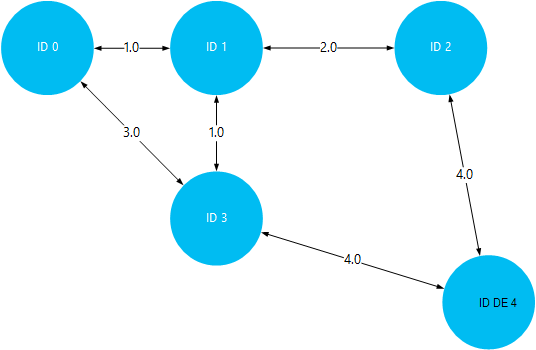

<properties
    pageTitle="Instalar e utilizar Giraph no clusters de Hadoop HDInsight | Microsoft Azure"
    description="Saiba como personalizar cluster de HDInsight com Giraph e como utilizar Giraph."
    services="hdinsight"
    documentationCenter=""
    authors="nitinme"
    manager="jhubbard"
    editor="cgronlun"
    tags="azure-portal"/>

<tags
    ms.service="hdinsight"
    ms.workload="big-data"
    ms.tgt_pltfrm="na"
    ms.devlang="na"
    ms.topic="article"
    ms.date="02/05/2016"
    ms.author="nitinme"/>

# Instalar e utilizar Giraph no HDInsight

Saiba como personalizar cluster do Windows baseada em HDInsight com Giraph utilizando Script ação e como utilizar Giraph para processar gráficos em grande escala. Para obter informações sobre como utilizar Giraph com um cluster de Linux, consulte o artigo [Instalar Giraph sobre clusters de HDInsight Hadoop (Linux)](hdinsight-hadoop-giraph-install-linux.md).
 
Pode instalar Giraph em qualquer tipo de cluster (Hadoop, tempestade, HBase, motores) no Azure HDInsight utilizando *Script ação*. Um exemplo de script para instalar Giraph num HDInsight cluster está disponível a partir de um blob armazenamento Azure só de leitura na [https://hdiconfigactions.blob.core.windows.net/giraphconfigactionv01/giraph-installer-v01.ps1](https://hdiconfigactions.blob.core.windows.net/giraphconfigactionv01/giraph-installer-v01.ps1). Exemplo de script funciona apenas com a versão de cluster de HDInsight 3.1. Para mais informações sobre as versões de cluster HDInsight, consulte o artigo [versões de cluster HDInsight](hdinsight-component-versioning.md).

**Artigos relacionados**

- [Instalar o Giraph no clusters HDInsight Hadoop (Linux)](hdinsight-hadoop-giraph-install-linux.md)
- [Criar Hadoop clusters no HDInsight](hdinsight-provision-clusters.md): informações gerais sobre a criação de HDInsight clusters.
- [Personalizar cluster de HDInsight utilizando a ação de Script][hdinsight-cluster-customize]: informações gerais sobre a personalização de clusters HDInsight utilizando a ação de Script.
- [Acção de Script desenvolver scripts para HDInsight](hdinsight-hadoop-script-actions.md).

## O que é Giraph?

<a href="http://giraph.apache.org/" target="_blank">Apache Giraph</a> permite-lhe executar graph processamento utilizando Hadoop e podem ser utilizados com Azure HDInsight. Gráficos do modelo de relações entre objetos, tais como as ligações entre routers numa rede grandes, como na Internet ou relações entre as pessoas em redes sociais (por vezes designado por um gráfico de rede social). Processamento de Graph permite-lhe para motivo sobre as relações entre objetos num gráfico, tais como:

- Identificar amigos potenciais com base no seu relações atuais.
- Identificar a rota mais curta entre dois computadores numa rede.
- Calcular a classificação de página de páginas Web.

## Instalar Giraph através do portal

1. Começar a criar um cluster utilizando a opção **Criar PERSONALIZADO** , tal como descrito em [clusters de criar Hadoop HDInsight](hdinsight-provision-clusters.md#portal).
2. Na página **Acções de Script** do assistente, clique em **Adicionar ação de script** para fornecer detalhes sobre a ação de script, conforme apresentado abaixo:

    ![Acção de Script de utilização para personalizar um cluster de] (./media/hdinsight-hadoop-giraph-install/hdi-script-action-giraph.png "Acção de Script de utilização para personalizar um cluster de")

    <table border='1'>
        <tr><th>Propriedade</th><th>Valor</th></tr>
        <tr><td>Nome</td>
            <td>Especifique um nome para a ação de script. Por exemplo, <b>Giraph instalar</b>.</td></tr>
        <tr><td>Script URI</td>
            <td>Especifique o URI Uniform Resource Identifier () para o script que é chamado para personalizar o cluster. Por exemplo, <i>https://hdiconfigactions.blob.core.windows.net/giraphconfigactionv01/giraph-installer-v01.ps1</i></td></tr>
        <tr><td>Tipo de nó</td>
            <td>Especifique os nós onde for executado o script de personalização. Pode escolher <b>todos os nós</b>, <b>apenas nós de cabeça</b>ou <b>apenas nós de trabalho</b>.
        <tr><td>Parâmetros</td>
            <td>Especifique os parâmetros, se necessário pelo script. O script para instalar o Giraph não requer quaisquer parâmetros, pelo que pode deixar esta em branco.</td></tr>
    </table>

    Pode adicionar mais do que uma ação de script para instalar vários componentes no cluster. Depois de ter adicionado os scripts, clique em marca de verificação para começar a criar o cluster.

## Utilizar Giraph

Utilizamos o SimpleShortestPathsComputation exemplo para demonstrar a implementação de <a href = "http://people.apache.org/~edwardyoon/documents/pregel.pdf">Pregel</a> básico para encontrar o caminho mais curto entre objetos num gráfico. Utilize os passos seguintes para carregar os dados de exemplo e a para caixa amostra, execute uma tarefa ao utilizar o exemplo SimpleShortestPathsComputation e, em seguida, visualize os resultados.

1. Carregar um ficheiro de dados de exemplo para o armazenamento de Blobs do Azure. No seu estação de trabalho local, crie um novo ficheiro chamado **tiny_graph.txt**. Deve conter as linhas seguintes:

        [0,0,[[1,1],[3,3]]]
        [1,0,[[0,1],[2,2],[3,1]]]
        [2,0,[[1,2],[4,4]]]
        [3,0,[[0,3],[1,1],[4,4]]]
        [4,0,[[3,4],[2,4]]]

    Carregar o ficheiro de tiny_graph.txt para o armazenamento principal para o seu cluster HDInsight. Para obter instruções sobre como carregar dados, consulte o artigo [carregar dados para trabalhos de Hadoop no HDInsight](hdinsight-upload-data.md).

    Estes dados descreve uma relação entre objetos num gráfico direccionado, utilizando o formato [origem\_id, origem\_valor, [[destino\_id], [limite\_valor];...]]. Cada linha representa uma relação entre uma **origem\_id** objeto e um ou mais **destino\_id** objetos. O **limite\_valor** (ou de espessura) pode ser considerado como a intensidade ou distância da ligação entre **source_id** e **destino\_id**.

    Desenhado saída, e utilizar o valor (ou a espessura) como a distância entre objetos, os dados acima poderá ser semelhante a:

    

4. Execute o exemplo SimpleShortestPathsComputation. Utilize os seguintes cmdlets Azure PowerShell para executar o exemplo utilizando o ficheiro de tiny_graph.txt como entrada. 

    [AZURE.INCLUDE [upgrade-powershell](../../includes/hdinsight-use-latest-powershell.md)]

        $clusterName = "clustername"
        # Giraph examples jar
        $jarFile = "wasbs:///example/jars/giraph-examples.jar"
        # Arguments for this job
        $jobArguments = "org.apache.giraph.examples.SimpleShortestPathsComputation",
                        "-ca", "mapred.job.tracker=headnodehost:9010",
                        "-vif", "org.apache.giraph.io.formats.JsonLongDoubleFloatDoubleVertexInputFormat",
                        "-vip", "wasbs:///example/data/tiny_graph.txt",
                        "-vof", "org.apache.giraph.io.formats.IdWithValueTextOutputFormat",
                        "-op",  "wasbs:///example/output/shortestpaths",
                        "-w", "2"
        # Create the definition
        $jobDefinition = New-AzureHDInsightMapReduceJobDefinition
          -JarFile $jarFile
          -ClassName "org.apache.giraph.GiraphRunner"
          -Arguments $jobArguments

        # Run the job, write output to the Azure PowerShell window
        $job = Start-AzureHDInsightJob -Cluster $clusterName -JobDefinition $jobDefinition
        Write-Host "Wait for the job to complete ..." -ForegroundColor Green
        Wait-AzureHDInsightJob -Job $job
        Write-Host "STDERR"
        Get-AzureHDInsightJobOutput -Cluster $clusterName -JobId $job.JobId -StandardError
        Write-Host "Display the standard output ..." -ForegroundColor Green
        Get-AzureHDInsightJobOutput -Cluster $clusterName -JobId $job.JobId -StandardOutput

    No exemplo acima, substitua o **nome de cluster** com o nome do seu cluster de HDInsight tem Giraph instalado.

5. Ver os resultados. Assim que a tarefa de terminar, os resultados serão armazenados nas duas ficheiros de saída no __wasbs: / / / exemplo/saída/shotestpaths__ pasta. Os ficheiros são denominados __Peça-m-00001__ e __Peça-m-00002__. Execute os seguintes passos para transferir e ver os resultados:

        $subscriptionName = "<SubscriptionName>"       # Azure subscription name
        $storageAccountName = "<StorageAccountName>"   # Azure Storage account name
        $containerName = "<ContainerName>"             # Blob storage container name

        # Select the current subscription
        Select-AzureSubscription $subscriptionName

        # Create the Storage account context object
        $storageAccountKey = Get-AzureStorageKey $storageAccountName | %{ $_.Primary }
        $storageContext = New-AzureStorageContext -StorageAccountName $storageAccountName -StorageAccountKey $storageAccountKey

        # Download the job output to the workstation
        Get-AzureStorageBlobContent -Container $containerName -Blob example/output/shortestpaths/part-m-00001 -Context $storageContext -Force
        Get-AzureStorageBlobContent -Container $containerName -Blob example/output/shortestpaths/part-m-00002 -Context $storageContext -Force

    Isto irá criar a estrutura do directório de __saída/exemplo/shortestpaths__ no diretório atual na sua estação de trabalho e transferir os ficheiros de duas saída até essa localização.

    Utilize o cmdlet __gato__ para apresentar os conteúdos dos ficheiros:

        Cat example/output/shortestpaths/part*

    O resultado deverá ser semelhante ao seguinte:

        0   1.0
        4   5.0
        2   2.0
        1   0.0
        3   1.0

    SimpleShortestPathComputation exemplo é difícil codificada para começar com 1 de ID do objeto e localize o caminho mais curto a outros objetos. Para que o resultado deve ser lido como `destination_id distance`, onde a distância é o valor (ou a espessura) das extremidades passadas entre 1 de ID do objeto e o ID de destino.

    Visualizar isto, pode verificar os resultados por em viagem os caminhos de threads mais curto entre 1 de ID e todos os outros objetos. Tenha em atenção o caminho mais curto entre 1 de ID e ID 4 for a 5. Esta é a distância total entre 1 de ID e 3e, em seguida, ID 3 e 4.

    

## Instalar Giraph através do Aure PowerShell

Consulte o artigo [Personalizar HDInsight clusters utilizando Script ação](hdinsight-hadoop-customize-cluster.md#call_scripts_using_powershell).  O exemplo demonstra como instalar motores através do Azure PowerShell. Tem de personalizar o script para utilizar [https://hdiconfigactions.blob.core.windows.net/giraphconfigactionv01/giraph-installer-v01.ps1](https://hdiconfigactions.blob.core.windows.net/giraphconfigactionv01/giraph-installer-v01.ps1).

## Instalar Giraph utilizando .NET SDK

Consulte o artigo [Personalizar HDInsight clusters utilizando Script ação](hdinsight-hadoop-customize-cluster.md#call_scripts_using_azure_powershell). O exemplo demonstra como instalar motores utilizando o SDK .NET. Tem de personalizar o script para utilizar [https://hdiconfigactions.blob.core.windows.net/giraphconfigactionv01/giraph-installer-v01.ps1](https://hdiconfigactions.blob.core.windows.net/giraphconfigactionv01/giraph-installer-v01.ps1).

## Consulte também

- [Instalar o Giraph no clusters HDInsight Hadoop (Linux)](hdinsight-hadoop-giraph-install-linux.md)
- [Criar Hadoop clusters no HDInsight](hdinsight-provision-clusters.md): informações gerais sobre a criação de HDInsight clusters.
- [Personalizar cluster de HDInsight utilizando a ação de Script][hdinsight-cluster-customize]: informações gerais sobre a personalização de clusters HDInsight utilizando a ação de Script.
- [Acção de Script desenvolver scripts para HDInsight](hdinsight-hadoop-script-actions.md).
- [Instalar e utilizar motores no HDInsight clusters][hdinsight-install-spark]: exemplo de Script ação sobre como instalar motores.
- [Instalar o R HDInsight clusters][hdinsight-install-r]: exemplo de Script ação sobre como instalar R.
- [Instalar Solr em HDInsight clusters](hdinsight-hadoop-solr-install.md): exemplo de Script ação sobre como instalar Solr.

[tools]: https://github.com/Blackmist/hdinsight-tools
[aps]: http://azure.microsoft.com/documentation/articles/install-configure-powershell/

[powershell-install]: ../powershell-install-configure.md
[hdinsight-provision]: hdinsight-provision-clusters.md
[hdinsight-install-r]: hdinsight-hadoop-r-scripts.md
[hdinsight-install-spark]: hdinsight-hadoop-spark-install.md
[hdinsight-cluster-customize]: hdinsight-hadoop-customize-cluster.md
