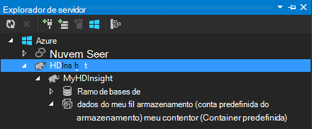
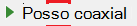

<properties
    pageTitle="Utilizar c# com ramo e porco no Hadoop no HDInsight | Microsoft Azure"
    description="Saiba como utilizar c# funções definidas pelo utilizador (UDF) com ramo e porco transmissão no Azure HDInsight."
    services="hdinsight"
    documentationCenter=""
    authors="Blackmist"
    manager="jhubbard"
    editor="cgronlun"
    tags="azure-portal"/>

<tags
    ms.service="hdinsight"
    ms.workload="big-data"
    ms.tgt_pltfrm="na"
    ms.devlang="dotnet"
    ms.topic="article"
    ms.date="10/28/2016"
    ms.author="larryfr"/>

#Utilizar funções definidas pelo utilizador c# com ramo e porco transmissão no Hadoop no HDInsight

Ramo e porco são perfeitos para trabalhar com dados no Azure HDInsight, mas, por vezes, necessitar de um idioma uso mais geral. Ramo e porco permitem-lhe para código externo através de funções definidas pelo utilizador (UDFs) ou de transmissão de chamadas.

Neste documento, saiba como utilizar c# com ramo e porco.

##Pré-requisitos

* Windows 7 ou mais recente.

* Visual Studio com as seguintes versões:

    * Visual Studio 2012 Professional/Premium/Ultimate com [atualização 4](http://www.microsoft.com/download/details.aspx?id=39305)

    * Visual Studio 2013 Comunidade/Professional/Premium/Ultimate com [atualização 4](https://www.microsoft.com/download/details.aspx?id=44921)

    * Visual Studio 2015

* Consulte o artigo Hadoop num cluster de HDInsight - [aprovisionar um cluster de HDInsight](hdinsight-provision-clusters.md) para obter os passos para criar um cluster

* Ferramentas de Hadoop para Visual Studio. Consulte o artigo [começar a utilizar o HDInsight Hadoop ferramentas para o Visual Studio](hdinsight-hadoop-visual-studio-tools-get-started.md) para obter passos sobre como instalar e configurar as ferramentas.

##.NET no HDInsight

O .NET comuns CLR language runtime () e os quadros são instalados por predefinição nos clusters HDInsight baseados no Windows. Esta opção permite-lhe utilizar as aplicações c# com ramo e porco transmissão (dados lhe são transmitidos entre ramo/porco e a aplicação c# através do stdout/stdin).

> [AZURE.NOTE] Neste momento não existe suporte para executar o .NET Framework UDFs em clusters baseado em Linux HDInsight. 

##.NET e transmissão

Transmissão envolve ramo e porco transmitir dados para uma aplicação externa ao longo do stdout e receber os resultados ao longo do stdin. Para c# aplicações, isto é mais facilmente feito através do `Console.ReadLine()` e `Console.WriteLine()`.

Uma vez que ramo e porco precisar invocar a aplicação em tempo de execução, o modelo de **Aplicação de consola** deve ser utilizado para os seus projetos c#.

##Ramo e C e #35;

###Criar projeto c#

1. Abrir o Visual Studio e criar uma nova solução. Para o tipo de projeto, selecione a **Aplicação de consola**e o novo projeto **HiveCSharp**de nome.

2. Substitua os conteúdos de **Program.cs** com o seguinte:

        using System;
        using System.Security.Cryptography;
        using System.Text;
        using System.Threading.Tasks;

        namespace HiveCSharp
        {
            class Program
            {
                static void Main(string[] args)
                {
                    string line;
                    // Read stdin in a loop
                    while ((line = Console.ReadLine()) != null)
                    {
                        // Parse the string, trimming line feeds
                        // and splitting fields at tabs
                        line = line.TrimEnd('\n');
                        string[] field = line.Split('\t');
                        string phoneLabel = field[1] + ' ' + field[2];
                        // Emit new data to stdout, delimited by tabs
                        Console.WriteLine("{0}\t{1}\t{2}", field[0], phoneLabel, GetMD5Hash(phoneLabel));
                    }
                }
                /// 

                /// Returns an MD5 hash for the given string
                /// 

                /// <param name="input">string value</param>
                /// <returns>an MD5 hash</returns>
                static string GetMD5Hash(string input)
                {
                    // Step 1, calculate MD5 hash from input
                    MD5 md5 = System.Security.Cryptography.MD5.Create();
                    byte[] inputBytes = System.Text.Encoding.ASCII.GetBytes(input);
                    byte[] hash = md5.ComputeHash(inputBytes);

                    // Step 2, convert byte array to hex string
                    StringBuilder sb = new StringBuilder();
                    for (int i = 0; i < hash.Length; i++)
                    {
                        sb.Append(hash[i].ToString("x2"));
                    }
                    return sb.ToString();
                }
            }
        }

3. Construa o projeto.

###Carregar para o armazenamento

1. No Visual Studio, abra o **Explorador de servidor**.

3. Expanda **Azure**e, em seguida, expanda **HDInsight**.

4. Se lhe for pedido, introduza as suas credenciais de subscrição Azure e, em seguida, clique em **Iniciar sessão**.

5. Expanda cluster HDInsight que pretende implementar esta aplicação e, em seguida, expanda **A conta predefinida do armazenamento**.

    

6. Faça duplo clique em **Contentor predefinida** para o cluster. Isto irá abrir uma nova janela que apresenta o conteúdo do contentor predefinido.

7. Clique no ícone de carregamento e, em seguida, navegue para a pasta de **bin\debug** para o projeto **HiveCSharp** . Por fim, selecione o ficheiro **HiveCSharp.exe** e clique em **Ok**.

    

8. Quando tiver terminado o carregamento, será possível utilizar a aplicação a partir de uma consulta de ramo.

###Ramo de consulta

1. No Visual Studio, abra o **Explorador de servidor**.

2. Expanda **Azure**e, em seguida, expanda **HDInsight**.

5. Com o botão direito do cluster que é implementado a aplicação de **HiveCSharp** para e, em seguida, selecione a **escrever uma consulta ramo de registo**.

6. Utilize o seguinte para a consulta ramo:

        add file wasbs:///HiveCSharp.exe;

        SELECT TRANSFORM (clientid, devicemake, devicemodel)
        USING 'HiveCSharp.exe' AS
        (clientid string, phoneLabel string, phoneHash string)
        FROM hivesampletable
        ORDER BY clientid LIMIT 50;

    Isto seleciona o `clientid`, `devicemake`, e `devicemodel` campos de `hivesampletable`e transmite os campos para a aplicação HiveCSharp.exe. A consulta espera a aplicação para devolver três campos estão armazenados como `clientid`, `phoneLabel`, e `phoneHash`. A consulta espera, também localizar HiveCSharp.exe na raiz do contentor de armazenamento predefinido (`add file wasbs:///HiveCSharp.exe`).

5. Clique em **Submeter** para submeter a tarefa ao HDInsight cluster. A janela de **Ramo de resumo da tarefa** será aberta.

6. Clique em **Atualizar** para atualizar o resumo até se transformar **concluída** **Estado da tarefa** . Para ver o resultado da tarefa, clique em **Tarefa de saída**.

##Porco e C e #35;

###Criar projeto c#

1. Abrir o Visual Studio e criar uma nova solução. Para o tipo de projeto, selecione a **Aplicação de consola**e o novo projeto **PigUDF**de nome.

2. Substitua o conteúdo do ficheiro **Program.cs** com o seguinte:

        using System;

        namespace PigUDF
        {
            class Program
            {
                static void Main(string[] args)
                {
                    string line;
                    // Read stdin in a loop
                    while ((line = Console.ReadLine()) != null)
                    {
                        // Fix formatting on lines that begin with an exception
                        if(line.StartsWith("java.lang.Exception"))
                        {
                            // Trim the error info off the beginning and add a note to the end of the line
                            line = line.Remove(0, 21) + " - java.lang.Exception";
                        }
                        // Split the fields apart at tab characters
                        string[] field = line.Split('\t');
                        // Put fields back together for writing
                        Console.WriteLine(String.Join("\t",field));
                    }
                }
            }
        }

    Esta aplicação irá analisar as linhas de enviadas a partir do porco e linhas de reformatar que começam com `java.lang.Exception`.

3. Guardar **Program.cs**e, em seguida, crie o projeto.

###Carregar a aplicação

1. Porco transmissão espera a aplicação para ser local no sistema de ficheiros de cluster. Ativar o ambiente de trabalho remoto para HDInsight cluster e, em seguida, ligue-lo ao seguir as instruções em [ligar ao clusters HDInsight utilizando o RDP](hdinsight-administer-use-management-portal.md#rdp).

2. Quando estiver ligado, copie **PigUDF.exe** do diretório **posição/depuração** para o projeto PigUDF no seu computador local e colá-lo ao diretório **PIG_HOME %** no cluster.

###Utilizar a aplicação a partir do porco Latim

1. A partir da sessão de ambiente de trabalho remoto, comece a linha de comandos Hadoop utilizando o ícone de **linha de comandos Hadoop** no ambiente de trabalho.

2. Utilize o seguinte para começar a linha de comandos porco:

        cd %PIG_HOME%
        bin\pig

    Será apresentada com uma `grunt>` linha de comandos.

3. Introduza o seguinte para executar uma tarefa de porco simple, utilizando a aplicação do .NET Framework:

        DEFINE streamer `pigudf.exe` SHIP('pigudf.exe');
        LOGS = LOAD 'wasbs:///example/data/sample.log' as (LINE:chararray);
        LOG = FILTER LOGS by LINE is not null;
        DETAILS = STREAM LOG through streamer as (col1, col2, col3, col4, col5);
        DUMP DETAILS;

    O `DEFINE` declaração cria um alias de `streamer` para as aplicações de pigudf.exe e `SHIP` distribui-lo através de nós no cluster. Mais tarde, `streamer` é utilizada com a `STREAM` operador para processar linhas únicas contidas no registo e devolver os dados como uma série de colunas.

> [AZURE.NOTE] O nome da aplicação que é utilizado para transmissão tem de ser escrito entre o \` (backtick) caráter quando receber um alias, e ' (plica) quando utilizado com `SHIP`.

3. Depois de introduzir a última linha, deverá começar a tarefa. Eventualmente irá devolver saída semelhante ao seguinte:

        (2012-02-03 20:11:56 SampleClass5 [WARN] problem finding id 1358451042 - java.lang.Exception)
        (2012-02-03 20:11:56 SampleClass5 [DEBUG] detail for id 1976092771)
        (2012-02-03 20:11:56 SampleClass5 [TRACE] verbose detail for id 1317358561)
        (2012-02-03 20:11:56 SampleClass5 [TRACE] verbose detail for id 1737534798)
        (2012-02-03 20:11:56 SampleClass7 [DEBUG] detail for id 1475865947)

##Resumo

Neste documento, aprendeu como utilizar uma aplicação do .NET Framework a partir do ramo e porco no HDInsight. Se gostaria de saber como utilizar Python com ramo e porco, consulte o artigo [Utilizar Python com ramo e porco no HDInsight](hdinsight-python.md).

Para obter outras formas para utilizar porco e ramo de e para saber como utilizar MapReduce, consulte o seguinte:

* [Utilizar ramo com HDInsight](hdinsight-use-hive.md)

* [Utilizar porco com HDInsight](hdinsight-use-pig.md)

* [Utilizar MapReduce com HDInsight](hdinsight-use-mapreduce.md)
