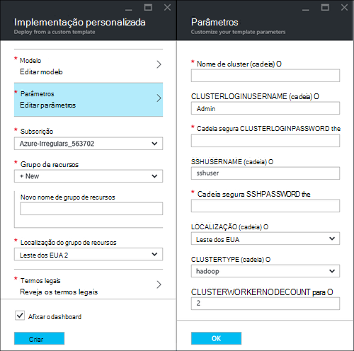
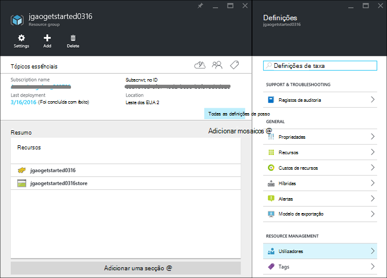
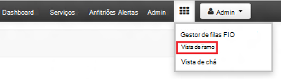
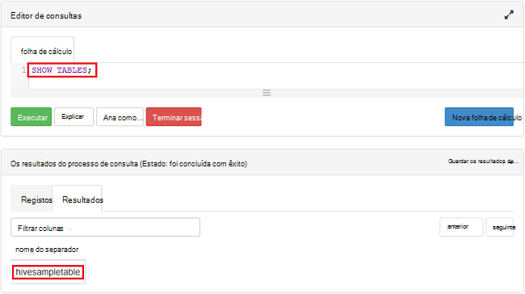

<properties
    pageTitle="Linux tutorial: introdução ao Hadoop e ramo | Microsoft Azure"
    description="Siga este tutorial de Linux para começar a utilizar Hadoop no HDInsight. Saiba como pode aprovisionar Linux clusters e dados com ramo de consulta."
    services="hdinsight"
    documentationCenter=""
    authors="mumian"
    manager="jhubbard"
    editor="cgronlun"
    tags="azure-portal"/>

<tags
    ms.service="hdinsight"
    ms.devlang="na"
    ms.topic="hero-article"
    ms.tgt_pltfrm="na"
    ms.workload="big-data"
    ms.date="09/14/2016"
    ms.author="jgao"/>

# Hadoop tutorial: começar a utilizar com base em Linux Hadoop no HDInsight

> [AZURE.SELECTOR]
- [Baseado em Linux](hdinsight-hadoop-linux-tutorial-get-started.md)
- [Baseado no Windows](hdinsight-hadoop-tutorial-get-started-windows.md)

Saiba como criar baseado em Linux [Hadoop](http://hadoop.apache.org/) clusters no HDInsight e como executar tarefas ramo no HDInsight. [Ramo de Apache](https://hive.apache.org/) é o componente mais popular no ecossistema Hadoop. Atualmente HDInsight vem com 4 tipos de cluster diferente: [Hadoop](hdinsight-hadoop-introduction.md), [motores](hdinsight-apache-spark-overview.md), [HBase](hdinsight-hbase-overview.md) e [tempestade](hdinsight-storm-overview.md).  Cada tipo de cluster suporta um conjunto diferente de componentes. Todos os tipos de 4 cluster suportam ramo. Para uma lista de componentes suportados no HDInsight, consulte o artigo [quais são as novidades nas versões cluster Hadoop fornecidas pela HDInsight?](hdinsight-component-versioning.md)  

[AZURE.INCLUDE [delete-cluster-warning](../../includes/hdinsight-delete-cluster-warning.md)]

## Pré-requisitos

Antes de começar este tutorial, tem de ter:

- **Subscrição do Azure**: para criar uma conta de avaliação gratuita um mês, navegue para [azure.microsoft.com/free](https://azure.microsoft.com/free).

### Requisitos de controlo de acesso

[AZURE.INCLUDE [access-control](../../includes/hdinsight-access-control-requirements.md)]

## Criar cluster

A maioria das tarefas Hadoop são trabalhos em lotes. Criar um cluster, executar algumas tarefas e, em seguida, elimine o cluster. Nesta secção, irá criar um cluster de baseado em Linux Hadoop HDInsight utilizando [o modelo de Gestor de recursos do Azure](../resource-group-template-deploy.md). Modelo do Gestor de recursos está totalmente personalizável; torna mais fácil criar recursos Azure como HDInsight. Experiência de modelo de Gestor de recursos não é necessária para seguir este tutorial. Para outros métodos de criação de cluster e compreender as propriedades de utilizadas neste tutorial, consulte o artigo [Criar HDInsight clusters](hdinsight-hadoop-provision-linux-clusters.md). O modelo de Gestor de recursos utilizado neste tutorial está localizado no contentor de BLOBs público, [https://hditutorialdata.blob.core.windows.net/armtemplates/create-linux-based-hadoop-cluster-in-hdinsight.json](https://hditutorialdata.blob.core.windows.net/armtemplates/create-linux-based-hadoop-cluster-in-hdinsight.json). 

1. Clique na imagem seguinte para iniciar sessão no Azure e abra o modelo de Gestor de recursos no Portal do Azure. 

    

2. A partir do pá **parâmetros** , introduza o seguinte:

    .

    - **Nome de cluster**: introduza um nome para o cluster de Hadoop que irá criar.
    - **Nome de início de sessão do cluster e palavra-passe**: O nome de início de sessão predefinido é **administrador**.
    - **SSH nome de utilizador e palavra-passe**: O nome de utilizador predefinido é **sshuser**.  Pode alterá-lo. 
    
    Outros parâmetros são opcionais para seguir este tutorial. Pode deixá-los como estão. 
    
    Cada cluster tem uma dependência de conta de armazenamento de Blobs do Azure. Normalmente, é referido como conta predefinida armazenamento. Cluster de HDInsight e a sua conta de armazenamento predefinida devem estar localizados cocriação na mesma região Azure. Eliminar clusters não irá eliminar a conta de armazenamento. No modelo, o nome de conta de armazenamento predefinido é definido como o nome do cluster com "store" anexado. 
    
3. Clique em **OK** para guardar os parâmetros.
4. A partir da pá **implementação personalizada** , introduza o **novo nome de grupo de recursos** para criar um novo grupo de recursos.  O grupo de recursos é um contentor que agrupa cluster, a conta de armazenamento dependentes e outros s. A localização do grupo de recursos pode ser diferente desde a localização de cluster.
5. Clique em **termos Legal**e, em seguida, clique em **Criar**.
6. Verifique a caixa de verificação **Afixar ao dashboard** está selecionada e, em seguida, clique em **Criar**. Irá ver um novo mosaico intitulado **implementação implementar o modelo**. Bastam sobre cerca de 20 minutos para criar um cluster. 
7.  Quando o cluster estiver criado, a legenda do mosaico de é alterada para o nome do grupo de recursos que especificou. E o portal abre automaticamente duas pás com o cluster e as definições de cluster. 

    .

    Existem duas recursos listados, o cluster e a conta de armazenamento predefinida.

##Executar consultas de ramo

[Ramo de Apache](hdinsight-use-hive.md) é o componente mais popular utilizado em HDInsight. Existem diversas formas para executar tarefas ramo no HDInsight. Neste tutorial, irá utilizar a vista de Ambari ramo a partir do portal para executar algumas tarefas ramo. Para outros métodos para submeter ramo de tarefas, consulte o artigo [Utilizar Hive no HDInsight](hdinsight-use-hive.md).

1. Navegue até à **https://&lt;nome de cluster >. azurehdinsight.net**, onde &lt;nome de cluster > é cluster que criou na secção anterior para abrir Ambari.
2. Introduza a Hadoop nome de utilizador e palavra-passe que especificou na secção anterior. O nome de utilizador predefinido é **admin**.
3. Abrir a **Vista Hive** conforme apresentado na captura de ecrã seguinte:

    .
4. Na secção da página __Editor de consultas__ , cole seguintes declarações HiveQL na folha de cálculo:

        SHOW TABLES;

    >[AZURE.NOTE] Ponto e vírgula necessária ao ramo.       
        
5. Clique em __Executar__. Uma secção de __Resultados da consulta processo__ deverá aparecer por baixo do Editor de consultas e apresentar informações sobre a tarefa. 

    Quando tiver terminado a consulta, a secção __Resultados do processo de consulta__ irá apresentar os resultados da operação de. Deve vê uma tabela chamada **hivesampletable**. Esta tabela Hive do exemplo inclui todos os clusters HDInsight.

    .

6. Repita o passo 4 e 5 para executar a consulta seguinte:

        SELECT * FROM hivesampletable;

    > [AZURE.TIP] Tenha em atenção no menu pendente __Guardar os resultados__ no canto superior esquerdo da secção __Resultados do processo de consulta__ ; Pode utilizar este para transferir os resultados ou guardá-los ao armazenamento de HDInsight como um ficheiro CSV.

7. Clique em **Histórico** para obter uma lista das tarefas.

Depois de concluir uma tarefa de ramo, pode [exportar os resultados da base de dados Azure SQL ou base de dados do SQL Server](hdinsight-use-sqoop-mac-linux.md), também pode [visualizar os resultados utilizando o Excel](hdinsight-connect-excel-power-query.md). Para mais informações sobre como utilizar ramo no HDInsight, consulte o artigo [utilizar Hive e HiveQL com Hadoop no HDInsight para analisar um ficheiro do exemplo Apache log4j](hdinsight-use-hive.md).

##Limpar o tutorial

Depois de concluir o tutorial, poderá querer eliminar o cluster. Com HDInsight, os dados são armazenados no armazenamento do Windows Azure, para que pode eliminar com segurança um cluster quando já não for utilizado. Também são cobradas para um cluster de HDInsight, mesmo quando não está em utilização. Uma vez que os encargos para o cluster são mais do número de vezes que os encargos de armazenamento, faz sentido económico para eliminar clusters quando não estejam em utilização. 

>[AZURE.NOTE] Utilizar o [Azure fábrica de dados](hdinsight-hadoop-create-linux-clusters-adf.md), pode criar clusters de HDInsight a pedido e configurar uma definição de TimeToLive para eliminar os clusters automaticamente. 

**Para eliminar o cluster e/ou a conta de armazenamento predefinida**

1. Inicie sessão no [portal do Azure](https://portal.azure.com).
2. A partir do dashboard de portal, clique no mosaico com o nome do grupo de recursos que utilizou quando criou o cluster.
3. Clique em **Eliminar** no pá recurso para eliminar o grupo de recursos que contém o cluster e a conta de armazenamento predefinida; ou clique no nome do cluster no mosaico de **recursos** e, em seguida, clique em **Eliminar** na pá cluster. Fórum nota, eliminar o grupo de recursos irá eliminar a conta de armazenamento. Se quiser manter a conta de armazenamento, optar por eliminar apenas o cluster.

## Próximos passos

Neste tutorial, aprendeu como criar um cluster de baseado em Linux HDInsight utilizando um modelo de Gestor de recursos e como executar consultas de ramo básicas.

Para saber mais acerca de como analisar dados com HDInsight, consulte o seguinte:

- Para saber mais sobre como utilizar ramo com HDInsight, incluindo como efetuar ramo consultas a partir do Visual Studio, consulte o artigo [Utilizar Hive com HDInsight][hdinsight-use-hive].

- Para saber mais sobre porco, um idioma utilizado para transformar dados, consulte o artigo [Utilizar porco com HDInsight][hdinsight-use-pig].

- Para saber mais sobre MapReduce, uma forma de escrever os programas que processam os dados na Hadoop, consulte o artigo [Utilizar MapReduce com HDInsight][hdinsight-use-mapreduce].

- Para saber como utilizar as ferramentas de HDInsight para Visual Studio para analisar dados no HDInsight, consulte o artigo [começar a utilizar o Visual Studio Hadoop ferramentas para HDInsight](hdinsight-hadoop-visual-studio-tools-get-started.md).

Se estiver pronto para começar a trabalhar com os seus dados e saber mais sobre como HDInsight armazena os dados ou como obter dados para o HDInsight, consulte o seguinte:

- Para obter informações sobre como HDInsight utiliza o armazenamento de Blobs do Azure, consulte o artigo [armazenamento de Blobs do Azure de utilização com HDInsight](hdinsight-hadoop-use-blob-storage.md).

- Para obter informações sobre como carregar dados para HDInsight, consulte o artigo [Transferir dados do HDInsight][hdinsight-upload-data].

Se quiser saber mais sobre como criar ou gerir um cluster de HDInsight, consulte o seguinte:

- Para obter informações sobre como gerir o seu cluster baseado em Linux HDInsight, consulte o artigo [Gerir HDInsight clusters utilizando Ambari](hdinsight-hadoop-manage-ambari.md).

- Para saber mais sobre as opções que pode selecionar ao criar um cluster de HDInsight, consulte o artigo [Criar HDInsight no Linux utilizando as opções personalizadas](hdinsight-hadoop-provision-linux-clusters.md).

- Se estiver familiarizado com Linux e Hadoop, mas pretender mais detalhes sobre Hadoop no HDInsight, consulte o artigo [trabalhar com HDInsight no Linux](hdinsight-hadoop-linux-information.md). Este procedimento fornece informações tais como:

    * URLs para serviços alojados no cluster, tais como Ambari e WebHCat
    * A localização dos ficheiros de Hadoop e exemplos no sistema de ficheiros local
    * Armazenar a utilização do Azure armazenamento (WASB) em vez de HDFS como os dados predefinidos

[1]: ../HDInsight/hdinsight-hadoop-visual-studio-tools-get-started.md

[hdinsight-provision]: hdinsight-provision-clusters.md
[hdinsight-admin-powershell]: hdinsight-administer-use-powershell.md
[hdinsight-upload-data]: hdinsight-upload-data.md
[hdinsight-use-mapreduce]: hdinsight-use-mapreduce.md
[hdinsight-use-hive]: hdinsight-use-hive.md
[hdinsight-use-pig]: hdinsight-use-pig.md

[powershell-download]: http://go.microsoft.com/fwlink/p/?linkid=320376&clcid=0x409
[powershell-install-configure]: powershell-install-configure.md
[powershell-open]: powershell-install-configure.md#Install

[img-hdi-dashboard]: ./media/hdinsight-hadoop-tutorial-get-started-windows/HDI.dashboard.png
[img-hdi-dashboard-query-select]: ./media/hdinsight-hadoop-tutorial-get-started-windows/HDI.dashboard.query.select.png
[img-hdi-dashboard-query-select-result]: ./media/hdinsight-hadoop-tutorial-get-started-windows/HDI.dashboard.query.select.result.png
[img-hdi-dashboard-query-select-result-output]: ./media/hdinsight-hadoop-tutorial-get-started-windows/HDI.dashboard.query.select.result.output.png
[img-hdi-dashboard-query-browse-output]: ./media/hdinsight-hadoop-tutorial-get-started-windows/HDI.dashboard.query.browse.output.png
[image-hdi-clusterstatus]: ./media/hdinsight-hadoop-tutorial-get-started-windows/HDI.ClusterStatus.png
[image-hdi-gettingstarted-powerquery-importdata]: ./media/hdinsight-hadoop-tutorial-get-started-windows/HDI.GettingStarted.PowerQuery.ImportData.png
[image-hdi-gettingstarted-powerquery-importdata2]: ./media/hdinsight-hadoop-tutorial-get-started-windows/HDI.GettingStarted.PowerQuery.ImportData2.png
