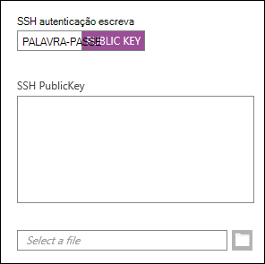
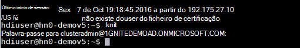
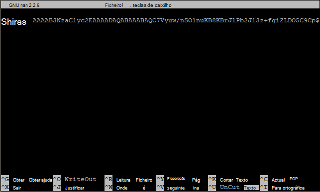

<properties
   pageTitle="Utilizar chaves de SSH com baseado em Linux Hadoop do Linux, Unix ou OS X | Microsoft Azure"
   description=" Pode aceder a HDInsight baseado em Linux utilizando segura da Shell (SSH). Este documento fornece informações sobre como utilizar SSH com HDInsight partir de clientes Linux, Unix ou OS X."
   services="hdinsight"
   documentationCenter=""
   authors="Blackmist"
   manager="jhubbard"
   editor="cgronlun"
    tags="azure-portal"/>

<tags
   ms.service="hdinsight"
   ms.devlang="na"
   ms.topic="get-started-article"
   ms.tgt_pltfrm="na"
   ms.workload="big-data"
   ms.date="09/13/2016"
   ms.author="larryfr"/>

#<a name="use-ssh-with-linux-based-hadoop-on-hdinsight-from-linux-unix-or-os-x"></a>Utilizar SSH com baseado em Linux Hadoop no HDInsight do Linux, Unix ou OS X

> [AZURE.SELECTOR]
- [Windows](hdinsight-hadoop-linux-use-ssh-windows.md)
- [X de sistema operativo Linux, Unix,](hdinsight-hadoop-linux-use-ssh-unix.md)

[Seguro da Shell (SSH)](https://en.wikipedia.org/wiki/Secure_Shell) permite-lhe executar remotamente operações sobre os clusters de HDInsight baseado em Linux utilizando uma interface de linha de comandos. Este documento fornece informações sobre como utilizar SSH com HDInsight partir de clientes Linux, Unix ou OS X.

> [AZURE.NOTE] Os passos descritos neste artigo partem do princípio de que está a utilizar um cliente Linux, Unix ou OS X. Estes passos podem ser executados num cliente baseado no Windows se tiver instalado um pacote que permite `ssh` e `ssh-keygen`, por exemplo, [festa de Ubuntu no Windows](https://msdn.microsoft.com/commandline/wsl/about).
>
> Se não tiver SSH instalado no cliente baseado no Windows, utilize os passos no [Utilizar SSH com baseado em Linux HDInsight (Hadoop) do Windows](hdinsight-hadoop-linux-use-ssh-windows.md) para obter informações sobre como instalar e utilizar betumes.

##<a name="prerequisites"></a>Pré-requisitos

* **SSH keygen** e **ssh** para os clientes Linux, Unix e OS X. Este utilitários são normalmente fornecidos com o sistema operativo, ou está disponível através do sistema de gestão do pacote.

* Moderno web browser que suporte HTML5.

OU

* [Azure CLI](../xplat-cli-install.md).

    [AZURE.INCLUDE [use-latest-version](../../includes/hdinsight-use-latest-cli.md)] 

##<a name="what-is-ssh"></a>O que é SSH?

SSH é um utilitário para iniciar sessão e remotamente em execução, comandos num servidor remoto. Com HDInsight baseado em Linux, SSH estabelece uma ligação encriptada para headnode o cluster e fornece uma linha de comandos que utiliza para escrever comandos. Comandos, em seguida, são executados directamente no servidor.

###<a name="ssh-user-name"></a>Nome de utilizador SSH

Um nome de utilizador SSH é o nome utilizado para autenticar para o cluster HDInsight. Quando especificar um nome de utilizador SSH durante a criação do cluster, este utilizador é criado em todos os nós no cluster. Uma vez criado o cluster, pode utilizar este nome de utilizador para ligar a headnodes de cluster HDInsight. A partir de headnodes, em seguida, pode ligar para os nós de cada trabalhador.

###<a name="ssh-password-or-public-key"></a>Palavra-passe SSH ou a chave pública

Um utilizador SSH pode utilizar uma palavra-passe ou a chave pública para autenticação. Uma palavra-passe é apenas uma cadeia de texto efectuadas, enquanto uma chave pública faz parte de um par de chaves criptográficas gerado para o identificar exclusivamente.

Uma chave é mais segura do que uma palavra-passe, no entanto, requer passos adicionais para gerar a chave e terá de manter os ficheiros que contém a chave numa localização segura. Se alguém obtiver acesso para os ficheiros chave, tenham acesso à sua conta. Ou se perder os ficheiros chave, não poderá iniciar sessão para a conta.

Um par de chaves consiste de uma chave pública (o que é enviada para o servidor de HDInsight) e uma chave privada (que é mantida no computador cliente.) Quando ligar ao servidor de HDInsight utilizando SSH, o cliente SSH utilizará a chave privada no seu computador para autenticar com o servidor.

##<a name="create-an-ssh-key"></a>Criar uma chave SSH

Utilize as seguintes informações, se planear utilizar SSH teclas com o cluster. Se pretender utilizar uma palavra-passe, pode ignorar esta secção.

1. Abra uma sessão de terminal e utilize o seguinte comando para verificar se existem quaisquer chaves SSH existentes:

        ls -al ~/.ssh

    Procure os seguintes ficheiros na listagem do directório. Estes são nomes comuns para as chaves públicas SSH.

    * ID\_dsa.pub
    * ID\_ecdsa.pub
    * ID\_ed25519.pub
    * ID\_rsa.pub

2. Se não pretender utilizar um ficheiro existente, ou tiver sem chaves SSH existentes, utilize o seguinte para gerar um novo ficheiro:

        ssh-keygen -t rsa

    Será solicitado para as seguintes informações:

    * A localização do ficheiro - a localização assume como predefinição ~/.ssh/id\_rsa.
    * A frase de acesso - lhe ser pedido para reintroduzir esta.

        > [AZURE.NOTE] Recomendamos vivamente que utilize uma frase de acesso segura para a chave. No entanto, se se esquecer a frase de acesso, não é possível recuperá-lo.

    Depois de concluir o comando, terá dois novos ficheiros, a chave privada (por exemplo, **id\_rsa**) e a chave pública (por exemplo, **id\_rsa.pub**).

##<a name="create-a-linux-based-hdinsight-cluster"></a>Criar um cluster baseado em Linux HDInsight

Quando criar um cluster baseado em Linux HDInsight, tem de fornecer a chave pública previamente criada. A partir de clientes Linux, Unix ou OS X, existem duas formas de criar um cluster de HDInsight:

* **Azure Portal** - utiliza um portal baseado na web para criar o cluster.

* **CLI azure para Mac, Linux e Windows** - utiliza comandos da linha de comandos para criar o cluster.

Cada um destes métodos irá requerer uma palavra-passe ou uma chave pública. Para obter informações completas sobre como criar um cluster baseado em Linux HDInsight, consulte [clusters de baseado em Linux de disposição HDInsight](hdinsight-hadoop-provision-linux-clusters.md).

###<a name="azure-portal"></a>Azure Portal

Quando utilizar o [Azure Portal] [ preview-portal] para criar um cluster baseado em Linux HDInsight, tem de introduzir um **Nome de utilizador SSH**e seleccionar para introduzir uma **palavra-passe** ou **SSH chave pública**.

Se seleccionar **SSH chave pública**, pode colar a chave pública (contida no ficheiro com a extensão **. pub** ) para o campo __SSH PublicKey__ ' ou seleccione __Seleccionar um ficheiro__ para procurar e seleccionar o ficheiro de chave pública.



> [AZURE.NOTE] O ficheiro de chave é simplesmente um ficheiro de texto. O conteúdo deverá ser semelhante à seguinte:
> ```
ssh-rsa AAAAB3NzaC1yc2EAAAADAQABAAABAQCelfkjrpYHYiks4TM+r1LVsTYQ4jAXXGeOAF9Vv/KGz90pgMk3VRJk4PEUSELfXKxP3NtsVwLVPN1l09utI/tKHQ6WL3qy89WVVVLiwzL7tfJ2B08Gmcw8mC/YoieT/YG+4I4oAgPEmim+6/F9S0lU2I2CuFBX9JzauX8n1Y9kWzTARST+ERx2hysyA5ObLv97Xe4C2CQvGE01LGAXkw2ffP9vI+emUM+VeYrf0q3w/b1o/COKbFVZ2IpEcJ8G2SLlNsHWXofWhOKQRi64TMxT7LLoohD61q2aWNKdaE4oQdiuo8TGnt4zWLEPjzjIYIEIZGk00HiQD+KCB5pxoVtp user@system
> ```

Isto cria um início de sessão para o utilizador especificado, utilizando a palavra-passe ou a chave pública que fornecer.

###<a name="azure-command-line-interface-for-mac-linux-and-windows"></a>Interface de linha de comandos Azure para Mac, Linux e Windows

Pode utilizar o [Azure CLI para Mac, Linux e Windows](../xplat-cli-install.md) para criar um novo cluster utilizando o `azure hdinsight cluster create` comando.

Para mais informações sobre como utilizar este comando, consulte [clusters de disposição Hadoop Linux HDInsight utilizando opções personalizadas](hdinsight-hadoop-provision-linux-clusters.md).

##<a name="connect-to-a-linux-based-hdinsight-cluster"></a>Ligar a um cluster baseado em Linux HDInsight

De uma sessão de terminal, utilize o comando SSH para ligar a headnode o cluster, fornecendo o endereço e nome de utilizador:

* **Endereço SSH** - existem dois endereços que podem ser utilizados para ligar a um cluster utilizando SSH:

    * **Ligar à headnode**: O nome do cluster, seguido de **-ssh.azurehdinsight.net**. Por exemplo, **mycluster ssh.azurehdinsight.net**.
    
    * **Ligar para o nó de margem**: se o cluster de servidor de R HDInsight, o cluster também contém um nó de limite que pode ser acedido utilizando **RServer.CLUSTERNAME.ssh.azurehdinsight.net**, onde o __nome de cluster__ é o nome do cluster.

* **Nome de utilizador** - o SSH nome de utilizador fornecidas quando criou o cluster.

O exemplo seguinte irá ligar para o headnode de **mycluster** principal como o utilizador **me**:

    ssh me@mycluster-ssh.azurehdinsight.net

Se tiver utilizado uma palavra-passe da conta de utilizador, será solicitado para introduzir a palavra-passe.

Se tiver utilizado uma chave SSH é protegida com uma frase de acesso, será solicitado para introduzir a frase de acesso. Caso contrário, SSH irá tentar autenticar automaticamente, utilizando uma das chaves privadas locais no cliente.

> [AZURE.NOTE] Se SSH não autenticar automaticamente com a chave privada correcta, utilize o parâmetro **-i** e especifique o caminho para a chave privada. O exemplo seguinte irá carregar a chave privada de `~/.ssh/id_rsa`:
>
> `ssh -i ~/.ssh/id_rsa me@mycluster-ssh.azurehdinsight.net`

Se estiver a ligar utilizando o endereço para o headnode e não for especificada uma porta, SSH predefinido porta 22. o, que irá estabelecer ligação a headnode principal no HDInsight cluster. Se utilizar a porta 23, ligará a secundária. Para mais informações sobre a headnodes, consulte a [disponibilidade e fiabilidade dos clusters de Hadoop HDInsight](hdinsight-high-availability-linux.md).

###<a name="connect-to-worker-nodes"></a>Ligue a nós de trabalho

Os nós de trabalho não são directamente acessíveis de fora a datacenter Azure, mas podem ser acedidas a partir do headnode de cluster através de SSH.

Se utilizar uma chave SSH para autenticar a conta de utilizador, tem de concluir os seguintes passos no cliente:

1. Abrir utilizando um editor de texto, `~/.ssh/config`. Se este ficheiro não existir, pode criá-la, introduzindo `touch ~/.ssh/config` do terminal.

2. Adicione o seguinte no ficheiro. Substitua o *nome de cluster* com o nome do HDInsight cluster.

        Host CLUSTERNAME-ssh.azurehdinsight.net
          ForwardAgent yes

    Este procedimento configura SSH agente de reencaminhamento para o cluster HDInsight.

3. Testar SSH agente de reencaminhamento, utilizando o seguinte comando a partir do terminal:

        echo "$SSH_AUTH_SOCK"

    Isto deverá devolver informações semelhantes às seguintes:

        /tmp/ssh-rfSUL1ldCldQ/agent.1792

    Se nada for devolvido, isto indica que esse **ssh agente** não está em execução. Consulte a documentação do sistema operativo para obter passos específicos sobre como instalar e configurar **ssh agente**ou consulte [utilizar ssh-agent com ssh](http://mah.everybody.org/docs/ssh).

4. Depois de ter verificado que **ssh-agent** está em execução, utilize o seguinte para adicionar a chave privada SSH ao agente:

        ssh-add ~/.ssh/id_rsa

    Se a chave privada é armazenada num ficheiro diferente, substitua `~/.ssh/id_rsa` com o caminho para o ficheiro.

Utilize os seguintes passos para ligar os nós de trabalho para o cluster.

> [AZURE.IMPORTANT] Se utilizar uma chave SSH para autenticar a conta, tem de concluir os passos anteriores para verificar esse agente de reencaminhamento está a funcionar.

1. Ligar ao HDInsight cluster utilizando SSH tal como descrito anteriormente.

2. Assim que estiver ligado, utilize o seguinte para obter uma lista de nós no cluster. Substitua *ADMINPASSWORD* a palavra-passe para a conta de administrador de cluster. Substitua o *nome de cluster* com o nome do cluster.

        curl --user admin:ADMINPASSWORD https://CLUSTERNAME.azurehdinsight.net/api/v1/hosts

    Este comando irá devolver informações no formato JSON para os nós no cluster, incluindo `host_name`, que contém o nome de domínio totalmente qualificado (FQDN) para cada nó. Segue-se um exemplo de um `host_name` devolvida pelo comando **curl** de entrada:

        "host_name" : "workernode0.workernode-0-e2f35e63355b4f15a31c460b6d4e1230.j1.internal.cloudapp.net"

3. Depois de ter uma lista de nós de trabalho que pretende ligar, utilize o seguinte comando a partir da sessão SSH para o servidor para abrir uma ligação a um nó de trabalho:

        ssh USERNAME@FQDN

    Substitua o *nome de utilizador* com o nome de utilizador SSH e *FQDN* com o FQDN para o nó de trabalho. Por exemplo, `workernode0.workernode-0-e2f35e63355b4f15a31c460b6d4e1230.j1.internal.cloudapp.net`.

    > [AZURE.NOTE] Se utilizar uma palavra-passe para autenticação a sessão SSH, será solicitado para introduzir a palavra-passe novamente. Se utilizar uma chave SSH, deve concluir a ligação sem quaisquer avisos.

4. Depois da sessão foi estabelecida, o pedido do terminal deixará de `username@hn#-clustername` para `username@wk#-clustername` para indicar que está ligado para o nó de trabalho. Qualquer comando executado neste momento será executado no nó de trabalho.

4. Depois de acabar de executar acções no nó do trabalho, utilize o `exit` comando para fechar a sessão para o nó de trabalho. Este comando irá devolver para a `username@hn#-clustername` linha de comandos.

## <a name="connect-to-a-domain-joined-hdinsight-cluster"></a>Ligar a um cluster do domínio HDInsight

[HDInsight de domínio](hdinsight-domain-joined-introduction.md) integra Kerberos com Hadoop em HDInsight. Uma vez que o utilizador SSH não é um utilizador de domínio do Active Directory, esta conta de utilizador não pode executar comandos de Hadoop SSH shell num cluster do domínio directamente. Primeiro tem de executar *kinit* . 

**Para executar o ramo de registo consultas num cluster HDInsight de domínio utilizando SSH**

1. Ligar a um cluster de HDInsight de domínio utilizando SSH.  Para instrocutions, consulte [ligar a um cluster baseado em Linux HDInsight](#connect-to-a-linux-based-hdinsight-cluster).
2. Execute kinit. Ele irá perguntar-lhe um nome de utilizador de domínio e uma palavra-passe de utilizador de domínio. Para mais informações sobre como configurar os utilizadores do domínio para domínio clusters de HDInsight, consulte [HDInisight associados ao domínio configurar clusters](hdinsight-domain-joined-configure.md).

    
3. Abrir a consola do ramo de registo, introduza:

        hive

    Em seguida, pode executar comandos de ramo de registo.

##<a name="add-more-accounts"></a>Adicionar mais contas

1. Criar uma nova chave pública e a chave privada para a nova conta de utilizador, conforme descrito na secção de [criar uma chave SSH](#create-an-ssh-key-optional) .

    > [AZURE.NOTE] A chave privada deve ser gerada num cliente que o utilizador irá utilizar para ligar ao cluster, ou em segurança transferida para um cliente deste tipo após a criação.

1. A partir de uma sessão SSH ao cluster, adicione o novo utilizador com o seguinte comando:

        sudo adduser --disabled-password <username>

    Isto irá criar uma nova conta de utilizador, mas irá desactivar a autenticação de palavra-passe.

2. Crie o directório e ficheiros premida a tecla utilizando os seguintes comandos:

        sudo mkdir -p /home/<username>/.ssh
        sudo touch /home/<username>/.ssh/authorized_keys
        sudo nano /home/<username>/.ssh/authorized_keys

3. Quando abre o editor de nano, copie e cole o conteúdo da chave pública para a nova conta de utilizador. Por último, utilize **Ctrl-X** para guardar o ficheiro e saia do editor.

    

4. Utilize o seguinte comando para alterar a propriedade da pasta .ssh e conteúdo para a nova conta de utilizador:

        sudo chown -hR <username>:<username> /home/<username>/.ssh

5. Deverá agora conseguir autenticar o servidor com a nova conta de utilizador e a chave privada.

##<a id="tunnel"></a>SSH tunneling

SSH pode ser utilizado para pedidos locais, por exemplo, pedidos da web, para o cluster HDInsight de túnel. O pedido, em seguida, será encaminhado para o recurso pedido como se tivesse tem origem no headnode de cluster HDInsight.

> [AZURE.IMPORTANT] Um túnel SSH é um requisito para aceder a IU da web para alguns serviços de Hadoop. Por exemplo, a IU de histórico da tarefa ou o Gestor de recursos da IU só pode ser acedido utilizando um túnel SSH.

Para mais informações sobre como criar e utilizar um túnel SSH, consulte [Utilizar SSH Tunneling para aceder a web de Ambari UI, ResourceManager, JobHistory, NameNode, Oozie e outra web da IU](hdinsight-linux-ambari-ssh-tunnel.md).

##<a name="next-steps"></a>Passos seguintes

Agora que já sabe como autenticar utilizando uma chave SSH, obter informações sobre como utilizar o MapReduce com Hadoop em HDInsight.

* [Utilizar o ramo de registo com HDInsight](hdinsight-use-hive.md)

* [Utilizar suínos com HDInsight](hdinsight-use-pig.md)

* [Utilizar tarefas de MapReduce com HDInsight](hdinsight-use-mapreduce.md)

[preview-portal]: https://portal.azure.com/
