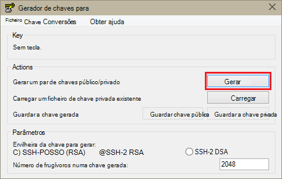
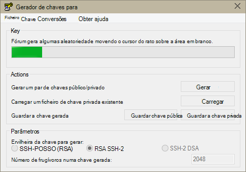
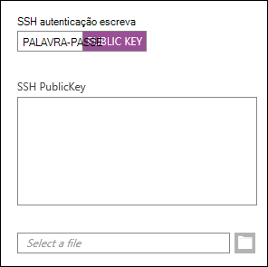
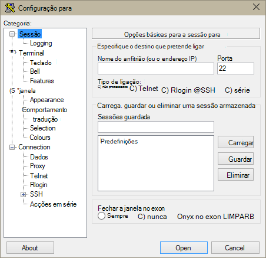
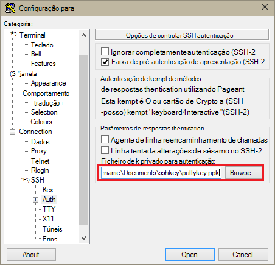
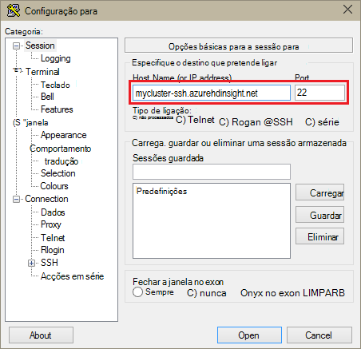
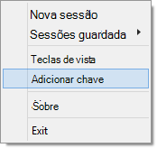
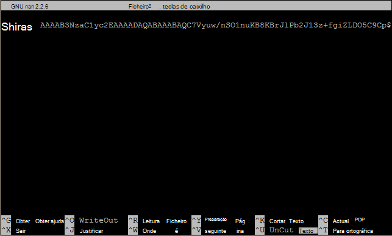

<properties
   pageTitle="Utilizar teclas SSH com Hadoop no baseado em Linux clusters a partir do Windows | Microsoft Azure"
   description="Saiba como criar e utilizar teclas SSH para autenticar a clusters baseado em Linux HDInsight. Ligue clusters a partir dos clientes baseados no Windows utilizando o cliente betumes SSH."
   services="hdinsight"
   documentationCenter=""
   authors="Blackmist"
   manager="jhubbard"
   editor="cgronlun"
    tags="azure-portal"/>

<tags
   ms.service="hdinsight"
   ms.devlang="na"
   ms.topic="get-started-article"
   ms.tgt_pltfrm="na"
   ms.workload="big-data"
   ms.date="08/30/2016"
   ms.author="larryfr"/>

#Utilizar SSH com baseado em Linux Hadoop no HDInsight a partir do Windows

> [AZURE.SELECTOR]
- [Windows](hdinsight-hadoop-linux-use-ssh-windows.md)
- [Linux, Unix OS X](hdinsight-hadoop-linux-use-ssh-unix.md)

[Shell seguro (SSH)](https://en.wikipedia.org/wiki/Secure_Shell) permite-lhe remotamente desempenham operações em seu clusters baseado em Linux HDInsight utilizando uma interface da linha de comandos. Este artigo fornece informações sobre como ligar ao HDInsight a partir dos clientes baseados no Windows utilizando o cliente betumes SSH.

> [AZURE.NOTE] Os passos neste artigo presumem que estiver a utilizar um cliente baseados no Windows. Se estiver a utilizar um cliente Linux, Unix ou OS X, consulte o artigo [Utilizar SSH com baseado em Linux Hadoop no HDInsight Linux, Unix, ou OS X](hdinsight-hadoop-linux-use-ssh-unix.md).
>
> Se tiver o Windows 10 e estiver a utilizar o [festa de Ubuntu no Windows](https://msdn.microsoft.com/commandline/wsl/about), pode utilizar os passos no documento [Utilizar SSH com baseado em Linux Hadoop no HDInsight Linux, Unix, ou OS X](hdinsight-hadoop-linux-use-ssh-unix.md) .

##Pré-requisitos

* **Betumes** e **PuTTYGen** para clientes baseados no Windows. Estes utilitários estão disponíveis a partir do [http://www.chiark.greenend.org.uk/~sgtatham/putty/download.html](http://www.chiark.greenend.org.uk/~sgtatham/putty/download.html).

* Um moderna browser que suporte HTML5.

OU

* [Clip azure](../xplat-cli-install.md).

    [AZURE.INCLUDE [use-latest-version](../../includes/hdinsight-use-latest-cli.md)] 

##O que é SSH?

SSH é um utilitário para iniciar sessão no e remotamente em execução, comandos num servidor remoto. Com baseado em Linux HDInsight, SSH estabelece uma ligação encriptada para o nó do cabeça cluster e fornece uma linha de comandos que utiliza para escrever nos comandos. Comandos, em seguida, são executados diretamente no servidor.

###Nome de utilizador SSH

Um nome de utilizador SSH é o nome que utiliza para autenticar ao HDInsight cluster. Quando especificar um nome de utilizador SSH durante a criação de cluster, este utilizador é criado em todos os nós no cluster. Quando o cluster estiver criado, pode utilizar este nome de utilizador para ligar aos nós de cabeça cluster HDInsight. Partir de nós de cabeça, em seguida, pode ligar para os nós de trabalho individuais.

###Palavra-passe SSH ou chave pública

Um utilizador SSH pode utilizar uma palavra-passe ou de uma chave pública para autenticação. Uma palavra-passe é apenas uma cadeia de texto que compõem, enquanto uma chave pública faz parte de um par de chaves de criptografia gerado para identificar exclusivamente.

Uma chave é mais segura do que uma palavra-passe, no entanto, é necessário passos adicionais para gerar a chave e deve manter os ficheiros que contém a chave numa localização segura. Se qualquer pessoa obtiver acesso aos ficheiros de chaves, tenham acesso à sua conta. Ou caso a perca os ficheiros chave, não conseguir iniciar sessão para a sua conta.

Um par de chaves consiste numa chave pública (que é enviada para o servidor de HDInsight) e uma chave privada (que é mantida no seu computador cliente.) Quando se liga ao servidor de HDInsight utilizando SSH, o cliente SSH utilizará a chave privada no seu computador para autenticar com o servidor.

##Criar uma chave de SSH

Utilize as seguintes informações se planeia utilizar teclas SSH com o seu cluster. Se planeia utilizar uma palavra-passe, pode ignorar esta secção.

1. Abra PuTTYGen.

2. Para **tipo de chave para gerar**, selecione **RSA SSH-2**e, em seguida, clique em **Gerar**.

    

3. Mova o cursor do rato na área abaixo da barra de progresso, até a barra de preenche. Mover o cursor do rato gera dados aleatórios que são utilizados para gerar a chave.

    

    Assim que tiver sido gerada a tecla, será apresentada a chave pública.

4. Para segurança adicional, pode introduzir uma frase de acesso do campo de **chave frase de acesso** e, em seguida, escreva o mesmo valor no campo **Confirmar frase de acesso** .

    

    > [AZURE.NOTE] Recomendamos vivamente que utilize uma frase de acesso seguro para a chave. No entanto, caso se esqueça a frase de acesso, não existe nenhuma forma de recuperá-la.

5. Clique em **Guardar chave privada** para guardar a chave para um ficheiro de **.ppk** . Esta chave será utilizada para autenticar ao seu cluster baseado em Linux HDInsight.

    > [AZURE.NOTE] Deve armazenar esta tecla numa localização segura, tal como pode ser utilizada para aceder ao seu cluster baseado em Linux HDInsight.

6. Clique em **Guardar chave pública** para guardar a chave como um ficheiro **. txt** . Permite-lhe reutilizar a chave pública no futuro quando criar clusters de baseado em Linux HDInsight adicionais.

    > [AZURE.NOTE] A chave pública também é apresentada na parte superior da PuTTYGen. Pode com o botão direito este campo, copie o valor e, em seguida, colá-la um formulário durante a criação de um cluster utilizando o Portal do Azure.

##Criar um cluster de baseado em Linux HDInsight

Ao criar um cluster de baseado em Linux HDInsight, tem de fornecer a chave pública criada anteriormente. A partir dos clientes baseados no Windows, existem duas formas de criar um cluster de baseado em Linux HDInsight:

* **Portal do azure** - utiliza um portal de baseada na web para criar o cluster.

* **Clip do azure para Mac, Linux e Windows** - utiliza os comandos da linha de comandos para criar o cluster.

Cada um dos seguintes métodos irão necessitar a chave pública. Para obter informações completas sobre como criar um cluster de baseado em Linux HDInsight, consulte o artigo [clusters baseado em aprovisionar Linux HDInsight](hdinsight-hadoop-provision-linux-clusters.md).

###Portal do Azure

Quando utilizar o [Portal do Azure] [ preview-portal] para criar um cluster de baseado em Linux HDInsight, tem de introduzir um **Nome de utilizador SSH**e selecione para introduzir uma **palavra-passe** ou **SSH chave pública**.

Se selecionar **SSH chave pública**, pode quer colar a chave pública (apresentado na __chave pública para colar no antes OpenSSH autorizado\_ficheiro teclas__ campo PuttyGen,) para o campo de __SSH PublicKey__ ou selecione __selecionar um ficheiro__ para procurar e selecione o ficheiro que contém a chave pública.

Cria um início de sessão para o utilizador especificado e permite autenticação de palavra-passe ou autenticação por chave SSH.

###Azure Interface de comandos para Mac, Linux e Windows

Pode utilizar o [Clip do Azure para Mac, Linux e Windows](../xplat-cli-install.md) para criar um novo cluster utilizando o `azure hdinsight cluster create` comando.

Para mais informações sobre como utilizar este comando, consulte o artigo [clusters de aprovisionar Hadoop Linux HDInsight utilizando as opções personalizadas](hdinsight-hadoop-provision-linux-clusters.md).

##Ligar a um cluster de baseado em Linux HDInsight

1. Abra betumes.

    

2. Se tiver fornecido uma tecla SSH quando criou a sua conta de utilizador, deve efetuar os passos seguintes para selecionar a chave privada a utilizar ao autenticar ao cluster:

    Na **categoria**, expanda a **ligação**, expanda **SSH**e selecione **Auth**. Por fim, clique em **Procurar** e selecione o ficheiro de .ppk que contém a sua chave privada.

    

3. Na **categoria**, selecione **sessão**. No ecrã **Opções básicas para a sessão para** , introduza o endereço SSH do seu servidor de HDInsight no campo **nome do anfitrião (ou o endereço IP)** . Existem duas endereços SSH possíveis que poderá utilizar ao ligar a um cluster de:

    * __Endereço de nó HEAD__: para ligar para o nó do cluster de cabeça, utilizar o seu nome de cluster, em seguida, **-ssh.azurehdinsight.net**. Por exemplo, **mycluster ssh.azurehdinsight.net**.
    
    * __Endereço de nó limite__: Se estiver a ligar a um servidor de R num cluster de HDInsight, pode ligar para o nó do limite de servidor de R utilizando o endereço __RServer.CLUSTERNAME.ssh.azurehdinsight.net__, onde o nome de cluster é o nome do seu cluster. Por exemplo, __RServer.mycluster.ssh.azurehdinsight.net__.

    

4. Para guardar as informações de ligação para utilização futura, introduza um nome para esta ligação em **Sessões guardado**e, em seguida, clique em **Guardar**. A ligação será adicionada à lista de sessões guardados.

5. Clique em **Abrir** para ligar ao cluster.

    > [AZURE.NOTE] Se esta for a primeira vez que tem ligados à cluster, vai receber um alerta de segurança. Este é o normal. Selecione **Sim** para colocar em cache a chave do servidor RSA2 para continuar.

6. Quando lhe for pedido, introduza o utilizador que introduziu quando criou o cluster. Se tiver fornecido uma palavra-passe para o utilizador, vai ser-lhe para introduzi-lo também.

> [AZURE.NOTE] Os passos acima partem do pressuposto de que está a utilizar porta 22, irá ligar para o headnode principal no HDInsight cluster. Se utilizar a porta 23, irá ligá-secundária. Para mais informações sobre os nós de cabeça, consulte o artigo [disponibilidade e fiabilidade dos clusters de Hadoop HDInsight](hdinsight-high-availability-linux.md).

###Ligar a nós de trabalho

Os nós de trabalho não são diretamente acessíveis a partir do fora o Azure Centro de dados, mas pode ser acedidos a partir do nó do cabeça cluster através do SSH.

Se tiver fornecido uma tecla SSH quando criou a sua conta de utilizador, deve efetuar os seguintes passos para utilizar a chave privada ao autenticar ao cluster se pretender estabelecer ligação com os nós de trabalho.

1. Instale Pageant a partir de [http://www.chiark.greenend.org.uk/~sgtatham/putty/download.html](http://www.chiark.greenend.org.uk/~sgtatham/putty/download.html). Este utilitário é utilizado para colocar em cache SSH teclas para betumes.

2. Execute Pageant. Irá minimizar a para um ícone no tabuleiro do Estado. Botão direito do rato no ícone e selecione **Adicionar chave**.

    

3. Quando for apresentada a caixa de diálogo Procurar, selecione o ficheiro de .ppk que contém a tecla e, em seguida, clique em **Abrir**. Esta ação adiciona a chave Pageant, que irá fornecer para betumes quando se liga ao cluster.

    > [AZURE.IMPORTANT] Caso tenha utilizado uma chave SSH para proteger a sua conta, tem de concluir os passos anteriores antes será possível ligar a nós de trabalho.

4. Abra betumes.

5. Se utilizar uma chave SSH para autenticar, na secção de **categoria** , expanda a **ligação**, expanda **SSH**e, em seguida, selecione **Auth**.

    Na secção de **parâmetros de autenticação** , ative **Permitir agente reencaminhamento de chamadas**. Esta opção permite-betumes transmitir automaticamente a autenticação de certificados através da ligação para o nó do cabeça cluster quando se liga a nós de trabalho.

    

6. Ligar ao cluster conforme é documentado anterior. Se utilizar uma chave SSH para autenticação, não é necessário selecionar a tecla - a chave SSH adicionada à Pageant será utilizada para autenticar ao cluster.

7. Após ter sido estabelecida a ligação, utilize o seguinte para obter uma lista de nós no seu cluster. Substitua *ADMINPASSWORD* a palavra-passe para a sua conta de administrador de cluster. Substitua o *nome de cluster* com o nome do seu cluster.

        curl --user admin:ADMINPASSWORD https://CLUSTERNAME.azurehdinsight.net/api/v1/hosts

    Isto irá devolver informações no formato JSON para os nós num cluster, incluindo `host_name`, que contém o nome de domínio completamente qualificado (FQDN) para cada nó. Segue-se um exemplo de um `host_name` entrada devolvida pelo comando **curl** :

        "host_name" : "workernode0.workernode-0-e2f35e63355b4f15a31c460b6d4e1230.j1.internal.cloudapp.net"

8. Assim que tiver uma lista de nós do trabalho que pretende ligar, utilize o seguinte comando da sessão para abrir uma ligação para um nó de trabalho:

        ssh USERNAME@FQDN

    Substitua o *nome de utilizador* com o seu nome de utilizador SSH e *FQDN* com o FQDN para o nó do trabalho. Por exemplo, `workernode0.workernode-0-e2f35e63355b4f15a31c460b6d4e1230.j1.internal.cloudapp.net`.

    > [AZURE.NOTE] Se utilizar uma palavra-passe para autenticação a sessão SSH, vai ser-lhe para introduzir a palavra-passe novamente. Se utilizar uma chave SSH, a ligação deve ser concluída sem qualquer pedidos.

9. Assim que tiver sido estabelecida a sessão, irá alterar a sua sessão para pedir a partir do `username@hn#-clustername` para `username@wn#-clustername` para indicar que estão ligadas a nó de trabalho. Quaisquer comandos que neste momento executar serão executado no nó do trabalho.

10. Quando tiver terminado de realizar ações no nó do trabalho, utilize o `exit` comando para fechar a sessão para o nó do trabalho. Isto irá devolver para o `username@hn#-clustername` linha de comandos.

##Adicionar mais contas

Se precisar de adicionar mais contas ao seu cluster, execute os seguintes passos:

1. Criar uma nova chave pública e a chave privada para a nova conta de utilizador, conforme descrito anteriormente.

2. A partir de uma sessão SSH ao cluster, adicione o novo utilizador com o seguinte comando:

        sudo adduser --disabled-password <username>

    Isto irá criar uma nova conta de utilizador, mas irá desactivar a autenticação de palavra-passe.

3. Crie o diretório e ficheiros para mantenha premida a tecla através dos comandos seguintes:

        sudo mkdir -p /home/<username>/.ssh
        sudo touch /home/<username>/.ssh/authorized_keys
        sudo nano /home/<username>/.ssh/authorized_keys

4. Quando abre o editor de nano, copie e cole o conteúdo da chave pública para a nova conta de utilizador. Por fim, utilize **CTRL + X** para guardar o ficheiro e saia do editor.

    

5. Utilize o seguinte comando para alterar o que é o proprietário da pasta .ssh e conteúdo para a nova conta de utilizador:

        sudo chown -hR <username>:<username> /home/<username>/.ssh

6. Agora deverá conseguir autenticar no servidor com a nova conta de utilizador e a chave privada.

##SSH túnel

SSH pode ser utilizado para túnel pedidos locais, tal como pedidos de web, ao HDInsight cluster. O pedido, em seguida, será encaminhado para o recurso pedido como se tinha tem origem no nó cabeça de cluster HDInsight.

> [AZURE.IMPORTANT] Um túnel SSH é um requisito para aceder ao web IU de alguns serviços Hadoop. Por exemplo, a tarefa histórico IU ou o Gestor de recursos do IU só pode ser acedido utilizando um túnel SSH.

Para mais informações sobre como criar e utilizar um túnel SSH, consulte o artigo [Utilizar SSH túnel para aceder ao web Ambari IU, ResourceManager, JobHistory, NameNode, Oozie e outros web da IU](hdinsight-linux-ambari-ssh-tunnel.md).

##Próximos passos

Agora que compreender como autenticar utilizando uma tecla SSH, saiba como utilizar MapReduce com Hadoop no HDInsight.

* [Utilizar ramo com HDInsight](hdinsight-use-hive.md)

* [Utilizar porco com HDInsight](hdinsight-use-pig.md)

* [Utilizar tarefas de MapReduce com HDInsight](hdinsight-use-mapreduce.md)

[preview-portal]: https://portal.azure.com/
