<properties
   pageTitle="Monitorizar e gerir clusters HDInsight com IU Apache Ambari Web | Microsoft Azure"
   description="Saiba como utilizar Ambari para monitorizar e gerir clusters baseado em Linux HDInsight. Este documento, vai aprender a utilizar a IU de Web Ambari incluído com o HDInsight clusters."
   services="hdinsight"
   documentationCenter=""
   authors="Blackmist"
   manager="jhubbard"
   editor="cgronlun"
    tags="azure-portal"/>

<tags
   ms.service="hdinsight"
   ms.devlang="na"
   ms.topic="article"
   ms.tgt_pltfrm="na"
   ms.workload="big-data"
   ms.date="09/27/2016"
   ms.author="larryfr"/>

#Gerir HDInsight clusters utilizando a IU da Web de Ambari

[AZURE.INCLUDE [ambari-selector](../../includes/hdinsight-ambari-selector.md)]

Apache Ambari simplifica a gestão e controlo de um cluster de Hadoop, fornecendo um fácil utilizar IU da web e REST API. Ambari está incluído no baseado em Linux HDInsight clusters e é utilizado para monitorizar o cluster e fazer alterações à configuração.

Este documento, vai aprender a utilizar a IU da Web de Ambari com um cluster de HDInsight.

##O que é Ambari?

<a href="http://ambari.apache.org" target="_blank">Apache Ambari</a> torna Hadoop gestão mais simples, fornecendo um web fáceis de utilizar IU que pode ser utilizada para fornecer, gerir e monitorizar Hadoop clusters. Os programadores podem integrar estas capacidades suas aplicações utilizando as <a href="https://github.com/apache/ambari/blob/trunk/ambari-server/docs/api/v1/index.md" target="_blank">Ambari REST APIs</a>.

IU do Web de Ambari é fornecido por predefinição com clusters baseado em Linux HDInsight. 

##Conectividade

IU do Web de Ambari está disponível no seu cluster HDInsight na HTTPS://CLUSTERNAME.azurehdidnsight.net, onde o __nome de cluster__ é o nome do seu cluster. 

> [AZURE.IMPORTANT] Ligar-se ao Ambari no HDInsight requer HTTPS. Também tem de autenticar para Ambari com o nome de conta de administrador (a predefinição é __administrador__) e a palavra-passe fornecida quando o cluster foi criado.

##SSH proxy

> [AZURE.NOTE] Enquanto Ambari para o seu cluster está acessível diretamente através da Internet, algumas ligações a partir de IU Web Ambari (tal como para JobTracker,) não são expostos na internet. Por isso, receberá erros "servidor não encontrado" ao tentar aceder a estas funcionalidades, a menos que utilize um túnel de Shell seguro (SSH) para o tráfego da web proxy para o nó do cabeça cluster.

Para obter informações sobre como criar um túnel SSH para trabalhar com Ambari, consulte o artigo [Utilizar SSH túnel para aceder ao web Ambari IU, ResourceManager, JobHistory, NameNode, Oozie e outros web da IU](hdinsight-linux-ambari-ssh-tunnel.md).

##Ambari Web IU

Quando se liga ao Ambari Web IU, serão ser-lhe para autenticar para a página. Utilize o utilizador de administração de cluster (predefinição administração) e a palavra-passe utilizada durante a criação de cluster.

Quando a página é aberta, tenha em atenção a barra na parte superior. Este contém as seguintes informações e controlos:

* **Logótipo de Ambari** - abre o dashboard, que pode ser utilizado para monitorizar o cluster.

* **Ops do cluster nome #** - apresenta o número de operações de Ambari em curso. Selecionar o nome de cluster ou **# ops** irá apresentar uma lista de operações de fundo.

* **alertas de #** - avisos ou alertas críticas, se existirem, para cluster. Selecionar esta será apresentada uma lista de alertas.

* **Dashboard** - apresenta o dashboard.

* **Serviços** - informações e definições de configuração dos serviços no cluster.

* **Anfitriões** - informações e definições de configuração para os nós no cluster.

* **Alertas** - um registo das informações, avisos e alertas críticos.

* **Administração** - pilha/serviços de Software que são instaladas cluster, informações de conta de serviço e a segurança do Kerberos.

* **Botão de administração** - gestão Ambari, as definições de utilizador e terminar sessão.

##Monitorização

###Alertas

Ambari fornece muitas alertas, o que vai ter um dos seguintes como o estado:

* **OK**

* **Aviso**

* **CRÍTICA**

* **DESCONHECIDO**

Alertas que não seja **OK** causará a entrada de **alertas de #** na parte superior da página para apresentar o número de alertas. Selecionar esta entrada irá apresentar os alertas e o respetivo estado.

Alertas estão organizados em vários grupos predefinidos, que podem ser visualizados a partir da página de **alertas** .

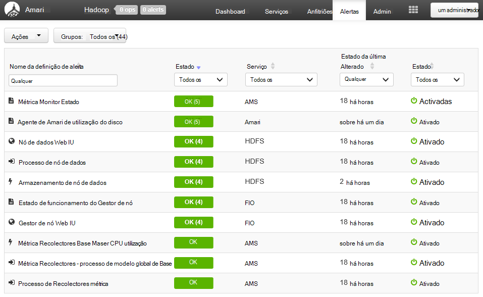

Pode gerir os grupos através do menu de **ações** e selecionando **Gerir grupos de alerta**. Esta opção permite-lhe modificar grupos existentes ou criar novos grupos.

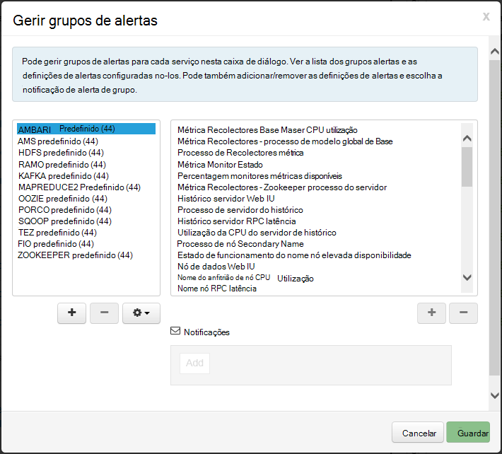

Também pode criar as notificações de alerta a partir do menu de **ações** . Esta opção permite-lhe criar accionadores enviar notificações por **correio ELETRÓNICO** ou **SNMP** quando ocorrem combinações de alerta/gravidade específico. Por exemplo, pode enviar um alerta quando qualquer um dos alertas, no grupo **Predefinido FIO** está definido para **crítica**.

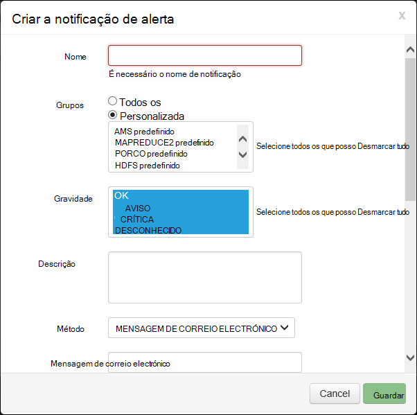

###Cluster

No separador **métricas** do dashboard contém uma série de widgets que tornam mais fácil monitorizar o estado do seu cluster de imediato. Widgets várias, tal como a **Utilização da CPU**, fornecem informações adicionais quando clicado.

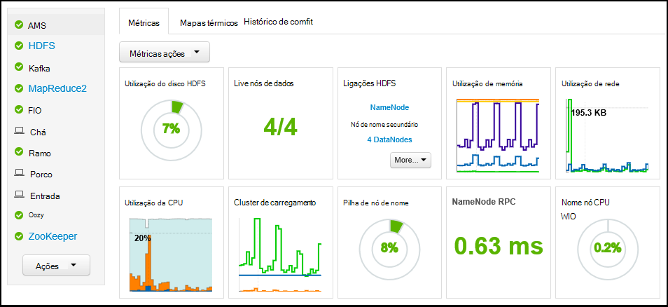

No separador **Heatmaps** apresenta métricas como heatmaps colorido, aceder a partir verde a vermelho.

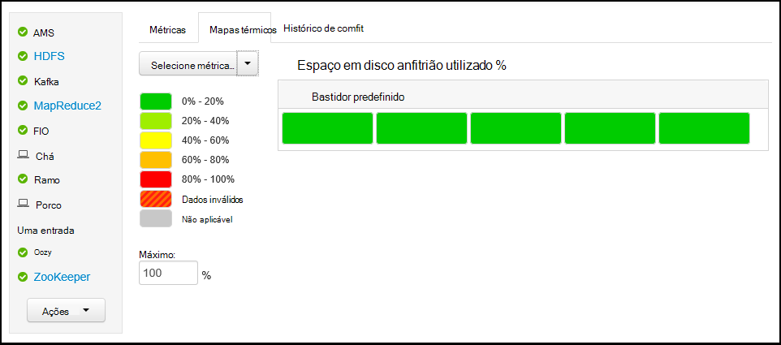

Para obter informações mais detalhadas sobre nós dentro do cluster, selecione **anfitriões**e, em seguida, selecione o nó específico que lhe interessam.

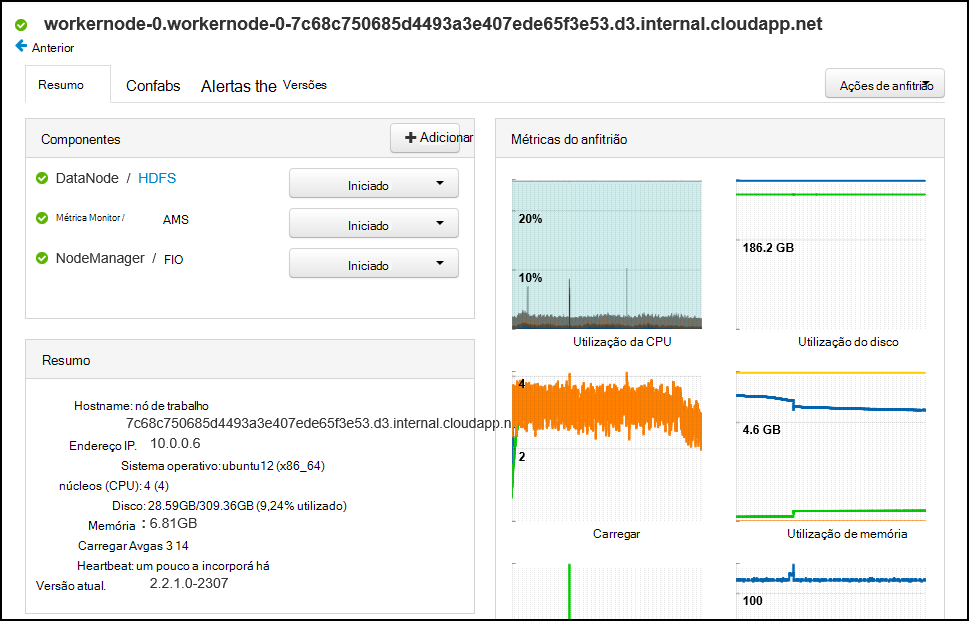

###Serviços

Barra lateral **Services** no dashboard de fornece visão rápida do estado dos serviços em execução no cluster. Ícones de várias são utilizados para indicar o estado ou ações que devem ser tidos, tal como um símbolo de reciclagem amarelo se um serviço tem de estar reciclados.

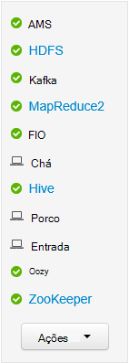

Selecionar um serviço serão apresentadas no serviço de informações mais detalhadas.

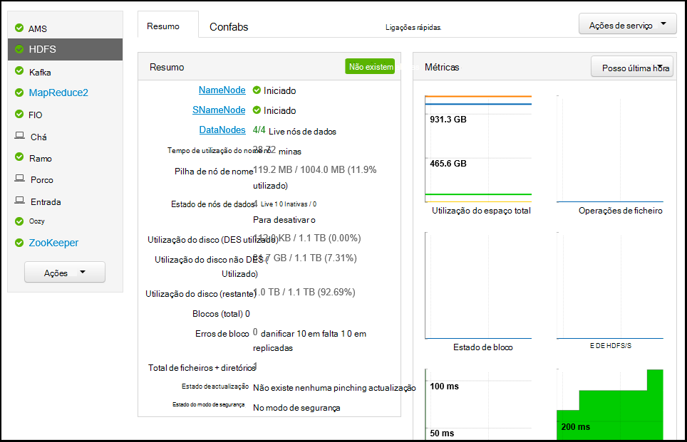

####Ligações rápidas

Alguns serviços apresentam uma ligação de **Ligações rápidas** na parte superior da página. Isto pode ser utilizado para aceder à específico do serviço web IU, tais como:

* **Histórico da tarefa** - MapReduce histórico da tarefa.

* **Gestor de recursos** - FIO ResourceManager IU.

* **NameNode** - ficheiro sistema (HDFS) NameNode IU de ficheiros distribuído Hadoop.

* **Oozie Web IU** - Oozie IU.

Selecionar qualquer uma destas ligações será aberto um novo separador no seu browser, que irá apresentar a página selecionada.

> [AZURE.NOTE] Selecionar uma ligação de **Ligações rápidas** para qualquer serviço irá resultar num erro "o servidor não encontrado", a menos que estiver a utilizar um túnel Secure Sockets Layer (SSL) para tráfego da web proxy ao cluster. Isto ocorre porque as aplicações web utilizadas para apresentar esta informação não são expostas na internet.
>
> Para obter informações sobre como utilizar um túnel SSL com HDInsight, consulte o artigo [Utilizar SSH túnel para aceder ao web Ambari IU, ResourceManager, JobHistory, NameNode, Oozie e outros web da IU](hdinsight-linux-ambari-ssh-tunnel.md)

##Gestão

###Utilizadores de Ambari, grupos e permissões

Gestão de utilizadores, grupos e permissões não deve ser utilizada com HDInsight clusters.

###Anfitriões

A página de **anfitriões** lista todos os anfitriões no cluster. Para gerir anfitriões, siga estes passos.

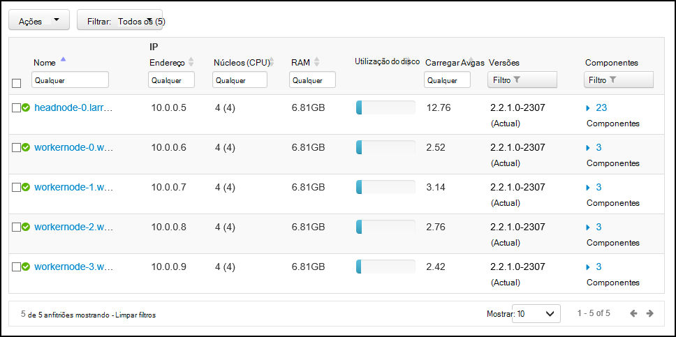

> [AZURE.NOTE] Adicionar, para desativar ou recommissioning um anfitrião não deve ser utilizada com HDInsight clusters.

1. Selecione a anfitriões que pretende gerir.

2. Utilize o menu de **ações** para selecionar a ação que pretende executar:

    * **Começar a todos os componentes** - iniciar todos os componentes no anfitrião do.

    * **Parar de todos os componentes** - parar todos os componentes no anfitrião do.

    * **Reinicie todos os componentes** - parar e comece a todos os componentes no anfitrião do.

    * **Ativar o modo de manutenção** - suprime alertas para o anfitrião. Isto deve ser activado se estiver a realizar ações que irão gerar alertas, tal como reiniciar um serviço que dependem de serviços em execução.

    * **Desativar o modo de manutenção** - devolve o anfitrião para alertar normal.

    * **Parar** - DataNode marcas ou NodeManagers no anfitrião do.

    * A **Iniciar** - inicia DataNode ou NodeManagers no anfitrião do.

    * **Reinicie** - tabulações e inícios DataNode ou NodeManagers no anfitrião do.

    * **Desactivação** - remove um anfitrião do cluster.

        > [AZURE.NOTE] Não utilize esta ação em HDInsight clusters.

    * **Recommission** - adiciona um anfitrião anteriormente desactivado ao cluster.

        > [AZURE.NOTE] Não utilize esta ação em HDInsight clusters.

###Serviços

Na página **Dashboard** ou **Serviços** , utilize o botão **ações** na parte inferior da lista de serviços para parar e iniciar todos os serviços.

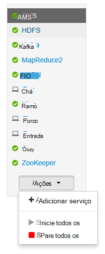

> [AZURE.WARNING] Enquanto está listados neste menu __Adicionar serviço__ , não deve ser utilizado para adicionar serviços ao HDInsight cluster. Novos serviços devem ser adicionados utilizando uma acção de Script durante o aprovisionamento de cluster. Para mais informações sobre como utilizar ações de Script, consulte o artigo [Personalizar HDInsight clusters utilizar ações de Script](hdinsight-hadoop-customize-cluster-linux.md).

Enquanto o botão **ações** pode reinicie todos os serviços, muitas vezes que pretende iniciar, parar ou reiniciar um serviço específico. Utilize os passos seguintes para executar ações num serviço individual:

1. Na página **Dashboard** ou **Serviços** , selecione um serviço.

2. Na parte superior do separador **Sumário** , utilize o botão **Ações de serviço** e selecione a ação a tomar. Isto irá reinicie o serviço em todos os nós.

    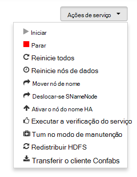

    > [AZURE.NOTE] Reiniciar alguns serviços enquanto o cluster estiver em execução, pode gerar alertas. Para evitar esta situação, pode utilizar o botão **Ações de serviço** para ativar o **modo de manutenção** do serviço antes de executar o reinício.

3. Assim que tiver sido seleccionada uma ação, a entrada de **Abrir #** na parte superior da página irão incrementar para mostrar uma operação de fundo está a ocorrer. Se configurado para apresentar, é apresentada na lista de operações de fundo.

    > [AZURE.NOTE] Se ativou o **modo de manutenção** do serviço, não se esqueça de desativá-lo ao utilizar o botão **Ações de serviço** assim que a operação terminar.

Para configurar um serviço, utilize os passos seguintes:

1. Na página **Dashboard** ou **Serviços** , selecione um serviço.

2. Selecione o separador **Configs** . Será apresentada na configuração atual. Também é apresentada uma lista das configurações anterior.

    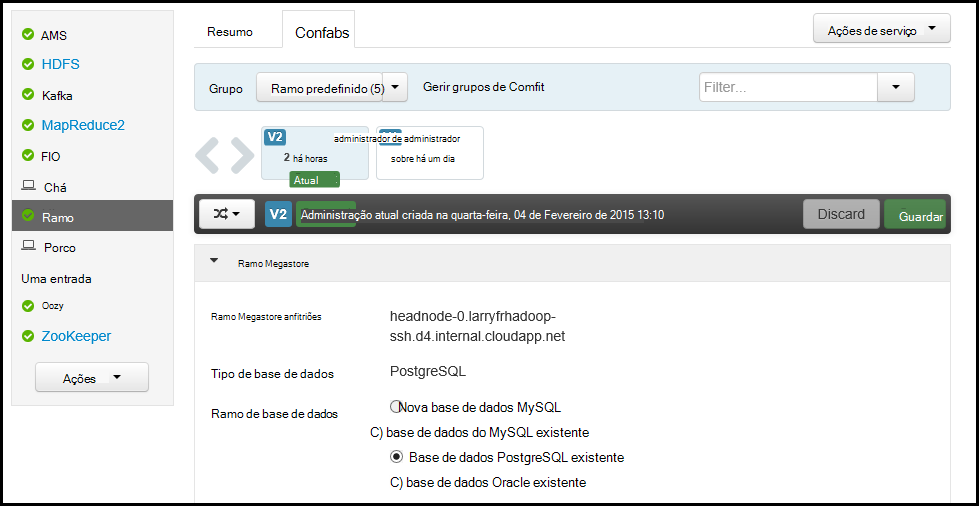

3. Utilize os campos apresentados para modificar a configuração e, em seguida, selecione **Guardar**. Ou selecione uma configuração anterior e, em seguida, selecione **tornar actual** para reverter para as definições anteriores.

##Vistas de Ambari

Vistas Ambari permitir que os programadores ligue elementos IU IU Ambari Web utilizando o [Ambari vistas Framework](https://cwiki.apache.org/confluence/display/AMBARI/Views). HDInsight fornece as seguintes vistas com tipos de cluster Hadoop:

* Gestor de fila fio: O Gestor da fila fornece uma IU simple para visualizar e modificar filas FIO.
* Ramo de vista: A vista Hive permite a execução de consultas de ramo diretamente a partir do browser. Pode guardar consultas, ver resultados, guardar os resultados ao armazenamento de cluster ou transferir resultados ao seu sistema local. Para mais informações sobre como utilizar Hive vistas, consulte o artigo [Utilizar Hive vistas com HDInsight](hdinsight-hadoop-use-hive-ambari-view.md).
* Vista Tez: A vista de Tez permite-lhe melhor compreender e otimizar tarefas por ver informações sobre como são executadas Tez tarefas e quais os recursos são utilizados pela tarefa.
