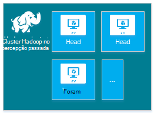
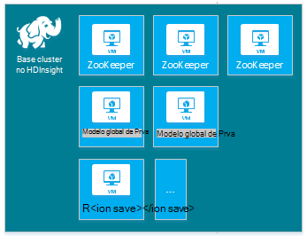
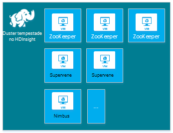
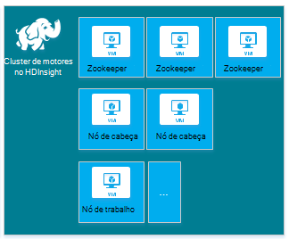
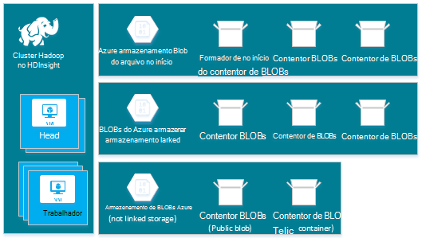
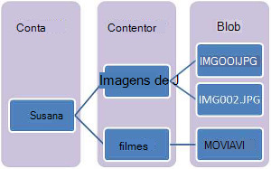
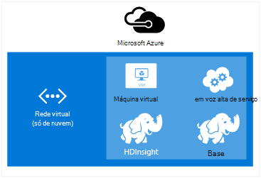
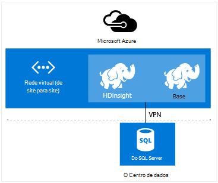

<properties
    pageTitle="Criar clusters Hadoop, HBase, tempestade ou motores no Linux no HDInsight | Microsoft Azure"
    description="Saiba como criar Hadoop, HBase, tempestade ou gerar clusters no Linux para HDInsight utilizando um browser, o clip do Azure, Azure PowerShell, resto, ou através de um SDK."
    services="hdinsight"
    documentationCenter=""
    authors="mumian"
    manager="jhubbard"
    editor="cgronlun"
    tags="azure-portal"/>

<tags
    ms.service="hdinsight"
    ms.devlang="na"
    ms.topic="article"
    ms.tgt_pltfrm="na"
    ms.workload="big-data"
    ms.date="10/18/2016"
    ms.author="jgao"/>

# Criar baseado em Linux Hadoop clusters no HDInsight

[AZURE.INCLUDE [selector](../../includes/hdinsight-selector-create-clusters.md)]

Um cluster de Hadoop consiste em várias máquinas virtuais (nós) são utilizadas para processamento distribuído das tarefas no cluster. Azure abstracts os detalhes da execução da instalação e configuração de nós individuais, pelo que só tem de fornecer informações gerais de configuração. Neste artigo, pode obter informações sobre estas definições de configuração.

## Requisitos de controlo de acesso

[AZURE.INCLUDE [access-control](../../includes/hdinsight-access-control-requirements.md)]

## Tipos de cluster

Atualmente, o Azure HDInsight fornece cinco tipos diferentes de clusters, cada uma com um conjunto de componentes para fornecer determinadas funcionalidades.

| Tipo de cluster | Funcionalidade |
| ------------ | ----------------------------- |
| Hadoop       | Consulta e análise (trabalhos em lotes)     |
| HBase        | Armazenamento de dados NoSQL            |
| Tempestade        | Processamento de eventos em tempo real |
| Motores        | Processamento de na memória, interativas consultas, processamento micro batch sequência |
| [Ramo interativo (pré-visualização)](hdinsight-hadoop-use-interactive-hive.md) | Na memória colocação em cache para consultas de ramo interativas e mais rápidas|
| Servidor de R na motores (pré-visualização) | Uma variedade de estatísticas de dados grande, modelação de aspeto do Office e funcionalidades de aprendizagem automática |

Cada tipo de cluster tem o seu próprio número de nós dentro do cluster, terminologia de nós dentro do cluster e tamanho da memória virtual predefinido para cada tipo de nó. Na tabela seguinte, o número de nós para cada tipo de nó é entre parênteses.

| Tipo| Nós | Diagrama|
|-----|------|--------|
|Hadoop| Nó de cabeça (2), nó de dados (1 +)||
|HBase|Servidor de cabeça (2), servidor de região (1 +) nó de mestre/Zookeeper (3)||
|Tempestade|Nó de nimbus (2), servidor de autoridade (1 +) nó Zookeeper (3)||
|Motores|Nó de cabeça (2), nó de trabalho (1 +) nó Zookeeper (3) (livre para o tamanho da memória virtual de animais A1)||

A tabela seguinte lista os tamanhos VM predefinidos para HDInsight:

- Todas as suportadas regiões exceto Brasil Sul e oeste Japão:

  	|Tipo de cluster                     | Hadoop               | HBase                | Tempestade                | Motores                                                                 | Servidor de R |
  	|---------------------------------|----------------------|----------------------|----------------------|-----------------------------------------------------------------------|-----------------------------------------------------------------------|
  	|Predefinição de cabeça – tamanho da memória virtual           | D3 v2                | D3 v2                | A3                   | D12 v2                                                                | D12 v2                                                                |
  	|Cabeça – recomendado tamanhos VM      | D3 v2, D4 v2, D12 v2 | D3 v2, D4 v2, D12 v2 | A3, A4, A5           | D12 v2, D13 v2, D14 v2                                                | D12 v2, D13 v2, D14 v2                                                |
  	|Trabalhador – predefinido tamanho da memória virtual         | D3 v2                | D3 v2                | D3 v2                | Windows: D12 v2; Linux: D4 v2                                         | Windows: D12 v2; Linux: D4 v2                                         |
  	|Trabalhador – recomendado tamanhos VM    | D3 v2, D4 v2, D12 v2 | D3 v2, D4 v2, D12 v2 | D3 v2, D4 v2, D12 v2 | Windows: D12 v2, D13 v2, D14 v2; Linux: D4 v2, D12 v2, D13 v2, D14 v2 | Windows: D12 v2, D13 v2, D14 v2; Linux: D4 v2, D12 v2, D13 v2, D14 v2 |
  	|Zookeeper – predefinido tamanho da memória virtual      |                      | A3                   | A2                   |                                                                       |
  	|Zookeeper – recomendado tamanhos VM |                      | A3, A4, A5           | A2, A3 E A4           |                                                                       |
  	|Limite - predefinição tamanho da memória virtual           |                      |                      |                      |                                                                       | Windows: D12 v2; Linux: D4 v2                                         |
  	|Limite - recomendado tamanho da memória virtual       |                      |                      |                      |                                                                       | Windows: D12 v2, D13 v2, D14 v2; Linux: D4 v2, D12 v2, D13 v2, D14 v2 |

- Brasil Sul e apenas oeste Japão (sem v2 tamanhos aqui):

  	|Tipo de cluster                     | Hadoop      | HBase       | Tempestade      | Motores                                          |Servidor de R|
  	|---------------------------------|-------------|-------------|------------|------------------------------------------------|--------|
  	|Predefinição de cabeça – tamanho da memória virtual           | D3          | D3          | A3         | D12                                            | D12|
  	|Cabeça – recomendado tamanhos VM      | D3, D4, D12 | D3, D4, D12 | A3, A4, A5 | D12, D13, D14                                  | D12, D13, D14|
  	|Trabalhador – predefinido tamanho da memória virtual         | D3          | D3          | D3         | Windows: D12; Linux: D4                        | Windows: D12; Linux: D4|
  	|Trabalhador – recomendado tamanhos VM    | D3, D4, D12 | D3, D4, D12 | D3, D4, D12| Windows: D12, D13, D14; Linux: D4, D12, D13, D14| Windows: D12, D13, D14; Linux: D4, D12, D13, D14|
  	|Zookeeper – predefinido tamanho da memória virtual      |             | A2          | A2         |                                                | |
  	|Zookeeper – recomendado tamanhos VM |             | A2, A3 E A4  | A2, A3 E A4 |                                                | |
  	|Limite – predefinido tamanhos VM          |             |             |            |                                                | Windows: D12; Linux: D4 |
  	|Limite – recomendado tamanhos VM      |             |             |            |                                                | Windows: D12, D13, D14; Linux: D4, D12, D13, D14 |

Tenha em atenção que cabeça é conhecida como *Nimbus* para o tipo de cluster tempestade. Trabalhador é conhecido como *região* para o tipo de cluster HBase e como *autoridade* para o tipo de cluster tempestade.

> [AZURE.IMPORTANT] Se planeia ter mais de 32 nós de trabalho, na criação de cluster ou por dimensionamento cluster após a criação, tem de selecionar um tamanho de cabeça nó com, pelo menos, 8 núcleos e 14 GB de RAM.

Pode adicionar outros componentes como matiz ou R para estes tipos básicos utilizando [Script ações](#customize-clusters-using-script-action).

> [AZURE.IMPORTANT] HDInsight clusters está disponível uma variedade de tipos de, que correspondem à carga de trabalho ou tecnologia cluster está optimizado para. Não existe nenhum método suportado para criar um cluster que combina vários tipos de, tais como tempestade e HBase num cluster de um. 

Se a sua solução exigir tecnologias são propagadas através de vários tipos de cluster HDInsight, deve criar uma rede Virtual do Azure e criar os tipos de cluster necessários no interior da rede virtual. Esta opção permite-clusters e qualquer código que implemente-los, para comunicarem diretamente entre si.

Para mais informações sobre como utilizar uma rede Virtual Azure com HDInsight, consulte o artigo [Expandir HDInsight com redes virtuais Azure](hdinsight-extend-hadoop-virtual-network.md).

Para obter um exemplo de utilização de dois tipos de cluster dentro de uma rede Virtual Azure, consulte o artigo [Analisar dados de sensor com tempestade e HBase](hdinsight-storm-sensor-data-analysis.md).

## Cluster camadas

Azure HDInsight fornece as ofertas de nuvem grande dados em duas categorias: Standard e [Premium](hdinsight-component-versioning.md#hdinsight-standard-and-hdinsight-premium). HDInsight Premium inclui R e outros componentes adicionais. HDInsight Premium só é suportada em HDInsight versão 3.4.

A tabela seguinte lista os tipo de cluster HDInsight e matriz de suporte HDInsight Premium.

| Tipo de cluster | Padrão | Premium  |
|--------------|---------------|--------------|
| Hadoop       | Sim           | Sim          |
| Motores        | Sim           | Sim          |
| HBase        | Sim           | N           |
| Tempestade        | Sim           | N           |
| Servidor de R na motores | N | Sim |

Esta tabela será atualizada como mais tipos de cluster estão incluídos no HDInsight Premium. A captura de ecrã seguinte mostra as informações de portais Azure para escolher tipos de cluster.

## Opções de configuração básica

Seguem-se as opções de configuração básica utilizadas para criar um cluster de HDInsight.

### Nome do cluster ###

Nome do cluster é utilizado para identificar um cluster. Cluster nome deve ser globalmente exclusivo e têm de aderir para as seguintes diretrizes de nomenclatura:

- O campo tem de ser uma cadeia que contém entre 3 e 63 caracteres.
- O campo pode conter apenas letras, números e hífenes.

### Tipo de cluster###

Consulte o artigo [tipos de Cluster](#cluster-types) e [camadas de Cluster](#cluster-tiers).

### Sistema operativo ###

Pode criar HDInsight clusters sobre um dos dois sistemas operativos seguintes:

- HDInsight no Linux.  HDInsight fornece a opção de configurar Linux clusters no Azure. Configurar um cluster de Linux se estiver familiarizado com Linux ou Unix, migrar a partir de uma solução baseada em Linux Hadoop existente, ou pretende fácil integração com os componentes de ecossistema Hadoop criadas para Linux. Para mais informações, consulte o artigo [Introdução ao Hadoop no Linux no HDInsight](hdinsight-hadoop-linux-tutorial-get-started.md).
- HDInsight no Windows (Windows Server 2012 R2 Centro de dados).

### Versão HDInsight###

Isto é utilizado para determinar a versão do HDInsight necessário para este cluster. Para mais informações, consulte o artigo [versões de cluster Hadoop e componentes no HDInsight](https://go.microsoft.com/fwLink/?LinkID=320896&clcid=0x409).

### Nome da subscrição###

Cada cluster HDInsight está associada a uma subscrição Azure.

### Nome do grupo de recursos ###

Ajuda-o [Gestor de recursos do Azure](../azure-resource-manager/resource-group-overview.md) a trabalhar com os recursos na sua aplicação como um grupo, designados de um grupo de recursos do Azure. Pode implementar, atualizar, monitorizar ou eliminar todos os recursos para a sua aplicação numa única coordenada operação.

### Credenciais###

Com clusters de HDInsight, pode configurar duas contas de utilizador durante a criação de cluster:

- Utilizador HTTP. O nome de utilizador predefinido é *administrador* com a configuração básica no portal do Azure. Por vezes denominada "Cluster utilizador".
- Utilizador SSH (Linux clusters). Isto é utilizado para ligar ao cluster utilizando SSH. Pode criar contas de utilizador SSH adicionais depois de criado o cluster ao seguir os passos na [Utilização SSH com baseado em Linux Hadoop no HDInsight Linux, Unix, ou OS X](hdinsight-hadoop-linux-use-ssh-unix.md) ou [Utilizar SSH com baseado em Linux Hadoop no HDInsight a partir do Windows](hdinsight-hadoop-linux-use-ssh-unix.md).

    >[AZURE.NOTE] Para clusters baseados no Windows, pode criar um utilizador RDP para ligar ao cluster utilizando o RDP.

### Origem de dados###

Sistema de ficheiros distribuído de Hadoop (HDFS) original utiliza muitos discos locais no cluster. HDInsight utiliza o armazenamento de Blobs do Azure para armazenamento de dados. Armazenamento de Blobs do Azure é uma solução de armazenamento geral, robustos que integra-se totalmente com HDInsight. Através de uma interface HDFS, o conjunto completo de componentes no HDInsight pode funcionar diretamente no estruturadas ou não estruturados dados armazenamento de Blobs. Armazenar os dados em armazenamento de BLOBs ajuda-o com segurança eliminar clusters HDInsight que são usados para cálculo sem perder os dados de utilizador.

Durante a configuração, terá de especificar uma conta de armazenamento Azure e um contentor de armazenamento de Blobs do Azure na conta de armazenamento Azure. Alguns processos de criação requerem a conta de armazenamento Azure e o contentor de armazenamento de BLOBs previamente criado. O contentor de armazenamento de BLOBs é utilizado como localização de armazenamento pré-definido pelo cluster. Opcionalmente, pode especificar contas de armazenamento do Windows Azure (armazenamento ligada) adicionais que serão acessíveis pelo cluster. Cluster também pode aceder a qualquer contentores de armazenamento de BLOBs que estão configurados com completa público acesso de leitura ou público acesso de leitura para blobs apenas.  Para mais informações, consulte o artigo [Gerir o acesso aos recursos de armazenamento do Azure](../storage/storage-manage-access-to-resources.md).

>[AZURE.NOTE] Um contentor de armazenamento de BLOBs fornece um agrupamento de um conjunto de blobs conforme apresentado na seguinte imagem.

Não recomendamos que utilize o contentor de armazenamento de BLOBs predefinido para armazenar dados de negócio. Depois de cada utilização para reduzir o custo de armazenamento é aconselhável a eliminar o contentor de armazenamento de BLOBs predefinido. Nota que o contentor predefinido contém aplicações e de sistema registos. Certifique-se obter os registos antes de eliminar o contentor.

>[AZURE.WARNING] Partilha de um contentor de armazenamento de BLOBs para vários clusters não é suportada.

Para mais informações sobre a utilização do armazenamento de Blobs do secundário, consulte o artigo [Utilizar o armazenamento de Blobs do Azure com HDInsight](hdinsight-hadoop-use-blob-storage.md).

Para além de armazenamento de Blobs do Azure, também pode utilizar [Arquivo de Lake Azure dados](../data-lake-store/data-lake-store-overview.md) como uma conta de armazenamento predefinida para cluster de HBase HDInsight e como armazenamento ligado para todos os quatro tipos de cluster HDInsight. Para mais informações, consulte o artigo [criar um cluster de HDInsight com o arquivo de dados de Lake utilizando o Azure portal](../data-lake-store/data-lake-store-hdinsight-hadoop-use-portal.md).

### Localização (região) ###

Ao cluster HDInsight e a sua conta de armazenamento predefinida tem de ser localizados na mesma localização Azure.

Para obter uma lista das regiões suportadas, clique na lista pendente de **região** no [HDInsight preços](https://go.microsoft.com/fwLink/?LinkID=282635&clcid=0x409).

### Nó preços camadas###

Os clientes são faturados para a utilização de em nós para a duração do ciclo de vida do cluster. Faturação é iniciado um cluster de é criado e deixa de quando o cluster é eliminado. Clusters não podem ser atribuídos anular ou colocar em espera.

Tipos de cluster diferentes têm tipos de nó diferente, número de nós e tamanhos de nó. Por exemplo, um tipo de cluster Hadoop tem dois _nós de cabeça_ e uma predefinição de quatro _nós de dados_, enquanto que tem um tipo de cluster tempestade dois _nós nimbus_, três _nós zookeeper_e uma predefinição de quatro _nós autoridade_. O custo de HDInsight clusters é determinado pelo número de nós e os tamanhos máquinas virtuais para os nós. Por exemplo, se souber que vai estar a executar operações de que precisa de muitos memória, poderá querer selecionar um recurso de cluster com mais memória. Para fins de formação, recomenda-se para utilizar um nó de dados. Para mais informações sobre preços do HDInsight, consulte o artigo [HDInsight preços](https://go.microsoft.com/fwLink/?LinkID=282635&clcid=0x409).

>[AZURE.NOTE] O limite de tamanho de cluster varia entre subscrições Azure. Contacte o suporte de faturação para aumentar o limite.

>Os nós utilizado pelo seu cluster não contam como máquinas virtuais uma vez que as imagens de máquina virtual utilizadas para os nós são um detalhe de implementação do serviço HDInsight. Os tarolos cluster utilizados pelos nós são contabilizados para o número total de cluster núcleos disponíveis para a sua subscrição. Pode ver o número de núcleos disponíveis e os tarolos que serão utilizados pelo cluster na secção de resumo da pá nó preços camadas ao criar um cluster de HDInsight.

Quando utiliza o portal do Azure para configurar o cluster, o tamanho do nó está disponível através de pá o __Nó preços camada__ . Também pode ver o custo associado os tamanhos de nó diferente. A captura de ecrã seguinte mostra as opções disponíveis para um cluster de Hadoop Linux base.

As tabelas seguintes mostram os tamanhos suportados pelo HDInsight clusters e as capacidades fornecem.

#### Camada padrão: A série####

No modelo clássico de implementação, alguns tamanhos VM são um pouco diferentes no PowerShell e clip.
* Standard_A3 é grande
* Standard_A4 é ExtraLarge

|Tamanho |Núcleos CPU|Memória|NIC (Max)|Máximo. tamanho do disco|Máximo. discos de dados (GB 1023 cada)|Máximo. IOPS (500 por disco)|
|---|---|---|---|---|---|---|
|Standard_A3\Large|4|7 GB|2|Temporário = 285 GB |8|8 x 500|
|Standard_A4\ExtraLarge|8|14 GB|4|Temporário = 605 GB |16|16 x 500|
|Standard_A6|4|28 GB|2|Temporário = 285 GB |8|8 x 500|
|Standard_A7|8|56 GB|4|Temporário = 605 GB |16|16 x 500|

#### Camada padrão: D série####

|Tamanho |Núcleos CPU|Memória|NIC (Max)|Máximo. tamanho do disco|Máximo. discos de dados (GB 1023 cada)|Máximo. IOPS (500 por disco)|
|---|---|---|---|---|---|---|
|Standard_D3 |4|14 GB|4|Temporário (SSD) = 200 GB |8|8 x 500|
|Standard_D4 |8|28 GB|8|Temporário (SSD) = 400 GB |16|16 x 500|
|Standard_D12 |4|28 GB|4|Temporário (SSD) = 200 GB |8|8 x 500|
|Standard_D13 |8|56 GB|8|Temporário (SSD) = 400 GB |16|16 x 500|
|Standard_D14 |16|112 GB|8|Temporário (SSD) = 800 GB |32|32 x 500|

#### Camada padrão: Dv2 série####

|Tamanho |Núcleos CPU|Memória|NIC (Max)|Máximo. tamanho do disco|Máximo. discos de dados (GB 1023 cada)|Máximo. IOPS (500 por disco)|
|---|---|---|---|---|---|---|
|Standard_D3_v2 |4|14 GB|4|Temporário (SSD) = 200 GB |8|8 x 500|
|Standard_D4_v2 |8|28 GB|8|Temporário (SSD) = 400 GB |16|16 x 500|
|Standard_D12_v2 |4|28 GB|4|Temporário (SSD) = 200 GB |8|8 x 500|
|Standard_D13_v2 |8|56 GB|8|Temporário (SSD) = 400 GB |16|16 x 500|
|Standard_D14_v2 |16|112 GB|8|Temporário (SSD) = 800 GB |32|32 x 500|    

Considerações implementação ter em consideração quando está a planear utilizar estes recursos, consulte o artigo [tamanhos para máquinas virtuais](../virtual-machines/virtual-machines-windows-sizes.md). Para obter informações sobre preços de vários tamanhos, consulte o artigo [HDInsight preços](https://azure.microsoft.com/pricing/details/hdinsight).   

> [AZURE.IMPORTANT] Se planeia ter mais de 32 nós de trabalho, na criação de cluster ou por dimensionamento cluster após a criação, tem de selecionar um tamanho de cabeça nó com, pelo menos, 8 núcleos e 14 GB de RAM.

Faturação é iniciado um cluster de é criado e deixa de quando o cluster é eliminado. Para mais informações sobre preços, consulte o artigo [Detalhes do preços HDInsight](https://azure.microsoft.com/pricing/details/hdinsight/).

## Utilizar o armazenamento adicional

Em alguns casos, pode optar por adicionar armazenamento adicional ao cluster. Por exemplo, poderá ter várias contas do Azure armazenamento de diferentes regiões geográficas ou serviços diferentes, mas que pretende analisá-los, tudo com HDInsight.

Pode adicionar contas de armazenamento quando cria um cluster de HDInsight ou após a criação de um cluster.  Consulte [clusters baseado em Personalizar Linux HDInsight utilizando a ação de Script](hdinsight-hadoop-customize-cluster-linux.md).

Para mais informações sobre o armazenamento de BLOBs secundário, consulte o artigo [armazenamento de Blobs do Azure de utilizar com HDInsight](hdinsight-hadoop-use-blob-storage.md). Para mais informações sobre o armazenamento de Lake de dados secundária, consulte o artigo [Criar HDInsight clusters com dados Lake arquivo através do portal Azure](../data-lake-store/data-lake-store-hdinsight-hadoop-use-portal.md).

## Utilizar ramo/Oozie metastore

Recomendamos vivamente que utilize um metastore personalizado se pretende manter as suas tabelas ramo depois de eliminar o seu cluster HDInsight. Pode poderão anexar esse metastore a outro cluster de HDInsight.

> [AZURE.IMPORTANT] HDInsight metastore criada para uma versão de cluster HDInsight, não pode ser partilhado através de versões diferentes de cluster de HDInsight. Para obter uma lista de versões do HDInsight, consulte o artigo [versões suportadas HDInsight](hdinsight-component-versioning.md#supported-hdinsight-versions).

O metastore contém ramo e Oozie metadados, como tabelas do ramo, partições, esquemas e colunas. O metastore ajuda-o a manter os seus metadados de ramo e Oozie, pelo que não necessita criar tabelas de ramo ou tarefas Oozie quando cria um novo cluster. Por predefinição, o ramo utiliza uma base de dados do Azure SQL incorporado para armazenar estas informações. A base de dados incorporado não consegue preservar os metadados quando o cluster é eliminado. Quando criar tabela Hive num HDInsight cluster com um metastore ramo configurado, essas tabelas serão retidas quando recriar o cluster utilizando a mesma metastore ramo.

Configuração de Metastore não está disponível para os tipos de cluster HBase.

> [AZURE.IMPORTANT] Ao criar um metastore personalizado, não utilize um nome de base de dados que contenha traços ou hífenes. Isto pode causar o processo de criação de cluster falha.

## Utilizar redes virtuais Azure

Com uma [rede virtual Azure](https://azure.microsoft.com/documentation/services/virtual-network/), pode criar uma rede segura, persistente que contém os recursos que necessita para a sua solução. Com uma rede virtual, pode:

* Ligue-se na nuvem recursos em conjunto numa rede privada (só de nuvem).

    

* Ligue os recursos da nuvem à sua rede do Centro de dados locais (site para o site ou site de ponto) utilizando uma rede privada virtual (VPN).

| Configuração do site para o site | Configuração do ponto-para-site |
| -------------------------- | --------------------------- |
| Com a configuração do site para o site, pode ligar vários recursos a partir do seu centro de dados para a rede virtual Azure utilizando um hardware VPN ou o encaminhamento e o serviço de acesso remoto.  | Com a configuração de ponto-para-site, pode ligar um recurso específico para a rede virtual Azure utilizando um software de VPN.  |

Clusters baseados no Windows requerem uma v1 rede virtual (clássico), enquanto clusters baseados em Linux necessitam de rede virtual v2 (Azure Gestor de recurso). Se não tiver o tipo de rede correto, não será utilizável quando criar o cluster.

Para obter mais informações sobre como utilizar HDInsight com uma rede virtual, incluindo os requisitos de configuração específicas para a rede virtual, consulte o artigo [funcionalidades de expandir HDInsight utilizando uma rede virtual Azure](hdinsight-extend-hadoop-virtual-network.md).

## Personalizar clusters de personalização de cluster HDInsight (arranque)

Por vezes, pretende configurar os seguintes ficheiros de configuração:

- clusterIdentity.xml
- Core site.xml
- gateway.XML
- hbase env.xml
- hbase site.xml
- hdfs site.xml
- ramo env.xml
- ramo site.xml
- mapred site
- oozie site.xml
- oozie env.xml
- tempestade site.xml
- tez site.xml
- webhcat site.xml
- fio site.xml

Para manter as alterações através do tempo de vida de um cluster, pode utilizar a personalização de cluster HDInsight durante o processo de criação ou pode utilizar Ambari em clusters baseado em Linux. Para mais informações, consulte o artigo [Personalizar HDInsight clusters utilizando o arranque](hdinsight-hadoop-customize-cluster-bootstrap.md).

>[AZURE.NOTE] Os clusters baseados no Windows não consegue reter as alterações devido a imagem novamente. Para obter mais informações, consulte [Função instância reinicia vencimento a actualizações SO](http://blogs.msdn.com/b/kwill/archive/2012/09/19/role-instance-restarts-due-to-os-upgrades.aspx).  Para manter as alterações através do tempo de vida dos clusters, tem de utilizar a personalização de cluster HDInsight durante o processo de criação.

## Personalizar clusters de utilizar a ação de Script

Pode instalar componentes adicionais ou personalizar a configuração do cluster utilizando scripts durante a criação. Desses scripts são invocar através de uma **Ação de Script**, que é uma opção de configuração que pode ser utilizada a partir do portal do Azure, cmdlets do Windows PowerShell do HDInsight ou o HDInsight .NET SDK. Para mais informações, consulte o artigo [cluster de personalizar HDInsight utilizando a ação de Script](hdinsight-hadoop-customize-cluster-linux.md).

Alguns componentes Java nativos, como Mahout e em cascata, podem ser executados em cluster como ficheiros de arquivo de Java (para caixa). Estes ficheiros para caixa podem ser distribuídos ao armazenamento de Blobs do Azure e submetidos a HDInsight clusters através de mecanismos de submissão Hadoop tarefa. Para mais informações, consulte o artigo [Submeter Hadoop através de programação de tarefas](hdinsight-submit-hadoop-jobs-programmatically.md).

>[AZURE.NOTE] Se tiver problemas implementar para caixa ficheiros a HDInsight clusters ou a chamada para caixa ficheiros em HDInsight clusters, contacte o [Suporte da Microsoft](https://azure.microsoft.com/support/options/).

> Em cascata não é suportado pelo HDInsight e não é elegível para o Microsoft Support. Para listas de componentes suportados, consulte o artigo [quais são as novidades nas versões cluster fornecidas pela HDInsight?](hdinsight-component-versioning.md)

## Utilizar o nó do limite

 Um nó limite branco é uma máquina de virtual Linux com as mesmas ferramentas de cliente instalado e configurado tal como o headnodes. Pode utilizar o nó do limite para aceder ao cluster, testar as suas aplicações de cliente e alojamento suas aplicações de cliente. Para mais informações, consulte o artigo [nós de limite branco utilização no HDInsight](hdinsight-apps-use-edge-node.md).
 
## Métodos de criação de cluster

Neste artigo, aprendeu informações básicas sobre a criação de um cluster de baseado em Linux HDInsight. Utilize a tabela seguinte para encontrar informações específicas sobre como criar um cluster utilizando um método que melhor se adequa às suas necessidades.

| Clusters criados com | Web browser | Linha de comandos | REST API | SDK | Linux, o Mac OS X ou Unix | Windows |
| ------------------------------- |:----------------------:|:--------------------:|:------------------:|:------------:|:-----------------------------:|:------------:|
| [Portal do Azure](hdinsight-hadoop-create-linux-clusters-portal.md) | ✔     | &nbsp; | &nbsp; | &nbsp; | ✔      | ✔ |
| [Dados Azure fábrica](hdinsight-hadoop-create-linux-clusters-adf.md) | ✔     | ✔  | ✔  |✔  | ✔      | ✔ |
| [Clip Azure](hdinsight-hadoop-create-linux-clusters-azure-cli.md)         | &nbsp; | ✔     | &nbsp; | &nbsp; | ✔      | ✔ |
| [Azure PowerShell](hdinsight-hadoop-create-linux-clusters-azure-powershell.md) | &nbsp; | ✔     | &nbsp; | &nbsp; | ✔ | ✔ |
| [Laço](hdinsight-hadoop-create-linux-clusters-curl-rest.md) | &nbsp; | ✔     | ✔ | &nbsp; | ✔      | ✔ |
| [.NET SDK](hdinsight-hadoop-create-linux-clusters-dotnet-sdk.md) | &nbsp; | &nbsp; | &nbsp; | ✔ | ✔      | ✔ |
| [Modelos de Gestor de recursos do Azure](hdinsight-hadoop-create-linux-clusters-arm-templates.md) | &nbsp; | ✔     | &nbsp; | &nbsp; | ✔      | ✔ |
