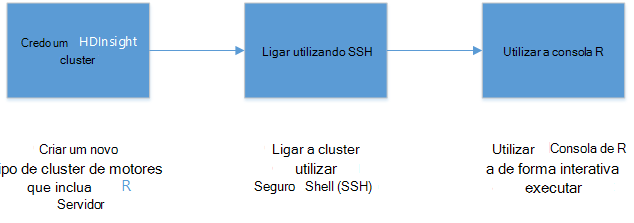
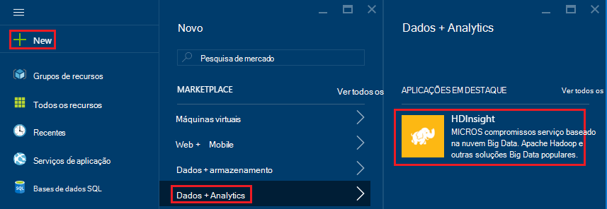
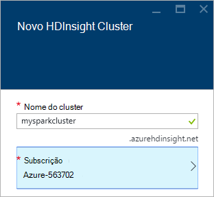
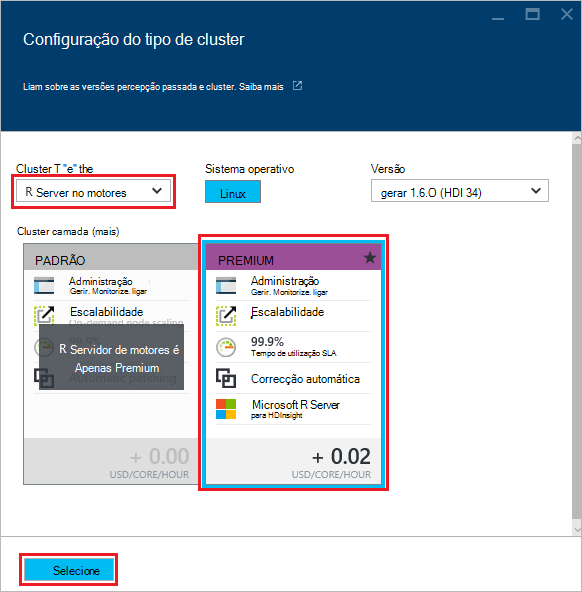
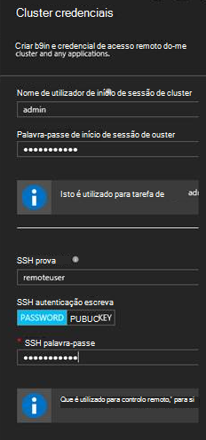
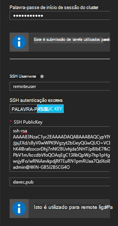
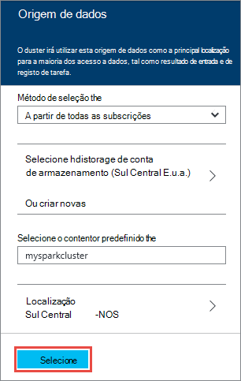
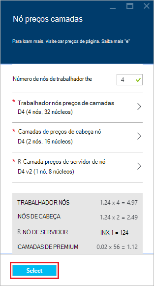
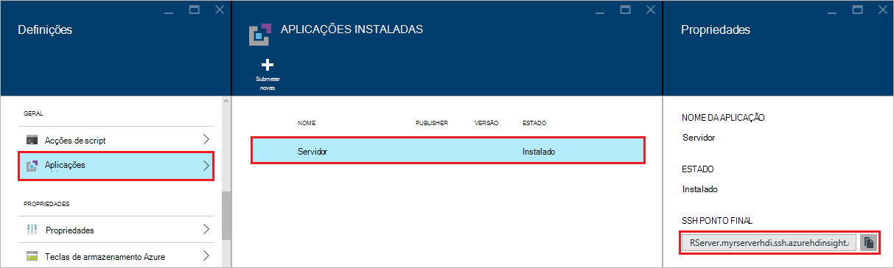
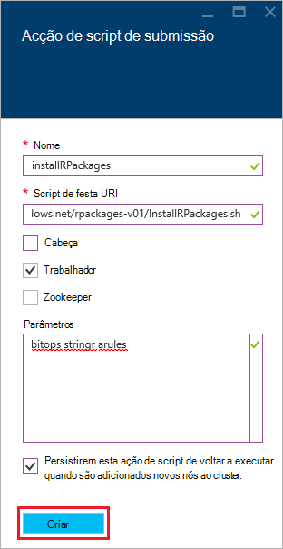

<properties
   pageTitle="Introdução ao servidor R HDInsight (pré-visualização) | Azure"
   description="Saiba como criar um motores Apache num cluster de HDInsight (Hadoop) que inclua R Server (pré-visualização) e, em seguida, submeter um script R no cluster."
   services="HDInsight"
   documentationCenter=""
   authors="jeffstokes72"
   manager="jhubbard"
   editor="cgronlun"
/>

<tags
   ms.service="HDInsight"
   ms.devlang="R"
   ms.topic="article"
   ms.tgt_pltfrm="na"
   ms.workload="data-services"
   ms.date="08/19/2016"
   ms.author="jeffstok"
/>

# Começar a utilizar o servidor de R HDInsight (pré-visualização)

A camada premium oferta para HDInsight inclui R servidor como parte do seu cluster HDInsight (pré-visualização). Isto permite que os scripts de R utilizar MapReduce e motores para executar cálculos distribuídos. Neste documento, vai aprender a criar um novo servidor de R no HDInsight, em seguida, executar um script de R demonstra a utilização motores para distribuído cálculos de R.

## Pré-requisitos

* __Azure uma subscrição__: antes de começar este tutorial, tem de ter uma subscrição do Azure. Para mais informações, consulte [obter Azure versão de avaliação gratuita](https://azure.microsoft.com/documentation/videos/get-azure-free-trial-for-testing-hadoop-in-hdinsight/) .

* __Cliente da Shell de um seguro (SSH)__: uma SSH cliente é utilizado para ligar ao HDInsight cluster e executar comandos diretamente num cluster remotamente. Sistemas Linux, Unix e OS X fornecem um cliente SSH através de `ssh` comando. Para sistemas Windows, recomendamos que [betumes](http://www.chiark.greenend.org.uk/~sgtatham/putty/download.html).

    * __Teclas de SSH (opcionais)__: pode proteger a conta SSH utilizada para ligar ao cluster utilizando uma palavra-passe ou uma chave pública. Utilizar uma palavra-passe é mais fácil e permite-lhe começar a utilizar sem ter de criar um par de chaves de público/privado; No entanto, a utilizar uma chave é mais segura.
    
        Os passos neste documento partem do pressuposto de que está a utilizar uma palavra-passe. Para obter informações sobre como criar e utilizar teclas SSH com HDInsight, consulte os seguintes documentos:
        
        * [Utilizar SSH com HDInsight a partir dos clientes Linux, Unix ou OS X](hdinsight-hadoop-linux-use-ssh-unix.md)
        
        * [Utilizar SSH com HDInsight a partir de clientes do Windows](hdinsight-hadoop-linux-use-ssh-windows.md)

### Requisitos de controlo de acesso

[AZURE.INCLUDE [access-control](../../includes/hdinsight-access-control-requirements.md)]

## Criar o cluster

> [AZURE.NOTE] Os passos neste documento criam um servidor de R no HDInsight utilizando as informações de configuração básica. Para outras definições de configuração de cluster (tal como adicionar contas de armazenamento adicional, utilizando uma rede Virtual do Azure ou criando um metastore para ramo), consulte o artigo [clusters baseado em criar Linux HDInsight](hdinsight-hadoop-provision-linux-clusters.md).

1. Inicie sessão no [portal do Azure](https://portal.azure.com).

2. Selecione __Novo__, __dados + Analytics__e, em seguida, __HDInsight__.

    

3. Introduza um nome para o cluster no campo __Nome do Cluster__ . Se tiver múltiplas subscrições Azure, utilize a entrada de __subscrição__ para selecione aquele que pretende utilizar.

    

4. Selecione __Selecionar tipo de Cluster__. No pá __Cluster tipo__ , selecione as seguintes opções:

    * __Tipo de cluster__: servidor R motores
    
    * __Cluster camada__: Premium

    Deixe as outras opções com os valores predefinidos e, em seguida, utilize o botão __Selecionar__ para guardar o tipo de cluster.
    
    
    
    > [AZURE.NOTE] Também pode adicionar R Server para outros tipos de cluster HDInsight (como Hadoop ou HBase,) ao selecionar o tipo de cluster e, em seguida, selecionando __Premium__.

5. Selecione o **Grupo de recursos** para ver uma lista de grupos de recursos existentes e, em seguida, selecione aquela para criar o cluster no. Ou pode selecionar **Criar novo** e, em seguida, introduza o nome do novo grupo de recursos. Irão aparecer uma marca de verificação verde para indicar que o novo nome do grupo está disponível.

    > [AZURE.NOTE] Esta entrada predefinido de um dos seus grupos de recursos existente, caso exista alguma disponível.
    
    Utilize o botão __Selecionar__ para guardar o grupo de recursos.

6. Selecione **as credenciais**e, em seguida, introduza um **Nome de utilizador do Cluster de início de sessão** e a **Palavra-passe de início de sessão do Cluster**.

    Introduza um __nome de utilizador SSH__.  SSH é utilizado para ligar remotamente ao cluster de utilizar um cliente __Da Shell de seguro (SSH)__ . Pode especificar o utilizador SSH nesta caixa de diálogo ou depois cluster ter sido criado (separador Configuração para o cluster). Servidor de R está configurado esperar um __nome de utilizador SSH__ de "remoteuser".  Se utilizar um nome de utilizador diferentes, terá de efetuar um passo adicional depois de criado o cluster.
    
    

    __Tipo de autenticação SSH__: selecione a __palavra-passe__ como o tipo de autenticação, a menos que prefere utilizar de uma chave pública.  Terá um par de chaves público/privado se pretender para aceder ao servidor de R num cluster através de um cliente remoto, por exemplo, RTVS, RStudio ou outro ambiente de trabalho IDE.   

    Para criar e utilizar uma chave de público/privado par Selecione 'Chave pública' e proceder da seguinte forma.  Estas instruções partem do pressuposto de que tem Cygwin com ssh keygen ou equivalente instalado.

    -    Gera um par de chaves público/privado a partir de comandos no seu portátil:
      
            SSH keygen - t rsa -b 2048 – f < privado-chave filename >
      
    -    Isto irá criar um ficheiro de chave privada e um ficheiro de chave pública em pub nome < privado-chave filename >, por exemplo  davec e davec.pub.  Em seguida, especifique o ficheiro da chave pública (*. pub) ao atribuir as credenciais de cluster HDI:
      
          
      
    -    Alterar permissões no ficheiro no seu portátil privada
      
            chmod 600 < privado-chave filename >
      
    -    Utilizar o ficheiro de chave privada com SSH para o início de sessão remoto, por exemplo
      
            SSH – i < privado-chave filename >remoteuser@<hostname public ip>
      
      ou como parte a definição de contexto cluster Hadoop motores para R Server no cliente (consulte o artigo utilizar o Microsoft R servidor como um cliente Hadoop na secção de [criação de um contexto calcular para motores](https://msdn.microsoft.com/microsoft-r/scaler-spark-getting-started#creating-a-compute-context-for-spark) do online [RevoScaleR Hadoop motores guia de introdução ao](https://msdn.microsoft.com/microsoft-r/scaler-spark-getting-started).)

7. Selecione a **Origem de dados** para selecionar uma origem de dados para o cluster. Selecione uma conta existente do armazenamento selecionando __Selecione conta de armazenamento__ e, em seguida, selecionando a conta ou criar uma nova conta utilizando a ligação de __Novo__ na secção __Selecione a conta de armazenamento__ .

    Se selecionar __Novo__, tem de introduzir um nome para a nova conta de armazenamento. Uma marca de verificação verde será apresentado se for aceite o nome.

    O __Contentor predefinido__ será predefinida para o nome do cluster. Deixe este como o valor.
    
    Selecione a __localização__ para selecionar a região para criar a conta de armazenamento no.
    
    > [AZURE.IMPORTANT] Selecionar a localização para a origem de dados predefinido será também definir a localização do HDInsight cluster. A origem de dados cluster e predefinido têm de estar localizada na mesma região.

    Utilize o botão **Selecionar** para guardar a configuração de origem de dados.
    
    

8. Selecione **Nó preços camadas** para apresentar informações sobre os nós que serão criados para este cluster. A menos que sabe que vai precisar de um cluster de maior, deixe o número de nós de trabalho com o valor predefinido de `4`. O custo estimado do cluster será apresentado no prazo de pá.

    > [AZURE.NOTE] Se for necessário, pode voltar Dimensionar seu cluster mais tarde através do Portal do (Cluster -> Definições -> Cluster de escala) para aumentar ou diminuir o número de nós de trabalho.  Isto pode ser útil para marcha para baixo cluster quando não estiver em utilização, ou para adicionar a capacidade para satisfazer as necessidades das tarefas maiores.

    Algumas fatores a ter em conta ao seu cluster, os nós de dados e o nó do limite de dimensionamento incluem:  
   
    - O desempenho de análises de servidor de R distribuídos no motores é proporcional para o número de nós de trabalho quando os dados são grandes.  
    - O desempenho de análises de servidor de R é linear no tamanho de dados a ser analisados. Por exemplo:  
        - Para dados pequenos para conhecimentos básicos, desempenho será melhor quando analisadas num contexto cluster local o nó do limite.  Para mais informações sobre as situações em que local e contextos cluster de motores funcionam melhor Consulte cluster contexto opções R Server no HDInsight. 
        - Se inicie sessão no nó do limite e executar o script R lá, em seguida, todos, mas as funções de recepção medidor de escala executará <strong>localmente</strong> no nó limite por isso, a memória e o número de núcleos do nó limite devem ser dimensionados em conformidade. O mesmo se aplica se utiliza o servidor de R HDI como um contexto cluster remoto a partir do seu computador portátil.
    
    

    Utilize o botão **Selecionar** para guardar o nó preços configuração.
    
9. No pá **Novo HDInsight Cluster** , certifique-se de que o **Pin para Startboard** está selecionada e, em seguida, selecione **Criar**. Isto irá criar o cluster e adicionar um mosaico para o mesmo para Startboard do seu Portal do Azure. O ícone irá indicar que está a criar o cluster e irá alterar para mostrar o ícone de HDInsight assim que concluiu a criação.

  	| Ao criar | Criação de concluída |
  	| ------------------ | --------------------- |
  	|  |  |

    > [AZURE.NOTE] Irá demorar algum tempo para a cluster criado, normalmente cerca de 15 minutos. Utilize o mosaico na Startboard ou a entrada de **notificações** no lado esquerdo da página para verificar o processo de criação.

## Ligar para o nó do limite de servidor de R

Ligar a nó de limite do servidor de R do cluster HDInsight utilizando SSH:

    ssh USERNAME@r-server.CLUSTERNAME-ssh.azurehdinsight.net
    
> [AZURE.NOTE] Também pode encontrar o `R-Server.CLUSTERNAME-ssh.azurehdinsight.net` endereço no portal do Azure selecionando o seu cluster, em seguida, __Todas as definições__, __aplicações__e __RServer__. Isto vai mostrar as informações de ponto final SSH para o nó do limite.
>
> 
    
Se utilizou uma palavra-passe para proteger a sua conta de utilizador SSH, vai ser-lhe para introduzi-lo. Se utilizou uma chave pública, poderá ter de utilizar o `-i` parâmetro para especificar a chave privada correspondente. Por exemplo, `ssh -i ~/.ssh/id_rsa USERNAME@R-Server.CLUSTERNAME-ssh.azurehdinsight.net`.
    
Para obter mais informações sobre como utilizar SSH com baseado em Linux HDInsight, consulte os artigos seguintes:

* [Utilizar SSH com baseado em Linux Hadoop no HDInsight Linux, Unix ou OS X](hdinsight-hadoop-linux-use-ssh-unix.md)

* [Utilizar SSH com baseado em Linux Hadoop no HDInsight a partir do Windows](hdinsight-hadoop-linux-use-ssh-windows.md)

Quando estiver ligado, serão entregues numa linha de comandos semelhante ao seguinte.

    username@ed00-myrser:~$

## Utilizar a consola R

1. A partir do sessão SSH, utilize o seguinte comando para iniciar a consola R.

        R
    
    Irá ver o resultado semelhante ao seguinte.
    
        R version 3.2.2 (2015-08-14) -- "Fire Safety"
        Copyright (C) 2015 The R Foundation for Statistical Computing
        Platform: x86_64-pc-linux-gnu (64-bit)

        R is free software and comes with ABSOLUTELY NO WARRANTY.
        You are welcome to redistribute it under certain conditions.
        Type 'license()' or 'licence()' for distribution details.

        Natural language support but running in an English locale

        R is a collaborative project with many contributors.
        Type 'contributors()' for more information and
        'citation()' on how to cite R or R packages in publications.

        Type 'demo()' for some demos, 'help()' for on-line help, or
        'help.start()' for an HTML browser interface to help.
        Type 'q()' to quit R.

        Microsoft R Server version 8.0: an enhanced distribution of R
        Microsoft packages Copyright (C) 2016 Microsoft Corporation

        Type 'readme()' for release notes.

        >

2. A partir do `>` linha de comandos, pode introduzir código de R. Servidor de R inclui pacotes permitem-lhe interagir com Hadoop e executar cálculos distribuídos facilmente. Por exemplo, utilize o seguinte comando para ver a raiz do sistema de ficheiro predefinido para o cluster HDInsight.

        rxHadoopListFiles("/")
    
    Também pode utilizar o estilo WASB endereçamento.
    
        rxHadoopListFiles("wasbs:///")

## Utilizar o R Server no HDI a partir de uma instância do Microsoft R Server ou cliente da Microsoft R remota

Por secção relativas à utilização do público/privado os pares de chaves para aceder ao cluster acima, é possível para aceder ao programa de configuração para o contexto de cluster HDI Hadoop motores a partir de uma instância do Microsoft R Server ou Microsoft R cliente em execução no computador de secretária ou portátil remota (consulte o artigo utilizar o Microsoft R servidor como um cliente Hadoop na secção de [criação de um contexto calcular para motores](https://msdn.microsoft.com/microsoft-r/scaler-spark-getting-started#creating-a-compute-context-for-spark) do online [RevoScaleR Hadoop motores guia de introdução ao](https://msdn.microsoft.com/microsoft-r/scaler-spark-getting-started)).  Para fazê-lo, terá de especificar as seguintes opções quando definir o RxSpark calcular contexto no seu portátil: hdfsShareDir, shareDir, sshUsername, sshHostname, sshSwitches e sshProfileScript. Por exemplo:

    
    myNameNode <- "default"
    myPort <- 0 
 
    mySshHostname  <- 'rkrrehdi1-ssh.azurehdinsight.net'  # HDI secure shell hostname
    mySshUsername  <- 'remoteuser'# HDI SSH username
    mySshSwitches  <- '-i /cygdrive/c/Data/R/davec'   # HDI SSH private key
 
    myhdfsShareDir <- paste("/user/RevoShare", mySshUsername, sep="/")
    myShareDir <- paste("/var/RevoShare" , mySshUsername, sep="/")
 
    mySparkCluster <- RxSpark(
      hdfsShareDir = myhdfsShareDir,
      shareDir     = myShareDir,
      sshUsername  = mySshUsername,
      sshHostname  = mySshHostname,
      sshSwitches  = mySshSwitches,
      sshProfileScript = '/etc/profile',
      nameNode     = myNameNode,
      port         = myPort,
      consoleOutput= TRUE
    )

    
 
## Utilizar um cluster de contexto

Um contexto cluster permite-lhe controlar se cálculo será executado localmente o nó do limite, ou se vai ser distribuído em todos os nós no HDInsight cluster.
        
1. A partir da consola de R, utilize o seguinte procedimento para carregar os dados de exemplo para o armazenamento de predefinido para HDInsight.

        # Set the HDFS (WASB) location of example data
        bigDataDirRoot <- "/example/data"
        # create a local folder for storaging data temporarily
        source <- "/tmp/AirOnTimeCSV2012"
        dir.create(source)
        # Download data to the tmp folder
        remoteDir <- "http://packages.revolutionanalytics.com/datasets/AirOnTimeCSV2012"
        download.file(file.path(remoteDir, "airOT201201.csv"), file.path(source, "airOT201201.csv"))
        download.file(file.path(remoteDir, "airOT201202.csv"), file.path(source, "airOT201202.csv"))
        download.file(file.path(remoteDir, "airOT201203.csv"), file.path(source, "airOT201203.csv"))
        download.file(file.path(remoteDir, "airOT201204.csv"), file.path(source, "airOT201204.csv"))
        download.file(file.path(remoteDir, "airOT201205.csv"), file.path(source, "airOT201205.csv"))
        download.file(file.path(remoteDir, "airOT201206.csv"), file.path(source, "airOT201206.csv"))
        download.file(file.path(remoteDir, "airOT201207.csv"), file.path(source, "airOT201207.csv"))
        download.file(file.path(remoteDir, "airOT201208.csv"), file.path(source, "airOT201208.csv"))
        download.file(file.path(remoteDir, "airOT201209.csv"), file.path(source, "airOT201209.csv"))
        download.file(file.path(remoteDir, "airOT201210.csv"), file.path(source, "airOT201210.csv"))
        download.file(file.path(remoteDir, "airOT201211.csv"), file.path(source, "airOT201211.csv"))
        download.file(file.path(remoteDir, "airOT201212.csv"), file.path(source, "airOT201212.csv"))
        # Set directory in bigDataDirRoot to load the data into
        inputDir <- file.path(bigDataDirRoot,"AirOnTimeCSV2012") 
        # Make the directory
        rxHadoopMakeDir(inputDir)
        # Copy the data from source to input
        rxHadoopCopyFromLocal(source, bigDataDirRoot)

2. Em seguida, vamos criar algumas informações de dados e definir duas origens de dados para que recomendamos pode trabalhar com os dados.

        # Define the HDFS (WASB) file system
        hdfsFS <- RxHdfsFileSystem()
        # Create info list for the airline data
        airlineColInfo <- list(
            DAY_OF_WEEK = list(type = "factor"),
            ORIGIN = list(type = "factor"),
            DEST = list(type = "factor"),
            DEP_TIME = list(type = "integer"),
            ARR_DEL15 = list(type = "logical"))

        # get all the column names
        varNames <- names(airlineColInfo)

        # Define the text data source in hdfs
        airOnTimeData <- RxTextData(inputDir, colInfo = airlineColInfo, varsToKeep = varNames, fileSystem = hdfsFS)
        # Define the text data source in local system
        airOnTimeDataLocal <- RxTextData(source, colInfo = airlineColInfo, varsToKeep = varNames)

        # formula to use
        formula = "ARR_DEL15 ~ ORIGIN + DAY_OF_WEEK + DEP_TIME + DEST"

3. Vamos executar uma regressão logística sobre os dados de utilização do local calcular contexto.

        # Set a local compute context
        rxSetComputeContext("local")
        # Run a logistic regression
        system.time(
            modelLocal <- rxLogit(formula, data = airOnTimeDataLocal)
        )
        # Display a summary 
        summary(modelLocal)

    Deverá visualizar dados de saída que termina com linhas semelhantes ao seguinte.

        Data: airOnTimeDataLocal (RxTextData Data Source)
        File name: /tmp/AirOnTimeCSV2012
        Dependent variable(s): ARR_DEL15
        Total independent variables: 634 (Including number dropped: 3)
        Number of valid observations: 6005381
        Number of missing observations: 91381
        -2*LogLikelihood: 5143814.1504 (Residual deviance on 6004750 degrees of freedom)

        Coefficients:
                        Estimate Std. Error z value Pr(>|z|)
        (Intercept)   -3.370e+00  1.051e+00  -3.208  0.00134 **
        ORIGIN=JFK     4.549e-01  7.915e-01   0.575  0.56548
        ORIGIN=LAX     5.265e-01  7.915e-01   0.665  0.50590
        ......
        DEST=SHD       5.975e-01  9.371e-01   0.638  0.52377
        DEST=TTN       4.563e-01  9.520e-01   0.479  0.63172
        DEST=LAR      -1.270e+00  7.575e-01  -1.676  0.09364 .
        DEST=BPT         Dropped    Dropped Dropped  Dropped
        ---
        Signif. codes:  0 ‘***’ 0.001 ‘**’ 0.01 ‘*’ 0.05 ‘.’ 0.1 ‘ ’ 1

        Condition number of final variance-covariance matrix: 11904202
        Number of iterations: 7

4. Seguinte, vamos executar regressão logística mesmo utilizando o contexto de motores. O contexto de motores irá distribuir o processamento sobre todos os nós de trabalho no HDInsight cluster.

        # Define the Spark compute context 
        mySparkCluster <- RxSpark()
        # Set the compute context 
        rxSetComputeContext(mySparkCluster)
        # Run a logistic regression 
        system.time(  
            modelSpark <- rxLogit(formula, data = airOnTimeData)
        )
        # Display a summary
        summary(modelSpark)

    > [AZURE.NOTE] Também pode utilizar MapReduce para distribuir cálculo por nós de cluster. Para mais informações sobre contexto cluster, consulte o artigo [Calcular opções de contexto para o servidor de R em HDInsight premium](hdinsight-hadoop-r-server-compute-contexts.md).

## Distribuir o código de R para vários nós

Com o servidor de R pode facilmente tirar código R existente e executá-la através de vários nós no cluster utilizando `rxExec`. Isto é útil quando efetuar varrer um parâmetro ou simulações. Segue-se um exemplo de como utilizar `rxExec`.

    rxExec( function() {Sys.info()["nodename"]}, timesToRun = 4 )
    
Se ainda estiver a utilizar o contexto motores ou MapReduce, isto irá devolver o valor de NomeNó para os nós de trabalho que o código (`Sys.info()["nodename"]`) é executado. Por exemplo, num cluster de quatro nó, poderá receber saída semelhante ao seguinte.

    $rxElem1
        nodename
    "wn3-myrser"

    $rxElem2
        nodename
    "wn0-myrser"

    $rxElem3
        nodename
    "wn3-myrser"

    $rxElem4
        nodename
    "wn3-myrser"

## Instalar pacotes R

Se gostaria de instalar pacotes R adicionais no nó do limite, pode utilizar `install.packages()` diretamente a partir de dentro R console quando ligado para o nó do limite através do SSH. No entanto, se precisar de instalar pacotes de R em nós do cluster de trabalho, tem de utilizar uma ação de Script.

Acções de script são scripts de festa que são utilizadas para fazer alterações na configuração do cluster HDInsight, ou para instalar o software adicional. Neste caso instalar R adicional pacotes. Para instalar pacotes adicionais utilizando uma acção de Script, utilize os passos seguintes.

> [AZURE.IMPORTANT] Utilizar ações de Script para instalar pacotes R adicionais só pode ser utilizado depois cluster ter sido criado. Não deve ser utilizada durante a criação de cluster, tal como o script baseia-se no servidor R a ser completamente instalado e configurado.

1. A partir do [Azure portal](https://portal.azure.com), selecione o servidor de R num cluster de HDInsight.

2. Pá cluster, selecione __Todas as definições__e, em seguida, __Acções de Script__. Pá __Script ações__ , selecione __Submeter novas__ para submeter uma nova ação de Script.

    

3. A partir do pá __acção de script de submeter__ , forneça as seguintes informações.

  - __Nome__: um nome amigável para identificar este script
  - __Festa de script URI__:`http://mrsactionscripts.blob.core.windows.net/rpackages-v01/InstallRPackages.sh`
  - __HEAD__: deverá ser __desmarcada__
  - __Trabalhador__: esta deverá ser __selecionada__
  - __Zookeeper__: deverá ser __desmarcada__
  - __Parâmetros__: pacotes R o instalar. Por exemplo,`bitops stringr arules`
  - __Persistência este script...__: este deve ser __marcado__  

    > [AZURE.NOTE] 1. por predefinição, todos os pacotes de R são instalados a partir de um instantâneo do repositório Microsoft MRAN consistente com a versão do servidor de R que tenha sido instalado.  Se gostaria de instalar versões mais recentes do pacotes, em seguida, existe algum risco de incompatibilidade, no entanto isto é possível ao especificar `useCRAN` como o primeiro elemento do pacote de lista, por exemplo,  `useCRAN bitops, stringr, arules`.  
    > 2. Alguns pacotes R irão necessitar bibliotecas de sistema Linux adicionais. Para sua comodidade, podemos tem pré-instalada as dependências necessárias por superiores 100 mais populares R pacotes. No entanto, se os pacotes de R que instalar exigirem bibliotecas para além dos seguintes procedimentos, em seguida, tem de transferir o script base utilizado aqui e adicione os passos para instalar as bibliotecas do sistema. Em seguida, tem de carregar o script modificado para um contentor de público BLOBs do Azure armazenamento e utilizar o script modificado para instalar os pacotes.
    > Para mais informações sobre como desenvolver acções de Script, consulte o artigo [desenvolvimento de acção de Script](hdinsight-hadoop-script-actions-linux.md).  

    

4. Selecione __Criar__ para executar o script. Assim que o script for concluída, os pacotes de R estarão disponíveis em todos os nós de trabalho.
    
## Próximos passos

Agora que a compreender como criar um novo cluster de HDInsight, que inclui o servidor de R e as noções básicas de utilização de consola do R a partir de uma sessão SSH, utilize o seguinte procedimento para descobrir outras formas de trabalhar com o servidor de R na HDInsight.

- [Adicionar o servidor de RStudio HDInsight Premium](hdinsight-hadoop-r-server-install-r-studio.md)

- [Calcular opções de contexto para o servidor de R em HDInsight premium](hdinsight-hadoop-r-server-compute-contexts.md)

- [Azure opções de armazenamento para o servidor de R em HDInsight premium](hdinsight-hadoop-r-server-storage.md)

### Azure modelos de Gestor de recursos

Se está interessado em automatizar a criação na barra de R HDInsight utilizar modelos de Gestor de recursos do Azure, consulte os seguintes modelos de exemplo.

* [Criar um servidor de R num cluster de HDInsight utilizando uma chave pública SSH](http://go.microsoft.com/fwlink/p/?LinkID=780809)
* [Criar um servidor de R num cluster de HDInsight utilizando uma palavra-passe SSH](http://go.microsoft.com/fwlink/p/?LinkID=780810)

Ambos os modelos de criar um novo HDInsight cluster e conta associadas de armazenamento e podem ser utilizados o clip do Azure, Azure PowerShell ou o Portal do Azure.

Para obter informações gerais sobre como utilizar o Gestor de recursos do Azure modelos, consulte o artigo [baseado em criar Linux Hadoop clusters no HDInsight utilizar modelos de Gestor de recursos do Azure](hdinsight-hadoop-create-linux-clusters-arm-templates.md).
