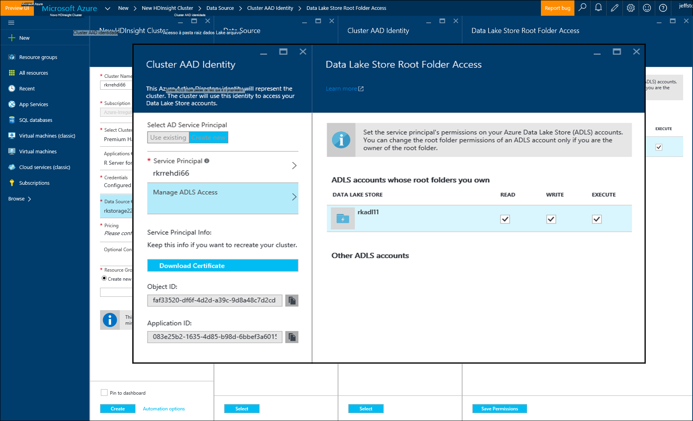

<properties
   pageTitle="Azure opções de armazenamento para o servidor de R em HDInsight (pré-visualização) | Microsoft Azure"
   description="Saiba mais sobre as opções de armazenamento diferentes disponíveis para os utilizadores com R servidor no HDInsight (pré-visualização)"
   services="HDInsight"
   documentationCenter=""
   authors="jeffstokes72"
   manager="jhubbard"
   editor="cgronlun"
/>

<tags
   ms.service="HDInsight"
   ms.devlang="R"
   ms.topic="article"
   ms.tgt_pltfrm="na"
   ms.workload="data-services"
   ms.date="09/01/2016"
   ms.author="jeffstok"
/>

# <a name="azure-storage-options-for-r-server-on-hdinsight-preview"></a>Azure opções de armazenamento para o servidor de R em HDInsight (pré-visualização)

Microsoft R Server no HDInsight (pré-visualização) tem acesso a ambos os BLOBs do Azure e [Armazenamento de Lake de dados do Windows Azure](https://azure.microsoft.com/services/data-lake-store/), como um meio de dados persistentes e código, os objectos da análise de resultado etc.

Quando cria um cluster de Hadoop na HDInsight, especifique uma conta de armazenamento Azure. Um contentor de armazenamento de BLOBs específico a partir dessa conta detém o sistema de ficheiros para o cluster que criar (por exemplo, o sistema de ficheiros distribuído Hadoop). Efeitos de desempenho, HDInsight cluster é criado no Centro de dados do mesmo como a conta de armazenamento principal que especificou. Para mais informações, consulte o artigo de [armazenamento de Blobs do Azure de utilização com HDInsight](hdinsight-hadoop-use-blob-storage.md "armazenamento de Blobs do Azure de utilização com HDInsight").   


## <a name="use-multiple-azure-blob-storage-accounts"></a>Utilizar várias contas de armazenamento de Blobs do Azure

Se for necessário, pode aceder a várias contas do Azure armazenamento ou contentores com o seu cluster HDI. Para fazê-lo, tem de especificar as contas de armazenamento adicional na interface de utilizador quando criar o cluster e, em seguida, siga estes passos para utilizá-los no R.  

1.  Crie um cluster de HDInsight com um nome de conta de armazenamento de **storage1** e um contentor predefinido denominado **container1**.
2. Especifique uma conta de armazenamento adicional denominada **storage2**.  
3. Copie o ficheiro mycsv.csv ao diretório /share e efetuar uma análise no ficheiro.  

    ````
    hadoop fs –mkdir /share
    hadoop fs –copyFromLocal myscsv.scv /share  
    ````

3.  No código R, defina o nó do nome predefinidos **** e defina o seu ficheiro para processar e diretório.  

    ````
    myNameNode <- "default"
    myPort <- 0
    ````

  Localização dos dados:  

    bigDataDirRoot <-"/ partilhar"  

  Defina o contexto de cluster de motores:

    mySparkCluster <-RxSpark(consoleOutput=TRUE)

  Definir o contexto de cluster:

    rxSetComputeContext(mySparkCluster)

  Defina o sistema de ficheiros distribuído ficheiro Hadoop sistema (HDFS):

    hdfsFS <-RxHdfsFileSystem (hostName = myNameNode, porta = myPort)

  Especifique o ficheiro de entrada para analisar no HDFS:

    Ficheirodeentrada <-file.path(bigDataDirRoot,"mycsv.csv")

Todas as referências de directório e ficheiro aponte para a conta de armazenamento wasbs://container1@storage1.blob.core.windows.net. Esta é a **conta de armazenamento predefinida** que está associado ao cluster HDInsight.

Agora, imaginemos que pretende processar num ficheiro denominado mySpecial.csv está localizado o /private directório de **container2** no **storage2**.

No seu código R, aponte a referência de nó nome para a conta de armazenamento **storage2** .

    myNameNode <- "wasbs://container2@storage2.blob.core.windows.net"
    myPort <- 0

  Localização dos dados:

    bigDataDirRoot <- "/private"

  Defina o contexto de cluster de motores:

    mySparkCluster <- RxSpark(consoleOutput=TRUE, nameNode=myNameNode, port=myPort)

  Definir o contexto de cluster:

    rxSetComputeContext(mySparkCluster)

  Defina o sistema de ficheiros HDFS:

    hdfsFS <- RxHdfsFileSystem(hostName=myNameNode, port=myPort)

  Especifique o ficheiro de entrada para analisar no HDFS:

    inputFile <-file.path(bigDataDirRoot,"mySpecial.csv")

Todas as referências de directório e ficheiro agora aponte para a conta de armazenamento wasbs://container2@storage2.blob.core.windows.net. Este é o **Nome nó** especificados.

Nota que tem de configurar /user/RevoShare/<SSH username> directório no **storage2** da seguinte forma:

    hadoop fs -mkdir wasbs://container2@storage2.blob.core.windows.net/user
    hadoop fs -mkdir wasbs://container2@storage2.blob.core.windows.net/user/RevoShare
    hadoop fs -mkdir wasbs://container2@storage2.blob.core.windows.net/user/RevoShare/<RDP username>

## <a name="use-an-azure-data-lake-store"></a>Utilizar um arquivo de Azure dados Lake

Para utilizar dados Lake armazena com a sua conta HDInsight, é necessário conceder acesso ao seu cluster a cada loja Azure Lake de dados que pretende utilizar. Pode utilizar o arquivo no seu script R muito como utilizar uma conta de armazenamento secundário (conforme descrito no procedimento anterior).

## <a name="add-cluster-access-to-your-azure-data-lake-stores"></a>Adicionar o acesso de cluster a sua armazena Azure dados Lake

Aceder a um arquivo de dados Lake utilizando um capital de serviço do Azure Active Directory (Azure AD) que está associado ao seu cluster HDInsight.

### <a name="to-add-a-service-principal"></a>Para adicionar um Principal de serviço
1. Quando criar o seu cluster HDInsight, selecione **Cluster AAD identidade** a partir do separador de **Origem de dados** .
2. Na caixa de diálogo **Cluster AAD identidade** , em **Selecione AD Principal do serviço**, selecione **Criar novo**.

Depois de dê um nome ao capital de serviço e criar uma palavra-passe para a mesma, é aberta num novo separador onde pode associar o capital de serviço a sua armazena dados Lake.

Nota que também pode adicionar acesso a um arquivo de dados Lake mais tarde abrindo o arquivo de dados Lake no portal do Azure e aceder ao **Explorador de dados** > **acesso**.  Segue-se um exemplo de uma caixa de diálogo que mostra como criar um Principal de serviço e associá-la com o arquivo de dados Lake "rkadl11".




## <a name="use-the-data-lake-store-with-r-server"></a>Utilizar o arquivo de dados Lake com o servidor de R
Assim que tiver concedido acesso a um arquivo de dados Lake, pode utilizar o arquivo no R Server no HDInsight a forma como o faria com uma conta de armazenamento Azure secundário. A única diferença é que o prefixo **wasb: / /** muda para **adl: / /** da seguinte forma:

````
# Point to the ADL store (e.g. ADLtest)
myNameNode <- "adl://rkadl1.azuredatalakestore.net"
myPort <- 0

# Location of the data (assumes a /share directory on the ADL account)
bigDataDirRoot <- "/share"  

# Define Spark compute context
mySparkCluster <- RxSpark(consoleOutput=TRUE, nameNode=myNameNode, port=myPort)

# Set compute context
rxSetComputeContext(mySparkCluster)

# Define HDFS file system
hdfsFS <- RxHdfsFileSystem(hostName=myNameNode, port=myPort)

# Specify the input file in HDFS to analyze
inputFile <-file.path(bigDataDirRoot,"AirlineDemoSmall.csv")

# Create factors for days of the week
colInfo <- list(DayOfWeek = list(type = "factor",
               levels = c("Monday", "Tuesday", "Wednesday", "Thursday",
                          "Friday", "Saturday", "Sunday")))

# Define the data source
airDS <- RxTextData(file = inputFile, missingValueString = "M",
                    colInfo  = colInfo, fileSystem = hdfsFS)

# Run a linear regression
model <- rxLinMod(ArrDelay~CRSDepTime+DayOfWeek, data = airDS)
````

Seguem-se os comandos que são utilizados para configurar a conta de armazenamento de dados Lake com o directório RevoShare e adicione o ficheiro. csv de exemplo do exemplo anterior:

````
hadoop fs -mkdir adl://rkadl1.azuredatalakestore.net/user
hadoop fs -mkdir adl://rkadl1.azuredatalakestore.net/user/RevoShare
hadoop fs -mkdir adl://rkadl1.azuredatalakestore.net/user/RevoShare/<user>

hadoop fs -mkdir adl://rkadl1.azuredatalakestore.net/share

hadoop fs -copyFromLocal /usr/lib64/R Server-7.4.1/library/RevoScaleR/SampleData/AirlineDemoSmall.csv adl://rkadl1.azuredatalakestore.net/share

hadoop fs –ls adl://rkadl1.azuredatalakestore.net/share
````

## <a name="use-azure-files-on-the-edge-node"></a>Utilizar ficheiros de Azure no nó do limite

Também existe uma opção de armazenamento de dados conveniente para utilização no nó limite chamado [Azure ficheiros](../storage/storage-how-to-use-files-linux.md "Azure ficheiros"). Permite-lhe montagem uma partilha de ficheiros de armazenamento do Windows Azure ao sistema de ficheiros Linux. Isto pode ser útil para armazenar ficheiros de dados, R scripts e objetos de resultado que podem ser necessárias mais tarde, quando faz sentido para utilizar o sistema de ficheiros nativo o nó do limite em vez de HDFS.

Dos principal benefícios dos ficheiros do Azure é que as partilhas de ficheiros podem ser instaladas e utilizadas por qualquer sistema que tenha um SO suportado, como o Windows ou Linux. Por exemplo, pode ser utilizado por outro cluster de HDInsight que tem o utilizador ou alguém na sua equipa, por uma VM Azure ou até mesmo através de um sistema de no local.


## <a name="next-steps"></a>Próximos passos

Agora que compreender as noções básicas de como utilizar a consola R a partir de uma sessão SSH e como criar um novo cluster de HDInsight, que inclui o R Server, utilize as ligações seguintes para descobrir outras formas de trabalhar com o servidor de R na HDInsight.

- [Descrição geral na barra de R HDInsight](hdinsight-hadoop-r-server-overview.md)
- [Introdução ao servidor R Hadoop](hdinsight-hadoop-r-server-get-started.md)
- [Adicionar o servidor de RStudio HDInsight Premium](hdinsight-hadoop-r-server-install-r-studio.md)
- [Calcular opções de contexto para o servidor de R em HDInsight](hdinsight-hadoop-r-server-compute-contexts.md)
