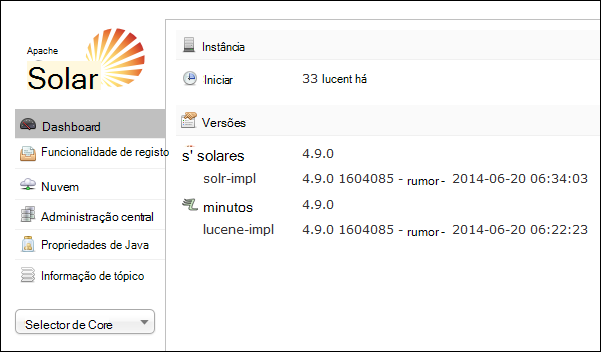
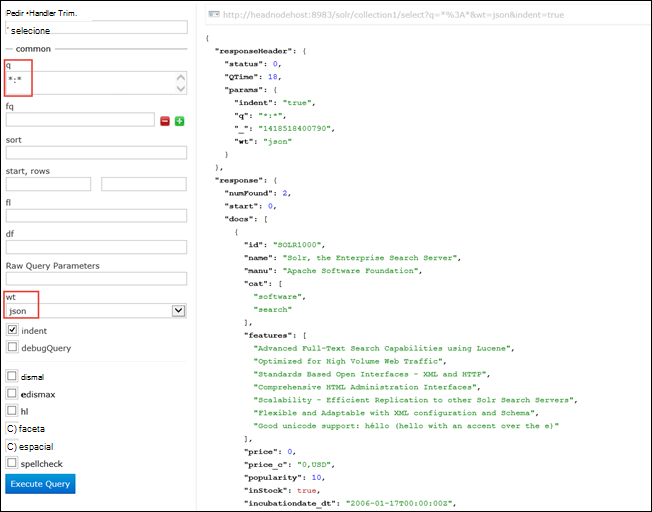

<properties
    pageTitle="Utilizar a ação de Script para instalar Solr baseado em Linux HDInsight | Microsoft Azure"
    description="Saiba como instalar Solr no clusters baseado em Linux HDInsight Hadoop utilizar ações de Script."
    services="hdinsight"
    documentationCenter=""
    authors="Blackmist"
    manager="jhubbard"
    editor="cgronlun"
    tags="azure-portal"/>

<tags
    ms.service="hdinsight"
    ms.workload="big-data"
    ms.tgt_pltfrm="na"
    ms.devlang="na"
    ms.topic="article"
    ms.date="10/03/2016"
    ms.author="larryfr"/>

# Instalar e utilizar Solr no HDInsight Hadoop clusters

Este tópico vai aprender a instalar Solr no Azure HDInsight ao utilizar a ação de Script. Solr é uma plataforma poderosas de procura e fornece capacidades de pesquisa de nível empresarial dados geridas pelo Hadoop. Assim que tiver instalado o Solr num cluster de HDInsight, também irá Saiba como pesquisar dados utilizando Solr.

> [AZURE.NOTE] Os passos neste documento requerem um cluster de baseado em Linux HDInsight. Para obter informações sobre como utilizar Solr com um cluster de baseados no Windows, consulte o artigo [instalar e utilizar Solr em clusters HDinsight Hadoop (Windows)](hdinsight-hadoop-solr-install.md)

O script de exemplo utilizado neste tópico cria um cluster de Solr com uma configuração específica. Se pretender configurar o cluster de Solr com diferentes colecções, shards, esquemas, réplicas, etc., tem de modificar o script e Solr binários em conformidade.

## O que é Solr?

[Apache Solr](http://lucene.apache.org/solr/features.html) é uma plataforma de pesquisa de empresa que permite que os dados de pesquisa com o texto completo eficientes. Enquanto Hadoop permite armazenar e gerir grandes quantidades de dados, Apache Solr fornece as capacidades de pesquisa para obter rapidamente os dados. Este tópico fornece instruções sobre como personalizar um cluster de HDInsight para instalar Solr.

> [AZURE.WARNING] Componentes fornecidos com o cluster HDInsight são totalmente suportadas e o Microsoft Support irá ajudar a identificar e resolver problemas relacionados com a estes componentes.
>
> Componentes personalizados, tal como Solr, recebem faremos suporte para o ajudar a resolver ainda mais o problema. Isto poderá resultar em resolver o problema ou pedir-lhe para participar canais disponíveis para as tecnologias de abrir origem onde se encontram conhecimentos abrangente para essa tecnologia. Por exemplo, existem muitos sites de Comunidade que podem ser utilizados, tal como: [Fórum MSDN para HDInsight](https://social.msdn.microsoft.com/Forums/azure/en-US/home?forum=hdinsight), [http://stackoverflow.com](http://stackoverflow.com). Também projetos Apache tem sites de projeto no [http://apache.org](http://apache.org), por exemplo: [Hadoop](http://hadoop.apache.org/).

## O que faz o script

Este script faz as seguintes alterações ao HDInsight cluster:

* Instalações Solr para`/usr/hdp/current/solr`
* Cria um novo utilizador, __solrusr__, que é utilizado para executar o serviço de Solr
* Define __solruser__ como o proprietário do`/usr/hdp/current/solr`
* Adiciona uma configuração de [Upstart](http://upstart.ubuntu.com/) que será iniciado Solr se um nó de cluster for reiniciado. Solr é iniciado automaticamente também em nós de cluster após a instalação

## Instalar Solr utilizar ações de Script

Um exemplo de script para instalar Solr num HDInsight cluster está disponível na seguinte localização.

    https://hdiconfigactions.blob.core.windows.net/linuxsolrconfigactionv01/solr-installer-v01.sh

Esta secção fornece instruções sobre como utilizar o script de exemplo para criar um novo cluster utilizando o portal do Azure. 

> [AZURE.NOTE] Azure PowerShell, o clip do Azure, o HDInsight .NET SDK ou Gestor de recursos do Azure modelos podem também ser utilizados para aplicar acções de script. Também pode aplicar acções de script para já executado clusters. Para mais informações, consulte o artigo [Personalizar HDInsight clusters com ações de Script](hdinsight-hadoop-customize-cluster-linux.md).

1. Iniciar um cluster de aprovisionamento, utilizando os passos em [clusters baseado em aprovisionar Linux HDInsight](hdinsight-hadoop-create-linux-clusters-portal.md), mas não concluída de aprovisionamento.

2. No pá **Configuração opcional** , selecione **Ações de Script**e forneça as informações abaixo:

    * __Nome__: introduza um nome amigável para a ação de script.
    * __URI de SCRIPT__: https://hdiconfigactions.blob.core.windows.net/linuxsolrconfigactionv01/solr-installer-v01.sh
    * __HEAD__: selecione esta opção
    * __TRABALHADOR__: selecione esta opção
    * __ZOOKEEPER__: selecione esta opção para instalar no nó Zookeeper
    * __Parâmetros__: deixe este campo em branco

3. Na parte inferior das **Ações de Script**, utilize o botão **Selecionar** para guardar a configuração. Por fim, utilize o botão **Selecione** na parte inferior da pá a **Configuração opcional** para guardar as informações de configuração opcional.

4. Continue a cluster de aprovisionamento, tal como descrito em [clusters baseado em aprovisionar Linux HDInsight](hdinsight-hadoop-create-linux-clusters-portal.md).

## Como posso utilizar Solr no HDInsight?

### Dados de indexação

Tem de iniciar com a indexação Solr com alguns ficheiros de dados. Em seguida, pode utilizar Solr para executar consultas de pesquisa nos dados indexados. Utilize os seguintes passos para adicionar alguns dados de exemplo para Solr e, em seguida, consultá-lo:

1. Ligar ao cluster HDInsight utilizando SSH:

        ssh USERNAME@CLUSTERNAME-ssh.azurehdinsight.net

    Para obter mais informações sobre como utilizar SSH com HDInsight, consulte o seguinte:

    * [Utilizar SSH com baseado em Linux Hadoop no HDInsight Linux, Unix ou OS X](hdinsight-hadoop-linux-use-ssh-unix.md)

    * [Utilizar SSH com baseado em Linux Hadoop no HDInsight a partir do Windows](hdinsight-hadoop-linux-use-ssh-windows.md)

    > [AZURE.IMPORTANT] Passos mais tarde em colocar neste documento utilizam de um túnel SSL para ligar para a web Solr IU. Para que possa utilizar estes passos, tem de estabelecer um túnel SSL e, em seguida, configurar o seu browser para utilizá-la.
    >
    > Para obter mais informações, consulte o artigo [Utilizar SSH túnel para aceder ao web Ambari IU, ResourceManager, JobHistory, NameNode, Oozie e outros web da IU](hdinsight-linux-ambari-ssh-tunnel.md)

2. Utilize os comandos seguintes ter dados de exemplo de índice remissivo Solr:

        cd /usr/hdp/current/solr/example/exampledocs
        java -jar post.jar solr.xml monitor.xml

    Verá o seguinte resultado na consola:

        POSTing file solr.xml
        POSTing file monitor.xml
        2 files indexed.
        COMMITting Solr index changes to http://localhost:8983/solr/update..
        Time spent: 0:00:01.624

    O utilitário post.jar índices Solr com documentos de duas amostras, **solr.xml** e **monitor.xml**. Estes serão armazenados nas __collection1__ dentro Solr.

3. Utilize o seguinte para consultar a API REST exposto pela Solr:

        curl "http://localhost:8983/solr/collection1/select?q=*%3A*&wt=json&indent=true"

    Problemas de uma consulta contra __collection1__ para quaisquer documentos correspondência __ \*:\* __ (codificado como \*% 3A\* na cadeia de consulta,) e que a resposta deve ser devolvida como JSON. A resposta deverá ser semelhante ao seguinte:

            "response": {
                "numFound": 2,
                "start": 0,
                "maxScore": 1,
                "docs": [
                  {
                    "id": "SOLR1000",
                    "name": "Solr, the Enterprise Search Server",
                    "manu": "Apache Software Foundation",
                    "cat": [
                      "software",
                      "search"
                    ],
                    "features": [
                      "Advanced Full-Text Search Capabilities using Lucene",
                      "Optimized for High Volume Web Traffic",
                      "Standards Based Open Interfaces - XML and HTTP",
                      "Comprehensive HTML Administration Interfaces",
                      "Scalability - Efficient Replication to other Solr Search Servers",
                      "Flexible and Adaptable with XML configuration and Schema",
                      "Good unicode support: héllo (hello with an accent over the e)"
                    ],
                    "price": 0,
                    "price_c": "0,USD",
                    "popularity": 10,
                    "inStock": true,
                    "incubationdate_dt": "2006-01-17T00:00:00Z",
                    "_version_": 1486960636996878300
                  },
                  {
                    "id": "3007WFP",
                    "name": "Dell Widescreen UltraSharp 3007WFP",
                    "manu": "Dell, Inc.",
                    "manu_id_s": "dell",
                    "cat": [
                      "electronics and computer1"
                    ],
                    "features": [
                      "30\" TFT active matrix LCD, 2560 x 1600, .25mm dot pitch, 700:1 contrast"
                    ],
                    "includes": "USB cable",
                    "weight": 401.6,
                    "price": 2199,
                    "price_c": "2199,USD",
                    "popularity": 6,
                    "inStock": true,
                    "store": "43.17614,-90.57341",
                    "_version_": 1486960637584081000
                  }
                ]
              }

### Com o dashboard Solr

O dashboard Solr é uma web IU que lhe permite trabalhar com Solr através do browser. O dashboard Solr não está exposto diretamente na Internet a partir do seu cluster HDInsight, mas tem de ser acedido utilizando um túnel SSH. Para obter mais informações sobre como utilizar um túnel SSH, consulte o artigo [Utilizar SSH túnel para aceder ao web Ambari IU, ResourceManager, JobHistory, NameNode, Oozie e outros web da IU](hdinsight-linux-ambari-ssh-tunnel.md)

Assim que tiver estabelecido um túnel SSH, utilize os seguintes passos para utilizar o dashboard Solr:

1. Determine o nome do anfitrião para o headnode principal:

    1. Utilize SSH para ligar ao cluster no Porta 22. Por exemplo, `ssh USERNAME@CLUSTERNAME-ssh.azurehdinsight.net` onde __NOMEDOUTILIZADOR__ é o seu nome de utilizador SSH e __nome de cluster__ é o nome do seu cluster.

        Para obter mais informações sobre como utilizar SSH, consulte os seguintes documentos:

        * [Utilizar SSH com baseado em Linux HDInsight a partir de um cliente Linux, Unix ou Mac OS X](hdinsight-hadoop-linux-use-ssh-unix.md)

        * [Utilizar SSH com baseado em Linux HDInsight a partir de um cliente do Windows](hdinsight-hadoop-linux-use-ssh-windows.md)
    
    3. Utilize o seguinte comando para obter o nome do anfitrião completamente qualificado:

            hostname -f

        Isto irá devolver um nome semelhante ao seguinte:

            hn0-myhdi-nfebtpfdv1nubcidphpap2eq2b.ex.internal.cloudapp.net
    
        Este é o nome do anfitrião que deve ser utilizado nos passos seguintes.
    
1. No seu browser, aceda a __solr/http://HOSTNAME:8983 / #/__, onde o __nome do anfitrião__ é o nome determinado nos passos anteriores. 

    O pedido deve ser encaminhado através do túnel SSH para o nó de cabeça para o seu cluster HDInsight. Deverá visualizar uma página semelhante ao seguinte:

    

2. A partir do painel da esquerda, utilize o **Seletor de Core** pendente para selecionar **collection1**. Várias entradas-los aparecem abaixo de __collection1__.

3. As entradas abaixo __collection1__, selecione __consulta__. Utilize os seguintes valores para preencher a página de pesquisa:

    * Na caixa de texto **perguntas** , introduza ** \*:**\*. Isto irá devolver todos os documentos que estão indexados no Solr. Se pretender procurar uma cadeia dentro de documentos específica, pode introduzir essa cadeia aqui.

    * Na caixa de texto **wt** , selecione o formato de saída. A predefinição é **json**.

    Por fim, selecione o botão de **Executar a consulta** na parte inferior da pate a pesquisa.

    

    O resultado devolve a duas de documentos que é utilizada para a indexação Solr. O resultado é semelhante ao seguinte:

            "response": {
                "numFound": 2,
                "start": 0,
                "maxScore": 1,
                "docs": [
                  {
                    "id": "SOLR1000",
                    "name": "Solr, the Enterprise Search Server",
                    "manu": "Apache Software Foundation",
                    "cat": [
                      "software",
                      "search"
                    ],
                    "features": [
                      "Advanced Full-Text Search Capabilities using Lucene",
                      "Optimized for High Volume Web Traffic",
                      "Standards Based Open Interfaces - XML and HTTP",
                      "Comprehensive HTML Administration Interfaces",
                      "Scalability - Efficient Replication to other Solr Search Servers",
                      "Flexible and Adaptable with XML configuration and Schema",
                      "Good unicode support: héllo (hello with an accent over the e)"
                    ],
                    "price": 0,
                    "price_c": "0,USD",
                    "popularity": 10,
                    "inStock": true,
                    "incubationdate_dt": "2006-01-17T00:00:00Z",
                    "_version_": 1486960636996878300
                  },
                  {
                    "id": "3007WFP",
                    "name": "Dell Widescreen UltraSharp 3007WFP",
                    "manu": "Dell, Inc.",
                    "manu_id_s": "dell",
                    "cat": [
                      "electronics and computer1"
                    ],
                    "features": [
                      "30\" TFT active matrix LCD, 2560 x 1600, .25mm dot pitch, 700:1 contrast"
                    ],
                    "includes": "USB cable",
                    "weight": 401.6,
                    "price": 2199,
                    "price_c": "2199,USD",
                    "popularity": 6,
                    "inStock": true,
                    "store": "43.17614,-90.57341",
                    "_version_": 1486960637584081000
                  }
                ]
              }

### Iniciar e parar Solr

Se precisar de manualmente parar ou iniciar Solar, utilize os comandos seguintes:

    sudo stop solr

    sudo start solr

## Cópia de segurança de dados indexados

Como aconselhável, deverá criar uma cópia de segurança dos dados indexados partir de nós de cluster Solr para armazenamento de Blobs do Azure. Execute os seguintes passos para fazê-lo:

1. Ligar ao cluster utilizando SSH, em seguida, utilize o seguinte comando para obter o nome do anfitrião para o nó cabeça:

        hostname -f
        
2. Utilize o seguinte para criar um instantâneo dos dados indexados. Substitua o __nome do anfitrião__ com o nome devolvido a partir do comando anterior:

        curl http://HOSTNAME:8983/solr/replication?command=backup

    Deverá visualizar uma resposta da seguinte forma:

        <?xml version="1.0" encoding="UTF-8"?>
        <response>
          <lst name="responseHeader">
            <int name="status">0</int>
            <int name="QTime">9</int>
          </lst>
          <str name="status">OK</str>
        </response>

2. Em seguida, altere directórios para __/usr/hdp/current/solr/example/solr__. Haverá um subdirectório para cada coleção. Cada directório de coleções de sites contém um diretório de __dados__ , que é onde o instantâneo para essa coleção está localizada.

    Por exemplo, se utilizou os passos anteriores para indexar os documentos de exemplo, o diretório __/usr/hdp/current/solr/example/solr/collection1/data__ deve agora conter num diretório chamado __instantâneo. # # #__ onde o # s estão a data e hora do limite da.

3. Crie um arquivo de comprimida da pasta instantâneo utilizando um comando semelhante ao seguinte:

        tar -zcf snapshot.20150806185338855.tgz snapshot.20150806185338855

    Isto irá criar um novo arquivo denominado __snapshot.20150806185338855.tgz__, que contém os conteúdos de diretório __snapshot.20150806185338855__ .

3. Em seguida, pode armazenar o arquivo ao armazenamento principal do cluster utilizando o seguinte comando:

    snapshot.20150806185338855.tgz/exemplo/dados de hadoop fs - copyFromLocal

    > [AZURE.NOTE] Pretende criar um diretório dedicado para armazenar Solr instantâneos. Por exemplo, `hadoop fs -mkdir /solrbackup`.

Para mais informações sobre como trabalhar com Solr cópia de segurança e restaura, consulte o artigo [efetuar e restaurar cópias de segurança das SolrCores](https://cwiki.apache.org/confluence/display/solr/Making+and+Restoring+Backups+of+SolrCores).

## Consulte também

- [Instalar e utilizar clusters de matiz no HDInsight](hdinsight-hadoop-hue-linux.md). Matiz é uma web IU torna mais fácil criar, executar e guardar porco e ramo de tarefas, bem como o armazenamento de predefinido utilizado para procurar o HDInsight cluster.

- [Instalar o R HDInsight clusters][hdinsight-install-r]. Utilize a personalização de cluster para instalar R clusters HDInsight Hadoop. R é um idioma abrir origem e um ambiente para computação de estatística. Fornece centenas de funções de estatística incorporadas e as suas próprias linguagem de programação que combina aspetos de programação funcional e orientada para objectos. Fornece também capacidades gráficas extensas.

- [Instalar Giraph sobre clusters de HDInsight](hdinsight-hadoop-giraph-install-linux.md). Utilize a personalização de cluster para instalar Giraph HDInsight Hadoop clusters. Giraph permite-lhe executar graph processamento utilizando Hadoop e pode ser utilizado com Azure HDInsight.

- [Instalar matiz sobre clusters de HDInsight](hdinsight-hadoop-hue-linux.md). Utilize a personalização de cluster para instalar matiz clusters HDInsight Hadoop. Matiz é um conjunto de aplicações Web utilizada para interagir com um cluster de Hadoop.

[hdinsight-install-r]: hdinsight-hadoop-r-scripts-linux.md
[hdinsight-cluster-customize]: hdinsight-hadoop-customize-cluster-linux.md
