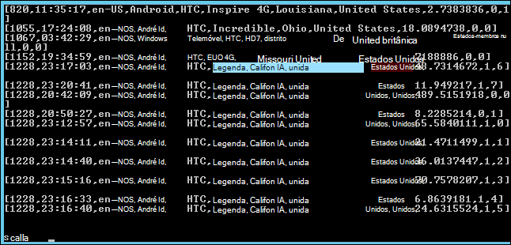

<properties
    pageTitle="Utilizar a ação de Script para instalar motores num cluster de Hadoop | Microsoft Azure"
    description="Saiba como personalizar um cluster de HDInsight com motores utilizando Script ação."
    services="hdinsight"
    documentationCenter=""
    authors="nitinme"
    manager="jhubbard"
    editor="cgronlun"/>

<tags
    ms.service="hdinsight"
    ms.workload="big-data"
    ms.tgt_pltfrm="na"
    ms.devlang="na"
    ms.topic="article"
    ms.date="02/05/2016"
    ms.author="nitinme"/>

# Instalar e utilizar motores no clusters HDInsight Hadoop utilizando a ação de Script

> [AZURE.IMPORTANT] Este artigo é preterido agora. HDInsight fornece agora motores como um tipo de cluster primeira classe para clusters baseados no Windows, que significa que pode agora diretamente criar um cluster de motores sem modificar um cluster de Hadoop utilizando a ação de Script. Utilizar o tipo de cluster motores, receberá um cluster de versão 3,2 HDInsight com motores versão 1.3.1.  Instalar versões diferentes do motores, pode utilizar a ação de Script. HDInsight fornece um script de acção de Script de exemplo.

Saiba como instalar motores no Windows com base HDInsight utilizando Script ação e clusters de como executar consultas de motores no HDInsight.

**Artigos relacionados**

- [Criar Hadoop clusters no HDInsight](hdinsight-provision-clusters.md): informações gerais sobre a criação de HDInsight clusters.

- [Introdução ao Apache motores no HDInsight](hdinsight-apache-spark-jupyter-spark-sql.md): criar um cluster de motores de HDInsight.

- [Personalizar cluster de HDInsight utilizando a ação de Script][hdinsight-cluster-customize]: informações gerais sobre a personalização de clusters HDInsight utilizando a ação de Script.

- [Acção de Script desenvolver scripts para HDInsight](hdinsight-hadoop-script-actions.md).

## O que é motores?

<a href="http://spark.apache.org/docs/latest/index.html" target="_blank">Motores de Apache</a> é uma paralelamente abrir origem processamento framework que suporta o processamento de na memória para aumentar o desempenho das aplicações analíticos grande dados. Capacidades de cálculo na memória do motores tornam uma boa escolha para algoritmos iterativos nos cálculos máquina de aprendizagem e o gráfico.

Motores podem também ser utilizados para executar o processamento de dados baseadas no disco convencional. Motores melhora a arquitetura MapReduce tradicional, evitando escritas no disco nas fases intermédias. Além disso, motores são compatível com o armazenamento distribuído ficheiro Hadoop sistema (HDFS) e BLOBs do Azure para que os dados existentes facilmente podem ser processados através de motores.

Este tópico fornece instruções sobre como personalizar um cluster de HDInsight para instalar motores.

## Instalar motores utilizando o Portal do Azure

Um exemplo de script para instalar motores num HDInsight cluster está disponível a partir de um blob armazenamento Azure só de leitura na [https://hdiconfigactions.blob.core.windows.net/sparkconfigactionv03/spark-installer-v03.ps1](https://hdiconfigactions.blob.core.windows.net/sparkconfigactionv03/spark-installer-v03.ps1). Este script pode instalar motores 1.2.0 ou motores 1.0.2 dependendo da versão do cluster HDInsight que cria.

- Se utilizar o script ao criar um cluster de **3,2 HDInsight** ,-instala **motores 1.2.0**.
- Se utilizar o script ao criar um cluster de **HDInsight 3.1** ,-instala **motores 1.0.2**.

Pode modificar este script ou criar o seu próprio script para instalar outras versões do motores.

> [AZURE.NOTE] Exemplo de script só funciona com HDInsight 3.1 e 3.2 clusters. Para mais informações sobre as versões de cluster HDInsight, consulte o artigo [versões de cluster HDInsight](hdinsight-component-versioning.md).

1. Começar a criar um cluster utilizando a opção **Criar PERSONALIZADO** , tal como descrito em [clusters de criar Hadoop HDInsight](hdinsight-provision-clusters.md#portal). Selecione a versão de cluster consoante o seguinte procedimento:

    - Se pretender instalar **motores 1.2.0**, crie um cluster de 3,2 HDInsight.
    - Se pretender instalar **motores 1.0.2**, crie um cluster de HDInsight 3.1.

2. Na página **Acções de Script** do assistente, clique em **Adicionar ação de script** para fornecer detalhes sobre a ação de script, conforme apresentado abaixo:

    ![Acção de Script de utilização para personalizar um cluster de] (./media/hdinsight-hadoop-spark-install/HDI.CustomProvision.Page6.png "Acção de Script de utilização para personalizar um cluster de")

    <table border='1'>
        <tr><th>Propriedade</th><th>Valor</th></tr>
        <tr><td>Nome</td>
            <td>Especifique um nome para a ação de script. Por exemplo, <b>Instalar motores</b>.</td></tr>
        <tr><td>Script URI</td>
            <td>Especifique o URI Uniform Resource Identifier () para o script que é chamado para personalizar o cluster. Por exemplo, <i>https://hdiconfigactions.blob.core.windows.net/sparkconfigactionv03/spark-installer-v03.ps1</i></td></tr>
        <tr><td>Tipo de nó</td>
            <td>Especifique os nós onde for executado o script de personalização. Pode escolher <b>todos os nós</b>, <b>apenas nós de cabeça</b>ou <b>apenas nós de trabalho</b>.
        <tr><td>Parâmetros</td>
            <td>Especifique os parâmetros, se necessário pelo script. O script para instalar motores não requer quaisquer parâmetros, pelo que pode deixar esta em branco.</td></tr>
    </table>

    Pode adicionar mais do que uma ação de script para instalar vários componentes no cluster. Depois de ter adicionado os scripts, clique em marca de verificação para começar a criar o cluster.

Também pode utilizar o script instalar motores em HDInsight utilizando o Azure PowerShell ou o .NET SDK HDInsight. Instruções para estes procedimentos são fornecidas mais adiante.

## Utilizar motores no HDInsight
Motores fornece APIs no Scala, Python e Java. Também pode utilizar a shell de motores interactiva para executar motores consultas. Esta secção fornece instruções sobre como utilizar as abordagens diferentes para trabalhar com motores:

- [Utilizar a shell de motores para executar consultas de interativas](#sparkshell)
- [Utilizar a shell de motores para executar consultas de SQL motores](#sparksql)
- [Utilizar um programa de Scala autónomo](#standalone)

###Utilizar a shell de motores para executar consultas de interativas
Execute os passos seguintes para executar consultas de motores a partir de uma shell motores interativa. Nesta secção, vamos executar uma consulta de motores de um ficheiro de dados de exemplo (/ example/data/gutenberg/davinci.txt) que está disponível no HDInsight clusters por predefinição.

1. A partir do portal do Azure, ativar o ambiente de trabalho remoto para cluster que criou com instalado o nível de interesse e, em seguida, remote para cluster. Para obter instruções, consulte o artigo [ligar a clusters HDInsight utilizando o RDP](hdinsight-administer-use-management-portal.md#rdp).

2. Na sessão de protocolo de ambiente de trabalho remoto (RDP), a partir do ambiente de trabalho, abra a linha de comandos Hadoop (a partir de um atalho de ambiente de trabalho) e navegue para a localização onde está instalado o nível de interesse; Por exemplo, **C:\apps\dist\spark-1.2.0**.

3. Execute o seguinte comando para iniciar a shell de motores:

         .\bin\spark-shell --master yarn

    Depois do comando estiver concluída, deve obter um Scala linha de comandos:

         scala>

5. Na linha de comandos Scala, introduza a consulta de motores apresentada abaixo. Esta consulta conta a ocorrência de cada palavra no ficheiro davinci.txt que está disponível na/exemplo/dados/gutenberg/localização de armazenamento de Blobs do Azure associado ao cluster.

        val file = sc.textFile("/example/data/gutenberg/davinci.txt")
        val counts = file.flatMap(line => line.split(" ")).map(word => (word, 1)).reduceByKey(_ + _)
        counts.toArray().foreach(println)

6. O resultado deve ser semelhante ao seguinte:

    

7. Introduza: perguntas para sair da linha de comandos do Scala.

        :q

###Utilizar a shell de motores para executar consultas de SQL motores

Motores SQL permite-lhe utilizar motores para executar consultas relacionais expressas em linguagem SQL (Structured Query), HiveQL ou Scala. Nesta secção, podemos observe utilizar motores para executar uma consulta de ramo numa tabela Hive de exemplo. A tabela Hive utilizada nesta secção (denominados **hivesampletable**) por predefinição está disponível quando cria um cluster.

>[AZURE.NOTE] O exemplo abaixo foi criado contra **gerar 1.2.0**, que é instalado se executar a ação de script ao criar cluster de 3,2 HDInsight.

1. A partir do portal do Azure, ativar o ambiente de trabalho remoto para cluster que criou com instalado o nível de interesse e, em seguida, remote para cluster. Para obter instruções, consulte o artigo [ligar a clusters HDInsight utilizando o RDP](hdinsight-administer-use-management-portal.md#rdp).

2. Na sessão RDP, a partir do ambiente de trabalho, abra a linha de comandos Hadoop (a partir de um atalho de ambiente de trabalho) e navegue para a localização onde está instalado o nível de interesse; Por exemplo, **C:\apps\dist\spark-1.2.0**.

3. Execute o seguinte comando para iniciar a shell de motores:

         .\bin\spark-shell --master yarn

    Depois do comando estiver concluída, deve obter um Scala linha de comandos:

         scala>

4. No pedido Scala, defina o contexto ramo. Isto é necessário para trabalhar com consultas ramo utilizando motores.

        val hiveContext = new org.apache.spark.sql.hive.HiveContext(sc)

    Tenha em atenção que **sc** é contexto de motores de predefinido que é definido quando iniciar a shell de motores.

5. Executar uma consulta de ramo utilizando o contexto ramo e imprimir os resultados da consola. A consulta obtém dados em dispositivos de uma marca específica e o número de registos obtidos a 20 de limites.

        hiveContext.sql("""SELECT * FROM hivesampletable WHERE devicemake LIKE "HTC%" LIMIT 20""").collect().foreach(println)

6. Deverá visualizar um resultado semelhante ao seguinte:

    

7. Introduza: perguntas para sair da linha de comandos do Scala.

        :q

### Utilizar um programa de Scala autónomo

Nesta secção, vamos escrever uma aplicação de Scala que conta o número de linhas que contêm as letras '' a e b num ficheiro de dados de exemplo (/ example/data/gutenberg/davinci.txt) que está disponível no HDInsight clusters por predefinição. Para escrever e utilizar o programa autónomo Scala com um cluster de personalizado com a instalação de motores, deve efetuar os seguintes passos:

- Escrever um programa de Scala
- Criar o programa Scala para obter o ficheiro .jar
- Executar a tarefa de cluster

#### Escrever um programa de Scala
Nesta secção, escrever um programa de Scala que conta o número de linhas que contêm '' a e b no ficheiro de dados de exemplo.

1. Abra um editor de texto e cole o seguinte código:

        /* SimpleApp.scala */
        import org.apache.spark.SparkContext
        import org.apache.spark.SparkContext._
        import org.apache.spark.SparkConf

        object SimpleApp {
          def main(args: Array[String]) {
            val logFile = "/example/data/gutenberg/davinci.txt"         //Location of the sample data file on Azure Blob storage
            val conf = new SparkConf().setAppName("SimpleApplication")
            val sc = new SparkContext(conf)
            val logData = sc.textFile(logFile, 2).cache()
            val numAs = logData.filter(line => line.contains("a")).count()
            val numBs = logData.filter(line => line.contains("b")).count()
            println("Lines with a: %s, Lines with b: %s".format(numAs, numBs))
          }
        }

2. Guarde o ficheiro com o nome **SimpleApp.scala**.

#### Criar o programa Scala
Nesta secção, utilize a <a href="http://www.scala-sbt.org/0.13/docs/index.html" target="_blank">Ferramenta de criação simples</a> (ou sbt) para criar o programa Scala. SBT requer Java 1.6 ou posterior, por isso, certifique-se de que possui a versão à direita do Java instalado antes de prosseguir com nesta secção.

1. Instale sbt a partir de http://www.scala-sbt.org/0.13/tutorial/Installing-sbt-on-Windows.html.
2. Criar uma pasta denominada **SimpleScalaApp**e nesta pasta criar um ficheiro denominado **simple.sbt**. Este é um ficheiro de configuração que contenha informações sobre a versão de Scala, dependências de biblioteca, etc. Cole o seguinte procedimento no ficheiro simple.sbt e guardá-lo:

        name := "SimpleApp"

        version := "1.0"

        scalaVersion := "2.10.4"

        libraryDependencies += "org.apache.spark" %% "spark-core" % "1.2.0"

    >[AZURE.NOTE] Certifique-se de que manter as linhas vazias no ficheiro.

3. Na pasta **SimpleScalaApp** , criar uma estrutura de diretório **\src\main\scala** e cole o programa de Scala (**SimpleApp.scala**) que criou anteriormente na pasta \src\main\scala.
4. Abra uma linha de comandos, navegue para o directório SimpleScalaApp e introduza o seguinte comando:

        sbt package

    Assim que a aplicação é compilada, irá ver um ficheiro de **simpleapp_2.10 1.0.jar** criado sob o directório **\target\scala-2.10** dentro da pasta de SimpleScalaApp de raiz.

#### Executar a tarefa de cluster
Nesta secção, remoto para cluster que tenha motores instalou e, em seguida, copie a pasta de destino do projeto SimpleScalaApp. Em seguida, utilize o comando **Submeter motores** para submeter a tarefa no cluster.

1. Remote para cluster que tenha instalado o nível de interesse. A partir do computador onde escreveu e compilado o programa SimpleApp.scala, copie a pasta **SimpleScalaApp\target** e colá-la para uma localização no cluster.
2. Na sessão RDP, a partir do ambiente de trabalho, abra a linha de comandos Hadoop e navegue para a localização onde que colou a pasta de **destino** .
3. Introduza o seguinte comando para executar o programa SimpleApp.scala:

        C:\apps\dist\spark-1.2.0\bin\spark-submit --class "SimpleApp" --master local target/scala-2.10/simpleapp_2.10-1.0.jar

4. Quando o programa estiver concluída, o resultado é apresentado na consola.

        Lines with a: 21374, Lines with b: 11430

## Instalar motores através do PowerShell do Azure

Nesta secção, utilizamos o cmdlet **<a href = "http://msdn.microsoft.com/library/dn858088.aspx" target="_blank">Adicionar AzureHDInsightScriptAction</a>** para invocar scripts ao utilizar a ação de Script para personalizar um cluster de. Antes de continuar, certifique-se de ter instalado e configurado o Azure PowerShell. Para obter informações sobre como configurar uma estação de trabalho para executar os cmdlets do Azure PowerShell para HDInsight, consulte o artigo [instalar e configurar o Azure PowerShell](../powershell-install-configure.md).

Execute os seguintes passos:

1. Abra uma janela do PowerShell do Azure e declarar variáveis que se seguem:

        # Provide values for these variables
        $subscriptionName = "<SubscriptionName>"        # Name of the Azure subscription
        $clusterName = "<HDInsightClusterName>"         # HDInsight cluster name
        $storageAccountName = "<StorageAccountName>"    # Azure Storage account that hosts the default container
        $storageAccountKey = "<StorageAccountKey>"      # Key for the Storage account
        $containerName = $clusterName
        $location = "<MicrosoftDataCenter>"             # Location of the HDInsight cluster. It must be in the same data center as the Storage account.
        $clusterNodes = <ClusterSizeInNumbers>          # Number of nodes in the HDInsight cluster
        $version = "<HDInsightClusterVersion>"          # For example, "3.2"

2. Especifique os valores de configuração como nós no cluster e o armazenamento de predefinido para ser utilizado.

        # Specify the configuration options
        Select-AzureSubscription $subscriptionName
        $config = New-AzureHDInsightClusterConfig -ClusterSizeInNodes $clusterNodes
        $config.DefaultStorageAccount.StorageAccountName="$storageAccountName.blob.core.windows.net"
        $config.DefaultStorageAccount.StorageAccountKey=$storageAccountKey
        $config.DefaultStorageAccount.StorageContainerName=$containerName

3. Utilize o cmdlet **AzureHDInsightScriptAction adicionar** para adicionar uma ação de script a configuração do cluster. Mais tarde, quando o cluster está a ser criado, a ação de script é executada.

        # Add a script action to the cluster configuration
        $config = Add-AzureHDInsightScriptAction -Config $config -Name "Install Spark" -ClusterRoleCollection HeadNode -Uri https://hdiconfigactions.blob.core.windows.net/sparkconfigactionv03/spark-installer-v03.ps1

    **Adicionar AzureHDInsightScriptAction** cmdlet utiliza os seguintes parâmetros:

    <table style="border-color: #c6c6c6; border-width: 2px; border-style: solid; border-collapse: collapse;">
    <tr>
    <th style="border-color: #c6c6c6; border-width: 2px; border-style: solid; border-collapse: collapse; width:90px; padding-left:5px; padding-right:5px;">Parâmetro</th>
    <th style="border-color: #c6c6c6; border-width: 2px; border-style: solid; border-collapse: collapse; width:550px; padding-left:5px; padding-right:5px;">Definição</th></tr>
    <tr>
    <td style="border-color: #c6c6c6; border-width: 2px; border-style: solid; border-collapse: collapse; padding-left:5px;">Configuração</td>
    <td style="border-color: #c6c6c6; border-width: 2px; border-style: solid; border-collapse: collapse; padding-left:5px; padding-right:5px;">O objeto de configuração para que script são adicionadas informações de ação.</td></tr>
    <tr>
    <td style="border-color: #c6c6c6; border-width: 2px; border-style: solid; border-collapse: collapse; padding-left:5px;">Nome</td>
    <td style="border-color: #c6c6c6; border-width: 2px; border-style: solid; border-collapse: collapse; padding-left:5px;">Nome da ação script.</td></tr>
    <tr>
    <td style="border-color: #c6c6c6; border-width: 2px; border-style: solid; border-collapse: collapse; padding-left:5px;">ClusterRoleCollection</td>
    <td style="border-color: #c6c6c6; border-width: 2px; border-style: solid; border-collapse: collapse; padding-left:5px;">Especifica os nós onde for executado o script de personalização. Os valores válidos são HeadNode (para instalar o nó cabeça) ou DataNode (para instalar em todos os nós de dados). Pode utilizar um ou ambos os valores.</td></tr>
    <tr>
    <td style="border-color: #c6c6c6; border-width: 2px; border-style: solid; border-collapse: collapse; padding-left:5px;">URI</td>
    <td style="border-color: #c6c6c6; border-width: 2px; border-style: solid; border-collapse: collapse; padding-left:5px;">Especifica o URI para o script que é executado.</td></tr>
    <tr>
    <td style="border-color: #c6c6c6; border-width: 2px; border-style: solid; border-collapse: collapse; padding-left:5px;">Parâmetros</td>
    <td style="border-color: #c6c6c6; border-width: 2px; border-style: solid; border-collapse: collapse; padding-left:5px;">Parâmetros de uma ferramenta necessária ao script. O script de exemplo utilizado neste tópico não requer quaisquer parâmetros e, consequentemente, não vir este parâmetro no fragmento de acima.
    </td></tr>
    </table>

4. Por fim, começar a criar um cluster personalizado com instalado o nível de interesse.  

        # Start creating a cluster with Spark installed
        New-AzureHDInsightCluster -Config $config -Name $clusterName -Location $location -Version $version

Quando lhe for pedido, introduza as credenciais para o cluster. Pode demorar alguns minutos antes do cluster é criado.

## Instalar motores através do PowerShell

Consulte o artigo [Personalizar HDInsight clusters utilizando Script ação](hdinsight-hadoop-customize-cluster.md#call_scripts_using_powershell).

## Instalar motores utilizando .NET SDK

Consulte o artigo [Personalizar HDInsight clusters utilizando Script ação](hdinsight-hadoop-customize-cluster.md#call_scripts_using_azure_powershell).

## Consulte também

- [Criar Hadoop clusters no HDInsight](hdinsight-provision-clusters.md): criar HDInsight clusters.
- [Introdução ao Apache motores no HDInsight](hdinsight-apache-spark-jupyter-spark-sql.md): introdução ao motores no HDInsight.
- [Personalizar cluster de HDInsight utilizando a ação de Script][hdinsight-cluster-customize]: Personalizar clusters HDInsight utilizando a ação de Script.
- [Acção de Script desenvolver scripts para HDInsight](hdinsight-hadoop-script-actions.md): desenvolver scripts de acção de Script.
- [Instalar o R HDInsight clusters] [ hdinsight-install-r] fornece instruções sobre como utilizar a personalização de cluster para instalar e utilizar R no clusters HDInsight Hadoop. R é um idioma abrir origem e um ambiente para computação de estatística. Fornece centenas de funções de estatística incorporadas e as suas próprias linguagem de programação que combina aspetos de programação funcional e orientada para objectos. Fornece também capacidades gráficas extensas.
- [Instalar Giraph sobre clusters de HDInsight](hdinsight-hadoop-giraph-install.md). Utilize a personalização de cluster para instalar Giraph HDInsight Hadoop clusters. Giraph permite-lhe executar graph processamento utilizando Hadoop e pode ser utilizado com Azure HDInsight.
- [Instalar Solr sobre clusters de HDInsight](hdinsight-hadoop-solr-install.md). Utilize a personalização de cluster para instalar Solr HDInsight Hadoop clusters. Solr permite-lhe efetuar operações de procura poderosa nos dados armazenados.

[hdinsight-provision]: hdinsight-provision-clusters.md
[hdinsight-install-r]: hdinsight-hadoop-r-scripts.md
[hdinsight-cluster-customize]: hdinsight-hadoop-customize-cluster.md
[powershell-install-configure]: powershell-install-configure.md
