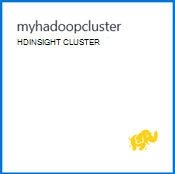

<properties
   pageTitle="Hadoop tutorial: introdução ao Hadoop no Windows | Microsoft Azure"
   description="Introdução ao Hadoop no HDInsight. Saiba como criar Hadoop clusters no Windows, executar uma consulta de ramo de dados e analisar saída no Excel."
   keywords="tutorial hadoop, hadoop no windows, hadoop cluster, saiba hadoop, a consulta de ramo"
   services="hdinsight"
   documentationCenter=""
   authors="nitinme"
   manager="jhubbard"
   editor="cgronlun"
   tags="azure-portal"/>

<tags
   ms.service="hdinsight"
   ms.devlang="na"
   ms.topic="article"
   ms.tgt_pltfrm="na"
   ms.workload="big-data"
   ms.date="03/07/2016"
   ms.author="nitinme"/>

# Hadoop tutorial: começar a utilizar Hadoop no HDInsight no Windows

> [AZURE.SELECTOR]
- [Baseado em Linux](../hdinsight-hadoop-linux-tutorial-get-started.md)
- [Baseado no Windows](../hdinsight-hadoop-tutorial-get-started-windows.md)

Para ajudar a aprender Hadoop no Windows e começar a utilizar o HDInsight, este tutorial mostra-lhe como executar uma consulta de ramo de dados não estruturados num Hadoop cluster e, em seguida, analisar os resultados no Microsoft Excel.

>[AZURE.NOTE] As informações neste documento são específicas a clusters HDInsight baseados no Windows. Para obter informações sobre clusters baseados em Linux, consulte o artigo [Hadoop tutorial: começar a utilizar com base em Linux Hadoop no HDInsight](hdinsight-hadoop-linux-tutorial-get-started.md).

Partem do princípio de que tem um conjunto de dados não estruturado grande e pretender executar uma consulta de ramo no-o para extrair algumas informações importantes. Que é exatamente o que vai fazer este tutorial. Eis como alcançar isto:

   !["Hadoop tutorial: criar uma conta; criar um cluster de Hadoop; submeter uma consulta de ramo; Analise dados no Excel.][image-hdi-getstarted-flow]

Veja um vídeo de demonstração deste tutorial para saber Hadoop no HDInsight:

![Vídeo de um tutorial Hadoop primeiro: submeter uma consulta de ramo num Hadoop cluster e analisar os resultados no Excel.][img-hdi-getstarted-video]

**[Ver o tutorial Hadoop para HDInsight no YouTube](https://www.youtube.com/watch?v=Y4aNjnoeaHA&list=PLDrz-Fkcb9WWdY-Yp6D4fTC1ll_3lU-QS)**

Em conjunto com a disponibilidade geral de Azure HDInsight, a Microsoft fornece também emulador HDInsight Azure, anteriormente conhecido como *Pré-visualização de programador do Microsoft HDInsight*. O emulador destinos cenários de programador e suporta apenas implementações nó único. Para obter informações sobre como utilizar emulador HDInsight, consulte o artigo [Começar a trabalhar com o emulador HDInsight][hdinsight-emulator].

[AZURE.INCLUDE [delete-cluster-warning](../../includes/hdinsight-delete-cluster-warning.md)]

## Pré-requisitos

Antes de começar este tutorial para Hadoop no Windows, tem de ter o seguinte procedimento:

- **Azure uma subscrição**. Consulte o artigo [obter Azure versão de avaliação gratuita](https://azure.microsoft.com/documentation/videos/get-azure-free-trial-for-testing-hadoop-in-hdinsight/).
- **Um computador de estação de trabalho** com o Office 2013 Professional Plus, Office 365 Pro Plus, Excel 2013 autónomo ou Office 2010 Professional Plus.

### Requisitos de controlo de acesso

[AZURE.INCLUDE [access-control](../../includes/hdinsight-access-control-requirements.md)]

##Criar Hadoop clusters

Quando criar um cluster, cria cluster Azure recursos que contêm Hadoop e aplicações relacionadas. Nesta secção, crie um cluster de versão 3,2 HDInsight. Também pode criar clusters de Hadoop para outras versões. Para obter instruções, consulte o artigo [Criar HDInsight clusters utilizando as opções personalizadas][hdinsight-provision]. Para obter informações sobre HDInsight versões e os respetivos SLA, consulte o artigo [o controlo de versões do HDInsight componente](hdinsight-component-versioning.md).

**Para criar um cluster de Hadoop**

1. Inicie sessão no [Portal do Azure](https://portal.azure.com/).
2. Clique em **Novo**, clique em **Análise de dados**e, em seguida, clique em **HDInsight**. O portal é aberto um **Novo HDInsight Cluster** pá.

    ![Criar um novo cluster no Portal do Azure] (./media/hdinsight-hadoop-tutorial-get-started-windows/HDI.CreateCluster.1.png "Criar um novo cluster no Portal do Azure")

3. Introduza ou selecione o seguinte:

    ![ENTER cluster nome e tipo] (./media/hdinsight-hadoop-tutorial-get-started-windows/HDI.CreateCluster.2.png "ENTER cluster nome e tipo")
    
  	|Nome do campo| Valor|
  	|----------|------|
  	|Nome do cluster| Um nome exclusivo para identificar o cluster|
  	|Tipo de cluster| Selecione **Hadoop** para este tutorial. |
  	|Sistema operativo de cluster| Selecione **Centro de dados do Windows Server 2012 R2** para este tutorial.|
  	|Versão HDInsight| Selecione a versão mais recente para este tutorial.|
  	|Subscrição| Selecione a subscrição Azure que será utilizada para o cluster.|
  	|Grupo de recursos | Selecione um grupo de recursos Azure existente ou crie um novo grupo de recursos. Um cluster de HDInsight básico contém um cluster de e a sua conta de armazenamento predefinida.  Pode agrupar os dois num grupo de recursos para facilitar a gestão.|
  	|Credenciais| Introduza o nome de utilizador de início de sessão de cluster e a palavra-passe. Cluster de baseado no Windows pode ter 2 contas de utilizador.  O utilizador cluster (ou utilizador HTTP) é utilizada para gerir o cluster e submeter tarefas.  Opcionalmente, pode criar um ambiente de trabalho remoto (RDP) conta de utilizador para remote ligar ao cluster. Se optar por ativar o ambiente de trabalho remoto, irá criar a conta de utilizador RDP.|
  	|Origem de dados| Clique em criar novo para criar uma nova conta de armazenamento Azure predefinido. Utilize o nome do cluster como o nome predefinido do contentor. Cada cluster HDinsight tem um contentor de BLOBs predefinido accont um armazenamento Azure.  A localização da conta predefinida de armazenamento Azure determina a localização do HDInsight cluster.|
  	|Nó preços camadas| Utilize 1 ou 2 nós de trabalho com o trabalho nó e cabeça nota predefinida preços camadas para este tutorial.|
  	|Configuração opcional| Ignore esta parte.|

9. No pá **Novo HDInsight Cluster** , certifique-se de que o **Pin para Startboard** está selecionada e, em seguida, clique em **Criar**. Isto irá criar o cluster e adicionar um mosaico para o mesmo para Startboard do seu Portal do Azure. O ícone irá indicar que está a criar o cluster e irá alterar para mostrar o ícone de HDInsight assim que concluiu a criação.

  	| Durante a criação | Criação de concluída |
  	| ------------------ | --------------------- |
  	|  |  |

    > [AZURE.NOTE] Irá demorar algum tempo para a cluster criado, normalmente cerca de 15 minutos. Utilize o mosaico na Startboard ou a entrada de **notificações** no lado esquerdo da página para verificar o processo de criação.

10. Assim que a criação for concluída, clique no mosaico para o cluster de Startboard para iniciar a pá cluster.

## Executar uma consulta de ramo a partir do portal
Agora que criou um cluster de HDInsight, o passo seguinte é executar uma tarefa Hive para consultar uma tabela Hive de exemplo. Vamos utilizar o *hivesampletable*, que é fornecido com HDInsight clusters. A tabela que contém dados sobre fabricantes de dispositivo móvel, plataformas e modelos. Uma consulta de ramo nesta tabela obtém os dados para dispositivos móveis por um fabricante específico.

> [AZURE.NOTE] Ferramentas de HDInsight para Visual Studio é fornecida com o SDK do Azure para .NET versão 2.5 ou posterior. Ao utilizar as ferramentas no Visual Studio, pode ligar a HDInsight cluster, criar tabelas de ramo e executar consultas de ramo. Para obter mais informações, consulte o artigo [começar a utilizar o HDInsight Hadoop ferramentas para o Visual Studio][1].

**Para executar uma tarefa de ramo a partir do dashboard de cluster**

1. Inicie sessão no [Portal do Azure](https://portal.azure.com/).
2. Clique em **Procurar tudo** e, em seguida, clique em **HDInsight Clusters** para ver uma lista de clusters, incluindo o cluster que acabou de criar na secção anterior.
3. Clique no nome do cluster que pretende utilizar para executar a tarefa de ramo e, em seguida, clique em **Dashboard** no topo da pá.
4. Numa página Web abre-se num separador de browser diferente. Introduza Hadoop conta de utilizador e palavra-passe. O nome de utilizador predefinido é **administrador**; a palavra-passe é introduzido ao criar o cluster.
5. A partir do dashboard, clique no separador **Editor ramo de registo** . É aberta a página web seguinte.

    ![Separador Editor de ramo no dashboard de cluster HDInsight.][img-hdi-dashboard]

    Existem vários separadores na parte superior da página. No separador predefinido é **Hive Editor**e outros separadores são **Histórico da tarefa** e o **Browser do ficheiro**. Através do dashboard, pode submeter ramo de consultas, verifique os registos de tarefa Hadoop e procurar ficheiros no armazenamento.

    > [AZURE.NOTE] Tenha em atenção que é o URL da página Web * &lt;nome de cluster&gt;. azurehdinsight.net*. Por isso, em vez de abrir o dashboard a partir do portal do, pode abrir o dashboard a partir de um browser web utilizando o URL.

6. No separador **Editor de ramificação** , para **Nome da consulta**, introduza **HTC20**.  O nome da consulta é o título da tarefa. No painel de consulta, introduza a consulta ramo conforme mostrado na imagem:

    ![Ramo de consulta inserida no painel consulta do Editor de ramo de registo.][img-hdi-dashboard-query-select]

4. Clique em **Submeter**. Bastam alguns minutos para obter os resultados novamente. No ecrã atualiza a cada 30 segundos. Também pode clicar em **Atualizar** para atualizar o ecrã.

    ![Resultados de uma consulta de ramo no listados na parte inferior do cluster dashboard.][img-hdi-dashboard-query-select-result]

5. Depois do estado apresenta que a tarefa foi concluída, clique no nome de consulta no ecrã para ver os resultados. Tome nota do **Tempo de começar a tarefa (UTC)**. Irá necessitá-la mais tarde.

    ![Tarefa de hora de início listadas no separador Histórico da tarefa do dashboard de cluster HDInsight.][img-hdi-dashboard-query-select-result-output]

    A página também mostra a **Tarefa de saída** e o **Registo de projecto**. Também tem a opção para transferir o ficheiro de exportação (\_stdout) e o ficheiro de registo \(_stderr).

**Para navegar para o ficheiro de exportação**

1. No dashboard de cluster, clique em **Localizador de ficheiro**.
2. Clique no seu nome de conta de armazenamento, clique no seu nome de contentor (que é o mesmo que o nome de cluster) e, em seguida, clique em **utilizador**.
3. Clique em **admin** e, em seguida, clique no GUID que tem a hora da última modificação (um pouco depois da tarefa de iniciar o tempo indicados anteriormente). Copie esta GUID. Terá-lo na secção seguinte.

    ![A consulta ramo de saída de ficheiro que GUID listadas no separador do Browser do ficheiro.][img-hdi-dashboard-query-browse-output]

##Ligar a ferramentas de business intelligence do Microsoft para Excel

Pode utilizar o suplemento Power Query para o Microsoft Excel para importar o resultado da tarefa a partir do HDInsight para o Excel, onde as ferramentas de business intelligence do Microsoft podem ser utilizadas para analisar os resultados.

Tem de ter o Excel 2013 ou 2010 instalado para concluir esta parte do tutorial.

**Para transferir o Microsoft Power Query para Excel**

- Transferir o Microsoft Power Query para o Microsoft Excel a partir do [Centro de transferências da Microsoft](http://www.microsoft.com/download/details.aspx?id=39379) e instalá-lo.

**Para importar dados do HDInsight**

1. Abra o Excel e crie um novo livro.
3. Clique no menu do **Power Query** , clique em **De outras origens**e, em seguida, clique na **Partir do Azure HDInsight**.

    ![Menu do Excel PowerQuery importar aberto para Azure HDInsight.][image-hdi-gettingstarted-powerquery-importdata]

3. Introduza o **Nome da conta** da conta de armazenamento de Blobs do Azure que está associada ao seu cluster e, em seguida, clique em **OK**. (Isto é a conta de armazenamento que criou anteriormente no tutorial.)
4. Introduza a **Chave de conta** para a conta de armazenamento de Blobs do Azure e, em seguida, clique em **Guardar**.
5. No painel direito, faça duplo clique no nome de Blobs. Por predefinição o nome de BLOBs é o mesmo que o nome do cluster.

6. Localize **stdout** na coluna **nome** . Certifique-se de que o GUID na coluna correspondente **Caminho da pasta** corresponde ao GUID que copiou anteriormente. Uma correspondência sugere que os dados de saída correspondem a tarefa que utilizou ao submeter. Clique em **binário** na coluna esquerda da **stdout**.

    ![Localizar o resultado dos dados pelo GUID na lista de conteúdo.][image-hdi-gettingstarted-powerquery-importdata2]

9. Clique em **Fechar e carregar** no canto superior esquerdo para importar a tarefa de ramo de registo de saída para o Excel.

##Executar exemplos

HDInsight cluster fornece uma consola de consulta que inclui uma galeria de introdução para executar amostras diretamente a partir do portal. Pode utilizar os exemplos para saber como trabalhar com HDInsight ao observar alguns cenários de básicos. Estes exemplos fornecidos com todos os componentes necessários, tais como os dados para analisar e as consultas para executar nos dados. Para saber mais sobre os exemplos na Galeria de introdução, consulte o artigo [Saiba Hadoop no HDInsight através da Galeria de introdução de introdução do HDInsight](hdinsight-learn-hadoop-use-sample-gallery.md).

**Para executar o exemplo**

1. A partir do startboard Azure Portal, clique no mosaico para o cluster que acabou de criar.
 
2. No novo pá de cluster, clique em **Dashboard**. Quando lhe for pedido, introduza o nome de utilizador de administração e palavra-passe cluster.

    ![Dashboard de cluster de iniciação] (./media/hdinsight-hadoop-tutorial-get-started-windows/HDI.Cluster.Dashboard.png "Dashboard de cluster de iniciação")
 
3. Página Web que se abre, clique no separador da **Galeria de introdução de introdução** e, em seguida, na categoria de **soluções com dados de exemplo** , clique em amostra que pretende executar. Siga as instruções na página Web para concluir a amostra. A tabela seguinte lista algumas das amostras e fornece mais informações sobre como é que o que cada amostra.

Exemplo | O que faz?
------ | ---------------
[Análise de dados sensor][hdinsight-sensor-data-sample] | Saiba como utilizar HDInsight para processar dados histórico que são produzidos pela aquecimento, ventilação e sistemas de ar condicionado (AVAC) para identificar sistemas que não forem capazes de forma fiável manter uma temperatura de conjunto.
[Análise de registo do Web site][hdinsight-weblogs-sample] | Saiba como utilizar HDInsight para analisar os ficheiros de registo do Web site para obter visão a frequência das visitas ao Web site num dia de Web sites externos e um resumo dos erros de Web site que os utilizadores uma experiência.
[Análise de tendências twitter](hdinsight-analyze-twitter-data.md) | Saiba como utilizar HDInsight para analisar tendências em Twitter.

##Eliminar o cluster

[AZURE.INCLUDE [delete-cluster-warning](../../includes/hdinsight-delete-cluster-warning.md)]

##Próximos passos
Neste tutorial Hadoop, aprendeu como criar um cluster de Hadoop em janelas do HDInsight, executar uma consulta de ramo de dados e importar os resultados para o Excel, onde pode ser mais processadas e graficamente apresentado com ferramentas de business intelligence. Para saber mais, consulte os seguintes tutoriais:

- [Começar a utilizar o HDInsight Hadoop ferramentas para Visual Studio][1]
- [Começar a trabalhar com o emulador HDInsight][hdinsight-emulator]
- [Utilizar o armazenamento de Blobs do Azure com HDInsight][hdinsight-storage]
- [Administrar HDInsight através do PowerShell][hdinsight-admin-powershell]
- [Carregar dados ao HDInsight][hdinsight-upload-data]
- [Utilizar MapReduce com HDInsight][hdinsight-use-mapreduce]
- [Utilizar ramo com HDInsight][hdinsight-use-hive]
- [Utilizar porco com HDInsight][hdinsight-use-pig]
- [Utilizar Oozie com HDInsight][hdinsight-use-oozie]
- [Desenvolver Java MapReduce programas para HDInsight][hdinsight-develop-mapreduce]

[1]: ../HDInsight/hdinsight-hadoop-visual-studio-tools-get-started.md

[hdinsight-versions]: hdinsight-component-versioning.md

[hdinsight-provision]: hdinsight-provision-clusters.md
[hdinsight-admin-powershell]: hdinsight-administer-use-powershell.md
[hdinsight-upload-data]: hdinsight-upload-data.md
[hdinsight-use-mapreduce]: hdinsight-use-mapreduce.md
[hdinsight-use-hive]: hdinsight-use-hive.md
[hdinsight-use-pig]: hdinsight-use-pig.md
[hdinsight-use-oozie]: hdinsight-use-oozie.md
[hdinsight-storage]: hdinsight-hadoop-use-blob-storage.md
[hdinsight-emulator]: hdinsight-hadoop-emulator-get-started.md
[hdinsight-develop-mapreduce]: hdinsight-develop-deploy-java-mapreduce-linux.md
[hadoop-hdinsight-intro]: hdinsight-hadoop-introduction.md
[hdinsight-weblogs-sample]: hdinsight-hive-analyze-website-log.md
[hdinsight-sensor-data-sample]: hdinsight-hive-analyze-sensor-data.md

[azure-purchase-options]: http://azure.microsoft.com/pricing/purchase-options/
[azure-member-offers]: http://azure.microsoft.com/pricing/member-offers/
[azure-free-trial]: http://azure.microsoft.com/pricing/free-trial/
[azure-management-portal]: https://portal.azure.com/
[azure-create-storageaccount]: ../storage-create-storage-account.md

[apache-hadoop]: http://go.microsoft.com/fwlink/?LinkId=510084
[apache-hive]: http://go.microsoft.com/fwlink/?LinkId=510085
[apache-mapreduce]: http://go.microsoft.com/fwlink/?LinkId=510086
[apache-hdfs]: http://go.microsoft.com/fwlink/?LinkId=510087
[hdinsight-hbase-custom-provision]: hdinsight-hbase-tutorial-get-started.md

[powershell-download]: http://go.microsoft.com/fwlink/p/?linkid=320376&clcid=0x409
[powershell-install-configure]: powershell-install-configure.md
[powershell-open]: powershell-install-configure.md#step-1-install

[img-hdi-dashboard]: ./media/hdinsight-hadoop-tutorial-get-started-windows/HDI.dashboard.png
[img-hdi-dashboard-query-select]: ./media/hdinsight-hadoop-tutorial-get-started-windows/HDI.dashboard.query.select.png
[img-hdi-dashboard-query-select-result]: ./media/hdinsight-hadoop-tutorial-get-started-windows/HDI.dashboard.query.select.result.png
[img-hdi-dashboard-query-select-result-output]: ./media/hdinsight-hadoop-tutorial-get-started-windows/HDI.dashboard.query.select.result.output.png
[img-hdi-dashboard-query-browse-output]: ./media/hdinsight-hadoop-tutorial-get-started-windows/HDI.dashboard.query.browse.output.png

[img-hdi-getstarted-video]: ./media/hdinsight-hadoop-tutorial-get-started-windows/hdi-get-started-video.png

[image-hdi-storageaccount-quickcreate]: ./media/hdinsight-hadoop-tutorial-get-started-windows/HDI.StorageAccount.QuickCreate.png
[image-hdi-clusterstatus]: ./media/hdinsight-hadoop-tutorial-get-started-windows/HDI.ClusterStatus.png
[image-hdi-quickcreatecluster]: ./media/hdinsight-hadoop-tutorial-get-started-windows/HDI.QuickCreateCluster.png
[image-hdi-getstarted-flow]: ./media/hdinsight-hadoop-tutorial-get-started-windows/HDI.GetStartedFlow.png

[image-hdi-gettingstarted-powerquery-importdata]: ./media/hdinsight-hadoop-tutorial-get-started-windows/HDI.GettingStarted.PowerQuery.ImportData.png
[image-hdi-gettingstarted-powerquery-importdata2]: ./media/hdinsight-hadoop-tutorial-get-started-windows/HDI.GettingStarted.PowerQuery.ImportData2.png
 
