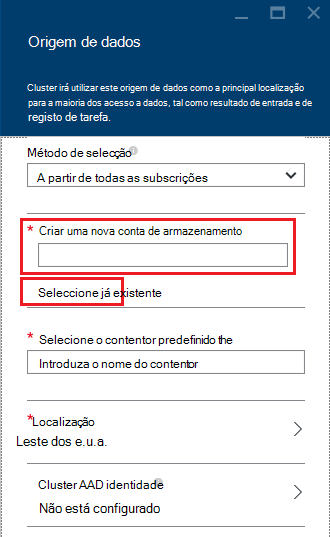

<properties
    pageTitle="Consultar dados a partir do armazenamento de BLOBs compatível com o HDFS | Microsoft Azure"
    description="Armazenamento de Blobs do Azure de utilizações HDInsight como o arquivo de dados grande para HDFS. Saiba como consultar dados a partir do armazenamento de BLOBs e armazenar os resultados da sua análise."
    keywords="blob armazenamento, hdfs, dados estruturados, dados não estruturados"
    services="hdinsight,storage"
    documentationCenter=""
    tags="azure-portal"
    authors="mumian"
    manager="jhubbard"
    editor="cgronlun"/>

<tags
    ms.service="hdinsight"
    ms.workload="big-data"
    ms.tgt_pltfrm="na"
    ms.devlang="na"
    ms.topic="get-started-article"
    ms.date="09/06/2016"
    ms.author="jgao"/>

# Utilizar o armazenamento de Blobs do Azure de HDFS compatível com Hadoop no HDInsight

Saiba como utilizar o armazenamento de Blobs do Azure de custo de baixa com HDInsight, criar a conta de armazenamento Azure e contentor de armazenamento de BLOBs e, em seguida, os dados no interior de endereços.

Armazenamento de Blobs do Azure é uma solução de armazenamento geral, robustos que integra-se totalmente com HDInsight. Através de uma interface de (HDFS) do sistema de ficheiros distribuído Hadoop, o conjunto completo de componentes no HDInsight pode funcionar diretamente no estruturadas ou não estruturados dados armazenamento de Blobs.

Armazenar os dados em armazenamento de BLOBs permite-lhe eliminar com segurança clusters HDInsight que são usados para cálculo sem perder os dados de utilizador.

> [AZURE.IMPORTANT] HDInsight suporta apenas blobs bloco. Não suportar a página ou acrescentar blobs.

Para obter informações sobre a criação de um cluster de HDInsight, consulte o artigo [Introdução ao HDInsight] [ hdinsight-get-started] ou [Criar HDInsight clusters][hdinsight-creation].

## Arquitetura de armazenamento HDInsight
O diagrama seguinte fornece uma vista de resumo de arquitectura de armazenamento do HDInsight:

![Hadoop clusters utilizam a API HDFS para aceder e armazenar dados estruturados e não estruturados no armazenamento de Blobs.] (./media/hdinsight-hadoop-use-blob-storage/HDI.WASB.Arch.png "Arquitetura de armazenamento de HDInsight")

HDInsight fornece acesso ao sistema de ficheiros distribuído localmente é anexado aos nós de cluster. Este sistema de ficheiros pode ser acedido, utilizando o URI totalmente qualificado, por exemplo:

    hdfs://<namenodehost>/<path>

Além disso, HDInsight fornece a capacidade de dados do access que estão armazenados no armazenamento de Blobs do Azure. A sintaxe é:

    wasb[s]://<containername>@<accountname>.blob.core.windows.net/<path>

> [AZURE.NOTE] Em versões do HDInsight anteriores ao 3.0, `asv://` foi utilizado em vez de `wasb://`. `asv://`não deve ser utilizada com HDInsight clusters 3.0 ou superiores, tal como irá resultam num erro.

Hadoop suporta uma noção de sistema de ficheiros predefinido. Sistema de ficheiros predefinido implica um esquema predefinido e autoridade. Podem também ser utilizado para resolver caminhos relativos. Durante o processo de criação do HDInsight, uma conta de armazenamento do Windows Azure e um armazenamento de Blobs do Azure específico contentor a partir dessa conta está designado como o sistema de ficheiro predefinido.

Para além desta conta de armazenamento, pode adicionar contas de armazenamento adicional a partir da mesma subscrição do Azure ou os diferentes subscrições do Azure durante o processo de criação ou após a criação de um cluster. Para obter instruções sobre como adicionar contas adicionais de armazenamento, consulte [Criar HDInsight clusters][hdinsight-creation].

- **Contentores na que estão ligadas a um cluster de contas de armazenamento:** Porque o nome da conta e a chave, são associados ao cluster durante a criação, tem acesso total a blobs existentes nesses contentores.

- **Contentores públicos ou públicos blobs nas contas de armazenamento não estiver ligadas a um cluster:** Tiver permissão só de leitura para blobs nos contentores.

    > [AZURE.NOTE]
        > Contentores públicos permitem-lhe obter uma lista de todos os blobs que estão disponíveis no contentor e obter metadados do contentor. Blobs públicos permitem-lhe aceder as blobs apenas se souber o URL exato. Para mais informações, consulte o artigo <a href="http://msdn.microsoft.com/library/windowsazure/dd179354.aspx">restringir o acesso ao contentores e blobs</a>.

- **Contentores privados nas contas de armazenamento não estiver ligadas a um cluster:** Não consegue aceder blobs nos contentores, a menos que pode definir a conta de armazenamento quando submeter as tarefas de WebHCat. Isto é explicado posteriormente neste artigo.

As contas de armazenamento que são definidas no processo de criação e as respetivas chaves são armazenadas no %HADOOP_HOME%/conf/core-site.xml em nós de cluster. O comportamento predefinido da HDInsight é utilizar a contas de armazenamento definidas no ficheiro core site.xml. Não é recomendado para editar o ficheiro de core site.xml porque o node(master) de cabeça cluster podem ser reimaged ou migrados em qualquer altura e as alterações aos ficheiros serão perdidas.

Várias tarefas WebHCat, incluindo ramo, MapReduce, Hadoop transmissão e porco, podem executar uma descrição das contas de armazenamento e metadados com os mesmos. (Esta atualmente funciona para porco com contas de armazenamento, mas não para metadados.) Na secção [blobs do Access através do Azure PowerShell](#powershell) deste artigo, há um exemplo desta funcionalidade. Para mais informações, consulte o artigo [utilizar um Cluster de HDInsight com alternativo de armazenamento de contas e Metastores](http://social.technet.microsoft.com/wiki/contents/articles/23256.using-an-hdinsight-cluster-with-alternate-storage-accounts-and-metastores.aspx).

Armazenamento de BLOBs pode ser utilizado para os dados estruturados e não estruturados. Contentores de armazenamento de BLOBs armazenam dados como pares valor/chave e não haja nenhuma hierarquia de diretório. No entanto, o caráter de barra (/) pode ser utilizado dentro do nome da chave para que esta apareça como se um ficheiro está armazenado dentro de uma estrutura de diretório. Por exemplo, a chave de um blob poderá *input/log1.txt*. Não existe nenhum directório real *entrada* , mas devido a presença de um caráter de barra no nome da chave, tem o aspeto do caminho do ficheiro.

###Vantagens de armazenamento de BLOBs
O custo de desempenho implícitas de não localizar a calcular clusters e recursos de armazenamento é atenuada pela forma como os clusters de cluster são criados fechar para os recursos de conta de armazenamento no interior da região Azure, onde a rede de alta velocidade torna muito eficaz para os nós de cluster aceder aos dados no interior do armazenamento de Blobs do Azure.

Existem várias vantagens associadas armazenar os dados em armazenamento de Blobs do Azure em vez de HDFS:

* **Partilha e reutilização de dados:** Os dados no HDFS estão localizados no interior cluster de computação. Apenas as aplicações que têm acesso ao cluster de computação podem utilizar os dados utilizando HDFS APIs. Os dados de armazenamento de Blobs do Azure podem ser acedidos através das APIs do HDFS ou as [Blob armazenamento REST APIs][blob-storage-restAPI]. Assim sendo, um conjunto maior de ferramentas e aplicações (incluindo outros clusters HDInsight) pode ser utilizado para produzir e consuma os dados.
* **o arquivo de dados:** Armazenar os dados em armazenamento de Blobs do Azure permite que os clusters HDInsight utilizados para cálculo a ser eliminada com segurança sem perder os dados de utilizador.
* **Custo de armazenamento de dados:** Armazenar os dados em DFS para a longo prazo é mais dispendioso que armazenar os dados em armazenamento de Blobs do Azure porque o custo de um cluster de computação for mais elevado que o custo de um contentor de armazenamento de Blobs do Azure. Além disso, uma vez que os dados não tem de ser carregado novamente para cada. ª geração do cluster de computação, também guarda as carregamento custos de dados.
* **Saída escala flexível:** Apesar de HDFS fornece-lhe um sistema de ficheiros de saída dimensionada, a escala é determinada pelo número de nós criados para o seu cluster. Alterar a escala pode tornar-se um processo que depender de elásticos dimensionamento as funcionalidades que obterá automaticamente no armazenamento de Blobs do Azure mais complicado.
* **Geo replicação:** Os contentores de armazenamento de Blobs do Azure podem ser replicadas geo. Apesar de isto resultará em recuperação geográfica e redundância de dados, uma activação pós-falha para a localização de replicadas geo extremamente impactos o desempenho e podem implicar custos adicionais. Para que a nossa recomendação é escolher a replicação geo externos e apenas se o valor dos dados vale o custo adicional.

Determinadas tarefas MapReduce e pacotes poderão criar resultados intermédios que não realmente pretende armazenar no armazenamento de Blobs do Azure. Nesse caso, pode optar por armazenar os dados a HDFS local. Na verdade, HDInsight utiliza DFS para várias estes resultados intermédios no ramo de tarefas e outros processos.

> [AZURE.NOTE] A maioria dos comandos HDFS (por exemplo, <b>ls</b>, <b>copyFromLocal</b> e <b>mkdir</b>) continuam a funcionar como esperado. Apenas os comandos que são específicos a nativo HDFS pós-implementação (que é referido como DFS), tais como <b>fschk</b> e <b>dfsadmin</b>, irão mostrar um comportamento diferente no armazenamento de Blobs do Azure.

## Criar Blob contentores

Para utilizar blobs, criar primeiro uma [conta de armazenamento do Windows Azure][azure-storage-create]. Como parte desta, especifique uma região Azure que irá guardar os objetos que cria utilizando esta conta. Terá de estar alojados cluster e a conta de armazenamento na mesma região. Base de dados do ramo metastore do SQL Server e a base de dados do SQL Server de metastore Oozie também devem estar localizados na mesma região.

Onde encontra-se, cada blob que criar pertence a um contentor na sua conta de armazenamento do Windows Azure. Neste contentor pode ser um blob existente que foi criado fora do HDInsight, ou pode ser um contentor que é criado para um cluster de HDInsight.

O contentor de BLOBs predefinido guarda informações específicas de cluster como registos e histórico da tarefa. Não partilhe um contentor de BLOBs predefinido com vários clusters HDInsight. Isto poderá danificar histórico da tarefa e cluster irá comportam como esperado. Recomenda-se para utilizar um contentor diferente para cada cluster e colocar dados partilhados numa conta de armazenamento ligadas especificada na implementação de todos os clusters relevantes em vez da conta de armazenamento predefinida. Para obter mais informações sobre como configurar contas ligadas armazenamento, consulte [Criar HDInsight clusters][hdinsight-creation]. No entanto pode reutilizar um contentor de armazenamento predefinido depois do cluster HDInsight original foi eliminado. Para HBase clusters, pode manter o esquema da tabela HBase realmente e dados por criar um novo cluster de HBase utilizando o contentor de armazenamento de BLOBs predefinido é utilizado por um cluster de HBase que foi eliminado.

### Utilizar o Portal do Azure

Ao criar um cluster de HDInsight a partir do Portal, tem as opções para utilizar uma conta de armazenamento existente ou criar uma nova conta de armazenamento:

###Utilizar o clip Azure

[AZURE.INCLUDE [use-latest-version](../../includes/hdinsight-use-latest-cli.md)]

Se tiver [instalado e configurado o clip do Azure](../xplat-cli-install.md), o seguinte comando pode ser utilizados para uma conta de armazenamento e contentor.

    azure storage account create <storageaccountname> --type LRS

> [AZURE.NOTE] O `--type` parâmetro indica como a conta de armazenamento irão ser replicada. Para mais informações, consulte o artigo [Replicação de armazenamento do Azure](../storage/storage-redundancy.md). Não utilize ZRS como ZRS não suporta blob de página, ficheiro, tabela ou fila de espera.

Será pedido para especificar a região geográfica que a conta de armazenamento irão estar localizada em. Devo criar a conta de armazenamento na mesma região que planeia sobre como criar o seu cluster HDInsight.

Assim que a conta de armazenamento é criada, utilize o seguinte comando para obter as chaves de conta de armazenamento:

    azure storage account keys list <storageaccountname>

Para criar um contentor, utilize o seguinte comando:

    azure storage container create <containername> --account-name <storageaccountname> --account-key <storageaccountkey>

### Utilizar o Azure PowerShell

Se tiver [instalado e configurado o Azure PowerShell][powershell-install], pode utilizar o seguinte a partir de linha de comandos do PowerShell do Azure para criar uma conta de armazenamento e contentor:

[AZURE.INCLUDE [upgrade-powershell](../../includes/hdinsight-use-latest-powershell.md)]

    $SubscriptionID = "<Your Azure Subscription ID>"
    $ResourceGroupName = "<New Azure Resource Group Name>"
    $Location = "EAST US 2"
    
    $StorageAccountName = "<New Azure Storage Account Name>"
    $containerName = "<New Azure Blob Container Name>"
    
    Add-AzureRmAccount
    Select-AzureRmSubscription -SubscriptionId $SubscriptionID
    
    # Create resource group
    New-AzureRmResourceGroup -name $ResourceGroupName -Location $Location
    
    # Create default storage account
    New-AzureRmStorageAccount -ResourceGroupName $ResourceGroupName -Name $StorageAccountName -Location $Location -Type Standard_LRS 
    
    # Create default blob containers
    $storageAccountKey = (Get-AzureRmStorageAccountKey -ResourceGroupName $resourceGroupName -StorageAccountName $StorageAccountName)[0].Value
    $destContext = New-AzureStorageContext -StorageAccountName $storageAccountName -StorageAccountKey $storageAccountKey  
    New-AzureStorageContainer -Name $containerName -Context $destContext

## Ficheiros de endereços no armazenamento Blob do

O esquema URI para aceder a ficheiros de armazenamento de Blobs do HDInsight é:

    wasb[s]://<BlobStorageContainerName>@<StorageAccountName>.blob.core.windows.net/<path>

O esquema de URI oferece um acesso não encriptado (com o *wasb:* prefixo) e SSL encriptado access (com *wasbs*). Recomendamos que utilize *wasbs* sempre que possível, mesmo quando aceder aos dados residem dentro da mesma região no Azure.

O &lt;BlobStorageContainerName&gt; identifica o nome do contentor de armazenamento de Blobs do Azure.
O &lt;StorageAccountName&gt; identifica o nome de conta de armazenamento do Windows Azure. É necessário um nome de domínio completamente qualificado (FQDN).

Se nenhuma &lt;BlobStorageContainerName&gt; nem &lt;StorageAccountName&gt; for especificada, é utilizado o sistema de ficheiro predefinido. Para os ficheiros no sistema de ficheiros predefinido, pode utilizar um caminho relativo ou um caminho absoluto. Por exemplo, o ficheiro *hadoop-mapreduce-examples.jar* incluído com HDInsight clusters pode ser conhecido através de um dos seguintes procedimentos:

    wasbs://mycontainer@myaccount.blob.core.windows.net/example/jars/hadoop-mapreduce-examples.jar
    wasbs:///example/jars/hadoop-mapreduce-examples.jar
    /example/jars/hadoop-mapreduce-examples.jar

> [AZURE.NOTE] O nome do ficheiro é <i>hadoop examples.jar</i> em clusters de versões 2.1 e 1.6 HDInsight.

O &lt;caminho&gt; é o nome do caminho HDFS ficheiro ou do diretório. Porque contentores no armazenamento de Blobs do Azure são armazena simplesmente chave-valor, não existe nenhum sistema de ficheiros hierárquica verdadeiro. Um caráter de barra (/) dentro de uma chave de BLOBs será interpretado como um separador de diretório. Por exemplo, o nome de Blobs do *hadoop-mapreduce-examples.jar* é:

    example/jars/hadoop-mapreduce-examples.jar

> [AZURE.NOTE] Quando trabalha com blobs fora do HDInsight, a maior parte dos utilitários não reconhecer o formato WASB e em vez disso esperar num formato de caminho básicas, tais como `example/jars/hadoop-mapreduce-examples.jar`.

## Blobs do Access utilizando o clip do Azure

Utilize o seguinte comando para listar os comandos relacionados com blob:

    azure storage blob

**Exemplo de utilização de Azure clip para carregar um ficheiro**

    azure storage blob upload <sourcefilename> <containername> <blobname> --account-name <storageaccountname> --account-key <storageaccountkey>

**Exemplo de utilização de Azure clip para transferir um ficheiro**

    azure storage blob download <containername> <blobname> <destinationfilename> --account-name <storageaccountname> --account-key <storageaccountkey>

**Exemplo de utilização de Azure clip para eliminar um ficheiro**

    azure storage blob delete <containername> <blobname> --account-name <storageaccountname> --account-key <storageaccountkey>

**Exemplo de utilização de clip Azure aos ficheiros de lista**

    azure storage blob list <containername> <blobname|prefix> --account-name <storageaccountname> --account-key <storageaccountkey>

## Blobs do Access através do PowerShell do Azure

> [AZURE.NOTE] Os comandos nesta secção fornecem um exemplo básico de utilizar o PowerShell para aceder aos dados armazenados num blobs. Por exemplo de mais completa é personalizado para trabalhar com HDInsight, consulte as [Ferramentas de HDInsight](https://github.com/Blackmist/hdinsight-tools).

Utilize o seguinte comando para listar os cmdlets relacionados com blob:

    Get-Command *blob*

![Lista de BLOBs relacionadas com os cmdlets do PowerShell.][img-hdi-powershell-blobcommands]

###Carregar ficheiros

Consulte o artigo [Transferir dados do HDInsight][hdinsight-upload-data].

###Transferir ficheiros

Os seguintes scripts transfere um blob de bloco para a pasta atual. Antes de executar o script, altere o directório para uma pasta onde tem permissões de escrita.

    $resourceGroupName = "<AzureResourceGroupName>"
    $storageAccountName = "<AzureStorageAccountName>"   # The storage account used for the default file system specified at creation.
    $containerName = "<BlobStorageContainerName>"  # The default file system container has the same name as the cluster.
    $blob = "example/data/sample.log" # The name of the blob to be downloaded.
    
    # Use Add-AzureAccount if you haven't connected to your Azure subscription
    Login-AzureRmAccount 
    Select-AzureRmSubscription -SubscriptionID "<Your Azure Subscription ID>"
    
    Write-Host "Create a context object ... " -ForegroundColor Green
    $storageAccountKey = (Get-AzureRmStorageAccountKey -ResourceGroupName $resourceGroupName -Name $storageAccountName)[0].Value
    $storageContext = New-AzureStorageContext -StorageAccountName $storageAccountName -StorageAccountKey $storageAccountKey  
    
    Write-Host "Download the blob ..." -ForegroundColor Green
    Get-AzureStorageBlobContent -Container $ContainerName -Blob $blob -Context $storageContext -Force
    
    Write-Host "List the downloaded file ..." -ForegroundColor Green
    cat "./$blob"

Fornecer o nome do grupo de recursos e o nome do cluster, pode utilizar o seguinte código:

    $resourceGroupName = "<AzureResourceGroupName>"
    $clusterName = "<HDInsightClusterName>"
    $blob = "example/data/sample.log" # The name of the blob to be downloaded.
    
    $cluster = Get-AzureRmHDInsightCluster -ResourceGroupName $resourceGroupName -ClusterName $clusterName
    $defaultStorageAccount = $cluster.DefaultStorageAccount -replace '.blob.core.windows.net'
    $defaultStorageAccountKey = (Get-AzureRmStorageAccountKey -ResourceGroupName $resourceGroupName -Name $defaultStorageAccount)[0].Value
    $defaultStorageContainer = $cluster.DefaultStorageContainer
    $storageContext = New-AzureStorageContext -StorageAccountName $defaultStorageAccount -StorageAccountKey $defaultStorageAccountKey 
    
    Write-Host "Download the blob ..." -ForegroundColor Green
    Get-AzureStorageBlobContent -Container $defaultStorageContainer -Blob $blob -Context $storageContext -Force

###Eliminar ficheiros

    Remove-AzureStorageBlob -Container $containerName -Context $storageContext -blob $blob

###Lista de ficheiros

    Get-AzureStorageBlob -Container $containerName -Context $storageContext -prefix "example/data/"

###Executar consultas de ramo de utilizar uma conta de armazenamento indefinido

Este exemplo mostra como uma pasta de conta de armazenamento que não está definida durante o processo de criação da lista.
$clusterName = "<HDInsightClusterName>"

    $undefinedStorageAccount = "<UnboundedStorageAccountUnderTheSameSubscription>"
    $undefinedContainer = "<UnboundedBlobContainerAssociatedWithTheStorageAccount>"

    $undefinedStorageKey = Get-AzureStorageKey $undefinedStorageAccount | %{ $_.Primary }

    Use-AzureRmHDInsightCluster $clusterName

    $defines = @{}
    $defines.Add("fs.azure.account.key.$undefinedStorageAccount.blob.core.windows.net", $undefinedStorageKey)

    Invoke-AzureRmHDInsightHiveJob -Defines $defines -Query "dfs -ls wasbs://$undefinedContainer@$undefinedStorageAccount.blob.core.windows.net/;"

## Próximos passos

Neste artigo, que aprendeu como utilizar o armazenamento de Blobs do Azure de HDFS compatível com HDInsight e que aprendeu que armazenamento de Blobs do Azure é um componente fundamental do HDInsight. Esta opção permite-lhe criar soluções de aquisição dimensionáveis, a longo prazo, arquivo de dados com armazenamento de Blobs do Azure e utilizar HDInsight para desbloquear as informações contidas nos dados estruturados e não estruturados armazenados.

Para obter mais informações, consulte:

* [Introdução ao Azure HDInsight][hdinsight-get-started]
* [Carregar dados ao HDInsight][hdinsight-upload-data]
* [Utilizar ramo com HDInsight][hdinsight-use-hive]
* [Utilizar porco com HDInsight][hdinsight-use-pig]
* [Utilizar assinaturas de acesso partilhadas do Azure armazenamento para restringir o acesso a dados com HDInsight][hdinsight-use-sas]

[hdinsight-use-sas]: hdinsight-storage-sharedaccesssignature-permissions.md
[powershell-install]: ../powershell-install-configure.md
[hdinsight-creation]: hdinsight-provision-clusters.md
[hdinsight-get-started]: hdinsight-hadoop-tutorial-get-started-windows.md
[hdinsight-upload-data]: hdinsight-upload-data.md
[hdinsight-use-hive]: hdinsight-use-hive.md
[hdinsight-use-pig]: hdinsight-use-pig.md

[blob-storage-restAPI]: http://msdn.microsoft.com/library/windowsazure/dd135733.aspx
[azure-storage-create]: ../storage/storage-create-storage-account.md

[img-hdi-powershell-blobcommands]: ./media/hdinsight-hadoop-use-blob-storage/HDI.PowerShell.BlobCommands.png
[img-hdi-quick-create]: ./media/hdinsight-hadoop-use-blob-storage/HDI.QuickCreateCluster.png
[img-hdi-custom-create-storage-account]: ./media/hdinsight-hadoop-use-blob-storage/HDI.CustomCreateStorageAccount.png  
