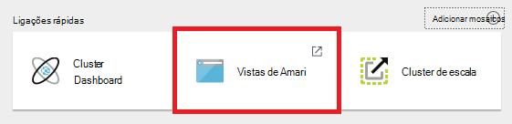

<properties
   pageTitle="Utilizar vistas Ambari para trabalhar com ramo de HDInsight (Hadoop) | Microsoft Azure"
   description="Saiba como utilizar a vista Hive a partir do browser para submeter ramo de consultas. A vista Hive é a parte da IU Web Ambari fornecidos com o seu cluster baseado em Linux HDInsight."
   services="hdinsight"
   documentationCenter=""
   authors="Blackmist"
   manager="jhubbard"
   editor="cgronlun"
    tags="azure-portal"/>

<tags
   ms.service="hdinsight"
   ms.devlang="na"
   ms.topic="article"
   ms.tgt_pltfrm="na"
   ms.workload="big-data"
   ms.date="10/28/2016"
   ms.author="larryfr"/>

#Utilize a vista de ramo com Hadoop no HDInsight

[AZURE.INCLUDE [hive-selector](../../includes/hdinsight-selector-use-hive.md)]

Ambari é uma gestão e monitorização utilitário fornecido com clusters baseado em Linux HDInsight. Uma das funcionalidades fornecidas através de Ambari é uma IU Web que podem ser utilizadas para executar consultas de ramo. Esta é a __Vista Hive__, parte das vistas Ambari fornecidos com o seu cluster HDInsight.

> [AZURE.NOTE] Ambari tem muitas funcionalidades que não serão abordados neste documento. Para mais informações, consulte o artigo [Gerir HDInsight clusters utilizando a IU da Web de Ambari](hdinsight-hadoop-manage-ambari.md).

##Pré-requisitos

- Um cluster de baseado em Linux HDInsight. Para obter informações sobre como criar um novo cluster, consulte o artigo [Introdução ao baseado em Linux HDInsight](hdinsight-hadoop-linux-tutorial-get-started.md).

##Abrir a vista de ramo

Pode Ambari vistas a partir do Portal do Azure; Selecione o seu cluster HDInsight e, em seguida, selecione __Ambari vistas__ a partir da secção de __Ligações rápidas__ .

Pode também navegue diretamente para Ambari acedendo a https://CLUSTERNAME.azurehdinsight.net num browser (onde o __nome de cluster__ é o nome do seu cluster HDInsight) e, em seguida, selecione o conjunto de quadrados a partir do menu de página (junto a ligação de __administrador__ e o botão no lado esquerdo da página,) para vistas disponíveis de lista. Selecione __Hive vista__.

.

> [AZURE.NOTE] Ao aceder ao Ambari, ser-lhe-á pedido para autenticar para o site. Introduza o administrador (predefinição `admin`,) nome de conta e palavra-passe que utilizou quando criar o cluster.

Deverá visualizar uma página semelhante ao seguinte:

##Tabelas de vista

Na secção __Explorer de base de dados__ da página, selecione a entrada __predefinida__ no separador de __bases de dados__ . Isto vai mostrar uma lista de tabelas da base de dados predefinido. Para um novo cluster de HDInsight, deve existir apenas uma tabela; __hivesampletable__.

Como são adicionadas novas tabelas através dos passos neste documento, pode utilizar o ícone de atualização no canto superior direito do Explorador de base de dados para atualizar a lista de tabelas disponíveis.

##Editor de consultas

Utilize os passos seguintes a partir da vista de Hive para executar uma consulta de ramo contra incluídos com o cluster de dados.

1. Na secção da página __Editor de consultas__ , cole seguintes declarações HiveQL na folha de cálculo:

        DROP TABLE log4jLogs;
        CREATE EXTERNAL TABLE log4jLogs(t1 string, t2 string, t3 string, t4 string, t5 string, t6 string, t7 string)
        ROW FORMAT DELIMITED FIELDS TERMINATED BY ' '
        STORED AS TEXTFILE LOCATION 'wasbs:///example/data/';
        SELECT t4 AS sev, COUNT(*) AS cnt FROM log4jLogs WHERE t4 = '[ERROR]' GROUP BY t4;

    Estas instruções executar as seguintes ações:

    - **LARGAR tabela** - elimina a tabela e o ficheiro de dados, caso já existe na tabela.
    - **Criar tabela externa** - cria uma nova tabela "externa" no ramo. Tabelas externas armazenam apenas a definição da tabela Hive; os dados falta na localização original.
    - **Formato de linha** - indica Hive a forma como os dados estão formatados. Neste caso, os campos no registo de cada são separados por um espaço.
    - **Localização de TEXTFILE como ARMAZENADOS** - indica Hive onde estão os dados armazenados (o directório de exemplo de dados) e que a mesma está armazenada como texto.
    - **SELECIONE** - seleciona uma contagem de todas as linhas onde t4 coluna contém o valor [erro].

    >[AZURE.NOTE] Tabelas externas devem ser utilizadas quando pretende os dados subjacentes ser atualizados por uma fonte externa, tal como um processo de carregamento de dados automatizado, ou por outra MapReduce operação, mas pretende sempre ramo de consultas para utilizar os dados mais recentes. Largar uma tabela externa é que *não* eliminar os dados, apenas a definição da tabela.

2. Utilize o botão de __Executar__ na parte inferior do Editor de consultas para iniciar a consulta. Deve ligar-se de cor de laranja e irá alterar o texto para __Parar a execução__. Uma secção de __Resultados da consulta processo__ deverá aparecer por baixo do Editor de consultas e apresentar informações sobre a tarefa.

    > [AZURE.IMPORTANT] Alguns browsers, não podem atualizar as informações de registo ou resultados corretamente. Se executar uma tarefa e parece executar uma eternidade sem atualizar o registo ou devolve resultados, tente utilizar Mozilla FireFox ou o Google Chrome.

3. Quando tiver terminado a consulta, a secção __Resultados do processo de consulta__ irá apresentar os resultados da operação de. O botão __Parar a execução__ também irá alterar novamente a um botão de __Executar__ verde. No separador __resultados__ deve conter as seguintes informações:

        sev       cnt
        [ERROR]   3

    No separador de __registos__ pode ser utilizado para ver as informações de registo criadas pela tarefa. Pode utilizar esta opção para resolver o problema se existem problemas com uma consulta.

    > [AZURE.TIP] Tenha em atenção a resultados pendente caixa de diálogo __Guardar__ no canto superior esquerdo da secção __Resultados do processo de consulta__ ; Pode utilizar este para transferir os resultados ou guardá-los ao armazenamento de HDInsight como um ficheiro CSV.

3. Selecione as primeiras quatro linhas desta consulta, em seguida, selecione __Executar__. Repare que não existem resultados quando a tarefa estiver concluída. Isto acontece porque utilizando o botão de __Executar__ quando estiver selecionado parte da consulta só serão executadas as declarações selecionadas. Neste caso, a seleção não incluir a instrução final que obtém linhas da tabela. Se selecionar apenas nessa linha e utilizar __Executar__, deverá ver os resultados esperados.

3. Utilize o botão de __Nova folha de cálculo__ na parte inferior do __Editor de consultas__ para criar uma nova folha de cálculo. Na nova folha de cálculo, introduza as seguintes instruções HiveQL:

        CREATE TABLE IF NOT EXISTS errorLogs (t1 string, t2 string, t3 string, t4 string, t5 string, t6 string, t7 string) STORED AS ORC;
        INSERT OVERWRITE TABLE errorLogs SELECT t1, t2, t3, t4, t5, t6, t7 FROM log4jLogs WHERE t4 = '[ERROR]';

    Estas instruções executar as seguintes ações:

    - **Criar a tabela se não existe** - cria uma tabela, se ainda não existir. Uma vez que não é utilizada a palavra-chave **externa** , este é uma tabela interna, que está armazenada no armazém de ramo de dados e é gerida completamente por ramo. Ao contrário de tabelas externas, largar uma tabela interna irá eliminar dados subjacentes.
    - **ARMAZENADOS ORC como** - armazena os dados no formato de otimizado linha colunar (ORC). Este é um formato de altamente optimizado e eficaz para armazenar dados ramo.
    - SUBSTITUIR **INSERT... SELECIONE** - seleciona linhas da tabela **log4jLogs** que contêm [erro] e, em seguida, insere os dados na tabela **errorLogs** .

    Utilize o botão __Executar__ para executar esta consulta. No separador __resultados__ não irá conter quaisquer informações como não são devolvidas filas por esta consulta, mas deve mostrar o estado como __com êxito__.

###Definições de ramo

Selecione o ícone de __Definições__ para a direita do editor.

Definições podem ser utilizadas para alterar várias definições ramo, tal como alterar o motor de execução para ramo a partir Tez (a predefinição), para MapReduce.

###Explicar Visual

Selecione o ícone __Explicar Visual__ à direita do editor.

Esta é a vista __Explicar Visual__ da consulta, que pode ser útil nas Noções sobre o fluxo de consultas complexas. Pode ver um equivalente textual desta vista utilizando o botão __Explicar__ no Editor de consultas.

###Tez

Selecione o ícone de __Tez__ à direita do editor.

Isto vai mostrar o direcionado incluindo Graph (Comprimentos) utilizado pelo Tez para esta consulta, se disponível. Se pretender ver Comprimentos para consultas tenha executou na passado, ou de depuração o processo de Tez, utilize a [Vista de Tez](hdinsight-debug-ambari-tez-view.md) em vez disso.

###Notificações

Selecione o ícone de __notificações de__ à direita do editor.

Notificações são mensagens que são geradas quando executar consultas. Por exemplo, receberá uma notificação quando é submetida uma consulta ou quando ocorre um erro.

##Consultas guardadas

1. A partir do Editor de consultas, crie uma nova folha e introduza a seguinte consulta:

        SELECT * from errorLogs;

    Execute a consulta para verificar que funciona. Os resultados serão da seguinte forma:

        errorlogs.t1    errorlogs.t2    errorlogs.t3    errorlogs.t4    errorlogs.t5    errorlogs.t6    errorlogs.t7
        2012-02-03  18:35:34    SampleClass0    [ERROR]     incorrect   id  
        2012-02-03  18:55:54    SampleClass1    [ERROR]     incorrect   id  
        2012-02-03  19:25:27    SampleClass4    [ERROR]     incorrect   id

2. Utilize o botão __Guardar como__ na parte inferior do editor. Atribuir um nome esta consulta __Errorlogs__ e selecione __OK__. Note que o nome da folha de cálculo muda para __Errorlogs__.

3. Selecione o separador __Consultas guardadas__ na parte superior da página Hive vista. Tenha em atenção que __Errorlogs__ está agora listado como uma consulta guardada. Permanecerá nesta lista até, removê-lo. Selecionar o nome irá abra a consulta no Editor de consultas.

##Histórico de consulta

O botão __Histórico__ na parte superior da vista de Hive permite para ver as consultas tiver executou anteriormente. Utilizá-lo agora e selecione algumas das consultas que tiver executou anteriormente. Quando seleciona uma consulta, abre-lo no Editor de consultas.

##Funções (UDF) definidas pelo utilizador

Também pode ser prolongado ramo através **das funções definidas pelo utilizador (UDF)**. Um UDF permite-lhe implementar funcionalidade ou lógica que não está modelada facilmente no HiveQL.

Apesar de poder adicionar um UDF como parte das declarações HiveQL na sua consulta, no separador UDF na parte superior da vista de Hive permite-lhe declarar e guardar um conjunto de UDFs que podem ser utilizados com o __Editor de consultas__.

Assim que tiver adicionado um UDF para a vista Hive, um botão __Inserir udfs__ aparecerá na parte inferior do __Editor de consultas__. Selecionar esta será apresentada uma lista pendente de UDFs definidas na vista de ramo de registo. Selecionar um UDF irá adicionar HiveQL declarações à consulta para ativar o UDF.

Por exemplo, se tiver definido um UDF com as seguintes propriedades:

* Nome do recurso: myudfs
* Caminho do recurso: wasbs:///myudfs.jar
* Nome UDF: myawesomeudf
* O nome de classe UDF: com.myudfs.Awesome

Utilizar o botão __Inserir udfs__ será apresentada uma entrada denominada __myudfs__, com outra pendente para cada UDF definido para esse recurso. Neste caso, __myawesomeudf__. Selecionar esta entrada irá adicionar o seguinte procedimento para o início da consulta:

    add jar wasbs:///myudfs.jar;

    create temporary function myawesomeudf as 'com.myudfs.Awesome';

Em seguida, pode utilizar o UDF na sua consulta. Por exemplo, `SELECT myawesomeudf(name) FROM people;`.

Para obter mais informações sobre como utilizar UDFs com ramo de HDInsight, consulte o seguinte:

* [Utilizar Python com ramo e porco no HDInsight](hdinsight-python.md)

* [Como adicionar um UDF Hive personalizado ao HDInsight](http://blogs.msdn.com/b/bigdatasupport/archive/2014/01/14/how-to-add-custom-hive-udfs-to-hdinsight.aspx)

##Próximos passos

Para obter informações gerais sobre ramo no HDInsight:

* [Utilizar ramo com Hadoop no HDInsight](hdinsight-use-hive.md)

Para obter informações sobre outras formas pode trabalhar com Hadoop no HDInsight:

* [Utilizar porco com Hadoop no HDInsight](hdinsight-use-pig.md)

* [Utilizar MapReduce com Hadoop no HDInsight](hdinsight-use-mapreduce.md)
