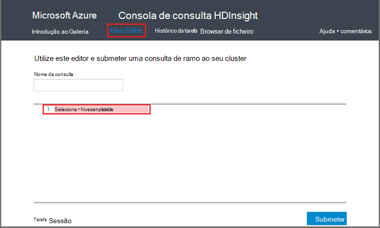

<properties
   pageTitle="Utilizar o Hadoop ramo da consola de consulta em HDInsight | Microsoft Azure"
   description="Saiba como utilizar a consola de consulta baseada na web para executar consultas de ramo num cluster HDInsight Hadoop a partir do browser."
   services="hdinsight"
   documentationCenter=""
   authors="Blackmist"
   manager="jhubbard"
   editor="cgronlun"
    tags="azure-portal"/>

<tags
   ms.service="hdinsight"
   ms.devlang="na"
   ms.topic="article"
   ms.tgt_pltfrm="na"
   ms.workload="big-data"
   ms.date="09/20/2016"
   ms.author="larryfr"/>

# Executar consultas de ramo utilizando a consola de consulta

[AZURE.INCLUDE [hive-selector](../../includes/hdinsight-selector-use-hive.md)]

Este artigo vai aprender a utilizar a consola de consulta HDInsight para executar consultas de ramo num cluster HDInsight Hadoop a partir do browser.

> [AZURE.IMPORTANT] Consola de consulta do HDInsight só está disponível em clusters HDInsight baseados no Windows. Se estiver a utilizar um cluster de baseado em Linux HDInsight, consulte o artigo [Executar Hive consultas utilizando a vista ramo de registo](hdinsight-hadoop-use-hive-ambari-view.md).

##Pré-requisitos

Para concluir os passos neste artigo, terá o seguinte.

* Um cluster de baseados no Windows HDInsight Hadoop

* Um browser web moderna

##Executar consultas de ramo utilizando a consola de consulta

1. Abra um browser e navegue para __https://CLUSTERNAME.azurehdinsight.net__, onde o __nome de cluster__ é o nome do seu cluster HDInsight. Se lhe for pedido, introduza o nome de utilizador e palavra-passe que utilizou quando criou o cluster.

2. As ligações na parte superior da página, selecione **Editor ramo de registo**. Esta ação apresentará um formulário que pode ser utilizado para introduzir as instruções do HiveQL que pretende executar no HDInsight cluster.

    

    Substitua o texto `Select * from hivesampletable` com as seguintes instruções HiveQL:

        set hive.execution.engine=tez;
        DROP TABLE log4jLogs;
        CREATE EXTERNAL TABLE log4jLogs (t1 string, t2 string, t3 string, t4 string, t5 string, t6 string, t7 string)
        ROW FORMAT DELIMITED FIELDS TERMINATED BY ' '
        STORED AS TEXTFILE LOCATION 'wasbs:///example/data/';
        SELECT t4 AS sev, COUNT(*) AS count FROM log4jLogs WHERE t4 = '[ERROR]' AND INPUT__FILE__NAME LIKE '%.log' GROUP BY t4;

    Estas instruções executar as seguintes ações:

    * **LARGAR tabela**: elimina a tabela e o ficheiro de dados se a tabela já existe.
    * **Criar tabela externa**: cria uma nova tabela «externa» no ramo. Tabelas externas armazenam apenas a definição da tabela Hive; os dados falta na localização original.

    > [AZURE.NOTE] Tabelas externas devem ser utilizadas quando pretende os dados subjacentes ser atualizados por uma fonte externa (tal como um processo de carregamento de dados automatizado) ou por outra MapReduce operação, mas pretende sempre ramo de consultas para utilizar os dados mais recentes.
    >
    > Largar uma tabela externa é que **não** eliminar os dados, apenas a definição da tabela.

    * **Formato de linha**: indica Hive a forma como os dados estão formatados. Neste caso, os campos no registo de cada são separados por um espaço.
    * **Localização de TEXTFILE como ARMAZENADOS**: indica Hive onde estão os dados armazenados (o directório de exemplo de dados) e que este é armazenado como texto
    * **SELECIONE**: selecione uma contagem de todas as linhas onde coluna **t4** contém o valor de **[erro]**. Isto deve devolver um valor de **3** , uma vez que existem três linhas que contêm este valor.
    * **INPUT__FILE__NAME como '%.log'** - indica Hive que recomendamos só deve devolver dados a partir de ficheiros que terminem em. log. Este processo restringe a pesquisa para o ficheiro de sample.log que contém os dados e mantém o partir de devolver dados a partir de outras exemplo ficheiros de dados que não correspondem ao esquema definido.

2. Clique em **Submeter**. A **Sessão de tarefas** na parte inferior da página deve mostrar detalhes para a tarefa.

3. Quando o campo **Estado** muda para **concluído**, selecione **Ver detalhes** para a tarefa. Na página Detalhes, a **Tarefa de saída** contém `[ERROR]   3`. Pode utilizar o botão **Transferir** este campo para transferir um ficheiro que contém o resultado da tarefa.

##Resumo

Como pode ver, a consola de consulta fornece uma forma fácil de executar consultas de ramo num HDInsight cluster, monitorizar o estado da tarefa e obter o resultado.

Para saber mais sobre como utilizar Hive consola de consulta para executar tarefas ramo, selecione **Introdução** na parte superior da consola de consulta, em seguida, utilize os exemplos que são fornecidos. Cada amostra explica o processo de utilização Hive para analisar dados, incluindo explicações sobre as declarações de HiveQL utilizadas na amostra.

##Próximos passos

Para obter informações gerais sobre ramo no HDInsight:

* [Utilizar ramo com Hadoop no HDInsight](hdinsight-use-hive.md)

Para obter informações sobre outras formas pode trabalhar com Hadoop no HDInsight:

* [Utilizar porco com Hadoop no HDInsight](hdinsight-use-pig.md)

* [Utilizar MapReduce com Hadoop no HDInsight](hdinsight-use-mapreduce.md)

Se estiver a utilizar Tez com ramo, consulte os seguintes documentos para as informações de depuração:

* [Utilizar a IU Tez no HDInsight baseados no Windows](hdinsight-debug-tez-ui.md)

* [Utilizar a vista de Ambari Tez no baseado em Linux HDInsight](hdinsight-debug-ambari-tez-view.md)

[1]: ../HDInsight/hdinsight-hadoop-visual-studio-tools-get-started.md

[hdinsight-sdk-documentation]: http://msdnstage.redmond.corp.microsoft.com/library/dn479185.aspx

[azure-purchase-options]: http://azure.microsoft.com/pricing/purchase-options/
[azure-member-offers]: http://azure.microsoft.com/pricing/member-offers/
[azure-free-trial]: http://azure.microsoft.com/pricing/free-trial/

[apache-tez]: http://tez.apache.org
[apache-hive]: http://hive.apache.org/
[apache-log4j]: http://en.wikipedia.org/wiki/Log4j
[hive-on-tez-wiki]: https://cwiki.apache.org/confluence/display/Hive/Hive+on+Tez
[import-to-excel]: http://azure.microsoft.com/documentation/articles/hdinsight-connect-excel-power-query/

[hdinsight-use-oozie]: hdinsight-use-oozie.md
[hdinsight-analyze-flight-data]: hdinsight-analyze-flight-delay-data.md

[hdinsight-storage]: hdinsight-hadoop-use-blob-storage.md

[hdinsight-provision]: hdinsight-provision-clusters.md
[hdinsight-submit-jobs]: hdinsight-submit-hadoop-jobs-programmatically.md
[hdinsight-upload-data]: hdinsight-upload-data.md
[hdinsight-get-started]: hdinsight-hadoop-linux-tutorial-get-started.md

[Powershell-install-configure]: powershell-install-configure.md
[powershell-here-strings]: http://technet.microsoft.com/library/ee692792.aspx

[img-hdi-hive-powershell-output]: ./media/hdinsight-use-hive/HDI.Hive.PowerShell.Output.png
