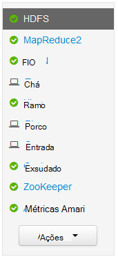
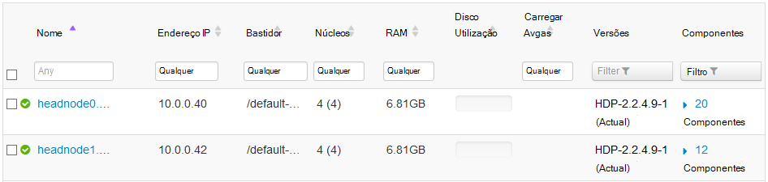
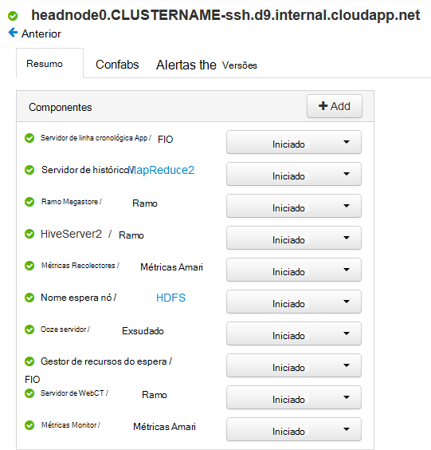
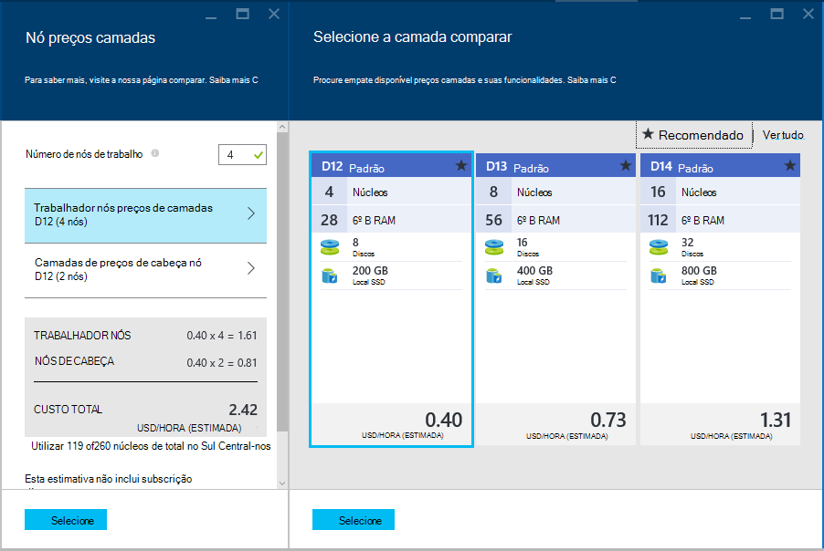

<properties
    pageTitle="Funcionalidades de elevada disponibilidade do HDInsight baseado em Linux (Hadoop) | Microsoft Azure"
    description="Saiba como baseado em Linux HDInsight clusters de melhorar a fiabilidade e disponibilidade utilizando um nó de cabeça adicional. Vai aprender como isto impactos Hadoop serviços, como Ambari e ramo, bem como como individualmente ligar a cada nó cabeça utilizando SSH."
    services="hdinsight"
    editor="cgronlun"
    manager="jhubbard"
    authors="Blackmist"
    documentationCenter=""
    tags="azure-portal"/>

<tags
    ms.service="hdinsight"
    ms.workload="big-data"
    ms.tgt_pltfrm="na"
    ms.devlang="multiple"
    ms.topic="article"
    ms.date="09/13/2016"
    ms.author="larryfr"/>

#Disponibilidade e fiabilidade dos Hadoop clusters no HDInsight

Hadoop atinge elevada disponibilidade e fiabilidade através da distribuição redundantes cópias dos serviços e dados entre os nós num cluster. No entanto distribuições padrão de Hadoop normalmente têm um único nó cabeça. Qualquer indisponibilidade do nó cabeça única pode fazer com que o cluster deixarão de funcionar.

Para resolver este problema potencial, clusters de baseado em Linux HDInsight no Azure fornecem dois nós de cabeça para aumentar a disponibilidade e fiabilidade dos serviços de Hadoop e tarefas em execução.

> [AZURE.NOTE] Os passos utilizados neste documento são específicos a clusters baseado em Linux HDInsight. Se estiver a utilizar um cluster baseados no Windows, consulte o artigo [disponibilidade e fiabilidade dos clusters de baseados no Windows Hadoop HDInsight](hdinsight-high-availability.md) para obter informações específicas do Windows.

##Noções sobre os nós

Nós num HDInsight cluster são implementadas utilizando máquinas virtuais do Azure. No caso de um nó falha, é disponibilizado offline e é criado um novo nó para substituir o nó com falha. Enquanto o nó está offline, outro nó do mesmo tipo será utilizado até que o novo nó estiver online.

> [AZURE.NOTE] Se o nó está a analisar dados quando falhar, o seu progresso na tarefa será perdido. A tarefa que o nó falhar estava a trabalhar num vai ser submetida novamente para outro nó.

As secções seguintes descrevem os tipos de nó individuais utilizados com HDInsight. Nem todos os tipos de nó são utilizados para um tipo de cluster. Por exemplo, um tipo de cluster Hadoop não terão quaisquer nós Nimbus. Para mais informações sobre nós utilizadas por tipos de cluster HDInsight, consulte a secção de tipos de Cluster de [baseado em criar Linux Hadoop clusters no HDInsight](hdinsight-hadoop-provision-linux-clusters.md#cluster-types).

###Nós de cabeça

Algumas implementações de Hadoop tem um único nó cabeça que aloja serviços e componentes gerir a falha de nós do trabalho sem problemas. Mas qualquer falhas de serviços mestras em execução no nó cabeça seriam fazer com que o cluster deixem de funcionar.

HDInsight clusters fornecem um nó de cabeça secundário, que permite aos serviços mestras e de componentes para continuar a executar no nó secundário em caso de falha na página principal.

> [AZURE.IMPORTANT] Ambos os nós de cabeça são ativa e a execução dentro do cluster em simultâneo. Alguns serviços, tais como HDFS ou FIO só estão 'activos' num nó cabeça em qualquer determinada altura (e «em modo de espera' no outro nó cabeça). Outros serviços como HiveServer2 ou Hive MetaStore forem ativos em ambos os nós de cabeça ao mesmo tempo.

Nós de cabeça (e outros nós HDInsight,) tem um valor numérico como parte do nome de anfitrião do nó. Por exemplo, `hn0-CLUSTERNAME` ou `hn4-CLUSTERNAME`. 

> [AZURE.IMPORTANT] Não associar o valor numérico se um nó é principal ou secundário; o valor numérico só está apresentar para fornecer um nome exclusivo para cada nó.

###Nimbus nós

Para clusters tempestade, os nós Nimbus fornecem uma funcionalidade semelhante à Hadoop JobTracker ao distribuir e processamento de monitorização em nós de trabalho. HDInsight fornece 2 nós de Nimbus para o tipo de cluster tempestade.

###Nós zookeeper

[ZooKeeper](http://zookeeper.apache.org/ ) nós (ZKs) são utilizados para eleições políticas de caráter de preenchimento de serviços mestras em nós de cabeça e para garantir que os serviços, nós de dados (trabalhador) e gateways sabem qual o nó cabeça está ativo num serviço principal. Por predefinição, o HDInsight fornece 3 nós de ZooKeeper.

###Nós de trabalho

Nós trabalhador executam a análise de dados reais quando uma tarefa é submetida para cluster. Se um nó trabalhador falhar, a tarefa que foi executar será submetida para outro nó de trabalho. Por predefinição, HDInsight irá criar 4 trabalhador nós; No entanto, pode alterar este número de acordo com as suas necessidades durante a criação de cluster e após a criação de cluster.

###Nó de margem

Um nó limite ativamente não participar na análise de dados dentro do cluster, mas é utilizado pelos programadores ou cientistas dados quando trabalha com Hadoop. O nó do limite reside na mesma Azure Virtual rede os outros nós no cluster e pode aceder diretamente a todos os outros nós. Uma vez que não esteja envolvido na análise de dados para o cluster, pode ser utilizado sem qualquer se preocupar com de colocar recursos afastando-o de serviços de Hadoop críticos ou trabalhos de análise.

Atualmente, o servidor de R no HDInsight é o único tipo de cluster que fornece um nó limite por predefinição. Para o servidor de R em HDInsight, é utilizado o nó do limite código de teste R localmente no nó antes de a submeter para cluster para processamento distribuído.

[Criar um cluster de baseado em Linux HDInsight com matiz num limite nó](https://azure.microsoft.com/documentation/templates/hdinsight-linux-with-hue-on-edge-node/) é um modelo de exemplo que pode ser utilizado para criar um tipo de cluster Hadoop que tem um nó de limite.

## Aceder aos nós

Acesso ao cluster através da internet é fornecido através de um gateway público e está limitado a estabelecer ligação aos nós de cabeça e (se um servidor de R num cluster de HDInsight,) o nó do limite. Acesso a serviços em execução nos nós de cabeça não é afetado pelo ter vários nós de cabeça, tal como o gateway público encaminha os pedidos para o nó cabeça que aloja o serviço pedido. Por exemplo, se Ambari está alojado atualmente no nó de cabeça secundário, o gateway irá encaminhar pedidos recebidos para Ambari para esse nó.

Ao aceder ao cluster utilizando SSH, ligar-se através de porta 22 (a predefinição para SSH,) irá ligar para o nó cabeça principal; ligar-se através de porta 23 irá ligar para o nó de cabeça secundário. Por exemplo, `ssh username@mycluster-ssh.azurehdinsight.net` irá ligar para o nó cabeça principal do cluster denominado __mycluster__.

> [AZURE.NOTE] Também se aplica aos protocolos com base em SSH, tal como o SSH ficheiro Transfer Protocol (SFTP).

O nó do limite fornecido com o servidor de R na HDInsight clusters pode também ser diretamente acedido utilizando SSH através de porta 22. Por exemplo, `ssh username@RServer.mycluster.ssh.azurehdinsight.net` irá ligar para o nó do limite para um servidor de R num cluster de HDInsight com o nome __mycluster__. 

### Nomes de interno de domínio completamente qualificado (FQDN)

Nós num HDInsight cluster têm um endereço IP de interno e FQDN que só pode ser acedido a partir do cluster (tal como uma SSH sessão para o nó cabeça ou de uma tarefa em execução no cluster.) Ao aceder a serviços no cluster utilizando o endereço FQDN ou IP interno, deve utilizar Ambari para verificar o IP ou o FQDN para utilizar ao aceder ao serviço.

Por exemplo, o serviço de Oozie só pode executar um nó cabeça e utilizar o `oozie` comando a partir de uma sessão SSH requer o URL do serviço. Pode obtido a partir do Ambari utilizando o seguinte comando:

    curl -u admin:PASSWORD "https://CLUSTERNAME.azurehdinsight.net/api/v1/clusters/CLUSTERNAME/configurations?type=oozie-site&tag=TOPOLOGY_RESOLVED" | grep oozie.base.url

Isto irá devolver um valor semelhante ao seguinte, que contém o URL interno para utilizar com o `oozie` comando:

    "oozie.base.url": "http://hn0-CLUSTERNAME-randomcharacters.cx.internal.cloudapp.net:11000/oozie"

### Aceder a outros tipos de nó

Pode ligar a nós que não são acessíveis diretamente através da internet através dos seguintes métodos.

* __SSH__: quando ligado a um nó de cabeça utilizando SSH, em seguida, pode utilizar SSH a partir do nó de cabeça para ligar para outros nós no cluster.
* __SSH túnel__: Se necessitar de aceder a um serviço web alojado num de nós que não está divulgada na internet, tem de [utilizar um túnel SSH](hdinsight-linux-ambari-ssh-tunnel.md).
* __Rede Virtual Azure__: se o seu cluster HDInsight fizer parte de uma rede Virtual Azure, qualquer recurso na mesma rede Virtual pode aceder diretamente ao todos os nós no cluster.

## Como verificar no estado do serviço

IU Ambari Web ou a API do resto Ambari pode ser utilizada para verificar o estado dos serviços que são executados em nós de cabeça.

###Ambari Web IU

IU do Web de Ambari é visualizável na https://CLUSTERNAME.azurehdinsight.net. Substitua o **nome de cluster** com o nome do seu cluster. Se lhe for pedido, introduza as credenciais do utilizador HTTP para o seu cluster. O nome de utilizador HTTP predefinido é **administrador** e a palavra-passe é a palavra-passe que introduziu quando criar o cluster.

Quando chegam na página Ambari, serviços instalados serão listados no lado esquerdo da página.

Existem uma série de ícones que podem aparecer junto a um serviço para indicar o estado. Todos os alertas relacionados com um serviço podem ser visualizados com a ligação de **alertas** na parte superior da página. Pode selecionar cada serviço para ver mais informações no mesmo.

Enquanto a página do serviço fornece informações sobre o estado e a configuração de cada serviço, não fornece informações no qual o nó cabeça o serviço está em execução. Para ver esta informação, utilize a hiperligação de **anfitriões** na parte superior da página. Isto vai mostrar anfitriões dentro do cluster, incluindo os nós de cabeça.

Selecionar a ligação para um de nós cabeça irá apresentar os serviços e componentes em execução nesse nó.

###Ambari REST API

Ambari REST API está disponível através da internet e o gateway público processa encaminhamento pedidos para o nó cabeça que está atualmente a alojar REST API.

Pode utilizar o seguinte comando para verificar o estado de um serviço através da API REST Ambari:

    curl -u admin:PASSWORD https://CLUSTERNAME.azurehdinsight.net/api/v1/clusters/CLUSTERNAME/services/SERVICENAME?fields=ServiceInfo/state

* Substituir a **palavra-passe** com o utilizador HTTP (admin), palavra-passe de conta

* Substitua o **nome de cluster** com o nome do cluster

* Substituir **SERVICENAME** com o nome do serviço para verificar o estado de

Por exemplo, para verificar o estado do serviço **HDFS** num cluster denominado **mycluster**, com uma palavra-passe da **palavra-passe**, utilizaria o seguinte procedimento:

    curl -u admin:password https://mycluster.azurehdinsight.net/api/v1/clusters/mycluster/services/HDFS?fields=ServiceInfo/state

A resposta será semelhante ao seguinte:

    {
      "href" : "http://hn0-CLUSTERNAME.randomcharacters.cx.internal.cloudapp.net:8080/api/v1/clusters/mycluster/services/HDFS?fields=ServiceInfo/state",
      "ServiceInfo" : {
        "cluster_name" : "mycluster",
        "service_name" : "HDFS",
        "state" : "STARTED"
      }
    }

O URL indica-no de que o serviço está atualmente em execução num cabeça nó com o nome __Nome de cluster hn0__.

O estado avisa-no serviço está a executar atualmente, ou se **iniciado**.

Se não souber que serviços estão instalados no cluster, pode utilizar o seguinte para obter uma lista:

    curl -u admin:PASSWORD https://CLUSTERNAME.azurehdinsight.net/api/v1/clusters/CLUSTERNAME/services

####Componentes de serviço

Serviços de podem conter componentes que pretende verificar o estado de individualmente. Por exemplo, HDFS contém o componente de NameNode. Para ver informações sobre um componente, o comando seria:

    curl -u admin:PASSWORD https://CLUSTERNAME.azurehdinsight.net/api/v1/clusters/CLUSTERNAME/services/SERVICE/components/component

Se não souber quais os componentes são fornecidos por um serviço, pode utilizar o seguinte para obter uma lista:

    curl -u admin:PASSWORD https://CLUSTERNAME.azurehdinsight.net/api/v1/clusters/CLUSTERNAME/services/SERVICE/components/component
    
## Como aceder a ficheiros de registo em nós de cabeça

###SSH

Enquanto estiver ligado a um nó cabeça através de SSH, ficheiros de registo podem ser encontrados em **/var/log**. Por exemplo, **/var/log/hadoop-yarn/yarn** contêm registos para FIO.

Cada nó cabeça pode ter entradas de registo único, pelo que deve verificar os registos em ambos.

###SFTP

Também pode ligar-se para o nó cabeça utilizando o SSH File Transfer Protocol ou seguro ficheiro Transfer Protocol (SFTP) e transferir os ficheiros de registo diretamente.

Semelhante à utilização de um cliente SSH, quando ligar ao cluster tem de fornecer o nome de conta de utilizador SSH e o endereço SSH do cluster. Por exemplo, `sftp username@mycluster-ssh.azurehdinsight.net`. Tem também de fornecer a palavra-passe da conta quando lhe for pedido, ou fornecer um público chave utilizando o `-i` parâmetro.

Quando estiver ligado, são apresentadas com uma `sftp>` linha de comandos. A partir neste pedido, pode alterar diretórios, carregar e transferir ficheiros. Por exemplo, os seguintes comandos alterar directórios ao diretório **/var/log/hadoop/hdfs** e, em seguida, transferir todos os ficheiros no diretório.

    cd /var/log/hadoop/hdfs
    get *

Para obter uma lista de comandos disponíveis, introduza `help` na `sftp>` linha de comandos.

> [AZURE.NOTE] Também existem interfaces gráficas que lhe permitem visualizar o sistema de ficheiros quando estiver ligado utilizando SFTP. Por exemplo, [MobaXTerm](http://mobaxterm.mobatek.net/) permite-lhe procurar o sistema de ficheiros utilizando uma interface semelhante ao Explorador do Windows.

###Ambari

> [AZURE.NOTE] Aceder a ficheiros de registo através de Ambari requer um túnel SSH, tal como os web sites para os serviços individuais não são expostas publicamente na Internet. Para obter informações sobre como utilizar um túnel SSH, consulte o artigo [Utilizar SSH túnel para aceder ao web Ambari IU, ResourceManager, JobHistory, NameNode, Oozie e outros web da IU](hdinsight-linux-ambari-ssh-tunnel.md).

IU de Web Ambari, selecione o serviço que pretende ver os registos para (por exemplo, FIO) e, em seguida, utilize **Ligações rápidas** para selecionar qual o nó cabeça para ver os registos para.

## Como configurar o tamanho do nó ##

O tamanho da um nó apenas pode ser selecionado durante a criação de cluster. Pode encontrar uma lista de diferentes tamanhos VM disponíveis para HDInsight, incluindo o core, memória e armazenamento local para cada um, na [página comparar HDInsight](https://azure.microsoft.com/pricing/details/hdinsight/).

Ao criar um novo cluster, pode especificar o tamanho de nós. Os seguintes fornecem informações sobre como especificar o tamanho utilizando o [Portal do Azure][preview-portal], [Azure PowerShell][azure-powershell]e o [Azure clip][azure-cli]:

* **Portal do Azure**: ao criar um novo cluster, é-lhe dada a opção de definir o tamanho (preços camada,) de cabeça, trabalhador e (se utilizado por tipo de cluster) nós ZooKeeper para o cluster:

    

* **Clip do Azure**: ao utilizar o `azure hdinsight cluster create` comando, pode definir o tamanho de cabeça, trabalhador e nós ZooKeeper utilizando o `--headNodeSize`, `--workerNodeSize`, e `--zookeeperNodeSize` parâmetros.

* **Azure PowerShell**: quando utiliza o `New-AzureRmHDInsightCluster` cmdlet, pode definir o tamanho de cabeça, trabalhador e nós ZooKeeper utilizando o `-HeadNodeVMSize`, `-WorkerNodeSize`, e `-ZookeeperNodeSize` parâmetros.

##Próximos passos

Neste documento aprendeu como Azure HDInsight fornece elevada disponibilidade para Hadoop. Utilize o seguinte para saber mais sobre os assuntos mencionados neste documento.

- [Referência de resto Ambari](https://github.com/apache/ambari/blob/trunk/ambari-server/docs/api/v1/index.md)

- [Instalar e configurar o clip do Azure](../xplat-cli-install.md)

- [Instalar e configurar o PowerShell do Azure](../powershell-install-configure.md)

- [Gerir HDInsight utilizando Ambari](hdinsight-hadoop-manage-ambari.md)

- [Aprovisionar clusters baseado em Linux HDInsight](hdinsight-hadoop-provision-linux-clusters.md)

[preview-portal]: https://portal.azure.com/
[azure-powershell]: ../powershell-install-configure.md
[azure-cli]: ../xplat-cli-install.md
