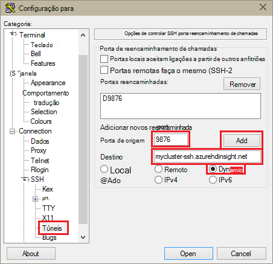

<properties
pageTitle="Utilizar o SSH túnel para aceder ao web Ambari IU, ResourceManager, JobHistory, NameNode, Oozie e do outros web IU"
description="Saiba como utilizar um túnel SSH para procurar em segurança recursos web alojados no seu nós baseado em Linux HDInsight."
services="hdinsight"
documentationCenter=""
authors="Blackmist"
manager="jhubbard"
editor="cgronlun"/>

<tags
ms.service="hdinsight"
ms.devlang="na"
ms.topic="article"
ms.tgt_pltfrm="na"
ms.workload="big-data"
ms.date="10/17/2016"
ms.author="larryfr"/>

# Utilizar o SSH túnel para aceder ao web Ambari IU, JobHistory, NameNode, Oozie e do outros web IU

Baseado em Linux clusters HDInsight fornecem acesso Ambari web IU através da Internet, mas algumas funcionalidades da IU não estão. Por exemplo, da IU da web para outros serviços que forem apresentados através de Ambari. Para obter a funcionalidade completa da web Ambari IU, tem de utilizar um túnel SSH ao cabeçalho cluster.

## O que necessita de um túnel SSH?

Diversas os menus no Ambari irão não totalmente povoar sem um túnel SSH, à medida que dependem de web sites e serviços expostos pela outros serviços de Hadoop em execução no cluster. Muitas vezes, estes web sites não são protegidos, pelo que não está seguro a expô-las diretamente na internet. Por vezes, o serviço executa o web site no outro nó de cluster como um nó Zookeeper.

Seguem-se os serviços que utiliza Ambari web IU, que não podem ser acedidos sem um túnel SSH:

* JobHistory,
* NameNode,
* Pilhas de tópico
* Oozie web IU
* IU do modelo global de HBase e registos

Se utiliza o Script ações para personalizar o seu cluster, quaisquer serviços ou utilitários que instala expõem uma web IU irão necessitar de um túnel SSH. Por exemplo, se instalar matiz utilizar uma ação de Script, tem de utilizar um túnel SSH para aceder à web matiz IU.

## O que é um túnel SSH?

[Shell seguro (SSH) túnel](https://en.wikipedia.org/wiki/Tunneling_protocol#Secure_Shell_tunneling) encaminha o tráfego enviado para uma porta no seu estação de trabalho local, através de uma ligação do SSH ao seu HDInsight cabeça nó cluster, onde o pedido, em seguida, é resolvido como se é originária no nó cabeça. A resposta, em seguida, é encaminhada novamente através do túnel da estação de trabalho.

## Pré-requisitos

Ao utilizar um túnel SSH para o tráfego da web, tem de ter o seguinte procedimento:

* Um cliente SSH. Para as distribuições Linux e Unix ou Macintosh OS X, a `ssh` comando é fornecido com o sistema operativo. Para o Windows, recomendamos que [betumes](http://www.chiark.greenend.org.uk/~sgtatham/putty/download.html)

    > [AZURE.NOTE] Se pretende utilizar um cliente SSH de `ssh` ou betumes, consulte a documentação para o seu cliente sobre como estabelecer um túnel SSH.

* Um browser que pode ser configurado para utilizar um proxy de SOCKS

## Criar um túnel utilizando o comando SSH

Utilize o seguinte comando para criar um SSH túnel utilizando o `ssh` comando. Substituir o __nome de utilizador__ com um utilizador SSH para o seu cluster HDInsight e, substitua o __nome de cluster__ com o nome do seu cluster HDInsight

    ssh -C2qTnNf -D 9876 USERNAME@CLUSTERNAME-ssh.azurehdinsight.net

Esta ação cria uma ligação que encaminha o tráfego para porta local 9876 ao cluster em SSH. As opções são:

* **D 9876** - a porta local que irá encaminhar o tráfego através do túnel.

* **C** - comprimir todos os dados, porque o tráfego da web é principalmente texto.

* **2** - forçar SSH para experimentar o protocolo apenas versão 2.

* **as perguntas** - sossegada, modo.

* **T** - desativar pseudo tty de alocação, uma vez que recomendamos apenas o utilizador reencaminha uma porta.

* **n** - impedir a leitura do STDIN, uma vez que recomendamos apenas o utilizador reencaminha uma porta.

* **N** - não pode executar um comando remoto, uma vez que recomendamos apenas o utilizador reencaminha uma porta.

* **f** - executado em segundo plano.

Se tiver configurado o cluster com uma chave SSH, poderá ter de utilizar o `-i` parâmetro e especifique o caminho para a chave privada de SSH.

Assim que termina o comando, o tráfego enviado à porta 9876 no computador local será encaminhada sobre Secure Sockets Layer (SSL) ao cluster head nó e parecer originar aí.

## Criar um túnel utilizando betumes

Utilize os passos seguintes para criar um túnel SSH utilizando betumes.

1. Abra betumes e introduza as suas informações de ligação. Se não estiver familiarizado com betumes, consulte o artigo [Utilizar SSH com baseado em Linux Hadoop no HDInsight a partir do Windows](hdinsight-hadoop-linux-use-ssh-windows.md) para obter informações sobre como utilizá-la com HDInsight.

2. Na secção de **categoria** à esquerda da caixa de diálogo, expanda a **ligação**, expanda **SSH**e, em seguida, selecione **túneis**.

3. Forneça as seguintes informações no formulário de **Opções de reencaminhamento de portas SSH de controlar** :

    * **Porta de origem** - a porta no cliente que pretende reencaminhar. Por exemplo, **9876**.

    * Endereço de **destino** - o SSH para o cluster baseado em Linux HDInsight. Por exemplo, **mycluster ssh.azurehdinsight.net**.

    * **Dinâmico** - permite dinâmico SOCKS proxy encaminhamento.

    

4. Clique em **Adicionar** para adicionar as definições e, em seguida, clique em **Abrir** para abrir uma ligação de SSH.

5. Quando lhe for pedido, inicie sessão no servidor. Isto irá estabelecer uma sessão SSH e ativar o túnel.

## Utilizar o túnel a partir do browser

> [AZURE.NOTE] Os passos nesta secção utilizam o browser FireFox, tal como está livre disponível para sistemas Linux, Unix, Macintosh OS X e Windows. Outros modernos browsers que suportam a utilizar um proxy de SOCKS irão funcionar bem.

1. Configure o browser para utilizar **localhost:9876** como um proxy de **SOCKS v5** . Eis o aspeto das definições do Firefox. Se utilizou uma porta diferente 9876, altere a porta para daquele que utilizou:

    

    > [AZURE.NOTE] Selecionar **DNS remoto** resolverá pedidos de sistema de nomes de domínio (DNS) utilizando o cluster HDInsight. Se esta é não selecionada, DNS serão localmente resolvido.

2. Certifique-se de que o tráfego está a ser encaminhado através do túnel por vising site, como [http://www.whatismyip.com/](http://www.whatismyip.com/) com as definições de proxy ativado ou desativado no Firefox. Enquanto as definições estão ativadas, o endereço IP será para uma máquina no Centro de dados do Microsoft Azure.

##Certifique-se com Ambari web IU

Assim que tiver sido estabelecido cluster, utilize os seguintes passos para confirmar que consegue aceder a web service IU a partir da Ambari Web:

1. No seu browser, aceda a http://headnodehost:8080. O `headnodehost` endereço será enviada através do túnel ao cluster e ser resolvido para o headnode que Ambari está em execução. Quando lhe for pedido, introduza o nome de utilizador do administrador (admin) e a palavra-passe para o seu cluster. Poderá ser-lhe uma segunda vez por web Ambari IU. Se Sim, introduza novamente a informação.
    
    > [AZURE.NOTE] Ao utilizar o endereço de http://headnodehost:8080 para ligar ao cluster, pode ligar-se diretamente através do túnel para o nó cabeça que Ambari está em execução no através de HTTP e comunicação é protegida utilizando o túnel SSH. Quando ligar através da internet sem a utilização de um túnel, comunicação está protegida utilizando HTTPS. Para ligar através da internet utilizando HTTPS, utilize https://CLUSTERNAME.azurehdinsight.net, onde o __nome de cluster__ é o nome do cluster.

2. IU de Web Ambari, selecione HDFS a partir da lista no lado esquerdo da página.

    

3. Quando as informações do serviço HDFS for apresentadas, selecione __Ligações rápidas__. Será apresentada uma lista de nós de cabeça do cluster. Selecione um de nós cabeça e, em seguida, selecione __NameNode IU__.

    

    > [AZURE.NOTE] Se tiver uma ligação à internet lenta ou o nó cabeça é muito ocupado, poderá receber um indicador de espera em vez de um menu ao clicar em __Ligações rápidas__. Se Sim, aguarde um minuto ou dois para os dados a receber do servidor, em seguida, tente novamente a lista.
    >
    > Se tiver um monitor com resolução inferior ou não estiver maximizada janela do browser, poderão ser cortadas algumas entradas no menu de __Ligações rápidas__ ao lado direito do ecrã. Se Sim, expandir o menu com o rato, em seguida, utilize a tecla de seta para a direita para deslocar o ecrã para a direita para ver o resto do menu.

4. Deverá aparecer uma página semelhante ao seguinte:

    

    > [AZURE.NOTE] Repare que o URL para esta página; deverá ser semelhante a __http://hn1-CLUSTERNAME.randomcharacters.cx.internal.cloudapp.net:8088/cluster__. Está a utilizar o nome de domínio completamente qualificado interna (FQDN) do nó e não está acessível sem utilizar um túnel SSH.

## Próximos passos

Agora que aprendeu como criar e utilizar um túnel SSH, consulte o seguinte para obter informações sobre a monitorização e gerir o seu cluster utilizando Ambari:

* [Gerir HDInsight clusters utilizando Ambari](hdinsight-hadoop-manage-ambari.md)

Para obter mais informações sobre como utilizar SSH com HDInsight, consulte o seguinte:

* [Utilizar SSH com baseado em Linux Hadoop no HDInsight Linux, Unix ou OS X](hdinsight-hadoop-linux-use-ssh-unix.md)

* [Utilizar SSH com baseado em Linux Hadoop no HDInsight a partir do Windows](hdinsight-hadoop-linux-use-ssh-windows.md)
