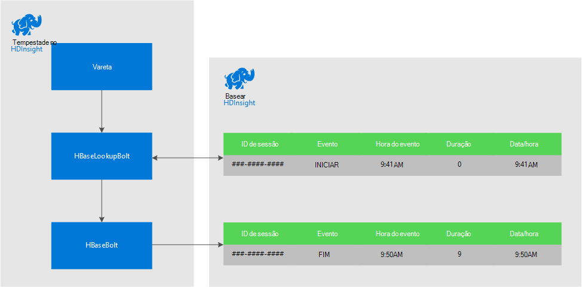
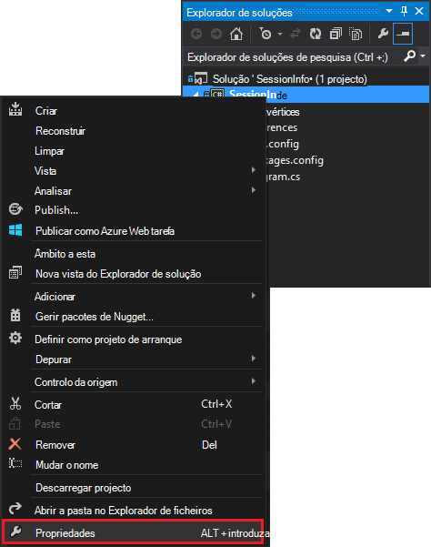
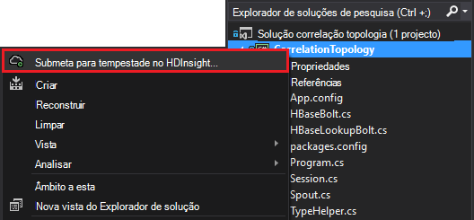

<properties
 pageTitle="Eventos se ligam ao longo do tempo às tempestade e HBase no HDInsight"
 description="Saiba como correlacionar eventos que chegam em alturas diferentes ao utilizar tempestade e HBase no HDInsight."
 services="hdinsight"
 documentationCenter=""
 authors="Blackmist"
 manager="jhubbard"
 editor="cgronlun"
 tags="azure-portal"/>

<tags
 ms.service="hdinsight"
 ms.devlang="dotnet"
 ms.topic="article"
 ms.tgt_pltfrm="na"
 ms.workload="big-data"
 ms.date="10/27/2016"
 ms.author="larryfr"/>

# Eventos se ligam ao longo do tempo às tempestade e HBase no HDInsight

Ao utilizar um arquivo de dados persistente com Apache tempestade, pode correlacionar entradas de dados que recebe em alturas diferentes. Por exemplo, ligar eventos de início de sessão e terminar sessão para uma sessão de utilizador calcular quanto tempo a sessão de duração.

Este documento, vai aprender a criar uma topologia de c# tempestade básica que controla os eventos de início de sessão e terminar sessão para sessões de utilizador e calcula a duração da sessão. A topologia utiliza HBase como um arquivo de dados persistentes. HBase também permite-lhe executar consultas de lote em dados de histórico para produzir informações adicionais, como quantos sessões de utilizador foram iniciados ou terminadas durante um período de tempo específico.

## Pré-requisitos

- Visual Studio e as ferramentas de HDInsight para Visual Studio: consulte o artigo [começar a utilizar as ferramentas de HDInsight para Visual Studio](../HDInsight/hdinsight-hadoop-visual-studio-tools-get-started.md) para informações de instalação.

- Apache tempestade no HDInsight cluster (baseados no Windows). Esta ação executa a topologia de tempestade, processa dados de entrada e armazena HBase.

    > [AZURE.IMPORTANT] Enquanto SCP.NET topologias são suportadas pelo clusters baseado em Linux tempestade criados após 28/10/2016, o SDK HBase para pacote .NET disponível a partir de 28/10/2016 não funciona corretamente na Linux.

- Apache HBase num cluster de HDInsight (Linux ou baseados no Windows). Este é o arquivo de dados para este exemplo.

## Arquitetura

Correlacionar eventos requer um identificador comum para a origem do evento. Por exemplo, um ID de utilizador, ID da sessão ou outro bloco de dados que são um) exclusivo e b) incluído no todos os dados enviados para tempestade. Este exemplo utiliza um valor GUID para representar um ID de sessão.

Este exemplo é constituído por dois HDInsight clusters:

-   HBase: arquivo de dados persistente dados histórico

-   Tempestade: utilizado para ingerir esta última dados de entrada

Os dados são gerados aleatoriamente pela topologia de tempestade e consiste em dos seguintes itens:

-   ID da sessão: um GUID que identifica exclusivamente cada sessão

-   Evento: um início ou fim evento. Neste exemplo, início sempre ocorre antes do fim

-   Hora: a hora do evento.

Estes dados são processados e armazenados no HBase.

### Topologia tempestade

Quando inicia uma sessão, um evento de **início** é recebido pela topologia e tem sessão iniciado HBase. Quando é recebido um evento de **fim** , a topologia obtém o evento de **início** e calcula o tempo entre os dois eventos. Este valor de **duração** , em seguida, é armazenado numa HBase juntamente com as informações de evento de **fim** .

> [AZURE.IMPORTANT] Enquanto esta topologia demonstra o padrão de básico, uma solução de produção seria precisa de tomar estrutura para os cenários seguintes:
>
> - Eventos que chegam fora ordem
> - Duplicar eventos
> - Eventos ignorados

A topologia de exemplo é composta pelos seguintes componentes:

-   Session.CS: simula uma sessão de utilizador através da criação de um ID de sessão aleatório, início tempo e quanto tempo irá durar a sessão

-   Spout.CS: cria 100 sessões, emite um evento de início, aguarda o limite de tempo aleatório para cada sessão e, em seguida, emite um evento de fim. Em seguida, Reciclagens terminou sessões para gerar novos.

-   HBaseLookupBolt.cs: utiliza o ID da sessão para procurar as informações da sessão a partir do HBase. Quando um evento de fim é processado, o evento de início correspondente e calcula a duração da sessão.

-   HBaseBolt.cs: Armazena informações para HBase.

-   TypeHelper.cs: Ajuda a conversão quando a partir de leitura / escrita para HBase.

### Esquema de HBase

No HBase, os dados são armazenados numa tabela com as seguintes definições/esquema:

-   Tecla de linha: a sessão ID é utilizado como chave para as linhas nesta tabela

-   Família de coluna: o nome da família é 'cf'. Colunas armazenadas nesta família são:

    -   evento: início ou fim

    -   tempo: o tempo em milissegundos ocorridos o evento

    -   Duração: o comprimento entre evento de início e de fim

-   VERSÕES: a família 'cf' está definida para reter 5 versões de cada linha

    > [AZURE.NOTE] As versões são um registo das anterior valores armazenados para obter uma chave de linha específico. Por predefinição, HBase apenas devolve o valor para a versão mais recente de uma linha. Neste caso, a mesma linha é utilizada para todos os eventos (início, fim.) cada versão de uma linha está identificado pelo valor de data/hora. Isto fornece uma vista histórica dos eventos registados para um ID específico.

## Transferir o projecto

O projeto de exemplo pode ser transferido das [https://github.com/Azure-Samples/hdinsight-storm-dotnet-event-correlation](https://github.com/Azure-Samples/hdinsight-storm-dotnet-event-correlation).

Esta transferência contém os seguintes projectos c#:

-   CorrelationTopology: Topologia de c# tempestade que aleatoriamente emite eventos de início e de fim para sessões de utilizador. Cada sessão dura entre 1 e 5 minutos.

-   SessionInfo: Consola aplicação c# que cria a tabela HBase e fornece exemplos de consultas para devolver informações sobre os dados armazenados sessão.

## Criar a tabela

1. Abra o projeto **SessionInfo** no Visual Studio.

2. No **Explorador de soluções**, com o botão direito do projecto **SessionInfo** e selecione **Propriedades**.

    

3. Selecione **Definições**e, em seguida, defina os seguintes valores:

    -   HBaseClusterURL: o URL para o seu cluster HBase. Por exemplo, https://myhbasecluster.azurehdinsight.net

    -   HBaseClusterUserName: a administração/HTTP conta de utilizador para o seu cluster

    -   HBaseClusterPassword: a palavra-passe da conta de utilizador de administração/HTTP

    -   HBaseTableName: o nome da tabela para utilizar com este exemplo

    -   HBaseTableColumnFamily: O coluna Nome da família

    

5. Execute a solução. Quando lhe for pedido, selecione a chave de "c" para criar a tabela no seu cluster HBase.

## Criar e implementar a topologia de tempestade

1.  Abra a solução **CorrelationTopology** no Visual Studio.

2.  No **Explorador de soluções**, clique com o botão direito do rato em projeto **CorrelationTopology** e selecione propriedades.

3.  Na janela de propriedades, selecione **Definições** e forneça as seguintes informações. Os primeiros 5 deve ser os mesmos valores utilizados pelo **SessionInfo** project:

    -   HBaseClusterURL: o URL para o seu cluster HBase. Por exemplo, https://myhbasecluster.azurehdinsight.net

    -   HBaseClusterUserName: a administração/HTTP conta de utilizador para o seu cluster

    -   HBaseClusterPassword: a palavra-passe da conta de utilizador de administração/HTTP

    -   HBaseTableName: o nome da tabela para utilizar com este exemplo. Este deve conter o mesmo nome de tabela que utilizados no projeto SessionInfo

    -   HBaseTableColumnFamily: O família nome da coluna. Este deve conter o mesmo nome de coluna família como que utilizados no projeto SessionInfo

    > [AZURE.IMPORTANT] Não são alterados HBaseTableColumnNames, tal como as predefinições são os nomes utilizados pelo **SessionInfo** para obter os dados.

4.  Guardar as propriedades e, em seguida, criar projeto.

5.  No **Explorador de soluções**, clique com o botão direito do rato em projeto e selecione **Submeter para tempestade no HDInsight**. Se lhe for pedido, introduza as credenciais para a sua subscrição Azure.

    

6.  Na caixa de diálogo **Submeter topologia** , selecione o cluster de tempestade que será executada esta topologia.

    > [AZURE.NOTE] A primeira vez que submeter uma topologia, poderá demorar alguns segundos para obter o nome do seu clusters HDInsight.

7.  Assim que a topologia foi carregada e submetida para cluster, a **Vista de topologia tempestade** irá abrir e apresentar a topologia em execução. Selecione o **CorrelationTopology** e utilize o botão Atualizar na parte superior direita da página para atualizar a informação de topologia.

    

    Quando a topologia começa gerar dados, o valor na coluna **emitida** irão incrementar.

    > [AZURE.NOTE] Se a **Vista de topologia tempestade** não abrir automaticamente, utilize os passos seguintes para abri-lo:
    >
    > 1. No **Explorador de soluções**, expanda **Azure**e, em seguida, expanda **HDInsight**.
    >
    > 2. Clique com o botão direito do cluster de tempestade a topologia está em execução no e, em seguida, selecione **Vista tempestade topologias**

## Os dados da consulta

Assim que tem sido emitidos dados, utilize os passos seguintes para consultar os dados.

1. Regressar ao projeto **SessionInfo** . Se não a ser executado, comece uma nova instância do mesmo.

2. Quando lhe for pedido, selecione **s** para procurar o evento de início. Ser-lhe-á pedido para introduzir uma hora de início e de fim para definir um intervalo de tempo - serão devolvidos apenas eventos entre estas duas vezes.

    Utilize o seguinte formato ao introduzir as horas de início e de fim: hh: mm e 'estou' ou 'pm'. Por exemplo, 11:20 pm.

    Uma vez que a topologia de apenas ter começado, utilize um início hora antes de foi implementado e uma hora de fim de agora. Isto deve capturar a maior parte dos eventos iniciar que foram gerados quando iniciado. Quando a consulta é executada, deverá ver uma lista de entradas semelhantes ao seguinte:

        Session e6992b3e-79be-4991-afcf-5cb47dd1c81c started at 6/5/2015 6:10:15 PM. Timestamp = 1433527820737

Procurar eventos de fim funciona da mesma como eventos de início. No entanto, eventos de fim são gerados aleatoriamente entre 1 e 5 minutos após o evento de início. Por isso, poderá ter de experimente alguns intervalos de tempo para encontrar os eventos de fim. Eventos de fim também irão conter a duração da sessão de - a diferença entre a hora de início do evento e a hora de fim do evento. Eis um exemplo de dados para eventos de fim:

    Session fc9fa8e6-6892-4073-93b3-a587040d892e lasted 2 minutes, and ended at 6/5/2015 6:12:15 PM

> [AZURE.NOTE] Enquanto os valores de tempo que introduzir encontram-se na hora local, a hora devolvida pela consulta serão UTC.

##Parar a topologia

Quando estiver pronto para parar a topologia, regresse ao projeto **CorrelationTopology** no Visual Studio. Na **Vista de topologia tempestade**, selecione a topologia de e, em seguida, utilize o botão **Eliminar** na parte superior da vista de topologia.

##Eliminar o seu cluster

[AZURE.INCLUDE [delete-cluster-warning](../../includes/hdinsight-delete-cluster-warning.md)]

##Próximos passos

Para obter mais exemplos de tempestade, consulte o artigo [topologias de exemplo para tempestade no HDInsight](hdinsight-storm-example-topology.md).
 
