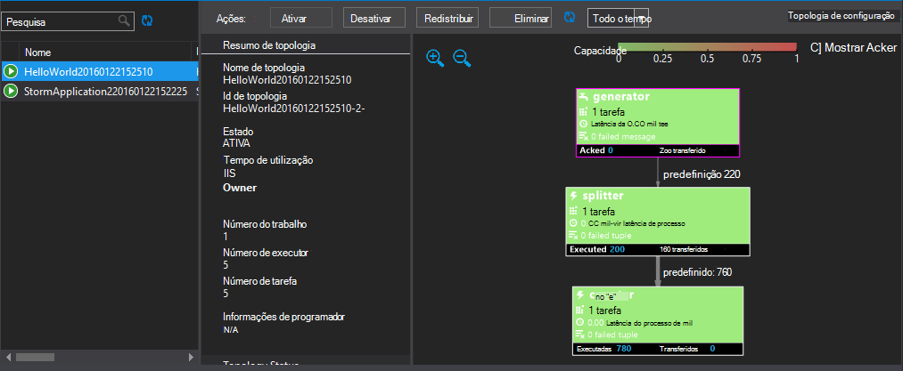

<properties
   pageTitle="Implementar e gerir topologias Apache tempestade no HDInsight | Microsoft Azure"
   description="Saiba como implementar, monitorizar e gerir topologias Apache tempestade com o Dashboard de tempestade no HDInsight. Utilize ferramentas de Hadoop para Visual Studio."
   services="hdinsight"
   documentationCenter=""
   authors="Blackmist"
   manager="jhubbard"
   editor="cgronlun"
    tags="azure-portal"/>

<tags
   ms.service="hdinsight"
   ms.devlang="java"
   ms.topic="article"
   ms.tgt_pltfrm="na"
   ms.workload="big-data"
   ms.date="10/11/2016"
   ms.author="larryfr"/>

#Implementar e gerir topologias Apache tempestade no HDInsight baseados no Windows

O Dashboard tempestade permite-lhe facilmente implementar e executar topologias Apache tempestade ao seu cluster HDInsight utilizando o seu browser. Também pode utilizar o dashboard para monitorizar e gerir topologias em execução. Se utilizar o Visual Studio, as ferramentas de HDInsight para Visual Studio fornecem funcionalidades semelhantes no Visual Studio.

O Dashboard tempestade e as funcionalidades de tempestade nas ferramentas de HDInsight dependem soluções de tempestade REST API, que podem ser utilizados para criar o seu próprio monitorização e gestão.

> [AZURE.IMPORTANT] Os passos neste documento requerem uma tempestade baseados no Windows num cluster de HDInsight. Para obter informações sobre como utilizar um cluster baseado em Linux, consulte o artigo [Implementar e gerir topologias Apache tempestade no baseado em Linux HDInsight](hdinsight-storm-deploy-monitor-topology-linux.md)

##Pré-requisitos

* **Apache tempestade no HDInsight** - consulte o artigo <a href="../hdinsight-storm-getting-started/" target="_blank">Introdução ao Apache tempestade no HDInsight</a> para obter passos sobre como criar um cluster de

* Para o **Dashboard tempestade**: um browser moderna que suporta em HTML5

* Para **Visual Studio** - Azure SDK 2.5.1 ou mais recente e as ferramentas de HDInsight para Visual Studio. Consulte o artigo <a href="../hdinsight-hadoop-visual-studio-tools-get-started/" target="_blank">começar a utilizar o HDInsight ferramentas para o Visual Studio</a> para instalar e configurar as ferramentas de HDInsight para Visual Studio.

    Um dos seguintes versões do Visual Studio:

    * Visual Studio 2012, com <a href="http://www.microsoft.com/download/details.aspx?id=39305" target="_blank">4 de actualização</a>

    * Visual Studio 2013 com <a href="http://www.microsoft.com/download/details.aspx?id=44921" target="_blank">Atualizar 4</a> ou <a href="http://go.microsoft.com/fwlink/?LinkId=517284" target="_blank">Visual Studio 2013 Comunidade</a>

    * <a href="http://visualstudio.com/downloads/visual-studio-2015-ctp-vs" target="_blank">CTP6 de 2015 do Visual Studio</a>

    > [AZURE.NOTE] As ferramentas de HDInsight para Visual Studio apenas atualmente, tempestade na versão de cluster HDInsight 3,2.

##Dashboard de tempestade

O Dashboard tempestade é uma página web disponível no seu cluster tempestade. O URL é **https://&lt;nome de cluster >.azurehdinsight.net/**, onde o **nome de cluster** é o nome do seu tempestade num cluster de HDInsight.

Na parte superior do Dashboard de tempestade, selecione **Submeter topologia**. Siga as instruções na página para executar uma topologia de exemplo ou para carregar e executar uma topologia que criou.

![a página de topologia submeter][storm-dashboard-submit]

###Tempestade IU

A partir do Dashboard de tempestade, selecione a ligação de **IU tempestade** . Isto vai mostrar informações sobre o cluster, para além de qualquer topologias em execução.

![IU de tempestade][storm-dashboard-ui]

> [AZURE.NOTE] Em algumas versões do Internet Explorer, poderá descobrir que a IU tempestade não atualizadas após pela primeira vez visitou-lo. Por exemplo,-poderá não apresentar as novas topologias que utilizou ao submeter, ou pode mostrar uma topologia como ativo quando desativado anteriormente. A Microsoft está em mente este problema e está a trabalhar numa solução.

####Página principal

Página principal da IU tempestade fornece as seguintes informações:

* **Cluster de resumo**: informações básicas sobre o cluster tempestade.

* **Topologia de resumo**: uma lista de executar o topologias. Utilize as ligações nesta secção para ver mais informações sobre topologias específicas.

* **Autoridade resumo**: informações sobre a autoridade tempestade.

* **Configuração de nimbus**: configuração Nimbus para o cluster.

####Topologia de resumo

Selecionar uma ligação da secção **topologia de resumo** apresenta as seguintes informações sobre a topologia de:

* **Topologia de resumo**: informações básicas sobre a topologia.

* **Ações de topologia**: ações de gestão que pode efetuar para a topologia.

    * **Ativar**: processamento de currículos de uma topologia desativado.

    * **Desativar**: interrompe uma topologia em execução.

    * **Redistribuir**: ajusta paralelismo da topologia. Deverá redistribuir topologias em execução depois de ter mudado o número de nós no cluster. Esta opção permite-a topologia de modo a ajustar paralelismo para o Adquirente na íntegra para o número maior ou diminuído de nós no cluster.

        Para mais informações, consulte o artigo <a href="http://storm.apache.org/documentation/Understanding-the-parallelism-of-a-Storm-topology.html" target="_blank">Compreender paralelismo de uma topologia de tempestade</a>.

    * **Eliminar**: termina uma topologia de tempestade após o limite de tempo especificado.

* **Estatísticas de topologia**: estatísticas sobre a topologia. Utilize as ligações na coluna da **janela** para definir o período de tempo para as entradas restantes na página.

* **Spouts**: spouts utilizados da topologia. Utilize as ligações nesta secção para ver mais informações sobre spouts específicos.

* **Bolts**: parafusos utilizados da topologia. Utilize as ligações nesta secção para ver mais informações sobre parafusos específicos.

* **Topologia de configuração**: A configuração da topologia de selecionado.

####Vareta e resumo de raio

Selecionar uma vareta das secções **Spouts** ou **Bolts** apresenta as seguintes informações sobre o item selecionado:

* **Componente de resumo**: informações básicas sobre a vareta ou raio.

* **Estatística vareta/raio**: estatísticas sobre vareta ou raio. Utilize as ligações na coluna da **janela** para definir o período de tempo para as entradas restantes na página.

* **Estatísticas de entrada** (parafuso apenas): informações sobre as sequências de entrada média consumida pelo raio.

* **Estatísticas de saída**: informações sobre as sequências emitida pelo presente spout ou parafuso.

* **Testamenteiros**: informações sobre as instâncias da vareta ou raio. Selecione a entrada de **porta** para um executor visualizar um registo de informações de diagnóstico produzidas para esta instância específica.

* **Erros**: quaisquer informações de erro para este spout ou parafuso.

##HDInsight ferramentas para o Visual Studio

As ferramentas de HDInsight pode ser utilizadas para submeter topologias c# ou híbrido para o seu cluster tempestade. Os passos seguintes utilizam uma aplicação de exemplo. Para obter informações sobre como criar o seus próprio topologias utilizando as ferramentas do HDInsight, consulte o artigo [desenvolver c# topologias utilizando as ferramentas de HDInsight para Visual Studio](hdinsight-storm-develop-csharp-visual-studio-topology.md).

Utilize os passos seguintes para implementar uma amostra para sua tempestade num cluster de HDInsight, em seguida, ver e gerir a topologia.

1. Se já não tiver instalado a versão mais recente das ferramentas de HDInsight para Visual Studio, consulte o artigo <a href="../hdinsight-hadoop-visual-studio-tools-get-started/" target="_blank">começar a utilizar o HDInsight ferramentas para o Visual Studio</a>.

2. Abrir o Visual Studio, selecione o **ficheiro** > **Novo** > **projeto**.

3. Na caixa de diálogo **Novo projeto** , expanda **instalados** > **modelos**e, em seguida, selecione **HDInsight**. A partir da lista de modelos, selecione **Tempestade de exemplo**. Na parte inferior da caixa de diálogo, escreva um nome para a aplicação.

    

1. No **Explorador de soluções**, com o botão direito do projeto e selecione **Submeter para tempestade no HDInsight**.

    > [AZURE.NOTE] Se lhe for pedido, introduza as credenciais de início de sessão para a sua subscrição Azure. Se tiver mais do que uma subscrição, inicie sessão na que contém o seu tempestade num cluster de HDInsight.

2. Selecione o tempestade num cluster de HDInsight a partir da lista pendente de **Cluster tempestade** e, em seguida, selecione **Submeter**. Pode monitorizar se a apresentação é efetuada com êxito ao utilizar a janela de **saída** .

3. Quando a topologia foi submetida com êxito, deverá aparecer a **Tempestade topologias** para o cluster. Selecione a topologia da lista para ver informações sobre a topologia em execução.

    

    > [AZURE.NOTE] Também pode ver **Tempestade topologias** a partir do **Explorador de servidor** expandindo **Azure** > **HDInsight**e, em seguida, clicando uma tempestade num cluster de HDInsight e selecionar a **Vista tempestade topologias**.

    Selecione a forma para a spouts ou parafusos para ver informações sobre estes componentes. Para cada item selecionado, será aberta uma nova janela.
    
    > [AZURE.NOTE] O nome da topologia de é o nome de classe da topologia de (neste caso, `HelloWord`,) com um carimbo de data/hora acrescentado.

4. A partir da vista de **Resumo de topologia** , selecione **Eliminar** para parar a topologia.

    > [AZURE.NOTE] Topologias tempestade continuar a executar o até que estes estão parados ou cluster é eliminado.

##REST API

IU de tempestade baseia-se na parte superior de REST API, para que possa efectuar semelhantes monitorização e gestão funcionalidade ao utilizar a API REST. Pode utilizar a API REST para criar ferramentas personalizadas para gerir e monitorizar topologias tempestade.

Para mais informações, consulte o artigo [Tempestade IU REST API](https://github.com/apache/storm/blob/0.9.3-branch/STORM-UI-REST-API.md). As seguintes informações são específicas a utilizar a API REST com Apache tempestade no HDInsight.

###Base de URI

O URI base para a API REST em HDInsight clusters é **https://&lt;nome de cluster >.azurehdinsight.net/stormui/api/v1/**, onde o **nome de cluster** é o nome do seu tempestade num cluster de HDInsight.

###Autenticação

Pedidos à REST API tem de utilizar **a autenticação básica**, para utilizar o nome de administrador do HDInsight cluster e a palavra-passe.

> [AZURE.NOTE] Porque é enviada autenticação básica utilizando texto simples, deve utilizar **sempre** HTTPS para proteger as comunicações com o cluster.

###Devolver valores

As informações que são devolvidas a partir da API REST apenas podem ser utilizáveis a partir do cluster ou máquinas virtuais da mesma rede Virtual Azure como cluster. Por exemplo, o nome de domínio completamente qualificado (FQDN) devolvido para servidores Zookeeper não estar acessível a partir da Internet.

##Próximos passos

Agora que aprendeu como implementar e monitorizar topologias através do Dashboard tempestade, saiba como:

* [Desenvolver c# topologias utilizando as ferramentas de HDInsight para Visual Studio](hdinsight-storm-develop-csharp-visual-studio-topology.md)

* [Desenvolver topologias com base em Java utilizando Maven](hdinsight-storm-develop-java-topology.md)

Para obter uma lista das topologias de exemplo mais, consulte o artigo [topologias de exemplo para tempestade no HDInsight](hdinsight-storm-example-topology.md).

[hdinsight-dashboard]: ./media/hdinsight-storm-deploy-monitor-topology/dashboard-link.png
[storm-dashboard-submit]: ./media/hdinsight-storm-deploy-monitor-topology/submit.png
[storm-dashboard-ui]: ./media/hdinsight-storm-deploy-monitor-topology/storm-ui-summary.png
