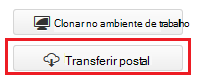
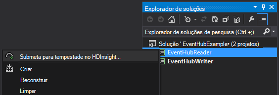
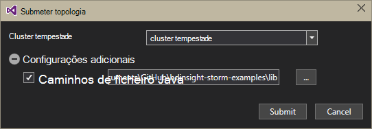
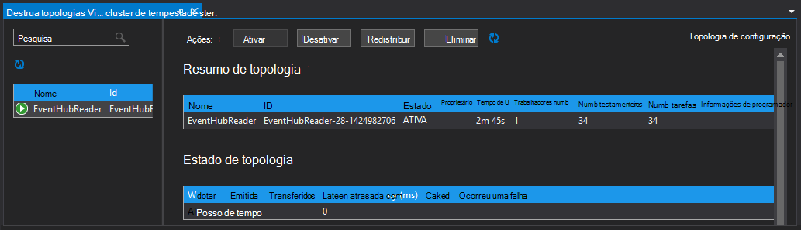

<properties
   pageTitle="Processar eventos de evento concentradores com tempestade no HDInsight | Microsoft Azure"
   description="Saiba como a processar dados concentradores evento com uma topologia de c# tempestade criada no Visual Studio utilizando as ferramentas de HDInsight para Visual Studio."
   services="hdinsight,notification hubs"
   documentationCenter=""
   authors="Blackmist"
   manager="jhubbard"
   editor="cgronlun"/>

<tags
   ms.service="hdinsight"
   ms.devlang="dotnet"
   ms.topic="article"
   ms.tgt_pltfrm="na"
   ms.workload="big-data"
   ms.date="10/27/2016"
   ms.author="larryfr"/>

# Eventos de processo a partir do Azure evento concentradores com tempestade no HDInsight (c#)

Azure evento concentradores permite-lhe processar grandes quantidades de dados a partir de Web sites, aplicações e dispositivos. A evento concentradores vareta torna fáceis de utilizar Apache tempestade no HDInsight para analisar estes dados em tempo real. Também pode escrever dados para evento concentradores a partir do tempestade utilizando o raio concentradores do evento.

Neste tutorial vai aprender a utilizar os modelos do Visual Studio instalados com as ferramentas HDInsight para Visual Studio para criar duas topologias que funcionam com o Azure evento concentradores.

* **EventHubWriter**: aleatoriamente gera dados e escreve-a concentradores de evento

* **EventHubReader**: lê dados a partir do evento concentradores e regista os dados para os registos de tempestade

> [AZURE.NOTE] Enquanto os passos neste documento dependem de um ambiente de desenvolvimento do Windows com o Visual Studio, o projecto compilado pode ser apresentado ao cluster de um Linux ou HDInsight baseados no Windows. Apenas os clusters baseado em Linux criados depois do suporte de 28/10/2016 SCP.NET topologias.
>
> Para utilizar uma topologia de c# com um cluster baseado em Linux, tem de atualizar o pacote de Microsoft.SCP.Net.SDK NuGet utilizado pelo seu projeto para a versão 0.10.0.6 ou superior. A versão do pacote também tem de corresponder a versão principal de tempestade instalado no HDInsight. Por exemplo, tempestade em versões HDInsight 3.3 e 3.4 utilizar a versão de tempestade 0.10.x, enquanto HDInsight 3.5 utiliza tempestade 1.0.x.
> 
> C# topologias em baseado em Linux clusters tem de utilizar .NET 4,5 e utilizar Mono para executar no HDInsight cluster. A maioria dos elementos irá funcionar, no entanto deve verificar o documento de [Compatibilidade de Mono](http://www.mono-project.com/docs/about-mono/compatibility/) para identificar possíveis incompatibilidades.
>
> Para obter uma versão Java este projeto, que também funcionam num cluster com base em Linux ou baseados no Windows, consulte o artigo [eventos de processo a partir do Azure evento concentradores com tempestade no HDInsight (Java)](hdinsight-storm-develop-java-event-hub-topology.md).

## Pré-requisitos

* Um [Apache tempestade num cluster de HDInsight](hdinsight-apache-storm-tutorial-get-started.md)

* Um [concentrador de evento Azure](../event-hubs/event-hubs-csharp-ephcs-getstarted.md)

* O [Azure .NET SDK](http://azure.microsoft.com/downloads/)

* As [Ferramentas de HDInsight para Visual Studio](hdinsight-hadoop-visual-studio-tools-get-started.md)

## Projecto concluído

Pode transferir uma versão completa do projeto criada neste tutorial de GitHub: [eventhub-tempestade-híbrido](https://github.com/Azure-Samples/hdinsight-dotnet-java-storm-eventhub). No entanto, ainda tem de fornecer as definições de configuração ao seguir os passos neste tutorial.

## Vareta do evento concentradores e raio

Os controladores de evento spout e bolt são componentes de Java que permitem-lhe trabalhar facilmente com concentradores evento a partir do Apache tempestade. Apesar destes componentes são escritos em Java, as ferramentas de HDInsight para Visual Studio lhe permite criar topologias híbrido que misturar c# e Java componentes.

Os vareta e raio são distribuídos como um ficheiro de arquivo (.jar) Java única denominado **eventhubs-storm-spout-#.#-jar-with-dependencies.jar**, onde #. # é a versão do ficheiro.

### Transferir o ficheiro .jar.

A versão mais recente do ficheiro para caixa é incluída no projeto [HDInsight tempestade exemplos](https://github.com/hdinsight/hdinsight-storm-examples) na pasta de **biblioteca/eventhubs** . Para transferir o ficheiro, utilize um dos seguintes métodos.

> [AZURE.NOTE] A vareta e raio foram submetidas para inclusão no projeto Apache tempestade. Para obter mais informações, consulte o artigo [TEMPESTADE 583: inicial dar entrada para concentradores tempestade evento](https://github.com/apache/storm/pull/336/files) no GitHub.

* **Transferir um ficheiro ZIP**: a partir do site de [exemplos de tempestade HDInsight](https://github.com/hdinsight/hdinsight-storm-examples) , selecione **Transferir ZIP** no painel da direita para transferir um ficheiro. zip que contém o projeto.

    

    Depois do ficheiro é transferido, pode extrair o arquivo e o ficheiro será no diretório de **biblioteca** .

* **Clonar o projeto**: Se tiver [Git](http://git-scm.com/) instalado, utilize o seguinte comando para clonar do repositório localmente, em seguida, localize o ficheiro no diretório de **biblioteca** .

        git clone https://github.com/hdinsight/hdinsight-storm-examples

## Configurar concentradores de evento

Evento concentradores é a origem de dados para este exemplo. Utilize as informações na secção __criar um concentrador de eventos__ do documento [Introdução ao evento concentradores](../event-hubs/event-hubs-csharp-ephcs-getstarted.md) .

3. Depois de ter sido criado centro do evento, ver o pá EventHub no Portal do Azure e selecione __partilhado acesso políticas__. Utilize a entrada __+ Adicionar__ para adicionar as seguintes políticas:

  	| Nome | Permissões |
  	| ----- | ----- |
  	| sénior | Enviar |
  	| leitor | Ouvir |

    

5. Selecione as políticas de __leitor__ e __sénior__ . Copiar e guarde o valor de __Chave primária__ para ambas as políticas, como estes serão utilizados mais tarde.

## Configurar o EventHubWriter

1. Se já não tiver instalado a versão mais recente das ferramentas de HDInsight para Visual Studio, consulte o artigo [começar a utilizar o HDInsight ferramentas para o Visual Studio](hdinsight-hadoop-visual-studio-tools-get-started.md).

2. Transferir a solução do [híbrida do tempestade eventhub](https://github.com/Azure-Samples/hdinsight-dotnet-java-storm-eventhub). Abra a solução e demorar alguns minutos para percorrer o código do projeto __EventHubWriter__ .

4. No __EventHubWriter__ project, abra o ficheiro __App__ . Utilize as informações a partir do Hub evento que configurou anteriormente para preencher o valor para as teclas seguintes:

  	| Chave | Valor |
  	| ----- | ----- |
  	| EventHubPolicyName | sénior (se utilizou um nome diferente para a política com permissão para _Enviar_ , utilizá-la.) |
  	| EventHubPolicyKey | A chave para a política de sénior |
  	| EventHubNamespace | O espaço de nomes que contém o seu centro de evento |
  	| EventHubName | O nome do concentrador de evento |
  	| EventHubPartitionCount | O número de partições no seu centro de evento |

4. Guarde e feche o ficheiro **App** .

## Configurar o EventHubReader

1. Abra o projeto __EventHubReader__ e siga alguns momoents para percorrer o código.

2. Abra a __App__ para o __EventHubWriter__. Utilize as informações a partir do Hub evento que configurou anteriormente para preencher o valor para as teclas seguintes:

  	| Chave | Valor |
  	| ----- | ----- |
  	| EventHubPolicyName | leitor (se utilizou um nome diferente para a política com permissão para _ouvir_ , utilizá-la.) |
  	| EventHubPolicyKey | A chave para a política de leitor |
  	| EventHubNamespace | O espaço de nomes que contém o seu centro de evento |
  	| EventHubName | O nome do concentrador de evento |
  	| EventHubPartitionCount | O número de partições no seu centro de evento |

3. Guarde e feche o ficheiro **App** .

## Implementar as topologias

1. A partir do **Explorador de soluções**, com o botão direito do projecto **EventHubReader** e selecione **Submeter para tempestade no HDInsight**.

    

2. No ecrã **Topologia submeter** , selecione o seu **Cluster tempestade**. Expanda **Configurações adicionais**, selecione **Java caminhos de ficheiro**, selecione **…** e selecione a pasta que contém o ficheiro **eventhubs-storm-spout-0.9-jar-with-dependencies.jar** que tenha transferido anteriormente. Por fim, clique em **Submeter**.

    

3. Quando foi submetida, a topologia, o **Visualizador de topologias tempestade** é apresentada. Selecione a topologia de **EventHubReader** no painel da esquerda para ver as estatísticas para a topologia. Atualmente, nada deve estar a ter uma vez que não existem eventos foram escritos evento concentradores ainda.

    

4. A partir do **Explorador de soluções**, com o botão direito do projecto **EventHubWriter** e selecione **Submeter para tempestade no HDInsight**.

2. No ecrã **Topologia submeter** , selecione o seu **Cluster tempestade**. Expanda **Configurações adicionais**, selecione **Java caminhos de ficheiro**, selecione **…** e selecione a pasta que contém o ficheiro **eventhubs-storm-spout-0.9-jar-with-dependencies.jar** que tenha transferido anteriormente. Por fim, clique em **Submeter**.

5. Quando foi submetida, a topologia, atualize a lista de topologia no **Visualizador de topologias tempestade** para verificar se ambas topologias estão a ser executado no cluster.

6. No **Visualizador de topologias tempestade**, selecione a topologia de **EventHubReader** .

4. Na vista de gráfico, faça duplo clique sobre o componente de __LogBolt__ . Isto irá abra a página de __Resumo do componente__ para o raio.

3. Na secção __testamenteiros__ , selecione uma das ligações na coluna __porta__ . Isto vai mostrar informações registadas pelo componente. As informações com sessão iniciada são semelhantes ao seguinte:

        2016-10-20 13:26:44.186 m.s.s.b.ScpNetBolt [INFO] Processing tuple: source: com.microsoft.eventhubs.spout.EventHubSpout:7, stream: default, id: {5769732396213255808=520853934697489134}, [{"deviceId":3,"deviceValue":1379915540}]
        2016-10-20 13:26:44.234 m.s.s.b.ScpNetBolt [INFO] Processing tuple: source: com.microsoft.eventhubs.spout.EventHubSpout:7, stream: default, id: {7154038361491319965=4543766486572976404}, [{"deviceId":3,"deviceValue":459399321}]
        2016-10-20 13:26:44.335 m.s.s.b.ScpNetBolt [INFO] Processing tuple: source: com.microsoft.eventhubs.spout.EventHubSpout:6, stream: default, id: {513308780877039680=-7571211415704099042}, [{"deviceId":5,"deviceValue":845561159}]
        2016-10-20 13:26:44.445 m.s.s.b.ScpNetBolt [INFO] Processing tuple: source: com.microsoft.eventhubs.spout.EventHubSpout:7, stream: default, id: {-2409895457033895206=5479027861202203517}, [{"deviceId":8,"deviceValue":2105860655}]

## Parar as topologias

Para parar as topologias, selecione cada topologia no **Visualizador de topologia tempestade**, em seguida, clique em **Eliminar**.

## Eliminar o seu cluster

[AZURE.INCLUDE [delete-cluster-warning](../../includes/hdinsight-delete-cluster-warning.md)]

## Notas

### Pontos de verificação

O EventHubSpout periodicamente pontos de verificação do seu estado para o nó Zookeeper, que guarda o desfasamento actual para mensagens lerem fila de espera. Esta opção permite-o componente começar a receber mensagens no deslocamento guardada nos cenários seguintes:

* A instância de componente falha e é reiniciado.

* Aumentar ou diminuir o cluster adicionando ou removendo nós.

* A topologia foi cancelada e reiniciado **com o mesmo nome**.

Também pode exportar e importar os pontos de verificação persistentes para WASB (o armazenamento de Azure utilizado pelo seu cluster HDInsight.) Os scripts para fazer isto estão localizados no tempestade num cluster de HDInsight, na **c:\apps\dist\storm-0.9.3.2.2.1.0-2340\zkdatatool-1.0\bin**.

>[AZURE.NOTE] O número da versão no caminho pode ser diferente, tal como a versão do tempestade instalado no cluster pode mudar no futuro.

Os scripts neste directório são:

* **stormmeta_import.cmd**: importar todos os metadados tempestade do contentor de armazenamento do cluster predefinido para Zookeeper.

* **stormmeta_export.cmd**: Exportar todos os metadados tempestade do Zookeeper para o contentor de armazenamento do cluster predefinido.

* **stormmeta_delete.cmd**: eliminar todos os metadados tempestade de Zookeeper.

Exportar que uma importação permite-lhe persistirem dados de ponto de verificação quando precisar de eliminar o cluster, mas pretende continuar a processamento a partir do desfasamento actual no centro do quando colocar um novo cluster novamente online.

> [AZURE.NOTE] Uma vez que os dados são mantidos o contentor de armazenamento predefinido, o novo cluster **tem** de utilizar a mesma conta de armazenamento e o contentor como cluster anterior.

## Próximos passos

Neste documento, aprendeu como utilizar o Java evento concentradores Spout e raio a partir de uma topologia de c# para trabalhar com dados no Centro de evento Azure. Para saber mais sobre a criação de c# topologias, consulte o seguinte.

* [Desenvolver c# topologias para Apache tempestade no HDInsight utilizando o Visual Studio](hdinsight-storm-develop-csharp-visual-studio-topology.md)

* [Guia de programação SCP](hdinsight-storm-scp-programming-guide.md)

* [Topologias de exemplo para tempestade no HDInsight](hdinsight-storm-example-topology.md)
 
