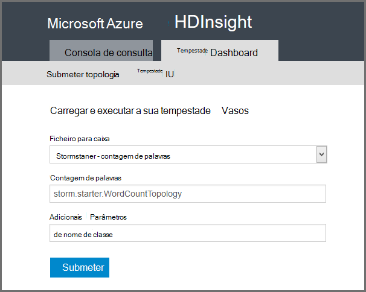

<properties
    pageTitle="Introdução ao Apache tempestade no HDInsight | Microsoft Azure"
    description="Obter uma introdução à Apache tempestade e saiba como pode utilizar tempestade no HDInsight para criar soluções de análise de dados em tempo real na nuvem."
    services="hdinsight"
    documentationCenter=""
    authors="Blackmist"
    manager="jhubbard"
    editor="cgronlun"
    tags="azure-portal"/>

<tags
   ms.service="hdinsight"
   ms.devlang="na"
   ms.topic="get-started-article"
   ms.tgt_pltfrm="na"
   ms.workload="big-data"
   ms.date="10/11/2016"
   ms.author="larryfr"/>

#Introdução ao Apache tempestade no HDInsight: análise de tempo real de Hadoop

Apache tempestade no HDInsight permite-lhe criar soluções de análise distribuído e em tempo real no ambiente do Azure utilizando [Apache Hadoop](http://hadoop.apache.org).

##O que é Apache tempestade?

Apache tempestade é um sistema de cálculo distribuído, tolerância a falhas, abrir origem que permite-lhe processar dados em tempo real com Hadoop. Soluções de tempestade também podem fornecer garantido processamento de dados, com a capacidade de reproduzir os dados com êxito não foram processados pela primeira vez.

##Porquê utilizar tempestade no HDInsight?

Apache tempestade no HDInsight é um cluster gerido integrado no ambiente Azure. Fornece os seguintes benefícios chaves:

* Executa como um serviço gerido com um SLA de 99,9% o tempo

* Utilizar o idioma da sua escolha: fornece suporte para componentes de tempestade escritos em **Java**, **c#**e **Python**

    * Suporta uma mistura de linguagens de programação: ler dados utilizando Java, em seguida, processá-lo utilizando C#
    
        > [AZURE.NOTE] C# topologias só são suportadas em clusters HDInsight baseados no Windows.

    * Utilizar a interface de Java **Trident** para criar topologias tempestade que suportam "exatamente uma vez" processamento de mensagens, persistente de arquivo de dados "transaccionais" e um conjunto de operações de análise da cadeia comuns

* Inclui funcionalidades incorporadas de escala de cima e para baixo escala: dimensionar um cluster de HDInsight com sem impacto para executar o topologias tempestade

* Integrar com outros serviços do Azure, incluindo concentrador de evento, rede Virtual Azure, base de dados SQL, armazenamento de BLOBs e DocumentDB

    * Combinar as capacidades de vários HDInsight clusters utilizando rede Virtual Azure: criar tubagens analíticas que utilizam clusters HDInsight, HBase ou Hadoop

Para obter uma lista de empresas que estiver a utilizar o Apache tempestade para as respetivas soluções de análise em tempo real, consulte o artigo [Empresas utilizando Apache tempestade](https://storm.apache.org/documentation/Powered-By.html).

Para começar a utilizar tempestade, consulte o artigo [Introdução ao tempestade no HDInsight][gettingstarted].

###Facilidade de aprovisionamento

Pode aprovisionar um novo tempestade num cluster de HDInsight em minutos. Especifique o nome do cluster, tamanho, conta de administrador e a conta de armazenamento. Azure irá criar cluster, incluindo um dashboard de gestão de web e topologias de exemplo.

> [AZURE.NOTE] Também pode aprovisionar o clusters tempestade utilizando o [Clip do Azure](../xplat-cli-install.md) ou [Azure PowerShell](../powershell-install-configure.md).

Dentro de 15 minutos de submeter o pedido, terá de um novo cluster de tempestade em execução e está preparado para o primeiro gasoduto de análise em tempo real.

###Facilidade de utilização

__Baseado em para Linux tempestade sobre clusters de HDInsight__, pode ligar ao cluster utilizando SSH e a utilização de `storm` comando para iniciar e gerir topologias. Para além disso, pode utilizar Ambari para monitorizar o serviço de tempestade e IU tempestade para monitorizar e gerir topologias em execução.

Para mais informações sobre como trabalhar com clusters baseado em Linux tempestade, consulte o artigo [Introdução ao Apache tempestade no baseado em Linux HDInsight](hdinsight-apache-storm-tutorial-get-started-linux.md).

__Baseado no Windows para tempestade sobre clusters de HDInsight__, as ferramentas de HDInsight para Visual Studio permitem-lhe criar c# e híbrido c# / topologias Java e, em seguida, submetê-los ao seu tempestade num cluster de HDInsight.  

Ferramentas de HDInsight para Visual Studio também disponibiliza uma interface que permite-lhe monitorizar e gerir topologias tempestade num cluster.

Para obter um exemplo de utilização de ferramentas do HDInsight para criar uma aplicação de tempestade, consulte o artigo [desenvolver c# tempestade topologias com as ferramentas de HDInsight para Visual Studio](hdinsight-storm-develop-csharp-visual-studio-topology.md).

Para mais informações sobre as ferramentas de HDInsight para Visual Studio, consulte o artigo [começar a utilizar as ferramentas de HDInsight para Visual Studio](../HDInsight/hdinsight-hadoop-visual-studio-tools-get-started.md).

Cada tempestade num cluster de HDInsight também fornece um Dashboard tempestade baseada na web, que permite-lhe submeter, monitorizar e gerir topologias tempestade executadas no cluster.

Para obter mais informações sobre como utilizar o Dashboard tempestade, consulte o artigo [Implementar e gerir topologias Apache tempestade no HDInsight](hdinsight-storm-deploy-monitor-topology.md).

Tempestade no HDInsight também fornece fácil integração com o Azure evento concentradores através de **Evento concentrador Spout**. A versão mais recente deste componente está disponível na [https://github.com/hdinsight/hdinsight-storm-examples/tree/master/lib/eventhubs](https://github.com/hdinsight/hdinsight-storm-examples/tree/master/lib/eventhubs). Para obter mais informações sobre como utilizar este componente, consulte os seguintes documentos.

* [Desenvolver uma topologia de c# que utiliza o Azure evento concentradores](hdinsight-storm-develop-csharp-event-hub-topology.md)

* [Desenvolver uma topologia de Java que utiliza o Azure evento concentradores](hdinsight-storm-develop-java-event-hub-topology.md)

###Fiabilidade

Apache tempestade sempre garante que cada mensagem de entrada será completamente processada, mesmo quando a análise de dados for distribuída sobre centenas de nós.

O **nó Nimbus** fornece uma funcionalidade semelhante para o Hadoop JobTracker e atribui tarefas aos outros nós cluster através de **Zookeeper**. Nós zookeeper fornecem coordená-lo para o cluster e facilitar a comunicação entre Nimbus e o processo de **autoridade** em nós de trabalho. Se um nó de processamento vai para baixo, o nó Nimbus é informado e atribui a tarefa e dados associados para outro nó.

A configuração predefinida para Apache tempestade é ter apenas uma Nimbus nó. Tempestade no HDInsight é executado dois nós Nimbus. Se o nó primário falhar, HDInsight cluster irá mudar para o nó secundário, enquanto o nó primário é recuperado.

###Escala

Embora possa especificar o número de nós no seu cluster durante a criação, poderá querer aumente ou diminua o cluster para corresponder a carga de trabalho. Todos os HDInsight clusters permitem-lhe alterar o número de nós nos cluster, mesmo durante o processamento de dados.

> [AZURE.NOTE] Tirar partido dos novos nós adicionadas através da opção de dimensionamento, terá de redistribuir topologias iniciadas antes do tamanho de cluster foi aumentado.

###Suporte

Tempestade no HDInsight vem com suporte de 24/7 completa ao nível da empresa. Tempestade no HDInsight tem também um SLA de 99,9%. Isto significa que podemos garantir que o cluster terá conectividade externa, pelo menos, 99,9% das vezes.

##Comuns casos de utilização para análise em tempo real

Seguem-se alguns cenários comuns para a qual poderá utilizar o tempestade Apache num HDInsight. Para obter informações acerca de cenários reais, leia [como empresas estão a utilizar tempestade](https://storm.apache.org/documentation/Powered-By.html).

* Internet das coisas (IoT)
* Deteção de fraude
* Análise de rede social
* Extrair, transformar, carregamento (ETL)
* Monitorização da rede
* Pesquisa
* Cativação móvel

##Como são processados dados HDInsight tempestade?

Apache tempestade é executado **topologias** em vez das tarefas de MapReduce poderá estar familiarizado com HDInsight ou Hadoop. Uma tempestade num cluster de HDInsight contém dois tipos de nós: head nós executar **Nimbus** e trabalhador nós que são executadas **autoridade**.

* **Nimbus**: semelhante ao JobTracker no Hadoop, é responsável por distribuir código ao longo do cluster, atribuir tarefas a máquinas virtuais e monitorização de falha. HDInsight fornece dois nós Nimbus, pelo que não existe nenhum ponto de falha para tempestade no HDInsight único

* **Autoridade**: A autoridade para cada nó de trabalho é responsável por iniciar e parar **processos de trabalho** no nó.

* **Processo de trabalho**: é executado um subconjunto de uma **topologia**. Uma topologia de execução é distribuída ao longo de vários processos de trabalho em todo o cluster.

* **Topologia**: define um gráfico de cálculo que processa **sequências** de dados. Ao contrário MapReduce tarefas, topologias executar até pará-los.

* **Sequência**: uma coleção de não vinculada da **cadeia de identificação**. Fluxos de são produzidos por **spouts** e **bolts**e estes são consumidas por **bolts**.

* **Cadeia de identificação**: uma lista de valores dinamicamente escritos com nome.

* **Spout**: consome dados a partir de uma origem de dados e emite um ou mais **sequências**.

    > [AZURE.NOTE] Em muitos casos, são ler dados a partir de uma fila, tal como Kafka, filas Azure Service Bus ou concentradores do evento. Fila de espera assegura que os dados são mantidos se existir uma falha.

* **Raio**: consome **sequências**, executa o processamento na **cadeia de identificação**e poderá emitir **sequências de**. Parafusos também são responsáveis por escrever os dados externo armazenamento, como uma fila, HDInsight, HBase, um blob ou outro arquivo de dados.

* **Outras Apache entidades**: um quadro de software para o desenvolvimento de dimensionáveis serviço de publicação em idioma. Permite-lhe construir serviços compatíveis entre C++, Java, Python, PHP, Rubi, Erlang, Perl, Haskell, c#, cacau, JavaScript, Node.js, Smalltalk e outros idiomas.

    * **Nimbus** é um serviço de outras entidades e uma **topologia** é uma definição de outras entidades, por isso, é possível desenvolver topologias utilizando uma variedade de linguagens de programação.

Para obter mais informações sobre os componentes de tempestade, consulte o [tutorial tempestade] [ apachetutorial] na apache.org.

##O que linguagens de programação posso utilizar?

Tempestade num cluster de HDInsight fornece suporte para c#, Java e Python.

### C & #35;

As ferramentas de HDInsight para Visual Studio permitir que os programadores .NET estruturar e implementar uma topologia em c#. Também pode criar topologias híbrido que utilizem Java e c# componentes.

Para mais informações, consulte o artigo [desenvolver c# topologias para Apache tempestade no HDInsight utilizando o Visual Studio](hdinsight-storm-develop-csharp-visual-studio-topology.md).

###Java

A maior parte dos exemplos de Java se deparar com serão Java simples ou Trident. Trident é uma abstracção de alto nível que o torna mais fácil de fazer coisas como associações, agregações, agrupar e filtrar. No entanto, Trident é atua em lotes de cadeia de identificação, Considerando que uma solução Java observou processos uma cadeia de uma identificação sequência de cada vez.

Para mais informações sobre Trident, consulte o [Trident tutorial](https://storm.apache.org/documentation/Trident-tutorial.html) na apache.org.

Para obter exemplos topologias Java e Trident, consulte a [lista de topologias tempestade de exemplo](hdinsight-storm-example-topology.md) ou os exemplos de tempestade starter no seu cluster HDInsight.

Os exemplos de tempestade starter estão localizados no directório __/usr/hdp/current/storm-client/contrib/storm-starter__ em baseado em Linux clusters e diretório **%storm_home%\contrib\storm-starter** em clusters baseados no Windows.

##Quais são algumas padrões de desenvolvimento comuns?

###Processamento de mensagens segura

Tempestade pode fornecer diferentes níveis de processamento de mensagens segura. Por exemplo, uma aplicação tempestade básica pode garantir processamento de menos-vez e Trident pode garantir exatamente-processamento de uma vez.

Para mais informações, consulte o artigo [garantias sobre o processamento de dados](https://storm.apache.org/about/guarantees-data-processing.html) na apache.org.

###IBasicBolt

O padrão de leitura de uma cadeia de identificação entrada, emissão zero ou mais cadeia de identificação e, em seguida, acking a cadeia de identificação entrada imediatamente no final do método execute é muito frequente e tempestade fornece a interface de [IBasicBolt](https://storm.apache.org/apidocs/backtype/storm/topology/IBasicBolt.html) para automatizar esta padrão.

###Associações

Participar duas sequências de dados irá variar entre aplicações. Por exemplo, pode associar cada cadeia de identificação a partir de vários fluxos para um novo fluxo de ou poderia participar apenas lotes de cadeia de identificação para uma janela específica. Qualquer forma, participar pode ser feito usando [fieldsGrouping](http://javadox.com/org.apache.storm/storm-core/0.9.1-incubating/backtype/storm/topology/InputDeclarer.html#fieldsGrouping%28java.lang.String,%20backtype.storm.tuple.Fields%29), que é uma forma de definir como cadeia de identificação é encaminhadas para parafusos.

No seguinte exemplo Java, fieldsGrouping é utilizado para encaminhar cadeia de identificação provêm de componentes de "1", "2" e "3" para o raio **MyJoiner** .

    builder.setBolt("join", new MyJoiner(), parallelism) .fieldsGrouping("1", new Fields("joinfield1", "joinfield2")) .fieldsGrouping("2", new Fields("joinfield1", "joinfield2")) .fieldsGrouping("3", new Fields("joinfield1", "joinfield2"));

###De lotes

Lotes podem ser feito várias formas. Com uma topologia de tempestade Java básica, poderá utilizar contador simples ao número de batch X da cadeia de identificação antes de emissão-los ou utilizar um dispositivo de temporização interno conhecido como uma "escala cadeia de identificação" a emitir um lote de cada X segundos.

Para obter um exemplo de utilização de cadeia de identificação de escala, consulte o artigo [Analisar dados de sensor com tempestade e HBase no HDInsight](hdinsight-storm-sensor-data-analysis.md).

Se estiver a utilizar Trident, baseia-se no processamento lotes de cadeia de identificação.

###Colocação em cache

Na memória colocação em cache é frequentemente utilizada como um mecanismo para acelerar o processamento porque mantém frequentemente utilizada activos na memória. Porque é distribuída uma topologia de através de vários nós e vários processos dentro de cada nó, deverá tomar em consideração de utilizar [fieldsGrouping](http://javadox.com/org.apache.storm/storm-core/0.9.1-incubating/backtype/storm/topology/InputDeclarer.html#fieldsGrouping%28java.lang.String,%20backtype.storm.tuple.Fields%29) para se certificar de que a cadeia de identificação que contém os campos que são usados para pesquisa na cache é sempre encaminhada para o mesmo processo. Isto evita a duplicação de entradas da cache nos vários processos.

###Transmissão início N

Quando a topologia de depende calcular um valor de "início N", tal como as tendências superiores 5 no Twitter, deve calcular o valor de início N em paralelo e, em seguida, intercalar o resultado desses cálculos com um valor global. Isto pode ser feito utilizando [fieldsGrouping](http://javadox.com/org.apache.storm/storm-core/0.9.1-incubating/backtype/storm/topology/InputDeclarer.html#fieldsGrouping%28java.lang.String,%20backtype.storm.tuple.Fields%29) para encaminhar por campo para o sobre paralelo (que a partições os dados por valor do campo) e, em seguida, rota para um raio que globalmente determina o valor de início N.

Por exemplo, consulte o exemplo [RollingTopWords](https://github.com/nathanmarz/storm-starter/blob/master/src/jvm/storm/starter/RollingTopWords.java) .

##Que tipo de registo destrua utilizar?

Tempestade utiliza Apache Log4j para registar informações. Por predefinição, uma grande quantidade de dados tem sessão iniciada e pode ser difícil ordenar através das informações. Pode incluir um ficheiro de configuração de registo como parte do seu topologia tempestade para controlar comportamento do registo.

Para uma topologia de exemplo que demonstra como configurar o registo, consulte o artigo [com base em Java WordCount](hdinsight-storm-develop-java-topology.md) exemplo para tempestade no HDInsight.

##Próximos passos

Saiba mais sobre soluções de análise em tempo real com Apache tempestade no HDInsight:

* [Introdução ao tempestade no HDInsight][gettingstarted]

* [Topologias de exemplo para tempestade no HDInsight](hdinsight-storm-example-topology.md)

[stormtrident]: https://storm.apache.org/documentation/Trident-API-Overview.html
[samoa]: http://yahooeng.tumblr.com/post/65453012905/introducing-samoa-an-open-source-platform-for-mining
[apachetutorial]: https://storm.apache.org/documentation/Tutorial.html
[gettingstarted]: hdinsight-apache-storm-tutorial-get-started-linux.md
