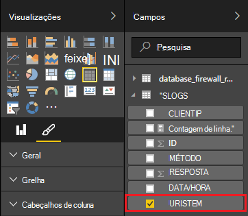

<properties
 pageTitle="Utilizar Apache tempestade com o Power BI | Microsoft Azure"
 description="Crie um relatório de Power BI com dados a partir de uma topologia de c# em execução num cluster de Apache tempestade HDInsight."
 services="hdinsight"
 documentationCenter=""
 authors="Blackmist"
 manager="jhubbard"
 editor="cgronlun"
    tags="azure-portal"/>

<tags
 ms.service="hdinsight"
 ms.devlang="dotnet"
 ms.topic="article"
 ms.tgt_pltfrm="na"
 ms.workload="big-data"
 ms.date="10/27/2016"
 ms.author="larryfr"/>

# Utilizar o Power BI para visualização desses dados a partir de uma topologia de Apache tempestade

Power BI permite-lhe apresentar dados visualmente como relatórios. Utilizar os modelos do Visual Studio para tempestade no HDInsight, pode utilizar facilmente armazenar dados a partir de uma topologia em execução numa tempestade Apache num cluster de HDInsight no SQL Azure e, em seguida, visualize os dados através do Power BI.

Este documento, vai aprender a utilizar o Power BI para criar um relatório a partir de dados gerados por uma topologia de Apache tempestade e armazenados na base de dados do SQL Azure.

> [AZURE.NOTE] Enquanto os passos neste documento dependem de um ambiente de desenvolvimento do Windows com o Visual Studio, o projecto compilado pode ser apresentado ao cluster de um Linux ou HDInsight baseados no Windows. Apenas os clusters baseado em Linux criados depois do suporte de 28/10/2016 SCP.NET topologias.
>
> Para utilizar uma topologia de c# com um cluster baseado em Linux, tem de atualizar o pacote de Microsoft.SCP.Net.SDK NuGet utilizado pelo seu projeto para a versão 0.10.0.6 ou superior. A versão do pacote também tem de corresponder a versão principal de tempestade instalado no HDInsight. Por exemplo, tempestade em versões HDInsight 3.3 e 3.4 utilizar a versão de tempestade 0.10.x, enquanto HDInsight 3.5 utiliza tempestade 1.0.x.
> 
> C# topologias em baseado em Linux clusters tem de utilizar .NET 4,5 e utilizar Mono para executar no HDInsight cluster. A maioria dos elementos irá funcionar, no entanto deve verificar o documento de [Compatibilidade de Mono](http://www.mono-project.com/docs/about-mono/compatibility/) para identificar possíveis incompatibilidades.
>
> Para obter uma versão Java este projeto, que também funcionam num cluster com base em Linux ou baseados no Windows, consulte o artigo [eventos de processo a partir do Azure evento concentradores com tempestade no HDInsight (Java)](hdinsight-storm-develop-java-event-hub-topology.md).

## Pré-requisitos

- Uma subscrição do Azure. Consulte o artigo [obter Azure versão de avaliação gratuita](https://azure.microsoft.com/documentation/videos/get-azure-free-trial-for-testing-hadoop-in-hdinsight/).

* Um utilizador do Azure Active Directory com o access do [Power BI](https://powerbi.com)

* Visual Studio (uma das seguintes versões)

    * Visual Studio 2012, com [4 de actualização](http://www.microsoft.com/download/details.aspx?id=39305)

    * Visual Studio 2013 com [Atualizar 4](http://www.microsoft.com/download/details.aspx?id=44921) ou [Visual Studio 2013 Comunidade](http://go.microsoft.com/fwlink/?linkid=517284&clcid=0x409)

    * [Visual Studio 2015](https://www.visualstudio.com/downloads/download-visual-studio-vs.aspx)

* As ferramentas de HDInsight para Visual Studio: consulte o artigo [começar a utilizar as ferramentas de HDInsight para Visual Studio](../HDInsight/hdinsight-hadoop-visual-studio-tools-get-started.md) para obter informações sobre como informações de instalação.

## Como funciona

Este exemplo contém uma topologia de c# tempestade gera aleatoriamente dados do registo de serviços de informação Internet (IIS). Estes dados, em seguida, são escritos para uma base de dados do SQL e, a partir desse local é utilizada para gerar relatórios no Power BI.

Segue-se uma lista dos ficheiros que implementar a funcionalidade principal neste exemplo.

* **SqlAzureBolt.cs**: escreve informações produzidas na topologia tempestade para base de dados SQL.

* **IISLogsTable.sql**: declarações de Transact-SQL utilizadas para gerar a base de dados que os dados são armazenados no.

> [AZURE.WARNING] Tem de criar a tabela na base de dados SQL antes de iniciar a topologia no seu cluster HDInsight.

## Transferir o exemplo

Transferir o [exemplo HDInsight c# tempestade do Power BI](https://github.com/Azure-Samples/hdinsight-dotnet-storm-powerbi). Para transferi-lo, quer bifurcação/cloná-lo utilizando [git](http://git-scm.com/)ou utilizar a ligação **Transferir** para transferir um. zip do arquivo.

## Criar uma base de dados

1. Utilize os passos no documento [tutorial de base de dados SQL](../sql-database/sql-database-get-started.md) para criar uma nova base de dados do SQL.

2. Ligar à base de dados ao seguir os passos no documento [ligar a uma base de dados SQL com o Visual Studio](../sql-database/sql-database-connect-query.md) para ligar à base de dados.

4. Clique com o botão direito do rato na base de dados no Explorador do objeto e criar uma __Nova consulta__. Colar o conteúdo do ficheiro __IISLogsTable.sql__ incluído no projeto transferido para a janela de consulta e, em seguida, utilize Ctrl + Shift + E para executar a consulta. Deverá receber uma mensagem que o comando concluída com êxito.

    Assim que for concluída, vai ser uma nova tabela denominada __IISLOGS__ na base de dados.

## Configurar a amostra

1. A partir do [Azure portal](https://portal.azure.com), selecione a base de dados do SQL. Secção de __Essentials__ da pá de base de dados SQL, selecione __Mostrar cadeias de texto de ligação de base de dados__. A partir da lista que é apresentado, copie as informações de __ADO.NET (autenticação do SQL)__ .

1. Abra a amostra no Visual Studio. **Solução Explorer**, abra o ficheiro da **App** e, em seguida, localize a seguinte entrada:

        <add key="SqlAzureConnectionString" value="##TOBEFILLED##" />
    
    Substitua o valor __# # TOBEFILLED # #__ com a cadeia de ligação de base de dados copiada no passo anterior. Substituir __{seu\_username}__ e __{seu\_palavra-passe}__ com o nome de utilizador e palavra-passe para a base de dados.

2. Guarde e feche os ficheiros.

## Implementar a amostra

1. A partir do **Explorador de soluções**, com o botão direito do projecto **StormToSQL** e selecione **Submeter para tempestade no HDInsight**. Selecione a caixa de diálogo de lista pendente **Tempestade Cluster** HDInsight cluster.

    > [AZURE.NOTE] Poderá demorar alguns segundos no menu pendente **Tempestade Cluster** para preencher com nomes de servidor.
    >
    > Se lhe for pedido, introduza as credenciais de início de sessão para a sua subscrição Azure. Se tiver mais do que uma subscrição, inicie sessão na que contém o seu tempestade num cluster de HDInsight.

2. Quando a topologia foi submetida com êxito, deverá aparecer a topologias tempestade para o cluster. Selecione a entrada de SqlAzureWriterTopology a partir da lista para ver informações sobre a topologia em execução.

    

    Pode utilizar esta vista para ver as informações na topologia da ou faça duplo clique em entradas (como SqlAzureBolt) para ver informações específicas de um componente na topologia.

3. Depois de ter a topologia ficou para alguns minutos, para regressar à janela da consulta SQL utilizada para criar a base de dados. Substitua as declarações existentes com o seguinte.

        select * from iislogs;
    
    Utilizar Ctrl + Shift + E para executar a consulta e deve receber resultados semelhantes ao seguinte.
    
        1   2016-05-27 17:57:14.797 255.255.255.255 /bar    GET 200
        2   2016-05-27 17:57:14.843 127.0.0.1   /spam/eggs  POST    500
        3   2016-05-27 17:57:14.850 123.123.123.123 /eggs   DELETE  200
        4   2016-05-27 17:57:14.853 127.0.0.1   /foo    POST    404
        5   2016-05-27 17:57:14.853 10.9.8.7    /bar    GET 200
        6   2016-05-27 17:57:14.857 192.168.1.1 /spam   DELETE  200

    Este é dados que foi escritos a partir da topologia de tempestade.

## Criar um relatório

1. Ligar ao [conector de base de dados do Azure SQL](https://app.powerbi.com/getdata/bigdata/azure-sql-database-with-live-connect) para o Power BI.

2. Dentro de __bases de dados__, selecione __obter__.

3. Selecione a __Base de dados do SQL Azure__e, em seguida, selecione __Ligar__.

4. Introduza as informações para ligar à sua base de dados do SQL Azure. Pode encontrar esta visitar o [portal do Azure](https://portal.azure.com) e selecionando a sua base de dados do SQL.

    > [AZURE.NOTE] Também pode definir o intervalo de atualização e filtros personalizados ao utilizar __Ativar opções avançadas__ de caixa de diálogo Ligar.

5. Depois de se ter ligado, irá ver um novo conjunto de dados com o mesmo nome como a base de dados que ligado. Selecione o conjunto de dados para começar a estruturar um relatório.

3. A partir de __campos__, expanda a entrada __IISLOGS__ . Selecione a caixa de verificação para __URISTEM__. Isto irá criar um novo relatório que lista haste URI (/ foo, / barra, etc.) tem sessão iniciada na base de dados.

    

5. Em seguida, arraste o __método__ para o relatório. O relatório irá atualizar para da lista haste e o método HTTP correspondente utilizado para o pedido de HTTP.

    

4. A coluna de __visualizações__ , selecione o ícone de __campos__ e, em seguida, selecione a seta para baixo junto ao __método__ na secção de __valores__ . A partir da lista que aparece, selecione __contagem__. Isto irá alterar o relatório para uma contagem do número de vezes acedeu um URI específico da lista.

    

6. Em seguida, selecione o __gráfico de colunas empilhadas__ para alterar a forma como as informações são apresentadas.

    

7. Assim que tiver o relatório como pretende, utilize a entrada de __Guardar__ no menu para introduzir um nome e guardar o relatório.

## Parar a topologia

A topologia irão continuar a ser executadas até pará-la ou eliminar tempestade num cluster de HDInsight. Execute os passos seguintes para parar a topologia.

1. No Visual Studio, regresse ao Visualizador de topologia e selecione a topologia.

2. Selecione o botão **Eliminar** para parar a topologia.

    

## Eliminar o seu cluster

[AZURE.INCLUDE [delete-cluster-warning](../../includes/hdinsight-delete-cluster-warning.md)]

## Próximos passos

Neste documento, o que aprendeu como enviar dados a partir de uma topologia de tempestade para base de dados SQL, em seguida, visualizar dados através do Power BI. Para obter informações sobre como trabalhar com outras tecnologias Azure utilizando tempestade no HDInsight, consulte o seguinte:

* [Topologias de exemplo para tempestade no HDInsight](hdinsight-storm-example-topology.md)
