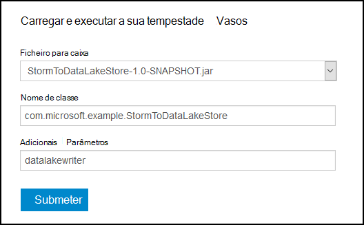
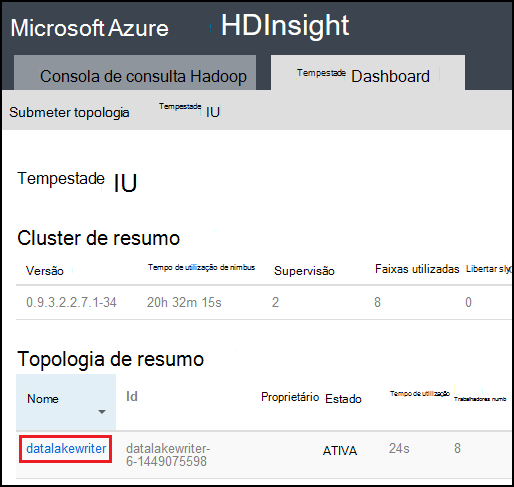

<properties
pageTitle="Utilizar Azure dados Lake arquivo com Apache tempestade no Azure HDInsight"
description="Saiba como escrever dados ao arquivo de Lake Azure dados a partir de uma topologia de Apache tempestade no HDInsight. Este documento e o exemplo associado, demonstram como o componente HdfsBolt pode ser utilizado para escrever dados Lake arquivo."
services="hdinsight"
documentationCenter="na"
authors="Blackmist"
manager="jhubbard"
editor="cgronlun"/>

<tags
ms.service="hdinsight"
ms.devlang="na"
ms.topic="article"
ms.tgt_pltfrm="na"
ms.workload="big-data"
ms.date="09/06/2016"
ms.author="larryfr"/>

#Utilizar Azure dados Lake arquivo com Apache tempestade com HDInsight

Azure dados Lake arquivo é um serviço de armazenamento na nuvem compatíveis HDFS que fornece débito alto, disponibilidade, durabilidade e fiabilidade para os seus dados. Neste documento, vai aprender a utilizar uma topologia de tempestade com base em Java para escrever dados ao arquivo de Lake de dados do Azure utilizando o componente [HdfsBolt](http://storm.apache.org/javadoc/apidocs/org/apache/storm/hdfs/bolt/HdfsBolt.html) , que é fornecido como parte do Apache tempestade.

> [AZURE.IMPORTANT] A topologia de exemplo utilizada neste documento baseia-se em componentes que estão incluídos no tempestade em HDInsight clusters e precisem de modificação para funcionar com o Azure dados Lake loja quando utilizado com outros clusters Apache tempestade.

##Pré-requisitos

* [Java JDK 1.7](https://www.oracle.com/technetwork/java/javase/downloads/jdk7-downloads-1880260.html) ou superior
* [Maven 3. x](https://maven.apache.org/download.cgi)
* Uma subscrição do Azure
* Uma tempestade na versão de cluster HDInsight 3,2. Para criar um novo tempestade num cluster de HDInsight, utilize os passos no documento [Azure HDInsight utilizar com o arquivo de dados de Lake a utilizar](../data-lake-store/data-lake-store-hdinsight-hadoop-use-portal.md) . Os passos neste documento irão guiá-lo através de criar um novo HDInsight cluster e Azure dados Lake loja.  

    > [AZURE.IMPORTANT] Quando cria HDInsight cluster, tem de selecionar __tempestade__ como o tipo de cluster e __3,2__ como a versão. Pode ser o sistema operativo Windows ou Linux.  

###Configurar as variáveis de ambiente

As seguintes variáveis de ambiente podem ser definidas quando instala Java e o JDK no seu estação de trabalho de desenvolvimento. No entanto, deve verificar que existem e que contêm os valores corretos para o seu sistema.

* __JAVA_HOME__ - devem apontar para o diretório onde está instalado o ambiente do runtime Java (JRE). Por exemplo, de uma distribuição Unix ou Linux, deve ter um valor semelhante ao `/usr/lib/jvm/java-7-oracle`. No Windows, teria um valor semelhante ao `c:\Program Files (x86)\Java\jre1.7`.

* __Caminho__ - devem conter caminhos que se seguem:

    * __JAVA\_casa__ (ou o caminho equivalente)
    
    * __JAVA\_HOME\bin__ (ou o caminho equivalente)
    
    * Diretório onde está instalado o Maven

##Implementação de topologia

O exemplo utilizado neste documento escrito Java e utiliza os seguintes componentes:

* __TickSpout__: gera os dados utilizados por outros componentes na topologia.

* __PartialCount__: conta os eventos gerados por TickSpout.

* __FinalCount__: agregados contam dados a partir de PartialCount.

* __ADLStoreBolt__: escreve dados ao arquivo de Lake Azure dados utilizando o componente de [HdfsBolt](http://storm.apache.org/javadoc/apidocs/org/apache/storm/hdfs/bolt/HdfsBolt.html) .

O projeto que contém esta topologia está disponível como uma transferência a partir do [https://github.com/Azure-Samples/hdinsight-storm-azure-data-lake-store](https://github.com/Azure-Samples/hdinsight-storm-azure-data-lake-store).

###Noções sobre ADLStoreBolt

O ADLStoreBolt é o nome utilizado para a instância HdfsBolt na topologia de que escreve Azure dados Lake. Não se trata de uma versão especial de HdfsBolt criado pela Microsoft; No entanto-dependem de valores de configuração do site principal, bem como componentes Hadoop que estão incluídos no Azure HDInsight a comunicação com Lake de dados.

Especificamente, quando cria um cluster de HDInsight, pode associá-la com um arquivo de Lake de dados do Azure. Isto escreve introduções core de sites para o arquivo de Lake de dados que selecionou, que são utilizadas pelo componentes como cliente hadoop e hadoop hdfs para permitir a comunicação com dados Lake loja.

> [AZURE.NOTE] Microsoft contribuiu com determinadas código para a Apache Hadoop e projetos de tempestade que permite a comunicação com o arquivo de Lake de dados do Azure e BLOBs do Azure armazenamento, mas esta funcionalidade não pode ser incluída por predefinição no outras distribuições Hadoop e tempestade.

A configuração para HdfsBolt na topologia é da seguinte forma:

    // 1. Create sync and rotation policies to control when data is synched
    //    (written) to the file system and when to roll over into a new file.
    SyncPolicy syncPolicy = new CountSyncPolicy(1000);
    FileRotationPolicy rotationPolicy = new FileSizeRotationPolicy(0.5f, Units.KB);
    // 2. Set the format. In this case, comma delimited
    RecordFormat recordFormat = new DelimitedRecordFormat().withFieldDelimiter(",");
    // 3. Set the directory name. In this case, '/stormdata/'
    FileNameFormat fileNameFormat = new DefaultFileNameFormat().withPath("/stormdata/");
    // 4. Create the bolt using the previously created settings,
    //    and also tell it the base URL to your Data Lake Store.
    // NOTE! Replace 'MYDATALAKE' below with the name of your data lake store.
    HdfsBolt adlsBolt = new HdfsBolt()
        .withFsUrl("adl://MYDATALAKE.azuredatalakestore.net/")
        .withRecordFormat(recordFormat)
        .withFileNameFormat(fileNameFormat)
        .withRotationPolicy(rotationPolicy)
        .withSyncPolicy(syncPolicy);
    // 4. Give it a name and wire it up to the bolt it accepts data
    //    from. NOTE: The name used here is also used as part of the
    //    file name for the files written to Data Lake Store.
    builder.setBolt("ADLStoreBolt", adlsBolt, 1)
      .globalGrouping("finalcount");
      
Se estiver familiarizado com a utilização de HdfsBolt, irá reparar que se trata de toda a configuração muito padrão, exceto o URL. O URL fornece o caminho na raiz da sua Azure Lake de arquivo de dados.

Uma vez que escrever ao arquivo de dados de Lake utiliza HdfsBolt e é apenas uma alteração de URL, deve ser capaz de tomar qualquer topologia existente que escreve HDFS ou WASB utilizando HdfsBolt e alterá-la para utilizar Azure dados Lake arquivo facilmente.

##Criar e compactar a topologia

1. Transferir o projeto de exemplo do [https://github.com/Azure-Samples/hdinsight-storm-azure-data-lake-store](https://github.com/Azure-Samples/hdinsight-storm-azure-data-lake-store
) para o seu ambiente de desenvolvimento.

2. Abrir o `StormToDataLake\src\main\java\com\microsoft\example\StormToDataLakeStore.java` ficheiro num editor de e localize a linha que contém `.withFsUrl("adl://MYDATALAKE.azuredatalakestore.net/")`. Alterar __MYDATALAKE__ para o nome o Azure Lake de arquivo de dados que utilizou quando criar o seu servidor de HDInsight.

3. A partir de um comando linha de comandos, terminal ou na sessão de shell, altere directórios na raiz do projeto transferido e execute os seguintes comandos para construir e compactar a topologia.

        mvn compile
        mvn package
    
    Assim que a compilação e embalagem for concluída, haverá um novo directório denominado `target`, que contém um ficheiro chamado `StormToDataLakeStore-1.0-SNAPSHOT.jar`. Este contém a topologia compilada.

##Implementar e executar no baseado em Linux HDInsight

Se tiver criado uma tempestade baseado em Linux num cluster de HDInsight, utilize os passos abaixo para implementar e executar a topologia.

1. Utilize o seguinte comando para copiar a topologia para HDInsight cluster. Substitua o nome de utilizador SSH que utilizou quando criar o cluster __utilizador__ . Substitua o __nome de cluster__ com o nome do cluster.

        scp target\StormToDataLakeStore-1.0-SNAPSHOT.jar USER@CLUSTERNAME-ssh.azurehdinsight.net:StormToDataLakeStore-1.0-SNAPSHOT.jar
    
    Quando lhe for pedido, introduza a palavra-passe utilizada quando criar o utilizador SSH para o cluster. Se utilizou uma chave pública em vez de uma palavra-passe, poderá ter utilizar o `-i` parâmetro para especificar o caminho para a chave privada correspondente.
    
    > [AZURE.NOTE] Se estiver a utilizar um cliente do Windows para o desenvolvimento, poderá não ter um `scp` comando. Se Sim, pode utilizar `pscp`, que se encontra disponível a partir do [http://www.chiark.greenend.org.uk/~sgtatham/putty/download.html](http://www.chiark.greenend.org.uk/~sgtatham/putty/download.html).

2. Assim que o carregamento for concluída, utilize o seguinte procedimento para ligar ao cluster HDInsight utilizando SSH. Substitua o nome de utilizador SSH que utilizou quando criar o cluster __utilizador__ . Substitua o __nome de cluster__ com o nome do cluster.

        ssh USER@CLUSTERNAME-ssh.azurehdinsight.net

    Quando lhe for pedido, introduza a palavra-passe utilizada quando criar o utilizador SSH para o cluster. Se utilizou uma chave pública em vez de uma palavra-passe, poderá ter utilizar o `-i` parâmetro para especificar o caminho para a chave privada correspondente.
    
    > [AZURE.NOTE] Se estiver a utilizar um cliente do Windows para o desenvolvimento, siga as informações em [ligar ao baseado em Linux HDInsight com SSH a partir do Windows](hdinsight-hadoop-linux-use-ssh-windows.md) para obter informações utilizar o cliente para ligar ao cluster.
    
3. Quando estabelecida, utilize o seguinte para começar a topologia de:

        storm jar StormToDataLakeStore-1.0-SNAPSHOT.jar com.microsoft.example.StormToDataLakeStore datalakewriter
    
    Este procedimento irá iniciar a topologia com um nome amigável da `datalakewriter`.

##Implementar e executar no HDInsight baseados no Windows

1. Abra um browser e aceda ao HTTPS://CLUSTERNAME.azurehdinsight.net, onde o __nome de cluster__ é o nome do seu cluster HDInsight. Quando lhe for pedido, fornecer o nome de utilizador do administrador (`admin`) e a palavra-passe que utilizou para esta conta quando o cluster foi criado.

2. A partir do Dashboard de tempestade, selecione __Procurar__ a partir do menu pendente __Jar ficheiro__ , em seguida, selecione o ficheiro StormToDataLakeStore-1.0-SNAPSHOT.jar a partir do `target` diretório. Utilize os seguintes valores para as outras entradas no formulário:

    * Nome de classe: com.microsoft.example.StormToDataLakeStore
    * Parâmetros adicionais: datalakewriter
    
    

3. Selecione o botão __Submeter__ para carregar e iniciar a topologia. O campo de resultado por baixo do botão __Submeter__ deve apresentar informações semelhantes ao seguinte depois de ter começado a topologia de:

        Process exit code: 0
        Currently running topologies:
        Topology_name        Status     Num_tasks  Num_workers  Uptime_secs
        -------------------------------------------------------------------
        datalakewriter       ACTIVE     68         8            10        

##Ver dados de saída

Existem várias formas para ver os dados. Nesta secção utilizamos Portal do Azure e o `hdfs` comando para ver os dados.

> [AZURE.NOTE] Deverá permitir topologias executar durante vários minutos antes de verificar os dados de saída, para que tem sido sincronizados dados para vários ficheiros no Azure dados Lake arquivo.

* __A partir do [Portal do Azure](https://portal.azure.com)__: no portal do, selecione o arquivo de Lake de dados de Azure que utilizou com HDInsight.

    > [AZURE.NOTE] Se não afixar o arquivo de Lake dados ao dashboard portal Azure, pode encontrá-la selecionando a __Procurar__ na parte inferior da lista à esquerda, em seguida, do __Arquivo de dados de Lake__e finalmente selecionando o arquivo.
    
    Os ícones na parte superior do arquivo de Lake de dados, selecione __Explorador de dados__.
    
    
    
    Em seguida, selecione a pasta de __stormdata__ . Deve ser apresentada uma lista de ficheiros de texto.
    
    
    
    Selecione um dos ficheiros para ver os seus conteúdos.

* __A partir do cluster__: se tem ligados à cluster HDInsight utilizando SSH (Linux cluster) ou ambiente de trabalho remoto (cluster do Windows), pode utilizar o seguinte para ver os dados. Substituir __DATALAKE__ com o nome da sua Lake de arquivo de dados

        hdfs dfs -cat adl://DATALAKE.azuredatalakestore.net/stormdata/*.txt

    Isto irá concatenar os ficheiros de texto armazenados no diretório e apresentar informações sobre o semelhante ao seguinte:
    
        406000000
        407000000
        408000000
        409000000
        410000000
        411000000
        412000000
        413000000
        414000000
        415000000
        
##Parar a topologia

Topologias tempestade serão executado até que seja parado ou cluster é eliminado. Para parar as topologias, utilize as seguintes informações.

__Para baseado em Linux HDInsight__:

A partir de uma sessão SSH ao cluster, utilize o seguinte comando:

    storm kill datalakewriter

__Para HDInsight baseados no Windows__:

1. A partir do Dashboard de tempestade (https://CLUSTERNAME.azurehdinsight.net), selecione a ligação de __IU tempestade__ na parte superior da página.

2. Assim que a IU tempestade carrega, selecione a ligação __datalakewriter__ .

    

3. Na secção __Topologia de ações__ , selecione __Eliminar__ e, em seguida, selecione OK na caixa de diálogo que aparece.

    

## Eliminar o seu cluster

[AZURE.INCLUDE [delete-cluster-warning](../../includes/hdinsight-delete-cluster-warning.md)]

##Próximos passos

Agora que aprendeu como utilizar tempestade para escrever Azure dados Lake arquivo, descubra outros [exemplos de tempestade para HDInsight](hdinsight-storm-example-topology.md).
