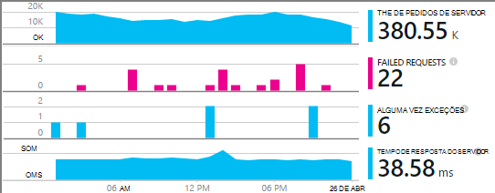

<properties
    pageTitle="Exemplo de MyDriving Azure IoT: construir | Microsoft Azure"
    description="Crie uma aplicação que é uma demonstração abrangente de como arquitectar um sistema de IoT utilizando o Microsoft Azure, incluindo a análise da cadeia, máquina aprendizagem e concentradores do evento."
    services=""
    documentationCenter=".net"
    suite=""
    authors="harikmenon"
    manager="douge"/>

<tags
    ms.service="multiple"
    ms.workload="tbd"
    ms.tgt_pltfrm="ibiza"
    ms.devlang="dotnet"
    ms.topic="article"
    ms.date="03/25/2016"
    ms.author="harikm"/>


# <a name="build-and-deploy-the-mydriving-solution-to-your-environment"></a>Criar e implementar a solução MyDriving para o seu ambiente

MyDriving é uma solução de Internet coisas (IoT), que reúne dados a partir do seu carro, processa-lo através da utilização de aprendizagem automática e apresenta-o no seu telemóvel. O back-end é composta por uma variedade de serviços fornecidos pelo Microsoft Azure. Os clientes podem ser telemóveis Android, iOS ou o Windows 10.

Criámos a solução MyDriving para lhe dar um jumpstart na criação de seu próprio sistema IoT. A partir do [repositório de MyDriving no GitHub](https://github.com/Azure-Samples/MyDriving), pode obter scripts do Gestor de recursos do Azure para implementar a arquitetura de back-end para a sua própria conta Azure. A partir desse momento, pode reconfigurar diferentes serviços, modifique as consultas de acordo com os seus próprios dados e assim sucessivamente. Pode encontrar estas scripts – juntamente com código para a aplicação móvel, o projeto Azure API do serviço de aplicação e mais – no repositório de MyDriving.

Se ainda não o tenha tentado a aplicação ainda, consulte o [Guia de introdução do obter](iot-solution-get-started.md).

Existe uma conta detalhada de arquitectura no [Guia de referência MyDriving](http://aka.ms/mydrivingdocs). Em resumo, existem várias peças que estamos a configurar e iria definido para criar um projeto semelhante:

* Uma **aplicação de cliente** é executado nos telemóveis Windows 10, iOS e Android. Utilizamos a plataforma Xamarin para partilhar muita o código de que está armazenado no GitHub em `src/MobileApp`. A aplicação realmente executa duas funções distintas:
 * Significa que reencaminha telemetria a partir do dispositivo de diagnóstico a bordo (OBD) e a partir do seu próprio serviço de localização para nuvem back-end o sistema.
 * É uma interface de utilizador onde os utilizadores podem consultar sobre os respetivos viagens gravada.
* Um **serviço na nuvem** ingests os dados de viagem de estrada em tempo real e processa-lo. O trabalho principal da criação deste serviço é escolher, parametrizar e fio para cima uma variedade de serviços Azure. Algumas das peças requerem scripts para filtrar e processo os dados de entrada. Vamos utilizar um modelo de Gestor de recursos do Azure para todas as peças de configurar.
* Uma **aplicação de serviço móvel** é o serviço web atrás a parte da interface de utilizador da aplicação do dispositivo. A tarefa principal é a base de dados de dados armazenados, transformados de consulta. Respectivo código está no GitHub em `src/MobileAppService`.
* **O Visual Studio com Xamarin** é nosso ambiente de desenvolvimento. Xamarin, que existe como um componente do Visual Studio e como um ambiente de desenvolvimento integrado autónomo (IDE), é utilizado para construir o código do dispositivo em diferentes plataformas. Para criar o código de iOS, é necessário ter uma instância da Xamarin em execução numa máquina com o OS X. Se necessário, pode ser executado como agente, gerido a partir do Visual Studio.
* **Testes de unidade** das aplicações dispositivo é executada na nuvem de teste Xamarin.
* **GitHub** é o repositório onde podemos armazenar todos os código, scripts e modelos.
* **Serviços de equipa do Visual Studio** é um serviço na nuvem que é utilizado para gerir a compilação contínua e teste das aplicações web de serviços e dispositivos.
* **HockeyApp** é utilizada para distribuir lançamentos do código dispositivo. Também recolhe relatórios de falha de sistema e a utilização e comentários dos utilizadores.
* **Informações de aplicação do Visual Studio** monitoriza o serviço web móvel.

Por isso, vamos ver como podemos configurar de tudo isso. Note que muitos dos passos são opcionais.

## <a name="sign-up-for-accounts"></a>Inscrever-se para contas

-   [Tópicos essenciais do visual Studio Dev Center](https://www.visualstudio.com/products/visual-studio-dev-essentials-vs.aspx). Este programa gratuito fornece acesso fácil a várias ferramentas de programador e serviços, incluindo o Visual Studio, os serviços de equipa do Visual Studio e Azure. Fornece-lhe um crédito de $25/ mês Azure por 12 meses. Também inclui subscrições para Pluralsight formação e Xamarin universitários. Pode também inscrever-se em separado para camadas gratuitas do [Azure](https://azure.com) e [Dos serviços de equipa do Visual Studio](https://www.visualstudio.com/products/visual-studio-team-services-vs.aspx), mas estas não fornecem créditos Azure.

-   [HockeyApp](https://rink.hockeyapp.net/) (opcional), para gerir a distribuição de teste de aplicações móveis e que cobra telemetria.

-   [Xamarin](https://xamarin.com/) (obrigatório), para criar a aplicação móvel e executar depuração executa e testa no [Xamarin teste nuvem](https://xamarin.com/test-cloud).

-   [GitHub](https://github.com/Azure-Samples/MyDriving/) (opcional), para criar gratuitos repositórios públicos para o seu próprio código (repositórios privados são pagos). Em alternativa, pode utilizar o plano básico no Visual Studio Team Services para repositórios privados.

-   [Power BI](https://powerbi.microsoft.com/) (opcional), para criar visualizações de dados ao longo de todo o sistema.

> [AZURE.NOTE] Não precisa de uma conta de GitHub para aceder ao código MyDriving no [repositório de GitHub MyDriving](https://github.com/Azure-Samples/MyDriving).

## <a name="install-development-tools"></a>Instalar ferramentas de desenvolvimento

A configuração seguinte é para desenvolver a solução completa: uma iOS, Android e Windows 10 Mobile aplicação em diferentes plataformas, com um Azure back-end.

Como alternativa, pode utilizar Xamarin Studio no Mac ou Windows para desenvolver aplicações móveis-se de que não está a trabalhar no Azure back-end.

Existe uma [descrição mais longa desta configuração](https://msdn.microsoft.com/library/mt613162.aspx).

### <a name="windows-development-machine"></a>Máquina de desenvolvimento do Windows

A ferramenta central no Windows está Visual Studio, para trabalhar com a aplicação de MyDriving para Android e Windows, o project API do serviço de aplicação e extensões de microservice.

Xamarin, Git, emuladores e outros componentes útil estão todos integrados com o Visual Studio.

Instale:

-   [Visual Studio 2015 com Xamarin](https://www.visualstudio.com/products/visual-studio-community-vs) (qualquer edição – Comunidade é gratuita).

-   [SQLite para plataforma Universal Windows](https://visualstudiogallery.msdn.microsoft.com/4913e7d5-96c9-4dde-a1a1-69820d615936). Necessário para construir o código do Windows 10 Mobile.

-   [Azure SDK para Visual Studio 2015](https://go.microsoft.com/fwlink/?linkid=518003&clcid=0x409). Dá-lhe o SDK para executar as aplicações no Azure, juntamente com ferramentas de linha de comandos para gerir Azure.

-   [Serviço azure ferro SDK](http://www.microsoft.com/web/handlers/webpi.ashx?command=getinstallerredirect&appid=MicrosoftAzure-ServiceFabric). Necessário para criar a extensão de [microservice](../service-fabric/service-fabric-get-started.md) .

Além disso, certifique-se de que tem as extensões de Visual Studio à direita. Verifique que em **Ferramentas**, ver **Android, iOS, Xamarin...**. Caso não esteja, abra o painel de controlo e, em seguida, selecione **programas e funcionalidades** > **Microsoft** > **Visual Studio 2015** > **Modificar**. Em **em diferentes plataformas de desenvolvimento**, selecione **C\#/.Net (Xamarin)**. Enquanto estiver lá, verifique que **Git para Windows** está instalado.

### <a name="mac-development-machine"></a>Máquina de desenvolvimento do Mac

Mac (Yosemite ou posterior) é necessária se quer desenvolver para iOS. Apesar de utilizamos Visual Studio com Xamarin no Windows para desenvolver e gerir todos os códigos, Xamarin utiliza uma agent instalado num Mac para poder criar e assinar o código do iOS.


(Como alternativa, pode utilizar Xamarin Studio diretamente no Mac desenvolver aplicações em diferentes plataformas.)

Não precisa de Mac se não pretende incluir iOS como uma plataforma de destino.

Instale:

-   [Xamarin Studio para iOS](https://developer.xamarin.com/guides/ios/getting_started/installation/mac/). Também pode configurar o Visual Studio e Xamarin num Mac que esteja a executar uma máquina de virtual do Windows. Consulte [configuração, instalar e verificações para os utilizadores de Mac](https://msdn.microsoft.com/library/mt488770.aspx) no MSDN.

-   [Ferramentas de desenvolvimento Azure](https://azure.microsoft.com/downloads/) (opcional).

Ativar o início de sessão remoto no Mac. Abra **As preferências do sistema** > **partilha**e, em seguida, selecione **Início de sessão remoto**.

Quando abre um projeto iOS no Visual Studio no Windows, o plug-in Xamarin irá pedir-lhe o ID do Mac.

## <a name="fetch-the-github-repository"></a>Obter o GitHub repositório

Obter uma cópia local do [repositório GitHub MyDriving](https://github.com/Azure-Samples/MyDriving) , utilizando o botão **Transferir ZIP** no GitHub, no Visual Studio ou outro Git cliente.

Deszipar o ficheiro para uma pasta com um nome de caminho abreviado, tal como c:\\código.

Em alternativa, se pretender manter a par de ou contribuir para o nosso código, clonar do repositório da seguinte forma:

**Git clonar https://github.com/Azure-Samples/MyDriving.git**

## <a name="get-a-bing-maps-api-key"></a>Obter um Bing maps API chave

[Registe-se para uma chave de API de mapas Bing](https://msdn.microsoft.com/library/ff428642.aspx).

Precisa de substitui-la na linha 22 no `src/MobileApps/MyDriving/MyDriving.Utils/Logger.cs`.


## <a name="build-the-demo-app"></a>Criar a aplicação de demonstração

Abra estas soluções no Visual Studio:

-   src\MobileApps\MyDriving.sln

-   src\MobileAppService\MyDrivingService.sln

-   src\Extensions\ServiceFabric\VINLookUpApplication\VINLookUpApplication.sln

Receberá indicações para:

-   Confie em alguns projectos potencialmente não fidedignos. Selecione para abri-los, se pretender seguir em frente.

-   Defina o modo de programador se estiver a trabalhar num computador Windows 10 fresco.

-   Forneça as credenciais de Xamarin.

-   Ligar a MAC Xamarin. Se não tiver um Mac, com o botão direito do projecto iOS no Visual Studio e, em seguida, selecione **projeto descarregar**.

Reconstrua a solução.

Se tiver problemas em construir, experimente as soluções para quirks que tenha encontrámos:

-   *Não é possível carregar VINLookupApplication projeto*: Certifique-se de que instalou o [Azure SDK para Visual Studio 2015](https://go.microsoft.com/fwlink/?linkid=518003&clcid=0x409).

-   *Não criar projeto de serviço ferro*: criar primeiro os projetos da interface e certifique-se de que instalou o SDK do serviço ferro.

-   *Não construir a aplicação para android*:

    -   Abrir as **Ferramentas de** > **Android** > **Android SDK Gestor**e certifique-se de que 6 Android (API 23) / plataforma SDK está instalada.

    -   Eliminar este diretório e, em seguida, reconstruir:<br/>
        `%LocalAppData%\Xamarin\zips`

## <a name="get-to-know-the-code"></a>Conheça o código

A solução, encontrará:

-   Extensões Azure: ferro de serviço.

-   Azure HDInsight: Scripts para processamento de dados de viagem no Azure.

-   Aplicações móveis: As aplicações do dispositivo.

-   MobileAppsService/MyDrivingService: Terminar web novamente.

-   Power BI: A definição de relatório.

-   Scripts de:

    -   Gestor de recursos: modelos para criar os recursos Azure.

    -   PowerShell: Scripts para executar os modelos de Gestor de recursos.

    -   Base de dados SQL Azure: Depuração de bases de dados.

-   Base de dados SQL: CreateTables: definições de esquema.

-   Análise da cadeia Azure: Consultas transformam o fluxo de dados de entrada.

## <a name="run-the-apps-in-development-mode"></a>Executar as aplicações no modo de programação

Efetuar a ação para executar as aplicações, com base no dispositivo que estiver a utilizar:

-  Back-end: MyDrivingService conjunto, como o projeto de arranque e prima F5 para executar o serviço web de back-end. Será aberto uma vista de browser da listagem API.

-  Os clientes móveis: [aplicações móveis estão desenvolvidas no Xamarin](https://developer.xamarin.com/guides/cross-platform/deployment,_testing,_and_metrics/debugging_with_xamarin/).
 -  Android: Para obter detalhes, consulte o artigo [Depuração Android no Xamarin](http://developer.xamarin.com/guides/android/deployment,_testing,_and_metrics/debugging_with_xamarin_android/).

 -  iOS: para obter mais detalhes, consulte o artigo [depuração no iOS](http://developer.xamarin.com/guides/ios/deployment,_testing,_and_metrics/debugging_in_xamarin_ios/).

 -  Windows Phone: Para obter detalhes, consulte o artigo [Xamarin + Windows Phone](https://developer.xamarin.com/guides/cross-platform/windows/phone/).

## <a name="upload-the-mobile-app-to-hockeyapp"></a>Carregar a aplicação móvel para HockeyApp

HockeyApp gere a distribuição da sua aplicação do Windows, iOS ou Android para testar os utilizadores, notificando os utilizadores do novas versões. Também recolhe relatórios de falha de sistema útil, comentários de utilizador com capturas de ecrã e métricas de utilização.

[Comece por ao carregar](http://support.hockeyapp.net/kb/app-management-2/how-to-create-a-new-app) a aplicação de compilação. Em seguida, inicie sessão no [HockeyApp](https://rink.hockeyapp.net) a partir do seu computador de desenvolvimento. No dashboard de programador, clique em **Nova aplicação**e, em seguida, arraste os ficheiros criados para a janela. (Mais tarde, pode automatizar seu serviço de compilação para o fazer.)

Agora está no seu dashboard de aplicação.


Repita o processo para cada plataforma que a aplicação é executada no. Em seguida, pode fazer o seguinte:

-  Utilize o [ID da aplicação](http://support.hockeyapp.net/kb/app-management-2/how-to-find-the-app-id) a partir do dashboard para enviar comentários e dados de falha da sua aplicação. No MyDriving, atualize os IDs de na src/MobileApps/MyDriving/MyDriving.Utils/Logger.cs.

-  [Convidar utilizadores de teste](http://support.hockeyapp.net/kb/app-management-2/how-to-invite-beta-testers). Obter um URL para recrutar especialistas de utilizadores de teste. Poderá inscrever-se para a sua equipa, transferir a aplicação e enviar-lhe comentários.

-  Se preferir uma versão beta mais aberta, defina a distribuição ao público. Clique em **Gerir aplicação** > **distribuição** > **Transferir = público**. Agora qualquer pessoa pode transferir a aplicação e enviar-lhe comentários e irá ver uma notificação quando que publicar uma nova versão. Poderá receber demasiado alguns relatórios de falha de sistema das mesmas.

    

-  [Relatórios de falha de ligação para Visual Studio Team Services](http://support.hockeyapp.net/kb/third-party-bug-trackers-services-and-webhooks/how-to-use-hockeyapp-with-visual-studio-team-services-vsts-or-team-foundation-server-tfs). Clique em **Gerir aplicação** > **Serviços de equipa do Visual Studio**. HockeyApp pode criar automaticamente itens de trabalho nos serviços de equipa quando existem relatórios de falha de sistema ou quando for recebido comentários.

Leia mais no [HockeyApp site](https://hockeyapp.net).

## <a name="test-the-mobile-app-on-xamarin-test-cloud"></a>Testar a aplicação móvel do Xamarin teste nuvem

[Nuvem de teste Xamarin](https://developer.xamarin.com/guides/testcloud/introduction-to-test-cloud/) automatiza IU testes em dispositivos reais na nuvem. Utilizando a arquitetura de NUnit, escrever testes que executar a sua aplicação através da interface de utilizador.

Para utilizar Xamarin, pode incorporar [Xamarin.UITests](https://developer.xamarin.com/guides/testcloud/uitest/intro-to-uitest/) SDK a aplicação, que é como um pacote de NuGet. Irá encontrá-la na aplicação demonstração e é incluído quando cria novos projectos de teste com os modelos de Xamarin.


Um projeto de teste de exemplo está incluído com a aplicação no repositório. Na [MyDriving](https://github.com/Azure-Samples/MyDriving/tree/master/src/MobileAppService), procure em [src](https://github.com/Azure-Samples/MyDriving/tree/master/src)/MobileApps/[MyDriving](https://github.com/Azure-Samples/MyDriving/tree/master/src/MobileApps/MyDriving)/MyDriving.UITests/.

Se utilizar uma compilação de serviços de equipa do Visual Studio, é fácil escrever Xamarin IU testes de unidade e executá-los como parte do seu compilação.

## <a name="deploy-azure-services"></a>Implementar os serviços de Azure

Para executar uma implementação automática dos serviços Azure e serviços de compilação de serviços de equipa, consulte as instruções detalhadas na **scripts/README.md**.

Microsoft Azure fornece vastos de serviços diferentes que pode utilizar para criar aplicações na nuvem. Apesar de muitas podem ser utilizadas individualmente (tais como as aplicações de serviço/Web App), as mesmas são melhor no seu quando que está a interligados para um sistema integrado como utilizamos no MyDriving de formulário.

É possível criar e interligar serviços Azure manualmente, mas é muito mais rápidos e mais fiáveis para utilizar o Gestor de recursos do Azure modelos. [Gestor de recursos](../azure-resource-manager/resource-group-overview.md) automatiza a implementação de uma solução recursos e efetuar interligações entre elas.

Vai encontrar o modelo para o sistema de MyDriving no repositório GitHub em [Scripts/processador](https://github.com/Azure-Samples/MyDriving/tree/master/scripts/ARM). -Fornece uma vista de abrangente e concisa de como os diferentes serviços no nosso arquitetura estão interligados. Iremos explicar todos estes detalhe o [Guia de referência MyDriving](http://aka.ms/mydrivingdocs), mas pode obter um lote apenas ao ler o artigo através do modelo de si.

> [AZURE.NOTE] Serviços mais Azure têm um custos associados, consoante a camada comparar. Se estiver familiarizado com o Azure, pode [experimentar saída gratuitamente](https://azure.microsoft.com/free/). No entanto, se não planeia utilizar determinados componentes no sistema de MyDriving, certifique-se de que removê-las para evitar sempre custos. A secção "Estimar custos operacionais" mais adiante neste artigo fornece um resumo das despesas de um serviço típico.

### <a name="edit-the-template"></a>Editar o modelo

Para personalizar a sua implementação, talvez para remover componentes desnecessárias ou para adicionar outras pessoas, comece por uma cópias do cenário\_complete.params.json e cenário\_complete.json na qual pretende fazer alterações.

Pode utilizar o cenário\_complete.params.json ficheiro para substituir vários valores predefinidos, como o serviço SKU ou o tipo de replicação de armazenamento, conforme descrito na tabela seguinte. Os valores predefinidos Selecione as opções mais baixos custo.

| **Parâmetro**         | **Descrição**                | **Valor predefinido** |
|--------|---------|-------|
| Concentrador IoT SKU           | Camadas para o serviço do Azure IoT concentrador | F1                |
| Tipo de conta de armazenamento  | Tipo de armazenamento de replicação       | LRS padrão      |
| Objectivo de serviço do SQL | Consumo de ranhura simultaneidade   | DW100             |
| Plano de alojamento SKU      | Plano de serviço do serviço de aplicação   | F1                |

Cenário\_complete.json:

-   Procurar "baseName" e alterá-lo a um nome que preferir.

-   Procurar "Criar". Cada uma das seguintes secções cria um recurso.

-   Definir sqlServerAdminLogin e sqlServerAdminPassword para valores adequados.

-   Antes de eliminar uma secção que cria um recurso, verifique se tem dependentes ao procurar o nome noutro local no ficheiro. Note que cada secção que cria um serviço inclui uma secção de *dependsOn* que lista as respectivas dependências.

Eis o que configura o modelo. Existem detalhes no [Guia de referência](http://aka.ms/mydrivingdocs).

| **Serviço**                 | **Descrição e detalhes**  
|---|----
| Contas de armazenamento            | O modelo cria três contas:                                                                                                                                                                       
|| -Uma base de dados SQL que recebe de telemetria agregada de análise da cadeia e serve como o armazenamento de segurança para tabelas de serviço de aplicação do Azure que expõem estes dados através de pontos finais de API.                      
|| -Armazenamento de BLOBs que é acumulado históricos dados a partir de outra tarefa de análise da cadeia, para serem processados pelo HDInsight.                                                                                         
|| -Uma base de dados SQL que recebe resultados processados pelos HDInsight para utilização com o Power BI.                                                                                                                 
| Azure IoT concentrador                     | Estabelece uma ligação bidirecional com cada dispositivo ligado. Solução MyDriving, a aplicação móvel age como um gateway de campo para enviar dados para Azure IoT concentrador. Azure concentrador de IoT, em seguida, é utilizado como uma entrada para a análise da cadeia. |
| Evento Azure concentradores                   | Um resultado de um projecto de análise da cadeia filas a saída para extensões que são criados com o Azure Service ferro.                                                                                               
| Armazém de dados do Azure SQL          |                                                                                                                                                                                                            
| Tarefas de análise da cadeia | Ligue as entradas e saídas com uma consulta, que é utilizada para agregar dados em tempo real e históricos para a aplicação de serviço APIs, Azure máquina formação, extensões tanto do Power BI.                               
| Área de trabalho do computador aprendizagem  | Inclui experiências, R código e serviço de API.                                                                                                                                                              
| Dados Azure fábrica                | Agendado para a Reciclagem de aprendizagem automática.                                                                                                                                                                     
| Plano de alojamento ferro de serviço | Para as extensões.                                                                                                                                                                                            
| Aplicação de serviço ("aplicação móvel")  | Aloja o projeto de API de aplicações móveis que fornece os pontos finais para a aplicação móvel. O código de API tem de ser implementado a aplicação de serviço do Visual Studio.                                                         
| Regras de alertas                 | Envia que correio eletrónico se falhas de indicar as respostas de aplicação.                                                                                                                                            
| Informações de aplicação        | Para monitorizar o desempenho das APIs na aplicação de serviço. Tem de configurar a ligação no Visual Studio.                                                                                          
| Azure cofre chave                   | Para guardar o certificado de cluster de serviço web.                                                                                                                                                                

### <a name="run-the-template"></a>Executar o modelo

No **scripts/README.md**, existem instruções detalhadas sobre como executar o modelo.

Aprovisionamento de todos os estes serviços na sua própria conta Azure utilizando o script, efetue um dos seguintes procedimentos:

-   Utilizar o PowerShell:

    ```

    cd scripts/PowerShell;
    deploy.ps1 *location* *resourceGroupName*
    ```

 -   *localização* é a [localização Azure](https://azure.microsoft.com/regions/), tais como `North Europe` ou `West US`. Utilizar `Get-AzureLocation` para encontrar uma lista de localizações disponíveis.

 -   *resourceGroupName* é o nome que pretende conceder ao grupo que todos os recursos serão pertencem. Quando tiver terminado com os recursos, pode eliminá-los todos juntos eliminando deste grupo.

-   Execute DeploymentScripts/Bash/deploy.sh com festa.

-   Abrir e crie a solução do Visual Studio DeploymentScripts/VS/DeployARM.sln.

Note que cada vez que o modelo é executado, que cria um novo conjunto de recursos com novos nomes. Para eliminar os recursos, vá para o portal e eliminar o grupo de recursos.

Se o script falhar por qualquer motivo, pode executá-lo novamente.

O script dá-lhe a opção de configurar integração contínua no Visual Studio Team Services. Se configurou um projeto de serviços de equipa, terá um URL: https://yourAccountName.visualstudio.com. Quando lhe for pedido, introduza o URL completo. Pode dar um nome novo ou existente para um projeto de serviços de equipa.

## <a name="set-up-build-and-test-definitions-in-visual-studio-team-services"></a>Configurar a compilação e testar definições nos serviços de equipa do Visual Studio

Estamos a utilizar os serviços de equipa neste projeto principalmente para sua compilação e testar funcionalidades. No entanto, também fornece suporte de colaboração excelente, tal como a gestão de tarefas com Kanban quadros, revisão de código integrada com tarefas e controlo de origem e gated constrói. Integra-se bem com outras ferramentas tal como o GitHub, Xamarin, HockeyApp e obviamente, Visual Studio. Pode ser acedido através da interface de web ou Visual Studio, dependendo for mais conveniente em qualquer momento.

Os passos nas definições de criação e lançamento utilizam uma variedade de plug-in Serviços que estão disponíveis no Team Services [Marketplace](https://marketplace.visualstudio.com/VSTS). Para além de utilitários básicos para executar o comando linhas ou copiar ficheiros, existem serviços que invocar compilações Xamarin, Android e outros fornecedores e que ligue a HockeyApp.


### <a name="build-definitions"></a>Criar definições

Temos definições de compilação para cada um dos destinos principais. Também temos variações para funcionalidade e testes de regressão. Que dá-nos:

-   MyDriving.Services (a aplicação web back-end para a aplicação móvel)

-   MyDriving.Xamarin.Android

    -   Funcionalidade MyDriving.Xamarin.Android

    -   MyDriving.Xamarin.Android regressão

-   MyDriving.Xamarin.iOS

    -   Funcionalidade MyDriving.Xamarin.iOS

    -   MyDriving.Xamarin.iOS regressão

-   MyDriving.Xamarin.UWP

    -   Funcionalidade MyDriving.Xamarin.UWP

    -   MyDriving.Xamarin.UWP regressão

Se pretende ver os detalhes na totalidade dos nossos configuração, consulte o artigo secção 4.7 do [Guia de referência MyDriving](http://aka.ms/mydrivingdocs), "Compilação e configuração de lançamento." Siga estes o mesmo padrão geral. O script:

1.  Restaura o pacote de NuGet. Vamos não manter código compilado no repositório, por isso, os primeiros passos de cada compilação são restaurar os pacotes de NuGet necessários.

2.  Ativa a licença. A compilação é executada na nuvem, por isso, sempre que precisamos de uma licença – em particular, para que o serviço de compilação Xamarin – temos que ativar o nossa licença no computador de compilação atual. Em seguida, vamos desativar-imediatamente a seguir, permitir-lhe ser utilizado noutro computador.

3.  Cria ao utilizar o serviço adequado. Utilizamos Xamarin compilações para as aplicações móveis e cria Visual Studio para o serviço web de back-end.

4.  Constrói testes.

5.  É executado testes. Vamos executar os testes de aplicação móvel na nuvem de teste Xamarin.

6.  Publica o resultado de compilação para a localização da lista pendente.

O accionador para os principais compilações está definido para integração contínua. Isto é, a compilação é executada sempre que o código der entrada para o ramo principal.


### <a name="release-definitions"></a>Definições de lançamento

Definições de lançamento estão configuradas no muito da mesma forma.

Para o serviço web, vamos configurar a implementação como uma aplicação Azure web:


E podemos defina o lançamento accionador a implementação contínua. Isto é, cada dar entrada seguido de uma compilação com êxito resulta numa atualização para a aplicação web.


Para obter aplicações móveis, recomendamos implementar HockeyApp:


## <a name="explore-telemetry-by-using-application-insights"></a>Explorar telemetria utilizando as informações de aplicação

[Informações de aplicação](../application-insights/app-insights-overview.md) recolhe telemetria sobre o desempenho e a utilização dos seus serviços web. O SDK de informações da aplicação envia telemetria de serviço para o recurso de informações de aplicação no Azure.

Navegue para o recurso de informações da aplicação configurar o modelo. Aqui pode explorar gráficos do desempenho do seu [projeto do serviço de aplicação móvel](https://github.com/Azure-Samples/MyDriving/tree/master/src/MobileAppService). Que sejam pedidos de servidor e tempos de resposta, falhas, e exceção conta. Também existem gráficos de dependência resposta vezes – ou seja, as chamadas para a base de dados e REST APIs como máquina aprendizagem. Se existirem problemas de desempenho, poderá ver que parte do seu sistema está a causá-los.



Se tiver um serviço web que configurou desenhada à mão, é fácil obter os mesmos gráficos. No pá de serviço web, clique em **Ferramentas** > **extensões** > **Adicionar**. Selecione **as informações de aplicação**.


A funcionalidade funciona por instrumentalizar a sua aplicação com o SDK de informações da aplicação.

Pode adicionar telemetria personalizada (ou instrument uma aplicação que está a ser executado num local fora da Azure), [adicionando o SDK de informações da aplicação](../application-insights/app-insights-asp-net.md) ao tempo de desenvolvimento. Isto é útil para métricas de registo que dependem da aplicação, como o comprimento de viagem média dos utilizadores ou quilometragem total. No Visual Studio, com o botão direito do projeto e, em seguida, selecione **Adicionar informações de aplicação**.


Informações de aplicação irão enviar e-mails alertas se vê-lo a invulgares números das respostas de falha. Também pode configurar o seus próprio alertas nas várias métricas, tal como tempos de resposta.

Apenas para se certificar de que o serviço web é sempre cópia e em execução, pode configurar [testes de disponibilidade](../application-insights/app-insights-monitor-web-app-availability.md). Estes testes ping o seu site a partir de várias localizações em todo o mundo a cada 15 minutos. Novamente, receberá um e-mail se parece haver um problema.

## <a name="estimate-operational-costs"></a>Estimar custos operacionais avançados

É significativamente dispendioso executar uma aplicação como na pequena escala. Muitos dos serviços têm gratuitas camadas simplificadas, para que desenvolvimento e funcionamento pequena custo muito pouco. E obviamente, o seus próprio aplicações não tem de utilizar todas as funcionalidades demonstradas nos MyDriving.

Eis uma estimativa aproximada dos nossos custos em configurar o a configuração de desenvolvimento para MyDriving. Vamos tenha também em atenção algumas alternativas que fizemos *não* utilizar. Esta informação poderá ser útil tal como estimar o seus próprio custos.

Vamos assumir:

-   Uma equipa de mais do que cinco (plus observar os intervenientes).

-   Em execução para sobre num mês.

-   100 utilizadores com viagens de quatro por dia.

>[AZURE.NOTE] Se estiver familiarizado com o Azure, existe uma [conta gratuita](https://azure.microsoft.com/free/).

| **Componente do serviço**  | **Notas** | **Custo/mês** |
|--------|--------|----------------|
| [Comunidade de 2015 do visual Studio](https://www.visualstudio.com/products/visual-studio-community-vs) com [Xamarin](https://visualstudiogallery.msdn.microsoft.com/dcd5b7bd-48f0-4245-80b6-002d22ea6eee) <br/>Dev Center em diferentes plataformas ambiente| Comunidade do Visual Studio. (Ter [Visual Studio Professional](https://www.visualstudio.com/vs-2015-product-editions) para [Xamarin.Forms](https://xamarin.com/forms), para estruturar em diferentes plataformas a partir de um único código base).  | $0   |
| [Azure IoT concentrador](https://azure.microsoft.com/pricing/details/iot-hub/) <br/>Ligação de dados bidirecional a dispositivos | 8000 mensagens + 0,5 KB/mensagem gratuito. | $0             |
| [Análise da cadeia](https://azure.microsoft.com/pricing/details/stream-analytics/)  <br/>   Processamento de dados da cadeia de grande volume                                                                                                                                                              | Encargo de 0.031 $ por transmissão unidade por hora, enquanto ativado. Escolher o número de unidades transmissão que pretende; mais escalar para cima. | $23            |
| [Formação do computador](https://azure.microsoft.com/documentation/services/machine-learning/)<br/> Respostas ajustável                                                                                                                                                                              |  $10/banco/mês. <br/>                                                                                                                                                                                 + 3 horas experiência \* $1 / experimentar hora. <br/>                                                                                                                                                           + Hora 3.5 API CPU \* $2 / hora de produção CPU. <br/>                                                                                                                                                          Tempo de API CPU assume mínimo de 5/dia Reciclagem, apesar de esta seria aumentar com dados de entrada mais.                   <br/>                                                                                                                                                                     + mínimo 2/dia pontuação para processar 400 viagens/dia.  | $20            |
| [Aplicação de serviço](https://azure.microsoft.com/pricing/details/app-service/)  <br/> Anfitrião para dispositivos móvel back-end                                                                                                                                                                              | Camada B1 – produção web apps. | $56            |
| [Serviços de equipa do Visual Studio](https://azure.microsoft.com/pricing/details/visual-studio-team-services/)  <br/> Criar, teste de unidade e gestão de lançamento; gestão de tarefas | Agentes privados, cinco utilizadores.| $0             |
| [Informações de aplicação](https://azure.microsoft.com/pricing/details/application-insights/) <br/>Monitorização de desempenho e a utilização de serviços web e sites| Camada gratuita.  | $0             |
| [HockeyApp](http://hockeyapp.net/pricing/) <br/> Distribuição da aplicações beta, assim como da coleção de comentários, a utilização e dados de falha de sistema                                                                                                                                      | Duas aplicações gratuitas para os novos utilizadores.<br/> $30/ mês posteriormente.  | $0    |
| [Xamarin](https://store.xamarin.com/)<br/> Código de uma plataforma uniforme para múltiplos dispositivos | Versão de avaliação gratuita. <br/>$25/ mês posteriormente.| $0    |
| [Base de dados SQL](https://azure.microsoft.com/pricing/details/sql-database/) Azure de aplicação de serviço| Camada básica; modelo de base de dados único. | $5             |
| [Serviço ferro](https://azure.microsoft.com/pricing/details/service-fabric/) (opcional)  | Execute um cluster local. | $0             |
| [Power BI](https://powerbi.microsoft.com/pricing/)<br/> Apresenta versáteis e inquérito de dados em sequência e estáticos| Camada livre: 1 GB, 10.000 linhas/hora, atualização diária. <br/> $10/utilizador/mês para [limites mais elevados](https://powerbi.microsoft.com/documentation/powerbi-power-bi-pro-content-what-is-it/), mais opções de ligação, colaboração.    | $0             |
| [Armazenamento](https://azure.microsoft.com/pricing/details/storage/)   | L (localmente redundante) &lt; 100 G $0.024/GB.  | $3             |
| [Fábrica de dados](https://azure.microsoft.com/pricing/details/data-factory/)                                                                                                                       | $0,60 por actividade \* (FOC de 5 de 8).| $2             |
| [HDInsight](https://azure.microsoft.com/pricing/details/hdinsight/) <br/>  Cluster da pedido para a Reciclagem diária   | Três A3 nós na $0.32/ mais uma hora para 1 hora diariamente * 31 dias. | $30            |
| [Concentradores de evento](https://azure.microsoft.com/pricing/details/event-hubs/)  | Básica com unidade de débito $11/ mês + penetração $0.028. | $11            |
| OBD dongle  || $12            |
| **Total**|    | **$157**       |

Para obter mais informações, consulte:

-   Resumo das [quotas do serviço Azure e limites](../azure-subscription-service-limits.md#iot-hub-limits)

-   Azure [preços Calculadora](https://azure.microsoft.com/pricing/calculator/)

## <a name="send-us-your-feedback"></a>Envie-nos seus comentários

Uma vez que criámos MyDriving para o ajudar a JumpStart da suas própria sistemas IoT, queremos certamente a sua opinião sobre bem como funciona. Diga-nos sabe se:

-  Ocorrer dificuldades ou desafios.

-  Existe um ponto de extensão que faria mais adequado para o seu cenário.

-  Localizar uma forma mais eficiente de realizar determinadas necessidades.

-  Tiver quaisquer outros sugestões para melhorar a MyDriving ou este documento.

Para enviar comentários, ficheiro [problema no GitHub] ou sair de um comentário abaixo (en-us edition).

Olharmos reencaminhar para audição a partir do!

## <a name="next-steps"></a>Próximos passos

Recomendamos que o [Guia de referência MyDriving](http://aka.ms/mydrivingdocs), que é uma descrição completa da concepção do sistema e respectivos componentes.
