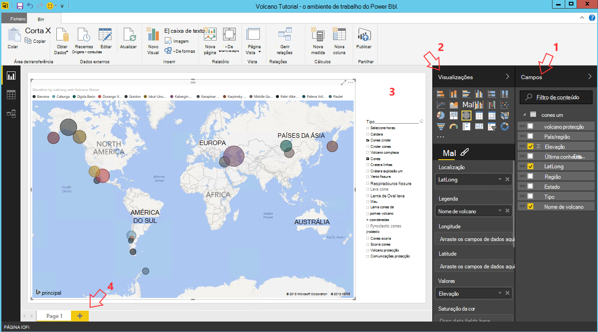

<properties
    pageTitle="Dez que pode fazer no ciência dados Máquina Virtual | Microsoft Azure"
    description="Realizar várias tarefas de modelação e informações detalhadas de dados ciência dados Máquina Virtual."
    services="machine-learning"
    documentationCenter=""
    authors="bradsev"
    manager="jhubbard"
    editor="cgronlun"  />

<tags
    ms.service="machine-learning"
    ms.workload="data-services"
    ms.tgt_pltfrm="na"
    ms.devlang="na"
    ms.topic="article"
    ms.date="08/29/2016"
    ms.author="gokuma;weig;bradsev" />

# <a name="ten-things-you-can-do-on-the-data-science-virtual-machine"></a>Dez que pode fazer no ciência dados Máquina Virtual

O Microsoft dados ciência Máquina Virtual (DSVM) é um ambiente de desenvolvimento de Ciências poderosa permite-lhe executar várias tarefas de informações detalhadas e modelação de dados. O ambiente já vem concebidos e integrados com várias ferramentas de análise de dados mais populares que tornam mais fácil começar a trabalhar rapidamente com a sua análise para no local, na nuvem ou implementações híbridas. O DSVM trabalha com vários serviços Azure e conseguir ler e processar dados que já estão armazenados no Azure, no armazém de dados do SQL Azure, Azure dados Lake, armazenamento do Windows Azure ou no DocumentDB. Também pode tirar partido outras ferramentas de análise como Azure máquina aprendizagem e o Azure fábrica de dados.


Neste artigo iremos guiá-lo como utilizar o seu DSVM para realizar várias tarefas de ciências de dados e interagir com outros serviços do Azure. Aqui estão algumas das coisas que pode fazer o DSVM:

1. Explorar dados e desenvolver modelos localmente no DSVM utilizando o Microsoft R Server, Python
2. Utilizar um bloco de notas Jupyter para experimentar com os seus dados num browser Python 2, Python 3, Microsoft R a utilizar uma versão de pronto enterprise do R concebido para o desempenho e escalabilidade
3. Operationalize modelos construídos utilizando R e Python no Azure máquina formação para aplicações de cliente podem aceder aos seus modelos utilizando uma interface de serviços web simples
4. Administrar os recursos do Azure utilizando o Azure portal ou Powershell
5. Expandir o espaço de armazenamento e partilha de conjuntos de dados em grande escala / código ao longo de toda a equipa através da criação de um armazenamento de ficheiros do Azure como uma unidade montável no seu DSVM
6. Partilhar o código com a sua equipa utilizar o Github e aceder ao seu repositório utilizando os pré-instalados Git clientes - Git festa, interface gráfica de Git.
7. Aceder a várias Azure dados e a análise de serviços como o armazenamento de Blobs do Azure, Azure dados Lake, Azure HDInsight (Hadoop), Azure DocumentDB, armazém de dados do SQL Azure & bases de dados
8. Criar relatórios e dashboards utilizando o Power BI Desktop pré-instalado na DSVM e implementá-los na nuvem
9. Dimensionar dinamicamente seu DSVM para corresponder às suas necessidades de projeto
10. Instalar ferramentas adicionais no seu computador virtual   


>[AZURE.NOTE] Serão aplicadas taxas de utilização adicionais para muitos dos serviços de armazenamento e a análise de dados adicionais listados neste artigo. Consulte a página [Azure preços](https://azure.microsoft.com/pricing/) para obter detalhes.


**Pré-requisitos**

- Terá de uma subscrição do Azure. Pode inscrever-se para uma gratuito avaliação [aqui](https://azure.microsoft.com/free/).

- As instruções para uma máquina de Virtual ciência de dados no portal do Azure de aprovisionamento estão disponíveis em [criar uma máquina virtual](https://portal.azure.com/#create/microsoft-ads.standard-data-science-vmstandard-data-science-vm).

## <a name="1-explore-data-and-develop-models-using-microsoft-r-server-or-python"></a>1. a explorar dados e desenvolver modelos de utilizar o Microsoft R Server ou Python

Pode utilizar idiomas como R e Python fazer a análise de dados para a direita na DSVM.

Para R, pode utilizar um IDE denominado "Rotação R Enterprise 8.0" que pode ser encontrado no menu Iniciar ou ambiente de trabalho. A Microsoft forneceu bibliotecas adicionais na parte superior do abrir origem/CRAN-R para ativar a capacidade para analisar dados maiores que o tamanho de memória permitido ao efetuar análise por blocos paralela e de análise dimensionável. Também pode instalar um IDE R da sua escolha, como [RStudio](https://www.rstudio.com/products/rstudio-desktop/).

Para Python, pode utilizar um IDE como o Visual Studio Comunidade Edition que tem as ferramentas de Python para a extensão do Visual Studio (PTVS) pré-instalado. Por predefinição, apenas um 2.7 Python básicas está configurado no PTVS (sem qualquer biblioteca analytics como SciKit, Pandas). Para poder ativar Anaconda Python 2.7 e 3.5, terá de fazer o seguinte procedimento:

* Criar ambientes personalizados para cada versão ao navegar para **Ferramentas** -> **Python ferramentas** -> **Python ambientes** e, em seguida, clicando em "**+ personalizado**" no Visual Studio 2015 Comunidade Edition
* Atribua uma descrição e defina os caminhos de prefixo ambiente como *c:\anaconda* para Anaconda Python 2.7 ou *c:\anaconda\envs\py35* para Anaconda Python 3.5
* Clique em **Deteção automática** e, em seguida, **Aplicar** para guardar o ambiente.

Eis o aspeto da configuração de ambiente personalizado no Visual Studio.


Consulte a [documentação de PTVS](https://github.com/Microsoft/PTVS/wiki/Selecting-and-Installing-Python-Interpreters#hey-i-already-have-an-interpreter-on-my-machine-but-ptvs-doesnt-seem-to-know-about-it) para detalhes adicionais sobre como criar Python ambientes.

Agora que está configurados para criar um novo projeto de Python. Navegue até ao **ficheiro** -> **Novo** -> **projeto** -> **Python** e selecione o tipo de aplicação Python que está a criar. Pode configurar o ambiente de Python do projeto atual para a versão pretendida (Anaconda 2.7 ou 3.5): com o botão direito do **ambiente de Python**, selecione **Adicionar/remover Python ambientes**e, em seguida, selecione o ambiente do pretendido para associar ao projeto. Pode encontrar mais informações sobre como trabalhar com PTVS na página de [documentação](https://github.com/Microsoft/PTVS/wiki) do produto.

## <a name="2-using-a-jupyter-notebook-to-explore-and-model-your-data-with-python-or-r"></a>2. utilizando um bloco de notas Jupyter para explorar e modelar os dados com Python ou R

O bloco de notas Jupyter é um ambiente poderoso que fornece um baseado em browser "IDE" para informações detalhadas de dados e modelações. Pode utilizar Python 2, Python 3 ou R (Abrir origem e o servidor da Microsoft R) num bloco de notas Jupyter.

Para iniciar o clique Jupyter bloco de notas sobre o ícone de menu início / ícone ambiente de trabalho intitulado **Jupyter bloco de notas**. No DSVM, também pode navegar para "https://localhost:9999 /" para aceder ao bloco de notas Júpiter. Se pede-lhe uma palavra-passe, utilize as instruções fornecidas na secção de ***como criar uma palavra-passe segura no servidor de bloco de notas Jupyter*** do tópico [aprovisionar o Microsoft dados ciência Virtual Machine](machine-learning-data-science-provision-vm.md) para criar uma palavra-passe segura para aceder ao bloco de notas Jupyter. 

Assim que tiver aberto o bloco de notas, irá ver um diretório que contém alguns blocos de notas de exemplo que estão previamente embalados para o DSVM. Agora, pode:

- Clique no bloco de notas para ver o código.
- Execute cada célula ao premir **SHIFT ENTER**.
- executar o bloco de notas inteiro, clicando numa **célula** -> **Executar**
- Crie um novo bloco de notas clicando no ícone de Jupyter (canto superior esquerdo) e, em seguida, clicar no botão **Novo** no lado direito e, em seguida, selecionar o idioma de bloco de notas (também conhecido como kernels).   


>[AZURE.NOTE] Atualmente suportamos Python 2.7, Python 3.5 e R. O kernel R suporta programação no tanto abrir origem R, bem como a empresa dimensionáveis Microsoft R Server.   


Assim que estiver no bloco de notas pode explorar os dados, criar o modelo, testar o modelo com a sua escolha de bibliotecas.


## <a name="3-build-models-using-r-or-python-and-operationalize-them-using-azure-machine-learning"></a>3. construir modelos que utilizem R ou Python e Operationalize-las utilizando o Azure máquina aprendizagem

Depois de ter criado e validou o seu modelo o próximo passo é normalmente implementá-lo para produção. Isto permite que o cliente aplicações invocar previsões o modelo, um em tempo real ou numa base de modo a lote. Azure de máquina de formação fornece um mecanismos para operationalize um modelo incorporado na R ou Python.

Quando operationalize seu modelo no Azure máquina formação, um serviço web é exposto em que permite que os clientes efetuar chamadas de resto que passam no parâmetros de entrada e recebem previsões do modelo de como resultados.   


>[AZURE.NOTE] Se que ainda não inscrito AzureML, pode obter uma área de trabalho gratuita ou uma área de trabalho padrão ao visitar a home page do [AzureML Studio](https://studio.azureml.net/) e clicar no "Introdução ao".   


### <a name="build-and-operationalize-python-models"></a>Modelos de compilação e Operationalize Python

Eis um fragmento de código desenvolvido num Python Jupyter bloco de notas que cria um modelo simple com a biblioteca saiba SciKit.

    #IRIS classification
    from sklearn import datasets
    from sklearn import svm
    clf = svm.SVC()
    iris = datasets.load_iris()
    X, y = iris.data, iris.target
    clf.fit(X, y)

O método utilizado para implementar os modelos de python Azure máquina formação é moldado previsão do modelo para uma função e decora-la com os atributos fornecidos pela biblioteca de python encontra instalada do Azure máquina formação que indicam o seu ID de área de trabalho de formação do Azure máquina, chave API e a entrada de dados e voltar a parâmetros.  

    from azureml import services
    @services.publish(workspaceid, auth_token)
    @services.types(sep_l = float, sep_w = float, pet_l=float, pet_w=float)
    @services.returns(int) #0, or 1, or 2
    def predictIris(sep_l, sep_w, pet_l, pet_w):
    inputArray = [sep_l, sep_w, pet_l, pet_w]
    return clf.predict(inputArray)

Um cliente agora pode efetuar chamadas para o serviço web. Existem wrappers conveniência que construir os pedidos de REST API. Eis um exemplo de código para consumir o serviço web.

    # Consume through web service URL and keys
    from azureml import services
    @services.service(url, api_key)
    @services.types(sep_l = float, sep_w = float, pet_l=float, pet_w=float)
    @services.returns(float)
    def IrisPredictor(sep_l, sep_w, pet_l, pet_w):
    pass

    IrisPredictor(3,2,3,4)


>[AZURE.NOTE] A biblioteca de aprendizagem do Azure máquina só é suportada no Python 2.7 atualmente.   


### <a name="build-and-operationalize-r-models"></a>Modelos de compilação e Operationalize R

Pode implementar modelos de R criados no ciência Virtual Machine dados ou de outro lugar no Azure máquina formação de forma semelhante ao como o fazer para Python. Respetivos se os passos:

- Crie um ficheiro de settings.json como abaixo para fornecer o seu ID de área de trabalho e auth token.
- Escreva um dispositivo de moldagem para o modelo prever função.
- chamar ```publishWebService``` na biblioteca de aprendizagem do Azure máquina para passar numa bombom a função.  

Eis os fragmentos procedimento e o código que podem ser utilizados para configurar, criar, publicar e consumir um modelo como um serviço web no Azure máquina aprendizagem.

#### <a name="setup"></a>Programa de configuração

1.  Instale o pacote de AzureML R escrevendo ```install.packages("AzureML")``` rotação R Enterprise 8.0 IDE ou seu IDE R.
2.  Transfira RTools a partir de [aqui](https://cran.r-project.org/bin/windows/Rtools/). Precisa de utilitário de compressão o caminho (e zip.exe com nome) para operationalize seu pacote R para AzureML.
3.  Criar um ficheiro de settings.json num diretório chamado ```.azureml``` em seu diretório e introduza os parâmetros da área de trabalho Azure ML:

Settings.JSON estrutura de ficheiro:

    {"workspace":{
    "id"                  : "ENTER YOUR AZUREML WORKSPACE ID",
    "authorization_token" : "ENTER YOUR AZUREML AUTH TOKEN"
    }}


#### <a name="build-a-model-in-r-and-publish-it-in-azure-ml"></a>Criar um modelo no R e publicá-lo em Azure ML

    library(AzureML)
    ws <- workspace(config="~/.azureml/settings.json")

    if(!require("lme4")) install.packages("lme4")
    library(lme4)
    set.seed(1)
    train <- sleepstudy[sample(nrow(sleepstudy), 120),]
    m <- lm(Reaction ~ Days + Subject, data = train)

    # Define a prediction function to publish based on the model:
    sleepyPredict <- function(newdata){
        predict(m, newdata=newdata)
    }

    ep <- publishWebService(ws, fun = sleepyPredict, name="sleepy lm", inputSchema = sleepstudy, data.frame=TRUE)

#### <a name="consume-the-model-deployed-in-azure-ml"></a>Consumir o modelo de implementada no Azure ML

Consumir o modelo a partir de uma aplicação de cliente, utilizamos a biblioteca de aprendizagem do Azure máquina para procurar o serviço web publicada nome utilizando a `services` chamada API para determinar o ponto final. Em seguida, apenas ligar a `consume` funcionar e passam a moldura de dados para previstos.
O código seguinte é utilizado para consumir o modelo de publicado como um serviço web de aprendizagem do Azure máquina.


    library(AzureML)
    library(lme4)
    ws <- workspace(config="~/.azureml/settings.json")

    s <-  services(ws, name = "sleepy lm")
    s <- tail(s, 1) # use the last published function, in case of duplicate function names

    ep <- endpoints(ws, s)

    # OK, try this out, and compare with raw data
    ans = consume(ep, sleepstudy)$ans

Podem encontrar mais informações sobre a biblioteca do Azure máquina aprendizagem R [aqui](https://cran.r-project.org/web/packages/AzureML/AzureML.pdf).


## <a name="4-administer-your-azure-resources-using-azure-portal-or-powershell"></a>4. administrar os recursos do Azure utilizando o Azure portal ou Powershell

Não só a DSVM permite-lhe construir a sua solução analytics localmente na máquina virtual, mas também permite-lhe para aceder aos serviços em nuvem Azure da Microsoft. Azure fornece várias cluster, armazenamento, serviços de análise de dados e outros serviços que pode administrar e aceder a partir do seu DSVM.

Administrar os recursos da subscrição e nuvem Azure pode utilizar o browser e aponte para o [Azure portal](https://portal.azure.com). Também pode utilizar o Azure Powershell para administrar a sua subscrição do Azure e recursos através de um script.
Pode executar Azure Powershell a partir de um atalho no ambiente de trabalho ou a partir do menu Iniciar intitulado "Microsoft Azure Powershell". Consulte a [documentação de Microsoft Azure Powershell](../powershell-azure-resource-manager.md) para mais informações sobre como pode administrar a sua subscrição do Azure e recursos utilizando scripts do Windows Powershell.


## <a name="5-extend-your-storage-space-with-a-shared-file-system"></a>5. alargar o seu espaço de armazenamento com um sistema de ficheiros partilhados

Podem partilhar cientistas dados grandes conjuntos de dados, código ou outros recursos da equipa. O DSVM propriamente dito tem cerca de 70GB de espaço disponível. Para expandir o seu armazenamento, pode utilizar o serviço de ficheiro do Azure e quer montagem-na DSVM ou aceder ao mesmo através de um REST API.   


>[AZURE.NOTE] O espaço máximo da partilha Azure Service do ficheiro é de 5TB e o limite de tamanho de ficheiro individual é 1TB.   


Pode utilizar o Azure Powershell para criar uma partilha de serviço de ficheiro do Azure. Eis o script seja executado em Azure o PowerShell para criar uma partilha de ficheiros do Azure de serviço.

    # Authenticate to Azure.
    Login-AzureRmAccount
    # Select your subscription
    Get-AzureRmSubscription –SubscriptionName "<your subscription name>" | Select-AzureRmSubscription
    # Create a new resource group.
    New-AzureRmResourceGroup -Name <dsvmdatarg>
    # Create a new storage account. You can reuse existing storage account if you wish.
    New-AzureRmStorageAccount -Name <mydatadisk> -ResourceGroupName <dsvmdatarg> -Location "<Azure Data Center Name For eg. South Central US>" -Type "Standard_LRS"
    # Set your current working storage account
    Set-AzureRmCurrentStorageAccount –ResourceGroupName "<dsvmdatarg>" –StorageAccountName <mydatadisk>

    # Create a Azure File Service Share
    $s = New-AzureStorageShare <<teamsharename>>
    # Create a directory under the FIle share. You can give it any name
    New-AzureStorageDirectory -Share $s -Path <directory name>
    # List the share to confirm that everything worked
    Get-AzureStorageFile -Share $s


Agora que criou uma partilha de ficheiros Azure, pode montagem-lo em qualquer máquina virtual no Azure. É vivamente recomendado que a VM está na mesma dados Azure centro, tal como a conta de armazenamento para evitar taxas de transferência de latência e os dados. Eis os comandos para a unidade de montagem na DSVM que pode executar no Azure Powershell.


    # Get storage key of the storage account that has the Azure file share from Azure portal. Store it securely on the VM to avoid prompted in next command.
    cmdkey /add:<<mydatadisk>>.file.core.windows.net /user:<<mydatadisk>> /pass:<storage key>

    # Mount the Azure file share as Z: drive on the VM. You can chose another drive letter if you wish
    net use z:  \\<mydatadisk>.file.core.windows.net\<<teamsharename>>


Agora pode aceder a esta unidade tal como faria com qualquer unidade normal a VM.

## <a name="6-share-code-with-your-team-using-github"></a>6. código de partilhar com a sua equipa utilizar o Github

Github é um repositório de código onde pode encontrar muitas exemplo de código e origens para ferramentas diferentes a utilizar tecnologias de vários partilhadas pela Comunidade de programadores. Utiliza Git como a tecnologia para controlar e armazenar versões dos ficheiros código. Github é também uma plataforma onde pode criar o seu próprio repositório para armazenar código partilhado e documentação da sua equipa, implementar o controlo de versão e também controlar quem tem acesso para ver e contribuir código. Visite o [Github ajudar a páginas](https://help.github.com/) para obter mais informações sobre como utilizar Git. Pode utilizar Github como uma das formas para colaborar com a sua equipa, utilize código desenvolvido pela Comunidade e contribuir código novamente para a Comunidade.

O DSVM já é recebida carregado com ferramentas de cliente no ambas as linha de comandos como bem interface gráfica para aceder a Github repositório. A ferramenta de linha de comandos para trabalhar com Git e Github chama Git festa. Visual Studio instalada na DSVM tem as extensões de Git. Pode encontrar ícones de arranque para estas ferramentas no menu Iniciar e o ambiente de trabalho.

Para transferir código a partir de um repositório de Github que irá utilizar o ```git clone``` comando. Por exemplo para transferir o repositório de ciências dados publicado pela Microsoft para o diretório atual pode executar o seguinte comando assim que estiver na ```git-bash```.

    git clone https://github.com/Azure/Azure-MachineLearning-DataScience.git

No Visual Studio, que pode fazer a mesma operação de clonar. A captura de ecrã abaixo mostra como aceder às ferramentas Git e Github no Visual Studio.


Pode encontrar mais informações sobre como utilizar Git para trabalhar com o repositório de Github a partir de vários recursos disponíveis no github.com. [Fazer batota folha](https://training.github.com/kit/downloads/github-git-cheat-sheet.pdf) é uma referência úteis.


## <a name="7-access-various-azure-data-and-analytics-services"></a>7. aceder a vários serviços de dados e análise Azure

### <a name="azure-blob"></a>BLOBs do Azure

BLOBs do Azure são um armazenamento em nuvem fiável, económico para os dados grandes e pequenos. Diga-nos veja como pode mover dados para BLOBs do Azure e acesso a dados armazenados num BLOBs do Azure.

**Pré-requisito**

- **Crie a sua conta de armazenamento de Blobs do Azure a partir do [Azure portal](https://portal.azure.com).**


- Confirme que a ferramenta de AzCopy pré-instalada linha de comandos é encontrada em ```C:\Program Files (x86)\Microsoft SDKs\Azure\AzCopy\azcopy.exe```. Pode adicionar o directório que contém o azcopy.exe para a variável de ambiente de caminho para evitar a escrever o caminho completo comando quando esta ferramenta a ser executado. Para obter mais informações sobre a ferramenta de AzCopy consulte a [documentação de AzCopy](../storage/storage-use-azcopy.md)

- Inicie a ferramenta do Explorador de armazenamento do Azure. Podem ser transferido a partir do [Explorador de armazenamento do Microsoft Azure](http://storageexplorer.com/). 


**Mover dados do VM para BLOBs do Azure: AzCopy**

Para mover dados entre o seu ficheiros locais e armazenamento de BLOBs, pode utilizar AzCopy na linha de comandos ou PowerShell:

    AzCopy /Source:C:\myfolder /Dest:https://<mystorageaccount>.blob.core.windows.net/<mycontainer> /DestKey:<storage account key> /Pattern:abc.txt

Substitua **C:\myfolder** para onde o ficheiro está armazenado, o caminho **mystorageaccount** para o seu nome de conta de armazenamento de BLOBs, **mycontainer** para o nome do contentor, **chave da conta de armazenamento** para a sua chave de acesso de armazenamento de Blobs. Pode encontrar as credenciais da conta de armazenamento no [Azure portal](https://portal.azure.com).


Execute o comando de AzCopy do PowerShell ou a partir de uma linha de comandos. Eis algumas exemplo de utilização do comando AzCopy:


    # Copy *.sql from local machine to a Azure Blob
    "C:\Program Files (x86)\Microsoft SDKs\Azure\AzCopy\azcopy" /Source:"c:\Aaqs\Data Science Scripts" /Dest:https://[ENTER STORAGE ACCOUNT].blob.core.windows.net/[ENTER CONTAINER] /DestKey:[ENTER STORAGE KEY] /S /Pattern:*.sql

    # Copy back all files from Azure Blob container to Local machine

    "C:\Program Files (x86)\Microsoft SDKs\Azure\AzCopy\azcopy" /Dest:"c:\Aaqs\Data Science Scripts\temp" /Source:https://[ENTER STORAGE ACCOUNT].blob.core.windows.net/[ENTER CONTAINER] /SourceKey:[ENTER STORAGE KEY] /S


Depois de executar o comando AzCopy para copiar para uma BLOBs do Azure vir o ficheiro é apresentado no Explorador de armazenamento do Azure brevemente.


**Mover dados do VM para BLOBs do Azure: Explorador de armazenamento do Azure**

Também pode carregar dados a partir do ficheiro local na sua VM através do Explorador de armazenamento do Azure:

- Para carregar os dados a um contentor, selecione o contentor de destino e clique no botão **carregar** .
- Clique no **…** à direita da caixa de **ficheiros** , selecione um ou vários ficheiros para carregue a partir do sistema de ficheiros e clique em **carregar** para começar a carregar os ficheiros.


**Ler os dados a partir de Blobs do Azure: módulo do leitor AML**

No Azure máquina aprendizagem Studio pode utilizar um **módulo de importar dados** para ler dados a partir do seu blob.


**Ler os dados a partir de Blobs do Azure: Python ODBC**

Pode utilizar **BlobService** biblioteca para ler os dados diretamente a partir do blob num programa de Jupyter bloco de notas ou Python.

Em primeiro lugar, importe pacotes necessários:

    import pandas as pd
    from pandas import Series, DataFrame
    import numpy as np
    import matplotlib.pyplot as plt
    from time import time
    import pyodbc
    import os
    from azure.storage.blob import BlobService
    import tables
    import time
    import zipfile
    import random

Em seguida, ligue-as credenciais da conta BLOBs do Azure e ler dados a partir Blob:

    CONTAINERNAME = 'xxx'
    STORAGEACCOUNTNAME = 'xxxx'
    STORAGEACCOUNTKEY = 'xxxxxxxxxxxxxxxx'
    BLOBNAME = 'nyctaxidataset/nyctaxitrip/trip_data_1.csv'
    localfilename = 'trip_data_1.csv'
    LOCALDIRECTORY = os.getcwd()
    LOCALFILE =  os.path.join(LOCALDIRECTORY, localfilename)

    #download from blob
    t1 = time.time()
    blob_service = BlobService(account_name=STORAGEACCOUNTNAME,account_key=STORAGEACCOUNTKEY)
    blob_service.get_blob_to_path(CONTAINERNAME,BLOBNAME,LOCALFILE)
    t2 = time.time()
    print(("It takes %s seconds to download "+BLOBNAME) % (t2 - t1))

    #unzipping downloaded files if needed
    #with zipfile.ZipFile(ZIPPEDLOCALFILE, "r") as z:
    #    z.extractall(LOCALDIRECTORY)

    df1 = pd.read_csv(LOCALFILE, header=0)
    df1.columns = ['medallion','hack_license','vendor_id','rate_code','store_and_fwd_flag','pickup_datetime','dropoff_datetime','passenger_count','trip_time_in_secs','trip_distance','pickup_longitude','pickup_latitude','dropoff_longitude','dropoff_latitude']
    print 'the size of the data is: %d rows and  %d columns' % df1.shape

Os dados são lido num como fotograma de dados:


### <a name="azure-data-lake"></a>Azure dados Lake

Armazenamento de Lake dados Azure é um repositório de escala hyper para dados grande analytics das cargas de trabalho e compatíveis com distribuído ficheiro Hadoop sistema (HDFS). Funciona com o ecossistema Hadoop e a análise do Azure dados Lake. Mostramos-como pode mover os dados para o arquivo de Lake de dados do Azure e executar análises com Azure dados Lake Analytics.

**Pré-requisito**

- Crie a sua análise de Lake do Azure dados no [Azure portal](https://portal.azure.com).


- As **Ferramentas do Azure dados Lake** no **Visual Studio** encontrado nesta [ligação](https://www.microsoft.com/download/details.aspx?id=49504) já está instalado no Visual Studio Comunidade de edição que se encontra na máquina virtual. Depois de iniciar o Visual Studio e inicie sessão na sua subscrição do Azure, irá ver a sua conta de análise de dados do Azure e armazenamento no painel esquerdo do Visual Studio.


**Mover dados do VM para dados Lake: Azure dados Lake Explorer**

Pode utilizar o **Explorador do Azure dados Lake** para carregar os dados a partir de ficheiros locais no seu computador Virtual ao armazenamento de dados Lake.


Também pode criar uma tubagem de dados para productionize seu movimento de dados para ou a partir do Azure dados Lake utilizando o [Azure dados Factory(ADF)](https://azure.microsoft.com/services/data-factory/). Vamos consulte este [artigo](https://azure.microsoft.com/blog/creating-big-data-pipelines-using-azure-data-lake-and-azure-data-factory/) para orientá-lo através dos passos para criar as tubagens de dados.

**Ler os dados a partir de Blobs do Azure para dados Lake: U SQL**

Se os seus dados encontra-se na armazenamento de Blobs do Azure, pode obter diretamente dados a partir de Blobs do Azure armazenamento consulta U-SQL. Antes de compor a sua consulta U SQL, certifique-se de que a sua conta de armazenamento de Blobs está ligada à sua Lake de dados do Azure. Aceda ao **Azure portal**, encontrar o dashboard do Azure dados Lake análise, clique em **Adicionar origem de dados**, selecione o tipo de armazenamento ao **Armazenamento do Azure** e ligue o seu nome de conta de armazenamento do Azure e chave. Em seguida, pode poderão fazer referência a dados armazenados na conta de armazenamento.


No Visual Studio, pode ler os dados a partir do armazenamento de BLOBs, efetue algumas manipulação de dados, engenharia de funcionalidades e exportar os dados resultantes para Azure dados Lake ou armazenamento de Blobs do Azure. Quando a referência os dados no armazenamento de BLOBs, utilize **wasb: / /**; Quando a referência os dados no Azure dados Lake, utilize **swbhdfs: / /**


Pode utilizar as seguintes consultas de U SQL no Visual Studio:

    @a =
        EXTRACT medallion string,
                hack_license string,
                vendor_id string,
                rate_code string,
                store_and_fwd_flag string,
                pickup_datetime string,
                dropoff_datetime string,
                passenger_count int,
                trip_time_in_secs double,
                trip_distance double,
                pickup_longitude string,
                pickup_latitude string,
                dropoff_longitude string,
                dropoff_latitude string

        FROM "wasb://<Container name>@<Azure Blob Storage Account Name>.blob.core.windows.net/<Input Data File Name>"
        USING Extractors.Csv();

    @b =
        SELECT vendor_id,
        COUNT(medallion) AS cnt_medallion,
        SUM(passenger_count) AS cnt_passenger,
        AVG(trip_distance) AS avg_trip_dist,
        MIN(trip_distance) AS min_trip_dist,
        MAX(trip_distance) AS max_trip_dist,
        AVG(trip_time_in_secs) AS avg_trip_time
        FROM @a
        GROUP BY vendor_id;

    OUTPUT @b   
    TO "swebhdfs://<Azure Data Lake Storage Account Name>.azuredatalakestore.net/<Folder Name>/<Output Data File Name>"
    USING Outputters.Csv();

    OUTPUT @b   
    TO "wasb://<Container name>@<Azure Blob Storage Account Name>.blob.core.windows.net/<Output Data File Name>"
    USING Outputters.Csv();


Após a sua consulta for apresentada no servidor, um diagrama que mostra o estado da tarefa de será apresentado.


**Consultar dados no Lake de dados: U SQL**

Depois do conjunto de dados é penetração para Azure Lake de dados, pode utilizar [linguagem U SQL](../data-lake-analytics/data-lake-analytics-u-sql-get-started.md) para consultar e explorar os dados. Linguagem U SQL é semelhante a T-SQL, mas combina algumas funcionalidades do c# para que os utilizadores possam escrever módulos personalizados, funções definidas pelo utilizador e etc. Pode utilizar os scripts no passo anterior.

Depois da consulta é apresentada ao servidor, tripdata_summary. CSV pode ser encontrada brevemente no **Explorador de Lake Azure dados**, pode pré-visualizar os dados pelo botão direito do rato no ficheiro.


Para ver as informações do ficheiro:


### <a name="hdinsight-hadoop-clusters"></a>HDInsight Hadoop Clusters

Azure HDInsight é um serviço Apache Hadoop, motores, HBase e tempestade gerido na nuvem. Pode trabalhar facilmente com Azure HDInsight clusters de máquina dados ciência virtual.

**Pré-requisito**

- Crie a sua conta de armazenamento de Blobs do Azure a partir do [Azure portal](https://portal.azure.com). Esta conta de armazenamento é utilizada para armazenar dados para HDInsight clusters.


- Personalizar o Azure HDInsight Hadoop Clusters a partir do [portal do Azure](machine-learning-data-science-customize-hadoop-cluster.md)

  - Tem de ligar a conta de armazenamento criada com o seu cluster HDInsight quando é criado. Esta conta de armazenamento é utilizada para aceder aos dados que podem ser processados dentro do cluster.


  - Tem de ativar o **Acesso remoto** para o nó do cluster de cabeça após ter sido criada. Lembre-se as credenciais de acesso remoto que especificar aqui (diferentes das especificadas para o cluster na sua criação): terá de lhes abaixo.


  - Crie uma área de trabalho do Azure ML. As experiências de aprendizagem máquina serão armazenadas nesta área de trabalho ML. Selecione as opções realçadas no Portal conforme apresentado na captura de ecrã abaixo.


  - Em seguida, introduza os parâmetros para a área de trabalho do Azure ML


  - Carregar dados utilizando IPython bloco de notas. Importe primeiro os pacotes necessários, plug-in credenciais, criar uma base de dados na sua conta de armazenamento, em seguida, carregar os dados a HDI clusters.


        #Import required Packages
        import pyodbc
        import time as time
        import json
        import os
        import urllib
        import urllib2
        import warnings
        import re
        import pandas as pd
        import matplotlib.pyplot as plt
        from azure.storage.blob import BlobService
        warnings.filterwarnings("ignore", category=UserWarning, module='urllib2')


        #Create the connection to Hive using ODBC
        SERVER_NAME='xxx.azurehdinsight.net'
        DATABASE_NAME='nyctaxidb'
        USERID='xxx'
        PASSWORD='xxxx'
        DB_DRIVER='Microsoft Hive ODBC Driver'
        driver = 'DRIVER={' + DB_DRIVER + '}'
        server = 'Host=' + SERVER_NAME + ';Port=443'
        database = 'Schema=' + DATABASE_NAME
        hiveserv = 'HiveServerType=2'
        auth = 'AuthMech=6'
        uid = 'UID=' + USERID
        pwd = 'PWD=' + PASSWORD
        CONNECTION_STRING = ';'.join([driver,server,database,hiveserv,auth,uid,pwd])
        connection = pyodbc.connect(CONNECTION_STRING, autocommit=True)
        cursor=connection.cursor()


        #Create Hive database and tables
        queryString = "create database if not exists nyctaxidb;"
        cursor.execute(queryString)

        queryString = """
                        create external table if not exists nyctaxidb.trip
                        (
                            medallion string,
                            hack_license string,
                            vendor_id string,
                            rate_code string,
                            store_and_fwd_flag string,
                            pickup_datetime string,
                            dropoff_datetime string,
                            passenger_count int,
                            trip_time_in_secs double,
                            trip_distance double,
                            pickup_longitude double,
                            pickup_latitude double,
                            dropoff_longitude double,
                            dropoff_latitude double)  
                        PARTITIONED BY (month int)
                        ROW FORMAT DELIMITED FIELDS TERMINATED BY ',' lines terminated by '\\n'
                        STORED AS TEXTFILE LOCATION 'wasb:///nyctaxidbdata/trip' TBLPROPERTIES('skip.header.line.count'='1');
                    """
        cursor.execute(queryString)

        queryString = """
                        create external table if not exists nyctaxidb.fare
                        (
                            medallion string,
                            hack_license string,
                            vendor_id string,
                            pickup_datetime string,
                            payment_type string,
                            fare_amount double,
                            surcharge double,
                            mta_tax double,
                            tip_amount double,
                            tolls_amount double,
                            total_amount double)
                        PARTITIONED BY (month int)
                        ROW FORMAT DELIMITED FIELDS TERMINATED BY ',' lines terminated by '\\n'
                        STORED AS TEXTFILE LOCATION 'wasb:///nyctaxidbdata/fare' TBLPROPERTIES('skip.header.line.count'='1');
                    """
        cursor.execute(queryString)


        #Upload data from blob storage to HDI cluster
        for i in range(1,13):
            queryString = "LOAD DATA INPATH 'wasb:///nyctaxitripraw2/trip_data_%d.csv' INTO TABLE nyctaxidb2.trip PARTITION (month=%d);"%(i,i)
            cursor.execute(queryString)
            queryString = "LOAD DATA INPATH 'wasb:///nyctaxifareraw2/trip_fare_%d.csv' INTO TABLE nyctaxidb2.fare PARTITION (month=%d);"%(i,i)  
            cursor.execute(queryString)


- Em alternativa, pode seguir este [tutorial](machine-learning-data-science-process-hive-walkthrough.md) para carregar os dados de veículo pt para HDI cluster. Os passos principais incluem:

    - AzCopy: transferir do CSV compactados do blob público para a sua pasta local
    - AzCopy: carregar deszipado CSV da pasta local para HDI cluster
    - Inicie sessão no nó do Hadoop cluster de cabeça e preparar para análise de dados exploratória

Depois dos dados são carregados para HDI cluster, pode verificar os dados no Explorador de armazenamento do Azure. E tiver uma nyctaxidb de base de dados criada num cluster de HDI.


**Informações detalhadas de dados: ramo de consultas no Python**

Uma vez que os dados estiverem num cluster de Hadoop, pode utilizar o pacote de pyodbc para ligar a dados Hadoop Clusters e consulta utilizando ramo de fazer: informações detalhadas e engenharia de funcionalidades. Pode ver as tabelas existentes que criámos no passo pré-requisitos.

    queryString = """
        show tables in nyctaxidb2;
        """
    pd.read_sql(queryString,connection)


Vamos ver o número de registos em cada mês e frequência dos Inclinado ou não na tabela viagem:

    queryString = """
        select month, count(*) from nyctaxidb.trip group by month;
        """
    results = pd.read_sql(queryString,connection)

    %matplotlib inline

    results.columns = ['month', 'trip_count']
    df = results.copy()
    df.index = df['month']
    df['trip_count'].plot(kind='bar')


    queryString = """
        SELECT tipped, COUNT(*) AS tip_freq
        FROM
        (
            SELECT if(tip_amount > 0, 1, 0) as tipped, tip_amount
            FROM nyctaxidb.fare
        )tc
        GROUP BY tipped;
        """
    results = pd.read_sql(queryString,connection)

    results.columns = ['tipped', 'trip_count']
    df = results.copy()
    df.index = df['tipped']
    df['trip_count'].plot(kind='bar')


Que possamos também calcular a distância entre localização de recolha e dropoff localização e, em seguida, compará-la com a distância de viagem.

    queryString = """
                    select pickup_longitude, pickup_latitude, dropoff_longitude, dropoff_latitude, trip_distance, trip_time_in_secs,
                        3959*2*2*atan((1-sqrt(1-pow(sin((dropoff_latitude-pickup_latitude)
                        *radians(180)/180/2),2)-cos(pickup_latitude*radians(180)/180)
                        *cos(dropoff_latitude*radians(180)/180)*pow(sin((dropoff_longitude-pickup_longitude)*radians(180)/180/2),2)))
                        /sqrt(pow(sin((dropoff_latitude-pickup_latitude)*radians(180)/180/2),2)
                        +cos(pickup_latitude*radians(180)/180)*cos(dropoff_latitude*radians(180)/180)*
                        pow(sin((dropoff_longitude-pickup_longitude)*radians(180)/180/2),2))) as direct_distance
                        from nyctaxidb.trip
                        where month=1
                            and pickup_longitude between -90 and -30
                            and pickup_latitude between 30 and 90
                            and dropoff_longitude between -90 and -30
                            and dropoff_latitude between 30 and 90;
                """
    results = pd.read_sql(queryString,connection)
    results.head(5)


    results.columns = ['pickup_longitude', 'pickup_latitude', 'dropoff_longitude',
                       'dropoff_latitude', 'trip_distance', 'trip_time_in_secs', 'direct_distance']
    df = results.loc[results['trip_distance']<=100] #remove outliers
    df = df.loc[df['direct_distance']<=100] #remove outliers
    plt.scatter(df['direct_distance'], df['trip_distance'])


Agora vamos preparar um conjunto de (1%) reduzidos de dados para modelação. Pode Utilizamos estes dados no módulo de leitor AML.


        queryString = """
        create  table if not exists nyctaxi_downsampled_dataset_testNEW (
        medallion string,
        hack_license string,
        vendor_id string,
        rate_code string,
        store_and_fwd_flag string,
        pickup_datetime string,
        dropoff_datetime string,
        pickup_hour string,
        pickup_week string,
        weekday string,
        passenger_count int,
        trip_time_in_secs double,
        trip_distance double,
        pickup_longitude double,
        pickup_latitude double,
        dropoff_longitude double,
        dropoff_latitude double,
        direct_distance double,
        payment_type string,
        fare_amount double,
        surcharge double,
        mta_tax double,
        tip_amount double,
        tolls_amount double,
        total_amount double,
        tipped string,
        tip_class string
        )
        row format delimited fields terminated by ','
        lines terminated by '\\n'
        stored as textfile;
        """
        cursor.execute(queryString)

        --- now insert contents of the join into the above internal table

        queryString = """
        insert overwrite table nyctaxi_downsampled_dataset_testNEW
        select
        t.medallion,
        t.hack_license,
        t.vendor_id,
        t.rate_code,
        t.store_and_fwd_flag,
        t.pickup_datetime,
        t.dropoff_datetime,
        hour(t.pickup_datetime) as pickup_hour,
        weekofyear(t.pickup_datetime) as pickup_week,
        from_unixtime(unix_timestamp(t.pickup_datetime, 'yyyy-MM-dd HH:mm:ss'),'u') as weekday,
        t.passenger_count,
        t.trip_time_in_secs,
        t.trip_distance,
        t.pickup_longitude,
        t.pickup_latitude,
        t.dropoff_longitude,
        t.dropoff_latitude,
        t.direct_distance,
        f.payment_type,
        f.fare_amount,
        f.surcharge,
        f.mta_tax,
        f.tip_amount,
        f.tolls_amount,
        f.total_amount,
        if(tip_amount>0,1,0) as tipped,
        if(tip_amount=0,0,
        if(tip_amount>0 and tip_amount<=5,1,
        if(tip_amount>5 and tip_amount<=10,2,
        if(tip_amount>10 and tip_amount<=20,3,4)))) as tip_class
        from
        (
        select
        medallion,
        hack_license,
        vendor_id,
        rate_code,
        store_and_fwd_flag,
        pickup_datetime,
        dropoff_datetime,
        passenger_count,
        trip_time_in_secs,
        trip_distance,
        pickup_longitude,
        pickup_latitude,
        dropoff_longitude,
        dropoff_latitude,
        3959*2*2*atan((1-sqrt(1-pow(sin((dropoff_latitude-pickup_latitude)
        radians(180)/180/2),2)-cos(pickup_latitude*radians(180)/180)
        *cos(dropoff_latitude*radians(180)/180)*pow(sin((dropoff_longitude-pickup_longitude)*radians(180)/180/2),2)))
        /sqrt(pow(sin((dropoff_latitude-pickup_latitude)*radians(180)/180/2),2)
        +cos(pickup_latitude*radians(180)/180)*cos(dropoff_latitude*radians(180)/180)*pow(sin((dropoff_longitude-pickup_longitude)*radians(180)/180/2),2))) as direct_distance,
        rand() as sample_key

        from trip
        where pickup_latitude between 30 and 90
            and pickup_longitude between -90 and -30
            and dropoff_latitude between 30 and 90
            and dropoff_longitude between -90 and -30
        )t
        join
        (
        select
        medallion,
        hack_license,
        vendor_id,
        pickup_datetime,
        payment_type,
        fare_amount,
        surcharge,
        mta_tax,
        tip_amount,
        tolls_amount,
        total_amount
        from fare
        )f
        on t.medallion=f.medallion and t.hack_license=f.hack_license and t.pickup_datetime=f.pickup_datetime
        where t.sample_key<=0.01
        """
        cursor.execute(queryString)

Após algum tempo, pode ver que os dados tem sido carregados em Hadoop clusters:

    queryString = """
        select * from nyctaxi_downsampled_dataset limit 10;
        """
    cursor.execute(queryString)
    pd.read_sql(queryString,connection)


**Ler dados a partir HDI utilizando AML: módulo do leitor**

Também pode utilizar o módulo do **leitor** no AML studio para aceder a base de dados num cluster de Hadoop. Plug-in as credenciais da sua HDI clusters e a conta de armazenamento do Azure e que poderá criar modelos de aprendizagem máquina utilizar a base de dados em HDI clusters.


Em seguida, pode ser visualizado o conjunto de dados visita:


### <a name="azure-sql-data-warehouse--databases"></a>Armazém de dados do SQL Azure & de bases de dados

Armazém de dados SQL Azure é um armazém de dados flexível como um serviço de experiência do SQL Server de classe empresarial.

Pode aprovisionar o seu armazém de dados do SQL Azure, seguindo as instruções fornecidas neste [artigo](../sql-data-warehouse/sql-data-warehouse-get-started-provision.md). Depois de aprovisionar o seu armazém de dados do SQL Azure, pode utilizar este [tutorial](machine-learning-data-science-process-sqldw-walkthrough.md) para fazer o carregamento de dados, informações detalhadas e modelação de utilizando dados dentro do armazém de dados do SQL.

#### <a name="azure-documentdb"></a>Azure DocumentDB

Azure DocumentDB é uma base de dados NoSQL na nuvem. -Permite-lhe trabalhar com documentos, tal como JSON e permite-lhe armazenar e os documentos de consulta.

Tem de execute os seguintes passos por requisitos para aceder a DocumentDB a partir de DSVM.

1. Instale DocumentDB Python SDK (executar ```pip install pydocumentdb``` da linha de comandos)
1. Criar conta DocumentDB e documento DB base de dados a partir do [portal do Azure](https://portal.azure.com)
1. Transferir "Ferramenta de migração do DocumentDB" do [aqui](http://www.microsoft.com/downloads/details.aspx?FamilyID=cda7703a-2774-4c07-adcc-ad02ddc1a44d) e extrair para um diretório da sua preferência
1. Importar dados JSON (dados volcano) armazenados num [público blob](https://cahandson.blob.core.windows.net/samples/volcano.json) para DocumentDB com seguir parâmetros de comando para a ferramenta de migração (dtui.exe do diretório onde instalou a ferramenta de migração DocumentDB). Introduza a origem e destino parâmetros de localização abaixo.

    /s:JsonFile /s.Files:https://cahandson.blob.core.windows.net/samples/volcano.json /t:DocumentDBBulk /t.ConnectionString:AccountEndpoint=https://[DocDBAccountName].documents.azure.com:443/; AccountKey = [[chave]; base de dados = volcano /t.Collection:volcano1

Depois de importar os dados, pode ir para Jupyter e abra o bloco de notas intitulado *DocumentDBSample* que contém os códigos de python para aceder a DocumentDB e efetue algumas consultar básica. Pode obter mais informações sobre DocumentDB acedendo a [página de documentação](https://azure.microsoft.com/documentation/learning-paths/documentdb/) do serviço


## <a name="8-build-reports-and-dashboard-using-the-power-bi-desktop"></a>8. criar relatórios e dashboards utilizando o Power BI Desktop

Visualize diga-no ficheiro de Volcano JSON que podemos mostrados no exemplo acima DocumentDB no Power BI para obter informações visuais dos dados. Os passos detalhados estão disponíveis no [artigo Power BI](../documentdb/documentdb-powerbi-visualize.md). Os passos de alto níveis são abaixo:

1. Abra o Power BI Desktop e fazer "Obter dados". Especificar o URL como: https://cahandson.blob.core.windows.net/samples/volcano.json
2. Deverá ver os registos JSON importados como uma lista
3. Converter a lista para uma tabela para que obter possa trabalhar com os mesmos
4. Expanda as colunas ao clicar no ícone de expansão (a que com o ícone "seta para a esquerda e uma seta para a direita" à direita da coluna)
5. Repare que a localização é um campo "Registo". Expanda o registo e selecione apenas as coordenadas. Coordenar é uma coluna de lista
6. Adicionar uma nova coluna para converter a coluna da lista das coordenadas vírgula LatLong coluna separada concatenar dois elementos no campo de lista das coordenadas utilizando a fórmula ```Text.From([coordinates]{1})&","&Text.From([coordinates]{0})```.
7. Por fim converter o ```Elevation``` coluna a decimais e selecione **Aplicar**e **Fechar** .

Em vez de passos acima, pode colar o código seguinte que os scripts iniciativas os passos acima o Editor avançado no obter permite-lhe escrever as transformações de dados num idioma de consulta.


    let
        Source = Json.Document(Web.Contents("https://cahandson.blob.core.windows.net/samples/volcano.json")),
        #"Converted to Table" = Table.FromList(Source, Splitter.SplitByNothing(), null, null, ExtraValues.Error),
        #"Expanded Column1" = Table.ExpandRecordColumn(#"Converted to Table", "Column1", {"Volcano Name", "Country", "Region", "Location", "Elevation", "Type", "Status", "Last Known Eruption", "id"}, {"Volcano Name", "Country", "Region", "Location", "Elevation", "Type", "Status", "Last Known Eruption", "id"}),
        #"Expanded Location" = Table.ExpandRecordColumn(#"Expanded Column1", "Location", {"coordinates"}, {"coordinates"}),
        #"Added Custom" = Table.AddColumn(#"Expanded Location", "LatLong", each Text.From([coordinates]{1})&","&Text.From([coordinates]{0})),
        #"Changed Type" = Table.TransformColumnTypes(#"Added Custom",{{"Elevation", type number}})
    in
        #"Changed Type"


Agora tem os dados no seu modelo de dados do Power BI. O ambiente de trabalho do Power BI deverá ter um aspeto conforme apresentado abaixo.


Pode começar a criação de relatórios e visualizações utilizando o modelo de dados. Pode seguir os passos neste [artigo Power BI](../documentdb/documentdb-powerbi-visualize.md#build-the-reports) para criar um relatório. O resultado final será um relatório com um aspeto semelhante ao seguinte.



## <a name="9-dynamically-scale-your-dsvm-to-meet-your-project-needs"></a>9. dimensionar dinamicamente seu DSVM para corresponder às suas necessidades de projeto

É possível dimensionar para DSVM para corresponder às suas necessidades de projeto. Se não tiver de utilizar a VM na noite ou os fins de semana, apenas pode encerrar a VM a partir do [Azure portal](https://portal.azure.com).

>[AZURE.NOTE]  Irá implicam cluster taxas se também utilizar apenas o botão do sistema operativo encerramento na VM.  

Se precisar de processar alguns análise grande escala e precisa de mais capacidade de CPU e/ou memória e/ou disco, pode encontrar uma vasta gama de tamanhos VM em termos de CPU núcleos, capacidade de memória e tipos de disco (incluindo estado sólido unidades) que cumprem seu cluster e necessidades orçamentais. A lista completa de VMs juntamente com os respetivos hora a hora deve calcular preços está disponível na página [Azure máquinas virtuais preços](https://azure.microsoft.com/pricing/details/virtual-machines/) .

Da mesma forma, se a necessidade de obter a capacidade de processamento de VM reduz (por exemplo: movidos uma carga de trabalho principal para um Hadoop ou para um cluster de motores), pode dimensionar para baixo do cluster a partir do [Azure portal](https://portal.azure.com) e aceder às definições da sua instância VM. Eis uma captura de ecrã.


## <a name="10-install-additional-tools-on-your-virtual-machine"></a>10. instalar ferramentas adicionais no seu computador virtual

Vamos tiver compactado várias ferramentas que recomendamos considerar que poderão resolver muitos dos dados comuns precisa de análise e que deverá poupar-lhe tempo por evitar ter de instalar e configurar os ambientes de um a um e poupar-lhe dinheiro ao pagar apenas para os recursos que utiliza.

Pode tirar partido outros serviços de dados e análise Azure com perfil neste artigo para melhorar o seu ambiente de análise. Compreendemos que em alguns casos às suas necessidades precisem de ferramentas adicionais, incluindo algumas ferramentas de terceiros proprietários. Tem acesso administrativo completo na máquina virtual para instalar novas ferramentas de que precisa. Também pode instalar pacotes adicionais no Python e R que não estejam instalados previamente. Para Python pode utilizar ```conda``` ou ```pip```. Para R pode utilizar o ```install.packages()``` no R console ou utilize o IDE e escolha "**pacotes** -> **Instalar pacotes...**".

## <a name="summary"></a>Resumo
Estes são apenas algumas das coisas que pode fazer no dados ciência Máquina Virtual da Microsoft. Existem muitas mais que pode fazer para torná-lo num ambiente analytics eficaz.
